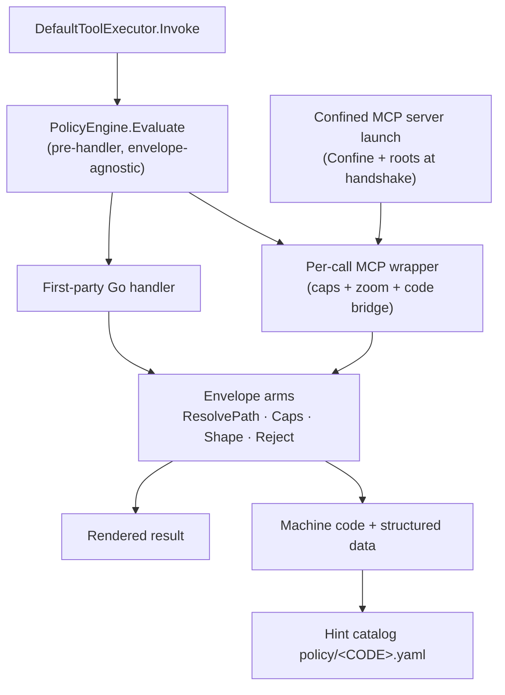

# Adding a tool

How a new tool reaches the agent: first-party operations are Go handlers, external operations are confined MCP servers, and both consume the shared safe-command envelope where their dependency shape permits it. This page is the authoring SSOT for the envelope and the two implementation paths.

**See also:** [Tools](tools.md) · [Extend](extend.md) · [Agent tool feedback](agent-tool-feedback.md) · [Open Agent Rules](open-agent-rules.md) · [Security](security.md)

---

The six read-only analysis tools (`jq`, `grep`, `find`, `list_dir`, `stat`, `wc`) are Go handlers over one host-defined safety envelope. Another first-party analysis tool extends that Go implementation and its catalog surfaces without re-implementing confinement, caps, altitude shaping, or structured rejects. Out-of-tree authors ship an ordinary MCP server; the host supplies confined spawn, `roots`, per-call caps, and the machine-`code` bridge.

| Runtime | Path |
|---------|------|
| First-party Go tools | [`internal/tools/native`](../lycaon/internal/tools/native) and its [family subpackages](package-layering.md#native-tool-family-subpackages) |
| Shared envelope | [`internal/tools/safecmd`](../lycaon/internal/tools/safecmd) |
| Confined MCP | [`internal/mcp`](../lycaon/internal/mcp) (`prepareStdioCommand` + per-call caps, shape, and `mcp_error_code`) |
| Contract guards | `test/contract/architecture/safecmd_envelope_contract_test.go` · `mcp_error_bridge_contract_test.go` |

## Envelope contract

| Arm | What it does | Shared implementation |
|-----|--------------|-----------------------|
| **Confinement** | Roots + egress policy for a spawned MCP server | `safecmd.Confine` / MCP `stdioConfinement` |
| **Path resolution** | Resolve and validate model-supplied paths inside project scope | `safecmd.ResolvePath`, backed by `projectpaths` |
| **Resource caps** | Bound input size, execution time, and result volume | `safecmd.Caps` and named shipping constants |
| **Altitude shaping** | Return a shape or sample instead of an oversized raw dump | `safecmd.Shape`; the zoom strategy stays tool-local |
| **Structured reject** | Return machine `code` plus typed data for recovery | `safecmd.Reject`; catalog policy renders guidance |
| **Gating** | Apply policy or approval before the handler runs | `DefaultToolExecutor.Invoke` → `PolicyEngine.Evaluate` |

## Caps

Every per-tool cap (input bytes, timeout, result and entry ceilings, walk depth, zoom trigger) is a named constant or cap bundle in [`safecmd`](../lycaon/internal/tools/safecmd/safecmd.go). These are shipping caps: re-tune them only as a deliberate product change, never to make one call fit.

Engines and zoom strategies stay tool-local under [`native/`](../lycaon/internal/tools/native). Path helper: [`projectpaths`](../lycaon/internal/tools/projectpaths/projectpaths.go). Confinement primitive: [`confine`](../lycaon/internal/confine/confine.go).

Choose path resolution in `projectpaths` by the effect on the source file. `ResolveRead` reads or inspects it (this is what `safecmd.ResolvePath` calls); `ResolveWrite` changes its contents and records a workspace mutation; `ResolveGitStage` records existing bytes in the Git index without changing the source. Both mutation paths enforce repository, credential, and worker scope. Native file mutators declare the catalog `file_change` capability and submit prepared before/after evidence through `ToolContext.ReviewFileChanges` before committing; that runs ordinary approval policy, including agent-policy and credential-file review, while the resolver refuses only repository metadata and the control plane. The write door revalidates the base after review; never hold a destination lock while awaiting a person. Git staging requires read access and profile scope but does not ask to modify the source bytes.

## Classification: which tools may use the envelope

Membership rule, enforced by an AST scan (`TestEnvelopeOnlyToolsUseSafecmdAST`):

> A tool is **envelope-only** iff its only host dependencies are the `sandbox.Boundary` and `tctx.Roots` (read scope): it reads or analyzes and returns a rendered result. It is **host-coupled** iff it touches live in-process state such as `WorkerCoord`, `tctx.Out.FileEdit`, the session ledger, or the background-process registry.

| Class | Tools | Host dependencies | Implementation |
|-------|-------|-------------------|----------------|
| **Envelope-only** | `jq`, `grep`, `find`, `list_dir`, `stat`, `wc` | Boundary + roots | Go handlers using `safecmd` |
| **Host-coupled** | `read`*, `write`, `edit`, `jq_edit`, `command` | `WorkerCoord`, `Out`, session/ledger, process registry | Go handlers coordinating the additional host lifecycle |

\* `read` is read-only but participates in curation, evidence, and edit tracking, so it remains host-coupled.

`write` calls `tctx.WorkerCoord.BeforeWorkerWrite()` synchronously to reserve paths against sibling workers; `edit` sets `tctx.Out.FileEdit` for the Den edit card. Those dependencies belong in the native subsystem owner rather than behind a wire adapter.

## First-party native Go

A first-party tool has one Go subsystem owner. Envelope-only handlers call `safecmd` for the common boundary and keep only domain logic (parsing, walking, querying, zoom strategy) in their package. Host-coupled handlers additionally receive their live session or process dependencies.

Tool metadata is catalog data under `lycaon/config/packs/painted-wolf/platform/`, not Go prose:

| Concern | Source |
|---------|--------|
| Handler and operation logic | `internal/tools/native` or a family subpackage, registered in `buildNativeRegistry` (`internal/toolhost/runtime.go`) |
| Description and argument schema | `tools/schemas/<name>.yaml` |
| Native family, lifecycle, reversibility, batch policy, and evidence | `tools/native-tools.yaml` |
| Managed-secret reference resolution and its outbound screen | `secret_reference_surface` in `native-tools.yaml`; MCP contracts set `mcp` |
| Agent availability | `tools/profiles/*.yaml` and explicit coordinator surfaces |
| Per-code recovery hint | `policy/<CODE>.yaml` |
| Exact command equivalence and its `USE_*_NATIVE` redirect | `tools/tool-command-equivalence.yaml` + OAR policy |
| MCP failure guidance | OAR conditions over `mcp_error_code` and `mcp_call_ok` |
| Transcript presentation | `tools/tool-presentation.yaml` |

Catalog-backed registration fails when metadata, schema, contracts, and handlers do not close over the same tool name. Hint content lives in the catalog; timing and verdicts ride the Anchor + OAR stack, and selectors use tool identity, reject code, result size, and MCP fact fields, never prose matching.

Declare runner options' actual defaults in their argument schema. Exact command matching validates the original arguments, then omits values equal to those declared defaults for comparison, so new no-op options need no matcher exception, while non-default options with no native representation keep their runner semantics. Execution arguments and evidence are never rewritten by this comparison.

## Confined MCP

An external or arbitrary-logic tool is an ordinary MCP server that the host makes safe-class by how it launches and wraps it.

| Envelope arm | Host enforcement | Author writes |
|--------------|------------------|---------------|
| Confinement | Spawn local stdio under `confine.Confinement{Roots: session roots, Network: policy}` | nothing |
| Path scope | Advertise session roots through the MCP `roots` capability | consume MCP `roots` |
| Caps | Wrap `CallTool` with timeout, output-size limit, and generic oversized-JSON zoom | nothing |
| Reject | Bridge a declared machine `code` to a catalog hint and OAR fact `mcp_error_code` | set `code` in error content |
| Gating | Apply `PolicyEngine.Evaluate` to the registered `mcp_*` tool | declare the tool in its MCP definition |

Confinement and roots apply at server launch; caps, zoom, and the reject/fact bridge apply at each `CallTool`. Remote MCP servers cannot be process-confined, but the host still applies the per-call envelope and advertises roots; network egress remains governed by the proxy.

## Reject-code machine convention

Native Go returns `ToolReject.Code`, normally through `safecmd.Reject`. MCP returns the same kind of declared machine `code` in typed error content. Both resolve through `policy/<CODE>.yaml`; MCP additionally populates `mcp_error_code`. The host never infers a code by matching error prose.

| Allowed machine state | Banned heuristic |
|-----------------------|------------------|
| Read `ToolReject.Code` from a native handler | Match stderr or prose for “timeout” or “not found” |
| Read declared MCP error `code` | Classify an MCP error message by substring |
| Look up `code` in the policy catalog | Ask whether an error “looks like” a category |

Registry and guidance contracts close native reject codes over the hint catalog. An undeclared external error falls back to the generic MCP error contract rather than inventing a meaning.

## Structured command redirects

`USE_*_NATIVE` redirects are OAR policy on `tool.rejected` for free-form command runners, with a structured `habit_redirect_match` and `effect: block`. The command grammar lives in `tool-command-equivalence.yaml`. Before execution, the host parses only that closed grammar, constructs one or more native calls, confirms every call is on the active surface, and validates every argument object against the native schema. It redirects only a lossless translation and returns the validated `replacement_calls`; an inexact command continues through the ordinary command boundary.

The runner envelope around the command line is part of that translation (`internal/toolcommand/command_envelope.go`). Each field is carried onto the native call, dropped because the native tool cannot need it, or refuses the translation because it contradicts the replacement: `cwd` joins onto every project path the call names (`command_replacement_paths.go` is the one list of those arguments), `timeout_ms` becomes the deadline of tools that own one, `capability_request` keeps only the authority a request can use and refuses `direct_ip`, and `env` always refuses. A new path-taking replacement is added to the path list before its grammar.

A tool that a runner habit stands in for is also listed under `request_companions` in `native-tools.yaml`, so `request_tools` loads it beside the runner and the teaching partial can point at it.

Catalog `replaces[].examples` are parser fixtures and may name the intercepted command vocabulary. When that vocabulary should not be taught back to the agent, set `replacement_example` to a first-class native call; generated rejection data uses it instead of the parser fixture. Tool descriptions and OAR copy teach the native capability directly.

`USE_READ_NATIVE` uses the same pre-execution path because equivalent shell reads are otherwise allowed. `confine.ReadHabitFor` parses only catalogued argv grammar and redirects when `read` can serve the exact span. Do not add a reactive stderr matcher or a program denylist to make a redirect fire.

## Author checklist: first-party Go tool

- Classify the tool as envelope-only or host-coupled from its actual dependencies.
- Add the Go handler under `internal/tools/native` or its family subpackage, and register it in `buildNativeRegistry`.
- For envelope-only tools, use `safecmd` for path resolution, caps, shaping, and structured rejects.
- Add `tools/schemas/<name>.yaml` and the `native-tools.yaml` entry.
- Add one `policy/<CODE>.yaml` for every structured rejection.
- Add explicit profile and coordinator-surface membership.
- Add exact command equivalence and its redirect policy when the tool replaces a shell command.
- Add transcript presentation with activity headline and salience.
- Run `./task codegen:native-tool-contracts` and the scoped contract tests.

## Author checklist: confined MCP tool

- Declare a local stdio server and its trust scope in the MCP catalog or overlay.
- Consume the MCP `roots` capability and resolve every path within those roots.
- Declare the input schema and bound timeout and result size.
- Return a declared machine `code` in error content; add its catalog hint and OAR handling.
- Keep gating on registered `mcp_*` identity and structured facts.
- Add launch-confinement, roots, cap, error-bridge, and successful-call tests.
- Document setup and operator-visible behavior in [MCP](mcp.md).
