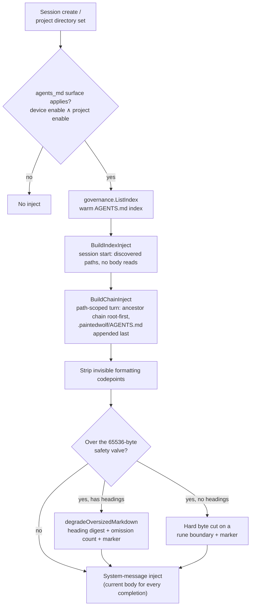

# AGENTS.md standard

How Painted Wolf Code consumes the agents.md open standard in a user's project: discovery, resolution, inject, and reviewed agent edits.

**See also:** [Projects](projects.md) · [Session](session.md) · [Docs map](README.md)

**Machine truth:** `lycaon/internal/governance/` (resolve, inject, degrade) · `lycaon/internal/session/agentsmd_cache.go` · template [`platform/guidance/agents-md.md`](../lycaon/config/packs/painted-wolf/platform/guidance/agents-md.md) · budget `agents_md_inject.max_body_bytes` in [`prompt-budgets.yaml`](../lycaon/config/packs/painted-wolf/platform/host/prompt-budgets.yaml)

---

## Normative references

| Source | Status | Role |
|--------|--------|------|
| [agents.md](https://agents.md) | AAIF / Linux Foundation (Dec 2025) | Canonical filename, plain Markdown, nested files, closest-wins on conflict |
| [agentsmd/agents.md](https://github.com/agentsmd/agents.md) | Spec repo | README-for-agents metaphor; symlink aliases |
| [v1.1 draft proposal](https://github.com/agentsmd/agents.md/issues/135) | **Draft — not ratified** | Jurisdiction, accumulation, precedence, progressive disclosure, optional frontmatter |
| [§ Governance](#governance-write-paths) | Painted Wolf Code policy | Agent edits require explicit human approval of the proposed effect |

The host implements **v1.1 semantics** (jurisdiction, accumulation, precedence) even though v1.1 remains draft.

## Filename and aliases

The host discovers exactly two shapes under an attached root:

| File | Role |
|------|------|
| **`AGENTS.md`** | Canonical filename, at the root and at any depth, one per directory |
| **`<root>/.paintedwolf/AGENTS.md`** | Project-local overlay, appended **last** in the chain so it wins on conflict |

Other filenames and `.paintedwolf/prompt_files` are not aliases for AGENTS.md content. Shipped catalog prompts under `lycaon/config/` are product defaults, not project agent policy.

## Semantics (v1.1 draft)

| Term | Meaning |
|------|---------|
| **Jurisdiction** | A file applies to paths under its directory tree unless a nested file narrows scope |
| **Accumulation** | Ancestor files apply together with descendants; a child adds or overrides and never erases a parent |
| **Precedence** | On conflict, the **closest** file to the working path wins |
| **Progressive disclosure** | Index first; load a nested `AGENTS.md` when work enters that subtree |

Progressive disclosure is what the host does at runtime, not a layout it asks projects to adopt: the session-start index names the discovered files, and a body is read only when work enters that subtree. `AGENTS.md` is plain Markdown; the host does not parse or strip YAML frontmatter.

## AGENTS.md vs rules DSL

| | `AGENTS.md` | `.paintedwolf/rules/*.yaml` |
|--|-------------|------------------------|
| Format | Standard Markdown | Painted Wolf Code rule DSL |
| Purpose | Behavioral guidance for agents | Machine-evaluated deny rules at tool invoke |
| Discovery | File-tree walk | Rules engine at runtime |
| Precedence | v1.1 file-tree precedence (closest wins) | Evaluated after bundled posture rules; a project deny overrides a bundled allow ([`project_overlay.go`](../lycaon/internal/rules/project_overlay.go)) |

Both may apply in one session; they are complementary, not duplicates. Humans edit either in the Files editor or any external editor.

## Runtime inject

Session AGENTS.md index/chain inject runs only when the `agents_md` trust surface applies to the project (device enable and project enable, `surfaceApplies` in [`trust_gate.go`](../lycaon/internal/session/trust_gate.go)). When either switch is off, the host skips inject.

Human AGENTS.md edits are not gated by the surface enable: the Files editor treats the file as ordinary source (`PUT /v1/projects/{id}/source`), so operators can edit repo policy files while session inject is off.

At session create, or when a project directory is set, the sidecar warms an `AGENTS.md` index via `governance.ListIndex` (`WarmAgentsMD`). Coordinator and worker turn assembly then prepend applicable guidance:

1. **Session start** — `BuildIndexInject` names the discovered regular `AGENTS.md` files under the active workspace root without opening their bodies. The walk prunes engine/VCS dirs (`.git`, the project overlay), dot-prefixed directories, and index-only omits (`testdata`, `node_modules`; `ListIndexOmitDir`). Index omit is not the survey walk prune set: a file inside an omitted or hidden tree is still applied by chain resolution when work goes there.
2. **Path-scoped turns** — `BuildChainInject` resolves the ancestor chain for the active relative path, root-first and nearest-last, with `<root>/.paintedwolf/AGENTS.md` appended last so the overlay wins. It re-reads and injects the bounded current body for every completion, so a human edit takes effect on the next turn. A worker with no narrower scope receives the root chain.
3. **Transcript compaction** — AGENTS guidance is assembled outside persisted transcript history and rebuilt from source for every completion. Compaction never summarizes or selectively preserves repository policy.

### Repository policy provenance

The host stamps repository policy with project origin, developer authority, and trusted instruction status, and sanitizes it before model projection ([`agentsmd_inject.go`](../lycaon/internal/governance/agentsmd_inject.go), [`agentsmd_degrade.go`](../lycaon/internal/governance/agentsmd_degrade.go)).

| Control | Behavior |
|---------|----------|
| Sanitize | `textguard.StripInvisibleFormatRunesUntilStable` strips invisible formatting codepoints before injection while preserving tabs and newlines |
| Cap | `CapAgentsMDBody` bounds each body to `agents_md_inject.max_body_bytes` (**65536** UTF-8 bytes). Progressive disclosure loads the **full** body; the cap is a safety valve against a pathologically large file, not a per-turn budget to tune down |
| Degrade | A body over the valve with Markdown headings degrades to a structural digest (`degradeOversizedMarkdown`): whole sections (heading plus a short preview) are kept in document order until the budget runs out, the rest is dropped with an explicit count, and a pointer to the source path is included. A heading-free body, or a budget too small for one section, falls back to a hard byte cut on a rune boundary. Either path appends `…[agents_md_truncated]`; a silently clipped policy file would read as a complete one |
| Full read for the digest | The on-disk read is bounded by a separate structural ceiling (`AgentsMDReadMaxBytes`, 4 MiB) so the digest sees headings across the whole document |
| Order | Sanitize **then** cap: stripping removes bytes, so capping first could cut mid-sequence |
| Not applied to reads | The `read` tool stays byte-faithful; a read/edit round-trip never rewrites a file that legitimately contains these codepoints |
| Filesystem boundary | Discovery accepts regular files only. Body reads use the active-root capability and reject symlinks or paths that leave that root; the read limit is enforced before source bytes enter memory |

## Multi-root

Inject is single-root: it resolves against the session's active workspace root, not every attached root.

| Case | Behavior |
|------|----------|
| One root | Index and inject under that root |
| N roots | Session `workspace_path` / active root only |
| Path outside all roots | No project AGENTS.md inject |
| No-folder project (0 roots) | No filesystem discovery; refreshes when a root attaches |

Each root has independent jurisdiction; there is no cross-root accumulation.

## Governance (write paths)

AGENTS.md is one kind of **agent policy**: a project file a trust surface loads into agent context or host behavior. The others are project skills, prompt overrides, and the overlay's settings files (approvals, limits, MCP providers, extensions, postures, rules, workflows, and scan configuration). `protectedpath.AgentPolicyLocations` declares where each loader reads, and the loaders, the process floor, and the approval gate all consume that one declaration. [`agent_policy_coverage_test.go`](../lycaon/internal/projectcontrib/agent_policy_coverage_test.go) runs the trust scanners over a fully populated project and requires every file they load to be agent policy under its surface.

The shared `.paintedwolf/ignores.yaml` file is part of scan configuration and uses this same write boundary for both its `findings` and `secrets` sections. Reading it has no additional approval requirement.

Agents may propose agent-policy changes; the `agent_policy_change` gate reviews them under the project's posture.

### Write paths

| Actor | Mechanism | Approval |
|-------|-----------|----------|
| Human in Files | The normal source editor, including base-SHA concurrency | No agent approval |
| Human outside the app | Any editor on disk | No agent approval |
| Session agent | Native file tools, editor-document edits, archive extraction, native Git operations, and captured command or fetched output | Approval card with a **View diff** link opening the proposed before/after snapshot in Files |
| Confined command | Explicit `capability_request.write_root` naming one agent-policy file, or the tree a new skill, prompt, rule, or workflow lands in | Approval for that exact command and target; authority exists only in that process boundary |

### Governance rules

1. `agent_policy_change` asks at Balanced and Strict and is silent at Light and with approvals off. It is never a refusal: the host's own state tree is the only write agents never reach.
2. The card faces a chat lease at every posture. Below Strict the lease covers the trust surfaces the change touched (any AGENTS.md, any skill, and so on) for the rest of the chat; at Strict it covers the exact files ([`agent_policy_grants.go`](../lycaon/internal/settings/agent_policy_grants.go)). No day, project, or device lease and no quiet is offered, and a lease granted at Balanced does not cover a change after the project moves to Strict.
3. A file proposal is prepared before asking. Its contents, paths, hashes, and sizes are part of the immutable approval plan (`ApprovalPlan.presentation.file_changes`). Approval releases only the reviewed effect. A changed base requires a new proposal; rejection, cancellation, or expiry leaves the target unchanged.
4. Existing content review, including partial hunk approval, satisfies the requirement for its exact final bytes once within the invoking tool call.
5. File approval uses the shared card and buttons. The diff opens in Files; there is no separate instruction editor. Binary, oversized, and metadata changes carry an explicit preview explanation and content identities where available.
6. Confinement keeps agent-policy files unwritable below every registered project root and each invocation's roots, without the reviewed exception. Files with the same names elsewhere, such as scratch copies, are ordinary because no loader reads them. A reviewed command gets one exact regular-file grant, or a subtree grant inside a tree a loader reads whole, revalidated at launch. Persistent terminals cannot carry this grant across later input; use a native edit or a separate command.
7. When a stage of a confined command fails after naming an agent-policy file, in its arguments or its output, `SANDBOX_TRY_WRITE_ROOT` names the grant to declare, even when the invocation as a whole exits 0. When a Git command updates the index for agent-policy files the sandbox kept unchanged, `SANDBOX_WORKTREE_BEHIND_INDEX` routes the agent to `git_restore`, `delete`, or `edit`.
8. Governance uses structured paths and file effects, never phrase matching or authorship detection. Human editing and Git staging of existing bytes remain ordinary operations.

### Hook points

- Locations: `internal/protectedpath/agent_policy.go`; host predicate and floor specs: `internal/confine/agent_policy.go`.
- Approval gate facts, lease, and predicate: `internal/settings/gate_facts.go`, `internal/settings/agent_policy_grants.go`, `internal/gate/evaluate.go`.
- Prepared file effects and invocation-local review: `internal/tools/file_change_review.go`, native write helpers, editor documents, and `internal/tools/inboundwrite`.
- Process enforcement: `internal/confine/filesystem_rules.go` and exact `PolicyWriteGrants` (`internal/confine/policy_write_grants.go`).

## Related

- [`projects.md`](projects.md) — project roots, trust switches, and the `.paintedwolf/` overlay
- [`security.md`](security.md#untrusted-content-inbound) — inbound untrusted-content containment
- [`agent-contract.md`](agent-contract.md) — structured tool outcomes
