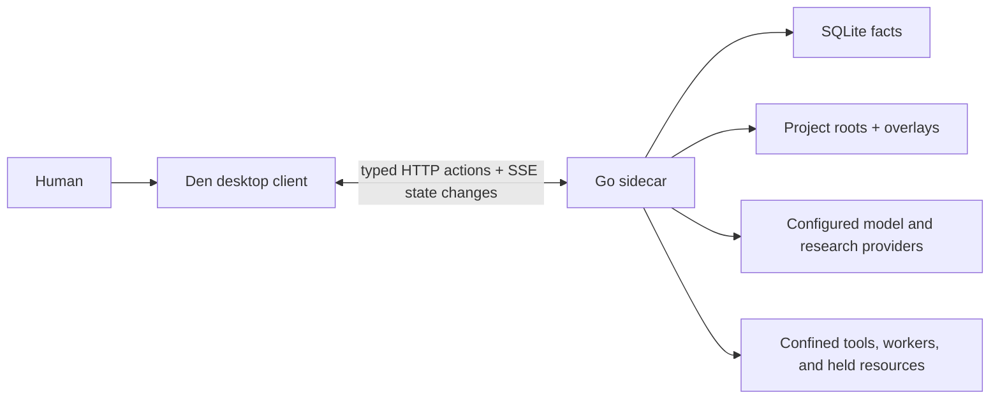
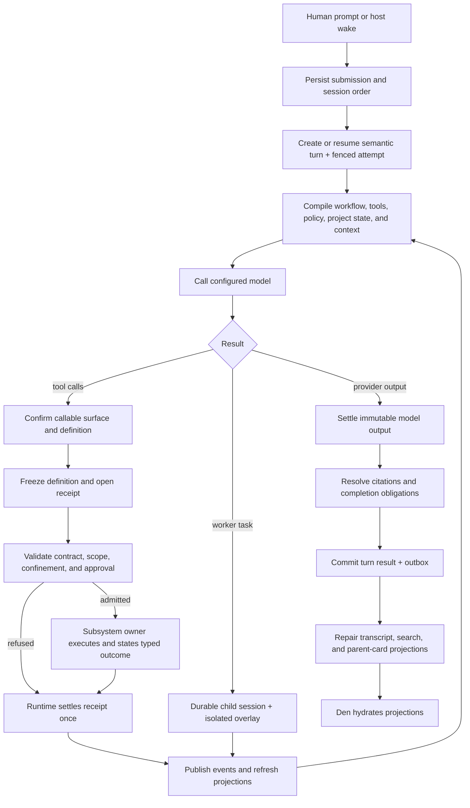
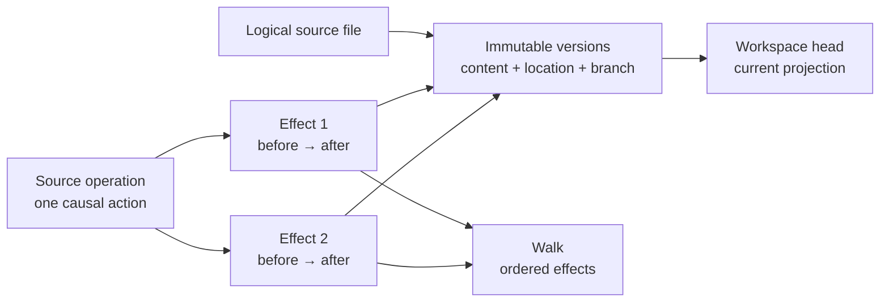

# Architecture

Painted Wolf Code is a local, host-authoritative agent runtime with a desktop client. The host turns a human request into durable workflow state, bounded tool effects, isolated worker activity, evidence, and a recoverable result; the client renders that state and submits explicit actions.

**See also:** [Projects](projects.md) · [Session](session.md) · [Workflows](workflows.md) · [Coordination](coordination.md) · [Security](security.md) · [Host contract](host-contract.md) · [Docs map](README.md)

---

## System shape

| Component | Responsibility | Why |
|-----------|----------------|-----|
| Go sidecar (`lycaon/`) | Sessions, workflows, tools, workers, persistence, providers, confinement, approvals, evidence, and events | These decisions must remain coherent across windows, retries, process interruption, and background work. One host is the authority. |
| Den (`lycaon-den/`) | Rendering, navigation, local interaction state, typed requests, and cache hydration | Presentation can be rebuilt from host projections. It must not become a second policy engine. |

Den is a thin client in the architectural sense: it may implement rich interaction and layout behavior, but it does not infer workflow, approval, grounding, or tool status from transcript prose. The host sends the fields needed to render and act. Native user presence is a device-bound adapter, not a second policy engine: for managed-secret reveal and chat unlock the sidecar owns eligibility, challenge state, version binding, value access, unlock lifetime, and audit, while Tauri owns only the operating-system authentication prompt, an ephemeral signing key bound to the sidecar generation, and reporting when the person steps away.

One sidecar has exclusive authority over one durable fact store. An exclusive store lock is acquired before durable state or background runners open, so in-memory coordination, editor replicas, queues, and recovery all share that authority. The store has one immediate-transaction writer and a bounded read-only WAL pool; checkpoints are passive and signaled by write pressure, and shutdown drains readers before truncating the WAL.

The durable database is not sharded per project. Session, workflow, source, authorization, cost, and artifact transitions cross project boundaries inside real transactions, while home and search projections span projects. Repository-scale bytes do not belong in that fact database: source content is device-wide content-addressed storage, whole-tree snapshots use structurally shared manifests, and rebuildable source-navigation and web indexes use separate databases. Transcript references bind against source locations supplied to the generating model request, and prose linking never waits for repository discovery ([Source navigation](source-navigation.md#repository-scale)). This keeps one transaction domain without making database growth proportional to repository size times observations.

## Core vocabulary

| Term | Meaning |
|------|---------|
| **Host** | One install of the sidecar and its store, identified by a key held in the config directory. |
| **Person** | A human who acts on a host. The host owner holds the device credential; durable authorship names a person. |
| **Client** | One Den window or tab connected to a host. A person may use several clients at once; presence and editing leases belong to clients. |
| **Project** | Durable identity for a body of work. A project may have no folder or one or more attached roots. |
| **Root** | A human-attached filesystem tree. Roots define ordinary project read/write scope and path identity. |
| **Project overlay** | Commit-worthy `.paintedwolf/` content that configures the project: guidance, workflows, rules, Blueprints, and other declared artifacts. Development and release builds use the same directory. |
| **Session** | Durable conversation and execution boundary containing ordered entries, submissions, turns, workflow lineage, workers, evidence, and recovery. It is owned by the person who started it; child sessions share that owner. |
| **Turn** | One semantic response to an admitted human, host, or worker boundary. A turn groups one or more fenced execution attempts. |
| **Attempt** | One process claim on a turn or worker job. Attempts are immutable history after they settle; retry creates another attempt. |
| **Workflow run** | One manifest instance inside a session. It carries the current phase, gates, variables, and human controls. |
| **Phase** | A named workflow state with a tool surface, obligations, and declared ways to leave. |
| **Gate** | A typed proof or human event required for a transition. A gate is evaluated from machine state. |
| **Coordinator** | The root agent turn that investigates, divides work, integrates worker results, and reports to the human. |
| **Worker** | One bounded worker job. Jobs may reuse a child session for conversational continuity, but every turn, message, progress record, result, and grounding audit is keyed to exactly one job. A write worker uses a private overlay until the host promotes it. |
| **Tool** | A structured capability published with schema, execution policy, a subsystem owner, and lifecycle. |
| **Owner** | The single named subsystem whose contract determines the authoritative outcome of an invoked host operation. |
| **Receipt** | Durable record of a tool invocation and its settled outcome. |
| **Evidence** | Host-recorded observation tied to a source, tool call, revision, finding, or artifact. |
| **Source file** | Stable logical identity for one tracked file or directory. Its current path is state, not identity. |
| **Source version** | Immutable state belonging to a source file, including workspace branch, location, content identity, and explicit content availability. |
| **Source operation** | One causal source action, such as an editor save, tool call, promotion, or external observation. |
| **Source effect** | One ordered file consequence of an operation with explicit before and after version ids. Each visible effect is one Walk step. |
| **Grounding** | The process of binding a claim, verdict, or closeout to evidence the host can resolve. |
| **Confinement** | The enforced filesystem, process, and egress boundary applied to an effect. |
| **Approval** | A person's decision over one host-authored action plan. A reusable answer installs a scoped, revocable grant. |
| **Pack** | Versioned collection of declarative contributions. Effective content is resolved before a turn uses it. |
| **Projection** | Derived representation of facts for the model, Den, search, or another consumer. |

These terms name separate concerns. A workflow phase is not a coordination batch phase; a project overlay is not a worker write overlay; a transcript message is not an authorization fact.

Den separates host state from presentation state: a required projection prepares under a scoped boundary and replaces the display as one result, while background refresh retains usable content and local edits. This is a client rendering contract, not another operation lifecycle or source of host truth ([Den presentation and refresh](den.md#presentation-and-refresh)).

---

## One turn loop

The loop has four important properties:

1. **Admission is durable before execution.** Retries and concurrent submissions do not invent a new order. Process retry creates a new attempt under the same semantic turn.
2. **The turn frame is compiled once per iteration.** Prompt assembly, callable tools, workflow guidance, and workflow, posture, and root-scoped policy consume the same snapshot; an invoked owner still validates current domain state at its effect boundary.
3. **Invoked operations cross one owner boundary.** The model proposes structured calls; the host decides whether they are admitted, and the named owner's contract alone determines their executed outcome.
4. **Completion is evidence-aware and transaction-authored.** A model response does not erase open workflow gates, failed verification, pending overlays, or unresolved approvals. Once the command transaction commits an output or result, a later projection read cannot reclassify it as failure.

Root build chat attaches the ambient `implement` workflow. Catalog workflows change the phase graph and human controls, while non-build postures and worker children use posture policy and bounded worker envelopes without creating a separate workflow run. There is no policy-free execution path.

Dispatching a worker ends the current provider response after its declared tool batch. Worker completion, decisions, process exit, scan completion, and similar host facts may admit a later host turn. Background events do not masquerade as new human intent. A failed or interrupted execution holds automatic continuations until a new explicit turn begins. Queued facts and undelivered wait results remain available; they neither retry the failed provider call nor prevent the failed turn from settling.

---

## Subsystem owners

A subsystem owner is the named Go runtime boundary that authoritatively settles one or more host operations. An operation may be a query, a process-local control, a durable mutation, or a long-running job. Each operation names exactly one subsystem owner whose contract determines what happened after execution crosses that boundary.

For an invoked operation, its subsystem owner:

1. accepts the frozen structured input and revalidates current domain preconditions at the point of effect;
2. performs or coordinates every effect required to claim success;
3. states one typed terminal outcome and the evidence or resource reference needed to explain it; and
4. for a mutation or job, controls commit, compensation, and recovery according to the declared lifecycle.

"Complete" does not mean that every subsystem owner mutates durable state. A read-only owner is authoritative for the query's snapshot and result semantics; an ephemeral-control owner is authoritative for that control attempt. It means that no caller, projector, or UI may reconstruct a different terminal answer from rows, logs, or prose.

This is an authority boundary, not a universal base class or package shape. One subsystem owner may implement several operations and may span several Go packages. Helpers and repositories may participate, but they do not become co-owners. If several independently settled operations are invoked, each keeps its own boundary; if one all-or-nothing operation spans several resources, one subsystem owner coordinates the participants. For example, the scanner subsystem owns an invoked scan's durable-job outcome; a source snapshot is an immutable input authority, a security assessment aggregates required scanner outcomes, and a finding set is durable result authority. None is called an owner because none independently settles the invoked operation.

### Qualification test

Use `Owner` in Go names and architecture vocabulary only when all of these are true:

- the operation has an explicit admission point, structured input, and terminal result;
- exactly one subsystem can authoritatively say whether the executed operation completed, failed, or remains recoverable;
- every effect required for success is inside that subsystem's transaction, journal, job, or attempted-effect boundary;
- interruption has one declared meaning, including "no recovery" for read-only or attempted effects; and
- downstream consumers can rely on typed outcome and evidence without inspecting presentation text.

A component that merely stores a child row, holds a lock, computes a projection, caches data, renders state, or performs one step for another subsystem fails this test.

### Subsystem owner, contract, and receipt

The tool runtime makes the separation explicit:

| Part | Responsibility |
|------|----------------|
| Reachability | Confirm the name is callable on the current surface and resolves to one complete definition; failure here selects no owner and creates no receipt. |
| Definition and dispatch | Freeze metadata, schema, handler, owner name, lifecycle, and arguments, then open the receipt. |
| Generic boundary | Check schema, scope, confinement, and approval; it may reject before the owner runs. |
| Subsystem owner | Revalidate domain state, execute the complete operation, and state typed outcome, evidence, and any concrete resource reference. |
| Receipt runtime | Record that the definition was selected and settle its result exactly once, including a pre-owner rejection, a host interruption, or a [host fault](tools.md#tool-lifecycle) when the stated outcome cannot be recorded. |
| Consumers | Render or project the settled facts; they cannot reinterpret the outcome. |

Isolation belongs to the generic boundary. It is not an owner: a confinement or approval stop settles the already-selected operation receipt with `invoked: false` when the owner never ran, or `invoked: true` when the owner had started. That covers a low-level attempted effect that discovered the missing authority, and a review the owner raises at its own effect seam: file-change and process reviews need the prepared change or the resolved processes, so they run inside the owner and settle their refusals as invoked rejections. The typed isolation disposition determines whether a retry can reach approval, reflects a person's decision, or protects the active control plane; it never replaces the operation's owner identity.

The contract's `owner` is the stable subsystem identity, such as `filesystem`, `processes`, or `workflows`. An `owner_ref` narrows attribution to a concrete resource, such as a job or process handle, when one exists; it is not another owner category. `lifecycle` is the recovery promise for that particular operation. The receipt records those claims but is not itself the authority that made them. Owner names are semantic and coarser than tools, handlers, tables, or packages: add a new owner identity only when an operation has terminal or recovery authority that no existing subsystem can honestly provide.

If execution does not survive, the lifecycle determines whether recovery resumes, reconciles, or settles the receipt as interrupted:

| Lifecycle | Promise |
|-----------|---------|
| `read_only` | The owner states a result without product mutation; no recovery is needed |
| `db_transaction` | Related database state and events commit together |
| `journaled_mutation` | Intent is durable before a filesystem effect and startup recovery can settle it |
| `durable_job` | A scheduler controls claim, lease, retry, and terminal state |
| `effect_attempt` | The attempt is recorded without claiming restart recovery |
| `ephemeral_control` | Process-local control acts on a resource whose durable lifecycle belongs to another operation |

The lifecycle is an honest statement of recovery, not a generic wrapper. An external service call is an attempted effect; a worker queue is a durable job; a multi-file promotion needs a journal.

The owner also states its evidence. Consumers never parse a tool-result body to recover success, source revision, or verification status: result bodies may be truncated, compacted, or decorated for presentation.

### Relationship vocabulary

Name each relationship directly:

| Relationship | Term |
|--------------|------|
| A row or object determines a child's lifetime and deletion | Parent, aggregate, or lifetime parent |
| A schema, catalog, or record decides truth | Source of truth or authority |
| A process holds exclusive access | Lock holder, lease holder, or claimant |
| A client coordinates focus, disclosure, animation, or scroll | Controller, coordinator, or view-state holder |
| A named Den scrollport changes application offset | Scroll writer: that host's `ScrollportMotion.commit()` |
| A package contains an implementation | Package or implementation location |
| A person or worker is accountable for work | Assignee or responsible party |

Qualified external terms such as POSIX file ownership and an extension manifest's `own` collision mode retain their domain-specific meanings.

---

## Facts, projections, and caches

The host keeps authoritative facts separate from consumer views:

| Layer | Role | Examples |
|-------|------|----------|
| **Facts** | What happened and what authority exists | Human/host utterance payloads, turn attempts, settled model outputs, tool receipts, worker attempts/results, workflow runs, evidence, approvals, findings |
| **Ordered references** | Stable session narrative order without copying every resource | Typed `session_entries` pointing at transcript slots, model outputs, tool receipts, worker jobs, workflow facts, and host facts |
| **Projections** | A bounded view for one consumer | Execution-backed message fields, model history, Den DTOs, worker cards, board state, search results |
| **Caches** | Rebuildable acceleration | Source catalogs and structural analysis, web index, model and pricing feeds |

The admitted turn head gives each session an explicit current execution identity. After post-turn hooks, the session owner seals its host-resolved closeout and finalizing recovery checkpoint in one transaction, so startup completes a sealed turn without another model request. The closeout is bound to its generating output, with host replacement recorded separately from model authorship; it survives host-only continuations and clears on new user admission. Offline consumers follow those identities rather than selecting a final answer by searching transcript rows.

This distinction permits aggressive prompt fitting and responsive UI hydration without rewriting history. A message row holds the durable payload for an ordinary human or host utterance, but execution-backed fields are projections: it is not the sole proof that a provider output or worker result committed. Den and the model may therefore receive different representations while the durable facts and order remain singular.

Source structural analysis is shared by content identity and semantic filename, not by project or path identity, so editor symbols, definition lookup, briefings, summaries, reads, compaction, and fetched-source formatting reuse one bounded process cache and one in-flight computation for equal source. Changed bytes have a different digest, so the cache needs no mutation invalidation.

The persistence model combines current heads with immutable facts. It is not full event sourcing: opening a large, old project never replays years of events to discover current state. It is also not mutable-row-only storage: process attempts and settled outputs are never overwritten merely because a retry occurred. Indexed keyset reads and bounded pending-projector queues make cost proportional to the requested window or outstanding repair, not total project history. The baseline schema is strict (typed columns, validated JSON, integer nano-dollar money, leading indexes on foreign-key children), and user-scale reads seek by an indexed key or prove a hard candidate bound before filtering in process.

Details: [Prompt assembly](prompt-assembly.md) · [SQL persistence](sql-persistence.md) · [Compatibility](compatibility.md).

---

## Logical-file source history

Source history exists to explain work, independent of Git. It is a sparse durable fact model rather than a second repository index:

A logical file groups its versions. A rename therefore creates a new version with a new location while retaining the same file id, even when the bytes do not change. Delete and recreate at the same path are different identities. Worker writes derive a branch version from the primary file's version, and the file's version dropdown marks which branch each came from.

**Every retained state is selectable, not only the ones an effect produced.** A file's state when it entered tracking, and a pre-image preserved when a change arrived against an unrecorded head, are both real versions with retained bytes. Each version takes its own position on the project's source-history clock, so version listing and Walk share one ordering and one paging cursor. A version no effect produced reports no action, actor, or cause: the ledger kept the state without knowing what produced it, which is a different claim from an empty action.

Collaborative text operations carry participant identities and actor, session, turn, and tool-call attribution into the source ledger at acceptance. A save retains text identity ranges on its real versions and links all contributing operations to one physical effect, so review can select contributions by chat or turn while retaining other chats as context. Publication identity never replaces authorship identity. Agent write bases refer to pinned reads actually delivered to that chat; internal refreshes cannot authorize overwriting newly observed text, and losing a disposable read reference requires another agent read.

Every host-mediated mutation records exact pre- and post-images at the mutation operation boundary. An effect stores both endpoint ids, so Walk and version selection never reconstruct history from the live path, a successor row, or the current filesystem. Moving through Walk selects the effect's post-image in the ordinary file tab and paints the stored before/after change there; selecting **Current** returns to the editable workspace head.

Tracking is sparse. Inventory and source catalogs may describe millions of paths as rebuildable cache state, but they do not mint millions of durable file identities or fake initial edits. A file enters durable history when it is opened, explicitly tracked, changed through a host mutation, exactly reconciled after it was already tracked, or observed changing while one of the project's host-run commands was running. That last door is a command observation window: it spans the command's process, attributes what reconcile passes observe to the command's tool call, and admits only files the window's start inventory did not hold as they are, bounded by the snapshot scope the root declares rather than by a list of tool or file names. Directory moves advance only tracked descendants. Durable growth stays proportional to work a human or agent could later ask to understand: a lockfile the agent's build regenerated is that work; the build's output directory, which the ignore file already excludes, is not.

External and Git-scale churn is reconciled against tracked workspace heads in the background. A bounded `source_changed` batch invalidates projections; incomplete coverage requests reconciliation instead of claiming a partial list is complete. Git is consulted only for the optional **Since last commit** lens and HEAD content. Git commits, rename guesses, and path similarity are never authoritative for file identity or Walk history. The commit lens is a path-based Git comparison, not an effect-history range: Git status supplies staged, unstaged, and untracked membership, its endpoints are the pinned HEAD and live working contents with no retained version id, path pagination is bound to a membership snapshot, and comparisons reject a moved HEAD. Known identities enrich it with recorded history; unseen paths require no admission and create no effects.

Version and effect metadata remain durable when content is too large, binary, or not captured. Retained content is not discarded to satisfy a background byte target. Comparison endpoints report availability explicitly, so the UI can still explain who acted, what operation occurred, where the file was, and which versions were involved without presenting current bytes as historical bytes. File-version queries and Walk are paged.

Tree and comparison presentation share `internal/pagedview`: resource budgets and pins, independent preparation interests, revisions, bounded frames, command receipts, and weighted rank indexes. The host supplies logical row order and extent from one presentation revision; Den computes pixel geometry and renders bounded windows rather than rebuilding repository-sized arrays. Read-only source windows reserve the unloaded part of that logical extent, so fetching or enriching rows never changes a presentation's extent; a tree presentation pins copy-on-write directory pages and disclosure rules so later discovery cannot move its rows, and Den adopts a successor with its destination frame, exact extent, and scroll anchor together. Editable buffers lay out their current local replica, including pending typing, without a host round trip.

The source catalog prepares a lightweight structural inventory when project background work starts; names, kinds, ordered membership, and subtree weights publish independently of metadata and search enrichment, using separate databases and writers. Human browsing includes VCS metadata, ignored directories, and project overlays; search, scans, and agent discovery apply their exclusions at their consumer boundaries without pruning shared structural data. Visibility does not grant write authorization. Filtered rows and sparse Review additions share one temporary SQLite pager across roots and views with a 2 MiB page cache; it disappears when the last retained reference closes or the process exits. A separate bounded receipt journal reserves records before intent changes, so storage failure cannot silently replay an uncertain action. These stores are ephemeral; source versions and user history remain durable.

Details: [Files live layer](files-live.md) · [Files stage](files-stage.md) · [SQL persistence](sql-persistence.md).

---

## Recovery and events

Database-only subsystem owners use transactions. Subsystem owners spanning SQLite and the filesystem use an explicit journal with stable operation identity and startup recovery. Durable schedulers recover claims and leases. Effects that cannot be resumed are settled as interrupted rather than presented as recovered.

State-changing transactions enqueue events through the durable outbox. Delivery is at-least-once, so events update or invalidate a client projection rather than serving as the only copy of state. A complete, workspace-addressed source batch may patch known directory membership directly; an incomplete or overflow event requests bounded reconciliation. Both paths are idempotent. Den deduplicates event ids, and reconnect or unavailable replay ends in authoritative reconciliation.

Editable text is a host-admitted CRDT shared by CodeMirror replicas. The Go document service owns identity, authorization, durable acknowledgements, exact read/save snapshots, and filesystem publication; the Yrs document core owns text convergence and character-identity transformations. The core runs as `pw-document-core`, a native process the host starts beside itself under platform confinement with no network, no writable path but an empty scratch directory, and a fixed memory ceiling; it holds every resident document behind numbered handles and answers one framed request at a time. A crash, timeout, or exhausted ceiling ends that process alone, and documents reload from their accepted checkpoints and journals. Nothing in the engine generates machine code at run time, so it runs under the full hardened runtime with no executable-memory entitlement. The filesystem is a replica whose checkpoint represents the exact last published state: watcher and explicit editor observation use the same host-document transition, outside saves become edits against that checkpoint and merge with accepted and pending typing in the same epoch, and an agent reads an exact shared snapshot and must recompute an edit whose anchored assumptions became stale. Den routes event gaps through the same source invalidation boundary as live events; no client-wide counter stands in for a host content revision.

Document admission is part of opening an editable file. Den has one opening lifecycle for loaded source, encoding changes, and restored tabs; it owns retry timing and file-local failure state and fences completions by file address, source generation, and physical workspace. A failed join preserves the readable source and exposes its error; it never becomes an unexplained view-only mode. Tab descriptors, resident document replicas, and durable recovery records have separate lifecycles: Den admits a bounded working set of bodies and can suspend a dirty tab after preservation without closing it, and huge current-file readers share the source-view protocol over immutable temporary snapshots so their memory does not grow with file length. Semantic undo retains the identity context of each changed span, so superseded replacements cannot resurrect deleted text at collapsed anchors; these guards survive checkpoint compaction and restart. [Files stage](files-stage.md#document-residency-and-recovery) specifies the admission and recovery transitions.

Physical source identity is derived once from project identity plus the canonical attached-root set. Directory browsing, editor view routing, buffers, source events, and agent catalogs use that identity rather than session identity. Durable editor documents and save intents use project, branch, and logical-file identities, so moving an attached root does not fork a draft. Registered worktrees have durable branch identities shared by their bound chats. Source events state whether that identity addresses project roots or a worker workspace; session and job ids remain attribution only.

Live assistant tokens are a projection of an unsettled message. They may be coalesced for display, but searchable transcript state, evidence references, and durable message events wait for settlement.

Startup recovery is a serve gate for structural state. It drains indexed, bounded pages of interrupted turns, missing projections, receipts, worker deliveries, and busy session heads; it does not enumerate project history to discover work. Long-lived runners are supervised independently so one failed background loop does not redefine the state of the host.

---

## Coordination planes

Parallel work uses distinct data planes because they contain different facts and have different lifecycles:

| Plane | Purpose |
|-------|---------|
| Progress | The current execution checklist for the root session |
| Findings | Durable observations workers intentionally share |
| Board | Lightweight orientation assembled from host facts and persisted scan projections |
| Blueprints | Human-reviewable governing documents stored in the project overlay |

Native file tools prepare source attribution in the shared source-mutation journal before applying their confined filesystem effect. Attribution, its source event, and journal completion commit together; an applied file change whose recording fails returns an explicit applied-effect error. Recovery records confirmed effects without replaying agent edits, and an interrupted effect that cannot be confirmed is marked diverged.

Workers receive explicit task envelopes and do not share scratch transcript or write trees. A write worker changes a private overlay; the coordinator and host inspect, verify, and promote it. This allows parallelism without letting concurrent writes silently become one workspace state.

Worker baselines are immutable manifests over the shared source content store, captured from the prepared branch so stacked workers inherit their parent's actual starting state. A completed write worker seals a second manifest, the overlay: every path it changed, with full bodies and tombstones. From then on the branch tree is a cache: the host reclaims it by idle age or under a device-wide byte budget, least recently used first, and every consumer of a branch goes through one lease call that rebuilds a reclaimed tree from baseline plus overlay and holds it on disk until the read is over. Running, held, and unsealed work is never reclaimed. The budget and idle age live in `config/runtime/storage/worker-branches.yaml`; the trees appear as one clearable bucket under Settings → Advanced → Cache.

Search and file navigation read bounded pages of persisted metadata under a pinned generation. A scan reads its generation's manifest and materializes verified bytes in an isolated execution tree; later live edits belong to a successor generation. Watcher errors invalidate their root and withdraw complete coverage, so an incomplete projection reports itself as incomplete. No host-initiated walk costs more than the tree it admits: source capture decides admission at the directory under the source scope and publishes later generations from the watcher's delta, the catalog orders source ahead of generated trees and yields between batches, explicit observation caps record what they refused, and engines receive explicit file lists in bounded chunks ([Scan findings § Source scope](scan-findings.md#source-scope)). What is not observed is recorded, never guessed. Long metadata discoveries publish a readable generation as they go, and a generation that does not yet cover the tree says so rather than reading as an empty one. Page sizes, continuation tokens, and per-surface scope rules belong to [Search](search.md) and [Files live](files-live.md).

Repository orientation is a slow-moving fact: how large a repository is, in which languages, shaped how. It binds to the index generation it was computed from rather than to the tree's change epoch, carries an explicit freshness flag until the walk covers the tree, and re-measures only when discovery completes, when it ages past its revalidation window, or when a root is attached. The catalog admits build artifacts, dependencies, and hidden project files rather than filtering by a name list, so what a surface excludes is that surface's declared scope. Exclusions declared in `.paintedwolf/source-scope.yaml` govern agent capture and its context consumers; they do not hide files from human navigation or search, and a human search filter never changes agent policy. Persisted orientation and language observations are rebuildable, bounded in size, and included in the source-observations local-data clearing control.

Details: [Coordination](coordination.md) · [Tools](tools.md#worker-scope-coordination) · [Worker result contract](worker-result-contract.md).

---

## Grounding and host authority

The host makes control decisions from structured observations:

- transcript boundaries and tool-call/result pairing;
- workflow revisions, gates, progress, findings, and worker state;
- tool identity, arguments, contracts, receipts, and reject codes;
- project roots, source generations, confinement facts, and explicit approvals;
- catalog, manifest, OpenAPI, and event-schema fields.

Natural-language user, model, and coordinator text is not a host gate. Prompt text may instruct the model, and detection packs may intentionally match execution-plane command or mediated-egress fields, but the permission floor and workflow state remain systemic.

Grounding follows the same rule. A claim is supported by an evidence handle, source coordinate, verification receipt, finding, or artifact, not by the confidence of the sentence that describes it.

Details: [Grounding](grounding.md) · [Host behavior](dispatch-hints.md) · [Security](security.md) · [Detection packs](detection-packs.md).

### Host decision constraints

The host does **not** use ad-hoc heuristics to drive core behavior. The sidecar never infers intent, grounding, or **floor** gating from user or coordinator **natural language**: no keyword lists, substring `Contains` matchers, phrase classifiers, or “does this look like X?” checks on prose. Anti-drift over the gate layer (`internal/conditions`, `internal/guidance`): [`gate_prose_needle_contract_test.go`](../lycaon/test/contract/sessions/gate_prose_needle_contract_test.go) flags both a prose literal handed to a `strings` matcher and a `[]string` of prose ranged over as a needle list. A needle that reads back a marker the host itself wrote is fine; hoist it to a named constant in [`internal/guidance/host_markers.go`](../lycaon/internal/guidance/host_markers.go) (or `internal/hostmarker` when the reader sits in another package), which is what makes it one vocabulary rather than two spellings.

#### Typed decisions from a local model

A local decision model is model-tier authority, not a host heuristic. The host may ask it typed questions, declared in `decisions.yaml` with their answer shape, thresholds, and deadline, over a state made of host facts and the request in its author's words, and consume the calibrated answers as facts about every unit a turn could carry: which loadable tool schemas join the call, which instruction units stay out of the prompt, and which skill is pre-read (`internal/coordinator/turnload`, `internal/promptunit`). The engine chooses only among what the surface already permits; it never widens a surface, changes a permission floor, or touches approval. Each kind of unit keeps its no-model behaviour as the default and the engine moves it toward the failure the model can recover from: tools load with confidence and are otherwise requestable, instruction units are omitted with confidence and otherwise render. Below a threshold, or with no engine, a decision abstains and the turn runs as if none had been asked. Every decision leaves a receipt with the state, the answers, and the catalog revision, which is also the training record. The engine abstraction is `internal/decide`; the shipped engine is Bialy under `internal/decide/bialy`. [Decision engine](decision-engine.md) maps the pieces and the retraining loop.

#### Protocol and retrieval parsing

Parsers may interpret bytes inside the protocol or retrieval domain they own. The distinction is provenance plus effect: a parser may recover **syntax the producer was explicitly asked to emit**, or rank content for the retrieval request it is serving; it may not promote arbitrary prose into authority or silently change an unrelated control.

| Valid system boundary | Required limits |
|-----------------------|-----------------|
| Declared model wire grammar | A provider profile may declare a fallback tool-call grammar (including Harmony or a complete JSON envelope). The adapter may parse only that declared grammar, only when tools were offered, and must validate the recovered name and arguments against the offered tool schemas. Do not scan ordinary prose for something that merely resembles a call. |
| Standard identifiers and links | URL, path, hash, UUID, media type, and other grammar-defined identifiers may be recognized syntactically. An LLM-proposed URL is a **declared destination**, never an observed or grounded one; following it still crosses the normal egress/approval boundary, and only a live response may establish observation. |
| Search and retrieval text | A search implementation may tokenize, stem, highlight, expand, and rank the structured query and candidate documents. Text-only signals may affect relevance ranking; hard exclusion or authoritative time/identity claims require explicit query fields or provenance-bearing metadata. Search parsing never changes permissions, workflow state, or another tool's controls. |
| External protocol adaptation | Provider, Git, browser, and OS adapters may branch on typed errors, status/exit codes, structured response fields, SDK fault types, or the success/failure of a controlled differential retry. Human-readable error/output text remains diagnostic payload, not a discriminator. If an upstream protocol exposes no structured distinction, preserve an honest generic outcome instead of guessing a more specific one. |
| Host presentation metadata | Den renders outcome, guidance, trust, and connectivity from host-stamped wire facts or from the success/failure boundary of the exact operation it invoked. Host marker text may remain in agent-facing transcript content, but arbitrary tool output cannot self-identify as trusted guidance by reproducing a marker. |

These are closed-purpose parsers, not general permission to classify prose. Their output stays within the named domain, and the structured boundary fact, not a matching phrase, is what downstream code branches on.

#### Permission floors

The same rule covers **permission floors**: do not grow `argv[0]` / program-name denylists in Go to decide command safety, and an enumerated *allow* list is the same mistake wearing the other hat. Command safety comes from a boundary-derived **`Contained`** fact from the same `confine.DefaultConfinement` the executor applies ([`lycaon/internal/confine/`](../lycaon/internal/confine/)). Novel, renamed, or exec-wrapped tools are handled by the Seatbelt / egress boundary, not by list edits in core.

- Default write roots derive from OS conventions (XDG, `Library/Caches`) and never name a tool home (`~/.npm`, `~/.cargo`, `~/go` …): [`standardCacheDataRoots`](../lycaon/internal/confine/package_cache_roots.go). The one bounded exception is [`packageCacheHomeRelRoots`](../lycaon/internal/confine/package_cache_roots.go): package stores that live in the home directory instead of under a cache convention (`~/.bun/install/cache`, `~/.npm/_cacache`, `~/.cargo/registry`, `~/.cargo/git`), whose extracted packages are the same risk class as the XDG and `Library/Caches` build caches already writable at Balanced. Install and `bin` directories are never roots, because what lands there executes outside the sandbox.
- Adding one name so one toolchain works proposes a list that is silently incomplete for every ecosystem nobody named; the boundary already answers it with one 3R card that grants a durable write root.
- Trust-chain honesty for *applying* that profile (control-plane reads, profile delivery, launcher integrity, root parity, egress attribution) rests on path facts, fds, and kernel rules only; no new name/verb/prose matchers.

Anti-drift, one test per clause: [`no_program_name_floor_contract_test.go`](../lycaon/test/contract/security/no_program_name_floor_contract_test.go) walks `internal/confine` and `internal/project` for argv[0]-denylist shapes (forbidden floor idents, program-name `map[string]bool` literals, program-name `switch` on `filepath.Base`); write-root derivation: `write_root_parity_contract_test.go`; ecosystem naming in the runner: `sandbox_recovery_no_npm_special_contract_test.go`; profile-application inputs: `trust_chain_closed_inputs_contract_test.go`; prose matchers: `visual_durable_heuristics_contract_test.go`; executable-holding roots: `default_write_roots_executables_contract_test.go`.

---

## Security boundaries

The host is local, but locality is not authority. Same-user processes, project files, model output, tool arguments, fetched content, and external tool definitions are all inputs with different trust.

Identity is separate from transport. Authentication binds a request to a person, one authorization check admits each operation for that person, and durable facts record the person rather than the window they used.

Security composes rather than collapses these concerns:

1. Attached roots and granted paths define ordinary filesystem scope.
2. Confinement enforces filesystem, process, and network boundaries on agent subprocesses; an approved capability widens it for one action, and host execution removes it.
3. A confined launch carries a lineage: an inherited descriptor that survives fork, exec, and setsid, so a process a command leaves behind stays attributable to it.
4. The egress broker mediates destinations the host can observe. One broker serves the host at a stable address, and the calling process's lineage, not a credential in its environment, decides which action answers for a connection.
5. Approval policy asks or denies based on structured facts at the effect boundary.
6. Detection packs may add an ask; they never replace the floor.
7. Evidence and the authorization ledger record what the host can honestly claim.

A confined subprocess receives an environment derived from its boundary, not from the call that produced it. Two runs of one command under one boundary get identical bytes, because project build systems key their caches on what they were given: an address, a token, or a capture path that changes per invocation turns every build into a cache miss and stops the agent and the person sharing a cache in one checkout. The engine's own namespace never crosses into a child; what a confined process needs, the boundary re-adds by name.

Details: [Security](security.md) · [Authorization](authorization.md) · [Project overlay](project-overlay.md#project-trust).

---

## Machine SSOT

Markdown explains boundaries and reasons; machine sources define complete sets and exact shapes.

| Surface | Source of truth |
|---------|-----------------|
| HTTP wire | [`docs/openapi/`](openapi) → generated `docs/openapi.yaml` |
| Event topic vocabulary | [`docs/openapi/vocab/EventTopic.yaml`](openapi/vocab/EventTopic.yaml), which generates the topic enum, discriminated envelope, and payload schema references |
| Event envelope shape | [`docs/schemas/events/`](schemas/events) |
| Native tool definitions and contracts | `lycaon/config/packs/painted-wolf/platform/tools/` |
| Database | `lycaon/internal/db/schema.sql` and its query layer |
| Workflows, prompts, rules, and policy | `lycaon/config/` plus admitted extension and project layers |
| Den wire clients | Generated TypeScript types and operations plus the Go API structs |
| Host-authored transcript markers | Generated from the host marker catalog |

OpenAPI changes move as one synchronized bundle: modular source, bundled spec, generated Den operations/types, and Go API representations.

---

## Code layout

Each area has one home. The sidecar's import rules are in [Package layering](package-layering.md); Den's source layout is in [Den](den.md#source-layout).

| Area | Location |
|------|----------|
| Composition root | `lycaon/internal/app` builds every subsystem and hands `api.Dependencies` to the HTTP server |
| HTTP transport | `lycaon/internal/api` and its route-family packages ([route families](package-layering.md#http-route-families)) |
| Sessions | `lycaon/internal/session` and its subpackages ([session subpackages](package-layering.md#session-subpackages)) |
| Workflows | `lycaon/internal/workflow` runs; `workflow/definition` parses and validates manifests |
| Models | `lycaon/internal/llm`, with one package per provider protocol ([LLM packages](package-layering.md#llm-packages)) |
| Scanning | `lycaon/internal/scan` and its subpackages ([scan packages](package-layering.md#scan-packages)) |
| Tools | `lycaon/internal/tools` (invocation contracts and registry), `internal/toolexecution` (execution domains), `internal/toolrejection` and `internal/toolfeedback` (refusals), `tools/native` and its families, and `internal/toolhost` (tool service composition) |
| Wire DTOs | `lycaon/pkg/api` |
| Contract tests | `lycaon/test/contract/<domain>/` ([Test strategy](test-strategy.md#contract-organization)) |
| Den | `lycaon-den/src/`: shell, `files/`, `platform/`, `api/`, and feature components |
| Den native shell | `lycaon-den/src-tauri/` |
| Verification runner | `scripts/` and `Taskfile.yml`; runner tests in `scripts/verification_tests/` |

### Organizing code

A maintainer should find a feature, see where its state lives, what it depends
on, and which tests prove it, without reading unrelated code. File counts and
line counts are signals of that, not targets.

- **One file, one question.** A file or package answers one question a
  maintainer asks, such as how X is persisted or how Y renders. Split a file
  that mixes responsibilities; merge files that cannot be understood apart.
- **No fragments.** A small file is fine when it stands alone: a type and its
  methods, one command. A file that exists only because a larger unit was cut
  at an arbitrary line belongs with its sibling. Platform-suffixed and
  generated files stay separate.
- **Explicit, narrow dependencies.** A unit declares what it uses: no context
  bags, no passing a whole `Server` or `Manager`, no setters that copy fields
  into several holders. In Den, a component with props beats a controller with
  a long dependency list, and a `Pick<>` of one owner scope beats a repeated
  interface.
- **No layers on top.** No forwarders, aliases, re-export barrels, or
  accessors added only so another package can reach a field. If a boundary
  needs many accessors, it is in the wrong place.

Deliberate exceptions are the central SQL schema, the keyed policy and notice
catalogs, the native shell's `lib.rs` (the ordered composition root and IPC
table), and generated outputs. [Size budgets](test-strategy.md#size-budgets) ask
for a decision when concentration grows.
