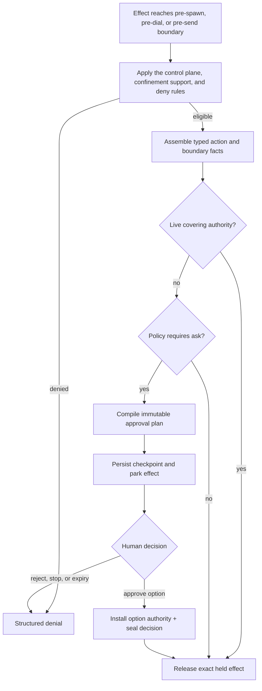

# Authorization

Authorization records what authority existed for a turn, asks a person about concrete effects when needed, installs narrow reusable grants, and preserves tamper-evident decision history for the life of the session.

**See also:** [Security](security.md) · [Tools](tools.md#capability-request) · [Project overlay](project-overlay.md#project-trust) · [Detection packs](detection-packs.md) · [SQL persistence](sql-persistence.md)

**Machine truth:** approval vocabularies under `docs/openapi/vocab/` · approval plans in `lycaon/pkg/api` · policy and copy under `lycaon/config/` · [`internal/gate`](../lycaon/internal/gate), [`internal/hitl`](../lycaon/internal/hitl), [`internal/approvals`](../lycaon/internal/approvals), [`internal/approvalregistry`](../lycaon/internal/approvalregistry), [`internal/approvaloutcome`](../lycaon/internal/approvaloutcome), [`internal/grantedpath`](../lycaon/internal/grantedpath), [`internal/governance`](../lycaon/internal/governance), [`internal/authzcontext`](../lycaon/internal/authzcontext), [`internal/authzledger`](../lycaon/internal/authzledger) · generated tiers and explanations from `lycaon/cmd/codegen-approval-tiers` and `lycaon/cmd/codegen-approval-explanations`

---

## Why authorization is separate from confinement

Confinement answers what a process can physically reach. Authorization answers why a particular effect was allowed, denied, or presented to a person. Neither replaces the other: a grant cannot make an unenforceable boundary safe, confinement cannot prove that a person intended one sensitive action, an audit record does not enforce the action it records, and an approval card must not widen capability beyond the subject it displays.

The host therefore evaluates policy at the effect boundary, compiles one immutable approval plan when a decision is needed, installs authority before releasing the held effect, and records the outcome under the current authorization context.

| Plane | Role |
|-------|------|
| **Enforcement** | Project scope, confinement, protected control-plane sinks, egress broker, and human-authored deny rules determine what may execute |
| **Authorization evidence** | Sealed grant context plus prompted decisions and denials explain the authority under which the turn ran |

The authorization context is the effective grant set at turn start. Authorization events record decisions made under that context. Both are durable facts; neither is reconstructed from transcript or prompt projections.

## Approval pipeline



An open checkpoint coalesces only with the same opaque grant key and exact held subject. The key is a digest over the canonical action and boundary; command arguments never become ledger identifiers. A joiner registers on the open card under that card's resolution lock, so the answer covers every action the card held when the person gave it and nothing that arrived afterwards: a call whose join lands after the decision commits reviews its own action. A prior rejection remains an exact-action denial through restart and until the next explicit user-intent boundary; it does not become a new prompt loop or suppress a genuinely new request. The executor wakes only after the selected option's authority and decision record commit.

When an invocation declares several capabilities, the host prepares their missing permissions before opening a checkpoint. Write roots, protected reads, local service sockets, direct networking, and local networking can share one review. Each enabled duration carries every contributing plan's authority unchanged; permissions with no compatible duration retain separate reviews. Preparing a review does not authorize its held capabilities. After the decision commits, execution rechecks live path grants and socket identities, and a one-action answer remains bound to its exact held subject. A capability discovered only by a later invocation still needs review.

### Approvals for file changes

A prepared file change contributes `presentation.file_changes` to the immutable approval plan. Each entry binds the path, operation, sizes, and content hashes to the reviewed action; the path and before/after text are the screened presentation copy every other card field receives ([Secrets](secrets.md#durable-and-display-redaction)), so a credential file under review is shown and retained with its values screened while the hashes still name the exact bytes. The card shows a **View diff** link opening that snapshot in Files, with the same approval controls as other asks.

Native file mutations defer discretionary asks until the proposed bytes exist. Preparing an out-of-root target conveys no reusable write permission: the final effect must pass approval and revalidate its base. Review waits do not hold destination locks. Explicit content review covers its exact final bytes once, avoiding a second ask for the same change: the review and the gate key the same presentation text, with managed values echoed as their references, and a retry of the same proposal inside one invocation reuses the person's decision rather than asking again.

Agent-policy changes (`agent_policy_change`: project instructions, skills, prompt overrides, and overlay settings) ask at Balanced and Strict and are silent at Light. The card faces a chat lease: at Balanced it covers the changed trust surfaces for the chat, at Strict the exact files, and no quiet or project lease is offered. Command requests name an exact agent-policy file and approve the command's process authority; arbitrary future command output is not presented as a known diff. Credential files (`.env`, keys, registry tokens) reach the gate as protected subjects on write, so they ask where `sensitive_location` does and are never refused. See [AGENTS.md governance](agents-md-standard.md#governance-write-paths).

---

## SSOT map

| Concern | Source of truth |
|---------|-----------------|
| Closed ids and meanings | `docs/openapi/vocab/*.yaml` |
| Gate predicates, posture, and reuse ceilings | `internal/gate` |
| Approval-plan wire shape | `lycaon/pkg/api` and generated Den types |
| Option titles, coverage, expiry, and grouping | Host approval-copy source (`internal/hitl`) |
| Per-rule explanatory copy | Pack policy and notice YAML |
| Card layout and interaction | Shared Den approval shell |
| Durable decision semantics | This page and `internal/authzledger` |

Copy delivered over the wire is not also generated into Den. Closed sets are not repeated in Markdown tables when their vocabulary file already defines them.

---

## Approval policy and leases

| Input | Created by | Meaning |
|-------|------------|---------|
| Policy rule | Device settings, admitted extension, or tighten-only project overlay | Exact structured predicate with `ask` or `deny` effect |
| Approval lease/grant | Host, from one selected approval option | Revocable authority over the reviewed subject, scope, expiry, and boundary witness |

Deny wins before ask: across layers, and inside one layer whatever the breadth or order of the patterns. A broad deny is not narrowed by a more specific ask, an ask on one stage of a compound command does not hide a deny on another, and an admitted extension's ask, which shares the person's layer, cannot shadow the person's deny. Specificity only decides which of several matching asks the card cites. Project and extension policy cannot author allow rules or remove the host floor.

A lease is not a fuzzy memory of consent. Matching uses typed action identity, canonical path/destination sets, project/chat identity, expiry, and the confinement witness that applied when it was granted. A reusable plaintext-secret release additionally requires the exact fingerprint set, destination id, and mediated outbound surface that saw the payload. Changed material facts ask again without deleting the still-valid narrower lease.

Remote package execution and package management use `package_coordinate` leases. The identity includes the package manager operation, ecosystem/system, and each package name and resolved version coordinate, without tying to command-line flags or working directories. A package lease matches on those coordinates, its scope, and its expiry and nothing else: the confinement witness is not part of its identity, because the reduced-environment, registry-only package execution boundary applies to every run regardless. Dependency restore (installing pinned project dependencies) is not gated; package additions and tool installations against configured registries are gated per coordinate at Balanced. Reuse only suppresses the card; that boundary still applies and is stated in every process result.

### Approval plans

Every tool approval checkpoint carries one immutable plan. The plan is the shared source for the action and subject displayed to the human, the reasons and consequences that caused the ask, affirmative options with grouping, coverage, expiry, and disabled state, the recommended face option, host-only authority deltas installed by each option, and durable decision metadata and checkpoint coalescing.

The plan id is derived from canonical content. Loading or resolving a plan whose id no longer matches its content fails closed.

The sole live presentation overlay is monotonic consequence escalation when an identical pending action gains coalesced joiners with a higher consequence. It may raise the card to `high_risk` and supply the matching host-defined consequence line; it cannot alter the reviewed subject, plan options, authority deltas, or recommendation.

Den receives presentation and opaque option ids, not authority deltas. It cannot expand a path, change a destination, or reinterpret “allow for this chat” into a broader grant.

### Approval ladder

Every tool-approval card carries the same four slots in the same order, so a person who has answered one card knows where every rung is on the next. The label carries the gate's verb; the slot never moves.

| Slot | Rung | Intent |
|-----:|------|--------|
| 1 | Once | Continue this exact held action |
| 2 | Day | Reuse a matching subject for 24 hours (`hitl.DayRungTTLSeconds`) |
| 3 | Chat | Reuse for this chat and its workers until the chat is deleted or the grant is revoked in Saved approvals. Stop and restart do not end it |
| 4 | Project or Device | The widest scope the reason permits: project for seven days, or device for thirty days on machine-level subjects (`hitl.ProjectLeaseDuration`, `hitl.DeviceLeaseDuration`) |

A rung the gate cannot reach is not omitted. It stays in its slot, disabled, with a host note saying why (no project is open; this authority lasts only for this chat). Each slot answers to its digit on the keyboard (1, 2, 3, 4).

Secret plans keep those four slots (Send unchanged once / for 1 day / for this chat / for this project) and append their own rows after them: **Send redacted**, which strips the value from this send; **Keep redacting on this device**, the one standing rung that reduces what leaves the machine and so may reach device scope; and, on a model request, **Trust this provider with credentials**, the same device-wide decision Settings → AI providers records. **Protect** (tracked) is the face for a raw detection bound for a model provider, because it is the only choice that leaves the send working and the value protected. Redaction is never the face on any secret card. **Ignore this value in this project…** is a separate contextual file action, not an approval option; it saves a reviewed public fixture declaration to `.paintedwolf/ignores.yaml` and does not release the held send. Which option is faced and how the receiver is named: [Secrets](secrets.md#who-receives-the-send-and-which-option-is-faced); image cards the screen could not read: [Secrets](secrets.md#images-before-perception).

Every card faces **Chat** at every posture. A chat is the unit a person can see, stop, and delete, so its answer is the one they can predict the end of. Project and Device stay in slot 4 as an explicit choice and are never the default. Three cards face something other than a lease duration, because their face is a different kind of answer:

- A raw detection bound for a model provider recommends **Protect**, which keeps the send working and the value protected. A managed value recommends **Send for this chat**.
- A detection-only card recommends the chat acknowledgement of the named rule, because packs warn and do not grant.
- An authority-misuse card recommends its chat quiet.

When the Chat rung is disabled the face falls back to Once. Repeat metadata explains why another card appeared; it is not authority and cannot select a different default.

Mint sites do not choose a visually convenient face that differs from the authority ladder.

### Approval modes

Posture controls which eligible gates ask. It does not alter protected control-plane sinks, human-authored deny rules, confinement, or the accuracy of observed/unobserved reporting. A path inside the app's own state tree is an enforcement deny decided before any gate runs, from the same predicate the path resolver applies ([Security](security.md#credentials-the-agent-drives)); it never becomes a card, so no posture can offer a lease on it. Confinement refusal is an approval tripwire when the capability is representable, not a system-authored judgment that the effect is forbidden.

| Mode family | Effect |
|-------------|--------|
| Light | Fewer judgement asks; systemic boundary and secret controls remain |
| Balanced (default) | Default bounded work is silent; exceptional effects ask |
| Strict | More declared risk gates ask before release |
| Advanced Off (`never_ask`) | Suppress eligible asks and grant requested capabilities; deny rules still apply |

The gate roster each posture enables is `postureGates` in [`gate/posture.go`](../lycaon/internal/gate/posture.go); each posture includes the gates of the less restrictive ones. Posture also selects whether a broader network subject belongs on the face or in the menu (`postureLadder`):

| | Light | Balanced | Strict |
|---|---|---|---|
| Broader network subject | May be primary from the first card | Explicit menu choice | Explicit menu choice |

Broader subjects use structural identities: an exact command's mediated network, a configured destination set, or the endpoints observed during one gathering window. Detection evidence and secret exposure can constrain widening. Asking again never increases authority by itself.

“Off” is not “unconfined”: commands start sandboxed, and leave it only through a requested capability. The sealed context records the posture and grant set even though silent exercises do not produce one event per action.

### Gates

A gate is a pure predicate over typed facts such as containment, subject path, external destination, host resource, MCP identity, secret match, or detection result. Every approval plan names one primary gate and any additional gates that fired on the same held action. Counts may be displayed but never determine whether an ask occurs.

The complete gate roster and one-line meanings live in `docs/openapi/vocab/ApprovalGate.yaml`; reuse and posture policy live in `internal/gate`.

---

## Capability grants and detection asks

A tool may declare exceptional capability before spawn: write root, protected read, listener, loopback connection, direct IP, mediated destination, exact socket, named host resource, process control, or host execution. The request is validated against the tool contract and current platform support. If it is representable, the host adds the relevant approval subject and compiles approved authority into the launch boundary. If it is not representable, launch fails; approval cannot authorize a boundary the host cannot apply.

Local development is contained work ([What stays quiet](security.md#what-stays-quiet-and-why)). Under Light posture, listeners and loopback connections run silently. Under Balanced posture, a listener runs silently unless it names a privileged port, and carries connect authority for the ports it names, unless a listener the chat does not own already holds one. Other loopback connections are silent only when the chat owns every named port: each listener descends from an action of this chat through launch lineage, or a workspace container the engine reports publishes the port loopback-only after the engine started. Ownership is never inferred from when a port appeared or from workspace files; any other service, including one started after the chat, asks to guard against local SSRF. Under Strict posture, every listener and connection requires human approval. See [Loopback-connect grant](security.md#loopback-connect-grant).

Direct IP, host execution, and process control are approved per capability, not per command: one chat approval covers later commands that use it. That approval answers only its own reason; a detection or ask rule on a later command still asks.

Local secret disclosure consolidates command arguments, interactive terminal sessions, and localhost HTTP requests under `LocalRecipient`. Approving a secret release for a local recipient covers all local execution surfaces for the chat without prompting separately for each tool.

Under Light and Balanced posture, a secret the host generated for this chat reaches the chat's own processes, saved files, and loopback HTTP services without a card, recorded as `secret_chat_local_release`. Both conditions are structured facts: capability origin and scope, and the dialed recipient. The release carries no connection consent, so the loopback rules above still decide whether the chat may connect. Strict asks. See [Secrets the chat generated](secrets.md#secrets-the-chat-generated).

Detection packs operate differently. A matching Sigma rule may add an ask over the exact reviewed action. The current-action authority remains exact, and a general host/path grant does not silence a detection about different semantics. A detection-only card recommends an explicit chat acknowledgement of that named pack/rule. Selecting it releases the reviewed action and suppresses later matches of the same rule for that chat; co-firing capability, path, secret, user-policy, or fault gates still require their own covering answer. Rules match execution-plane events; project or transcript prose is not an approval event source.

### What Light posture keeps

The three postures are Light, Balanced, and Strict; **quiet** is a different object, reserved for a saved answer that suppresses a matching ask. Light is the quiet end of the posture dial, not an opt-out. It still keeps confinement and the control-plane floor, hard deny policy, outbound secret screening, changed tool definitions, critical detections, unobserved-channel asks, explicit capability support checks, structured denials and ask faults, and authorization context sealing. What it leaves quiet, such as a protected read a command declares, is listed with its reason in [What stays quiet](security.md#what-stays-quiet-and-why).

A quiet choice suppresses the matching ask for the stated bounded duration only after installing authority or a safe transformation that continues the held effect.

### What Advanced Off turns off

Advanced Off disables eligible prompted asks and allows the effect when enforcement and deny policy permit it. Commands still start in the sandbox, but every capability they request is granted without a card ([why](security.md#what-stays-quiet-and-why)). Deny rules and unsupported-capability rejection still apply. No option or mode may present a direct/unobserved path as mediated merely because the human chose broad authority.

---

## The filesystem axis

| | Attached root | Granted path |
|---|--------------|--------------|
| Created by | Project root attachment | Approval answer |
| Identity | Part of project path addressing | External capability only |
| Lifetime | Until detached | Option scope and expiry |
| Shape | Root tree | Exact path or approved tree according to subject |
| Review surface | Project folders | Approval card and Saved approvals |

Approving access does not edit the person's project definition. Native tools do not extend past attached project folders without an explicit path grant. Filesystem resolution checks attached roots, explicit grants, and the shared default temporary, cache, and tool data boundary. Ordinary scratch access needs no additional outside-folders grant, except that Strict reviews a native write there. Sensitive-location and protected-path rules still apply.

Reaching a folder outside the attached folders always has a route to a card, at every posture; only the control plane is refused without one. The `outside_roots_read` and `outside_roots_write` gates are live at Light, Balanced, and Strict, and the path resolver admits an outside path only through an approved grant, so a posture that left the crossing silent would strand the call. The grant shapes are:

| Crossing | Card subject |
|---|---|
| Native read of a folder outside the attached folders | That folder and everything under it |
| Native read of a file outside the attached folders | The containing folder, or the exact file in the home directory or a sensitive location |
| Command write refused outside its write roots | The enclosing repository work tree, otherwise the containing folder ([Security](security.md#credentials-the-agent-drives)) |
| Native write outside the attached folders | The exact path |

Sensitive and protected targets stay exact even under a broader tree grant. A symlink alias matches only after canonical descriptor-relative resolution proves the same location. Write-root authority expands the subprocess write profile; it does not become an attached root, project label, or evidence path namespace.

Every rung on a write-root card continues the held write through this chat's runtime write root, the same way a local-service lease carries its permit. The Day rung bounds that runtime root to its 24 hours as well as the durable lease; the Chat, Project, and Device rungs keep the runtime root for the chat, the widest scope they name, and add their durable lease for other chats. Like every chat lease, a bounded runtime root stops carrying authority at its deadline and stays listed in Saved approvals with that deadline until it is revoked.

---

## Scope discipline

- Chat authority covers the chat's root session and its workers. It is written to `chat_grants` in the same transaction that commits the approval and replayed into the runtime stores at boot, so Stop and restart do not end it. Deleting the chat deletes it; archiving does not. It never reaches another chat. Stop releases only what one run accumulated: open reviews, denials, and grants the host derived while commands ran.
- Project authority binds stable project identity and expires.
- Cross-project device authority exists only for subjects explicitly defined that way.
- Exact-action authority uses an opaque host-only digest and changes when any material argument changes.
- Set-valued destinations are compared as sets, not model-authored order.
- Neutral presentation arguments may be excluded from identity only when the catalog declares that they cannot change the effect.

Silent covered actions do not produce a syscall audit. The ledger records contexts, prompted decisions, and denials. Saved approvals is the surface for enumerating and revoking live reusable authority.

The composer's open lock leads to Project configuration → Approvals → Saved approvals
when **elevated access** is available: saved direct-network,
host-execution, process-control, and outside-sandbox local-service approvals.
The host selects live records for the root chat and workers plus applicable
project/device records. Host-resource catalog modes and retained exact-action
or quiet boundary descriptors qualify mixed records; revocation removes the
whole record. Ordinary mediated networking, read/write paths, secret handling,
loopback/listening, and process inspection alone do not qualify. Settings labels
the same records and remains the universal saved-approval revocation surface.

The lock is hidden when the current chat's effective Advanced approval policy
is disabled (`never_ask`), including initial loading before that policy is known.
A project may restore asking. Disabling approvals preserves saved records;
re-enabling approvals reveals any applicable elevated access again. The lock
never certifies confinement or represents an invocation-local permission.

Saved approvals lists elevated records first, followed by other approvals grouped
by scope. It includes approvals for the current root chat and workers, this
project, and applicable device approvals; unrelated projects and chats are
excluded. Each row can be revoked individually. The page also offers a
confirmed “Revoke all elevated access” action for the current chat. The host
selects its records again when that action runs, so the displayed list is not
treated as the authority at mutation time.

Shared project/device records are revoked for every consumer. Revocation removes live
authority and durable chat records before reporting success, and does not stop
processes or undo already-issued permission. Running processes may retain
access. Result feedback stays on the approvals page; partial failures remain
visible and can be retried.


---

## Decision write path

Approval resolution is one recoverable authorization transition:

1. Lock and reload the pending checkpoint and immutable plan.
2. Validate the plan identity and selected opaque option.
3. Persist a prepared approval operation.
4. Install each authority delta, retaining operation provenance for rollback.
5. Append the required authorization evidence and commit the checkpoint decision.
6. Publish resolution and wake the held executor.

If installation or decision persistence fails, the operation revokes only authority installed by that prepared operation. Startup recovery applies the same operation-conditional compensation: every runtime store remembers the operation that installed each grant, quiet, or provider trust, and a rollback that does not match leaves the authority in place, so a person's own Settings decision survives an approval that never committed.

Reject, expiry, user stop, and approval are all decisions over the held effect. The tool result receives the terminal decision stamp even when a denied capability occurred inside an otherwise successful process.

---

## Who acted

Every record of a person's act names that person, taken from a structured fact rather than inferred.

- **Decisions name the deciding person.** Checkpoint answers, plan approvals, workflow answers, and rewinds read the request's authenticated caller through `people.Deciding` and refuse without one. Only records the host admits on a person's behalf (a new root chat, prompt admission, editor authorship) may fall back to the host owner; the architecture contract lists each such caller.
- **A chat reply answers as its author.** Pending workflow feedback resolved by a chat message credits the message's `author_person_id`, whichever request delivered it.
- **Agent work carries no caller.** Tool invocations run with the request caller removed, so an effect the agent causes is never recorded as the prompt sender's. A session stop no person requested, such as an agent leaving its workflow, cancels pending checkpoints as `host_stop`, which names nobody.
- **Grants name their approver.** Every installed grant carries `granted_by_person_id` or, under a policy resolution, `granted_by_policy`; durable grants refuse to persist without exactly one. The sealed authorization context snapshots live grants, so a later silent lease hit is attributable to whoever approved the lease.
- **Managed secrets name their people.** A person-authored origin records `created_by_person_id`; revocation records `revoked_by` (person or agent) and the person; each reveal of a person-held value and each chat unlock records the person and the authenticator, and only the person who began a presence challenge can complete it. A held handoff records the unlock it left under.
- **API operations are person actions by declaration.** Every state-changing operation in the OpenAPI catalog declares `x-person-action: record` or `none`, and generation fails without it. The operation seam writes one `person_actions` row per completed recorded call: person, operation, path parameters, status, and any subject ids the handler notes. `none` is for reads sent as POST, previews, exports, checks, cache refreshes, ephemeral presence and view state, read marks, local diagnostics, and the high-frequency editor streams whose own rows name the person. Person actions are append-only and outlive the sessions and projects they name.

Schema contracts keep this true as tables are added: every `people(id)` column is indexed and, when nullable, tied by a `CHECK` to the fact that makes it absent; any `*person_id` column references `people`; and a table whose actor vocabulary names a person (`user`, `human`, `person`, `user_stop`, `restore`) carries a `people(id)` column.

---

## Authorization ledger

The ledger preserves two per-session append-only chains (`authorization_contexts` and `authz_events` in `lycaon/internal/db/schema.sql`):

| Chain | Contents |
|-------|----------|
| Authorization contexts | Effective profile, posture, grants, MCP/tool surface, spawn policy, and lineage at seal time |
| Authorization events | Prompted decisions, denials, capability lifecycle, and other declared authorization outcomes under that context |

The chain is tamper-evident, not tamper-proof. It detects accidental corruption, row edit/reorder, and partial within-session history. It cannot detect whole-database deletion without an external witness, and a same-user attacker controlling the binary can rebuild an unkeyed local chain.

### Hash chain

Each row hashes its version, session identity, sequence, timestamp, canonical payload, and previous row hash. The payload includes `resolver_person_id`, so the person who answered, stopped, or revoked is part of the chain rather than a mutable annotation beside it. Sequence is unique within the session (`UNIQUE (session_id, event_seq)`). Verification rejects missing or unsupported `hash_version` values. Canonical payloads sort object keys, preserve integer precision, and reject invalid JSON values.

Database triggers reject updates on both tables. A session is the chain's lifetime parent, so age-based retention never cuts a live chain in the middle.

### Sealed boundary

The authorization context captures the effective blast radius before the model turn runs: tool profile, posture, effective `never_ask` state, allowed/denied surfaces, command and path policy, MCP generation, spawn roster, worker budget, project/session lineage, durable reusable grants, and chat grants. Turn-ephemeral presentation trims are excluded. A changed material configuration creates a new sealed context rather than rewriting the prior one.

### Fail-closed model

If the host cannot seal the context or record a human checkpoint outcome, the affected action fails closed. A human answer must never take effect without its durable decision evidence. System denials remain effective even if best-effort event append fails; enforcement does not depend on successful audit logging of the denial.

### Event vocabulary

The exact event actions, outcomes, resolution actors, and sources live in `internal/authzledger` and the generated vocabularies. Events distinguish:

- how a prompt was resolved (`resolved_by`: a person, expiry, a system denial, a person's stop, a host stop, or a standing policy) and, when a person acted in that moment, which person (`resolver_person_id`; the schema allows it only for `human` and `user_stop`). Approving a plan option takes one of exactly two resolvers, the deciding person or a policy; a policy resolution must name its pack, unit, and rule, is refused before anything is stored when it does not, and records that identity in the decision detail (`resolver_policy`);
- why an action was authorized;
- what scope the installed authority carries;
- which policy, detection, or capability subject was involved.

Approval-decision detail also retains the checkpoint, immutable plan, action digest, gate and reasons, selected option, installed grant ids, and redaction-safe subject label, so an operator can connect a human choice to the exact reviewed authority without logging secret payloads. Subsequent silent lease hits are not one event per exercise; the sealed context and live grant store already describe the authority.

### Redaction

Authorization detail is redacted by default. Tool name, reject code, effect class, and project-relative paths remain; raw argv and environment require explicit audit opt-in. The ledger and transcript are separate planes: transcript tool output follows commit-boundary secret redaction and local retention; authorization detail follows the audit capture policy.

### Retention

The ledger lives exactly as long as its session; there is no independent age window or retention setting. Deleting the session removes both chains (`ON DELETE CASCADE`) and, in the same deletion transition, revokes any still-live grant whose authority depended on that chain. Durable Blueprint approvals are revoked before their sealing session disappears. This whole-chain lifetime avoids turning routine age deletion into a false integrity break and keeps decisions interpretable beside the session they governed.

### Operator read path

`lycaon-debug authz` is the read-only operator surface; it never starts a sidecar or upgrades a schema:

```text
lycaon-debug authz verify --db /path/to/store.db
lycaon-debug authz events --db /path/to/store.db --session <id> --limit 500
lycaon-debug authz export --db /path/to/store.db --session <id>
lycaon-debug authz person-actions --db /path/to/store.db --limit 500
```

`verify` exits non-zero and prints the first chain break. `events` and `person-actions` emit newest-first JSON, and `export` emits JSONL contexts, events, and final per-chain heads for off-device anchoring. Exported head hashes allow an off-device copy to be compared with the live store; they do not create a remote witness by themselves. There is no general Den audit browser in v1.

---

## High-risk approval band

Approval plans carry a standard or high-risk presentation band. The band is derived from a small machine-defined consequence set (`docs/openapi/vocab/ConsequenceBand.yaml`, `ConsequenceCode.yaml`) and affects emphasis only. It does not change required/denied state, add or remove options, alter reuse, or authorize an effect. Den renders the host band and consequence code without deriving membership from command text.

## Denial guidance

A human may attach explicit guidance when rejecting an action. The guidance is user-authority content delivered with the denied tool result so the agent can choose a different approach. It does not approve a replacement, clear the denial, install a lease, or authorize retry. The stamp follows the tool-call identity so it also reaches a call that completed while one internal capability was denied; where no tool call exists, the refusal carries the guidance directly.

## Invariants

- Confinement and authorization remain separate, composable layers.
- One immutable plan drives display, authority installation, coalescing, and decision evidence.
- Den selects opaque options and never calculates grants.
- Reuse matches typed facts, expiry, scope, and current boundary witness.
- Project and extension policy may ask or deny but never grant.
- Detection action authority is exact; explicit detection acknowledgement is named-rule and chat scoped.
- Human checkpoint outcomes fail closed if they cannot be recorded.
- A decision names the person whose request made it, or it is refused.
- Authorization chains live and die with their session.
