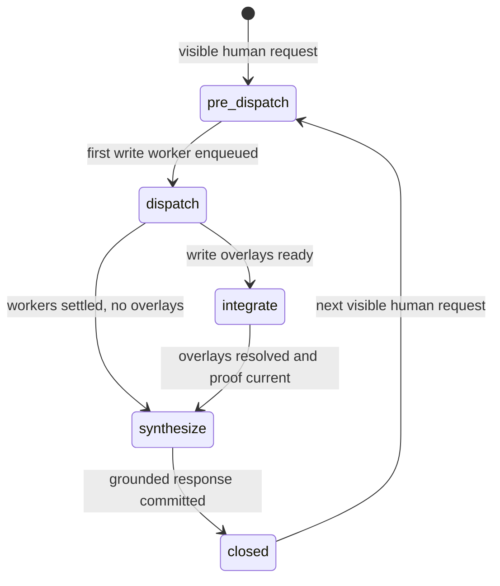

# Coordination

Coordination lets one session use parallel workers without sharing scratch state, racing writes into the project tree, or asking the human to reconstruct what happened from several transcripts.

**See also:** [Architecture](architecture.md#coordination-planes) · [Session](session.md) · [Tools](tools.md#worker-scope-coordination) · [Grounding](grounding.md) · [Worker result contract](worker-result-contract.md)

**Machine truth:** surface routing in `lycaon/config/packs/painted-wolf/platform/host/coordinator-flow.yaml` and `coordinator-surfaces.yaml`, compiled by `lycaon/internal/coordinator/surface/` · workers in `lycaon/internal/worker` and `lycaon/internal/spawn` · delegation in `lycaon/internal/delegation` · worker workspaces in `lycaon/internal/sourceworkspace`

---

## Why workers are isolated

A worker is a durable child session with one bounded assignment. It receives the context required for that assignment, records its own tool calls and evidence, and returns one structured completion envelope. Workers do not share mutable transcript scratch, a common write tree, an implicit understanding of sibling intent, or authority merely because the coordinator has it. Each worker's `@scratch` folder is private to it, so what the coordinator needs comes back in the envelope, not as a scratch path.

Read workers may inspect the full attached project; their declared paths name the assignment focus, not an access-control boundary. Write workers operate on private overlays, and the host promotes observed overlay changes after current verification and conflict review.

Isolation makes the merge boundary explicit and interruption recoverable: a child can remain resumable, partial, or awaiting a decision without converting its uncertainty into parent prose.

## Four planes

| Plane | Question | Durable authority | Human surface |
|-------|----------|---------------|---------------|
| **Progress** | What work remains in this root session? | Session checklist | Progress strip |
| **Findings** | What observation should other workers or the coordinator know? | Findings store | Worklog and review surfaces |
| **Board** | What is true about the project and active work now? | Query-time projection | Board/summary views |
| **Blueprints** | What governing plan has been reviewed? | Project overlay file | Blueprint editor and cards |

A finding does not close a progress item. A checklist is not a governing plan. The board is derived orientation, not a writable notebook.

Progress uses a constrained Markdown checkbox grammar: models author and revise it reliably while one strict parser produces typed rows. The markers are a declared wire syntax, not natural-language classification. Findings require a resolvable evidence or path reference, which keeps the shared plane grounded.

---

## Execution modes

The coordinator changes behavior according to machine state, not the wording of the request:

| Mode | Purpose | Mutation behavior |
|------|---------|-------------------|
| **Investigate** | Understand the request and project, perform bounded direct work, decide whether parallelism helps | The project-scoped mutation surface is reachable only after an explicit request |
| **Orchestrate** | Dispatch, monitor, reconcile, and integrate workers | Write work belongs to worker overlays; the coordinator routes and promotes |
| **Wrap up** | Reconcile proof and produce one grounded result | No new product mutation |

Investigate is the ordinary starting mode. Dispatching the first write worker opens the orchestrated batch. Wrapup becomes eligible only when worker, overlay, progress, and evidence state permit it.

The host compiles the current coordinator surface from workflow phase, worker state, pending overlay state, closeout obligations, and session posture. `coordinator-flow.yaml` is a first-hit decision table over those facts. Posture reaches it through `dispatch_on: posture`: a read-only posture takes the `observe_` counterpart of any destination that would otherwise carry a mutating tool, so the routing holds and only the destination changes. A tool absent from the compiled surface cannot be deferred or requested into the turn; a name the turn does not carry is refused as `COORDINATOR_TOOL_DENIED` before the profile is consulted.

A phase the **host holds**, one waiting on its obligations or topology legs, parks the coordinator, and host-opened turns in it end at their first tool boundary. A person can still ask something meanwhile. Their turn routes to `await_host` whatever surface the phase declares: a read-only surface with no report exit, where the coordinator reads the held work's status (`scan_list`, `pack_board`) and answers in prose. A batch ends only if it moves the run into a hold, so the answer is never cut off at a tool call; the host re-parks the coordinator when the turn ends. The routing fact is `phase_host_held` on the run context, computed by the same predicate that parks.

Each surface declares a **floor** and a **loadable** set. The floor is offered on every model call. Loadable entries name the tools the turn may add, with resource families loading together; whatever is loadable but not loaded is requestable: the call carries one line naming the capabilities that can still load, from each tool's declared activity role in `tool-presentation.yaml`, and never the tool names or descriptions, and a tool loads through `request_tools` by a plain description of the need, or by name when the model knows one. With no engine the map covers the whole loadable set, so the model always knows what kind of help it can ask for. On the investigate surface the floor reads the project and every mutating, running, or delegating tool is loadable, so exploration is the default and mutation is a step the coordinator takes rather than falls into. The split is catalog data in `coordinator-surfaces.yaml`, compiled by `CompileToolPlan` in `internal/coordinator/surface/profile.go`. The same catalog declares how a turn may end: `exit` names the structured finish a surface expects, and `prose_finish` marks the surfaces whose turns may close with grounded prose to the person. Loading is a habit boundary, not a permission one; it does not replace confinement or approval.

What a turn loads beyond the floor is the **load set**, kept per session by `internal/coordinator/turnload`. Once per human request (at a visible user turn, at the start of a worker leg over its brief, or on the wake that first prompts a request the host parked) across all workflows, the host asks its local decision model one question per candidate unit of the surface, declared in `decisions.yaml`, over a compact state (the request, root count, posture, workers in flight, the surface, recent tools): each loadable tool schema loads when its answer clears `load_at` (a confident `answer_only` kind can veto loading when `kind.veto_tools` is on; it ships off), and an instruction unit is omitted only when it is in the installed head's calibrated omittable set and its answer is confidently below `omit_below`. What loads and what stays out persist as the chat's **standing surface** until the next cold boundary: a cold turn's decision replaces it, a warm turn keeps the standing tools and adds its own predictions, `request_tools` adds on any turn, and an omission holds only while every turn since the last cold boundary agrees with it, so a unit shown to be needed comes back. The boundary rules and why they follow the provider's prompt cache are in [Decision engine § The standing surface and the prompt cache](decision-engine.md#the-standing-surface-and-the-prompt-cache). A restart restores the standing surface from the latest receipt, so compaction, a restart, and a rewind each leave exactly what the durable record holds. `skills_read` takes a plain-language need, resolves one skill from the effective catalog, and immediately reads its instructions. A later call with the resolved skill name and a relative `resource` path opens a referenced file. If ranking is unavailable, it returns names and descriptions for explicit selection; passing the returned `discovery.next_need` as `need` pages the fallback catalog without ranking. Healthy no-match results remain concise. Exact-name reads remain available without the engine. The host may read one skill at turn start, and once per turn when the turn first calls a loadable tool it ranks the skills against the request and that tool, reading the best fit or naming it in one line ([Decision engine § Skills](decision-engine.md#skills-preload-lookup-and-the-first-tool-call)); explicit skill lookups remain separate. Receipts record every selection. Prompt text is rendered from the loaded set alone: teaching, procedures, and evidence rules for a tool that is not on the call are not on the call either. Every decision writes a `turn_load_receipts` row with the state it read, the answers it gave, and the catalog revision; the transcript page carries them as `turn_loads` and the `turn_load` event streams new ones, which Den folds into its transcript state by opening message. An absent, disabled, or late engine abstains, and the turn proceeds exactly as it would with no model at all.

## Coordinator batch lifecycle

One visible human request defines one coordination batch and one final synthesis.

Batch phase and execution mode are different vocabularies over the same turn. The batch phase records how far this request has travelled toward one committed answer; the execution mode selects the tool surface. Neither name appears in the other's set.

The batch sequence increases at each visible human intent. Host wakes, worker completions, and guidance injections belong to the existing batch. An open repair condition (failed verification, a partial worker, unresolved progress, or a merge problem) routes back to an investigative surface even if the batch had reached synthesis. Once grounded synthesis is accepted, the batch closes and further background wakes cannot create a second answer for the same request.

---

## Worker task model

Every task declares the role or agent expected to perform it, a bounded brief and completion criteria, read-only or write intent, attached project/root identity and optional suggested paths, optional dependency on an existing overlay, and the evidence and result shape the parent expects. The assignment must be sufficient for a cold child session.

Task paths guide focus only. They do not grant, restrict, or filter reads, mutations, verification, or promotion. Worker permissions come from the tool profile and confinement; promotion uses observed overlay changes.

Committed runnable transitions notify the local claimer immediately; a slower maintenance pass repairs lost notifications and expired leases. The durable queue, workflow holds, claim transaction, and concurrency cap remain authoritative; event delivery is not part of claim eligibility.

A worker job is one semantic unit with a stable child session and, for write work, a stable private workspace. Every claim appends a fenced worker attempt. A transient execution failure or expired lease may return the job to pending within the bounded retry policy; it preserves the child and workspace, closes the old attempt, and starts a new one when reclaimed, reusing the assignment already recorded. Permanent configuration, policy, capacity, and integrity failures settle the job immediately. Retries never write a failed parent summary between attempts.

`needs_decision` is a suspension, not a terminal success. It closes the current attempt as `suspended`, holds the job and workspace with a durable decision checkpoint, and projects that checkpoint to the parent. Resolving the decision starts another attempt on the same job and semantic turn. Only complete, failed, or canceled jobs receive an immutable terminal result. A committed terminal acknowledgement also settles an explicitly subscribed worker wait, including cancellation; unrelated waits and idle parents are not awakened.

### Shared context, dependencies, and findings

`task.shared_context` carries the interface agreements a cold child needs, up to
8192 UTF-8 bytes independently of the 4096-character brief. Coordinators pass the
same relevant contract to collaborating workers. It travels in the pinned
assignment and survives compaction. Read workers see primary; write workers see
a private snapshot captured when execution starts. A sibling path reference does
not make that file available, and resuming a child retains its original snapshot.

`task.after_workers` names up to 32 existing sibling jobs in the same session,
project, and root. The host leaves a consumer pending without occupying a worker
slot until every producer returns `complete` or `open` and all write producers
are promoted. Failed, canceled, partial, or rejected producer output cannot
release the consumer. The host cancels waiting consumers whose producer output
is unusable, including downstream chains, so whole-batch waits can settle.
Repair the producer work and dispatch replacement consumers;
resumed children and stacked overlays cannot declare fresh-primary prerequisites.
Both job selection and the atomic claim enforce readiness. Promotion wakes
claimers, and durable queue reconciliation repairs a missed notification.

`record_finding` requires a reference and accepts a 320-character summary plus
an optional 8192-byte body. Corrections and independent observations at the same
reference are valid. Exact repeated content from the same author is a no-op.
The retired `FINDING_ALREADY_LOGGED` and `FINDING_ECHOES_SIBLING` codes are reserved
and no longer emitted.

Workers receive at most eight finding summaries within a 4096-byte peer-context
budget. The host delivers oldest unread notes first, retaining recent delivered
notes in the remaining space. It records the cursor only after a successful
model response; failed requests replay the same unread page, and restart recovers
the delivered context from one bounded state row per worker. Findings from the current human request that precede a
worker's creation are included; absent a human opener, the boundary is worker
creation. A targeted opener query avoids loading transcript bodies. Overflow remains in the store rather than being
dropped. The inject names its continuation cursor when more unread findings remain.
`pack_board(finding_id)` reads one full finding;
`pack_board(findings_after: 0)` starts ordered summary pagination and returns
`next_after`. Bodies appear in the worklog behind a details disclosure. Peer
findings remain untrusted observations, not host instructions.

### Worker budgets

Every worker has a tool-round ceiling, and one policy governs it whatever the worker's scope. The coordinator sets it: explicitly on `task`, on a planned leg in `fanout_plan`, or by omission, which selects the host default (20 rounds, within a configurable 2–120 range). Sizing belongs to the plan because the planner knows how much ground a leg covers; a leg that surveys a whole subsystem needs more rounds than one that reads a few files.

The host never raises a ceiling on its own. Whether more rounds are worth spending is a judgment about the work, and only two parties hold the facts for it. The worker knows what remains; the coordinator knows what the batch needs. When a worker's runway reaches a third of its ceiling (between 3 and 10 rounds), the host tells it so, early enough for an answer to arrive while rounds remain. A worker that needs more asks with `request_budget`, naming the rounds and the work they cover. The request is durable on the job, one open at a time, and it wakes the coordinator, which answers with `extend_worker_budget` or `decline_worker_budget`. The worker keeps working while the coordinator decides, and the answer reaches it as a host notice on its next round. A request still open when the worker reaches its final round holds that round for a bounded wait, so a late ask is not lost to the race between the two sessions; without an answer the worker returns an honest partial report at its ceiling.

The coordinator sees every fact that waited for it. Guidance about a job, leg, scan, or process queues per subject, so two workers asking for rounds are two kicks, not one. A turn delivers every queued kick in arrival order, so the turn a budget request opens also carries a worker's earlier finish, and a request answered before the turn starts is dropped rather than shown stale.

A partial report and its unknowns remain valid output. Resuming the child continues the same assignment: the resume keeps the child's agent, scope mode, and planned leg, and its ceiling defaults to the one it had, raised to any request the coordinator left unanswered. A resume that restates a different agent or scope mode is refused, because that would be different work wearing the same transcript.

### Worker scope coordination

Path reservations are informational. They make intended scope visible and reduce accidental overlap, but the overlay operation remains responsible for detecting actual conflicts and deciding whether promotion is safe. Read-only work may overlap freely. Write legs should own coherent outputs rather than arbitrary file fragments. A dependency on another worker's integrated result should be declared, not approximated by polling.

### Worker workspace and promotion

A write job receives a private live tree plus host-only metadata. The child sees the private workspace, task mode, and focus hints; the parent receives summaries, findings, and an overlay handle rather than absolute engine paths.

That private tree carries no version-control metadata, so no repository tool is offered on a write leg. Change history inside one comes from the host source ledger. Reading repository history, or recovering a past revision, belongs to a read-scoped leg or the coordinator turn, both of which run on the primary tree.

Promotion is a host transition:

1. Confirm the overlay belongs to the expected task and project generation.
2. Collect every observed overlay change.
3. Confirm required source verification is current.
4. Preview or resolve conflicts against the integration target.
5. Apply the change and advance the integrated source generation.
6. Record the landing result and any new verification obligation.

A rejected or conflicting promotion preserves the overlay for repair. It does not delete the only copy of the worker's result.

---

## Progress and waves

The coordinator writes one progress item per deliverable before dispatch. Open items identify remaining outcomes; checklist length does not impose a worker count.

Independent legs may run together. Dependent legs name the upstream work they await, and the host dispatches them only after every named upstream leg is **complete**. A partial, failed, canceled, or held upstream result never silently releases dependent work. A wide wave retains per-worker completion wakes, so an early result can be integrated without waiting for every sibling.

Successful dispatch returns acceptance receipts and keeps the coordinator running. The next model request refreshes the worker roster and available tools, so the coordinator can add independent work across responses. An explicit `wait` suspends execution when the next useful action needs a result; dispatch width never selects a wait condition. Approval and workflow holds still suspend execution. A registered wait owns its conditions before the sleep projection is armed; settled results resume only after the active coordinator execution releases.

Each dispatch call is validated independently. A rejected brief retains its assistant call and its own diagnostic; accepted peers retain their job receipts. A mixed-result wave stays in the prompt loop so the coordinator can repair failed calls while accepted workers run. The running-worker surface offers `task` and `pack_board` for repairs and additional independent work, subject to capacity and overlay gates. A cycle boundary settles remaining calls as `TOOL_BATCH_NOT_RUN` rather than assigning another call's failure to them.

Worker orientation is refreshed for every model request from the same branch roots that its tools use. Inventory carries its observation time; newer mutation receipts supersede it. In-flight worker rows include the brief's goal so the first reserved path does not stand in for the whole assignment.

The coordinator reconciles progress after worker completion. A worker envelope may prove that work is done, blocked, or no longer applicable, but the root checklist remains the single human-visible execution account.

Completed output latches the checklist: until the checklist changes, the coordinator cannot dispatch or edit, and the refusal names the completed jobs it has not recorded. Only a completed leg arms the latch. A partial, failed, or held leg has closed nothing, so the honest checklist is unchanged, and resuming it is the same deliverable continuing; latching on it would force a cosmetic edit before every resume.

---

## Decisions and human checkpoints

A worker may request a decision from its coordinator through `request_decision`; the coordinator replies with `answer_decision`, which its routing, dispatch, and park surfaces carry. Acceptance ends the worker tool cycle: the job becomes held, its attempt becomes suspended, and its workspace remains available. Pending decisions take precedence over completion reports. Answering resumes the same job and child; a changed question and a job that is not suspended have distinct rejection codes. The question is not automatically shown to the human because most worker ambiguity is internal orchestration.

When the coordinator needs human authority or information, it uses the explicit path: a tool checkpoint for a concrete effect, `ask_user` for a structured question, or a workflow human gate or choice transition for phase control.

### Worker checkpoint surfacing

A tool approval raised inside a worker remains attached to the child session. Den projects it onto the parent workspace as “waiting for approval” by joining the checkpoint's child session identity to the worker roster. The parent does not clone the checkpoint or poll a second approval store; resolution goes to the original checkpoint, and the projection clears when it publishes the terminal event. Visual questions may attach durable artifacts already stored by the host, never untracked blobs embedded in question prose.

---

## Delegation plane

Delegation is the durable accounting for an explicitly decomposed body of work: the delegation record, its planned legs, dispatch, completion criteria, and each leg's latest result.

| Phase | Meaning |
|-------|---------|
| `setup` | The parent is defining the bounded plan and legs |
| `worker` | One or more legs have been dispatched or remain to be reconciled |
| `closeout` | Every leg is complete or failed; the host is checking grounding and closeout obligations |
| `done` | The delegation is settled as `done` or `failed` |

Workflow phases and delegation phases are separate. A workflow may use delegation during one phase, but delegation does not become the workflow state machine. The parent reads structured leg status, job identity, evidence tags, and completion envelopes; forward-declared wire values do not count as observed runtime states until the host assigns them.

### Worker result boundary

The worker returns one bounded envelope: an outcome status from `api.WorkerSummaryStatus` (of which `complete` and `open` are the two success states, `open` meaning the changes are done but still on the leg's branch), a concise result brief, changed-path and overlay identity where applicable, findings with cited evidence, and remaining work or a precise blocker. The parent never receives an unrestricted transcript dump.

Terminal ordering is strict: commit the immutable worker result and terminal job head in one writer transaction; publish the job event; project the result into the parent worker card; acknowledge delivery and admit the parent wake. The last two steps are idempotent projectors. If either is interrupted, startup resumes the pending delivery from the committed result; the worker is not rerun and the result is not turned into a failure. A held decision checkpoint follows the same projection-before-wake rule but is stored on the mutable job head rather than in `worker_results`.

Details: [Worker result contract](worker-result-contract.md).

---

## Synthesis

The coordinator may close the batch only after it has reconciled every terminal worker envelope, resolved pending overlays and decisions, updated progress, and satisfied current verification and grounding obligations.

Synthesis uses the union of parent and child evidence but keeps provenance: a child observation does not become a parent first-hand read. The final answer is committed once, with citations the host can resolve. Missing citation metadata does not require another coordinator turn; the host preserves the answer and attaches recorded references with visible host attribution. Supplied references that fail to resolve use the bounded [citation repair path](grounding.md#evidence-grounded-prose).

If the model cannot produce a valid closeout after bounded repair, the host may assemble a conservative result from the ledger. Failure to format a report must not erase completed work or leave the batch permanently open.

## Invariants

- One visible human intent defines one batch and one final synthesis.
- Workers share explicit findings and envelopes, not scratch transcript or write trees.
- Write workers mutate overlays; promotion is the integration boundary.
- Task paths guide focus only; permissions, verification, and promotion use observed host state.
- Human approvals remain with the effect checkpoint that raised them.
- Progress, findings, board, and Blueprints keep separate state authorities.
- Machine state selects coordinator surfaces; prose does not.
- Worker retry adds an attempt under the same job, child session, workspace, and semantic turn.
- A parent card or wake can lag a committed worker result; it cannot define that result.
- A worker's ceiling rises only when its coordinator grants it; the host neither extends nor shrinks it.
- A resume continues the child it names: same agent, scope mode, and planned leg.
