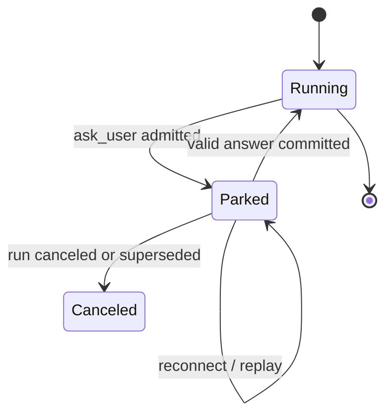

# Coordinator ask user

`ask_user` is the coordinator's host-mediated channel for a decision that must interrupt the current turn. It parks the coordinator, renders a bounded form in Den, and returns the user's answer as the tool result.

**See also:** [Coordination](coordination.md) · [Workflows](workflows.md) · [Session](session.md) · [Authorization](authorization.md) · [Secrets and redaction](secrets.md#protected-user-responses) · [Den](den.md)

**Machine truth:** tool schema at `lycaon/config/packs/painted-wolf/platform/tools/schemas/ask_user.yaml` · admission, mode selection, and rejection codes in `lycaon/internal/workflow/user_input_request.go` · workspace image refs in `lycaon/internal/workflow/ask_user_workspace.go` · answer endpoints under `/v1/sessions/{id}/workflow-runs/{run_id}/feedback/{phase_id}` in `docs/openapi/paths/workflows.yaml`

## Why the question is a tool

A plain assistant question has no machine identity, validation, or durable relation to the workflow state it blocks. A host-mediated ask has a stable identity, typed choices or bounded text input, optional visual evidence references, an explicit parked/running transition, one answer channel, and replay and reconnect behavior. It is for information the coordinator cannot safely infer or obtain through in-scope investigation, not a way to narrate progress.

## Lifecycle

Admission persists the request before the turn is considered parked. An answer is accepted only for the same active request and run, with the revision the user reviewed at submission time; the issuing revision remains on the record for audit. The durable answer record is committed before the waiting invocation is released. A reconnect projects the existing request; it does not create another one. A second ask while one is pending rejects with `ASK_USER_ALREADY_PENDING`.

## Request shape

An ask contains one concise decision: a stable request id, a prompt, one `response_type` from the closed set `text`, `single_choice`, `multi_choice`, `secret`, optional bounded `options` (at most six), and optional `artifacts` (at most four). Choice values are durable protocol values and are rendered verbatim. The host validates response kind, option uniqueness, limits, artifact identity, and result shape before parking.

Den renders a compact decision dock: a text response, a choice rail with an optional off-menu reply, an artifact review/compare surface, or a protected secret field. The coordinator describes the decision; it does not select card chrome. Several decisions are separate asks.

### Artifacts and mode selection

Artifacts select the mode when `purpose` is omitted: none is clarify, one to four is review. Compare is never inferred; it is the explicit `purpose: compare`.

| `artifacts` | `purpose` | Mode | Response type | Who supplies the options |
|---|---|---|---|---|
| omitted or empty | omitted or `clarify` | clarify | text, single_choice, multi_choice | the coordinator, through `response_type` and `options` |
| one to four | omitted or `review` | review | text | the user responds with free-form feedback |
| one to four | omitted or `review` | review | single_choice (the default) | the host: Approve, Request changes, Reject |
| two to four | `compare` | compare | single_choice | the host: one label per artifact (A/B/C/D) |

Review and compare choices are host-composed because the answer vocabulary must be predictable. Coordinator-supplied choices on review, or `multi_choice` on review, reject with `ASK_USER_REVIEW_OPTIONS`; choices on compare reject with `ASK_USER_COMPARE_OPTIONS`; compare with fewer than two artifacts rejects with `ASK_USER_COMPARE_ARITY`. A purpose outside the set, `clarify` with artifacts, or `review` without them rejects with `ASK_USER_PURPOSE_INVALID`.

A secret ask declares `response_type: secret` and a `secret` block whose `name` is always required and whose `purpose` is required once `scope` is `project` (default `chat`). A secret ask has no choices or artifacts; its value follows the protected channel below.

`ask_user` shares presentation primitives with workflow checkpoints, but not state: authorization decisions enter the authorization ledger, workflow checkpoint answers enter workflow human state, and an `ask_user` answer returns to its original coordinator invocation.

## Artifact refs

Each ref resolves in this order:

1. An artifact id or evidence handle in the current session tree. A handle resolves to the newest artifact carrying it. The artifact must be present, not merely referenced, and carry a mime type the interactive preview can render.
2. A workspace image path, when the ref is neither a UUID nor an evidence-handle token. The path resolves under the same read floor as `read`: attached roots, the profile's read scope, the control-plane deny, and descriptor-relative opens that cannot follow a symlink out of a root. The file must be PNG, JPEG, WebP, GIF, or SVG within the artifact byte cap and must decode as the type its extension names; SVG must be well-formed XML with an `svg` root. Video files are not accepted from the workspace.

A workspace image is copied into the store as a `workspace` artifact recorded as not perceived: the card shows it to a person, and a model that later views it is screened first. The copy is made only after the ask passes the active-run, pending-ask, and replay checks, and a refused ask stores nothing.

Any failure rejects the whole ask with a distinct code (`ASK_USER_ARTIFACT_NOT_FOUND`, `ASK_USER_ARTIFACT_FOREIGN`, `ASK_USER_ARTIFACT_UNSUPPORTED`, or the read floor's own rejection for a path), so the coordinator learns which reference was wrong instead of receiving a partly rendered form.

The request holds the artifact available until the ask becomes terminal. If deletion nevertheless wins, Den shows the unavailable state. A reference never pins authority or proves the coordinator's interpretation of the image.

## Ask identity

The host assigns each ask a synthetic `ask-<uuid>` phase identity. It is the one key for admission, replay, answer routing, and the original tool result. An answer applies only while that request's run is active; a stale request is rejected rather than applied to a newer run state.

## Who may ask

Workers cannot invoke `ask_user`. A worker reports a blocked dependency to the coordinator with the exact missing decision and consequences, and the coordinator decides whether it can resolve the issue from existing authority, reassign work, or ask the human. This keeps one human-interruption queue.

A run executing under an **inherited Blueprint approval** may not ask at all. The rejection is `ASK_USER_INHERITED_BLUEPRINT_FORBIDDEN`, and it fires before any other validation. The human already reviewed and approved the exact bytes governing this work; reopening the decision mid-execution would let the run negotiate around content that was approved as a whole. A child that finds the approved plan insufficient reports that upward.

## Park-on-ask policy

After a successful invocation the coordinator turn must stop. It cannot issue more tools while the decision is pending or provide a final answer that implies the question was answered. The host enforces this from tool state, not from the assistant's prose; attempts to continue receive structured feedback and the parked request remains authoritative.

## Answer channel

For text and choice asks, the user's submitted answer is the tool result for the original invocation, not a new user message. The UI may make submission feel like a composer reply, but it submits the explicit request identity rather than asking the host to infer that later prose is an answer. That preserves call/result pairing, makes retries idempotent, and lets prompt assembly place the answer beside the question and artifacts. A human-readable transcript item is projected from the same facts.

The result states selected option ids or text values, answer time, and phase/run revision. The coordinator branches on ids and treats free text as user-authority content. A canceled or superseded request is terminal; it is never rebased to a newer workflow revision.

### Protected secret responses

A secret answer never becomes ordinary feedback. Den submits the raw value to the dedicated write-only `…/feedback/{phase_id}/secret` endpoint for the exact pending ask and reviewed run revision; the generic feedback endpoint rejects it.

The host stores the bytes in the encrypted credential vault and commits only value-free creation origin, scope, and lifecycle metadata. The original invocation resumes with the managed `{{paintedwolf-secret:…}}` reference; workflow variables, transcript messages, events, and tool results never receive the raw value. The projected transcript item says a protected value was supplied without displaying it. Storage, substitution, and redaction semantics are in [Secrets and redaction](secrets.md).

## Invariants

- One admitted ask creates one durable request record and one deterministic transcript projection.
- The coordinator parks immediately after admission.
- Text and choice answers return through the original tool call; a secret answer returns only its managed reference.
- Raw secret responses never enter ordinary feedback, workflow variables, events, transcripts, or tool results.
- Workers relay human dependencies through the coordinator, and an inherited Blueprint approval forbids the ask outright.
- Artifacts select review, compare is explicit, and review and compare options are host-composed.
- Artifact refs are verified ids, ledger evidence handles, or workspace paths read under the read floor, never markup or session-latest previews.
- Workflow and authorization lifecycles remain distinct despite shared UI.
- Structured ids carry decisions; display prose explains them.
