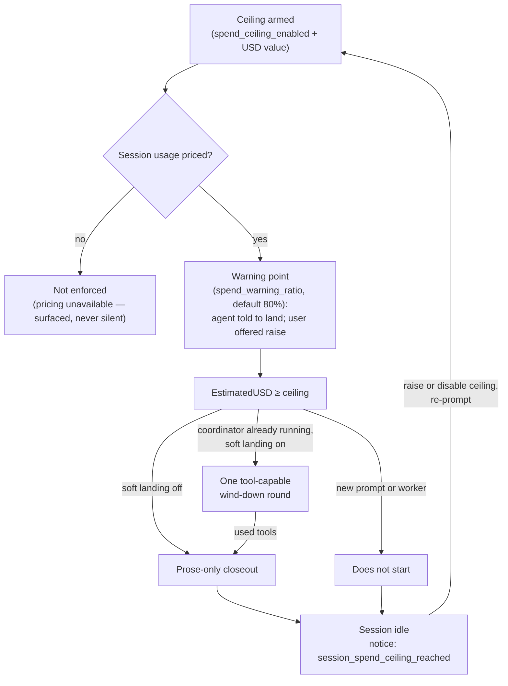
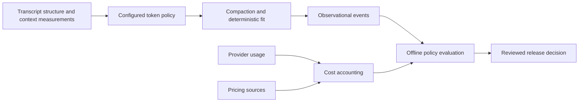

# Cost

Observational spend estimates from bundled HTTPS pricing feeds, never a turn-stopping budget.

**See also:** [Providers](providers.md) (catalog / `modelfeed`; catalog egress is not gated by cost tracking) · [Host contract](host-contract.md) · [Den](den.md)

**Machine truth:** `lycaon/config/packs/painted-wolf/platform/host/pricing-sources.yaml` · `{configdir}/pricing.yaml` · `lycaon/internal/pricing` · `lycaon/internal/cost` · OpenAPI `paths/cost.yaml` and `paths/settings/pricing.yaml` · kind↔models.dev feed keys in `lycaon/internal/modelfeed` (`FeedKeyForKind` / `KindForFeedKey`)

---

## Scope

Cost shows **estimated** USD and token totals so operators can see usage. The project Cost context pane presents project totals, cost and token role composition, per-session comparison, export, and project-scoped session guardrails. Estimation never blocks a turn. The opt-in [spend safety ceiling](#spend-safety-ceiling) is a separate safety brake.

| Vocabulary | Meaning |
|------------|---------|
| **pricing source** | Catalog entry with fixed `id`, `kind`, `label`; HTTPS `url` except `models-dev` (modelfeed projection) |
| **feed** | Network pricing source (LiteLLM / ai-pricing.fyi) or the shared modelfeed projection (`models-dev`) |
| **RateTable** | Normalized `(providerKind, apiModelID) → per-1k USD` plus freshness; keyed by provider kind, never instance id |
| **ChainPricer** | Resolver implementing `cost.Pricer`: live discovered rate, then the selected catalog source |
| **live discovered** | Per-token rate from a provider's own `/models` discovery API (`discovered` provenance) |
| **Unpriced** | One or more incurred token categories lack a price; keep any known subtotal and report missing coverage |
| **estimate coverage** | Host-stamped classification of `estimated_nano_usd` on every `CostSummary`: `complete`, `lower_bound`, or `unpriced` ([Estimate coverage](#estimate-coverage)) |
| **cost_tracking_enabled** | Main toggle; on by default with one selected catalog source; egress kill-switch when off |
| **cost_tracking_since_at** | RFC 3339 stamped on off→on; cleared when off; non-retroactive |

---

## Spend safety ceiling

A per-session USD **safety brake**, opt-in and distinct from cost observation. It is not a budget planner and not a cost dashboard.

| Concern | Role |
|---------|------|
| **Cost observation** | Estimated USD/tokens, pricing feeds, session cost chip, and project Cost pane; never stops a turn by itself |
| **Token / context budgets** | Live window fit and prompt-context diet; not a money brake |
| **Spend safety ceiling** | The one USD stop when a runaway session would keep spending, with a bounded landing for work already in flight |



### Behavior

| Item | Spec |
|------|------|
| Default | Ceiling **off** (`spend_ceiling_enabled` false); soft landing **on** (`spend_soft_stop` true) whenever a ceiling is armed |
| Unit / scope | USD only; per session |
| Wire | `session_spend_ceiling_nano_usd`, `spend_warning_ratio`, `spend_ceiling_enabled`, `spend_soft_stop` on settings limits |
| Gate | A new prompt or worker at `EstimatedUSD ≥` ceiling does not start. A coordinator that crosses the ceiling while running gets one tool-capable wind-down round when soft landing is on; its response is final when it uses no tools, and after tool calls the prose-only closeout follows |
| Landing shape | The agent finishes only work already in flight when close, or returns the best usable result and names the remainder. `task` is removed from the wind-down round, so new delegation is unavailable |
| Stop shape | Session goes **idle** with notice `session_spend_ceiling_reached`; files, tool results, and the closeout are preserved |
| Resume | Raise the ceiling (or disable it) and re-prompt; the next turn's gate passes |

Configure a device default under Settings → Advanced → Budgets, or the active project under Context → Cost. A project guardrail applies the same per-session warning and stop to every session in that project; it is not an aggregate project budget. Den shows a live readout (`spent $X of $Y` when priced) and a **Raise ceiling & resume** card when the notice fires.

Soft landing is finite: only the already-running root coordinator receives the one additional round; worker children receive no separate allowance; turning soft landing off keeps the immediate prose closeout. A session already above its ceiling cannot obtain a fresh allowance by sending another prompt.

### Approaching the ceiling

An armed, priced ceiling warns once before it stops anything. When a session's estimated spend first reaches the warning share (80% by default, configurable from 10% through 95%), the agent is told that the session is close to the ceiling, that reaching it pauses the session until the user resumes, and that it should finish the change in flight and name whatever is left as follow-ups. It is never told a figure and never told to hurry: it cannot price its next tool call, so an amount would be a number it could not act on.

The user sees the same moment differently: the session cost chip takes a warn treatment showing spend against the ceiling, and one dismissable card offers to raise the ceiling before the interruption. Both derive from spend and the configured ceiling; neither is a setting. The warning fires once per session, and raising the ceiling re-arms it. A ceiling that is disabled, zero, or unpriced warns exactly as it enforces: not at all.

### Honesty

When the ceiling is **enabled** but session usage is **unpriced** (`estimate_coverage = unpriced`), the host does **not** enforce it. Den surfaces **not enforced (pricing unavailable)**, never a silent fail-open.

**Lower bound:** a scope mixing priced and unpriced events, or carrying a charged call that never reported usage, is stamped `estimate_coverage = lower_bound`. `estimated_nano_usd` then covers the priced subset only, and the ceiling still enforces on it (a lower bound crossing the ceiling is a real crossing). Den renders the coverage beside the figure, never folded into the number. Board fallback carries the same stamp. Spend-ceiling readouts disclose that actual charges may exceed the limit when rates or provider usage are missing; the reached-ceiling notice reads `estimate_coverage` for its “at least” and the counters for the causes.

### Estimate coverage

Every `CostSummary` carries **one** host-stamped `estimate_coverage`, computed in `internal/cost` from the receipts that built it. Nothing downstream re-derives it from the counters: the ceiling gate, the ceiling notice, the session chip, the popover, the Cost stage, and the CSV all read the stamp.

| Coverage | Meaning | Causes reported alongside |
|----------|---------|---------------------------|
| `complete` | Every incurred token was reported and priced; empty usage is complete at $0 | Free local calls with missing usage and host-measured tokens may still be disclosed; neither changes the money |
| `lower_bound` | The true estimate is at least `estimated_nano_usd` | `unpriced_tokens` (reported usage no source could price) and/or `unknown_charged_calls` (a billing provider call that ended without a usage report) |
| `unpriced` | Usage exists but none of it could be priced; only tokens are known | `unpriced_tokens` is every incurred token |

**The amount and the coverage are separate render slots.** The amount slot only ever holds a rounded figure: `$1.25`, `$0.00`, or `<$0.01` for spend that rounds to nothing. Coverage is rendered beside it (a hollow dot on the session chip, a `Lower bound` mark next to totals and table amounts, a warning line in the popover, a badge on the Cost stage) and is never prefixed onto the number, which is what makes a sub-cent lower bound representable. In prose (the ceiling readout, the approaching-ceiling nudge) the sentence form is `at least $2.50` for a lower bound at or above one cent and `less than $0.01 in priced usage` below it, with the causes in words. `estimateView` in `lycaon-den/src/cost/cost-format.ts` is the one place those forms are produced.

### Call receipts

Every provider call opens a receipt in `llm_calls` **before** any I/O, so a call that dies mid-flight still leaves a trace. A receipt's `status` settles exactly once:

| Outcome | When | Effect on the summary |
|---------|------|-----------------------|
| `reported` (`usage_source = provider`) | The provider reported complete usage | Reported tokens and estimated USD |
| `reported` (`usage_source = provider_partial`) | Only part of the provider usage was observed | Known tokens and priced subtotal remain; also counted in `unknown_calls` |
| `reported` (`usage_source = host`) | The call produced content but no usage report, usually an interrupt on a provider that reports usage only in its terminal frame | Counted in the totals and in `host_measured_tokens`; approximate |
| `unknown` | Nothing came back to measure, or the process died with the receipt open (`RecoverStartedCalls` at boot) | `unknown_calls`, and `unknown_charged_calls` when the provider bills |
| voided (row deleted) | The request never reached generation: the provider rejected it up front, or the host never sent it | Nothing |

Two rules keep the ledger honest:

- **A host measurement never becomes a provider fact.** It counts toward spend and is disclosed as `host_measured_tokens`; it never reaches `completion.Usage`, so prompt-token calibration reads the provider's own number. It is approximate in two directions: host tokenization, and no cache attribution, so a cached prefix prices as fresh input.
- **Only a charged unreported call qualifies the money.** `unknown_charged_calls` is the `unknown_calls` subset on a provider that can bill per token (the provider config's `local_free` decides, stamped onto the receipt when it opens). An unreported call on local inference leaves tokens off the counts and the USD figure whole; Den reports the two separately.

Ledger writes never inherit caller cancellation: a receipt most needs to land when the turn carrying it was canceled. Accounting is observational infrastructure, so a ledger open, settle, pricing-estimate, or summary failure is logged and never replaces a model completion or blocks a turn. Known usage survives a pricing-estimate failure as Unpriced. The spend ceiling still blocks when a successful priced summary establishes that it was reached; if the summary itself is unavailable, no accounting-derived gate is asserted.

### Rollup

Receipt detail is kept indefinitely by default. When the reviewed history-retention policy selects a `reported` receipt, it folds into `llm_call_rollups`: rows grouped by project/session/parent-session/provider/model/caller/day plus pricing source, pricing timestamp, selected rate snapshot, usage provenance, and no-charge classification, preserving call count, priced-call count, token buckets, unpriced-token coverage, estimated USD, and the cache comparison. The detail row is then deleted. Triggers on both receipt tables maintain `llm_cost_totals` in the same transaction; `Summary` and `ProjectReport` aggregate those lifetime totals, so reads do not decode historical receipts or rate snapshots. Retention leaves totals and the coordinator/worker/summarizer breakdown unchanged. Corrections and deletions subtract the previous contribution before adding a replacement.

### Utility call budgets

Lite calls are bounded per attempt by the serving provider's service-class budget ([providers.md § Utility plane](providers.md#utility-plane)). A host budget that expires mid-generation books an `unknown` receipt, so a budget below a provider's real latency surfaces here as unreported calls; it does not label the endpoint unavailable. Provider-reported output truncation retains and books the reported partial usage while the calling feature rejects the incomplete result.

---

## Pricing sources

Feeds come from the bundled catalog only. Ids, labels, and endpoints live in [`platform/host/pricing-sources.yaml`](../lycaon/config/packs/painted-wolf/platform/host/pricing-sources.yaml); the host implements exactly three **driver kinds**, so a source outside them cannot be expressed: `models-dev` (a projection of the shared `modelfeed` document the model picker reads, with no second `api.json` GET), `litellm`, and `ai-pricing-fyi`.

| Rule | Spec |
|------|------|
| Endpoints | Fixed HTTPS from the catalog; **no** user URL field |
| Local / catalog rate table as a source | **Forbidden**: no `kind: catalog` / `kind: local`; no `pricing-sources.local.yaml` |
| Normalize | Per-1k USD `Rate` / `RateTable` (`Currency` always `"USD"` after normalize) |
| Lookup | Resolve instance id → **provider kind** (catalog); exact `(kind, apiModelID)` |
| Rate identity | Host keys are provider **kind** + API model id, never instance id or raw feed slugs |
| models-dev | Rates projected from the shared `modelfeed` document for **mapped kinds only** |
| Kind map SSOT | `modelfeed.FeedKeyForKind` / `KindForFeedKey`; cost only adds LiteLLM/ai-pricing dialect aliases onto those kinds |

Ingest: models.dev converts per-M to per-1k; LiteLLM `*_cost_per_token` to per-1k; ai-pricing.fyi paginates `per_1m_tokens` rows and converts them (using `latest_observed_at` when present). Normalized rates must be finite, non-negative USD values; an invalid row rejects the refresh and preserves the prior cache.

---

## ChainPricer + provenance

`ChainPricer.EstimateCost` selects one rate table for the complete call; it does not blend fields from different sources:

1. **Local free**: the provider config's `local_free` is authoritative and estimates at $0 with source `local`.
2. **Live discovered**: only registry provenance `discovered` qualifies (`Registry.DiscoveredRate` returns false otherwise). Optional rates from OpenRouter/Together `/models` and LiteLLM `/model/info` are preserved; bundled catalog hints are never billing rates. Together discovery preserves optional `cached_input` pricing, including zero; a missing field stays unavailable. A live rate that prices all incurred categories wins.
3. **Selected feed**: resolve the provider instance to its kind and model identity, including explicit `priced_as`. If live coverage is incomplete, use the source that covers more of this call's tokens; a tie favors live. Apply the selected context tier to the entire call's inclusive input length.
4. **Unpriced**: retain token counts when no applicable price is available. A partial rate retains its known subtotal, including a known-zero subtotal, and reports the tokens lacking prices.

Forbidden: averaging rates; freshest-timestamp arbitration; dual cost math. `cost.ApplyRate` is the only USD math path.

Every `CostSummary` carries `pricing_provenance[]`, sorted by source id. Each entry carries its own optional `priced_as_of`; mixed live/feed estimates never attach one source's timestamp to another source's label.

---

## Main toggle + egress kill-switch

Device-global overlay: `~/.config/paintedwolf/pricing.yaml` (`internal/settings/pricing.go`). Pricing-source selection has no project scope; the project surface configures guardrails, not feeds.

| Item | Spec |
|------|------|
| Defaults | With no overlay file, `cost_tracking_enabled: true` and the first catalog source selected; an overlay that omits the key leaves tracking off. `cost_tracking_since_at` is absent until the first off→on stamp |
| Selection | At most one catalog source has `enabled: true`; tracking on requires one (`pricing_no_source` for zero), while multiple selections return `400` `invalid_request` |
| Stamp | Off→on sets `cost_tracking_since_at` (RFC 3339 UTC); disable clears it |
| Off | No pricing registry network start or fetch; new usage is Unpriced, while `local_free` classification remains available so an unreported local call is still known to be no-charge; session cost chip absent; the project Cost pane keeps historical estimates visible and says new usage is not being priced |
| On + boot | Refresh the selected source when older than TTL |

Fetch only when tracking is on **and** the source is selected. Triggers: boot (when on), explicit refresh, TTL expiry; **never** per LLM call.

Transport: the shared [`httpclient.GetFeed`](../lycaon/internal/httpclient/feed.go) boundary performs public-IP-pinned HTTPS GETs, revalidates every redirect, and rejects oversized documents rather than accepting prefixes. Forbidden: `http.DefaultClient`, `ProxyFromEnvironment`, loopback, link-local, `169.254.169.254`, non-HTTPS. Provider **catalog** egress is separate and not gated by `cost_tracking_enabled` ([providers.md](providers.md)).

---

## Cache / TTL / caps

| Constant | Value |
|----------|-------|
| Fetch timeout | **5s** per page, including DNS, redirects, and body |
| Cache TTL | **24h** |
| Max payload | **8 MiB** per source refresh, aggregated across pages |
| ai-pricing.fyi pagination | **100 rows/page**, maximum **1,000 pages** |
| Refresh on boot | **true** (when tracking on) |

Disk cache per source under the host cache dir. Network/guard/timeout → `PRICING_SOURCE_UNREACHABLE` (prior good cache kept). Invalid/oversized → `PRICING_SOURCE_INVALID` (good cache not overwritten). Offline start uses the last cache if present; else that source prices nothing. An explicit refresh reports its failure even when a prior cache is usable; a failed refresh is never presented as a successful one. Status: `ok` | `stale` | `error` | `offline`.

### Background fetch

Selecting a source, turning tracking on, boot, and TTL expiry never wait on the network. The host installs a pricer from whatever the disk cache holds for the selected source, then fetches in the background without holding the settings lock. Until that first fetch lands, a source with no cache prices nothing: new usage is Unpriced, never priced by the previously selected source.

`PricingSourceMeta.refreshing` is true while a fetch of that source is in flight; `status` and freshness keep describing the last settled attempt. When a background fetch settles, the host reinstalls the pricer and publishes a `settings` event (`area: pricing`, `action: refreshed`) so Den reloads source status. An explicit refresh still answers with the settled meta.

---

## Wire

| Method | Path | Behavior |
|--------|------|----------|
| `GET` | `/v1/settings/pricing` | Config + `available_sources[]` live meta |
| `PUT` | `/v1/settings/pricing` | Persist; validate ids; require one enabled source when enabling tracking. Installs a pricer from cached rates and returns without fetching ([Background fetch](#background-fetch)) |
| `POST` | `/v1/settings/pricing/sources/{id}/refresh` | Force re-fetch one source |
| `GET` | `/v1/cost/summary` | Session or project rollup (`session_id` **or** `project_id`) |
| `GET` | `/v1/projects/{id}/cost-report` | Project totals plus one cursor page of active/archived top-level sessions; cost, token, activity, or id ordering and literal title search |

`CostSummary` fields: `coordinator`, `workers`, `summarizer` (compaction, curate, commit draft, and similar utility calls), `estimate_coverage`, `pricing_provenance[]`, `unpriced_tokens`, `unknown_calls` / `unknown_charged_calls` / `host_measured_tokens` ([Call receipts](#call-receipts)). Project reports also return `project_utilities`, for LLM work attributed to the project but run outside a session, and `retired_sessions`, which preserves the aggregate for deleted or expired sessions. The project total equals current session rows across all pages + project utilities + retired sessions. Usage events use the stable project UUID, never a root or worktree path. The `cost` SSE topic publishes summary changes; board `cost` carries the same complete `CostSummary` when tracking is on, otherwise null.

Project report pages default to 40 chats and cap at 200. `total` counts the search matches; `session_count`, `archived_session_count`, `worker_task_count`, `max_session_nano_usd`, and `max_session_tokens` describe the full project regardless of page or filter. Each response reads one consistent database snapshot; cursors bind the project, search, and sort, and live updates can change the order between requests. CSV export traverses all pages in stable session-id order and includes utilities and retired sessions; separate requests do not form an accounting snapshot.

Totals invariant: `estimated_nano_usd == coordinator.estimated_nano_usd + workers.estimated_nano_usd + summarizer.estimated_nano_usd`.

---

## UI

| Surface | Spec |
|---------|------|
| Settings → **Cost** | Main toggle + one radio group for the source (status per row; refresh on the selected row). Choices apply at once and save in order; a failed save reverts to the last confirmed settings. Nothing in the panel waits on a feed fetch |
| Session **cost chip** | Under the project/folder cluster; present only when tracking is on; label = running estimated USD (empty when unpriced) with a hollow dot for a lower bound (`data-coverage`); testid `status-chip-cost`; popover shows the session summary and project guardrail, with **View project cost** routed to Context → Cost |
| Project **Cost** | First-class Context stage, pinned by default; project totals, cost and token role composition, distinct project-utilities and deleted/expired-session rows, per-session comparison, archive/status labels, filtering/sorting, and formula-safe CSV export |
| Tracking off | Historical estimates remain visible with a notice and CTA to Settings → Cost; new usage is not priced |
| Project guardrail | Configurable warning point (10–95%), spend limit, and default-on soft landing for every session in the project; explicit project-scoped save and priced/unpriced enforcement disclosure |

Copy must say **estimated**; never claim invoice accuracy. Unpriced → tokens + “pricing unavailable”. Every cost breakdown carries its tokens: each role row in the chip popover and each figure on the Cost stage shows **in · out** tokens beside the amount, rounded to one short word (`~1.5K`, `~125K`, `~1.5M`) with exact counts on hover, so an unpriced session stays readable. Estimated USD never displays past cents; spend that rounds to nothing reads `<$0.01`, never `$0.00`.

---

## Degradation codes

| Code | When | Surface |
|------|------|---------|
| `pricing_no_source` | PUT has no selected pricing source | 400 on settings |
| `pricing_source_unreachable` | Fetch failed | 502 on refresh; settings status |
| `pricing_source_invalid` | Bad payload | 502 on refresh; settings status; cache intact |
| `pricing_source_not_found` | Refresh names a source that is not configured | 404 on refresh |
| `pricing_source_disabled` | Refresh targets a disabled source, or tracking is off | 409 on refresh |

`Unpriced` is not a reject, and estimation never blocks a turn.

---

## Compaction independence

Compaction is governed by transcript structure and token measurement, never by money. A price refresh, a missing rate, a cache-telemetry gap, disabled cost tracking, or a ledger failure must not change compaction eligibility, its target, its protected content, or its retry behavior. There is no cost-aware mode with a token-policy fallback: the token policy is always the policy.



Money reaches policy only the long way round: spend estimates are how a candidate token policy is judged, offline, ending in a reviewed change to checked-in configuration. Compaction never queries the pricer or spend rollups, refreshes pricing, or branches on ledger success. Summary calls still pass through ordinary utility-call accounting; those writes are best effort, and their failure never replaces the summary or changes its acceptance. The [spend safety ceiling](#spend-safety-ceiling) is the one deliberately financial behavior in the loop, and it stops a session rather than reshaping its prompt.

Provider-reported prompt tokens remain useful **context** measurements independent of cost tracking. Cached tokens still occupy the window and count in full toward capacity; a fit budget is never derived from discounted token equivalents. Cache structure can inform implementation without money (byte-stable system and tool prefixes, valid cache boundaries, no unnecessary history rewrites); cache-hit rates and break-even calculations are observational inputs to evaluation, not runtime switches.

Full-session compaction runs on the session trigger; it has no fixed token cap. Charter rows are pinned before both background and forced compaction, chunk summaries are reusable projections keyed by message identity and content digest, and eligibility rests on identity, revision, configuration, and structured protection metadata, never on cost or on phrases in transcript text. Mechanism: [Prompt assembly](prompt-assembly.md).

---

## Accounting contract

Provider usage normalizes into **non-overlapping** buckets: ordinary input, cached reads, cache writes split by lifetime, and billable output (`internal/cost/rate.go`). Some provider input totals already include the cache buckets and others require adding them, so the relationship is validated rather than silently accepted; impossible counts are rejected, not booked.

**Presence is itself a fact.** Zero means the provider reported zero; absence means unknown. Known-zero, known-nonzero, and unavailable prices stay distinct through feed parsing, discovery, normalization, and estimation, because collapsing them is how a free cache read comes to price as ordinary input and an unknown write premium disappears. When an incurred category is unpriced, both the priced subtotal and the missing coverage are reported.

Estimation prices the buckets disjointly, including write lifetime and supported context tiers:

```text
request estimate = ordinary input × input rate / 1,000
                 + cached reads × read rate / 1,000
                 + sum(write tokens by lifetime × write rate) / 1,000
                 + billable output × output rate / 1,000
```

Rates are per 1,000 tokens internally, with explicit conversion at ingestion (`cost.ApplyRate`). A write rate quoted as a multiple of input is the **total** rate for that category, not input plus a premium. Explicit cache storage, where a provider sells it, is counted separately over its lifetime and never added to implicit caching; the host does not currently create storage-backed cache objects.

Receipts retain serving provider and model identity, the billing qualifiers that applied, usage provenance, and the rates applied at call time, through retention, so a rolled-up row remains explicable. Repricing an exported run is an explicitly labelled analysis, never a silent rewrite of historical spend. Reported usage is what reconciles; host-measured tokens can never establish cache reads or writes.

Estimated spend and estimated cache savings are separate figures. Savings compare the same workload against an explicit hypothetical uncached baseline, must include write premiums and any applicable storage, and can be **negative** when write premiums exceed read discounts. That comparison is never subtracted from spend and never reaches compaction.

An estimate covers the token rates the selected source supplies. It is not an invoice: account-specific contracts, capacity commitments, credits, routing surcharges, and storage sit outside it. A forecast using an assumed rate is a scenario, never a known charge or a guaranteed lower bound.

### Per-transport cache accounting

What a route reports is a transport fact, so this is per-adapter work rather than a table of vendor prices. Rates change without notice and are not host state; what the host *emits* is declared in the driver profile's prompt-cache fields ([`internal/llm/providerprofile/profile.go`](../lycaon/internal/llm/providerprofile/profile.go)), and what it *books* is whatever that route reported.

| Route | What its accounting must capture |
|---|---|
| OpenAI | Cache writes as well as reads; model-specific long-context rules |
| Anthropic | Normalized input totals, with write lifetime preserved; write rate varies by lifetime, and the host requests the short one |
| Azure OpenAI | The deployed model and billing arrangement. A zero marginal cached-input rate on a provisioned deployment is a real zero, not a missing price |
| Gemini | Implicit cache hits where reported; applicable context tiers; explicit-cache storage kept distinct from implicit reuse |
| Vertex AI and Vertex express | Each transport/model combination verified on its own; the Vertex label does not establish support |
| Amazon Bedrock | The Converse transport's own cache checkpoints, sent only to the Claude families that take them, separately from other Bedrock APIs; model, region/routing, and cache-lifetime distinctions |
| Together AI | Per-model cached-input pricing and reported hits |
| Fireworks | Session affinity preserved; cache telemetry verified. Serverless and dedicated capacity are different billing interpretations |
| Cloudflare Workers AI | Model-specific cached rates and the applicable free allocation; affinity and usage fields verified in the adapter |
| OpenRouter | Upstream pricing and usage where supplied. The session key pins routing, but fallback can change the serving endpoint and its cache reuse |
| LiteLLM | Cached reads as the proxy reports them for the upstream it chose; whether a route caches is the proxy's per-model fact, not a rate |
| LiteLLM and hosted OpenAI-compatible | The wrapper is not a pricing contract. Preserve upstream billing facts when supplied, otherwise disclose unavailable coverage; a loopback proxy does not make paid upstream inference local or free |

A route whose profile emits no cache controls is not thereby uncached: providers may cache automatically, and zero counters mean no reported cache use. The converse also holds: emitting a control does not establish a hit.
