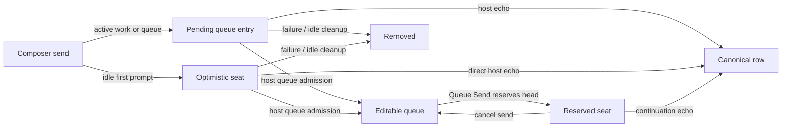

# Den chat items

The transcript is a deterministic projection of immutable session order, durable transcript payloads, typed execution resources, and a small set of explicitly ephemeral overlays. It is not a client-authored activity log.

**See also:** [Den](den.md) · [Session](session.md) · [Host contract](host-contract.md) · [Prompt assembly](prompt-assembly.md) · [Secrets and redaction](secrets.md#durable-and-display-redaction) · [Grounding](grounding.md)

**Machine truth:** [`MessageKind` in `session/messages.yaml`](openapi/components/schemas/session/messages.yaml) → generated [`api/types.ts`](../lycaon-den/src/api/types.ts) · [`api/enum-registries.ts`](../lycaon-den/src/api/enum-registries.ts) (tests read the generated union, never a hand-listed copy) · [`transcript-item-model.ts`](../lycaon-den/src/chat/transcript/projection/transcript-item-model.ts), the `TranscriptItem` union · [`transcript-items.ts`](../lycaon-den/src/chat/transcript/projection/transcript-items.ts), the projector · tool headlines, tiers, and weights authored in [`tool-presentation.yaml`](../lycaon/config/packs/painted-wolf/platform/tools/tool-presentation.yaml) and generated by `lycaon/cmd/codegen-tool-presentation`

## Why transcript facts come from the host

Tool calls, worker outcomes, workflow boundaries, plans, approvals, evidence, drafts, and final prose are one causal history. If Den invented or dropped rows based on what looks redundant, reconnect and replay could show a different story from the one the model and host acted on.

```text
host facts -> deterministic item projection -> activity-span presentation
```

Grouping may change chrome. It cannot change whether an event exists.

## Transcript scale

Long sessions render as a window over canonical rows. Virtualization, collapsed disclosures, and reveal anchors keep interaction bounded while stable row identity preserves focus and scroll. The transcript store retains ordered facts for the loaded window; older ranges remain addressable through host pagination, and Den does not concatenate the whole session to find one item.

### Reveal anchors

Every revealable item has a stable identity derived from its backing fact, not its array position. A tool result remains revealable even when pagination has not loaded its issuing assistant row, because the result retains the durable assistant-message and tool-call identities. Find, search, evidence, notifications, and deep links request that identity.

Reveal ([`transcript-reveal.ts`](../lycaon-den/src/chat/transcript/presentation/transcript-reveal.ts)) proceeds in stages, all through the mounted session's transcript viewport controller:

1. resolve the backing row from the host if it is outside the window and load the needed page;
2. submit a `reveal` command to the viewport controller (virtual row geometry → one `commit`);
3. open any activity span or disclosure containing the item as navigation disclosures;
4. apply a bounded highlight without changing selection or source state.

Explicit reveal may move focus with `preventScroll`; disclosure, remount, and animation never move focus implicitly. The navigation disclosures are released when the flash expires or, when a search match was highlighted in the row, on Escape (the `revealHighlight` rung of the [escape ladder](den-in-view-find.md)) or the next reveal.

Source paths and visual artifacts keep their own identities inside the item. The transcript anchor identifies the card; it is not a substitute for the underlying source or artifact id.

## Item taxonomy

Canonical message kind, role, visibility, and typed result fields determine the item family. The families and the `TranscriptItem` kinds each projects into:

| Family | Kinds |
|---|---|
| User intent and human feedback | `user`, `workflow_feedback` |
| Assistant committed prose and private draft history | `assistant`, `draft` |
| Tool calls and results, and the spans that group them | `tool`, `activity_span`, `index_warming` |
| Worker task cards from committed worker results | `worker_group` |
| Host progress reporting | `progress_update`, `progress_complete` |
| Workflow boundaries, blueprints, phase notes, and decision gates | `workflow_boundary`, `blueprint_card`, `workflow_explain`, `checkpoint` |
| File-edit diffs | `file_edit`, `worker_file_edit` |
| Visible row with no specialized card | `fallback` |
| Ephemeral overlays with no host row | `pending_user`, `time_marker`, `unread_marker`, `turn_tail` |

`RawTranscriptItem` is the union of items projected one-to-one from a host row. Three kinds are **synthesized** from constituents (`activity_span`, `worker_group`, `file_edit`) and the ephemeral overlays hold no row of their own, so none of those are raw items. `index_warming` is the mirror image: a real host row and a real kind, but never its own transcript row, because it always folds into an activity span, so `DisplayTranscriptItem` excludes it.

`worker_file_edit` is separate from `file_edit` because its folds are project snapshots taken at committed promotion, not writes into the live tree. A worker's diff must remain readable as what was promoted, so it does not merge with the coordinator's own path folds.

A "gate" is not a kind. A decision gate reaches the transcript as a `checkpoint` attached to its backing row. Evidence, findings, and artifacts are likewise fields and references carried by the rows that name them (such as `artifactIds` on a `user` item and grounding on an `assistant` item), so a single fact never exists twice with two identities.

The enum inventory belongs to OpenAPI and the generated registries. A visible host row whose kind Den has no card for renders as `fallback`, an attributed row carrying the role, the wire kind string, and the content, rather than disappearing.

## Deterministic projection

The projector is a total function of ordered host rows plus current ephemeral liveness:

```text
items = Project(session entries, transcript payloads, execution projections, runtime statuses, user visibility setting)
```

It may synthesize an activity-span item whose identity and order derive from constituents, or attach a checkpoint or grounding disclosure as a child of its backing row. It may not infer run membership, worker identity, or visibility from prose. Internal assistant prose stays private until the host patches its visibility to `transcript`; typed action cards may independently expose current work. Private and verbose content remains a persisted fact and search-addressable under explicit filters even when normal presentation hides it.

## Secret redaction presentation

Secret removal is a host fact, not a string convention. A message copy with `host_secret_redaction` carries every replacement as a structured span: field path, rune offset, marker length, kind, source, and optional rule identity. Den renders only from that list. Text that happens to contain `[REDACTED]` without metadata remains ordinary text.

For prose and structured tool-result fields, Den segments the already-redacted string by the host's rune offsets and paints each replacement as a redaction mark. The mark contains the durable marker text, so copying or assistive reading yields the marker rather than an empty gap. It has no reveal affordance because the removed value never reached the client process.

Prose is painted by splitting at the host's offsets in the raw content, before the markdown transform shifts them, and swapping in marks afterwards ([`prose-redaction.ts`](../lycaon-den/src/chat/markdown/prose-redaction.ts)). No markup is injected into model-authored content: the split leaves a nonced sentinel that only this render can resolve, so text shaped like a mark cannot become one. Den also strips redaction markup that arrived inside model-authored content before painting, on every row, because a forged mark would read as an assurance the host never made. Painting reaches fenced, indented, and inline code, since the swap replaces text nodes rather than emitting markup.

Painting is refused wherever the offsets no longer describe the rendered text: an assistant row whose rendered text differs from the wire content, a user message with content parts (the rendered body joins a subset of parts), file-edit folds (diffs derived across several messages, so no span maps onto a rendered line), and a tool argument displayed as anything but the wire string byte for byte. Refusing beats painting the wrong run.

A `managed_reference` span is painted as a readable reference mark rather than a hatched mask: the reference is model-visible text a person may copy, and its tooltip says the source still holds the value. `observer_mask` is presentation of a host policy mask rather than a detected credential; it follows the same structured-span contract, and Den distinguishes it by kind and copy, never by marker shape or prose.

Tool cards summarize their spans with a redaction chicklet ([`RedactionChicklet.tsx`](../lycaon-den/src/components/tool/RedactionChicklet.tsx)): **1 secret removed**, **1 secret protected**, **2 values not shown**, or **N hidden** when kinds are mixed. The summary is present even when no approval card appeared, because commit-boundary redaction still owes the reader an explanation; its tooltip states that the file on disk was not changed.

Redaction metadata describes the current message copy. It does not accumulate across later projections, reveal original length, or authorize reconstruction. When the host rescreens an older row, the ordinary message patch replaces both the redacted content and its span list under the same durable row identity.

## Activity spans

Assistant responses containing tool calls contribute tool cards, not assistant prose. The host projects their text and content parts out of transcript pages, message events, and stream replay while retaining the recorded response for model continuity and diagnostics. Mid-turn updates come through `surface_note`; answers have no tool calls. User-visible tool arguments, including `wait.reason`, describe the requested work or dependency rather than execution modes or recovery mechanics.

Span membership ([`activity-span-model.ts`](../lycaon-den/src/chat/tool/activity-span-model.ts)): every visible non-worker tool call projects into an activity span, including a span of one call. Consecutive calls share a span when a persisted workflow run proves the relation. Outside a workflow, sibling calls from the same durable assistant row form one span in parent chat. In a worker transcript, consecutive tool-only turns share a span because the drawer already supplies the durable child-session boundary. Visible prose, user input, and any other transcript row end the span, and unrelated adjacent calls never merge merely because their headlines match.

File writes fold by path into one diff row per `user` row (a `user_continuation` also closes the fold): the row anchors directly below the span holding the path's first write, and every later write composes into that same row while its chicklet stays in whichever span made it. A span holding a first-touch write accepts only further writes; any other call starts the next span below the diff row, so a later call never renders above an older diff, and a repeated write never mints a second card.

A diff row names a whole-file change in words, **New file** or **Deleted file** beside the path for the revision on show, and its body follows the [reader's change rule](files-stage.md#read-only-source-ranges): a created file reads as the file, a deleted one as removed lines. A path that cannot be opened carries the change in its own name instead; an openable path keeps the link colour.

Worker dispatches stay outside activity spans. Adjacent dispatches, including a single one, render one always-open compact worker group. Each compact row retains its task identity, status, progress tracks, and independent worker-drawer action.

**Decision rows.** The decision engine's receipts (`SessionTranscriptPage.turn_loads` and the `turn_load` event, keyed by the user message that opened the turn) draw inside the span of the assistant row that first called a tool in that turn, ahead of its tool rows ([`turn-load-rows.ts`](../lycaon-den/src/chat/turnload/turn-load-rows.ts)). A turn decision draws one row naming the tools it offered beyond the floor. Each row is a tool card whose tool is the engine's name, so it takes the same chrome, disclosure, and accordion as the call it stands in for, and it joins the span with the bookkeeping role and zero weight, so it never names the span's work. A row draws only beside work: an abstained receipt, a turn whose model never called a tool, and a turn with no receipt all draw nothing, and the transcript never says whether an engine was present; its availability is the `decision_engine` preflight probe ([Dependencies](dependencies.md#decision-model)). Request and lookup receipts draw no row of their own; the `request_tools` and `skills_read` cards state at their foot how the text was matched, and every card for a tool the decision offered, or a request loaded, states that at its foot ([`turn-load-facts.ts`](../lycaon-den/src/chat/turnload/turn-load-facts.ts)).

**Phase notes.** A `workflow_explain` row is the host's note for a phase it holds ([Workflows § Explain notes](workflows.md#explain-notes)). It renders as its own chicklet with the tool chicklet's shell: status dot, the name "About this step", the note's summary as title, and a keyed disclosure that starts closed. Like any row that is not a tool call, it ends the span before it, which is where a phase begins. Its dot follows the run it names: running while the run holds the note's phase, an error when the run fails there, done otherwise. When the note names a full scan pass, the collapsed row counts the pass's finished scanners and the open body draws `ScanProgressList` from the folder's security overview, the same record the Security page reads. The note reads that overview only while its phase is held or its body is open, and polls it on the Security page's cadence while the pass can still move; once a newer full pass replaces its pass, it stops drawing bars rather than showing another pass's progress. When the note names topology stages, it reads their legs from the run's `ui.topology_legs`, which a `delegation` event refreshes, and draws one row per leg with what it waits on; no extra read is needed. Both kinds of progress render through `ProgressRows`, the primitive the Security page's rows use. Progress updates change widths and text, never the row's height. A newly written note is announced to assistive technology by its summary; notes loaded from history are not.

**Headline.** Each tool contributes a catalog-authored headline, role tier, and weight. A declared combined headline (interface driving with local endpoint calls, say) wins outright. Otherwise Den accumulates weight by headline under three rules: a candidate never replaces a higher-tier incumbent; a higher-tier candidate with positive weight takes over immediately; within one tier a challenger must lead by `HYSTERESIS_MARGIN` (3), so a live headline stays stable until other work genuinely overtakes it. Bookkeeping may carry zero weight so it remains inspectable without renaming substantive work.

Activity-span principles:

- never cross a user-intent boundary;
- preserve first-touch narrative order;
- retain stable constituent ids and expansion state;
- show zero-net-change rather than erase the activity;
- keep worker branches separate because their paths resolve in different workspaces;
- keep active status, the current context hint, and failures visible while details remain collapsed.

A large set of file folds may receive a manifest group. That is presentation over the same rows, not a new source of change history.

## The two clocks

| Clock | Meaning | May change on patch? | Used for ordering? |
|---|---|---:|---:|
| `ord` | immutable creation order | no | yes |
| `seq` | mutation/SSE freshness | yes | no |

Timestamps are display data, not a total order. Arrival order is a transport accident. Draft versions use their own append-only `version_index` within the draft rail.

Cross-message order is `ord`. Within one message, structural array order or an explicit sub-sequence orders children. A synthesized activity span uses the minimum constituent order and never moves when a later patch arrives.

## Time in the transcript

Den dates the chat from host facts ([`transcript-time-rows.ts`](../lycaon-den/src/chat/transcript/presentation/transcript-time-rows.ts)), placing time as rows of their own in `ord` order:

| Row | Placed | Source |
|---|---|---|
| Day label | Before each calendar day's first row, in the viewer's zone | the row's first message `ts` |
| Quiet-gap time | Before a prompt that follows an hour without activity on the same day | message `ts` and the previous turn's `settled_at` |
| New | Before the first confirmed row recorded after the person's previous look, including a prompt | message `ts` against `Session.seen_at` |
| Turn tail | After the last row before the next visible turn opens | `TurnClock.settled_at` and `work_ms` |

Because `ts` need not rise with `ord`, a day label appears only when the day moves forward. The shared turn-boundary classifier uses the host's user message kind: an opening prompt starts a turn, while `user_continuation` joins the existing turn. Pending prompts and queue sends use the same distinction before confirmation. Footer placement and seams both use this classifier; clock arrival does not change either.

Each opening prompt reserves a footer, including while pending or awaiting its clock. The footer stays empty and hidden from assistive technology until its turn settles; clock delivery fills the existing row. It keeps the ordinary row seam above it and the next turn's seam below.

**New** compares against the seen stamp captured as the chat becomes readable, held for the visit, and cleared when the person sends into the transcript. Readable requires window focus, so a stamp under five minutes old (`UNREAD_ABSENCE_MS`) draws nothing; switching windows is not an absence.

Pending transcript sends join the same virtual row projection and time-row pass as confirmed messages. Pending queue submissions stay in the queue and create no time rows. A seat records the local instant when it first appears; a queue reservation uses its first observation, not the time the draft was written. Those instants are temporary display data: the host timestamp replaces them on echo, including corrections across midnight or the quiet-gap threshold. Multiple pending sends advance the same calendar and activity cursor, so they do not duplicate a day label.

Pending and confirmed transcript prompts use the same bubble, row key, marker keys, spacing, and measurement path. A local transcript send places the message at the tail once, without scroll motion; adding to the queue preserves the reader's position. A host echo or completed request never re-enables following after the reader has scrolled away. Time rows and pending sends never hold a saved reading position; pending row heights are not persisted.

## Presence and provisional state

An item exists when its ordered backing entry and visible transcript payload or resource projection exist. Den does not add speculative message rows, deduplicate host rows, or drop a row because the live turn appears to supersede it. A temporarily missing execution projection is a host repair condition, not evidence that its committed resource disappeared.

One exception is deliberately outside the transcript store: a pending send holds a transcript seat while the host places it ([`pending-sends.ts`](../lycaon-den/src/chat/send/pending-sends.ts)). It is keyed by the id the eventual row or queue item will carry, has no `ord`, and is not searchable. Two sends hold a seat:

- An idle session's first composer prompt, keyed by its operation id, from Enter until the host places it. A prompt that opens a turn hands off directly to its indistinguishable echoed row.
- The head of the next-turn queue once the queue's **Send** reserves it for the running turn, keyed by the head item id, which is the id of the `user_continuation` the host mints when the loop takes it. This row alone carries a dashed outline while the reservation waits; the echo turns it solid. The seat derives from the queue draft's reservation, so a reload or reconnect re-seats it, and **Cancel send** withdraws it because the draft says the head is no longer reserved.

A composer prompt sent during active work, with an existing or held queue, or behind an earlier pending submission appears directly in the queue with an admission indicator. Host queue placement replaces that pending entry by operation id and enables its controls; it never takes a transcript seat. Host echoes remain authoritative if execution starts before queue placement is observed.

A composer prompt appears on its chosen surface before anything is awaited (reconnecting, flushing dirty editor documents, and waiting for a preparing chat all happen behind it), so the draft clears on Enter without losing visible submitted text. A pending send temporarily hides the previous turn's outcome marker; if the send fails before placement, that marker becomes visible again.

A seat is released when the authoritative row or queue placement arrives, when the request or the work before it fails, when the reservation is canceled, or when the session goes idle with neither a row nor a queue item to account for it.



Provisional-to-committed lifecycle changes patch one row in place. The id and `ord` stay stable while `seq` advances. Worker summary, plan review, checkpoint decision, and accepted or rejected draft outcomes follow the same principle. Host-live stream chunks are a separate, explicitly named recovery projection: they may persist incomplete prose for reconnect and reach Den on the session-live stream, but they do not masquerade as canonical mutation events. The final canonical patch advances `seq` and reaches the normal message stream.

## Draft rail

Rejected or superseded assistant attempts are preserved as draft versions because retracting them from canonical model history must not erase the audit of what was shown or rejected. Retraction is real on both sides: a withdrawn attempt is kept in the transcript and excluded from model history, and its tool calls render as nothing rather than as work in progress. Tool status is derived from a missing result, so a call that was never dispatched would otherwise present as running forever and hold the composer's activity label on a phantom.

Draft presentation is derived from typed status and version count, never from whether the prose looks final. Accepted prose renders as normal Markdown; diagnostic draft versions use bounded plain presentation and explicit outcome codes.

## Action completeness

No consequential action is a silent state mutation. A worker cancellation, workflow pause, checkpoint decision, plan verdict, tool rejection, grounding failure, or promotion outcome must append or patch a durable transcript fact and update the search/evidence projection. Not every internal state change needs a chat bubble; every user- or agent-relevant consequence has one canonical observable record, and internal progress can remain an activity event when it does not alter the durable narrative.

Physical message deletion occurs only through the explicit rewind/truncation operation. Stop cancels work; it does not retract the rows explaining what already happened.

## Liveness

Streaming and running status is a runtime projection over the active turn, not a durable claim that survives restart. A settled row is never reopened by a late stream chunk. Active tool calls render before their result classification so current work is intelligible; only settled quiet results may be hidden by the explicit visibility setting.

On reconnect, durable content loads first and current operation state reattaches liveness where identities match. Missing runtime state means interrupted or settled according to host reconciliation, not "still running because the last bubble animated."

## No heuristics contract

| Decision | Signal |
|---|---|
| item order | `ord` plus structural sub-order |
| workflow span | persisted run id |
| worker card | task/result identity and job id |
| plan/checkpoint/draft | message kind and typed status |
| row visibility | visibility enum and user verbose setting; independently visible typed action child |
| liveness | runtime status for that row |
| consequence trace | canonical append/patch plus search projection |
| reveal target | stable backing identity |

Message timestamps, current array index, roster guesses, title prefixes, prose classification, and global activity flags are never substitutes.

## Accessibility and interaction

Collapsed items expose name, state, and summary to assistive technology. Expansion uses buttons with stable relationships to the body. Lists of sub-items in expanded chat chicklets use the transcript scroll without a nested vertical scroll area; large action lists virtualize against the enclosing scroll viewport, and content panes such as diffs retain their own scrolling. Opening or closing a disclosure preserves the current follow state: a following transcript stays at the live tail, and a reader in history keeps the visible row. A card toggled with the pointer stays under the pointer through its click sequence, then the view glides back to the tail ([transcript viewport](den.md)). Tool outputs, activity cards, file diffs, and other cards cannot disable or restart follow. Group navigation and reveal do not trap focus. An already-following viewport follows assistant prose and structural arrivals such as activity and diff cards; a reader who is not following keeps the visible row and is offered jump to latest, and arrivals never steal focus.

Reduced motion changes animation, not ordering or presence. A fullscreen or source-open action uses the same typed target as the inline card.

### Chat detail documents in Files

Tool cards keep their status, compact facts, and immediate actions in chat. Text panes that would otherwise scroll inside a card (output, oversized arguments, live process output, skill instructions and resource lists) open a read-only CodeMirror tab in Files ([`ChatContentPage.tsx`](../lycaon-den/src/files/components/ChatContentPage.tsx)). Links use ordinary interface typography and human-readable labels, and tool tabs use the standard Files chrome without an additional document header. The worker drawer renders the same tool cards with the same links; worker status, task context, coordination, evidence, and approval controls remain in the drawer, and their containing lists still require bounded rendering.

The drawer's Activity rows scroll with the drawer, never in a box of their own, and page without controls. A worker transcript uses the chat's window: a live tail plus up to five older pages (`TRANSCRIPT_PAGE_BUDGET`), with the same two viewports of lookahead (`LOAD_MORE_VIEWPORTS`) starting each load. A reader who meets Activity from above reads it from its first row; the drawer hides rows until that page arrives rather than swapping them in under the reader. Reading down extends toward the tail and evicts the oldest pages; reading up reloads them. When evicted pages leave a gap before the live tail, Activity ends at the last contiguous row, and live rows arriving into the gap never evict the history being read. Rows loaded or evicted above the reader keep the row they are reading in place (`VirtualCardList` `keepReadingPosition`). Each section header sticks under the ones above it, and the last section fills the reading area below the header stack.

The chat follows the same rule. While older pages are cut off from the live tail, the transcript ends at the last contiguous row, and the live-end rows (pending sends, turn outcome, proposals) wait with the tail. Reaching that end loads the pages leading back to the tail rather than resuming following, and jump to latest stays offered. Jump to latest, sending, or resuming following drops the cut-off pages and lands on the tail without a glide. A following reader never keeps a gap.

Tool documents are keyed by session, backing message, tool call, and pane; approval documents by session, checkpoint, and pane ([`chat-content-document.ts`](../lycaon-den/src/chat/transcript/content/chat-content-document.ts)). Both use the same Files document renderer. Content sections carry text and a label; source ranges stay in their labels and file navigation stays in typed facts. Reopening the same pane selects its existing tab; a different call or pane retains its own identity. These tabs contain recorded chat content and never enter file save, filesystem refresh, or rename flows.

Pending approvals retain short action summaries, host impact, scope information, and decision controls in the card. Large target sets, long action text, secondary details, and repeated-request history open in Files, and completed approval details use the same document path. Opening a detail link, including with Enter, never submits an approval. Find can discover the linked recorded detail without mounting a text pane. Approval text currently comes from the loaded checkpoint payload; these links reduce rendering, not checkpoint bootstrap bytes.

The host retains full tool text and sends a bounded first viewport with a revision reference. Opening the prepared viewport requires no additional read; CodeMirror requests further rows as needed, and Find and explicit copy can retrieve content beyond the loaded window. Redaction provenance travels with each row, using the same observer projection as the transcript. Disclosure state belongs to transcript identity and survives virtual row removal.

## Verification strategy

Coverage derives from the production enum registries and projector rather than a hand-maintained list. Tests exercise every registered message and item kind plus a visible unknown kind reaching `fallback` (`transcript-items.test.ts`), order invariance under SSE arrival permutations and immutable `ord` across patches (`transcript-order-invariant.test.ts`), provisional overlay convergence, activity-span projection without row loss, reconnect and stale-event rejection, consequence and search completeness, reveal outside the current window (`transcript-viewport.test.ts`), and no physical lifecycle delete (`lycaon/test/contract/persistence/no_physical_delete_contract_test.go`).

## Invariants

- Immutable session order and host resource projections determine transcript presence.
- `ord` orders creation; `seq` rejects stale mutations.
- Provisional display never enters canonical message state.
- Grouping changes presentation, not history.
- Secret marks and summaries render only from host-stamped span metadata.
- Consequential actions leave one durable observable trace.
- Liveness is runtime state and cannot revive a settled row.
- Reveal uses stable fact identity.
