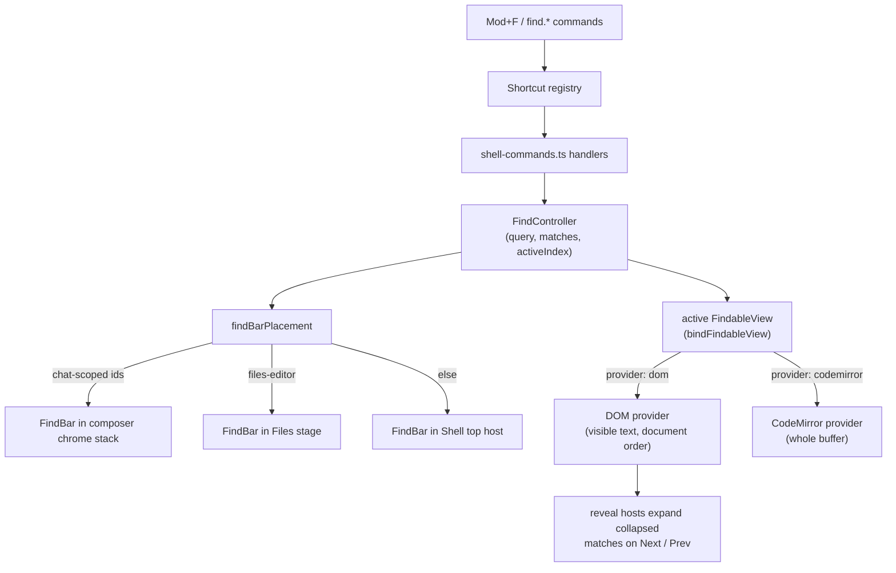

# In-view find

Substring find inside the focused Den view: one `FindBar`, one `FindController`, many findable surfaces. It is not a second global search; [Search](search.md) owns federated, DSL, and project-wide queries, and in-view find may only open it.

**See also:** [Den](den.md) · [Context menus + reveal](den-context-menus.md) · [Search](search.md) · [Keyboard shortcuts](keyboard-shortcuts.md) · [Accessibility](accessibility.md)



## Findable surfaces

Every surface below registers a `FindableView` adapter (`bindFindableView`) or a reveal host (`bindFindRevealHost`) from [`use-findable-view.ts`](../lycaon-den/src/find/use-findable-view.ts). Adding a surface means amending this inventory in the same change.

| Surface | Adapter | Notes |
|---------|---------|-------|
| Session chat transcript | [`ChatSpanBlocks.tsx`](../lycaon-den/src/components/transcript/ChatSpanBlocks.tsx), `session-transcript`, root `den-chat-transcript-visual` | The shell primary fallback. Virtualized: in-view find covers painted rows; global Search loads and reveals targets outside the resident window |
| Worker transcript | [`WorkerTranscript.tsx`](../lycaon-den/src/components/worker/WorkerTranscript.tsx) | |
| Global search results list | [`GlobalSearchView.tsx`](../lycaon-den/src/components/search/GlobalSearchView.tsx) | The hit list only, not the query bar; the adapter scrolls a row into view |
| Tool body | [`ToolPartShell.tsx`](../lycaon-den/src/components/tool/ToolPartShell.tsx), `tool-body:*` | Also a reveal host with a collapsed corpus (title, inline args, inline output). [`ActivitySpanCard.tsx`](../lycaon-den/src/components/tool/ActivitySpanCard.tsx) is the enclosing reveal host, so Next drills span → call detail through the disclosure state |
| Chat content links | [`ChatContentLink.tsx`](../lycaon-den/src/components/transcript/ChatContentLink.tsx) | Reveal host whose collapsed corpus is the recorded document behind a link such as **Raw output in Files**; activating opens the document in Files at the match |
| Chat content documents in Files | [`ChatContentPage.tsx`](../lycaon-den/src/files/components/ChatContentPage.tsx) | Keyed by the chat content document |
| File-edit manifest group | [`TranscriptDiffGroup.tsx`](../lycaon-den/src/components/transcript/TranscriptDiffGroup.tsx) | Reveal host in front of its diff rows; the rows themselves have no adapter and are found as transcript text |
| Source reader | [`SourceReader.tsx`](../lycaon-den/src/components/source/reader/SourceReader.tsx) | `primary` when its host says so |
| Files editor ([files-stage.md](files-stage.md)) | [`ProjectFilesView.tsx`](../lycaon-den/src/files/components/ProjectFilesView.tsx), `files-editor`, `provider: "codemirror"` | Matches the whole buffer; unregistered while a buffer is loading, errored, or a diff |

Surfaces that must not grow a FindBar: the Home project grid, nav and tab chrome, chicklets, badges, and the progress strip, the composer as a target (it is an input; find targets the surrounding transcript), empty states and onboarding, and Settings form fields.

## Commands

| Handler | Title | Behavior |
|---------|-------|----------|
| `find.inView` | Find in view | Toggle the FindBar for the active findable view |
| `find.next` | Find next | Next match, wrapping; Enter in the bar is the same command |
| `find.prev` | Find previous | Previous match, wrapping; Shift+Enter in the bar is the same command |
| `find.replace` | Replace in view | Open the replacement lane (Files stage only; opens find first if needed) |
| `find.selectAllMatches` | Select all find matches | Files editor only: one cursor per match in scope |
| `find.everywhere` | Find everywhere | Seed [Search](search.md) with the current query |

The handler is what each command's `native_ui` action names and what [`shell-commands.ts`](../lycaon-den/src/components/shell/shell-commands.ts) registers against; the contribution ids are `painted-wolf/platform:find-…` under `lycaon/config/packs/painted-wolf/platform/contributions/commands/`. Chords are declared per platform in the keybinding contributions and resolved by the host into `binding_defaults` ([keyboard-shortcuts.md](keyboard-shortcuts.md)); `find.selectAllMatches` is `Mod+Alt+Enter` on macOS and `Mod+Shift+Enter` elsewhere, so this page lists no chords.

**Closing is not a command.** The bar's own × calls `closeFind`, and Escape reaches it through the escape ladder. `closeFind` keeps the query, so the next open and **Find everywhere** still see it.

**Escape ladder** ([`escape-ladder.ts`](../lycaon-den/src/find/escape-ladder.ts)): the single `overlay.dismiss` handler consults one order, `inlineEdit → findBar → revealHighlight → stageLatch`. Each rung declines when it is not open, so Escape falls through. Every rung has a production registrant; a new layer is declared and registered in the same change. `revealHighlight` ends the marking a transcript reveal left on a row ([den-chat-items.md § Reveal anchors](den-chat-items.md#reveal-anchors)). The `findBar` rung reports open when either the find bar or go-to-line is open and dismisses go-to-line first.

**Find everywhere** seeds from the FindBar query whenever it is non-empty, even with the bar closed. If Search is already open it reseeds Search; otherwise it opens Crossbar in Evidence mode. It never invents a third search UI.

**Go to line** shares the chrome and lives in `src/find/` for that reason. It is a second command bar, `GotoLineBar` driven by [`goto-line-controller.ts`](../lycaon-den/src/find/goto-line-controller.ts), rendered by `FindBar` unconditionally, so any host that can show find can show go-to-line. The editor entry point closes find before opening it, so one bar is up at a time. It matches and highlights nothing: it accepts `line` or `line:column`, clamps the line to the document, moves the caret, and scrolls it to centre. Any other value is rejected and keeps focus in the field. `findBarPlacement()` returns `files-editor` whenever go-to-line is open, before it looks at find, because go-to-line is editor-only.

**Replacement:** CodeMirror-backed writable Files buffers show a replacement field plus **Replace** and **Replace all**. These mutate only the active in-memory buffer and honor a frozen find-in-selection scope. A capped query refuses Replace all rather than editing part of a buffer. DOM surfaces are read-only. Project-wide replacement is a separate preview-gated operation in [Search](search.md#replace-and-rename-doors).

## `FindableView` adapter contract

```ts
type BindFindableViewOptions = {
  id: string;
  /** Live root; re-registers when the element identity changes. */
  root: () => HTMLElement | null | undefined;
  /** Matching backend — defaults to "dom". */
  provider?: "dom" | "codemirror";
  /** Required when provider is "codemirror". */
  getEditorView?: () => EditorView | null | undefined;
  /** When true, this view is the shell primary fallback (chat transcript). */
  primary?: boolean | (() => boolean);
  /** When false, unregister (closed plan modal, collapsed file-edit). Default true. */
  enabled?: () => boolean;
  /** Ensure the match's host is painted (virtualized rows) then scroll into view. */
  scrollMatchIntoView?: (match: FindMatch) => void;
};

type FindRevealHost = {
  id: string;
  hostEl: () => HTMLElement | null;
  isCollapsed: () => boolean;
  /** Expand for Find; restore releases only this Find lease. */
  revealForFind: () => () => void;
  /** Optional: searchable text while body is unmounted (file-edit). */
  collapsedCorpus?: () => string;
  /** Visible node immediately before that unmounted corpus, for document order. */
  collapsedCorpusAnchor?: () => Node | null | undefined;
};
```

Controller state: `query`, replacement text, `caseSensitive`, `matches[]`, `activeIndex`, `collapsedCount`, and highlight apply/clear as non-destructive overlay spans that never wrap Solid text nodes. Query typing is debounced (120 ms); Enter, next, and prev flush it. Mutation refresh is trailing-debounced (80 ms). Scrolling and root resize repaint existing overlay geometry without re-walking the corpus. Paint covers the active match and viewport-visible inactive matches, stopping after `FIND_MAX_INACTIVE_PAINT` (200) inactive marks; the active match is never subject to that cap, and the count keeps reporting every match above it. Painting and counting are separate budgets.

**Collapsed matches:** the count includes hits inside collapsed reveal hosts and synthetic `collapsedCorpus` hits, including nested chains (activity span → call detail). A hit is collapsed when any ancestor reveal host is collapsed. Typing does not expand. Next and Prev acquire temporary disclosure leases for the active match's host chain, outermost first, through [`transcript-disclosure.tsx`](../lycaon-den/src/chat/transcript/presentation/transcript-disclosure.tsx), then ask the transcript viewport controller to align the match. Leaving a Find-expanded host releases its lease; Close or Escape releases all Find leases. User disclosure state is unchanged. The bar shows `N of M · K in collapsed` when `K > 0`.

**Placement:** `findBarPlacement()` returns `composer` | `files-editor` | `shell` | `none`. An open go-to-line pins it to `files-editor`; otherwise a closed bar is `none`. Chat-scoped ids (`session-transcript`, `tool-body:*`, `file-edit-diff:*`, per `isChatScopedFindable`) mount in the composer chrome stack, `files-editor` mounts inside the Files stage, and everything else uses the Shell top host. One bar is visible at a time.

While chat Find is open, match navigation controls the viewport and automatic tail follow yields. An arrival catch-up that finds the match off-tail leaves the transcript in reading-history mode.

Surfaces register and unregister on mount and cleanup. `Mod+F` with no registered findable view is a no-op. The active view is whichever registered root was most recently made active:

| Path | When |
|------|------|
| `focusin` within a registered root | The user clicked or tabbed into the surface |
| `focusin` inside a CodeMirror view owned by a registered findable | The editor's own DOM is not the registered root |
| `activateFindableViewForEditor(view)` | An editor command that opens find names its own view, matching by editor identity and falling back to `files-editor` |

Changing the active view clears highlights and, for a `codemirror` view, rebinds the provider before re-running the query. With no active view, the `primary` findable is the fallback (the chat transcript when in chat).

### Provider seam

The controller manages open state, debounce, query history, and placement; the provider matches. `FindProviderKind` is `"dom" | "codemirror"` ([`find-provider.ts`](../lycaon-den/src/find/find-provider.ts)).

| Capability | `dom` | `codemirror` |
|------------|-------|--------------|
| `setQuery` / `count` / `next` / `prev` | yes | yes |
| `replaceCurrent` / `replaceAll` | unavailable | in-buffer replace |
| `scopeToSelection` / `supportsScope` | unsupported | freezes a selection spanning two or more lines for matching and replacement |
| `selectAllMatches` | unsupported | one cursor per in-scope match |

Caps: both providers stop matching at `FIND_MATCH_COUNT_CAP` (10 000) and the bar shows `999+`; CodeMirror refuses Replace all at that cap. `selectAllMatches` stops at `FIND_SELECT_ALL_CURSOR_CAP` (1 000) cursors.

**Query history:** ArrowUp and ArrowDown in the bar walk the session's previous queries (`findHistoryUp` / `findHistoryDown`), anchored on the value in the field when navigation began. History is session-local and never persisted.

## Match model

| Rule | Value |
|------|-------|
| Algorithm | Literal substring; `dom` matches rendered, non-`aria-hidden` text in document order plus declared collapsed corpora; `codemirror` matches the whole buffer, not the viewport |
| Case | Optional case-sensitive toggle (default insensitive); insensitive DOM offsets stay aligned with the original UTF-16 text when case folding changes length |
| Regex / whole word | Out |
| Wrap | Next past the last match returns to the first |
| Empty query | Zero matches; highlights cleared |
| Streaming DOM | Recompute on query change; observe active-root mutations with the trailing debounce; clamp `activeIndex` |
| Order | Document order only; no relevance ranking |

Accessibility: the FindBar is named and keyboard-operable, the match count is a polite live region, and the active match is not distinguished by colour alone ([accessibility.md](accessibility.md)).

## Related

- [`lycaon-den/src/find/`](../lycaon-den/src/find): `find-controller.ts`, `find-match.ts`, `find-provider.ts`, `find-provider-codemirror.ts`, `find-reveal.ts`, `use-findable-view.ts`, `virtual-list-find.ts`, `escape-ladder.ts`, `goto-line-controller.ts`, `FindBar.tsx`, `GotoLineBar.tsx`, `EditorCommandBar.tsx`
