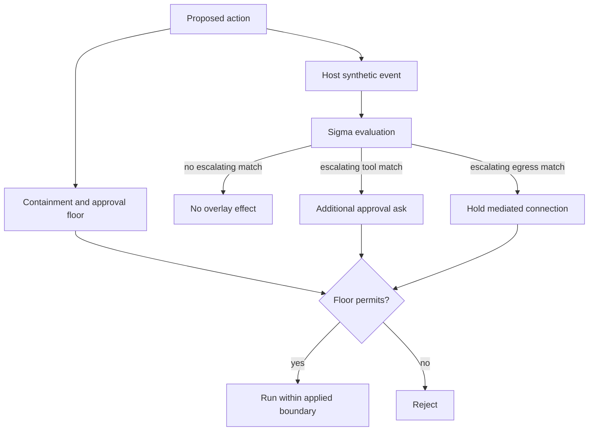

# Detection packs

Detection packs are declarative Sigma rules that recognize high-risk patterns in the agent execution plane and may raise one additional approval ask. As matchers they are an incomplete overlay on the systemic permission floor. Two bundled packs additionally serve as catalog data the floor itself reads; see [Packs that are floor inputs](#packs-that-are-floor-inputs).

**See also:** [Security](security.md) · [Authorization](authorization.md) · [Project overlay](project-overlay.md#detection-packs--project-enable-only) · [Tools](tools.md) · [Extend](extend.md)

**Machine truth:** runtime in [`internal/detectionpack`](../lycaon/internal/detectionpack) (event fields in `event.go`) · bundled packs under [`lycaon/config/packs/painted-wolf/security/host/detection-packs/`](../lycaon/config/packs/painted-wolf/security/host/detection-packs/) with their [README](../lycaon/config/packs/painted-wolf/security/host/detection-packs/README.md) · schemas `schemas/detection-pack.schema.json` and `schemas/detection-rule.schema.json` · generated bridge packs from `lycaon/cmd/codegen-detection-packs`

The limit is the design:

```text
no match -> floor decides as with no packs loaded
match    -> floor still decides; overlay may add an ask
```

A Sigma *match* can never allow an action, clear a floor ask, or treat absence of a match as evidence of safety.

## Floor vs overlay



| Layer | Responsibility |
|---|---|
| Permission floor | confinement, write roots, egress rules, approval posture, explicit grants |
| Detection overlay | additive Sigma matches over synthetic tool and mediated-egress events |

The floor is systemic and covers unknown actions. Packs are openly partial and useful precisely because they can name known consequential patterns without pretending to be the boundary.

## Packs that are floor inputs

Two bundled packs are named exceptions to the layer table. `key-material` and `credential-stores` are the single answer to "what is key material" and "what is a credential store", and the filesystem boundary reads their `TargetFile` literals directly (`detectionpack.BundledKeyMaterialPaths`, `detectionpack.BundledCredentialStorePaths`). Any pack may *match* on `TargetFile`; only these two define those catalogs.

Those literals are a write floor, not a matcher. A path a bundled rule names is refused for writing unless an approval names that exact path, and the same list refuses a project root that would swallow one; see [`internal/confine/hard_deny_writes.go`](../lycaon/internal/confine/hard_deny_writes.go) and [`internal/confine/credential_subject.go`](../lycaon/internal/confine/credential_subject.go). The catalog sits in pack YAML because a protected-path list is data a person should be able to read and extend, not because the ask overlay owns it.

| Property | Why |
|---|---|
| Load failure is a boot failure | A pack that failed to parse must not quietly make `~/.ssh` writable. `Detections.LoadFloors` in [`internal/app/security/floors.go`](../lycaon/internal/app/security/floors.go) returns an error and the sidecar does not start. A matcher pack that fails to load only costs coverage; these cost the floor. |
| Severity bands do not apply | The posture ladder below decides when a *match* may ask. A floor input is not a match, so every supported rule in `credential-stores` contributes its `TargetFile` paths at any level, `informational` included (`Matcher.CredentialStorePaths`). |
| Extension only, outward from the shipped set | `credential-stores` unions the bundled paths with overlay rules that same pack carries; it never replaces them, and a matcher that failed to build leaves the shipped set standing. `key-material` reads the bundled pack alone. A project can neither add nor remove a path in either. |

Their ordinary ask rules behave like any other pack's. A path a person adds through an overlay becomes protected; it never becomes unprotected, and neither pack can widen anything.

## Event boundary

Rules match two host-created event types (`logsource` in `event.go`):

- `tool_exec`: an admitted command or structured tool action;
- `egress_observed`: a destination seen by the mediated connection boundary before dial.

The closed fields include host facts such as containment and effect reach, plus model-authored values such as command line, argv, structured arguments, and declared destination. Matching free-form command values is valid here. Chat and transcript prose are not event sources. A declared destination stays labeled as declared; a card must not present it as observed.

### Process and terminal projection

The host emits one tool event per process in a composed command, derived from the same normalized execution plan the command runner uses, so a second parser cannot disagree with what will execute. Whole-pipeline rules use the pipeline field. Terminal input is projected after line-discipline edits where the host can observe them; shell expansions and recalled history remain unknown and are never fabricated as argv.

### Effect reach

Before evaluation, the host derives whether a named effect is:

| Reach | Meaning |
|---|---|
| `local` | all resolved destinations are within the applied local boundary |
| `remote` | a concrete destination is outside that boundary |
| `unproven` | the host cannot establish the destination |

Rules may filter proven-local actions to reduce noise. Unresolved paths, shell expansion, or ambiguous destinations remain `unproven`; silence is not inferred.

A program's name is never a destination. A wrapper that resolves its endpoint inside itself leaves the host nothing to observe, so it stays `unproven` and continues to ask; a wrapper whose endpoint is declared on the command line or in the action environment is local on the strength of that endpoint. Recognizing emulator names instead would be an allow-list any ordinary project write could join.

Path-shaped actions resolve the same way. Destructive work whose every operand is inside the write jail is proven local, which keeps ordinary work in an attached project quiet without weakening anything outside it. A token the host cannot read (one still carrying a variable, a substitution, a brace expansion, or a replacement placeholder) is never treated as a path, so it stays unproven and asks.

## Levels and posture

Severity controls when a detection may escalate (`detectionpack.Escalates`):

| Level | Light | Balanced | Strict |
|---|---:|---:|---:|
| `informational`, `low` | inert | inert | inert |
| `medium` | inert | inert | may ask |
| `high` | inert | may ask | may ask |
| `critical` | may ask | may ask | may ask |

`critical` is reserved for effects that remove recovery or detection, change durable access, expose credential material, or destroy a containing resource. `high` covers precise serious effects that are difficult but not categorically impossible to recover. `medium` covers reversible consequential actions and coarse signals. Severity describes consequence, not the emotional force of a command name: a broad hostname or generic verb cannot justify the same band as an exact operation plus target.

Advanced Off disables approval cards, including detection asks. Commands still start in the sandbox and host denies still apply, but requested capabilities are granted without a card. See [Authorization](authorization.md#what-advanced-off-turns-off).

Informational rules can still contribute non-gating provenance. [Credential argument advisories](secrets.md#credential-argument-advisories) use separate OAR warn effects.

## Scope and composition

Rules can be bundled, provided by an installed extension, or imported into device configuration. All three sources are additive, enforced structurally:

- a duplicate detection-pack id is refused and names both providers;
- a Sigma rule id claimed by two packs leaves the first claim active and marks the later one inert, naming the pack that keeps it;
- a Sigma rule id claimed twice inside one pack makes every definition inert, including the first: across packs there is an incumbent to defer to, but inside one pack nothing distinguishes the intended definition from the accident;
- a pack cannot contribute files into another provider's detection pack;
- detection units are provider-scoped and cannot be selected through `own`;
- a project may enable a device-admitted pack (`.paintedwolf/detection-packs.yaml`, rows carrying only `id` and `enabled`) but cannot disable one or define rule content. A row that asks to turn a pack off is refused and listed as ignored; only the device turns a pack off, in Settings.

Content that is not running stays visible in Settings with a reason; otherwise “not running” would be indistinguishable from “ran and found nothing.”

| State | Where it shows |
|---|---|
| Unsupported syntax, unknown field, shadowed rule id | The rule's own row, marked unsupported with the reason that made it inert |
| A rule that would not parse, one an extension's state disabled, one refused as a foreign contribution | The pack's load warnings, because there is no rule to hang a row on |
| A pack turned off on this device | The pack's own toggle; its rules stay listed |
| A rule that panicked while evaluating | The pack's load warnings. The host recovers, disables that rule for the remainder of the process, and restores it on restart ([`panic_ledger.go`](../lycaon/internal/detectionpack/panic_ledger.go)) |

The same distinction holds for the engine itself. When packs fail to load the host wires no detection producer, and the approval gate treats that as an unreported fact: actions raise incomplete facts rather than proceeding as though a scan had come back clean.

Catalog reloads publish one complete generation in the composition root. Approval evaluation, credential observation, egress matching, and credential-store paths read that generation through stable startup bindings. Reloading rules does not reconstruct the approval gate or discard chat grants and quiets. Each consumer snapshots its input at its own operation boundary.

## Rule organization

Rules pair a concrete service or action identity with one consequence axis: access change, credential issuance, secret disclosure, destructive mutation, service disruption, publication, financial effect, or similar bounded outcome.

Effect tags state whether the consequence is local or external and whether it is recoverable. They are not presentation. Level says how loud a card should be; the tags decide whether the operation is gate-shaped at all, and a rule that reaches the gate with neither tag satisfied raises nothing. A rule declaring no effect tag is treated as external and unrecoverable, so an unreviewed pack fails toward asking rather than toward silence.

The external tag is conditional on the applied boundary: an external effect only reaches when the action can dial, so an escalating match on a command inside an egress-denied boundary is a match on intent rather than effect, and does not ask. The local tag carries no such condition, and a rule stands its own local case down with `filter_local` against the write roots the boundary actually applied. Recoverability bands the card; it never decides whether there is one. See `authorityMisuse` in [`internal/gate/evaluate.go`](../lycaon/internal/gate/evaluate.go).

A structured cloud call names its operation in an argument. Where a provider's rules already match on operation identity, the host projects that identity into the same field the command line produces, so one reviewed rule covers both surfaces. Where a provider's rules match command text instead, a generated bridge pack (`azure-structured-actions`, `gcp-structured-actions`) supplies the structured identities. Structured native and MCP actions reach detection through bounded `name=value` facts produced by registered adapters. Provider mappings may add observations and asks but cannot grant permission or suppress another rule. Exact tool identities are matched as complete values, never substrings.

Rules that claim a consequence must filter preview, validation, help, dry-run, or local-emulator modes when those modes make the claimed effect false. Effect reach is resolved per host-projected process stage, so a contained `rm` stage may satisfy a rule's local filter without lending that fact to a neighboring process. Registry resolution follows the configuration search path the package manager actually uses inside the attached project; a loopback registry is local effect reach, while missing or remote configuration remains unproven or remote and continues to ask.

## Connections

Mediated egress rules see the destination hostname before dial, not decrypted traffic or an API operation. Severity must respect that limited observation.

An escalating connection match holds that exact connection while the approval is pending. Its decision is scoped to the action, host, pack, rule, and severity; an ordinary session-level host approval cannot silence a later detection match. Direct IP, daemon-internal effects, and traffic outside the mediation plane are not re-described as observed destinations.

## Correlation and approval

Correlation groups related observations for review; it never supplies authority to a different action.

| Repetition | Presentation | Authority |
|---|---|---|
| Byte-identical action while pending | Join one card and count waiters | One decision releases only those identical waiters |
| Same rule, different targets | Show related history | Each distinct action needs its own decision unless a live chat acknowledgement names that rule |
| Same exact held connection | Share the action-scoped result | Expires with that action identity |
| Changed command, args, host, project, chat, or execution | New card | Inherits nothing |
| Exact retry after denial | May use the chat's exact deny set | Applies only to that identical action |

Correlation has no inferred time-based mute. Acknowledgement is an explicit user choice for a named rule and bounded duration, recorded separately from the rule match. Detection-only cards recommend the chat acknowledgement; another gate firing on the same action is never cleared by that acknowledgement.

## Packaging

An extension carries a detection pack under:

```text
host/detection-packs/<pack-id>/pack.yaml
host/detection-packs/<pack-id>/rules/<rule>.yml
host/detection-packs/<pack-id>/fixtures.yaml
```

Every file is a resolved unit, so the matcher uses the bytes selected and integrity-checked by the extension catalog. Rules without an admitted manifest do not form a pack.

A device-folder import copies an allowlisted shape into `<configdir>/detection-packs/<id>/` rather than linking arbitrary files (`detectionpack/import.go`). The preview lists accepted, ignored, and inactive content. Distribution to more than one device should use a versioned extension so dependency, integrity, and update behavior remain explicit.

## Rehearsal

`fixtures.yaml` states positive and negative cases for the rule claims. Rehearsal passes those cases through the production tool and egress adapters, not handcrafted event objects. Positive cases must match. Negative cases are evaluated against every rule in the pack so a sibling rule cannot make the supposed quiet path loud. Unsupported rule syntax also fails rehearsal because inert content cannot substantiate a coverage claim.

Rehearsal runs in repository validation, extension validation, and device-import preview. It is an authoring gate, not a runtime load gate: a failing pack may remain loadable because the systemic floor already assumes detection can miss. The failure says the pack's stated coverage was not demonstrated.

## Authoring loop

Rules are Sigma YAML, not a product-specific detection DSL. First-party coverage includes AWS, GCP, and Azure. Severity comes from the reviewed rule, not an upstream feed. Cards and ledger entries cite the pack ID, Sigma rule ID/title, and provider label when known. Detection is openly incomplete; evadability alone is not a reason to narrow a rule.

1. Choose one observed event source and one consequence.
2. Match only fields the production adapter emits.
3. Use a fresh Sigma rule id and an honest severity/effect classification.
4. Add production-shaped positive cases and pack-wide negative cases.
5. Filter modes where the claimed consequence is false.
6. Run extension validation and the scoped detection digest.
7. Inspect the resulting card or held-connection explanation.

The bundled-pack README and the `write-detection-pack` skill provide field-specific guidance; extension packaging is in [Extend](extend.md#detection-packs-hostdetection-packs).

## Supported Sigma subset

The runtime accepts the standard metadata needed to identify and explain a rule, one supported log source, selections, and a bounded condition grammar.

Supported matching is exact equality plus `contains`, `startswith`, `endswith`, `re` using the host's safe engine, and `all` for compatible string modifiers. A filter that tests for a flag matches a whole argv token rather than a command-line substring, so a longer flag or an argument value carrying the same text cannot stand a rule down. Conditions support boolean composition, parentheses, named selections, and `1 of` / `all of` forms.

Aggregations, temporal correlation syntax, unsupported modifiers, unknown event fields, and unknown top-level behavioral keys are inactive with diagnostics. The exact accepted keys and modifiers are defined by the Sigma loader and `schemas/detection-rule.schema.json`.

## Invariants

- Matching is additive and incomplete: a Sigma match may only add an ask, and a miss cannot weaken the permission floor.
- Exactly two bundled packs are also floor catalogs, and only in the tightening direction: their paths are a write floor only an exact-path approval opens, their load failure stops boot, and no ask-side rule of theirs can grant anything.
- Only host execution-plane events are matchable; declared and observed values remain distinct.
- Severity follows evidence and consequence precision.
- Project content can enable but cannot disable or author rules.
- Correlation never becomes authorization.
- Inactive content is visible and attributed.
- Fixtures exercise production adapters.
