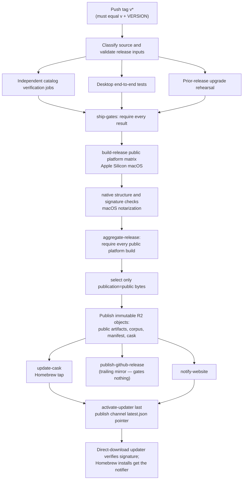

# Dev tasks

Toolchain setup, local dev stacks, debug capture, and the `./task` targets with non-obvious behavior. `./task --list` is the complete catalog.

**See also:** [Docs map](README.md) · root [AGENTS.md](../AGENTS.md)

---

## Prerequisites

- macOS on Apple Silicon at or above the floor in `lycaon/internal/platformfloor/macos_floor.txt`, with Xcode Command Line Tools (`xcode-select --install`)
- Go at the `go` directive in `lycaon/go.mod`
- [Bun](https://bun.sh) at `.bun-version` for `lycaon-den/`
- Node at `.node-version` for OpenAPI lint, bundle, and codegen
- Rust with Cargo for the Tauri shell, installed through [rustup](https://rustup.rs) so `rust-toolchain.toml` selects the version

`./task setup-dev` checks each of these. Current pins and upstream versions are linked from the [dependency inventory](operations/dependency-inventory.md).

## First-time setup

```bash
./task setup-dev # validates toolchains, installs deps and managed runtimes
```

After changing a frontend dependency patch, run `./task setup-dev -- --frontend`
to refresh the pinned packages before verification. Captured test trees share
the workspace's installed dependencies.

Hosted shell preparation uses `./task setup-dev -- --shell-resources` to write
qualified notices into the build checkout. `licenses:notices` is the isolated
verification check; its snapshot outputs do not prepare a subsequent invocation.
The workspace cache warmer also prepares missing notices before compiling.

Use `./task` from the repository root. If direnv is installed, setup allows the
repository's `.envrc` so bare `task` also works. Homebrew and direnv are not
prerequisites, and setup does not edit shell startup files.

### Build outputs, caches, and locks

Nothing the tooling writes lives inside the checkout. `scripts/artifact_paths.py`
resolves four locations, and `scripts/artifact-paths.sh` exports them to every
script and `./task` target:

| Location | Holds | Default | Override |
|---|---|---|---|
| Artifact root | Verification receipts and stage logs, digest captures (`last-run/`), background jobs, performance reports (`perf/`), e2e state | `<user cache>/artifacts/<checkout>` | `PW_ARTIFACT_ROOT` (`PW_TEST_ARTIFACT_ROOT` wins inside test runs) |
| Build directory | Executables and stages compiled from this checkout: `lycaon-dev`, `pw-logs`, `pw-document-core`, `lycaon-debug`, the performance sidecar, the staged scanner bundle | `<artifact root>/bin` | `PW_BUILD_DIR` |
| Tool directory | Downloaded and pinned third-party tools shared by every checkout: `task`, linters, `oasdiff`, license tools, the scanner release cache | `<user cache>/bin` | `PW_BIN_DIR` |
| Document core builds | `pw-document-core` builds addressed by a digest of their sources, shared by every checkout and verification slot | `<user cache>/document-core/<digest>` | — |
| Lock root | Repository snapshot and source capture locks | `/tmp/paintedwolf-$UID/locks/<checkout>` | `PW_LOCK_ROOT` |

`<user cache>` is `~/Library/Caches/PaintedWolf` on macOS and
`${XDG_CACHE_HOME:-~/.cache}/paintedwolf` on Linux. `<checkout>` is the checkout
directory name plus a hash of its absolute path, so a scratch worktree never
replaces the main checkout's builds. Test source snapshots build into a
directory owned by that run. Print a location from the repository root with
`python3 scripts/artifact_paths.py artifacts|build|bin|locks`; the examples
below use `BUILD_DIR="$(python3 scripts/artifact_paths.py build)"`.

The repository ships no pre-commit hook. **Closeout:** a change pushed for a pull request closes out in CI; a change handed off without a push runs `./task check-fast`; `./task check` is full local verification on request. **CI** (`ci.yml`) runs the fast tier for a ready PR and the affected-scope integration gate for its merge group, both behind required `check`; enabling auto-merge on a ready PR adds it to the queue once its fast tier passes. Drafts do not verify. Broad changes run the full check profile in the queue. `qualification.yml` runs full check, platform, and E2E after merge; releases require that exact commit's qualification. Manual CI dispatch runs full check and platform, or the fast tier with `profile: fast`. Nightly owns race, fuzz, stress, WebKit, performance, and quarantine observation. See [hosted admission and qualification](test-strategy.md#hosted-admission-and-qualification) for scope, offline execution, recovery, and queue rollout.

### Where credentials live in development

Every credential value lives in `{configdir}/credential-vault.age`, one age-encrypted document shared by provider keys, web-research keys, MCP OAuth tokens, the secret fingerprint key, and managed secrets. Development builds keep the matching age identity in `{configdir}/.credential-vault-development-identity` at `0600`; tests use the same isolated path and never touch Keychain or ask for a password.

Release macOS builds store only the random age identity in the device-only login Keychain; the vault ciphertext stays in the config directory. Release Linux and Windows builds wrap the identity in `{configdir}/credential-vault-identity.age` with the app password, which the desktop sends to the engine over a private startup pipe, never argv or the environment.

```bash
LYCAON_DEV=1 "$BUILD_DIR/lycaon-dev" credentials where        # report the vault and identity provider
LYCAON_DEV=1 "$BUILD_DIR/lycaon-dev" credentials purge --yes  # remove the vault and its identity (--yes required)
```

Quit the app first: purge refuses while an engine is running, because that process holds the decrypted identity and credential values in memory until it exits. For an installed release, the bundled `pw` accepts the same arguments; the release build ignores development config overrides and always addresses the release config root. On macOS, purge also removes the Keychain identity.

The optional `./task dev:signing-identity` remains for development integrations that use Keychain directly, such as the Git credential helper. The development credential vault does not require code signing.

## Bundled scanner development

Application builds use the pinned prebuilt Opengrep release from
[paintedwolf-opengrep](https://github.com/paintedwolf-ai/paintedwolf-opengrep).
Engine source builds and compiler dependencies live in that repository. A cache
miss here downloads the selected release and verifies its complete payload.

| Command | Purpose |
|---------|---------|
| `./task scan:opengrep:stage` | Fetch or reuse the pinned release and stage the scanner |
| `./task scan:opengrep:stage -- --offline` | Require a verified cached release without network access |
| `./task scan:opengrep:stage -- --offline --archive /absolute/path/release.tar.gz` | Import an archive matching the checked-in pin and stage it offline |
| `./task scan:opengrep:select -- --tag "$ENGINE_TAG" --expected-commit "$ENGINE_COMMIT" /absolute/path/release.json` | Authenticate a published immutable release and every archive against the reviewed producer commit, then update the pin and retained evidence; an HTTPS descriptor URL is also accepted. New selection requires online verification |
| `./task test:lycaon-rules` / `./task test:scanners` | Check product rules and scanner integration against the selected engine |
| `./task test:lycaon-rules -- -projects test/testdata/opengrep-projects/helper-boundaries.yaml -repeats 2` | Compare both analysis modes on the helper project corpus using the selected engine |

`./task build:lycaon-dev` embeds the selected engine identity in the sidecar and
stages the same payload. Review a changed
[`bundled-manifest.yaml`](../lycaon/config/runtime/scanners/bundled-manifest.yaml)
with any rules that need the new engine, then run both scanner checks above.
Ordinary builds never select an automatically moving latest version.

Project evaluation flags for `test:lycaon-rules`:

- `-opengrep /absolute/path/to/opengrep` evaluates an offline candidate engine for that conformance invocation only; the normal resolver still verifies the checked-in release before the runner starts, and neither the pin nor production analysis mode changes. An executable launcher is usable for development measurement but not held-out artifact admission: retain its native-core identity separately.
- `-mode intrafile` or `-mode intraprocedural` evaluates one mode; the default runs both and the output contains only executed modes.
- `-project-timeout 20m` changes the ten-minute base deadline per project. `PW_TEST_TIMEOUT_SCALE` (1 through 4) multiplies it once; the JSONL identity records both the base and effective deadline. Large projects can need several minutes without host contention, so a timeout is not a clean scan or a performance measurement.
- `-repeats 1` gives one measured run; the default two repetitions check stability.
- `-rules /absolute/path/candidate-rules.yaml` compares a complete candidate bundle, including a separate guarded-signature experiment. The companion `ordinary-helper-variants.yaml` and `helper-dead-closures.yaml` corpora cover pinned-project derivatives and dead-closure controls.

Retain the JSONL identities, findings, diagnostics, repetition stability, and resource measurements.

The shared cache defaults to `opengrep-artifacts` in the
[tool directory](#build-outputs-caches-and-locks); `OPENGREP_CACHE_DIR`
overrides its location. Each checkout stages the selected release under
`opengrep-bundle` in its build directory (`OPENGREP_STAGE_DIR` overrides). Retain
each pinned outer archive alongside its extracted generation directories:
selection and staging recheck the archive. Isolated test checkouts reuse this
cache while keeping their own release selection. Download failures can be
retried normally and never start an engine source build.

Development executables run under the hardened runtime releases ship with:
`scripts/sign-dev-binary.sh` signs them with the stable development identity
when it is provisioned and ad hoc otherwise, always with `--options runtime`.
They differ from release only in `get-task-allow`, so debuggers can attach.
Code that generates machine code at run time is killed here exactly as in a
release. Developer ID signing of engine components and notarization of the
final app follow [Release operations](operations/release.md#engine-selection).

## Den local dev (backend logs visible)

These shared-app commands are for intentional development-app operation. Agents
verifying their own changes use the [isolated sidecar procedure](#isolated-sidecar-verification);
stopping or replacing the shared Den engine requires user authorization.

Development builds use `~/.config/paintedwolf-dev/` (release installs use `~/.config/paintedwolf/`). The two trees never cross-read — see [naming](naming.md). `setup-dev` provisions the pinned development browser, and every `den:sidecar` task retries provisioning before it starts; a release build embeds its browser instead.

Two terminals from repo root — sidecar logs on stderr in terminal 1; the Tauri shell in terminal 2 attaches via `LYCAON_ATTACH_ONLY=1` (no muted bundled spawn):

```bash
./task den:sidecar        # terminal 1 — foreground `$BUILD_DIR/lycaon-dev serve`
./task den:sidecar:fresh  # same + wipe Den session state in ~/.config/paintedwolf-dev/
./task den:dev            # terminal 2 — `bun run tauri dev` (requires sidecar health)
```

`den:dev` stops this checkout's Vite on `:1420` before bind; a foreign listener is an error. `den:sidecar` binds `LYCAON_ADDR` (`127.0.0.1:8787` by default): a live engine answering `GET /health` is a refuse — run `./task den:sidecar:stop` only when you mean to replace it. An unresponsive engine listener is reclaimed; a foreign listener is an error.

**Fresh pair** (`den:sidecar:*:fresh` then `den:dev`): every fresh task runs `den:sidecar:stop` first, because the engine takes its store instance lock at startup — too late to defend a store the wipe has already deleted. `db:wipe` (see the [task table](#targets-with-behavior-the-description-cannot-carry)) clears the store and every store-keyed host tree: project host data, drafts, source content/observations, checkpoints, worker branches/seeds, session worktrees, and the web index. The fresh-session step clears Den's store-keyed boot slices while preserving app preferences, including the completed-onboarding latch, and marks the launch so the desktop shell lands on home. **Quit any open Den window** before `den:dev` after a fresh sidecar run so the new process reads cleared disk state.

**Attach-mode caveat:** do not use in-app "restart backend" while on `den:dev` — it spawns a new sidecar with stderr discarded. Restart terminal 1's `den:sidecar` instead. Authenticated managed-secret reveal is unavailable in attach mode because the native shell did not start the engine with its ephemeral proof key; bearer-only key enrollment would defeat the reveal boundary. For isolated native reveal testing, build `./task den:app -- --debug` and launch that debug app's executable with `LYCAON_CONFIG_DIR` pointing at a scratch directory. It starts its own engine on an ephemeral port and supports native reveal without stopping the development app. Release builds ignore the config override. Engine startup logs are written under the selected config directory.

Scripts: `scripts/den-dev-sidecar.sh`, `scripts/den-dev-app.sh`. Defaults: `LYCAON_DEV=1`, token synced to `~/.config/paintedwolf-dev/api.token`. Override with env (`LYCAON_LLM_MOCK=1`, `LYCAON_API_TOKEN`). Mock LLM is test-only; production serve requires a configured provider.

### Isolated sidecar verification

Build through the shared verification queue, then launch the binary on a scratch
configuration and an unused port. Probe the chosen port first; never kill an
existing listener to free it. The shared `:8787` / `paintedwolf-dev` store is not
scratch, and harness ports are allocated dynamically.

```bash
./task build:lycaon-dev
BUILD_DIR="$(python3 scripts/artifact_paths.py build)"
SCRATCH=$(mktemp -d)
PORT=8850  # choose another if lsof reports a listener
lsof -nP -iTCP:"${PORT}" -sTCP:LISTEN
# Continue only after confirming the port is unused.
LYCAON_ADDR="127.0.0.1:${PORT}" LYCAON_CONFIG_DIR="${SCRATCH}/cfg" LYCAON_LLM_MOCK=1 \
  "$BUILD_DIR/lycaon-dev" serve & SIDECAR_PID=$!
```

The token is minted at `${SCRATCH}/cfg/api.token`; health is served at
`http://127.0.0.1:${PORT}/health`. Stop only the PID captured at launch with
`kill "${SIDECAR_PID}"`. A listener PID discovered afterward is not proof that
you own it; inspect its parent, start time, and arguments if ownership is unclear.

Do not use `den:sidecar:stop` to stop this scratch process. Its default address
is still `127.0.0.1:8787` even when only the config directory is overridden, and
its bundled-engine sweep is not scoped by that directory. Shared-engine stop
operations require explicit user authorization. Never broadcast-kill an engine.

### Development UI diagnostics

**Scroll / deferred-reveal debug** is on by default for `den:dev` (level `1` — tail-release transitions, reveal lifecycle, perf stalls). Runtime logs stay outside the attached repository: startup prints the JSONL path (normally `~/.config/paintedwolf-dev/debug/den-scroll.jsonl`; an isolated `LYCAON_CONFIG_DIR` moves it with the rest of that run's state). Follow the printed path with `tail -f`. Force off: `VITE_DEN_SCROLL_DEBUG=0 ./task den:dev` or `localStorage.setItem("den:scroll-debug","0")` then reload.

Level `1` writes bounded JSONL batches every 500 ms, with at most one outstanding request, and does not duplicate each event to the console. The queue is capped at 256 records and 24 KiB; overflow and failed batches are counted in the next `debug-sink-overflow` record. Page hide flushes queued records with a beacon. `sync-summary` records report count, total duration, and maximum duration per measurement label over approximately one second, including `scrollbar.update`, `scrollbar.clamp`, `resize.deliver`, and `transcript.rebuild`.

Level `2` (`VITE_DEN_SCROLL_DEBUG=2` or `localStorage.setItem("den:scroll-debug","2")`) also prints interactive console traces, including scroll writes. Use level `0` for smoothness comparisons, then level `1` to attribute work. In Safari, disable automatic JavaScript heap snapshots for the timing comparison: snapshot-triggered collections can dominate frame time. Compare the same content and interactions in the same build mode, separately tracking resize frames, scrolling, and idle frames.

## Den harness (LLM-drivable stack)

```bash
./task den:harness                       # boot the stack; Ctrl-C tears it down
./task den:harness:test -- --grep name  # run Playwright web specs against it
```

The web harness defaults to Chromium. `PLAYWRIGHT_WEB_BROWSER=webkit ./task den:harness:test -- e2e/editor-scroll-paint.spec.ts` verifies the same application path in WebKit. For scroll and live-reflow changes, check both engines with heap snapshots and development diagnostics off.

Interactive startup submits its sidecar build and engine staging through
`./task den:harness -- --prepare`, using normal queue admission. That reservation
ends before the sidecar and Vite start; the interactive session holds no queue
slot. A queue pause delays preparation but does not stop an already running
session. Run the interactive target separately from other targets.
`den:harness:test` and `den:harness:canary` retain queued execution throughout.
Preparation writes into the harness's private runtime directory and uses
exclusive admission for shared engine staging; it does not produce a test receipt.

`den:harness` boots a **native, no-Docker** stack — a background mock-LLM sidecar (`LYCAON_LLM_MOCK=1`, isolated sqlite, deterministic and keyless) plus the Vite web frontend — and pre-registers a fixture project named **"Harness"** via the API so it appears in the welcome launcher, with no localStorage seeding. The browser reaches the sidecar **same-origin through the Vite dev proxy** (`VITE_LYCAON_PROXY=1`, proxying `/v1` + `/health`), so there are no cross-origin CORS preflights.

Default ports are **per-process** (derived in `scripts/harness/lib.sh`), so concurrent stacks — a dev harness beside a test run, or peer agents in one checkout — never collide, and the startup banner prints the actual URL, bearer token, and project id. Override with `LYCAON_E2E_ADDR` / `LYCAON_E2E_VITE_PORT` for a fixed address.

Vite's optimized dependencies live under each harness state's `runtime/vite-cache`.
They are not shared with other harnesses or the development app: replacing a live
optimizer cache invalidates module URLs already served to its browser. Default
frontend diagnostic output also follows the harness config directory.

Each run has a supervisor that owns a separate process group for the sidecar, Vite, and browser tests. It stops that group when the runner exits, its launcher exits, or it receives Ctrl-C, SIGTERM, or SIGHUP. Shutdown allows five seconds for exit before killing remaining members of that group; it never selects processes by port or executable name. A sidecar replaced through the crash/restart helper is also stopped, using its recorded PID and process start time to verify ownership.

Harnesses have a **three-hour maximum lifetime**, including startup, so a forgotten background invocation cannot run indefinitely. Set `LYCAON_HARNESS_TIMEOUT_SECONDS` before launching to change this limit; `0` requests an unlimited run. A deadline exit reports status 124. Retain the command's process/session handle and stop it when verification is complete; the deadline is a backstop, not a completion signal.

Each temporary state directory has a PID-and-token lease held by the supervisor. After stopping the process group, teardown deletes only its matching lease; startup collects tagged states whose lease-holder process is no longer alive. `HARNESS_KEEP_STATE=1` releases the lease and preserves the directory after stopping the processes. Killing the supervisor itself with SIGKILL prevents its cleanup; use Ctrl-C or SIGTERM for cancellation.

`den:harness:canary` runs the smallest tier-is-alive slice (shell boots, `__harness` drives a chat, a real prompt renders a reply). It lives on `check:digest`, not on `check` or CI — run it (or `den:harness:test`) when changing the harness. On failure, `den:harness:test` keeps Playwright artifacts (`lycaon-den/test-results/` — page snapshots, traces) instead of deleting them.

`den:webkit:scroll` (macOS, in the nightly E2E selection) holds the chat to the invariant that WebKit's threaded scrolling makes easy to break: once a native input stream settles, the offset the scrolling thread paints is the offset the main thread hit tests, and both hold the same extent. When they part, every click lands a fixed distance from the pointer until the next scroll. Chromium, jsdom, and Playwright's WebKit screenshots all paint from the main thread and cannot see it. The target first runs `webkit-harness probe`, which builds only the harness crate (`lycaon-den/src-tauri/crates/webkit-harness/`) and reads the scrolling tree of a plain scrolling page. On a virtual machine, where WebKit builds none, it reports a skip before the harness stack starts; on physical hardware a missing tree fails. It then boots the harness Den in a real WKWebView with ephemeral storage and first-run already completed. Its `scroll-transcript` harness scenario admits varied prose and linked tool results through the real transcript store and SSE path, without model calls. Seed and extension wait for the exact admitted tail row in the selected session before testing geometry. A delivery failure stops the run with transcript and DOM evidence; it does not reload and retry a different session. It sends mouse-wheel notches and button presses through the host's own event path and reads WebKit's scrolling tree after each scenario: steady, re-measuring, and streaming tails; rows above the reader settling shorter and taller under a glide; clicks and held presses at every point in a glide's landing; disclosures pressed at the tail; and selections dragged as glides land in a chat long enough to virtualize. A failing check prints the main thread's journal since the previous check: scroll events with the extent at each, and every offset Den wrote. It takes exclusive admission because a real-time scroll race must not share the CPU. Add a scenario to the harness's `src/scroll_invariants.rs` when a change touches how the chat writes offsets or changes its extent.

**Driving it (agents):** point a browser tool at the printed URL. A semantic driver, `window.__harness`, is installed in harness mode so an LLM can drive the whole UI without hunting selectors or polling screenshots — every method performs real DOM actions and returns JSON:

```js
await __harness.help()               // list methods (state/transcript/testids, waitFor*, actions, jump, escape hatches)
await __harness.openProject('Harness')
await __harness.newSession('look at the repo')
await __harness.prompt('say hello')  // sendPrompt + waitForIdle (resolves on the mock reply)
await __harness.transcript()         // structured read-back
await __harness.openTab('progress')  // progress | workflows | git | workers
await __harness.approveBlueprint()   // when a blueprint is awaiting approval
await __harness.goto('checkpoint-held') // seed via /harness/* then wait for UI
await __harness.switchSession(id)    // click focused-session-list row
await __harness.openStage('files')   // open a Context stage
await __harness.dump()               // state + transcript + testids as evidence
```

`state` reports the current view, connection, busy flag, project, tabs, and pending gates; `waitForIdle` / `waitForTestid` / `waitForText` resolve on real signals; `click` / `fill` / `clickText` are escape hatches. Jump helpers (`goto`, `listSessions` / `switchSession`, `openStage`, `openSearch`, `openFile`, `rewind`, `approveCheckpoint` / `denyCheckpoint`, `approveWorkflow`, `resize`, `dump`) wrap the same `/harness/*` seeds the Playwright helpers use. The driver lives in [`src/platform/harness/harness-driver.ts`](../lycaon-den/src/platform/harness/harness-driver.ts) and is gated on `VITE_LYCAON_PROXY=1`, so it is tree-shaken out of production builds. Clicking through the UI directly also works.

**Crash / restart:** with an active harness lease, `bash scripts/harness/crash-restart.sh` SIGKILLs the leased sidecar and brings it back on the same state dir (the boot-recovery path). Under `e2e:den` it SIGKILLs the sidecar process inside its container, whose serve loop starts the next one on the same store, so specs that stage a backup restore can apply it before later specs run. The container itself stays up: restarting it rebuilds its network link, and Chromium aborts in-flight page loads when the host's network changes.

**Authoring tests:** write specs into `lycaon-den/e2e/` reusing `e2e/helpers.ts` (`bootstrapChatSession`, `sendChatPrompt`, app-state seeding), then run them with `den:harness:test` — the same suite as `e2e:den` but against the native stack. The harness proxy is opt-in; `den:dev` (Tauri) and `e2e:den` (Docker) are unaffected. The Docker tier cross-builds the container's sidecar on the host once for every stack, and gives the container Go module and build caches under `e2e-go-cache` in the [artifact root](#build-outputs-caches-and-locks) that persist across runs (override with `LYCAON_E2E_GO_CACHE_DIR`). It also stages the pinned Git toolchain for the container's platform from `lycaon/config/gitengine/pin.yaml` into `e2e-go-cache/gitengine` and points the sidecar's `LYCAON_ENGINE_ROOT` at a per-run copy. Each run's state, seeded project roots, and config live under the artifact root's `e2e-state/`, a path the Docker VM can bind on macOS as well as Linux. The build and sidecar containers run as the invoking user, so the tests can read what the sidecar writes and cleanup can remove it. Specs create project roots under that state directory (`e2eTempDir`), since the sidecar sees only bound paths. Before the stack starts, `e2e:den` builds the native harness sidecar on the host for specs that start their own engine, and stages the maintained scanner for the container's platform into the run's `engine-root`; a platform without a maintained release (Linux arm64 under Docker Desktop) has no scanner. On Linux the stack uses the host's network, so the engine reaches fixture services that specs serve on host loopback and specs reach the engine's loopback callbacks. Docker Desktop shares the host's network only with its host networking setting enabled; set `LYCAON_E2E_NETWORK_MODE=host` there to match Linux. Like `den:harness:test`, `e2e:den` runs with manual model completions (`LYCAON_LLM_MANUAL=1`). `e2e:den` splits the suite into `LYCAON_E2E_SHARDS` (default 2) parallel stacks, dealing spec files to them in turn so adjacent slow specs land on different stacks; `LYCAON_E2E_JOB_SHARD=k/M` runs only the k-th of M slices, which CI uses to spread the suite over three jobs. `LYCAON_E2E_PLAYWRIGHT_READY=1` skips the browser install when an earlier step already ran it.

### LLM modes

The harness runs the mock LLM by default. Real and manual modes are opt-in through `./task den:harness` environment variables:

```bash
LYCAON_HARNESS_REAL=1 ./task den:harness                     # copied provider settings, real completions
LYCAON_HARNESS_MODEL=gemini-2.5-flash ./task den:harness     # pin a model on the seeded project
LYCAON_HARNESS_PROVIDER=gemini LYCAON_HARNESS_MODEL=gemini-2.5-flash ./task den:harness  # select its provider
LYCAON_LLM_MANUAL=1 ./task den:harness                       # play both sides — you author the assistant's turns
```

Real mode disables the mock. At startup the harness copies the development credential vault and identity, `providers.local.yaml`, and `model-policy.yaml` into its throwaway config; the sidecar resolves provider keys and the default model from those copies ([registry.go `resolveAPIKey`](../lycaon/internal/llm/registry.go)). Harness writes stay in that config. `LYCAON_HARNESS_PROVIDER` selects the provider for a model override; otherwise the copied global coordinator supplies it.

The authenticated non-LLM `/harness/*` fixture controls are available in every harness mode. In **manual** mode the driver also gains working `__harness.llm` controls: `auto(text|false)`, `manual()`, `pending(waitMs?)`, `respond({text, toolCalls})`. Auto-reply is on by default so internal calls (workers, summarizers) don't block; call `__harness.llm.manual()` to intercept the next completion, read it with `pending`, and supply it with `respond`. Backed by `ManualProvider` ([manual_provider.go](../lycaon/internal/llm/manual_provider.go)); model discovery answers from the E2E model fixture, so manual mode needs no local model server. The pending queue is shared by every chat, so a spec reads it with `GET /harness/llm/pending?session_id=<id>` and never answers a request an earlier spec left waiting. Turning auto-reply back on answers every request still waiting with the auto text. The `/harness/llm/*` endpoints require `LYCAON_LLM_MANUAL=1`. All harness routes additionally require a development build, `LYCAON_DEV=1`, and `LYCAON_HARNESS=1` — they are never present in `den:dev` or production.

Scripts: `scripts/den-harness.sh`, `scripts/den-harness-test.sh`, `scripts/harness/supervise.py`, `scripts/harness/lib.sh` (reuses `e2e-sidecar-bg.sh`, `e2e-vite.sh`, `e2e-sidecar-stop.sh`, `scripts/e2e/env.sh`).

### Manual verification

When a change touches a **Den UI surface** (a panel, card, overlay, nav, strip, tool card, transcript row, settings page, search pane) or an **observable session flow** (coordinator/worker behavior, plan approval, checkpoints, overlay merge, progress), automated tests are necessary but not sufficient — drive the running app through the harness and confirm the behavior before calling the change done.

The loop: `./task den:harness` → point a browser tool at the URL → drive the new surface via `window.__harness` (`openProject` → `newSession` → `prompt` / `openTab` / `click` → `state` / `transcript`) → **assert on structured `state` and the browser console, not on a screenshot** → capture one screenshot as proof.

- Spending tokens on a real provider for this is expected. Use `LYCAON_HARNESS_REAL=1` when the flow needs genuine agent behavior, and `LYCAON_LLM_MANUAL=1` (`__harness.llm`) to script deterministic assistant turns and tool calls when you need a specific surface state without billed calls.
- Where the check should be permanent, author a spec into `lycaon-den/e2e/` and run it with `./task den:harness:test`.
- This is manual end-to-end verification; it complements, never replaces, unit and contract tests.

**Accessibility (macOS):** the OS text size, VoiceOver, Spoken Content, focus, and reduced-motion checklist lives in [`accessibility.md`](accessibility.md) — run on a macOS host with Accessibility → Display → Text size at default and maximum; record macOS version + slider position + harness session ids in the handoff. Automated smoke: `./task den:harness:test -- --grep "macOS accessibility"` (landmarks/log/max scale, search focus trap, keyboard Approve when `LYCAON_LLM_MANUAL=1`). Vitest: `accessibility-macos-invariants` + `accessibility-axe-smoke` (wcag2a/aa fixtures only — not a full WCAG gate).

**First-run provider setup:** the normative contract is [`first-run.md`](first-run.md). Manual: clear the `firstRunSetupCompleted` latch in localStorage with no default model configured, then walk `onboarding-setup` → `onboarding-layout` → `onboarding-welcome` → `home-view`; Skip exits the whole first run and latches; clearing providers with the latch set gives the `no-provider-banner` card only. Automated: `./task den:harness:test -- --grep "onboarding first-run"`.

**Managed service permissions:** `./task den:harness:test -- --grep "managed service"` runs against an isolated sidecar and a disposable local HTTP service with manual completions and a generated disposable password; no live model or saved service credential is needed. The scripted agent loads its deferred tool schemas with `request_tools` and configures the service through a managed reference; the test approves setup once, checks three authenticated requests without another card, revokes the secret permission in Saved approvals, and checks that the next request waits for review and that the credential stays out of the UI.

### Recording media measurement

With FFmpeg and FFprobe installed, run
`PW_RECORDING_MEASURE_DIR="$(python3 scripts/artifact_paths.py artifacts)/recording-measurement" PLAYWRIGHT_WEB_BROWSER=webkit ./task den:harness:test -- recording-encoding-measurement.spec.ts --retries=0`.
The explicit fixture records three 20-second static, typing, and scrolling scenes
through the production recorder and retains untouched recorder chunks, finalized
MP4s, lossless stream-copy candidates, and JSON observations (sizes, gzip sizes,
canvas draw times, decoded-frame hashes, packet hashes, presentation timestamps,
playback duration, seeking). Without the output variable the measurement is
skipped; the byte-preservation regression also runs in the regular Den unit suite.

Finalization preserves recorder bytes. Wall-clock capture metadata can differ
from the browser's encoded media duration; playback uses the media duration.
Compare actual frames and timing before changing encoding, and do not infer user
storage growth from one browser's fixture capture cadence.

## Sidecar performance

The sidecar performance gate is a real-process workload, not an HTTP microbenchmark. It builds an optimized release-channel engine with the compile-time `paintedwolf_performance` isolation seam, starts it on a free loopback port with a disposable config root, file-backed disposable credentials, mock LLM, and a generated project, and stops only the PID it launched. The seam changes host storage dependencies only; release routing, wiring, SQLite, HTTP, SSE, session preparation, source projection, and coordinator execution remain the shipped paths.

```bash
./task perf:sidecar                       # medium: 1,001 files; budgets enforced
./task perf:sidecar -- --scale large      # 10,001 files
SOAK=30m ./task perf:soak                 # default duration, written explicitly
./task perf:bench                         # six samples of every Go benchmark
PERF_BENCH_BASELINE="$(python3 scripts/artifact_paths.py artifacts)/perf/old.json" ./task perf:bench
```

`perf:sidecar` measures ready-to-serve boot, project creation, task acceptance and preparation, cold/warm/concurrent bootstrap, source-tree reads, prompt acceptance and settlement, stream replay, SSE delivery, RSS/heap/goroutines/file descriptors, SQLite pool wait, WAL size, capture drops, and database integrity. Its macOS descriptor ceiling is below the per-file kqueue shape on purpose: the medium fixture must remain on the recursive native watcher path. Unavailable process measurements or unreadable runtime captures fail the run instead of counting as zero usage. Short runs enforce peak limits; growth budgets apply to soak runs, which fail on insufficient samples.

`perf:soak` gracefully restarts the exact engine it started against the same store, proves the persisted task and transcript recover, confirms the old in-memory SSE cursor receives `event_replay_unavailable`, reconnects from the new generation, and continues paced mixed concurrent reads and prompts. It finishes with `PRAGMA quick_check`, zero duplicate event ids, settled/replay parity, no dropped performance records, and bounded steady-state growth. Reports and embedded budgets live under `perf/` in the artifact root; the nightly job retains them for 30 days and runs a ten-minute soak.

`perf:bench` discovers benchmark packages from source, records package-qualified medians plus allocation counts in the artifact root's `perf/go-bench.json`, and compares with any prior report through `PERF_BENCH_BASELINE`. Machine-to-machine timing is not a universal baseline; budgets are deliberately generous for the supported macOS runner.

### Sidecar profiling

Set `LYCAON_PPROF_ADDR` to an explicit loopback IP and port before starting a sidecar. Profiling is served on a separate listener, never the product router, and requires the same bearer token as `/v1/*`; a hostname or non-loopback address is rejected at boot.

```bash
LYCAON_PPROF_ADDR=127.0.0.1:6060 ./task den:sidecar
curl -H "Authorization: Bearer $(< ~/.config/paintedwolf-dev/api.token)" \
  'http://127.0.0.1:6060/debug/pprof/profile?seconds=30' -o /tmp/painted-wolf-cpu.pprof
go tool pprof -http=127.0.0.1:0 /tmp/painted-wolf-cpu.pprof
```

Use the process's printed token path when running against an isolated config. CPU profiles perturb the process; use the JSON performance stream for budget measurements and pprof to explain a regression.

## Debug capture

**Captures are redacted, but not to zero.** `sidecar.log` is written through a
redacting slog handler; `http-requests.jsonl`, `sse-events.jsonl`, and
`llm-requests.jsonl` pass bounded payloads through `observability.RedactCaptureText`.
HTTP request and response bodies and SSE event data are captured only up to their
configured byte limit (32 KiB by default, tuned by `LYCAON_HTTP_DEBUG_MAX_BYTES`
and `LYCAON_SSE_DEBUG_MAX_BYTES`); an oversized value is replaced by a
categorical withheld marker before catalog matching, with its original byte count
recorded alongside the entry. Both redaction paths share one name list, so bearer
tokens, PEM blocks, secret-named JSON fields, and `NAME=value` assignments whose
name is a credential name all land as `[REDACTED]`. That covers the common way a
credential reaches a capture — a tool result holding a `.env` — but it is
name-anchored and shape-anchored, so a bare opaque string pasted into prose
survives. Capture scrubbing is deliberately broader than outbound approval
matching; see [Outbound secret guardrails](security.md#outbound-secret-guardrails).
`tool-invocations.jsonl` records timings and byte counts only, never output.
Read a capture before attaching it to anything public.

### LLM provider payloads (JSONL mirror of every outbound provider request)

```bash
./task llm:debug:clear                # optional — start with a fresh log
./task den:sidecar:llm-debug          # terminal 1 — prints llm debug log path at startup
./task den:sidecar:llm-debug:fresh    # same + wipe ~/.config/paintedwolf-dev/store.db each run
./task llm:debug:tail                 # terminal 2 — follow that log file
./task den:dev                        # terminal 3 — Den shell
```

Override the log path with `LYCAON_LLM_DEBUG_FILE`. Works with real providers and mock LLM.

### Full sidecar debug capture (slog + body-free performance + HTTP + SSE + LLM payloads + Den stalls + verbose tool rejects)

```bash
./task debug:clear-all # optional — truncate all capture logs in latest session
./task den:sidecar:full-debug # terminal 1 — prints session dir + all log paths at startup
./task den:sidecar:full-debug:fresh # same + db:wipe + LYCAON_DB_FRESH=1 each run
./task debug:tail # follow sidecar.log (slog)
./task http:debug:tail # follow http-requests.jsonl
./task sse:debug:tail # follow sse-events.jsonl
./task llm:debug:tail # follow llm-requests.jsonl
./task den-perf:debug:tail # follow den-perf.jsonl (Den main-thread stalls)
./task perf:debug:tail # follow performance.jsonl (sidecar operations/resources)
./task den:dev # Den shell
```

Session logs live under `~/.config/paintedwolf-dev/debug/sessions/<timestamp>/`; `~/.config/paintedwolf-dev/debug/latest` symlinks to the most recent session. Every run that has any capture enabled writes into one such directory: `den:sidecar:full-debug` (via `scripts/debug-session.sh`) mints it ahead of launch and exports `LYCAON_DEBUG_SESSION_DIR`, and an engine that starts with a capture switch on but no exported directory mints its own at boot and points `latest` at it. Go writes `sidecar.log` there under full debug logging (or wherever `LYCAON_LOG_FILE` points); JSONL captures use `LYCAON_{LLM,HTTP,SSE,TOOL,DEN_PERF,PERF}_DEBUG` plus optional `*_FILE` overrides. Retention keeps the newest 20 sessions within 2 GiB and never removes the run that is still writing. The performance channel is asynchronous and bounded: it records timings, route templates, outcomes, heap/runtime counters, and SQLite pool gauges without request or response bodies; overload drops records instead of delaying product work and reports the drop count on close. Stderr itself is a bounded asynchronous console sink: slog and the per-request access line queue behind one drain goroutine, so a terminal that pauses output (text selection, a starved renderer) never holds HTTP requests or the agent loop; once it drains again, one line reports how many console lines were dropped, and `sidecar.log` keeps the full record. Shell helpers: `scripts/debug-session.sh`, `scripts/debug-capture.sh`.

**The layout is one SSOT.** Config root, the `debug/sessions/<stamp>` + `debug/latest` tree, every capture filename, each capture's enable switch, the `LYCAON_DEBUG_ALL` main switch, and each `*_FILE` redirect live in [`lycaon/internal/debugpaths`](../lycaon/internal/debugpaths/debugpaths.go). The writer (`internal/observability`), the viewer (`internal/logview` and its TUI), and the local-data clear registry all resolve through it; `test/contract/architecture/debug_capture_paths_contract_test.go` pins the shell helpers to the same catalog and `test/contract/agentcontext/debug_capture_main_switch_contract_test.go` keeps every gate on `debugpaths.Enabled` — so adding a capture file means naming it once.

Bundled **Settings → Advanced → Diagnostics → Full debug logging** sets `LYCAON_DEBUG_ALL=1` on sidecar spawn (takes effect after app restart); the engine then mints a session directory like the dev script does, so Settings captures and dev captures share one tree and one retention sweep. Den POSTs `longtask` / `loop-stall` lines (with breadcrumb `recent`) to `POST /v1/debug/den-perf`, which appends `den-perf.jsonl` in that session directory.

`./task logs:tui` (and `lycaon-debug logs …`) resolve session dirs first and then fall back to wherever the writer is actually writing — a `*_FILE` redirect, else the live run's session directory — so a redirected sidecar never shows an empty stream. Naming a capture explicitly (`--dir <session>`) still wins over any redirect. Problems/timeline include **stall** entries from `den-perf.jsonl` (`lycaon-debug logs den-perf` / `./task logs:den-perf` for the stream alone).

**Shipped CLI:** the same viewer ships as `pw-logs` beside `pw` in the app bundle; `pw logs …` execs that sibling, so bubbletea never links into the Den sidecar. From a checkout, `./task logs:tui` uses `go run` via `lycaon-debug`; after `./task build:lycaon-dev`, `$BUILD_DIR/lycaon-dev logs` works the same way against the sibling `pw-logs` in the build directory. On a detail pane, `|` pipes a paste-friendly plain transcript (no `│` gutters) to the clipboard (empty Enter) or to `$SHELL -c` (typed command).

**Start with `sessions.jsonl`** (written beside `llm-requests.jsonl` whenever LLM capture is on): one row per session — `session_id`, `agent_type`, `parent_session_id`, `profile_id`, `surface`, and a truncated `task`. It is the coordinator/worker topology at a glance, so you can pick the sessions to dig into before scanning the multi-MB `llm-requests.jsonl`. Every LLM row also carries `agent_type` + `parent_session_id`, so a single row identifies which worker it is and who spawned it.

### Web Inspector timeline capture (compositing, rasterization, repaint cost)

A Timeline recording is the only view of compositing and rasterization; none of
the JSONL captures above overlap with it. Build a release app with the inspector
enabled and record that — `tauri dev` adds Solid's HMR wrapper on top of
everything you are trying to measure, so dev and release numbers cannot be
compared.

```bash
./task den:app
```

`den:app` builds immediately without entering the verification queue, including
while it is paused. Add `-- --open` to launch afterward; `--debug` and
`--no-devtools` also retain this behavior. Other checks requested in the same
invocation still use normal queue admission.

On macOS, the release profile requires `APPLE_SIGNING_IDENTITY` and
`APPLE_ENGINE_PROVISIONING_PROFILE` for the credential-owning helper. See
[release signing](operations/release.md#macos-credential-host-signing). Use
`./task den:app -- --debug` for development without provisioning; it uses the
separate development credential store.

Then Safari → Settings → Advanced → "Show features for web developers" → Develop
→ *(this Mac)* → Painted Wolf Code. Before pressing record, in the Timelines tab:

| Instrument | Why |
|---|---|
| **JavaScript & Events** | Without it the recording carries no stack samples and a long frame cannot be attributed to any function. |
| **Layout & Rendering** | Layout, paint quads, and composite records — the phase this capture exists for. |
| **Screenshots** | Lets a frame be tied to what was on screen. |

Den annotates the recording itself: `perfMark` emits `console.timeStamp` +
`performance.mark` at phase boundaries (`navdot:animate` brackets a nav slide,
`thumbnail.capture:*` a card snapshot). These are unconditional, because a
recording that turns out to be unannotated can only be discovered afterwards.

**Pair every timeline capture with `den-perf.jsonl`.** A release recording may
carry no JavaScript stack samples, so a long frame cannot be attributed to a
function from the recording alone. Den does not depend on that channel:
`installMainThreadPerfObserver` logs any main-thread stall over `LAG_STALL_MS`
together with the `perfMark` / `measureSync` breadcrumbs that ran into it. Turn
on **Settings → Advanced → Diagnostics → Full debug logging**, restart the app,
then record; `./task den-perf:debug:tail` follows the stall lines. Send that
file with the recording — the timeline says *when* a frame blew out, the JSONL
says *what was running*.

Record **one interaction per capture** rather than freeform browsing: repaint
geometry alone cannot separate a scroll from a reveal when the two interleave.

### HTTP-only or SSE-only capture (standalone, default paths under `~/.config/paintedwolf-dev/`)

```bash
LYCAON_HTTP_DEBUG=1 ./task den:sidecar # http-requests.jsonl
LYCAON_SSE_DEBUG=1 ./task den:sidecar  # sse-events.jsonl
```

### Tool-use evaluation (`eval:tool-usage`)

`BENCHMARK=providers` runs the bounded cloud provider integration suite against
its checked-in reference models. See the
[release integration checklist](operations/release.md#provider-integration-checks)
for credentials, local operation and retained diagnostic evidence.

```bash
./task eval:tool-usage -- --from /path/to/capture --table # replay, zero model calls
```

Baseline: `lycaon/test/fixtures/eval/tool-usage-profile.baseline.json`.

Targeted corpora under `lycaon/test/fixtures/eval/` cover exploration, CLI capture,
secret consumers, and consolidated skill routing. Use `--corpus` to select one;
live runs require explicit authorization and an isolated sidecar/configuration.
Tool selection is diagnostic, not a correctness score: inspect the captured
requests, returned evidence, and final claims as well as aggregate token counts.

#### Opt-in release outcome suite

`release-suite.yaml` evaluates useful answers and working changes first: an
end-to-end existing-project CLI change with tests and a final terminal capture,
orientation, named-file explanation, exact lookup, a false relationship premise,
a focused repair, skill-assisted design, sandbox recovery, managed secrets, and
recall after actual compaction. Tool preferences, extra reads, and presentation
are diagnostics, not automatic failures. Grounding, permission boundaries, and
secret confidentiality still matter to a usable outcome.

Run from the repo root, only when explicitly authorized to spend real tokens:

```bash
bash scripts/eval-agent-live.sh --allow-live \
  --source-config "$HOME/.config/paintedwolf-dev" \
  --provider together-ai-1 --model zai-org/GLM-5.3-Flash \
  --label release-glm53-flash --wait-for-input
```

Use a provider/model actually configured on the device; neither is baked into
the suite. GLM 5.3 Flash is the release canary target; the model catalog and
Together adapter send explicit low effort for normal tool turns
([documented effort control](https://www.together.ai/models/glm-5-3-flash)) so a
provider default cannot consume the output allowance before producing an action.
The default is one run each of
`existing-project-delivery,sandbox-recovery,secret-lifecycle`; `--cases` and
`--runs` select more. This launcher is never called by CI or the normal
test/check targets, and both launcher and live evaluator refuse paid work
without `--allow-live`.

The launcher snapshots catalog configuration, copies credentials into a private
scratch config, starts its own sidecar on a free port, and uses fresh project
copies and sessions. It never stops the user's engine or changes their settings.
It removes its copied credentials and device configuration on exit; retained
captures and projects may contain sensitive test data, so treat the printed
directory as private. Options:

- `--config-root MODULE` selects a frozen `MODULE/config` snapshot for prompt comparisons. Apply the same settings to both comparison arms.
- `--cases recall --recall-stress` runs recall alone with the compaction target at 1% and recent messages at two, retaining the model's real context window so historical retrieval is exercised. Mixed recall/normal case sets are rejected so the stress settings cannot degrade delivery tests.
- `--engine /path/to/task-built-binary` reuses one build across prompt arms; the launcher retains its own executable copy and SHA-256. Otherwise it builds through `./task build:lycaon-dev` first.
- `--timeout 25m` replaces the 12-minute per-case deadline without changing outcome criteria.

The one-million captured prompt-token circuit breaker is checked between cases;
it is not a hard spending cap. The runner does not approve permission requests:
unattended runs retain the request as `blocked` and abort only their own case,
while `--wait-for-input` keeps the case available for operator approval (the
scratch `config/api.token` works with the printed sidecar address) or an answer
to a user question within its deadline. `feedback_requests` and
`checkpoint_requests` record requests as encountered. Execution errors stop
further cases and retain partial results; a completed answer remains
`review_required`, not a fabricated pass.

Inspect final answers, retained projects, and tool receipts against each case's
`outcomes`, then add a `review` object to that case in `report.json`:

```json
{"outcome":"passed","reviewer":"Reviewer name","notes":"Repair works on the fixture; explanation matches the observed pipeline."}
```

Outcomes are `passed`, `partial`, `blocked`, or `failed`. Original fixture-file
changes automatically fail a read-only case; newly created host metadata is not
a source mutation. `artifact_ids` retains captures actually attached to the
final answer; `token_spend.missing_usage_calls` discloses calls whose provider
supplied no usage, so totals are a lower bound when nonzero; `capture_error`
preserves unavailable metrics without changing an outcome. Reports retain
fixture and suite hashes, exact model identity, sessions, final answers, and
execution metrics, and are refreshed after the engine stops because answer
delivery can precede the final capture write:

```bash
./task eval:tool-usage -- --refresh /path/to/report.json
./task eval:tool-usage -- --compare /path/to/baseline/report.json --from /path/to/candidate/report.json
```

Comparison is offline and refuses different suite definitions, fixtures, case
sets, or repetition counts. Judge outcomes before tokens and latency; a few runs
expose regressions but do not establish a reliability rate. For a direct run
against an already isolated sidecar, use `--allow-live --suite
test/fixtures/eval/release-suite.yaml --expect-model ID --label NAME --out PATH`
with the usual `--addr`, token environment, and `--capture` options.

`recall-guidance.yaml` uses `recall-project/` as its project. Its `follow_ups`
continue the same session; `compact_before: true` calls the compaction API after
the preceding prompt completes, and the runner rejects a no-op compaction.
Verify that the historical value is absent from the follow-up's initial request,
then recovered by a successful `recall` result — not by a fresh file read or an
accidental reload of canonical history. The fixtures read the target file in a
separate turn before the other files, because a parallel batch can otherwise
preserve the target in the most recent protected tool exchange.

## Add a tool

**Envelope-only analysis tools** (`jq`, `grep`, `find`, `list_dir`, `stat`, `wc` class — [Tools § Classification](adding-tools.md#classification-which-tools-may-use-the-envelope)) are Go handlers on the shared safety envelope. Reuse `internal/tools/safecmd`; do not re-implement confinement / caps / altitude / rejects in a parallel helper.

| Path | When | Author writes |
|------|------|---------------|
| **Native Go** | First-party operation | Handler under `internal/tools/native`; schema, catalog, profile/surface membership, transcript presentation, and one pack `policy/<CODE>.yaml` per structured reject; command-equivalence → OAR `USE_*_NATIVE` when replacing a command habit |
| **Confined MCP** | External / arbitrary logic | Ordinary MCP server + gate + hints; host supplies confined spawn, `roots`, per-call caps, and bridges declared `code` → hint + `mcp_error_code` |
| **Host-coupled Go** | `read` / `write` / `edit` / `command` (and anything that touches `WorkerCoord` / `Out` / session) | Go handler plus the additional subsystem-owner wiring required by its live host dependencies ([Tools § Classification](adding-tools.md#classification-which-tools-may-use-the-envelope)) |

Authoring SSOT (envelope contract, caps, classification, reject convention, author checklists): [Adding a tool](adding-tools.md); the envelope's place in the capability model is in [`tools.md` § Safe-command envelope](tools.md#safe-command-envelope). Runtime: native Go under `internal/tools/native`, the shared `internal/tools/safecmd` envelope, and confined MCP in `internal/mcp`. Guards: `./task test:contract -- -run 'TestEnvelopeOnlyToolsUseSafecmdAST|TestMCPErrorBridgeNoProseScanAST'`.

## Task reference

`./task --list` is the catalog. This section covers only how the composite gates
are assembled and the targets whose behavior a one-line description cannot carry.
Gate composition lives in `scripts/verification-plan.json`.

### Gates

| Task | Composition |
|------|-------------|
| `check-fast` | Local handoff gate on one stable source snapshot: `build`, `lint:fast`, `budgets`, `den:typecheck`, `den:lint`, `den:test:fast`, `den:coverage:changes`, `test:short`, `test:contract`, and `coverage:changes`, each starting once its declared resources allow. CI's `fast` profile, the ready pull request tier, runs a subset of these stages |
| `check` | Full local and qualification gate on one stable source snapshot, run exactly by CI's `check` profile: `build`, `build:cross`, `check:drift`, `openapi:lint`, `validate:workflows`, `oar:verify` (`test:oar` and `oar:conformance`), the runtime checks (`test:runner`, `test:full` including required bundled scanners, `den:typecheck`, `den:lint`, `den:test`, `den:test:rust`), `test:fail-messages:check`, `comments:check`, `lint:full`, `budgets`, `coverage:changes`, `den:coverage:changes`, and `lint:vuln`. Stages start as their declared resources allow, longest expected first, and the first failure ends the gate. Active fuzzing, transcript performance, stress, race, and coverage sweeps run separately in `nightly.yml` and the release workflow; ordinary Go tests still execute saved fuzz cases |
| `check:drift` | Internal to `check`: every `codegen:*:check`, `openapi:bundle:check`, `db:sqlc:check`, `db:sqlc:vet`, the vendored-corpus checks (`oar:vendor:check`, `scan:rules:vendor:check`, `secret-mint:vendor:check`, `lint:vuln:vendor:check`), and `docs:links`. A stale generated surface fails here, not at compile time |
| `check:digest` | Summarized local pass — build, `lint:fast`, unit/component Go tests, `den:test:fast`, and the harness canary. `FULL=1` delegates to `test:full`, including integration tags and required bundled scanners |
| Contention controls | Up to eight batches overlap across checkouts; stages within a request and across requests overlap wherever resource locks and worker slots allow. Shared operations reserve slots within a global budget of three quarters of host CPUs, rounded down and bounded between one and eight workers; `PW_TEST_HOST=dedicated` (hosted CI) uses every CPU and lets shared operations reserve all of it. `PW_TEST_WORKERS` caps each invocation; runner-specific settings may reduce it. Scheduler-dependent waits and lint deadlines scale 1×–4× from host load, with `PW_TEST_TIMEOUT_SCALE` as an explicit override |

### Targets with behavior the description cannot carry

| Task | What is not obvious |
|------|---------------------|
| `browser:ensure` | Resolution is hermetic-or-fail — there is no fallback to a browser you installed, so without a provisioned tree the browser tests **skip** rather than reaching for system Chrome. Under the test harness `HOME` is isolated, so a test process finds the staged `engine-root/browser` from `stage-engine.sh` or a bundle build, or else the verified install in the developer's own cache, located through `PW_TEST_HOST_HOME`. Tests gated on `browsertest.SkipIfNoBrowser` then run wherever a verified browser resolves, `test:digest` included; the longer drive and recording tests in `internal/browser` also skip under `-short` and run under `test:integration`. `LYCAON_BROWSER_REQUIRED=1` fails instead of skipping; `LYCAON_BROWSER_INTEGRATION=1` provisions on demand. See [`dependencies.md` § Managed headless browser](dependencies.md#managed-headless-browser) |
| `gocache:trim` | Apply the Go build cache budget and remove compiled and diagnostic cache entries unused for a week. Verification also applies the size budget automatically. Lint diagnostics live outside the tree under the directory `scripts/checkout-cache-dir.sh` prints |
| `test:pause` / `test:resume` / `test:status` / `test:cancel` | Manage the shared verification queue. Status shows active batches/stages, sharing requests, worker slots, resource locks, blocking reasons, rendered ages, advisory process health, and queue advisories. Pause holds new admissions while active work finishes. `./task test:pause -- --reason "Host in use"` records a reason. `./task test:cancel -- <ticket> --reason "<why>"` withdraws one request, including another agent's or human's, [without asking](../AGENTS.md#stuck-verification) if there are signs of a problem |
| `test:stress` | Opt-in correctness checks for 100,000- through ten-million-row source trees and a 50,000-message session tree; included in nightly performance and release gates |
| `test:runner` | Bounded subprocess fixtures for batching, stage overlap, source snapshots, package outcomes and reuse, FIFO order and backfill, early failures, cancellation, crash recovery, nested admission, and worker limits |
| `lint:fast` / `lint:full` | Both run vet and security checks. Interprocedural dead-code analysis belongs to `lint:full`. Arguments after `--` go to golangci-lint; `./task lint:full -- --timeout=40m` raises that analysis deadline |
| `db:wipe` | Clears the store and every store-keyed host tree; preserves Den app preferences, device configuration, credentials, debug captures, and upgrade recovery archives. Refuses while any process holds the store open — stop the engine first |
| `budgets` / `coverage:changes` / `den:coverage:changes` | Hold what a change touches to its limits and test the statements it adds; warnings arrive before the limit, and `PW_BUDGETS_INSPECT="<path>"` shows a file or directory's standing before editing it. See [Size budgets and changed coverage](test-strategy.md#size-budgets-and-changed-coverage) |
| `check:coverage` / `check:coverage:packages` | `check:coverage` produces aggregate and package reports from one test run. Floors come from `scripts/coverage-policy.json`: `COVERAGE_MIN` overrides the aggregate floor; the per-package report is advisory until `COVERAGE_PKG_ENFORCE=1`, with `COVERAGE_PKG_MIN` overriding its floor and exemptions in `lycaon/coverage-exempt.txt`. Floors must be finite percentages from 0 through 100; fractional floors are compared without truncation. Go and Den coverage runs use the digest runners and retain failure diagnostics |
| `build:decide` / `decide:test` | Build and test `bialy` with the host's features (`scripts/decide-features.sh`: `metal,mlx` on Apple silicon). The first MLX build compiles the framework from source: several minutes, a network fetch, and Xcode's Metal toolchain (`xcodebuild -downloadComponent MetalToolchain` when the build cannot execute `metal`). Development builds stage heads installed under `$(python3 scripts/artifact_paths.py bin .)/decide-heads/`; the dev sidecar provisions the checkpoint at its first boot |
| `build:document-core` | Builds `pw-document-core` for this host into the shared, content-addressed cache and prints its path. Go and Vitest digests, fuzz, and benchmark runs call it themselves and export `LYCAON_DOCUMENT_CORE_BINARY`, so editor tests always run the core built from the source they test; `build:lycaon-dev` stages a copy beside `lycaon-dev` |
| `den:stage-engine` | Stages the sidecar and engine-root a desktop Playwright run expects. `e2e:den:desktop` does **not** stage for you — the release workflow runs `den:stage-engine` immediately before it, and a local reproduction without it fails on a missing engine |
| `bundle:verify` | macOS-only structural audit (arch slices, macOS floor, dylib paths, nested signing, hardened runtime, each executable's exact entitlements, staple, Gatekeeper), then runs the packaged engine's scanner, document-core, and credential probes. The release workflow already runs it (with `bundle:smoke`) on every staged macOS artifact, so you run it by hand only on a copy that travelled — see [Clean-Mac validation](#clean-mac-validation) |
| `bundle:smoke` | Launches the app through LaunchServices, then authenticates, resolves catalogs, opens and edits a document, and checks the engine survived. Ad-hoc-signed builds are **rejected**: they cannot exercise the release Keychain path without an authorization dialog, so a pass on one would prove nothing about the shipped app |
| `release:preflight` | Read-only validation of version, updater, and brand inputs. `-- --require-corpus` additionally demands the committed upgrade fixture, which is what the tag gate wants |
| `upgrade:corpus:prepare` / `upgrade:corpus:boot` | `prepare` writes an immutable fixture under `lycaon/testdata/upgrade-corpus/<VERSION>/` that you **review and commit with the candidate**; the release workflow uploads that reviewed tree rather than minting evidence after the tag. `boot` proves the committed fixtures locally |
| `openapi:diff` | Optional breaking-change report against the committed release-review baseline. Differences succeed; input and tool errors fail. It is not in `check`, `check:drift`, or any workflow |

### OpenAPI release review

`./task openapi:diff` compares the generated `docs/openapi.yaml` with
`docs/openapi/baseline-bundle.yaml` and leaves both files unchanged. Run it when
reviewing a release candidate. Breaking changes are informational because Den
and the host ship together. The report shows oasdiff's error-level changes;
warning-level advisories such as added response enum values are excluded.

After reviewing the differences and updating the co-shipped consumers, advance
the baseline from the repository root and commit it with the reviewed candidate:

```bash
cp docs/openapi.yaml docs/openapi/baseline-bundle.yaml
```

The same copy establishes a first baseline. The bundle must be current: after
editing modular OpenAPI sources, run `./task openapi:bundle` and
`./task codegen:den-types` before review. Git retains the history.

### Digest captures and locking

Digest runners write unique captures inside a per-run isolation directory, then take a **short publish lock** only while publishing canonical evidence and failure pointers. Suite runtime does not hold that lock. Each test tree gets an isolated home, config, and temp directory; normal exit removes it, and the next run reclaims directories whose lease-holder PID is gone. Go and Rust toolchain and dependency stores (`GOCACHE`, `GOMODCACHE`, `GOPATH`, `RUSTUP_HOME`, `CARGO_HOME`) stay on the real home. Stale publish locks from killed agents are reclaimed via `${lockdir}/pid`. Commands under a lease run git with `core.fsmonitor`, `gc.autoDetach`, and `maintenance.autoDetach` off: a detached git daemon would inherit the lease and reservation descriptors and keep a finished run admitted.

Ordinary `./task` requests automatically share compatible verification on macOS
and Linux: the oldest request admits up to 32 consecutive requests from the same
checkout with the same declared environment, captures one source snapshot at
admission, shares exact stages, and unions compatible Go package selections.
Later requests and later edits require a new batch, though Go packages whose
build identity and observed inputs are unchanged replay an earlier pass. Windows
uses exclusive FIFO execution. Scheduling, locks, worker budgets, and result
reuse are described in [test strategy](test-strategy.md#concurrency-and-type-floors);
agent rules are in [AGENTS.md](../AGENTS.md#verification-batches).

Ordinary `den:harness:test` requests use the same captured-source scheduler,
including file filters, `--grep`, and retry/timeout flags. They reserve harness
and frontend resources while Go checks may continue; the receipt links retained
browser artifacts. Unknown selection flags are rejected before admission, including
worker overrides, custom Playwright configuration, and snapshot-update flags.
Go and Vitest digest selections also reject unknown flags; explicitly supported
Go profiling and repeat flags run outside a shared batch with the Go resource.
Background submissions validate these flags before creating a job.

### Selection arguments

Arguments after `--` reach a catalog target only when the catalog's `selection`
section declares a grammar for it; anything else is refused before admission,
because Task drops arguments a recipe does not reference and the whole target
would run instead. `--help` and `--version` after `--` are refused for the same
reason: they would run the target rather than describe it.

Every queued request, foreground or `--background`, is also dry-run through Task
before it waits (`task --dry --force`, about 0.1 s). A name Task does not know,
or a target outside the catalog whose commands never receive the arguments after
`--`, is refused there with Task's own reason. Refusals end with `No verification
was queued`.

Declared Go targets take the same package and flag grammar as `test:digest`,
narrowed to packages inside their own declared scope — `./task test:integration
-- ./internal/api/...` keeps the integration recipe's tags and timeout and runs
one subtree, sharing package outcomes with any other request for the same
recipe. A selection outside the target's scope names what that target covers;
use `test:digest` for packages no declared target owns. `den:test:digest` takes
spec paths and `-t`, `den:harness:test` takes Playwright filters, and
`lint:fast`, `lint:full`, and `oar:conformance` forward their arguments to the
underlying tool and run outside a shared batch with their declared resources.

Declared grammars are checked against the tree before admission: Go package
directories and `.go` files must exist under `lycaon/`; `-p`, `-parallel`,
`-count`, `-cpu`, `-timeout`, and `-shuffle` must hold values `go test` accepts;
each Vitest filter must match a test file under `lycaon-den/src`, and each
Playwright filter a web-project spec under `lycaon-den/e2e`, by the same rules
those tools apply. Arguments that passthrough targets and non-catalog targets
forward are still parsed by their own scripts when the run starts.

### Health and queue advisories

Health observations appear in `test:status` and existing queue notices. On macOS
and Linux, lost owner identity is `supervision_lost`; an OS-stopped owner is
`supervisor_stopped`. Operations with ten minutes of continuously sampled unchanged
descendant CPU counters, process trees, and captured output are `suspected_stall`;
samples more than 90 seconds apart reset the inactivity window, and Go raw event
files count as output even when the digest's console log is quiet. Queued
reservations are not stalled operations. A healthy long-running command can
remain active indefinitely, and a quiet external wait may still trigger an
advisory. These signals never kill processes, release leases, or change test
results. Missing process identity or unsupported telemetry reports `unknown`;
CPU activity cannot rule out a busy loop. Use these observations and the run's
logs to judge whether it is stuck or orphaned.

Queue advisories describe the queue rather than a process. Every running entry
carries `elapsed_seconds` and every waiting request `waited_seconds`, and
`summary` states capacity, running work, and the oldest wait in one line. An
exclusive run that has held admission for fifteen minutes while a request has
waited as long carries `holding_queue` with the number of requests behind it;
the queue itself carries `queue_backlog`, or `paused_backlog` with the recorded
pause reason. A run past three times the median of the last completed runs of
the same target, and five minutes absolute, carries `runtime_exceeds_history`;
medians come from up to 32 retained durations per target name, so a target with
fewer than three completed runs has no baseline. A running batch whose checkout
has changed since it captured its source carries `source_superseded`, sampled at
most once every thirty seconds for the whole host. Advisories reach a waiting
command's notices as well as `test:status`; each condition is stated once and
then at most every ten minutes. A shared checkout supersedes every capture
within seconds, so `source_superseded` reaches only the notices of a request
that batch is verifying; `test:status` still shows it for every batch.
Advisories never kill processes, release leases, or change results.

`test:cancel` resolves a ticket prefix, records the reason in the queue's
cancellation log and beside the batch receipt, then signals that request's owner
so the ordinary lease path writes a `cancelled` receipt. If the lease is still
held after that, or the owner had already exited, it stops every process that
still has the lease file open: SIGTERM, then SIGKILL after five seconds. Only
the run's own descendants inherit that descriptor, including processes that
left its process group, such as a login-shell probe orphaned by a killed engine.
The result lists them under `reclaimed`. It refuses the batch supervisor while
a member request is still live, naming those requests instead. A batch that no
request still wants can be withdrawn directly.

### Receipts, retention, and background jobs

Each shared-batch request prints its own receipt path under `verification/<batch-id>/` in the artifact root
and returns its own result: passed, failed, unverified, or cancelled. Receipts
include source identity, stage evidence, and stages left unverified. A Go package
that passed by replaying an earlier result carries `reused` with the batch and
stage that recorded it. A request whose Go package failed while its stage was
still running returns at once; its evidence names the failed tests and links the
package's output under `<stage-id>-failures/`. Shared logs can contain unrelated
failures; use the request receipt for its outcome. The retention budget is 20
completed batches and 512 MiB, with artifacts and source refs pruned together;
the newest batch and active readers remain protected. Canceling one request
leaves shared work running for other subscribers; canceling the last interested
request stops that operation. `PW_TEST_WORKERS=2 ./task test:digest --
./internal/foo/...` requests a smaller CPU budget without bypassing admission.

For agents that need to release their initial command call, the wrapper accepts
`./task --background <target> ...`. It returns JSON containing a job ID and the
corresponding `./task --wait <job-id>` command. The detached job enters normal
queue admission, captures source at admission, and retains output in
`jobs/<job-id>/output.log` in the artifact root.

Call `./task --wait <job-id>` once when the result is needed. It blocks on the
job's completion lock, with no task deadline or periodic status output, then
returns JSON containing the result and log path. Its exit status is the runner's
own verdict — `0` passed, `1` a check failed, `2` the runner could not verify,
which covers a canceled, interrupted, or supervisor-less run. The underlying
tool's exit code stays in the JSON as `task_exit_code`; go-task uses the 200s,
so reading that number as the runner's answer turns a failing check into an
apparent queue fault. Ordinary `./task` returns the same three codes. Repeated
waits return the same result immediately, multiple waiters may share a handle,
and interrupting a waiter does not cancel the job. A lost supervisor without a
recorded result reports `unverified`, never success. The log contains the
verification receipt path; inspect that receipt for check coverage.

For runtimes that can accept a completion message, submit with
`./task --background --on-complete '["/path/to/notifier", "argument"]' <target>`.
After writing the result and releasing the completion lock, the supervisor runs
that argument array once, appending the result JSON as one final argument,
without a shell. The callback runs outside verification admission in the
submitting environment and must only deliver the notification. Its result is
recorded separately in `notification.json` and `notification.log`; failure does
not change the test outcome or rerun the check. The callback has a 30-second
delivery deadline; the verification job has no deadline imposed by this
interface. Forced supervisor termination can prevent delivery, so a callback is
not an exactly-once durable messaging service. Queue notices print on wait-state
changes; health sampling and advisories continue every 30 seconds.

Explicit Go repeat counts (`-count`) and profiling or fuzzing flags run outside a
shared batch, holding the Go resource for their whole run. They never replay a
recorded result and do not emit a shared batch snapshot receipt; retain their
digest and raw results separately when recording verification evidence.

Go failures retain a directory under the artifact root's `last-run/failures/` containing the raw report, failed package list, and a JSON replay manifest. The manifest records the exact digest arguments, effective `go test` arguments, contention settings, and source commit. Replay (`./task test:failed`) preserves the selection and timeouts while clamping workers to the current admission budget. `last-run/latest-go-failure` changes only on failure, so later passing or scoped runs cannot erase the replay target. The newest ten failures and their source refs are retained.

Vitest failures retain the JSON, console, and runner-outcome reports. The outcome report includes runner errors and complete assertion values, so collection audits show their paths and entries instead of collapsed array placeholders.

Go and Vitest digests, `check-fast`, `check:digest`, and `check` capture the complete tracked and untracked source state twice. Matching tree ids become an immutable synthetic commit in a detached scratch worktree, so every leg sees one coherent source tree while editors and generators continue in the shared checkout. Failed Go manifests retain the synthetic commit through a namespaced Git ref for exact replay. Managed frontend packages, staged sidecars, bundled notices, and the pinned Git engine are mounted into the scratch worktree as runtime dependencies. Source captures serialize through the snapshot reservation; independent execution overlaps within the shared resource and worker budget.

Anything a run writes into the scratch worktree is discarded with it, which matters for the tests that rewrite their own fixtures on request. Their refresh variables — `UPDATE_SCHEMA_LOCK`, `UPDATE_REPORT_GOLDEN`, `UPDATE_ANCHOR_KICK_GOLDEN`, `UPDATE_CITATION_GROUNDING_PARITY_GOLDENS`, `UPDATE_CORPUS_BASELINE`, and `UPDATE_RUST_HOST_WIRE_FIXTURES` — are listed with their paths in `FIXTURE_REFRESHES` in `scripts/test-source-snapshot.sh`, and on exit the files the run changed under a set variable's path are copied back to the checkout. A refresh variable missing from that list is a false green: the test writes into the discarded tree, then compares against what it just wrote. A file changed in the checkout during the run is not overwritten; the run says so, and the refresh is rerun. For example, after a deliberate change to report copy:

```bash
UPDATE_REPORT_GOLDEN=1 ./task test:digest -- ./internal/report/...
./task test:digest -- ./internal/report/...
```

The second run, without the variable, is the one that proves the goldens match. Set a refresh variable only when the fixture change is deliberate — it is the review boundary, and the resulting diff is reviewed with the change that caused it. The schema lock's own boundary is described in [SQL persistence](sql-persistence.md).

Go compilation artifacts retain the normal persistent `GOCACHE`, selected before home isolation. Source snapshots reuse leased directory slots keyed by the Git repository, so unchanged packages retain their absolute compilation paths. Concurrent snapshots use separate slots; live descendants retain their source slot until they exit. Snapshot lint diagnostic caches live outside the source tree in leased temporary directories under `/tmp/paintedwolf-snapshot-caches-$UID`, selected through `PW_TEST_CHECKOUT_CACHE`. Snapshot exit releases its lease and collects unused directories; descendants holding a lease keep their cache until they exit, and the next snapshot collects abandoned caches. Persistent checkouts retain their separate OS-cache directories. The cache lease is independent of the digest's isolated home, so changing `HOME` does not create another snapshot cache.

Go's built-in eviction is age-based, so verification also checks the active
`GOCACHE` before a batch and after completed stages, or before an exclusive run.
Above 20 GiB it removes the least recently used entries toward 16 GiB;
`GOCACHE_MAX_GIB` and `GOCACHE_TARGET_GIB` change those positive integer budgets.
A one-minute cooldown limits repeat scans per cache and budget. Measurement
never blocks builds. Eviction takes exclusive admission: it runs only when no
other operation holds a worker, and otherwise skips and retries a minute later,
because Go refreshes an entry's modification time only when it uses one last
touched over an hour ago, so a running build or lint can depend on entries the
age cutoff would remove. Each candidate is checked again immediately before
removal. This is a retention
budget, not a filesystem quota: a running stage or a recent burst can exceed it,
and an over-budget result reports that protection and retries at a subsequent
verification boundary. Logs report before/after sizes and reclaimed bytes; the
queue retains the latest result in `go-cache-*.json`. Module downloads, fuzz
inputs, and unrelated files are untouched. `./task gocache:trim` also holds
`lint` while it clears week-old lint diagnostics, covers the default cache when
an override is active, and takes `GOCACHE_TRIM_UNUSED_HOURS` for age-based
maintenance.

Repository generators take an exclusive writer slot (`repo-snapshot.lockdir` in the lock root) and publish through `scripts/snapshot-publish.sh`, which stages, installs each file by rename **only when its bytes changed**, and brackets real changes in a seqlock **epoch** (odd = publish window open, even = settled). Compile, lint, and test hold nothing: `repo-snapshot-lock.sh read` records the settled epoch before and after the command and reruns it when a real publish landed mid-run (`PW_SNAPSHOT_READ_ATTEMPTS`, default 3) — so a long or hung suite can never starve codegen, and a no-op regen invalidates nobody. Read commands must be safe to rerun. A writer that exceeds `PW_SNAPSHOT_WRITER_TIMEOUT` (default 900s) is killed and reported (exit 124); dead holders are collected by PID, and an abandoned publish window is forced closed by the next reader with a warning. `bash scripts/repo-snapshot-lock.sh status` prints the epoch, the current writer, and the queue with ages — start there when codegen seems stuck. Multi-file generators (Den wire, wire-enums, sqlc, OpenAPI bundle) still stage and validate the complete output set against an input digest before publishing. Nested `./task` work inherits the hold token.

### Generated-surface write paths

**Wire types and operations (same change):** edit `docs/openapi/**` → `./task openapi:bundle` → `./task codegen:den-types`. This generates Den and Go wire types plus operation bindings for both clients and handlers. Register each `/v1` handler through the generated operation in `Server.registerV1Operation`, so authorization, rate limits, and person-action recording share the declared route. Never edit generated files. Handwritten `pkg/api` files retain custom union decoding, validation, and support types. [API conventions](host-contract.md#11-api-conventions) define the route shapes.

Mark an ordinary object schema `x-go-generate: true`. Required properties retain their JSON tags; optional properties use `omitempty`. Add `x-go-pointer: true` when an optional scalar must distinguish absence from an explicit zero or false. Nullable scalars also become pointers. `x-go-name` specifies a field's Go spelling, or on a schema its Go type name (references follow it); `x-go-type` supplies an explicit representation for raw JSON, custom unions, or numeric widths. `x-go-field-order` is needed only when the Go layout differs from schema property order. These annotations live on the modular schema, alongside its wire contract. Unsupported or ambiguous shapes fail generation rather than inventing a representation. Contract discovery checks generated and handwritten objects against the schema without a second DTO registry.

**Person actions:** every operation other than a read declares `x-person-action: record` or `none` beside its `operationId`; reads declare nothing. Generation fails otherwise, and the catalog carries the declaration into `operations.generated.go`, where the operation seam records each completed `record` call. The classification rule is in [`authorization.md` § Who acted](authorization.md#who-acted).

**Closed wire enums:** edit `docs/openapi/vocab/<Enum>.yaml` → `./task codegen:wire-enums` → `./task openapi:bundle` → `./task codegen:den-types`. Do not dual-write hand `enum:` lists or hand `pkg/api` const blocks for generated enums.

**Closed-set authoring:** one write path per closed identifier set — mechanism switch in [`architecture.md` § Machine SSOT](architecture.md#machine-ssot).

**Where a generator reads and writes** is declared by its own Taskfile target: each `codegen:*` entry lists its `sources:` and `generates:` explicitly, and that is the inventory. One generator often writes more than the surface its name suggests; `codegen:client-notices`, for example, produces the Den catalog, `pkg/api` notice-code constants, and an OpenAPI schema fragment from one run. Docs across this repository abbreviate the bundled pack's platform host tree as `host/…`; it is `lycaon/config/packs/painted-wolf/platform/host/` on disk.

## Release & versioning

The candidate, signing, publication, installed-update proof, rollout, and recovery steps live in [Release operations](operations/release.md).

Product SemVer lives in repo-root [`VERSION`](../VERSION) (**no** `v` prefix)
and may include a prerelease (`1.0.0-rc.1`). Git tags are `v` plus that exact
value. [`RELEASE_BUILD`](../RELEASE_BUILD) is a positive, monotonically
increasing platform build number and increments for every distributed build.
`scripts/release-metadata.py` is the sole projection into native numeric
versions, channel, package token, and the numeric Windows package version.
For example, product `1.0.0-rc.1` with `RELEASE_BUILD=42` remains
`1.0.0-rc.1` to the app, its update service, the updater feed, and every
updater signature, while the macOS bundle carries native `1.0.0` build `42` and
the Windows installer uses `1.0.42`; artifact verification reads each version
back from the signed file.

| Stream | Example | Bumps when |
|--------|---------|------------|
| **Host / desktop** | `VERSION` · tag `v1.0.1` · `GET /health` `version` | Sidecar, Den, bundled config, release artifacts |
| **HTTP API** | `/v1/` | Breaking wire only → `/v2/` (rare) |
| **Workflow catalog** | `plan@1.0.0` | Manifest YAML; independent of host patch |

**Primary distribution:** [`.github/workflows/release.yml`](../.github/workflows/release.yml) builds the platforms marked `publication: public` in [`packaging/release-platforms.json`](../packaging/release-platforms.json). The current set is the Apple Silicon macOS DMG and updater archive. They publish at `downloads.paintedwolf.dev`, Homebrew receives the matching cask, and the GitHub Release is a trailing mirror. Linux x86_64, Linux aarch64, and Windows x86_64 remain `candidate` catalog entries outside the release matrix; promoting a platform requires a matching prebuilt engine release and platform install/update qualification. The minimum supported macOS version is 14.0 (Sonoma), which clears the UI's WebKit requirement; the floor lives in [`lycaon/internal/platformfloor/macos_floor.txt`](../lycaon/internal/platformfloor/macos_floor.txt), and contract tests keep the catalog, Tauri, Homebrew, and compiled binary aligned.



### Bump and tag (example `1.0.0-rc.1` → `1.0.0-rc.2`)

1. Set `VERSION` to `1.0.0-rc.2` and increment `RELEASE_BUILD`.
2. Run `bash scripts/sync-den-versions.sh`.
3. Move notes under `## [1.0.0-rc.2]` in [`CHANGELOG.md`](../CHANGELOG.md).
4. Commit.
5. `git tag v1.0.0-rc.2 && git push origin v1.0.0-rc.2`
6. Confirm the `release` Action: tag must equal `v$(cat VERSION)` or the job fails; R2 keys under `releases/v1.0.0-rc.2/…`.

**Release notes — one source, three consumers.** Root [`CHANGELOG.md`](../CHANGELOG.md) is the only release-notes artifact. It feeds (1) the updater-manifest `notes` render in `release.yml` (publish fails when the tagged version has no non-empty `## [<version>]` section), (2) the Den build-time `?raw` import for the in-app What's New card, and (3) the website `/changelog/` mirror. Do not commit a second copy into Den, Go, or codegen.

**Third-party notices.** `./task licenses:notices` generates `THIRD-PARTY-NOTICES.md` at the repo root from Go, Den npm, and Tauri crate dependency manifests plus a bundled-binaries catalog. Opengrep's catalog entry refers to the selected verified release artifact, so its version, license, notices, and corresponding-source path follow that pin. The file is gitignored and never hand-maintained. The release workflow runs generation before bundling; the fast and full verification gates run it explicitly (fail-closed on unknown licenses); the artifact audit asserts presence. About → **Third-party software** opens the shipped file.

Local release packaging uses `./task den:bundle`, which injects `VERSION` into the sidecar and syncs Den package/Tauri/Cargo versions. On macOS it requires the [Developer ID identity and engine provisioning profile](operations/release.md#macos-credential-host-signing). Use `./task den:app -- --debug` for local development without provisioning.

### Updates

The app discovers releases through a **signed static manifest on R2** and authenticates downloaded artifacts with version-bound minisign signatures. Stable uses
`updates/stable/key-1/latest.json`; Preview uses `updates/preview/key-1/latest.json`
and receives prereleases plus production releases. Each pointer has a detached
signature beside it (`latest.json.sig`) made at publication time with the
generation's **feed key**; the client verifies that signature, the pointer's channel
and generation (bound through the signed file name `latest-<channel>-key-<n>.json`),
the announced version, and a monotonic timestamp before it reads any field. Signature
verification is the trust boundary. Every release deposits one channel-neutral immutable
manifest at `updates/releases/<version>.json`. Homebrew uses `painted-wolf-code` and
`painted-wolf-code@preview`; each cask writes its initial channel into the
install receipt, and the user can change that preference in Settings.

| Install source | Behavior |
|----------------|----------|
| **Direct download** | Download and verify automatically; install at normal quit or startup. An explicit restart installs sooner. |
| **Homebrew cask** | Notifier only — "vX available", run `brew upgrade --cask painted-wolf-code`. The cask writes an explicit device receipt, so custom Homebrew prefixes work and another user's installation cannot misclassify this app |

**Staged rollout.** Automatic checks admit a release to a growing fraction of devices as the published manifest ages (10% in its first 24 h, 50% until 48 h, then everyone). Each install draws one random bucket, stored locally in `updates/preferences.json` and never transmitted — the check request stays identifier-free. A user-initiated **Check now** bypasses the ramp, and a release the user has already been shown never disappears behind it. The ramp is an operational stagger for catching a bad release early, not a security boundary.

The Rust shell owns discovery, preferences, downloads, staging, and activation. The WebView receives separate discovery and installation states, a service instance and monotonic revision, and native action capabilities. Commands bind to a release identity covering version, channel, target, key generation, URL, and signature; they never accept a local artifact path. The feed and artifacts are fetched directly from `downloads.paintedwolf.dev` with no redirects and no system proxy, so the origin must serve them itself and proxy-only networks cannot update. Pointer reads are capped at 1 MiB and their signatures at 16 KiB; the check request times out after 30 s and a download after 30 min. Background preparation streams at most 2 GiB of compressed bytes, verifies the signed version, and expands at most 8 GiB with bounded archive entries and contained links. Disk checks reserve another 256 MiB. The scheduler checks 30 s after launch and every 6 h; after a failure it retries after 30 min, doubling to a 6 h cap with up to 255 s of jitter, and a check that stepped aside for in-flight work retries after 5 min. With automatic updates off it re-reads the preference hourly.

Native device files live under `updates/`: versioned preferences (`preferences.json`), the newest accepted pointer timestamp per feed (`feed-state.json`), and, per installed application path under `installations/<path-sha256>/`, the verified staging directory, `ready.json`, `rejected.json`, the activation journal `transaction.json` with its `receipts/`, and the private `records.lock` and `preparation.lock` files. `install-source.json` beside them is the Homebrew receipt. Unknown preference and journal formats are refused unchanged; an unreadable preference file disables automatic updating for that run and reports why. Unreadable ephemeral records (`ready.json`, `rejected.json`, `feed-state.json`) are moved aside as `*-quarantined-<uuid>.json` and rebuilt. Records written by other releases follow [Compatibility § Device configuration](compatibility.md#device-configuration).

The public macOS adapter prepares a complete app beside the installation and uses an atomic directory exchange. Its helper is a private copy of the signed application executable invoked in native-only `--apply-update` mode; no WebView or engine is created in that mode. A committed journal and exclusive installation lease are required. Preparation records the executable hash and a complete file, symlink, and permission digest from the authenticated archive. Startup restores that small receipt without re-reading the archive before opening a window. Production code-signature checks require the same Developer ID team as the running signed executable. The helper reuses that exact bundle only after validating its complete digest and signed resource seal; missing or changed preparation is rebuilt from the verified archive. Executable hashes reconcile an exchange interrupted before the final journal write. The canonical parent directory inode is the admission gate, and the installed bundle directory inode carries the lifetime lease across accounts. The gate protects lease acquisition, exchange, and downgrade; it is released while waiting for other processes. Activation locks both bundle inodes during exchange and retains the new installed inode afterward. A coordination failure refuses launch. Concurrent ordinary launches share the lifetime lease without waiting for the first process to quit. A verified external reinstall retires the superseded transaction receipt. Recovery never deletes the old bundle before publishing the new one, never treats unexpected process death as a new installation request, and never automatically launches an old binary against a newly upgraded database. Linux and Windows remain candidate platforms without automatic activation capability.

A final channel recheck has a three-second total deadline. Expiry during replay-state admission is a local-state failure, not a transport failure. An offer the origin confirmed within the last 24 hours still installs when that recheck has a transient transport or server failure; rejected signatures, malformed responses, replay, and local-state failures never use the offline allowance. A rejected feed clears the staged confirmation until a valid check succeeds. Clock rollback also makes a confirmation ineligible; an older offer is deferred quietly by quit and launch and reported by an explicit restart. A withdrawn offer never installs. A committed handoff belongs to the installation: the helper polls for the exclusive lease for ten minutes, a surviving instance in the same account re-launches the helper when it quits, and the next launch in that account that wins the lease completes it. Other accounts share the bundle lease but never read that account’s private journal. A launch admitted alongside another instance skips startup installation and admits its engine, so a staged second copy stays usable while activation must wait. Settings explains that the originating copy may need to be reopened. Installation failure blocks further automatic activation of that release until explicit retry or a different release, preventing startup loops. Additional privileges are not requested by background work.

**Upgrade fixtures.** Before tagging, `./task upgrade:corpus:prepare` freezes the candidate's exact revision and shape into `lycaon/testdata/upgrade-corpus/<VERSION>/`; review and commit it with the candidate. A candidate fixture stays editable until its version ships; a released fixture is immutable. `release:preflight -- --require-corpus` checks the current engine's exact baseline against the fixture metadata, standalone database, and independent archived database, and verifies archive inventory, checksums, and copied preferences, so an unchanged product version cannot hide a stale schema. `./task upgrade:corpus:seed` defaults to the same versioned directory and accepts `--out` for a scratch fixture. `./task upgrade:corpus:boot` boots each supported fixture through the normal startup path, requires a healthy server, and checks semantic history and retained files; registered older baselines must upgrade and remain healthy across restart, unknown/future shapes are refused without mutation, and full archive restore is staged into a different data root and checked after reboot. `./task upgrade:rehearse` requires the exact prior release fixture and matching application version, exercises that release before upgrading it, and checks history through the candidate API; recovery mode is a failure for a supported fixture. `pw diagnostics store-baseline <store.db>` exposes the read-only baseline identity.

**Halt and recovery.** Run the protected `release-halt` workflow with the
affected channel, signing generation, active bad version, and last-good version.
It restores only that channel's pointer and matching cask; `dry_run` defaults to
true. The local primitive is `./task release:halt -- --channel <stable|preview>
--generation <number> --bad <bad> --last-good <last-good>`.

A halt prevents new installs and stops older clients discovering the bad version; it does not downgrade clients that already installed it. Build recovery from the last-good source plus any compatibility/security repair, bump to a version higher than the bad release, run `./task release:recovery:prepare -- --withdraws <bad> --restores-from <last-good>`, review and commit `.release/recovery.json`, and use the normal signed release workflow. This fix-forward preserves monotonic SemVer, current data compatibility, notarization, and the updater's trust model. Remove the recovery record for the following ordinary release.

**Signing custody.** Two minisign key pairs per generation, with different roles and different homes:

- The **artifact key** signs release archives at build time. `release.yml` refuses to build a candidate without it. `TAURI_SIGNING_PRIVATE_KEY` and `TAURI_SIGNING_PRIVATE_KEY_PASSWORD` live in the `release-signing` environment and never reach a publication job.
- The **feed key** signs channel pointers at publication time (`activate-updater` and `release-halt`) and never signs code. `FEED_SIGNING_KEYS_JSON` lives in the `release-publication` environment and never reaches a build job. A compromised feed key can only point clients at artifacts the artifact key already signed.

Generate a pair only as part of the documented rotation procedure:

```bash
bunx --bun @tauri-apps/cli signer generate -w ~/.tauri/painted-wolf-code.key
bunx --bun @tauri-apps/cli signer generate --ci -w ~/.tauri/painted-wolf-code-feed.key
```

Both **public** keys are committed per generation in [`packaging/update-keys.json`](../packaging/update-keys.json) (`public_key` and `feed_public_key`); the client embeds the registry at build time, and `release:preflight` refuses a generation whose two keys are the same. Windows, a candidate platform that is not published, is configured for Azure Artifact Signing through Tauri's custom signing command: `AZURE_CLIENT_ID`, `AZURE_CLIENT_SECRET`, and `AZURE_TENANT_ID` are protected secrets; `AZURE_ARTIFACT_SIGNING_ENDPOINT`, `AZURE_ARTIFACT_SIGNING_ACCOUNT`, and `AZURE_ARTIFACT_SIGNING_PROFILE` are protected environment variables. Publishing Windows requires qualifying its engine artifact and packaging signatures together.

**Signatures bind the product version.** Every signature's trusted comment is
`timestamp:<unix>\tfile:<name>\tversion:<product version>`, written by `tauri signer
sign`. The client refuses an artifact whose signed version differs from the offer and a
pointer whose signed version differs from the manifest it carries. `tauri build` signs
with the native bundle version, which drops the prerelease, so `den-build-bundle.sh`
re-signs every updater artifact of the build with `tauri signer sign --app-version
<VERSION>`. Staging verifies the signature cryptographically against that version, and
the manifest assembler and `release-validate-updater-manifest.sh` refuse any feed whose
signatures name another version. `release-r2-publish-pointer.sh` signs the pointer's
final bytes under the name `latest-<channel>-key-<n>.json`, checks the bindings with
`feed_signature.py`, publishes the signature before the pointer, and verifies both on
the public domain. The client stores the newest accepted timestamp per feed and refuses
an older pointer, so a replaced or withdrawn pointer cannot be served back to a device
that has already seen its successor. A stable release that also advances the
Preview feed is signed for its own version, so Preview clients install it like
any other offer.

**Key generations preserve skipped-release updates.** [`packaging/update-keys.json`](../packaging/update-keys.json) is the public-key registry. It declares the key generation signing this release, the generation embedded for its next update, and every retained predecessor bridge. The native updater derives both channel URLs and both embedded keys from that same compiled generation. Artifact staging verifies signatures with the **signing** key, which differs from the embedded key for a bridge, and each platform fragment and immutable manifest bind both key fingerprints.

To rotate, append the next generation with both of its public keys; set the source row's successor and stable bridge version; set `signing_generation` to the old generation and `embedded_generation` to the successor. The bridge version must exceed **both** source-channel pointers, including the highest Preview release. Publish the bridge with the old private key. Both old feeds now remain at that verifiable bridge; ordinary releases to a closed generation are refused. Then select the successor for both fields and sign later releases with its key. Retain every old key, bridge artifact, and generation-scoped feed indefinitely. A client missing two rotations follows both bridges across restarts. Never point an old feed at bytes signed only by its successor. For a compromised old key, use independent trust recovery/manual reinstallation; ordinary rotation does not repair a compromised trust anchor.

A withdrawn bridge requires a reviewed `./task release:halt -- --plan PATH` plan. It names `source_generation` and a `feeds` array covering both source channels and every existing successor channel. Each entry declares `generation`, `channel`, and either `bad`/`last_good` or an explicit unaffected `keep_version`; a generation-1 feed must name a `last_good`, because the 1.0.x clients that read it ignore the `withdrawn` marker. The tool reads all affected feeds and validates every halt before changing any pointer; changed or omitted offers refuse the plan. The protected workflow accepts that same JSON, withdraws every bad GitHub mirror, and restores only the newest affected channel casks and website offers. A replacement bridge gets a strictly higher version and updates the source's registered bridge; retained immutable artifacts remain untouched. Every subsequent bridge must remain newer than its predecessor. The offline generation rehearsal runs with `./task release:halt -- --self-test` and through the release contract tests; credentialed pointer behavior remains in `release:live-test`.

### Release dry run

Run `./task release:preflight -- --require-corpus` first, then run the `release` workflow from the Actions tab via `workflow_dispatch`. Manual dispatch validates production updater configuration, builds and signs every public platform, notarizes and staples macOS, and uploads the resulting release artifacts for review — and publishes **nothing**. Only pushing a real `v*` tag publishes, and only public-platform artifacts enter that workflow.

### Clean-Mac validation

Every check that is decidable from the artifact already runs in the release workflow: `bundle:verify` (arch slices, macOS floor, dylib paths, nested signing, hardened runtime, entitlements, staple, Gatekeeper, and the packaged engine's probes, all blocking) and `bundle:smoke` (real LaunchServices launch, Keychain isolation probe, and a document edit; warn-only on hosted runners). This optional verification tests the artifact on a second Mac, ideally one that has never run a dev build:

1. Download the DMG from the dry-run's build artifacts or public download.
2. Re-run the structural audit on the downloaded copy:

```bash
./task bundle:verify -- --app "/Volumes/Painted Wolf Code/Painted Wolf Code.app" --dmg ~/Downloads/painted-wolf-code_v<version>_darwin-aarch64.dmg --require-signed
```

3. **Set the quarantine bit if downloaded outside a browser.** A DMG you `curl`ed or pulled directly from GitHub Actions carries no `com.apple.quarantine` xattr:

```bash
xattr -w com.apple.quarantine "0083;00000000;Chrome;|com.google.Chrome" ~/Downloads/painted-wolf-code_v<version>_darwin-aarch64.dmg
```

4. Open it from **Finder** (not the terminal) and drag to Applications.

#### First-run golden path

1. Launch from Applications; Gatekeeper allows it without a right-click override.
2. The onboarding gate appears and stays until a provider and default model are set.
3. Add an API key, attach a project folder, send one chat turn, and see a real result in the transcript.
4. The sidecar is healthy (`GET /health`) and the app quits without a crash.
5. **Readiness is clean or explained.** `GET /v1/preflight` returns `overall: ok`, or every non-ok probe is one the tester deliberately caused. A clean Mac without a host git install is the *expected* first-run environment — the golden path **passes** when the bundled engine is present (or the app surfaces `GIT_ENGINE_UNAVAILABLE` if it is not), and **fails** if the app is silent about a missing engine.

### Tag gate

Every release tag clears the same gate:

1. `VERSION`, `RELEASE_BUILD`, their generated Den/native projections, and a
   non-empty changelog entry agree. OpenAPI describes the wire contract and is
   independent of product release cadence.
2. The committed schema lock matches the current baseline. Product SemVer and
   SQLite `user_version` stay independent.
3. `./task upgrade:corpus:prepare` has produced the versioned fixture and both corpus
   boot modes pass.
4. `./task release:preflight -- --require-corpus` and passing CI checks (`check`, `e2e`) on the exact,
   clean `main` tip.
5. Automated CI build, code-signing, notarization, and `bundle:verify` pass during the release run, and `bundle:smoke` passes on a real Mac (it only warns on hosted runners).
6. The updater public key is real, the private key is available to Actions, and
   both closed channel endpoints match the egress inventory.
7. Tag only the exact current `origin/main` commit — the workflow rejects an ancestor or
   side-branch tag.

### Coordinator benchmark

Coordinator benchmarks run only when explicitly selected, independently of application
publication. `BENCHMARK=prepare` builds and validates a selected application tag without
credentials; `BENCHMARK=run -- --prepared DIR --allow-live` executes against those
retained artifacts. `--cadence major-minor` is an optional filter. `--mode release`
selects the full measurement protocol; `--tier` and `--cases` narrow diagnostics.
Target selection, repair, grading, and sampling: [Coordinator benchmark](coordinator-benchmark.md).
