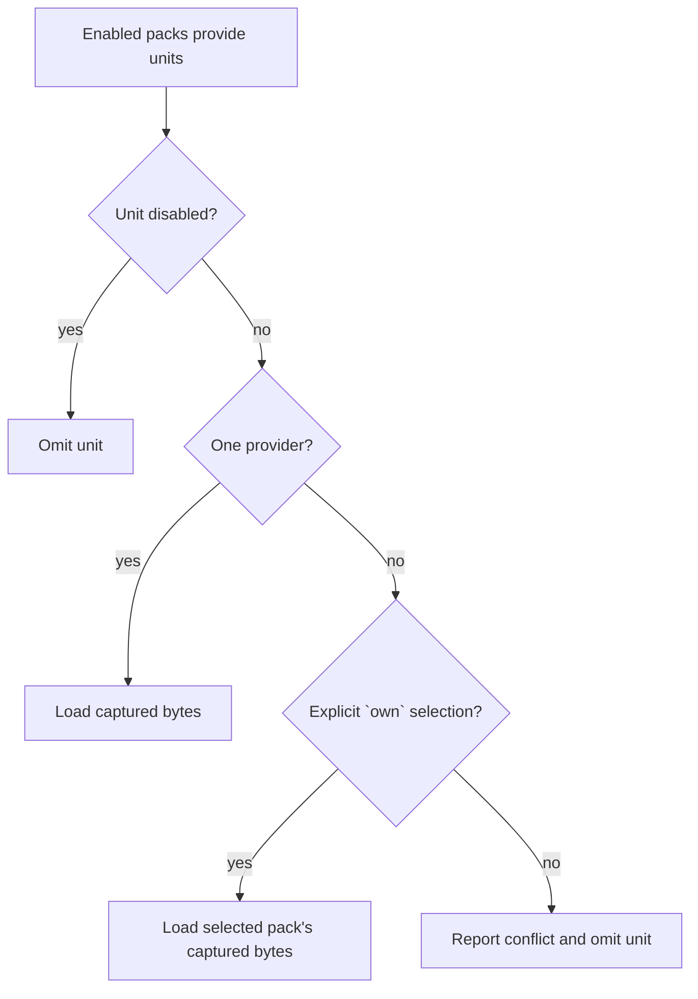

# Extend

Extension packs are versioned collections of declarative contributions. They let the runtime gain workflows, commands, policy, guidance, themes, and related content without giving a pack arbitrary host authority.

**See also:** [`lycaon/config/README.md`](../lycaon/config/README.md) · [Compatibility](compatibility.md) · [Workflows](workflows.md) · [Open Agent Rules](open-agent-rules.md) · [Project overlay](project-overlay.md)

**Machine truth:** `lycaon/config/packs/painted-wolf/` · `lycaon/internal/extpacks` (inventory, resolve, locks) · `lycaon/internal/extensionstate` (desired state, transactions) · `lycaon/internal/contribution` (compiler) · `lycaon/internal/contribframe` (runtime frame) · `lycaon/internal/hostresources` · `docs/schemas/` · `{configdir}/extensions/` · `{configdir}/extensions.lock.yaml`

The central design choice is separation: a pack says what it contributes; Resolve decides which bytes are effective; the contribution compiler decides whether those bytes are valid; the host decides what an admitted contribution may do. A pack composes with the system; it does not become part of the trusted host.

## Resolve algebra

```text
effective = provide(enabled packs) - disabled + selected collision winners
```



Resolve is order-independent: the same desired state, locked package graph, and pack bytes produce the same catalog regardless of discovery order.

| Rule | Reason |
|---|---|
| Enabled packs provide their units | Installation and activation are separate decisions. |
| `disabled` removes one unit | A surgical change without forking a pack. |
| `own` selects a collision winner | Ambiguity is explicit rather than settled by load order. |
| Unresolved collisions load nothing | Conflicting behavior fails closed. |
| Packs cannot remove another pack's units | Enabling one package cannot rewrite unrelated desired state. |
| Cross-pack references do not pin providers | Removing a provider is always possible; the dependent pack becomes invalid and explains why. |
| The platform pack must resolve | It supplies the host's minimum coherent frame. |

Resolve captures the winning bytes. Consumers read them from the immutable catalog instead of reopening pack files, so the catalog revision identifies what actually ran.

### Provider-scoped units

Most unit ids describe a shared slot, such as one workflow, and can collide. Contribution declarations, detection rules, and credential-slot definitions carry the provider identity instead:

```text
contributions/commands/acme/kit:explain-selection
host/detection-packs/acme/kit:cloud/rules/delete-resource
host/credential-slots/acme/kit:service
```

Those ids cannot collide across providers and cannot be named in `own`, so coincidentally identical filenames never become a false collision contest.

### OAR policy identities

OAR policy units use `policy/<namespace>/<id>`, or `policy/<id>` when the document omits `namespace`. Filenames and package names do not supply identity. Two contributing documents with the same identity are a load error, including when `own` or `disabled` would hide one. A mandatory rule cannot be disabled or replaced. All admitted policy documents link together after validation, so a reference can target a rule from another contributing pack.

### Dependencies and locks

Desired state records direct intent; the lock records the complete solved graph. A dependency without its own desired-state row is enabled while an enabled root requires it, and loses reachability on the next solve after the last such root is disabled.

One package id resolves to one version. Cycles, conflicting sources, unsatisfied ranges, and invalid package identities reject the candidate graph. The lock binds versions, sources, integrity, and transitive reachability so boot does not depend on a live registry or repository.

## Contribution language

Contributions are strict YAML documents with closed vocabularies. Unknown fields or values are compile errors, which keeps the author contract inspectable and lets the host enforce every action before dispatch.

| Kind | Declares | Authority boundary |
|---|---|---|
| Command | title, placement metadata, optional input, condition, and one typed action | Can invoke only an admitted action kind. |
| Menu | placement of a command | Adds reachability, not behavior. |
| Keybinding | platform bindings for a command | Uses the same command and condition as every other entry point. |
| Editor action | target shape, preset, and prompt reference | Preset fixes the tool profile and maximum write scope. |
| Configuration | typed property, default, and allowed scopes | Values remain data; they do not create authority. |
| MCP requirement | provider identity and required tool names | Gates dependent contributions; never installs or enables a provider. |
| Search source | one explicit prefix, read-only MCP tool, result projection, and activation command | Performs no work until a person selects the source or types its prefix. |
| Operation | typed input/output and one presentation-free action | Referenced only through the compiled graph; cross-pack references require a manifest dependency. |
| Theme | colors and glyph treatment over closed host tokens | Can restyle the frame but cannot add behavior. |

The compiler in `internal/contribution` defines declaration fields and enums; the OpenAPI contribution-frame schema defines the runtime wire projection. Den caches the device contribution frame in a versioned, disposable envelope and validates theme paint before publishing cached or received frames; an invalid cache is discarded and fetched again and cannot block backend discovery or project loading.

Direct contribution and unit references stay within the declaring pack. Cross-pack composition uses a typed operation and a direct manifest dependency.

### Commands and reachability

A command is the reusable behavior; menus, keybindings, and Crossbar are projections of it.

- Commands appear in Crossbar by default; `palette: false` is the explicit opt-out.
- `category`, `provider`, and `keywords` affect matching and ranking only. Authored categories render after the preferred stock groups and before **Other**, so grouping cannot drop a command.
- `when` controls relevance: a false predicate removes the command from every invocation surface.
- `enablement` controls executability: a false predicate leaves Crossbar and menu rows visible with a host-derived reason, a keybinding does not consume its chord, and the host rechecks immediately before execution.
- `input` is an ordered list of boolean, string, number, enum, string-list, or attached-project-path fields. Every activation surface opens the same host-rendered form, and the host rejects unknown, missing, ill-typed, oversized, or out-of-bound arguments before authority evaluation.
- `interaction` replaces `input` with a bounded ordered sequence of typed questions. Later steps may depend only on earlier answers. Static choices are declaration data; dynamic choices name a read-only admitted MCP tool and load only after explicit activation.
- `icon` selects a closed theme slot; omission derives a semantic default from the action kind. Ids and titles never select behavior or presentation.
- `result` selects a closed sink. MCP tools default to a plain-text/JSON output sheet and require explicit `discard` for intentional silence.
- Stock commands may set `host_invoked: true` when a built-in panel invokes them through the shared input flow.
- A command that is neither in Crossbar, placed in a menu, bound to a key, nor host-invoked is rejected as unreachable.

Actions form a closed union: workflow start, editor action, MCP tool, composer prefill, navigation, secure external link, a reference to a declared [typed operation](#typed-operations), and stock-only native dispatch. A pack cannot invent an action kind or native handler id.

An MCP requirement's `provider_id` names the exact provider saved in MCP settings, including spaces, punctuation, and case; it is not the sanitized prefix in an agent-facing tool name.

### Explicit search sources

`contributions/search-sources/` adds a provider lane to Crossbar without adding network work to Everything or ordinary action matching. A source has one unique lowercase prefix, an MCP requirement and read-only tool, query bounds, a closed result projection, and an activation command in the declaring pack.

Selecting **Sources → <label>** or typing `<prefix>:` is the only activation. The host debounces, cancels, times out, caps, and strictly decodes the provider call. Rows stay labeled with pack and source provenance. Returned ids and copy are untrusted; undeclared fields, HTML behavior, URLs, command ids, and host-semantic paths are not accepted. Selecting a row invokes its compiled command through normal argument validation, authority, idempotency, and result routing.

### Typed operations

`contributions/operations/` declares a presentation-free typed capability with exact input and output schemas, a final closed action, an authority boundary, and result treatment. Commands reference it with `action.kind: operation`; operations compose acyclically with exact schema equality.

A reference into another pack is valid only when the consumer manifest directly depends on the provider and both packages contribute to the resolved catalog. Operations are not Crossbar entries or ambient RPC endpoints, cannot be enumerated for execution, and participate in the caller's frame subgraph identity. Provider output is validated as a strict bounded JSON object before it reaches a result surface.

### Editor actions

Editor-action presets are host-defined capability bundles. The pack chooses a preset; the preset fixes whether the action is read-only, file-pinned, or directory-pinned. Writing actions also require the tracked document revision, so stale input is a failed precondition rather than an implicit overwrite. Prompt templates render from catalog-captured bytes over a closed variable set; a pack reload cannot change an action after the host has admitted it.

### Conditions

`when` and `enablement` use the same small typed predicate tree over host facts with different polarity: relevance versus executable state. Conditions cannot manufacture facts, grant permission, or inspect transcript prose. The compiler validates both the fact vocabulary and the value type, and the host rechecks host-plane predicates before side effects.

A menu placement may also carry `state`, a predicate the item *reflects* rather than one that gates it. With `state_label` the title swaps between two spellings as the predicate turns over ("Show sidebar" against "Hide sidebar"); without one the item carries a checkmark. State is presentation only: the command still decides what invoking it does, so a stale predicate can mislabel an item but never run something else.

### Themes

Themes assign literal colors, a bevel strength, and optional glyph geometry to a closed, host-defined vocabulary. A small required base expresses the decisions only the author can make; the host derives the remaining ramps and fallbacks. The compiler enforces contrast pairs, opaque foundational surfaces, valid drawing geometry, and safe SVG attributes. Den receives validated nodes rather than markup. A theme can replace the mark inside a control, but not the control's size, behavior, identity, or security semantics. The generated [theme token reference](theme-tokens.md) is the exact vocabulary. A project may suggest a theme pack; device scope chooses the active theme.

A theme can declare a generative palette for multi-window editing. The main window uses `main`; additional windows sample `anchors` in OKLCH within the declared hue excursion and chroma range. The window color paints the active file tab, its local caret and selection, and its cursors, selections, and labels in other windows; scrollbar ticks use the same colors. The Window selections category is on by default and can be turned off in Editor settings.

```yaml
window_colors:
  main: "#9a6fd0"
  anchors: ["#6fd0a0", "#81a1c1", "#e8b04b", "#c792ea"]
  hue_spread: 24
  chroma_min: 0.04
  chroma_max: 0.16
```

`main` defaults to `accent-signal`; anchors default to `accent`, `status-positive`, and `cost-workers`. Supply 1–12 opaque hex anchors. `hue_spread` is 0–180 degrees around each anchor (default 24); `chroma_min` and `chroma_max` are 0–0.4, ordered low to high (defaults 0.04 and 0.16). Zero chroma creates a monochrome family. Early window colors are chosen for perceptual separation; later slots continue sampling deterministically. Stable window slots preserve assignments when windows close or reopen a file, and switching themes repaints the same identities. The client maps colors into sRGB and corrects caret and label contrast, including Increase Contrast. No palette can make arbitrarily many colors distinct, so window labels never rely on color alone.

Agent chats get their own recipe, so what an agent read or is about to change never looks like another person's window: every chat shares one muted hue, and each is a lightness step from `main`. The [token reference](theme-tokens.md#agent-colors) lists the defaults and bounds.

```yaml
agent_colors:
  main: "#6e7689"
  lightness_step: 0.1
  chroma: 0.025
```

## Runtime frame and dispatch

Resolve and compilation produce one immutable contribution frame. Every entry point (Crossbar, menu, keybinding, panel, editor affordance) looks up the same command in that frame and sends the same typed invocation to the host, which:

1. verifies the frame revision and command identity;
2. checks scope, `when`, `enablement`, input, and target proof;
3. derives the action's authority from host policy;
4. dispatches through the ordinary workflow, editor, MCP, navigation, or native operation;
5. returns a structured result or rejection.

State-changing invocations carry an operation id. A retry of the same request replays its first durable outcome; reusing the id for different input is rejected. Front ends do not interpret pack actions themselves, because multiple client-side interpreters would drift on validation and security.

## Host resources

Some pack content configures an existing host subsystem rather than declaring a composable unit: provider catalogs, session defaults, posture rules, anchors, and similar platform resources. These are controlled at pack scope, because selectively disabling an arbitrary file would break the subsystem's own invariants. Pack scope means the whole pack is the enable/disable grain, not that any pack may supply the file: each subsystem reads its shell from one fixed path in the stock packs, so an installed pack cannot add or replace one. Contributed host data is the exception: detection rules admit pack, user, and project layers, and credential-slot units admit additive definitions from device packs.

Everything else is an ordinary resolved unit because selective composition is meaningful: workflows, policy, prompts, approvals, playbooks, tools, bindings, notices, contributions, skills, and detection rules. A unit participates in Resolve; a host resource configures the subsystem that loads its pack.

## Project scope and authority

Device packs establish the available catalog. An enabled project overlay may narrow or select from project-eligible units, but cannot contribute device authority such as tools, host bindings, user notices, or MCP bindings. Project skills are guidance and apply automatically when enabled.

Project content applies only when the surface is enabled and the project is enabled. Refused units remain visible as diagnostics: Den shows what did not apply and why without reproducing Resolve. Install suggestions remain inert until accepted against their exact revision. Full rules: [Project overlay](project-overlay.md#project-trust).

## Policy rule roles

An Open Agent Rules unit observes typed host facts and maps a match to a bounded effect. It may inform, nudge, ask, or block only through the effect channel the host defines; it cannot execute tools or turn a model-authored statement into host fact. Approval rules are narrower still: they can refine an existing approval decision but cannot bypass confinement or mint a capability. See [Open Agent Rules](open-agent-rules.md) and [Authorization](authorization.md).

## Detection packs (`host/detection-packs/`)

Detection packs are Sigma rule data evaluated over synthetic command and mediated-egress events. A match may add an approval ask; a miss changes nothing. They are an overlay on the permission floor, not an alternate permission system. Provider-scoped ids prevent cross-pack rule collisions. Device state enables packs; a project may only enable an already admitted pack. Fixtures travel with a pack so authors can prove which events should and should not match. See [Detection packs](detection-packs.md#rehearsal).

## Credential recognition (`host/credential-slots/`)

Credential-slot units add names and mappings to host-owned parsers. They are provider-scoped and device-only, compose additively with the bundled baseline, and compile from captured catalog bytes. They cannot change exclusions, inspection limits, protected-reference handling, or policy effects; OAR owns the resulting advisories. Contract and lifecycle: [Secrets](secrets.md#credential-slot-extensions).

## MCP bindings

An MCP binding translates a specific external tool's typed call and result into generic facts, so policy can reason about call success, error code, or observed resource without embedding provider-specific payload shapes in the rule engine. Bindings are device-only and schema-checked. They add observations, not permission. MCP readiness remains an independent host fact, and a missing requirement disables only the contributions that name it. See [MCP facts](open-agent-rules.md#mcp-facts-generic).

## Desired state

Desired state records user choices: roots, enabled flags, disabled unit ids, explicit `own` selections, profiles, and typed configuration. It does not copy effective catalog bodies. Device state lives under the configuration directory; project state lives under `.paintedwolf/` so it can be reviewed with the project. Each scope has its own revision and lock.

### Mutation transactions

Every mutation is optimistic and atomic:

1. require the caller's expected revision;
2. build candidate desired state and dependency lock;
3. resolve and compile the complete affected catalog;
4. reject named-pack failures and isolate unrelated invalid packs according to the committed-state rule;
5. publish desired state, lock, and effective revision together;
6. return the new complete projection.

A client applies the returned projection instead of reading state back, which closes the race between a successful write and a second read.

### Install, update, and reload

| Operation | Meaning |
|---|---|
| Install release | Select a compatible version, solve dependencies, verify integrity, and lock exact bytes. |
| Install exact ref | Pin a non-release revision and lock its graph. |
| Install folder | Link an author directory as a development root. |
| Reload | Revalidate linked bytes and refresh integrity without changing desired enables. |
| Update | Re-resolve the named direct root while holding unrelated roots at their locked revisions. |
| Lock | Deliberately rebuild the whole scope graph from desired ranges. |
| Remove | Remove intent and unreachable cache entries; never delete a linked author folder. |

Update previews and commits report the complete graph diff, including transitive changes; confirmation publishes the candidate atomically, and a failed effective-catalog validation restores both desired state and lock. Updating one pack must not move every other installed root: if a held root makes the requested graph impossible, the operation fails and names that constraint.

## Author loop

Authors use the released host and desktop app: edit → validate → reload → inspect effective frame → exercise behavior.

`pw extensions validate` uses the runtime compiler. `pw extensions inspect-command <command-id> [--project DIR|--device] [--json]` prints the compiled command's palette membership, predicates, invocation form, menus, keybindings, executor, scope, result treatment, operation chain, consumers, and catalog identity without executing it or calling a provider. Frame and command-subgraph identities belong to a captured runtime MCP generation, so offline inspection does not fabricate them. Rule fixtures and prompt rendering use the runtime loader and template engine. Settings exposes the same operations and diagnostics as the host API.

Exact CLI flags, API paths, and generated types are not repeated here: use `pw extensions --help`, the OpenAPI bundle, and [`lycaon/config/README.md`](../lycaon/config/README.md).

## Scanners vs packs

A scanner is a process with installation, lifecycle, parsing, and update concerns; it is a host resource configured under Security scanners. Packs may require a known scanner id but cannot install or start one. A detection rule is inert declarative data whose maximum effect is one additional ask, so packs can carry it directly. Process authority versus additive data is why the two extension shapes are separate. Details: [Scan supply chain](scan-supply-chain.md#security-scanners).

## Skills

A skill is a `SKILL.md` procedure with optional referenced resources. Pack skills participate in Resolve; admitted project skills come from `.paintedwolf/skills/` or `.agents/skills/`. Stock skills cover development and verification workflows, including procedures for specific tools and services. A skill that depends on a host tool names it in `host_resources` metadata, and the host advertises the skill only while one of the named resources resolves on this device and policy allows it.

The agent requests a skill through `skills_read` with a free-text `need`. The host resolves one available skill and returns its instructions in that same call. A later call can open a referenced file by supplying the resolved skill name as `need` and the relative file path as `resource`. Reading a skill adds instructions to model context; it does not add tools, permissions, or automatic execution. Scripts and resources are opened through the same catalog and project-root boundaries as their parent skill. The loader validates identity, metadata size, template syntax for pack skills, resource paths, catalog caps, and the agent's declared skill set. `allowed-tools` is descriptive metadata only; the ordinary tool, confinement, and approval systems remain authoritative. The host keeps the catalog out of the prompt and ranks it only when `skills_read` is called. If local ranking is unavailable, only a need that spells out one exact skill identifier resolves.

## Prompt units

Loadable instruction text ships as units under `shared/units/<stem>.md`: a YAML front matter with a `description` of at most 60 words (the only thing the decision model reads about the unit), a `slot` (`orientation`, `conduct`, `evidence`, `execution`, or `procedures`), an optional `order`, `attaches` (tools the unit follows), `needed_with` (tools whose call in a turn shows the unit was needed, for a unit that gates nothing; it labels the unit for the decision model and never changes rendering), `modes` (execution mode families), and `hosts` (`coordinator`, `worker`), then the template body. Host templates place `{{ units.<slot> }}` once per slot and loaded units render there in catalog order. A unit attached to tools renders only while one of them is offered and follows their load decision when every one is loadable; a unit attached to a floor tool, or to nothing, carries its own decision and is omitted only with confidence, and only once its `attaches` or `needed_with` tools have given it a behavioural label. Floor prose stays an ordinary include; only the platform pack contributes always-on text, so a pack cannot make itself always-on. A malformed stock unit fails the catalog; a malformed pack unit is reported and skipped. Units participate in Resolve like any other `shared/` unit, and the catalog revision they form is recorded on every decision receipt.

## Invariants

- Resolution is deterministic and independent of discovery order.
- Effective behavior comes from captured catalog bytes, never a later filesystem reread.
- Conflicts, invalid references, and unsupported vocabulary fail visibly.
- Project content cannot widen device authority.
- Contributions select host-defined capabilities; they do not define new authority.
- Every mutation publishes desired state, lock, and effective projection as one transaction.
- A pack may be removed even when another pack references it; the dependent pack bears the diagnostic.
- Exact inventories belong to schemas, catalogs, OpenAPI, and generated references.
