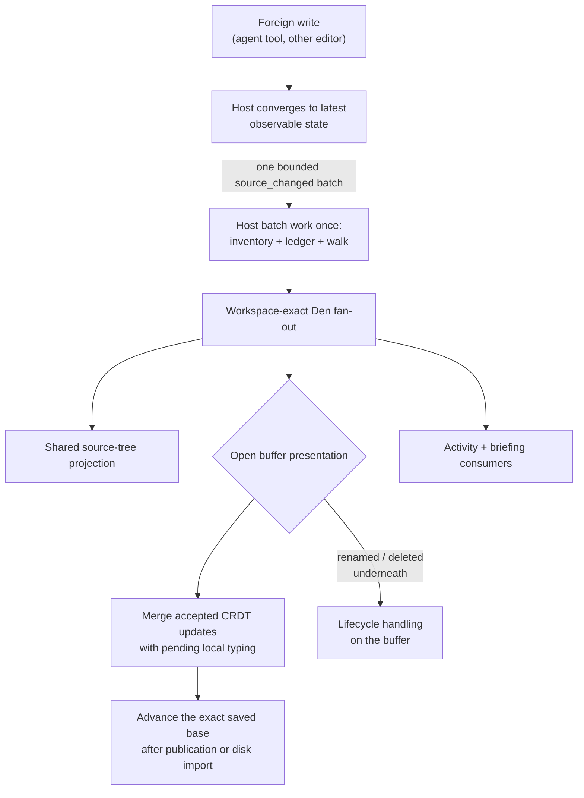

# Files stage — live layer

What the editor does while an agent is working in the same tree: presence, live playback of writes, the Review lens over changed files, and the presentation model that tracks which agent revisions the person has seen. The [Files stage](files-stage.md) provides the tree, buffers, and editing surface; this page describes everything that moves independently.

**Machine truth:** [`files/`](../lycaon-den/src/files): `components/` (`agent-presence.ts`, `agent-presence-store.ts`, `files-agent-presence.ts`, `presentation-tracking.ts`), `tree/` (`source-tree-store.ts`, `scope-resolution.ts`), `documents/` (`document-agent-presence.ts`, `buffer-live.ts`), `review/` (`line-diff.ts`, `review-live.ts`, `review-model.ts`, `ReviewWalkContext.tsx`, `review-walk-details.ts`), `walk/` (`hunk-playback.ts`, `walk-model.ts`, `walk-store.ts`, `WalkButton.tsx`, `WalkTransport.tsx`), `history/` (`file-revert.ts`, `FileVersionPicker.tsx`, `file-version.ts`), `source/` (`source-content-availability.ts`, `source-comparison-cache.ts`), `commands/file-mutations.ts` · host [`internal/agentpresence/`](../lycaon/internal/agentpresence) · `/v1/projects/{id}/source/**`: reads (`browse`, `views`, `walk`, `walk-summary`, `versions`, `comparison`, `attribution`), lifecycle and restore doors (`history` with `undo` / `redo`, `rename`, `copy`, `versions/{version_id}/restore`, `commits/{commit}/restore`), presentation state (`pins`, `presentations`, `seen`, `file-briefings`, `storage`); `/v1/projects/{id}/agent-presence`; exact shapes in [`docs/openapi/paths/projects`](openapi/paths/projects) · SSE `source_changed`, `source_operation`, `file_briefing`, `agent_presence` ([host-contract.md](host-contract.md#topics))

**See also:** [Files stage](files-stage.md) · [Source navigation](source-navigation.md) · [Den](den.md) · [Grounding](grounding.md)

---

## File and folder lifecycle

Moving is an explicit, host-confirmed interaction. A drag keeps the source row visible, highlights the destination folder, and labels it **Move here**; invalid targets explain why they cannot accept the drop. Hovering a collapsed folder opens it after a short hold, Escape cancels, and releasing starts a visible pending state until the host confirms the rename. Every non-root row also offers **Move to…**, a keyboard-accessible folder picker that starts at the current parent, filters visible folders, states the exact destination, and disables moves to the current parent or into the moved folder itself. Drag and picker call the same same-root rename; cross-root transfer is not implied by either.

The host owns a bounded project history of 100 lifecycle operations (`projectsource/source_history.go`): create, rename, move, duplicate, and move to Trash, plus the entries an agent removes or replaces. The Files header always exposes the current **Undo** and **Redo** heads, and a short-lived completion notice offers the likely next action. `Mod+Z` / `Mod+Shift+Z` invoke lifecycle undo and redo when focus is in the Files surface but not inside an editor or text field, so editor text undo stays a separate history.

Each history entry stores normalized paths and evidence appropriate to its operation. Same-filesystem moves use an exclusive native rename and stable entry identity, without reading every descendant. Undo moves the same entry back, including intervening descendant edits, and refuses a replaced entry or an occupied destination. Transfers and retained recovery verify complete content fingerprints. New human Trash operations retain the native recovery location and entry identity, without reading or backing up the tree. Undo and redo require the displayed history head and are idempotent by operation id; a new operation after undo discards the redo branch.

Cross-filesystem moves within an attached root clone files when the filesystem supports it and otherwise stream them into a private destination stage, verified and synced before publication. A journaled holding path retains the original until publication succeeds; the host reports an incomplete move and its retained source when reconciliation needs an explicit retry. A partial destination never replaces an existing entry. Staging trees are excluded from observation and indexing. So are the sibling entries an atomic save stages and a guarded removal quarantines: the write door records each one by name and parent-directory identity before it exists, and listings and watcher events withhold exactly those entries, never a user file that merely looks similar.

Lifecycle capture hashes bytes as it retains or transfers them and builds a paged manifest from those same content identities. Older retained Trash operations validate the live tree against their capture before disposal. Copy shares its transfer with recovery capture, validates source and destination before publication, and keeps native file cloning where available. Cross-filesystem moves validate the staged destination and held original before publication and cleanup. Restoring streams verified recovery objects into a private tree and validates that tree before publication. Successful publication carries that evidence into the history transaction; recovery after interruption revalidates the filesystem, including the destination of a partially cleaned-up move. Hashing and restoration report byte progress within large files, with bounded update frequency.

Undoing a new create or duplicate moves that exact item, including subsequent edits, to native Trash; Redo restores the recorded entry rather than a stale copy. These operations retain no redundant full-tree backup. Undoing a new human Trash operation moves the recorded native entry back with an exclusive rename; the destination must be free and the Trash identity must still match. Emptying Trash or removing that entry makes Undo unavailable, reported as `source_trash_recovery_unavailable`. Redo records a fresh receipt. Older history restores its retained recovery data without touching the OS Trash entry. Recovery covers complete file bytes, binary files, empty folders, permission bits, and symbolic-link targets, with no entry-count or file-size cutoff. Content-addressed recovery objects participate in backup and garbage collection and remain retained while a pending operation or a history entry references them; emptying OS Trash does not remove retained recovery objects. Native receipts contain no recovery bytes and do not extend the lifetime of items in Trash. Restoration refuses an occupied path. Native trash uses Foundation on macOS, the Windows shell file operation API, and the freedesktop.org trash layout on Linux (`internal/desktoptrash`); no adapter offers permanent removal as a fallback.

**An agent's removal is a Files history entry too, without the Trash.** A person expects an `rm` to leave nothing in the system Trash, and an agent tool is the agent's `rm`, so its removal discards the entry after keeping a retained recovery copy. The entry is attributed to the agent's tool call and undone like any other history entry. The same holds when an agent replaces an entry: a move onto an existing file, or an overwrite of a file too large for source history, sets the old entry aside this way first, because a replacement that destroys the only copy is a deletion by another name. Commands the agent runs are not covered: their changes are observed after the fact, and a deletion inside a command stays as final as it is in a terminal.

The host journals accepted lifecycle requests independently of the HTTP connection; the mutation `operation_id` also identifies the durable request. A short request returns its original response; work still running after one second returns `202` with progress, and Den follows `/source/operations/{operation_id}`, discovers active and recent work through `/source/operations`, and offers cancel and retry. Disconnecting or closing a dialog does not cancel the operation. Cancellation is available before filesystem publication starts; afterward the host finishes reconciliation and exposes Undo. Startup reconciles applied changes and leaves interrupted preparation for explicit retry rather than replaying a deletion that never started. Progress appears beside the Files surface; a running dialog can be dismissed with **Continue working**. History retries recheck unsaved buffers and the current head; dirty buffers are resolved before a history action removes or retargets their path. Open documents follow committed mutation identities through durable rename intents, never inferred from which files happen to exist.

### What a version belongs to

A project has one **trunk** of source history, a durable **branch** per registered worktree, and one **branch** per write worker. Every retained version, effect, and line attribution names the branch it landed on by identity, never by a path.

The branch is not the physical workspace id, which hashes the resolved root paths and changes whenever the root set does. The ledger keys on `(project, branch, root, path)`; the physical workspace addresses trees for listings and events. The two never stand in for each other, and `test/contract/persistence/durable_source_identity_contract_test.go` holds that line.

Worktree identity belongs to the checkout, not a chat: `source_worktrees` retains it and its root substitution, and `session_worktrees` associates chats with it. Chats bound to the same checkout share documents; roots outside the bound repository keep their original identity. Watcher registrations, inventory jobs, and observed Git positions are partitioned by checkout. Files preserves local replicas before reopening tabs on substituted roots. Unbinding a chat leaves source history intact.

A worker branch inherits the trunk's file identity for a path it has not touched, so overlay edits extend that file's history. A promotion lands the overlay's bytes on the trunk, with `worker_id` still naming the worker who authored them.

---

## Presence

Agent presence shows what each chat looked at this turn and what it is about to change. The host owns it and records only structured facts: a tool's catalog identity when a call starts, the text a read returned to the model, the lines a write resolved before it lands, approval checkpoints, and worker lifecycle and reservations. A chat is its root session; the workers it dispatched fold into it with the same color and label.

The projection is ephemeral: it lives in host memory, is bounded per chat, and is empty after restart, except that drafts of completed worker jobs whose promotion is still pending are restored, because the pending promotion outlives the process. Each change republishes that chat's complete presence on `agent_presence`; `GET /v1/projects/{id}/agent-presence` returns the project snapshot, which Den reloads whenever its event stream opens and then applies newer events to.

| Category | Facts | Editor paint |
|----------|-------|--------------|
| Looked at | Line ranges, whole files, and search matches returned this turn | Read ranges tint their gutter cells; whole-file reads tint the column. The chat's current read shows a caret. Search matches keep their underlines and label |
| About to change | Edits resolved and applying or waiting for approval; worker drafts that are ready or landing | A light dashed ghost over the lines it replaces, a dashed rule where lines go in, and a label naming why it has not landed |
| Changed | — | None; the comparison already shows landed changes, so the ghost clears as the edit lands |

Reads, activities, and pending changes clear when the chat's turn ends. Worker drafts stay until the job lands, is rejected, or ends. When someone other than the reading chat changes text a read returned, the read is marked stale. Ranges carry CRDT anchors in the document epoch they were recorded against, so marks follow later edits; in any other epoch Den falls back to line numbers.

The text paints one current operation per chat: an approval-held change first, then another pending change or worker draft, otherwise the newest read. Earlier reads remain in the gutter and in the [line facts card](files-stage.md#the-knowing-gutter). Pending changes never tint the gutter. Marks fade and a chat's caret glides between reads, so bursty tool calls read as steady movement; reduced motion removes the motion. Labels never widen the editor. Ranges tick the scrollbar ruler in the chat's color.

The tree and open-files list keep one trailing slot: a deleted file's mark, then a live agent state, then the review mark. Agent states rank **waiting** (for approval), **editing**, **landing**, **ready to land**, **reading**, **sandbox** (a worker is drafting), and **reserved**. Any involvement tints the file name in the chat's color, and the tooltip names every fact the slot suppressed. These chips and tints keep the [minimum hold](den.md#presentation-and-refresh) so fast work reads as state rather than a flash.

**Review lists what is about to change, and hands it to the comparison.** Review's live rows are the files an agent is about to change, never what it read. A chat comparison lists only that chat's work, and *This turn* only the turn it answered. When the change lands, its row stays as landing until the comparison has answered from a read that began after the landing; the landing is matched to the row by tool call or worker job, never by path alone. Work that never lands keeps the minimum hold and goes. Rows are keyed by root and path.

File tabs retain agent facts in their accessible names but carry no status flags, tint, or tooltips ([tab behavior](files-stage.md#buffer-strip)). **Settings → Editor → Agent activity** turns presence off or keeps any subset of reads, changes, and file names; scrollbar ticks have their own **Agent activity** category. Colors come from the theme's [`agent_colors`](theme-tokens.md#agent-colors) recipe: one muted hue with each chat a lightness step away, so agent marks never compete with window colors.

---

## Live buffers

File navigation starts the source read immediately. Once bytes arrive, the editor can paint while the tab animates and its collaborative replica joins; the join upgrades the mounted editor in place. Editing waits for replica admission and local recovery. Neighbouring tabs prefetch after the requested editor has been presented. An editor viewport is reusable across documents: detached live editors have a count limit and a working-set budget, eviction parks the buffer's editor state, and a bounded pool retains at most two empty viewport shells with no document text or undo history.

Hot-exit preservation skips transactions with nothing changed. A released replica retains proof of its preserved draft and line-ending format while its tab remains open, so a later window flush can verify that draft without reopening the replica. The outbox inventory reports synchronization from stored records, so the recovery relay can skip fully synchronized documents without loading their checkpoint bytes.

Durable file operations (`/source/operations`) report themselves on a separate `source_operation` stream: every persisted transition or progress save publishes the request as the list endpoint would return it, so Den never polls for progress.

**One `source_changed` stream.** Every host mutation door and the filesystem watcher feed one workspace-addressed stream. Transactional writes publish only after commit; if publication fails, the watcher still observes the change. Batches are bounded, and a window the watcher could not fully name publishes one bare `resync` with no paths. Inventory, source-ledger reconciliation, and walk refresh happen once per batch before open buffers, activity, and briefings fan out by path: the ledger records the named paths and the open documents fold in their bytes before the batch reaches Den, so a buffer that reacts to the event opens against settled file identities (`source_watch.go`). A window the watcher could not name schedules the full inventory pass and reconciles every open document before publishing. Watcher file events exclude `.git` path segments; separate head and index signals trigger reconciliation. Host-write echo suppression compares current bytes and file mode with the published write; elapsed time alone cannot suppress an outside edit.

**Observation never waits on a walk.** The watcher binds to each root the moment a project opens, before the catalog or inventory walks the tree, so an outside edit made while those walks run still reaches history, Walk, and open tabs. Each root reports its coverage on the workspace response as `watch.state` (`live`, `partial`, `faulted`, or `unwatched`), and a tab whose root is not `live` says so in its status line. A coverage change announces itself as a bare `resync`. On macOS each attached root is observed through the recursive FSEvents service, so coverage is complete the moment the stream starts whatever the directory count; the no-cgo fallback keeps the bounded kqueue registration path, and `repochange.DirWatched` answers by position under the root. Native event loss becomes a structured pathless `resync`.

**History moves by path, not by pass.** A batch that names its paths records drift for those paths at once: git state is read first, then each tracked head is compared with the file's current bytes. Every observation stamps its effects with one `batch_id`. The full inventory pass remains the answer for a window the watcher could not name, a git ref movement, and admitting untracked files; its phase travels on the workspace response as `inventory`, and every completion announces itself with a bare `source_changed`. Reading that metadata does not restart a pass. With incomplete watcher coverage, roots revalidate on a fifteen-minute cadence (`repochange.CoverageRevalidationInterval`); there is no device-wide polling sweep.

**Open documents are the host's to keep current.** Every external batch re-reads the editor documents it names, or every document of the project when it could not name its paths. The filesystem has its own CRDT identity and a checkpoint of the exact saved content; an outside save becomes edits against that checkpoint and merges into the shared document, including typing that arrives later. Each changed hunk becomes one replacement with its common prefix and suffix retained, so scattered matches cannot lose characters to concurrent deletions. Observation advances the saved base without replacing the collaboration history or asking the person to manage another draft. Background observation loads resident, participating, or unsaved documents; cold clean documents reconcile when opened again.

**For a buffer with a host document, that transition is the content channel.** Watcher observation and the explicit observe API share one host reconciliation transition. Den drains both draft queues before acknowledging clean adoption; it does not independently load editable bytes from the source endpoint. The document's own `editor_document` event or reconciliation response carries editable bytes, whether an outside edit, another window, or an agent write produced them ([§ The open document is the file](#the-open-document-is-the-file)). Buffers without a document, such as worker-overlay reads, re-read the file. A pathless resync or event continuity gap uses the common reconciliation path; every stream open revalidates retained projections, and buffer invalidations received while Files is unmounted stay pending until it mounts.

The batch is delivered at project scope and carries `workspace_kind` (`project` or `worker`) plus the physical `workspace_id`. Workspace kind selects the projection class; workspace id selects the exact tree or buffer. A `session_id` or `worker_id` on an individual change attributes its producer and never determines its location, so a worker overlay cannot invalidate an identically named path in the project tree. Delivery is at-least-once and batches coalesce, so Den treats the event as invalidation, not as document state or a count of writes.

| Buffer state | Behavior on a foreign write |
|--------------|-----------------------------|
| Clean | **Synchronize**: accepted text reaches the bound replica |
| Dirty, agent write | **Synchronize**: the CRDT integrates compatible agent and person operations |
| Dirty, outside write | **Merge**: filesystem changes against the saved checkpoint integrate with unsaved typing |
| Deleted underneath | The document stays and reports the path **absent**: its draft and saved base are retained, a save recreates the file, and the agent still reads the draft. A file that reappears at the path, from a checkout, a tool, or an atomic-save editor, merges in as an outside change and rebinds the document to the file identity the ledger now records there. A document with no draft left is presented as the deleted file |
| Renamed underneath | The document follows the committed rename intent; the document that held the destination path, if any, ends with the file the rename replaced |

**Presentation follows the replica.** Accepted metadata never replaces the live editor text, which may already contain later local typing. A delayed open or an event for another physical workspace cannot attach to the same logical path in the current view.

**A document follows its path.** There is one document per branch path, whatever file identity the ledger currently records there (`editor_documents` is unique on `(project, branch, root, path)`, and `file_id` rebinds). Deletion and recreation are lifecycle states of that one document, never a second document for the same path, so the person's window, the agent's reads, and the saves all address the same draft.

### Conflict

Ordinary outside text edits merge automatically. A file that cannot be imported or a failed publication can still use the comparison view. Apply names the reviewed document revision and exact disk hash; the host validates both and commits the resolved text together with its save intent. If either changes during review, the view requires another comparison before publication.

---

## Review lens

A segmented **Files | Review** control in the tree pane. Review lists the changed-file evidence for the selected scope; Files decorates in-scope rows in the tree. Both share one scope.

Scope is chosen from the eye picker beside the segment, under **Compare with**: *New since you looked* (default), *This turn*, *Everything in this chat*, *Since last commit*, and **Pins**, holding *Pin current state* and every saved pin. **Mark my edits** (off by default) says whose changes get marks, and **Deleted lines** (*Folded* by default, or *In place*) says how removed text shows in an open editor. **Turn off marking** sits alone at the end. The chat choices name no chat: *This turn* and *Everything in this chat* read the chat selected in the sidebar, so the list follows a new turn or another chat without being chosen again. There is one turn entry, because freezing a moment is what a saved pin does and a finished turn's card opens its own diffs page. The selected scope, marking state, and both options are remembered per project. Picking a comparison while Walk is active exits Walk and returns the active file to **Current**; otherwise the picker never opens a file or moves the editor on its own.

**New since you looked, then Seen.** The default scope lists what landed since you last looked at each file, whoever made it. Looking is what moves a file: when the last pane showing it lets go, the file leaves the new list and joins **Seen** beneath it, newest look first. Opened again, a seen file shows clean current text; **View reviewed changes** opens the immutable comparison covered by its latest look. An open view retains its starting boundary until the reader leaves it, even if another window acknowledges the same file. **Mark unseen** on a Seen row withdraws that look. Seen lists 25 files and **Show older** asks for more, up to 100 (`review-pane.ts`). The first time a file moves there, a tip on the Seen heading says what happened.

**Chat scopes select authorship.** Comparisons keep their real saved endpoints and carry attributed character ranges from the ledger; *This turn* and *Everything in this chat* select contributions from that chat or turn, and other chats' changes remain visible as labeled context. **Mark my edits** controls human ranges, including typing inside another contributor's insertion, without fabricating a different saved base. The provenance gutter projects saved character identities into line spans, retaining every contributing chat on a shared line; its popover opens the chosen contribution in chat. Git comparisons cannot supply chat authorship.

**Off** is the absence of a comparison, not a sixth baseline: it never reaches the wire, and the scope it was turned off over is kept so turning the eye back on lands where it left. While off there are no tree marks and no comparison on a buffer, Review asks the host for nothing, and work in flight is still listed as presence. Any explicit pick turns the eye back on.

**Only the commit lens needs a VCS, and that VCS is git.** New since you looked, turn, whole-chat, pins, attribution, and the presentation cursor are answered from source history and work with no repository at all. The commit scope addresses a root and path against a specific HEAD; it includes staged, unstaged, and untracked paths even if the app never observed them, reports availability per root, and labels incomplete coverage rather than calling unavailable folders clean. Before the first commit its baseline is an empty tree. It compares HEAD with working contents while separately showing index and worktree status. Restore changes the working file, not the index. Commit pagination uses a root/path cursor bound to the Git membership snapshot; a membership or HEAD change rejects the next page. Git does not invent a file identity, actor, timestamp, version, or Walk step, and unseen paths do not enter the ledger merely because Review lists them.

**Source history understands git without depending on it.** Three recorded layers, each degrading to plain behavior when git is absent:

- **Derived identity.** Every stored revision body carries its git blob object ids (both hash formats), computed from the bytes at capture. That is what lets any walk file answer `head_match` (same / differs / absent / unknown) against `ls-tree HEAD`, with *unknown* whenever git, the lens, or the captured bytes cannot answer.
- **Observed transitions.** The host tracks each root's last observed git position and, when it moves, mints `source_git_transitions` rows classified from git's reflog (checkout, commit, rebase, pull, and kin) on the same source-history clock as effects. External reconcile operations reference their transition, so a branch switch is one semantic event with its file effects attached. A movement the reflog cannot explain is `unknown`, never guessed. Ref surfaces (`HEAD`, reflogs, loose branches) are watched directly, so a commit or checkout in an outside terminal becomes an event: `source_changed` carries `git_changed`, possibly with no file changes at all.
- **Stamped boundaries.** Checkpoints and pins copy the recorded git position per root at creation, as recorded facts of the last observation, never a live repository read inside a transaction. Content-addressed snapshots carry no git stamp, because identical trees share one snapshot across time.

Walk steps born of a transition name it (`git_change` on the effect), and the coordinator's source-change brief leads with the window's ref movements.

**The turn number is the host's.** The eye asks `baseline=turn:{session_id}`, and the host resolves the chat's current turn in the same read (the session store's `UserTurnOrdinal` over the stored transcript, the value the session's `current_turn` publishes). Editor changes name only the focused chat; the host stamps the turn when it accepts the text (`chat_affiliation.go`). The response's `baseline` spells the turn it read as `turn:{session_id},{n}`; later pages and every per-file comparison send that spelling back, so the list and the diffs it opens describe one turn even when the next turn starts mid-read. The session SSE event carries `current_turn` so Den knows to read again. A chat baseline reads that chat's workspace, so a worktree-bound chat's turn is never read against another branch. The same ordinal stamps every ledger row that chat produces while the turn is active: agent writes (`ToolContext.UserTurn`, including promote landings) and in-app human mutations carrying the focused chat's `session_id`. Once the session is idle, human edits keep the chat affiliation but belong to no active turn (turn `0`). A client counting transcript rows itself would ask for a turn the ledger never wrote against.

Selecting a file in Review opens its ordinary tab at **Current**: Review is the status of changed files as they exist now, not historical navigation. When the eye is on, the current editor paints the selected comparison inline; the file remains current and editable. Opening a row from Review starts the file condensed the way a Walk step does: unchanged runs far from a change fold behind a hidden-line count with three lines of context, and **Full file** unfolds them. The fold happens once per open and never re-folds while typing. Review rows open the file transiently, so a thirty-file pass reuses the single preview slot; editing the previewed file promotes it to a durable tab.

**A comparison spans the range, and the host resolves both ends.** `GET /source/comparison?file_id&baseline` addresses the logical file under a baseline and returns the range's oldest pre-image against its tracked head; both sides name immutable versions and their availability. A file the baseline holds nothing for answers `in_range: false`, an answer the tab renders rather than an error. Addressing by effect id instead would show only the third write of a file written three times in one chat.

**Recording is part of writing, but not dependent on it.** Host-mediated writes record exact before/after content and structured actor/cause metadata at the write boundary. A watcher observes live changes from other editors and reconciles tracked heads against the source snapshot. The first inventory becomes a tracking checkpoint rather than minting a fake edit for every repository path; later tracked drift is `external` with `observed` or `reconciled` capture quality, and an untracked file enters history only when a command observation window saw it change. Opening a window first reconciles the tree, so earlier drift belongs to whoever caused it; closing one keeps attributing through a short settle period because the watcher's last events are still in flight. Without complete coverage nothing can prove the tree unchanged, so the pass runs inline before the tool result returns. Reconciliation is idempotent, so a crash between disk and history may reduce attribution quality but cannot permanently hide a tracked change.

**A step is the other question, and it keeps its own address.** The steps list behind a multi-write file creates a comparison view under `POST /source/views` with an `effect` selector for the stored before and after versions.

**The scope is the comparison, everywhere.** Diff tabs that follow the eye are keyed by file, not baseline, so moving the eye re-scopes the tab in front of you; a file with no change in the new scope keeps its tab and says so. An open text buffer shows the same comparison inline and keeps it live while you type: the host answers for the saved text, and the editor (`scope-diff.ts`) keeps that start immutable and maps attributed ranges through live edits. Human typing inside an agent insertion has its own authorship. A comparison answered for text the disk has since left is dropped; the scope's next answer replaces it. Turning the eye **off** drops tree marks, the inline comparison, and every open diff tab together.

**Removed text takes no room unless you ask.** With **Deleted lines** set to *Folded*, a short delete mark sits on the gutter edge at the boundary the lines left; hovering or focusing it previews the removed text with **Show in place** and **Reject**, a click shows the removal in place, and the delete bar beside the shown rows folds them again. Removed text is text: select and copy it; a drag that starts in removed rows stays in them. *In place* shows every removal as rows above the lines that replaced them. History previews always show removals in place.

**One answer, not one answer per surface.** `scope-resolution.ts` holds the eye's resolved record and is the only thing that produces one:

| Property | What it rules out |
|----------|-------------------|
| **One writer** | `resolveScope` is the only reader of the picker's state, and every other surface asks it through `requestScopeResolve`. A surface that fetched its own would be a second answer, and a lens listing a file the tree has no dot for is what two answers look like |
| **One commit** | The record is replaced whole and notifies once, so there is no moment where the tree holds one baseline and a tab holds another |
| **Epoch order** | A flight superseded by a later pick is dropped on arrival, so the eye lands on the reader's last pick, not the host's last answer |

Moving the eye, selecting another chat, or a new turn in the selected chat re-runs the resolver. While a fetch is in flight the last settled answer stays on screen; a failure holds it and reports the staleness. **The answer names itself:** the record carries the comparison, chat, and turn it answered, and Review's header, empty copy, and the lens diffs page read those. A chat comparison with no chat selected answers that it needs one; it never claims an empty list.

Per-line attribution from `GET /source/attribution` rides on the comparison: fetched for the saved text, each mark moves with its line through unsaved typing, diff hunks carry it inline, and in the editor the change margin's own bar opens the turn that wrote the line ([files-stage.md § The knowing gutter](files-stage.md#the-knowing-gutter)).

**Restoring a comparison is a user-origin write against its real saved endpoints.** **Restore these lines** puts the before-lines of one change back, including all contributors on those lines; **Mark my edits** changes highlighting, not restoration. **Restore comparison baseline** returns the file to the start of the comparison: a modified file is rewritten, a file created in range is removed, and a tombstone is recreated from the stored pre-image, including when the parent folder was deleted too. Both are instant; a toast holds the inverse write for a few seconds. A `409` refetches. Reject waits for the file to be saved, because it writes against disk. Crossbar exposes the same operations as `files.revertFileChanges` and `files.rejectHunk`.

### Step through the run

The Walk button starts a **walk** over the selected chat's story: one position per visible source effect, with bursts collapsed into single steps. When Files has a file row selected, Walk opens at the first step touching that file while retaining the complete timeline; if that file has no effect in the chat, Walk says so and shows the timeline without fabricating a step. A completed turn's footprint **Walk** button opens that turn's chapter. During Walk, Review shows current-step context; changed-file status returns when Walk ends.

**Walk is a live chat timeline with turn chapters.** A chat card's **Walk from here** opens the chat's entire timeline at the first step of that card's turn; the card carries the opening user message's identity and never counts loaded transcript rows to infer a turn number. The Files toolbar honors the open file wherever it appears in the chat; without a file match it opens the most recent turn that has steps. The selected chat is captured when Walk opens. The rail shows turn chapters, **Show in chat** reveals the current chapter's opening message, and the step counter opens a scrollable history picker with every turn and its steps, searchable by file, operation, or prompt. Unattributed or mixed-turn activity keeps its own **Source activity** chapter; a run of outside changes with the same turn on both sides is shown inside that turn's chapter as where it was observed, unattributed and excluded from the turn's footprint count.

**The walk is the chat's story, and outside changes are part of it.** `GET /source/walk?baseline=session:{id}&include_outside_changes=true` returns the chat's own operations plus the external drift no chat owns within the chat's span. Another chat's operations stay out. Review's chat scope and commit staging keep the narrower authorship reading, so an edit made in another editor never counts as *new from AI* and never stages on the chat's behalf. **The footprint counts are their own question:** `GET /source/walk-summary` takes up to 100 opening user-message ids for one session and returns each turn's complete step and distinct-item counts, because the counts a transcript renders and the steps a walk pages are different reads.

Walk and the eye are separate queries: the eye retains its comparison while Walk is active, and choosing an eye comparison exits Walk. A Git dirty path is current state, not a chronological event, so the commit comparison never becomes Walk history.

Walk acquisition is shared by connection, project, and chat; project changes, event-stream replacement, and reconnect invalidate it, and a load superseded by invalidation cannot repopulate the cache. Retention is bounded to 16 walks and 16 MiB (`walk-loader.ts`). Immutable effect comparisons retain at most 160 entries and 32 MiB (`source-comparison-cache.ts`); Git review pages at most 64 entries and 8 MiB (`walk-git-loading.ts`). Hover or keyboard focus can prepare an entry, and navigation prepares up to two adjacent nodes; preparation never selects a node or publishes part of a walk.

Walk publishes its heading, counter, measured rail, and floating controls together with the prepared editor; brief preparation stays silent, and a longer wait uses the shared loading grace period and offers Cancel. The counter reserves its widest label for the current history length, so moving through steps cannot change the rail's width. Completed selections reveal their editor tab when it is outside the tab strip's viewport.

**Long walks preserve readable spacing.** Short histories fill the rail; once marker centers reach 40 CSS pixels apart (`step-rail-layout.ts`), the track extends horizontally. Edge arrows, horizontal trackpad scrolling, and touch panning browse without selecting a different file. The counter stays outside the scrolling track and opens a paged, browsable list of turns with prompt excerpts and source activity. Only nearby markers and chapter labels are mounted; selection moves the viewport only when it approaches an edge, after its comparison settles. Background arrivals preserve the reader's position and never follow the live end automatically. [Keyboard behavior](keyboard-shortcuts.md#walk-history) follows the same settled selection.

**A step is one visible source effect**, ordered by ledger `ordinal`. A tool call that lands several paths, notably `promote_overlay` (every landed path in one shared `operation_id` with `cause: overlay_promote`, ordered by the worker's first overlay write of that path), becomes several steps sharing one transcript chicklet. Each affiliated human save is its own step. Playhead identity is the step key (the effect id, or `git:{id}`, `command:{id}`, `outside:{first effect id}` for a group); the chicklet join is the producing `tool_call_id`.

**A git ref movement is one step, not a burst.** The walk response lists every observed movement on the page's span (`git_changes`), and each effect traced to a movement references it by `git_change_id`. `buildWalk` collapses those effects into a single **git step** at the movement's own ordinal: a branch switch that rewrote fifty files is one hollow-ring dot. A bare commit still stands as its own step. Every observation reads git state before it reads bytes, and the watcher holds its window while git holds `index.lock`, so the files and the ref movement of one checkout land in one batch.

**A command's observed changes are one step too.** Every `command` and `verify` tool call on the primary tree opens a **command observation window** (`source_command_windows`) for the life of its process. Reconcile passes that run while a window is open attribute the drift they observe to it (`command_id` on the effect, `cause: command_window`, the command's own `session_id`, `turn`, and `tool_call_id`) and admit untracked files the window's start inventory did not hold: a lockfile a build regenerated, a codegen output, a file a script removed. `buildWalk` collapses each window into a **command step** at its own ordinal, a rounded-square dot whose context shows the command line, tool, and turn. A movement outranks a window when an effect names both, and a window that observed nothing has no step.

The window is observation provenance, not authorship: its copy says *observed while this command ran*, never that the command wrote the bytes. Its states are `running`, `ended`, and `interrupted` (the app stopped before the exit was observed). Admission follows the root's capture scope ([Scan findings § Source scope](scan-findings.md#source-scope)), so build output an ignore file excludes never enters history. Origin stays `external`: these files carry no line attribution and do not count toward *N new from AI*, but they do stage with the session's commit, because a `Cargo.toml` edit without its lockfile is a broken commit ([git.md § Commit scope is authorship, not dirtiness](git.md#commit-scope-is-authorship-not-dirtiness)).

**A run of outside changes is one step.** Consecutive effects no chat owns collapse into one **outside step** keyed by the first effect, a dashed-ring dot: a build, a formatter, or an rsync is one dot however many files it touched, because each observation stamps its effects with one `batch_id`. A run of one stays an effect step. A chat step on either side ends the run.

**A group step opens a preview page.** Landing on a git, command, or outside dot reuses the single preview tab for a **walk page** keyed by the step, which states what the step is and its provenance and lists its files; each file row opens that file at the version the step left it as an ordinary durable historical tab. Review's **Current step** carries the summary alone. Page tabs are never persisted by hot exit, never enter the closed-tab ring, and never tear off into another window.

**Ordinary tabs, one per step.** Review replaces its changed-file list with **Current step** while Walk is active, summarizing the effect, path, actor, time, line impact, tool, and turn where available. The stage opens the effect's ordinary file tab and selects its post-image as a historical version, leaving the working document and any draft intact. `walk-model.ts` builds the steps; `walk-store.ts` holds the settled playhead and comparison snapshot as one presentation.

| Rule | Why |
|------|-----|
| The bar spans the pane | It carries only timeline position and range, below the editor's status bar |
| Transport stays with the file | First, previous, next, latest, and close live in one floating editor control that enters and exits with Walk and can be dragged out of the way |
| Leaving ends transport, not file history | Esc or the control's ✕ removes the rail while leaving the labeled selected version in place. **Current** in the version picker or a Review comparison returns to the live document |
| Every selected step is read-only | A retained version is not the working document, even when it is the newest step. **Current** is the only editable view |
| Chat rings agent effects only | The current effect's `toolCallId` marks and centers the corresponding chicklet without fetching transcript history. Human effects clear the mark. No bar in chat, no dimming, no reordering |
| Stepping reuses one preview tab | Each effect step previews its file at the historical version; an already open durable tab is reactivated. A group step previews its page in the same slot |
| A step addresses by effect id | The stage creates a comparison view with an `effect` selector under `POST /source/views`. A group step loads nothing until a file on its page is opened |
| Version history stays with the file | The editor's version picker pages retained primary and worker versions from `GET /source/versions` and returns to the working file without replacing its draft |
| Every retained state is offered | The listing covers states no effect produced (the tracked baseline, a preserved pre-image), so "put it back the way it was before that edit" is reachable for the first edit too. Such a row reads **Earlier state** |
| A git-caused version says so | `GET /source/versions` embeds the producing movement as `git_change`, so its row reads **Git checkout · main → feature-x** instead of **External change**. Bare movements never appear here |
| Commits are part of the file's history | The same response carries one page of the file's git lineage (`commits`). Every listed state restores, whichever lane it came from |

Every historical version opens in the shared read-only CodeMirror editor as described in [files-stage.md § Read-only source ranges](files-stage.md#read-only-source-ranges). Version navigation is settled navigation: the last coherent file and playhead stay on screen while a requested comparison loads, and a failed request leaves the settled presentation intact, including a comparison whose lens holds no effect for the file. Secret annotations prepare after the diff becomes readable and never change the comparison endpoints.

#### One timeline: saves and commits together

The picker is the file's whole history, not the ledger's half of it. `GET /source/versions` returns both lanes and performs the join server-side:

- **A commit whose blob equals a retained version is one row, not two.** The join is by derived git blob object id, the same identity `head_match` uses, so "I saved, then committed" reads as one state carrying both identities.
- **Position is the observation clock, never author dates.** Retained states sort by ledger ordinal. A commit whose bytes the tracked tree never held is anchored to the observed ref movement that first made it reachable (`arrival_git_change_id`) and renders under an **Arrived with git pull** header. Anchoring runs bounded ancestry checks; past that budget a commit is unanchored rather than placed on a guess.
- **The tracked-since boundary is the honest seam.** Below it sit commits from before this file was tracked, in git lineage order; it names the moment the ledger's own record begins.
- **One cursor carries both lanes.** The host keeps the retained-version and commit-lineage positions together in an opaque cursor, so **Load earlier history** continues each unfinished lane without client-side position arithmetic. The lineage query stays on the file's current path and uses a bounded depth, because following renames on every page would repeat a full history walk.
- **A row restores in one click.** Hovering a row swaps its timestamp for **Restore**; clicking previews it read-only first. A commit row's bytes come from the repository object store, verified against the listed object id, and land through the ledger's write door as an ordinary attributed user restore with Undo.

**An empty commit lane is not automatically a fact about the file.** `git_history_state` says which happened: `not_requested`, `not_tracked`, `no_repository`, `available`, `timed_out`, or `failed`. Only under `available` does an empty `commits` array mean the file has no commits; `timed_out` and `failed` say what happened and offer to ask again. The lineage walk carries a short page budget, and arrival anchoring is bounded by call count and elapsed time.

**A tracking baseline that only restates the working file is folded into Current.** While its bytes are still the file's, listing it separately would read as a duplicate of **Current** whose preview paints the whole file as added. The row returns as **Earlier state** the moment the working file moves on.

**The picker re-reads on every open**, because a held list goes stale the moment anything writes the file; the list already on screen stays visible while the re-read lands. Rows name the branch a version came from. The menu scrolls inside its bounded height with the heading and **Current** pinned on top.

### Restore a retained version

A selected historical version is a read-only preview until the reader chooses the toolbar's icon-only **Restore this version** action. The floating cluster over the document leads with **Current**, which returns to the working file in one click; the same return is `files.currentVersion` (listed under Go), and Escape reaches it as the floor of the dismissal chain once no overlay, menu, or find bar is open. History previews compare with **Current** by default, so the painted change is the restore's effect; Settings → Editor can make **Before this version** the device default. `files.toggleComparison` flips the same control while a past version is shown, and turns the Review comparison on or off otherwise. Walk enters the control on **Before** regardless of the preference, because its playhead asks what one effect changed. Restore makes the selected state current at the file's present path; a historical rename does not move the working file. A retained deletion removes the current file, and a retained content version recreates a deleted path and any missing parents.

The host restores the retained version's exact bytes rather than round-tripping editor text, so binary and UTF-16 versions remain exact. The request carries the logical file id, current path, and reviewed current tip; a disk race returns `409`, and unavailable or uncaptured bytes return `422` without touching the working tree. **A git-caused version restores from git's own object store first**: the host resolves the movement's landing commit, reads the blob there, and verifies it against the recorded content hash before writing, falling back to the retained blob rather than restoring the wrong bytes. The mutation lands through the ledger's write door as an ordinary user-origin **Restored** version, never as a raw git command the ledger would see as an anonymous external change. Dirty drafts and files edited in another window disable the action. A successful restore returns to **Current**, reloads the file, and offers Undo against the exact pre-restore version.

**Client projection.** The walk contains the selected chat's file effects and attributed Git movements, plus unaffiliated outside changes within its lifetime (`listProjectSourceWalk`), ordered by `ordinal`. Git movements are independent history entries, so a commit-only turn has steps even without file effects. The host pages both streams against one source-clock ceiling and returns referenced Git groups alongside their effects; Den merges repeated references by id. Each source operation records both `tool_call_id` and `tool_name`, so the projection names the rail and identifies the chat chicklet without loading the transcript.

#### A run that is still being written

A walk entered mid-run would otherwise hold the history it opened with. `source_changed` schedules a throttled `refreshWalk` (one round trip per window, never stacked; a slow round trip stretches the next window), which re-reads the session effects and Git movements and grows the walk in place. A Git-only event also refreshes visible turn summaries, so a previously empty turn can gain its Walk card. A landing that arrives while enter or refresh is in flight is queued and flushed when that flight finishes.

**A refresh that rebuilds the same walk commits nothing.** Walk state is compared before it is stored, so the step list keeps its identity and no subscriber wakes. This keeps a burst cheap: `scope-resolution.ts` re-resolves on every walk commit and the tree repaints on every scope change, so a walk that woke its subscribers twice a second would repaint the file tree twice a second. In-flight is held privately, not broadcast. A failed refresh is dropped rather than surfaced: the run on screen is still coherent and only its tail is in doubt.

Growth must not move the reader:

- **Position is carried by step key, never by index.** A row that arrives out of order inserts *before* the reader and shifts every index after it; the step key is stable, so re-anchoring is exact.
- **The rail holds a range-scoped pitch and never scrolls.** Live arrivals preserve every existing dot and grow the track rightward until holding that pitch would overflow the pane, at which point pitch recomputes once to fit the new count.
- **Following the newest effect is decided by position, not a setting.** A reader already at the newest step rides the tail. Anyone reading earlier holds still and gets an `N new` count.

**Tree membership is one shared projection, not component state.** The host keeps bounded directory listings keyed by `(workspace, root, directory)` and applies one batch per affected parent; a `resync` marks the listing stale instead of applying incomplete membership. Den keeps the corresponding workspace-keyed projection across Files mounts and windows. A create or delete patches the loaded direct parent immediately; a content write to an existing row costs no browse, which is why an ordinary build produces no directory reads at all.

**A raced response is stale, not garbage.** When an event lands while a listing is on the wire, that response is kept and marked stale rather than discarded and re-requested, because immediate replacement requests would race each following event under sustained writes. Stale is the projection's word for *displayable, needs re-reading*, and re-reading is the revalidator's job alone.

**One revalidator, paced by duty cycle.** Divergence and incomplete watcher coverage share one workspace timer, one in-flight round, and one budget. A diverged listing waits for a quiet window (400 ms, `source-tree-store.ts`) but never longer than the maximum wait; an uncovered directory keeps its own cadence; a failed round backs off. Each round holds the next one for a multiple of its own duration ([`coalesced-async.ts`](../lycaon-den/src/store/coalesced-async.ts) states that rule for every surface that paces work this way), so a slow host costs a bounded share of wall time. Only visible listings are revalidated; a hidden resident stage performs no browse I/O but keeps its rows pinned against eviction. Watcher coverage is reported per directory, so a truncated watch puts only the directories it missed on a timer, and a directory that later reports coverage drops off for good.

Agent discovery uses the source catalog's same watcher coverage and epoch authority. With complete coverage it reuses a settled generation until a change it has classified touches the tree: an index write, a ref move, or a write below a boundary advances the epoch and re-pins the generation without a walk. Without it, consumers share a short reuse window and one singleflight reconciliation per root. Every reconciliation compares each visited node with its stored row and writes only what changed. Every catalog walk runs under the source scope's budgets: a directory wider than the cap, a subtree past its cap, or the remainder past the walk budget becomes a **boundary** entry, present in its parent's listing, listed live from disk when opened, and never read as empty. The catalog reads ignore files only to visit ignored subtrees last, never to leave them out. Generations no reader has used for thirty days are removed, the lane is held under a byte budget, and **Settings → Advanced → Cache** clears them ([source-navigation.md § Repository scale](source-navigation.md#repository-scale)). A completed walk overtaken by a write is published as ready and moving, never as a durable point-in-time claim, and the next pass reconciles only the paths that overtook it. Repository orientation keeps its last brief during refresh and never uses a stale or bounded brief to prove the tree empty.

**Enter and refresh read the source projection, not the transcript.** Tool identity is captured with the causal source operation, so Walk work stays proportional to selected file effects and Git movements even when the conversation is very large. A refresh that rebuilds the same comparison scope likewise commits nothing.

### File briefings

While the File summary drawer is open in Files or Review, its briefing follows the active text, diff, or selected historical version, requesting only the active target. Den resolves attached and worker source as `current`, an exact dirty editor revision as `document`, and retained history as `version` with its immutable `version_id`, then tries `GET /source/file-briefings` before requesting work. A diff tab briefs the current file rather than the change; a historical tab briefs the selected snapshot. Deleted, binary, uncaptured, and unavailable versions remain explicit states and never fall back to Current.

The device-wide **File summaries** switch lives in Settings → General → Display and in the View menu. Turning it off hides the pull-up, stops requests and event retention, rejects new briefing work in the host, cancels in-flight briefings, and deletes all cached rows. Turning it back on starts with an empty store and a closed drawer.

`POST /source/file-briefings` returns deterministic file facts and a bounded declaration inventory immediately. Automatic detail uses the overlay utility lane: at most one automatic briefing runs per project, a newer active file cancels the older one, and unavailable or time-bounded model work leaves those facts usable. Bounded AI detail streams through `file_briefing`; Den holds the explanation until the terminal result, then renders host-validated **Purpose**, **Structure**, and **Key behavior** sections. The model writes explanation only. When its prose names an outline declaration in inline code, Den makes that code navigable only when the name has one exact host-derived location. If the sections cannot be parsed, the explanation is rendered as untrusted markdown without inferred navigation. The host computes size and declaration facts from the source bytes and selects structurally salient windows with a Tree-sitter outline; the prompt states the selection method, line ranges, and coverage.

The drawer is neutral chrome, not an alert surface. Source changes stale only `current`; exact document revisions and retained versions are immutable. Briefings are a disposable, byte-budgeted LRU cache keyed by briefing format version, bounded per file address, per project, and device-wide, with an emergency row fuse; the briefing serving the current operation is the only protected entry. Recreating a missing briefing is always valid because source history, not generated text, is the durable truth.

### Presentation cursor

Den decides *when* a rendered effect leaves the reader's view; the host decides *what* that can advance. Every POST carries the displayed immutable `effect_id` and project-local `ordinal`, the file's newest visible primary-tree effect. In one SQLite transaction the host verifies that token, advances the file's watermark through that ordinal, and deletes pending agent entries at or below it. The watermark records the range the latest look covered, which is what Seen lists. An earlier or repeated look changes nothing. The pending queue holds only agent effects, so *N new from AI* counts AI work alone while a look covers changes from you, a command, and outside the app too.

A logical file is **held** while any Files or Review pane paints it. When the final presentation releases it, Den posts the exact effect id and ordinal it painted. Historical and worker views, background surfaces, failed reads, and pending presentations cannot establish a look. Failed acknowledgments leave changes unread and offer Retry.

**Mark unseen** is `DELETE /source/presentations/{file_id}?through_ordinal=` and names the look it withdraws: the watermark returns to where that look began, and its agent effects rejoin the queue. A look taken since then answers `409`; a file with no look left answers `404`. `GET /source/seen` lists files whose latest look is still current, newest first, with the effects each look covered. Under the presentation baseline the comparison starts after the acknowledged version and returns `presentation_after_ordinal`, which an open editor sends back to retain its range across acknowledgments from other windows; fully reviewed files return `in_range: false`. Explicit reviewed comparisons use `file_id` and `reviewed_through_ordinal`, refuse a replaced or withdrawn look, and never follow the current head.

Turn comparisons use `file_id`, `session_id`, and `turn`. They start at the oldest recorded effect that turn applied to the file and end at that turn's own last state, so a later turn's writes never join an earlier turn's range. A range composed from a single effect names that effect, so its line facts address the same step the walk does. `SourceWalkTurnSummary` carries the `turn` each opening message allocated.

Pins (`GET`/`POST`/`PATCH`/`DELETE /source/pins`) are the only public saved-boundary surface and use the `pin:{id}` baseline grammar. They expose only explicitly named checkpoints, list newest-first in bounded pages, and remain until deletion; tracking, session, and turn structural checkpoints are never returned. Checkpoint manifests store only heads changed since their structural parent, so growth is proportional to revisions rather than files × checkpoints.

### Storage and retention

Version and effect metadata is transactional SQLite state; compressed file payloads live in an atomic, content-addressed object store beside the database. Objects are written to a temporary file, synced, and published before SQLite references them. The revision store is device-wide and deduplicates equal content across projects. Every payload named by surviving file history, pins, checkpoints, or an open command window is retained; a snapshot names content without retaining it. Publication and reference deletion enqueue exact maintenance candidates, so cleanup follows changed state without scanning all history or relying on a timer. `/source/storage` reports retained usage per lane.

**History is a record of work, not a backup.** It keeps content the agent and the person change, bounded so that recording never costs more than the work it records: large files keep their identity without their bytes, and folders source scope excludes are not captured. Recovery of whole entries, with their links and permissions, belongs to lifecycle history, which the host fills whenever it is the one removing an entry.

Whole-worktree observations used by inventory and scans are structurally shared manifests that **name** content and copy none of it. An entry carries the file's content id and the stat facts that vouched for it: git's own blob id for a file clean against the index, which the host never reads; the raw and git digests for a file the host hashed; the stat facts alone for a file too large to hash. The same bytes have one id whichever way they were identified, so committing a file moves nothing. One changed path replaces only its manifest bucket, and a manifest of any size is read by path, by directory, or as a stream, never held whole. A consumer that needs bytes gets them from the revision store, from git's object store, or from the live file while it still holds that version; a version nothing holds any more is an explicit absence. A command observation window retains, at its start, the dirty and untracked files git and history cannot answer for, within a bounded budget, released with the window. Snapshot GC removes unreachable manifests and unnamed chunks in bounded batches. Scan freshness compares live file metadata with the recorded snapshot; watcher silence does not establish that scan inputs are still current.

### One answer for every mark

Marked activity is a **boolean**, never a count. Every mark (tree row dot, tab and open-list dot) is the *same* read of the stage's resolved scope record, so a marked file always opens to the comparison that marked it.

A file is marked when the scope holds an **addressable** effect for it: an effect id, plus a tip. A row with no effect id cannot address a retained step comparison, so marking it would promise a comparison that opens empty. `changed_since_presented` on the wire is not that test, because the default Review scope may return rows with no effects in range.

**The picker's count answers the other question.** Beside the eye, *N new from AI* counts files carrying agent effects that have not yet completed presentation (`unpresented_agent_effects`); it is not a task queue and does not filter the list. The count clears as presentation completes rather than as the comparison changes.

**A re-resolve that lands the same answer is silent.** The stage re-resolves on every `source_changed`, so under an ordinary build the same ledger returns several times a second; an identical answer keeps the held record, object identity included, and wakes nobody. What moved publishes as two versions: the **mark** version covers only the sets the tree draws, so a row repaints when its own decoration changes; the **content** version covers the ledger behind review targets, tab labels, and diff-tab addressing. In-flight status still reaches subscribers; the Review list draws a spinner from it.

A **deletion is addressable**: its tip is `absent`. The tree draws it from the scope as a struck-through tombstone row in its own folder, with a tombstone folder for each missing segment while a descendant tombstone still needs a home. An **addition** is the record's answer at the other end: a `create` as the oldest in-range change means the range starts before the file existed, and the tree names those rows **added** in place of the dot, because an added file has no before side. Created-then-deleted inside one range reads as deleted.

---

## The open document is the file

A file the person has open is its editor document, for the agent as for the person. Every agent read of that path serves the document's draft, unsaved edits included, and every agent write lands in the document and saves it. Nothing about this asks the person anything.

**Why one truth.** The alternative is two: the person looks at their draft while the agent reads disk, proposes an edit against bytes the person already changed, and lands it under a buffer that then has to merge. Once a document is open, its truth is in the tool, not on disk.

**Reads.** `read`, `diff`, `grep`, and `wc` open editable text into the shared document, including paths the person has not opened ([tools.md § The open document is the file](tools.md#the-open-document-is-the-file)). The receipt carries `source.editor` with the document revision and whether it is dirty; an unsaved draft is stamped `recorded: false` because it is not a saved file version. Its accepted text contributions still have durable authorship. A deleted path whose document still holds a draft reads as that draft, with the receipt saying the file is absent on disk; without a draft the agent sees the file the way the disk does.

**Writes.** `write`, `edit`, `replace_lines`, `code_rewrite`, `jq_edit`, and `restore_version` compute against the document's text and apply through `editordoc.Service.ApplyAgentEdit`: the tool's changes are anchored in its pinned read and resolved against the current draft, the document saves through the same journaled door the person's save uses, and the ledger records the write as the agent's with its tool call and turn. Prepared-content review uses the rebased before/after text; acceptance fences the revision reviewed, and intervening edits require a new preparation. The save journal keeps the before-bytes, the version picker lists the state, and its edit history exposes selective undo without reverting later contributors.

**Acceptance and publication are two outcomes.** The document accepts or refuses the edit; what happens to the file afterwards is a fact about the same accepted edit, never a refusal of it. A publication that fails, because the disk changed underneath, the file is unwritable, or the disk is full, leaves the edit in the document where the person sees it, and the receipt says so plainly: the file was not written and why, the disk still holds its earlier content, which is what commands and tests read until the document is saved, and the retained version that holds the edit.

**One publication can contain many authors.** Every accepted text operation records its participant ranges, author, session, turn, and tool call in the source ledger. A physical save creates one real before/after effect that links all contributions that changed those bytes, including earlier agent edits a person later saves. There is no preliminary person-leg save and no attribution reassignment to the publisher.

| Situation | What the write does |
|-----------|---------------------|
| Document moved between the tool's read and its apply | Stable anchors follow non-overlapping edits. The rewrite is diffed by whole lines and each line hunk's character edits stay inside it, so an inserted line anchors at its line boundary and never inside a neighbour someone is typing on. Changed content on a touched line is refused as `EDITOR_DOCUMENT_CHANGING`; a retry keeps the same read basis, so the agent reads again |
| Person typing in the document right now | The agent uses an exact accepted snapshot. Unsent keystrokes remain local; compatible updates converge when delivered. No typing-silence timer is an admission condition |
| Disk changed outside the editor | Editable text merges through the filesystem replica. An unavailable publication retains accepted agent text and reports the outcome to the agent |
| Worker on its private branch | Never sees documents: its tree is a copy, and the documents belong to the project tree. A worker without a private branch reads the project tree, and its documents, like the chat that dispatched it |

**Accepted text keeps its authorship before publication.** The ledger records text contributions in the same transaction as the document update. A failed agent publication retains its exact intended bytes as a version with `landing=editor_document`; it creates no filesystem effect and moves no saved head. The version picker can still open a retained state that was never saved to disk.

**What reaches Den.** Accepted text reaches each CodeMirror replica through CRDT synchronization, including while that editor has pending local changes. The host emits acceptance before disk publication finishes; a second transition advances the saved base without clearing later edits. Retrying an accepted agent operation checks its durable input receipt and cannot apply it twice.

**Not covered.** `command`, `verify`, and any process the agent runs see disk; an agent write saves, so the files it touched are current for them. Files the person holds unsaved but the agent never touches stay unsaved.

Contract: [tools.md § Source provenance](tools.md#source-provenance).

### Agent read basis

Agent mutations use the last successful `read` delivered to that chat for the current document identity; internal tool reads never advance this basis. Whole-file writes, literal edits, line operations, and structural rewrites compute against that pinned text, then rebase with whole-line guards. Retries retain the same basis; an overlap asks the agent to reread instead of silently recomputing against unseen content. An accepted write advances the basis only when its complete result equals the proposed text; a merge containing other participants' text withdraws it, so the next write needs a read. Read references are a bounded, disposable host cache (4,096 entries, `agent_reads.go`); eviction requires another read and never replaces the basis with the latest draft. Read leases are frozen before executing a model response's tool batch (`tools.AgentReadBases`), so a combined read/write response cannot authorize unseen current text; the response's own writes move that frozen set by the same rule, so a file the agent just wrote or created can be edited again in the same response.

Read-only documents that have never been edited, joined, or published are a disposable cache bounded to 64 documents and 64 MiB (`read_retention.go`). Previously joined documents retain identity even after presence expires, because an offline window may still deliver pending edits.

### Collaborative transaction and retention bounds

A multi-file structural rewrite prepares its permitted changes before acceptance. Shared document heads, semantic undo records, and publication intents commit in one writer transaction; an invalid anchor or failed head update rejects that accepted set. Filesystem publication has individual CAS outcomes; a held or failed publication remains an accepted, recoverable document edit. Reading an existing editable text file creates its shared document even without an open human editor. New file creation and unsupported text formats use the filesystem write door. A promotion writes the open documents it lands on inside its own durable transaction ([Worker result contract](worker-result-contract.md)).

| Bound | Value |
|-------|-------|
| Replica serialized history (`replica_budget.go`) | 16 MiB per document; identity-preserving compaction collects deleted content not required by retained undo, preserving the state vector so an offline replica can reconnect without changing epochs. A history that still does not fit gives up retained undo before the accepted text, and one that does not fit even then starts a new epoch |
| Recent semantic undo | 256 agent and restore operations and 4 MiB; person typing retains authorship ranges but its keyboard undo belongs to the window |
| Unreserved snapshot cache (`snapshot_storage.go`) | 128 MiB / 4,096 entries in addition to per-document bounds; pending saves are not age-evicted |
| Completed publication response bodies | Reclaimed after 14 days (`DefaultOperationJournalRetention`) while compact operation identities remain, so a long-disconnected window cannot republish an old save; a retry of a compacted receipt returns current accepted state |
| Agent read bases / read-only document cache | 4,096 entries; 64 documents and 64 MiB |

Save intent is persisted locally before the host reserves a snapshot; the operation identity reserves the exact revision across later typing and reconnects. Terminal publication failures commit the failed intent, original retained agent bytes, document divergence, and agent receipt together; an interrupted attribution commit after a filesystem effect leaves the intent pending so startup or exact-operation retry can complete it.

The native outbox is durable installation state under `document-outbox`. Each document owns a directory with a small header and an append-only record log (`records-<generation>.log`). The header is the commit point: it names the live log generation, the committed byte length, and an index of every live record; a commit appends only its new records and then replaces the header atomically, so preserving a keystroke costs bytes proportional to that keystroke. Bytes past the committed length are an interrupted transaction and are dropped by the next commit. When dead bytes outweigh live ones by the compaction threshold, live records are rewritten into the next generation. Readers never lock. Host and shell share the format catalog in `internal/editoroutbox/format.json`; the host validates headers, frame digests, and record identities without interpreting CRDT history. Backup freezes these files under an advisory lock before its database snapshot; restore validates every envelope before replacing live state. Synchronized checkpoint caches are reclaimed automatically; pending updates, commands, format intents, and unacknowledged checkpoints are never evicted.

Local close and hot exit wait for durable outbox writes, independently of network acknowledgement. Line-ending choices are durable format intents. While a project is connected, its outbox relay delivers pending work for closed tabs by document identity, including renamed files, with capped backoff; a newer document revision wakes it early. Definitively rejected action records retire automatically with their draft and undo checkpoint intact. Delivery and housekeeping never require a human decision.

**A refused update retires the same way.** The window applies the host's cap first: the 4 MiB the saved bytes may reach, counted in the document's encoding with its line endings (`document-size.ts`), so a paste past the limit is refused where it is typed and nothing oversize is preserved. When the host does refuse a delivered update outright, every unacknowledged update depends on it through its clocks, so the window sets them all aside: the records leave the outbox, no window relays them again, the editor returns to the host's accepted text, and the refused text stays one undo away with a status line saying why. The host never refuses a keystroke for its chat affiliation: the window names only the focused chat, and the host records that chat and the turn live when the text lands, dropping a chat it can no longer place.

**An epoch is replaced only when history cannot fit.** The host rebuilds the document's CRDT from the saved base and the current draft in a new epoch (`epoch.go`), keeping the text and the unsaved draft and ending the old epoch's character identities, semantic undo, and journal. Replicas of the old epoch cannot integrate; they synchronize again, and any unacknowledged edits they held are set aside one undo away as above. Nothing else replaces an epoch.

Contribution lookup uses indexed character identity ranges and a revision ceiling; publications and comparisons select intersecting insertions and deletions rather than decoding every contribution ever recorded. Agent read receipts, change briefs, and source history classify the same ledger contributors as Den; a publication with several actor classes reports mixed authorship rather than the publisher's identity.

---

## Peer views

The host is authoritative for mutable file documents; a Files view keeps only its presentation state, so opening the same file in a second window never forks a draft. Each window types concurrently through its own registered replica; relative presence and local selective undo remain participant-specific. A grounded `path:line` open acts in the focused workspace and never raises or retargets a peer without an explicit human action.

## Related

- [`files-stage.md`](files-stage.md): tree, buffers, editor, symbols, encoding
- [`host-contract.md`](host-contract.md#topics): `source_changed` coalescing and facets
- [`session.md`](session.md#human-checkpoints-vs-workflow-gates): checkpoint kinds
- [`grounding.md`](grounding.md): evidence behind Review rows
