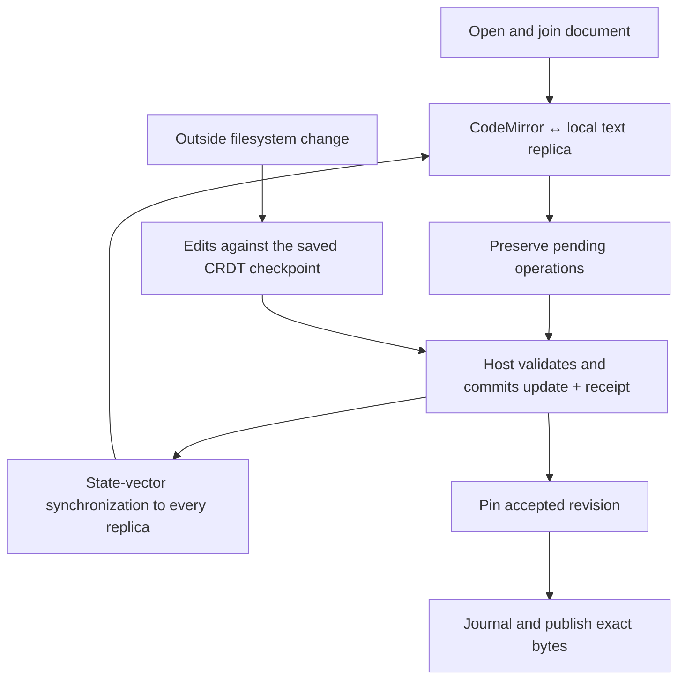

# Files stage

The in-app editor for an active project: a per-root tree, persistent tabbed buffers, and canonical editor documents over jailed project roots. What moves on its own while an agent works (presence, live playback, Review) is [files-live.md](files-live.md).

**See also:** [Files stage — live layer](files-live.md) · [Source navigation](source-navigation.md) (open targets, path resolution, external editor) · [Den](den.md) · [In-view find](den-in-view-find.md) · [Context menus + reveal](den-context-menus.md) · [Keyboard shortcuts](keyboard-shortcuts.md) · [Projects](projects.md)

**Machine truth:** [`ProjectFilesView.tsx`](../lycaon-den/src/files/components/ProjectFilesView.tsx) · [`editor-document.ts`](../lycaon-den/src/files/documents/editor-document.ts) · [`project-files-model.ts`](../lycaon-den/src/files/components/project-files-model.ts) · [`overview-ruler.ts`](../lycaon-den/src/components/source/annotations/overview-ruler.ts) · `/v1/projects/{id}/editor-documents/**` · `/v1/projects/{id}/source/**` (including `source/views`)

---

## Code layout

The stage lives in `lycaon-den/src/files/`, one directory per concern:

| Directory | Holds |
|-----------|-------|
| `components/` | `ProjectFilesView` and the parts it composes: `FilesTreePane`, `FilesPaneDeck`, `FilesStageDialogs`, `FilesEmptyEditor`, plus the stage model, presentation tracking, and agent presence |
| `tree/` | `FilesTree`, its paged model, selection, keys, drag, reveal, sticky rows, and virtual scrolling |
| `tabs/` | The buffer strip, tab commands, measurements, and drag |
| `editor/` | `FilesEditor`, its chrome, CodeMirror attachment, annotations, symbol and definition navigation, and preview and image viewers |
| `documents/` | Canonical editor documents: replicas, the outbox, buffers, drafts, residency, hot exit, and save |
| `history/` | Version history, restore and revert, undo, and jump history |
| `review/` | The Review lens, the diffs page, and turn, git, and revision diffs |
| `walk/` | Walk playback: the step rail, transport, chapters, and loading |
| `source/` | Source reads, comparisons, workspace identity and roots, invalidation, and caches |
| `commands/` | File mutations, confirmations, context actions, and the stage context menu |

`ProjectFilesView` and `FilesEditor` each build one scope object, typed `FilesScope` and `FilesEditorScope` in `components/files-scope.ts`. A controller declares the members it reads as a `Pick` of one of them, plus its own inputs.

## Read-only source ranges

Historical versions, Git review, deleted-file views, and transcript file diffs use comparison views under `/source/views`. A view summary carries endpoint identities, availability, line counts, and change counts. Den reads frames of at most 200 rows and 256 KiB (`pagedview.MaxRows`, `MaxFrameBytes`) and projects them into the shared CodeMirror editor with original line numbers; omitted regions are bounded-height widgets, and text, coordinates, and decorations change in one transaction. Distant scrolling, copy, and find ask the host for the requested range, and selection keeps source coordinates when its rows leave the page cache. A view expires after 30 idle minutes (`sourceViewLifetime`); an expired presentation can reopen its endpoints only if their hashes, paths, and availability still match. Den holds a retained view as current until a `source_view` event, a stream resync, or the lease itself says otherwise: a view is read once on its first attach before its handle is trusted, an attached view reads itself once a minute to renew the lease, and a view attached again with `expires_at` inside one renewal interval reads itself first. Releasing a view's last presenter schedules nothing, so a readiness check on a resident view, such as a diff row asking for its summary, costs no request.

**A comparison's two ends decide how it reads.** A file present only after is *added*, present only before is *deleted*, present on both is *changed*, and absent on both says so instead of opening an empty document. An added file reads as the file itself, with no insertion marks. A deleted file keeps every line marked as removed and numbered by its last contents. Only a changed file has context to fold or a second side to place beside it, so **Full file** and split are offered there alone. Every reader surface (Walk steps, the version picker, deleted-file views, Git and commit comparisons, transcript file diffs, the full-screen viewer) follows this from the same reader summary; the host describes a deletion as its retained contents becoming absent rather than inverting the sides.

**A changed line is marked as a line; its words are marked only against words that stayed.** Word marks exist to show what moved within a line that otherwise survived. A line whose words all changed, and any line with no counterpart, carries its line fill alone, since marking every word adds noise and no information. The host's comparison rows, the editor's live comparison, and chat authorship follow the same rule. The theme supplies both fills, fitted so every syntax color stays readable on a changed word (see [change fills](theme-tokens.md#change-fills)).

The host shares immutable comparison plans within the authenticated project, prepares syntax outside the view's read locks, and decorates only requested rows. Reading current source uses the editor service's explicit snapshot mode: unpublished draft revisions take precedence, and a clean editor cannot hide a newer disk observation. Long lines are fragmented without splitting Unicode characters.

## Stage identity

A full-stage Context surface: `Nav` value `files`, a context-zone entry, and a Crossbar go-to target. It reuses the same `/source` jail as every other source read; the stage adds no new path authority.

The Files view composes workspace resolution (`source/files-workspace.ts`), host document synchronization (`editor/files-editor-synchronization.ts`), and version history (`history/files-version-history.ts`). Document transport consumes the narrow `EditorDraftSource` port; only the synchronization composition imports both transport and the concrete buffer store. Attribution uses the editor's project, root, and session; findings refresh with the host's scan identity and status. Neither is cached by content hash, because identical bytes can have different provenance and findings.

Working text files with a resolved root open through `POST /v1/projects/{id}/editor-documents`. Consumers open the live editor document via `openEditorDocument` or read static source via `GET /v1/projects/{id}/source` (`readProjectSource`). Read-only, binary, oversized, and retained deleted files return source without a document; worker-overlay files use the ordinary source read. Den shares the supplied document by workspace, root, path, logical file identity, and encoding. Tab selection retains an existing replica, and the admission controller alone opens loaded working files, so repeated selections cannot race the combined request. Synchronization and durable checkpoints complete before the editor is presented.

## Tree

The tree uses a retained `kind: tree` source view and bounded host frames. Go computes the ordered logical rows and their total from one immutable structure generation; Den converts that extent into pixel geometry and renders bounded frames. Immediate per-directory browse remains available to path pickers and reveal resolution, under the same root confinement as source reads.

A presentation retains complete structure generations and compact disclosure rules; later directory observations and user commands cannot change its rows or extent, so names, kinds, and link status stay readable after paths are renamed or removed. The host reclaims generations no presentation references. Rows, locate, and search address an explicit immutable presentation; reading a frame never starts discovery, changes the extent, or moves another row. An expired lease is reacquired from saved intent.

| Rule | Behavior |
|------|----------|
| Hidden entries | Dot-entries, VCS metadata, project overlays, and ignored directories remain visible |
| Symlinks | Classified by target; a link whose target is gone is dropped rather than drawn as a file that cannot open |
| Order | Folders first, case-insensitive |
| Selection | Exactly one selected entry across files and folders, with the same selected-row appearance for both |
| Scope marks | Rows in the sidebar's current scope are decorated; the mark set is display-only |
| Name marks | A file name carries its change wherever it appears: added in the positive colour, changed in the accent signal, deleted struck through in the danger colour. Surfaces that mix changed and unchanged files (tree, tabs, open-files list) mark all three; a list where every row is already a change marks only added and deleted. A tab showing a version marks what **that version** did. A path link keeps the link colour and states its change in words |
| Folder click | First selection (or following a folder link) selects, opens, expands ancestors, and scrolls into view **without opening a tab**. Further clicks on the still-selected folder toggle it; selecting anything else resets the sequence |
| Sticky expand | Compact disclosure intent is saved per window and workspace, including recursive expansion and collapsed exceptions. Accepted changes persist before their presentation publishes; restart creates a host view from that configuration |
| Sticky scroll | Scroll persists per window label |
| Files ↔ Review | Tree and Review stay mounted with independent scroll state. Hidden Review releases live work; browsed listings stay cached across stage leave |
| Collapse all | Header control, `files.collapseAll`, and tree context menus. Roots stay open; all disclosure changes publish in one host revision. Alt/Option+click a twisty collapses that folder's descendants only |
| Expand all | `files.expandAll` sets recursive disclosure in one host command, opening every folder except the trees the walk policy collapses (ignored directories, installed dependencies, build output, VCS metadata). A dependency tree the project commits stays expandable. Collapsed trees open on request, one level per click or recursively through their own Expand all; opening one is ordinary intent and persists. Boundaries derive from the walk policy and the published structure, never from saved intent, and refresh as the structure changes without blocking the command. The previous tree stays usable until a complete replacement is ready; there is no progress overlay or provisional scrollbar extent |
| Publication | A complete presentation, its destination frame, exact extent, scroll position, and sticky ancestors publish together. Filesystem changes prepare a successor while the displayed presentation stays readable. Background publication waits for direct scroll input to settle; explicit disclosure commands publish immediately. Both preserve the visible path or its closest surviving ancestor |
| File reveal | Tab selection, the open-files list, source navigation, and explicit reveals share one logical-coordinate animation. Every step prepares its viewport before publishing; slow reads keep the previous rows visible. Reduced motion publishes the destination without animation |
| New file / folder | `files.newFile` / `files.newFolder`, row affordances, and context menus. Creates under the selected folder, the parent of a selected file, or the primary root |

Den sends coalesced, sequenced viewport interests; Go prepares the destination and its ancestors first, then three pages on either side. The Den cache retains up to 4,000 rows (`files-tree-paged-session.ts`), and immutable catalog pages share a bounded host cache across presentations. A new presentation must cover the viewport or its anchor before replacing retained rows and scrollbar extent, and the new row extent reaches the DOM before the restored scroll offset is committed. A delayed destination retains the previous complete viewport until rows and geometry can publish together; scrolling never exposes loading rows or provisional extents. Frames include the complete ancestor chain with exact ranks and subtree ends, and rows keep their DOM elements by path when indexes or metadata change.

Sticky folders take one slot per depth, bounded by Editor → **Visible tree levels** (five by default) and 40% of the pane; Off disables sticky rows and indentation folding. The preference counts the root and the collapsed row. Deeper paths lift the stack so the innermost folder rests in the last slot; folders lifted into the second slot collapse into one row labeled with the hidden count, and clicking it lists them. While that row is shown, every tree row indents by the collapsed levels fewer. One derived layout computes the pinned rows and folded depths from the displayed presentation, offset, viewport, and setting, and every row receives its final indentation when rendered. Panes with room for fewer than three sticky rows drop the root; one-row panes show only the innermost folder.

Wheel, trackpad, and touch input scroll the tree natively: rows are positioned in the scroller's own coordinates, so while every visible row is mounted no scroll event repositions anything. Only a destination that outruns the mounted rows holds the last painted rows until its rows publish. Wheel input over pinned folders forwards to the scroller through a passive listener. A thumb drag renders the visible rows plus a quarter viewport on each side and commits each frame's offset from script; a destination beyond the loaded rows is read one at a time, later thumb positions move the destination without starting reads, and the landing read is committed if it still covers the thumb. Thumb position and destinations use only the displayed presentation's exact extent; End is an explicit request for the final row.

Every folder row carries **new-file** and **new-folder** affordances, mounted only while the row is hovered or focused, opening one inline naming row under that folder:

- Enter creates via `POST /source` with the row's `kind`. A file opens as a buffer; a folder has nothing to open, so the tree re-lists.
- A name containing slashes creates the missing folders on the way.
- Escape cancels; blur abandons only an empty row.
- A refused name (leaves the folder, names the wrong kind, already taken) reports under the row **without discarding what was typed**.

### File lifecycle

Rename (move), Trash-backed delete, and copy are in stage scope via context menu, inline rename, and drag-and-drop. A rename retargets live and parked root-file buffers plus jump history; worker-overlay addresses stay with their overlay. Delete confirms the selected file or folder and its contents, resolves unsaved buffers, and **never unlinks as a fallback**: the host preserves a complete recovery snapshot before calling the operating system's trash service. A failure has its own heading, the actual reason, host-declared recovery guidance, and Retry when retryable; Retry reuses the original operation identity. Protected project metadata and paths outside attached folders have distinct errors; a symbolic link inside a root is deleted as a link. The tree and open tabs change only after host confirmation. Undo, move, and cross-filesystem behavior: [files-live.md § File and folder lifecycle](files-live.md#file-and-folder-lifecycle).

---

## Buffers

Each editable path has one canonical document per durable source branch, addressed `(project_id, branch_id, root_id, path)`; the branch is trunk or a registered worktree identity, never a hash of its folder. The document follows its path: the file identity the ledger records there is an attribute that rebinds when the path is deleted and recreated, and the deletion itself is an **absent** state of the same document ([files-live.md § Live buffers](files-live.md#live-buffers)). A root keeps its identity when its folder moves. Switching a chat to another checkout preserves pending edits and reopens tabs only for substituted roots. The document holds the draft, saved base, exact encoding and line-ending state, a monotonic revision, whether the file changed outside the editor, and the retained state of an agent edit the draft carries that disk never received. Every window joins with a host-assigned replica identity and binds CodeMirror to its local Yjs text. The host applies compatible Yrs updates and commits the resulting head, update, and operation receipt together before acknowledging. Another participant does not make the document read-only. The `editor_document` event invalidates accepted state without carrying text; epoch-qualified state-vector synchronization covers missed or coalesced events. Update replies carry CRDT deltas and metadata; saved-base text is included only when its hash changes.

`source_changed` invalidates a buffer; it does not decide that the document diverged. Den asks the host to reconcile through the same transition as watcher observation: the filesystem replica imports current bytes against its exact saved checkpoint, and concurrent unsaved text merges into the shared document. The banner is reserved for a host failure to import or publish the file.

**Undo.** Keyboard Undo and Redo target this window's text editing actions, preserving other contributors' text; the shared binding maps CodeMirror's history through incoming changes. Adjacent typing groups together; navigation, paste, completion, indentation, saving, save hygiene, and explicit document commands have separate boundaries. Undo restores every selection range, and blocked or read-only input cannot consume a history entry. Text undo and redo survive saving, tab switches, document suspension, and restarting the same window: checkpoints store the CRDT state and serialized CodeMirror history atomically with pending updates, keyed by window and logical document. History retains approximately 200 editing groups within a 16 MiB serialized budget that drops the oldest entries first. A replaced document epoch starts a new history; pending text from an incompatible epoch stays preserved for recovery.

The version history also offers selective undo for an agent operation. Each changed span retains its inserted and deleted character identities and neighboring context: undo removes surviving agent insertions but does not resurrect a replacement later editing superseded, and restores a deletion only while its original context survives. That explicit human action enters the invoking window's keyboard history, so Cmd+Z reverses it and Cmd+Shift+Z reapplies it while retaining subsequent remote edits.

**Durability.** Buffers and unsaved drafts survive navigation, window closure, app restart, and any change to the project's root set. Hot exit stores tab order, the active tab, and pin and preview state; draft bytes stay in the editor document. Cursor, scroll, folds, and the reopen-closed-tab ring persist separately. Worker-overlay buffers and scoped diff panes are not restored after restart.

A synchronized document that has only been opened writes nothing to the outbox. The first local change preserves a checkpoint as its recovery base together with that change, in one transaction; later changes append only their updates, and a fresh checkpoint carrying undo history is captured once typing pauses, when un-checkpointed updates reach 4 MiB, or when the document closes (`document-replica.ts`). Text durability is therefore per update while undo durability is per checkpoint. The native outbox has its own private, synced store; corrupt records stop recovery without being skipped. Save, replacement, discard, reload, resolution, and semantic undo requests preserve their operation identities before sending, so an uncertain acknowledgement can be retried after reopening. Pending records remain until a durable host receipt covers them. A window pauses new input at 16 MiB of encoded pending updates; already preserved work stays intact. Closing waits for local preservation and reports a storage failure instead of discarding pending work.

**Closing.** A closed tab leaves the strip at once; draft publication (or the host discard, after **Don't save**) and participant departure run behind it. Tab commands act on the tab the strip selects, not the file still painted while it loads. When the closed tab held the selection, its right neighbour (else its left) takes it, and the painted file stays on screen until that neighbour is ready. A release or discard that fails puts the tab back with its draft, marked with the reason; closing it again retries. A tab holding a draft that never reached a host document does not close without **Don't save**.

Typing after Save remains editable while the requested revision is pinned. Each save journal records its immutable content, EOL choice, and draft revision; recovery advances the base from that snapshot, preserving any newer draft as dirty. A missing, detached, or changed target settles the pending intent as a conflict and keeps the draft available.

A workflow may present one Files buffer through `ProjectFilesView`'s single-document presentation, with the tree and tab strip omitted. Blueprint review uses this presentation, and **Open in Files** transfers the active buffer to the foreground Files stage.

**Grounded `path:line` opens land here.** Navigation resolves the attached root and normalizes its relative path before opening, so a chat link and a tree row address the same buffer. A `job_id` open becomes a read-only, overlay-badged buffer. The requested line is a one-shot scroll plus emphasis: the caret lands on it, a 2.2 s flash (`REVEAL_FLASH_MS`) marks the arrival, and a `path:start-end` range stays selected afterwards.

**Stage chrome describes what a pane presents**, from three facts. An **address** is a place in the tree: the **breadcrumb** shows it, and the same fact decides whether **Reveal in tree** is available. A **document** is something readable: the **status bar** reports on it. A **page** has no tree place and says what it needs in its own heading; every other pane carries the **toolbar**, whose crumbs name the address or, with no address, the document's own title. A file has an address and a document; the info card keeps its address and drops the status bar; recorded chat content is a document with nowhere in the tree to reveal; Walk and Trust changes are pages; All diffs is a page that reads as one document, so it heads itself and keeps a status bar. `filesPaneChrome` in `components/files-pane-chrome.ts` holds the three facts for every buffer kind.

### Buffer strip

| Rule | Behavior |
|------|----------|
| Strip | One non-wrapping scrolling row; tabs clamp with a middle-ellipsized name; edge fades when there is more to scroll; the overflow control shows the count of tabs not fully visible and opens the open-files list. The active tab scrolls into view from every activation source |
| Open-files list | Management inventory of open buffers only (strip order, pinned first); never a second Crossbar, and never a way to open a file that has no buffer |
| Transient tab | At most one preview tab; browsing (tree single-click, citation open, jump restore, Walk navigation) reuses that slot. Preview filenames are italic. File tabs have no status flags or name tooltips; accessible names carry full names and states. Double-clicking the tab, any edit, save, pin, drag, **Keep open**, or Crossbar permanent open promotes it in place. A transient buffer is never dirty |
| Special views | Group summaries use stacked layers, diffs pages a split comparison mark, tool-call details a wrench, approval details a checked shield, Trust changes a plain shield, other chat content the chat icon, and previous versions and comparisons the versions icon. These monochrome icons precede the name, keep their width when the name clips, and expose a type tooltip only over the icon. The open-files list uses the same icons and can filter by type |
| Reveal in tree | Stays visible but disabled, with a reason, when the tab has no tree item: pages, tool-call details, worker views, and windows without a tree. File comparisons and historical views use current directory membership; deleted files retained in the review tree remain revealable |
| Pinning | Pin glyph + pinned group at the strip head; survives bulk closes, transient reuse, and hot-exit restart. Drag cannot pin or cross the group boundary; explicit Close / Close all still close |
| Bulk close | Close others / to the right / saved / all go through one dirty dialog (Save all / Discard all / Cancel). Cancel is atomic; a save failure stops the batch on the failing buffer |

Tree preparation and reveal never gate editor tab publication. Every tab kind uses the shared resident surface deck: the outgoing tab stays painted while the destination prepares its first viewport, one delayed waiting state covers both the source read and view preparation, and a superseded request cannot take over. Inactive presentations release subscriptions and may surrender their document payloads. Preparing, retained, and idle surfaces cannot claim input; the same boundary suspends portaled menus, modal traps, and focus handlers without destroying their state.

---

## Editor

CodeMirror 6 with baseline language packs (dedicated `lang-*` grammars, `legacy-modes` for the rest) and the Den syntax theme (`--den-code-*` tokens).

Editable text and undo reside in the window's admitted document replica. A tab descriptor contains identity, host metadata, and an explicit unloaded, source, document, or suspended payload state. Detached editors stay live within count and memory limits; releasing one captures compact view state and destroys its editor state. A separate pool retains at most two empty viewports, which hold no document text, undo history, or component callbacks.

The open response paints the buffer: the text arrives once, inside the editor document's CRDT state, decoded before the first frame and handed to the replica, so it is never parsed twice; line-ending facts come from the host document. Gutters, findings, the overview ruler, secret highlighting, and scrollbar updates wait until that first frame is on screen. Editing waits for the host document join; the same bytes stay visible during initialization, and a failed join does not replace the file with an error. A reopen while the window still holds the replica sends its state vector, and the host answers with only what the replica lacks. Only an unreachable host permits local hydration; reconnect then reconciles. An uncertain history-changing command keeps editing paused until its outcome can be recovered. Secret screening completes asynchronously and never delays reading, editing, closing, or saving.

### Document residency and recovery

The renderer apportions a 256 MiB document working-set budget (`DOCUMENT_MEMORY_BUDGET`) across the native window inventory, never giving a window less than one tab switch between two limit-sized files needs. Reservations cover loading through disposal, with at most two acquisitions and one speculative acquisition per window; these are conservative estimates, not a JavaScript heap limit. The displayed document and its preparing replacement stay protected; further admissions stop until capacity is available.

Suspension captures selection, folds, and scroll, preserves required recovery, rechecks whether the document became wanted, departs presence, disposes the replica and view, and releases its reservation. A failed preservation retains the payload and exposes the storage block. Dirty state alone does not require residency. Idle Files stages do not reload suspended selections or prefetch neighbors. Save, discard, and delivery can admit a document without mounting its editor.

Recovery follows the state at risk: a clean document without undo writes no checkpoint; a saved document with undo retains its covering checkpoint while its tab is open; pending edits remain durable independently of tab references. References are per window, released on tab close and swept by native boot and window destruction; the host sweeps only clients without a live event stream, and a window republishes its set after regaining the host. Unreferenced synchronized checkpoints are eligible for cache pruning; pending records are not.

Selection and folds in collaborative documents use relative CRDT positions with an epoch guard, kept alongside saved-base offsets so a reopened file whose document identity changed still restores against an unchanged base. Read-only source uses snapshot-guarded row and offset coordinates. Hot exit stores descriptors and document identities rather than text. The window relay synchronizes suspended dirty tabs across projects without mounting an editor.

Files over the editable size limit (`EDITABLE_SOURCE_MAX_BYTES`, 4 MiB) use the current-file adapter of the shared source reader: strict text decoding into an immutable temporary text file and row index, with a 2 MiB memory reservation per snapshot and a shared 2 GiB temporary disk budget (`source_view_service.go`). Row fragments, viewport frames, search, and copying are bounded. A file replacement, write, removal, or detached root invalidates the retained read. These files remain read-only.

**Scrolling.** Direct scrollbar jumps prepare CodeMirror's virtual viewport at the destination before moving the physical offset; a thumb gesture reuses the scroll range measured at pointer-down. Scrollbar placement joins CodeMirror's measure pass so a scroll frame resolves style once. The vendored CodeMirror viewport (`patches/@codemirror+view@*.patch`) treats rendered cover as a time budget: a swap is due once the lead in the direction of travel drops below a few frames of the last measured delta, so the replacement lands while the scrolling thread is still over rendered lines. The lookahead is 1000 px at low speed and grows with speed to 2000 px, leaning toward the direction of travel; only a thumb drag or track click that moves more than half the visible area renders a short lookahead instead, since its next frame replaces the viewport again. When scrolling settles, the viewport widens to at least 1000 px on both sides. Height corrections above the scroll anchor use a relative `scrollBy`, never an absolute `scrollTop` write, because WebKit applies a relative request to the scrolling thread's own position while an absolute write discards the distance travelled since the main thread's older offset. Gutter cells stay with the lines they render, and one delegated handler owns gutter activation and its single roving tab stop. While the editor scrolls, gutter hover styles, the restore chip, read-range highlights, the line facts card, and the removed-lines preview hold still; they re-evaluate once when scrolling settles. Newly revealed lines paint highlighted: Den parses the revealed viewport in the microtask after CodeMirror's update and finishes the document in idle slices, and the native shell enables WebKit's `requestIdleCallback` so those slices run in genuine idle time. Each measure reaches performance capture as `editor.viewportSwap` or `editor.measure`.

Scrolling preserves the caret and both selection endpoints, including when they leave the viewport. Native selection synchronization runs with every editor redraw.

**Historical versions** use the same stage, read-only CodeMirror document, and visual system as Current. Changed regions are highlighted in place and long unchanged runs start folded with their hidden-line count; **Full file** unfolds the document from inside the content surface, and the same floating cluster leads with **Current**, the one-click way back. The outgoing reader stays painted until the destination comparison has prepared its first viewport. The version body, secret spans, language, byte size, and playhead publish from one settled comparison; current-only encoding, EditorConfig, cursor, and save notices leave the status bar while history is visible. Walk, the step rail, and version restore: [files-live.md § Step through the run](files-live.md#step-through-the-run).

**Diffs page.** The page is all the diffs of one comparison, reached from a turn card's **All diffs** action or the Review panel's header door, `Mod+Alt+Shift+D` (`files.openAllDiffs`; macOS takes `Mod+Alt+D`), and `Mod+Alt+C` (`files.chooseComparison`) for the eye's own menu. A commit id, branch, or range typed into Crossbar addresses it to **Git**: the host resolves the text to two commits in each Git root (`revision-diffs.ts` gates and opens). The page is **one reader**: its heading and every changed file are blocks in a single CodeMirror document, so the page costs one editor rather than one per file. Before any section reads, the page measures every comparison through `POST /source/comparison-digests` (64 per request), so an unread file holds a placeholder sized by its digest and the page has its full length and an honest scrollbar before anything loads. A section reads bounded frames of at most 200 rows around the viewport through its own host presentation; loaded rows stay while the section is among the dozen most recently read, and a read the page no longer wants is dropped rather than painted. Each section's header carries the path as a link, the file's numbered writes, `+`/`−` counts, **Full screen**, and its disclosure; an added or deleted file is a name alone, marked green or struck through. **Collapse all** folds every section. The status bar names the page, counts files and lines, and carries **Wrap**; `files.diffNextFile`, `files.diffPrevFile`, and `files.diffToggleCollapse` are answered only by the page on display.

A **turn** page is pinned: its range runs from the state the turn found each file to the state it left it, so a later turn's work never appears inside it, and it carries **Walk these changes**. The eye's *this turn* scope shares the starting point but ends at the tracked head, so the two are titled apart: *What this turn did* and *Changes in this turn*. A **lens** page follows the eye: its inventory is the panel's own resolved scope, so the tab and the eye cover the same files. A **Git** page reads two commits of one root, never recorded history or the working tree; its heading is the host's label for the pair (`a1b2c3d Fix the loader`, `topic...HEAD`), it is keyed on the root and the two resolved commit ids, its file list is read once per tab, and past 500 files (`DIFFS_FILE_CAP`) it lists the first 500 and says so. Each page opens transient, is never restored by hot exit, and cannot be pulled into another window.

**Editability.** A buffer is editable when the full file loaded with a content `sha256` and exact `encoding`, the file grants owner-write permission, and this window has initialized its collaborative replica: not truncated, not over-limit, not a worker-overlay `worker_id` read. The footer labels exceptional states: **Historical version**, **Worker draft**, **Read-only file**, **Preview**, **Large file preview**, **Deleted**, **Deleted on disk** (the retained draft of a file removed underneath, still editable; Save recreates it), or **View only**. Peer presence never changes the editing mode. When a client's event stream has been gone for `editordoc.PresenceGrace`, the host removes its presence but not its durable document or pending outbox. Native windows use their stable window labels; browser reloads acquire a browser lock before joining, so a duplicated tab cannot author under another live window's identity.

When the identity has one valid transition, the toolbar shows exactly one icon-only state action in the restore position: restore the selected version, open the current project file from a worker draft, or add owner-write permission to a read-only file. `POST /source/editable` adds only owner-write, stays inside the selected root, and compare-and-swap verifies the loaded `sha256` before changing mode.

Opening a supported, writable file automatically joins its collaborative document. One lifecycle owns admission, reconnect backoff, and errors. Opening and reconnecting are transient statuses; a refused or failed initialization is a file-local error that keeps readable bytes on screen, never a "view only" mode. Transport failures retry automatically while the file remains open, with backoff capped at one minute (`document-replica.ts`); permanent failures expose Retry editing without discarding the draft. A mismatched workspace response revalidates the Files workspace; a missing workspace identity explains that the backend needs updating. Late responses cannot attach to a closed tab or another workspace.

| Chrome | Contents |
|--------|----------|
| Toolbar | Breadcrumb path · one icon-only state action when applicable · Save · Discard when dirty · Find · Go to line (`editor.goToLine`, also read-only) · Copy path. Right-click / Shift+F10 on Find, Go to line, Copy path, or More opens that control's menu |
| Footer | Static identity icon + label · transient notices · unsaved count · Ln/Col · language · indent, EOL, encoding, EditorConfig, and Simplified detail chips · **Wrap** toggle. Line numbers are a View menu control |

**Windows.** The active file tab's fill and top accent carry the current window's theme-derived identity color. The native window registry is the one numbering authority: the main window is Window 1, each additional window takes the next number, and a closed window's number is never reused. Local carets and selections use that identity; peer selections have a lighter fill and a muted outline. All selection ranges are shared (up to 256; larger local selections project their primary range). Peer activity never changes local scroll, selection, focus, or undo history. When the file is open in multiple windows, **Open in N windows** in the footer lists them with swatches, a **This window** label, and native focus/close actions; the registry governs visibility, so a closed window disappears immediately. See [Theme colors](extend.md#themes).

**Saves** go through the editor document's **`/save`** action with an idempotent operation id and the current document revision. The host atomically replaces the file, records the source change, and checkpoints the clean document; an absent document's save creates the file exclusively and yields to any file that appeared meanwhile. A disk change since the saved base marks the document diverged and leaves the draft intact. A reservation older than the saved base, because another publication or an imported outside change moved it while the save was in flight, is stale rather than a conflict: the host refuses it without marking divergence, and the window reserves again against what it holds now. EditorConfig hygiene lands as exact edits, each trimmed run and the final newline on their own, so every untouched character keeps its author. Dirty guards use a Den dialog offering Save, never `window.confirm`.

An agent writing the same file goes through the same document: its tools read the shared text, apply an anchored change, and publish through the same journaled door. One saved version records the published bytes and retains all contributors in the source ledger; if publication fails, accepted text remains in the document and the agent receives the outcome ([files-live.md § The open document is the file](files-live.md#the-open-document-is-the-file)).

**Workspace.** The Files workspace lookup returns the ordered physical root map after applying the active chat's checkout binding; Den uses that one resolved set for browsing, Copy path, Reveal, Open in editor, viewers, and file operations. The lookup declares whether the checkout belongs to the chat (`session_scoped`): a chat with a worktree is scoped and its id addresses every read of that workspace; every other chat resolves to the project's own checkout under one `workspace_id` with no chat in the address. Den keys its state on the resolved workspace and never on the chat, so following another chat that shares the checkout keeps the tree, marks, and overview as displayed. Review comparisons about the chat itself (this turn, this chat) still follow it.

**Editing feel:** auto-close pairs, auto-indent, per-file indent detection, column selection, EOL preservation. Settings → Editor holds text, indentation, guides, and the default historical-version comparison, alongside the external open preferences that belong to [source navigation](source-navigation.md#external-editor).

**Completion** always offers buffer words; grammar completions (CSS properties, HTML tags, JavaScript scope) are offered alongside. **Folding** works in every buffer and says how many lines it hid; languages with a real grammar fold by syntax, stream-mode languages fold on indentation, so the gutter never offers a control that does nothing.

**EditorConfig:** the host resolves `.editorconfig` from the file's directory to its attached root (stopping at `root = true`) per the [specification](https://editorconfig.org), and the editor reads the result from `GET /source/editorconfig`: `indent_style` / `indent_size` / `tab_width`, `end_of_line` (`lf`|`crlf`; `cr` ignored), `trim_trailing_whitespace`, `insert_final_newline` (`false` = strip; empty files never gain one), `charset` (status tip and mismatch only; encoding remains a host decision), and `unset` to clear a farther pair. Unrecognized keys are ignored. Saving or externally changing a `.editorconfig` re-resolves every open root text buffer.

A person's save applies `trim_trailing_whitespace`, `insert_final_newline`, and `end_of_line` to the draft before publishing. Agent writes are never rewritten: `write`, `edit`, `replace_lines`, and `code_rewrite` check the lines they inserted or changed against the same resolution and, on a mismatch, keep the write and append an `EDITORCONFIG_MISMATCH` card naming the file, rules, and lines. An open document owns its line endings, so agent edits there are not checked against `end_of_line`.

Indent precedence: session chip override → EditorConfig → content detection → prefs. Convert indentation to spaces/tabs is a Crossbar command and an indent-chip menu action; a chip style pick alone affects new edits only.

Editing verbs beyond character motion, and findings navigation (`F8` / `Shift+F8`), are **app commands**: rebindable, listed in Crossbar, and bridged into the editor keymap. Buffer commands (`files.nextTab` / `prevTab` / `closeTab` / `save` / `reveal`, `files.jumpBack` / `jumpForward`, `files.goToDefinition`) stay in the Files stage.

### Non-text buffers

| Kind | Behavior |
|------|----------|
| Images | Load bytes from **`GET /source/raw`** (images only) |
| Binary | Info card, never a truncated editor |
| Over-limit text | Paged read-only source, with find and go to line, within the reader's resource limits |
| Markdown | **Code / Preview** toggle; code is the default, preview renders through the sanitized chat markdown pipeline. Large previews lex the whole document in a cancelable worker and send only viewport sections for sanitization and mounting. The prior content stays visible and grayed until the replacement's first viewport renders; worker failure is a project notice. Only mounted sections participate in native selection/find |
| Diff | **`DiffViewerDrawer`** is the fullscreen diff overlay with a persisted **Unified / Split** layout toggle |

### Find

The stage mounts the shared Den FindBar over the whole buffer, with a live count (`3 of 47` / `No results` / `999+`) and the option to freeze matching and replacement to the selected range. Contract: [in-view find](den-in-view-find.md). While Find has a query, its results own the overview strip's match layer.

### Overview strip

An 8px canvas in the editor scrollbar column is a whole-file map of host outline declaration lines (`GET /source/symbols`), the shown comparison, current focus, other matches, other windows' selections, and [agent activity](files-live.md#presence). Window selections use their window colors; overlapping windows have separate narrow columns. Every declaration kind uses one muted symbol tick, coalesced on adjacent pixels. The comparison is the same chunk set the line gutter paints, in its own lane on the right edge. Current focus is the caret, selection, or active Find result; other matches come from Find while it has a query and otherwise from the caret word or selected text. The ruler carries no finding or secret state, because those facts have dedicated editor surfaces. It is decorative (`aria-hidden`, no pointer events). Settings → Editor → Scrollbar ticks turns the strip off or keeps any subset of symbols, changes, matches, cursor, window selections, and agent activity; a hidden kind is not collected, and with none shown the ruler is not mounted.

The canvas covers the themed scrollbar's own track, and each tick sits where the thumb's top edge rests when that line is at the top of the viewport, so a mark inside the thumb is a line on screen. Positions come from the editor's own settled layout against the scroller's viewport, with the thumb's length derived the same way the scrollbar derives it, so wrapped lines, folds, and the thumb's minimum length all land where the thumb does. Ticks never move with scrolling; the strip repaints when its ticks change. Without a scrollbar track, or when the buffer fits, the strip is hidden.

### Symbols

| Feature | Behavior |
|---------|----------|
| Go to definition (`files.goToDefinition`, Mod+Click) | Resolves the word under the caret by narrowing whole-word search hits to AST-confirmed declarations in the active root. Dependency and build paths are excluded. Candidates rank the nearest declaration in the active file first, then the same directory and shallower paths. One candidate jumps only when the lookup is complete; multiple candidates, or one from an incomplete lookup, open a picker; none shows a notice that names the identifier and says whether the lookup was incomplete. Discovery gaps, failed refreshes, skipped files, time limits, and result caps mark the lookup incomplete. The invoked identifier carries a pending underline for the life of the lookup, and Escape or a buffer switch cancels rather than jumping the reader later |
| Definition picker | The **ambiguity** surface, never the failure surface: the header counts the declarations, and each row carries kind, `path:line`, and the declaration line itself |
| Passive surfacing | Resting the caret in an identifier highlights its other whole-word occurrences in view; selecting text highlights its other literal matches across the file. Both tick the overview strip |
| Breadcrumb symbol | Ends with the enclosing outline symbol at the caret (kind badge + name); click opens the symbol dropdown, right-click opens the rename card |
| Symbol dropdown | Opens from the file name or the symbol segment and portals above the stage. Filter narrows by subsequence; arrows / Home / End move and Enter jumps. Closes on Escape, an outside click, a scroll or resize, or a second click on the segment |
| Rename symbol (`F2`) | Rename card on the word under the caret: counts (in-file + project), This file / Everywhere scope, collision warning. **Everywhere** lands on the search-stage Replace preview (whole-word text replace, no symbol proof); **This file** dispatches a declared editor action and lands as a model edit through the normal tool write path. See [Inline edit and selection verbs](#inline-edit-and-selection-verbs) and [search.md § Replace and Rename doors](search.md#replace-and-rename-doors) |

There is no project-wide or background symbol index.

### The knowing gutter

**One cell.** Fold, numbers, findings, restore, and the change bar share a single gutter cell (`annotations/line-gutter.ts`), fixed at `calc(5ch + 18px)` in every state. A mark either fits its zone or degrades inside it, so nothing the gutter can show moves the code. Three zones over the same honesty gate:

| Zone | Shows |
|------|-------|
| **Leading** | Scanner findings by line ([scan-findings.md](scan-findings.md)), glyphed by highest level on the line and coloured on the `--den-finding-*` ramp; a CodeMirror diagnostic marks the reported span on the code, with keyboard navigation between findings. While a comparison is painted, **Restore these lines** takes this zone as a chip on the first line of the hovered change |
| **Digits** | The line number, and on a line that opens a block the fold control: the number takes a disclosure underline and fills in when folded |
| **Edge** | The eye's comparison, one bar per changed line, plus the row a removed-lines block sits on when **Deleted lines** is *In place*. When it is *Folded*, a short delete mark straddles the boundary instead; hover or focus previews the removed text over the code, and a click or Enter shows it in place. A bar over a line an agent wrote is a button: a single contributor opens its tool call directly; several open the line facts card. Adjacent intervals sharing session + turn + tool call merge into one span |

**One line facts card.** The whole gutter cell opens a light menu surface after a short pointer rest. **Now** lists approval-held changes first, then other pending changes and worker drafts, newest first; **Changed** lists every contributor newest first; **Findings** lists individual findings highest severity first. Every row opens its owning tool call, worker job, or finding. A routed **Back to path:line** control returns to the exact originating tab and line. Moving to another fact line swaps the card immediately; leaving the gutter and card starts a short grace period; scroll, Escape, outside clicks, or leaving the editor close it. Keyboard focus opens without delay: Up and Down move between visible fact lines, Right or Enter enters the card, Left or Escape returns. Hovering code never opens this card.

**One bar, not two.** *What changed against the comparison I picked* and *which turn wrote this* are the same mark. The change bar is driven by the same chunks that paint the wash (`components/source/diff/scope-diff.ts`, built on `@codemirror/merge`'s `Chunk`), so the bar cannot drift from the wash and provenance cannot outlive its comparison. Attribution and findings are fetched for the saved text and move with their lines through unsaved typing. The bar is its own hit target: the edge strip, not the whole cell. Turning the eye off empties the margin along with the tree marks and open diff tabs. Attribution paints only where the comparison already marks; an agent line the selected baseline does not cover has no bar. An open buffer refreshes its comparison only when that file's selected baseline or tip changes.

**The gutter and overview strip carry no secret mark.** The span decoration over the exact bytes owns that fact. See [Secret spans](#secret-spans).

**Degrading inside a zone.** Past 999 lines the numerals leave under the width a glyph needs, and a restore chip holds the zone while its hunk is hovered; in both cases the finding keeps its cell, click target, aria label, and popover, and gives up only its shape: the cell takes the severity wash and the numerals the severity ink.

**Honesty gate.** Marks render only when the buffer is **clean and its sha matches the ledger tip**; a dirty or drifted buffer shows none, because a line number from an older revision points at the wrong code. The client never computes attribution or finding ranges.

### Inline edit and selection verbs

Inline edit (`Mod+I`) resolves its scope purely (selection, else the enclosing symbol, else ±20 lines) and runs as a declared **editor action**: the command names the action, the action names its preset and pack prompt, and the host renders that prompt rather than accepting client-authored tool prose. The flow is dirty guard → editor action → prose sink or post-apply hunk review; **model output never reaches a buffer from the client**. Changes land through the normal tool write path (see AI edits below).

**Rename symbol's This-file scope is the same machine.** It shares the panel, the dirty guard, the resolved scope, and the declared-action path; only its action and prompt differ. Its Everywhere scope leaves the editor for the search stage's text replace.

**Ask about selection** is a closed group of six verbs: Explain in context · Give me the gist · Document this · Add test · Rewrite structurally · Fix this finding (offered only when a finding annotates the range). Selection turns are **capability-poor** (file tools only; no shell, network, or MCP) and write-pinned to the request file, except that Add test may also write beside it in the same directory. Prose lands in chat; edits become reviewable hunks.

Rename and Go to definition target exactly one identifier: right-click the name or place the caret inside it. A broad selection or whitespace is not a symbol target, so both rows are disabled and say what to do instead.

### Composition rules

Layout must stay still while content arrives:

- The tree and File summary are separate named scrollports whose offset changes go through their host's `commit()`. The editor restores position through editor view state. None scrolls the stage shell or intercepts another surface's wheel gesture.
- The gutter is one fixed-width cell, and the overview strip overlays the scrollbar column; neither shifts code.
- Editor wheel, trackpad, and touch input scroll natively. Thumb and track input moves the scroll offset and synchronously notifies CodeMirror before paint; CodeMirror measures once per offset (vendored patch, `platform/codemirror-view-patch.test.ts`). Virtual spacers do not animate.
- Every buffer, read-only included, scrolls past its end so the last line can reach the top, and keyboard or API caret movement keeps three lines of context above and below the caret (`components/source/editor/cursor-margin.ts`). Pointer selection never scrolls.
- A recreated file has one live tree row: a current directory entry suppresses its historical deletion tombstone, and loaded current bytes show a changed tab instead of a deleted name.
- At most three bars above the editor. One interactive overlay is open at a time. The status bar drops facts rather than wrapping or truncating.

While a CodeMirror panel, the more menu, or the dirty dialog is open inside the stage, **Escape closes that layer, never the stage**.

---

## Secret spans

The editor highlights bytes the host already treats as credentials, and lets a person mark one it missed. This is presentation, not a security prerequisite: content is never redacted in the editor, and loading does not wait for a screen. Every completed span is a host fact stamped onto the exact document revision by the same matcher that guards outbound seams; **Den detects nothing**. Lifecycle and security posture: [Secrets and redaction](secrets.md).

**Machine truth:** [`secretspan`](../lycaon/internal/secretspan) · [`editor_secret_spans.go`](../lycaon/internal/api/editoradmin/editor_secret_spans.go) · [`secret-span-model.ts`](../lycaon-den/src/components/source/secrets/secret-span-model.ts) · [`secret-span-decorations.ts`](../lycaon-den/src/components/source/secrets/secret-span-decorations.ts) · `EditorDocument.secret_screen_status` / `secret_screen`

### States

Three states, separated by underline **shape** as well as hue, so they stay apart in a monochrome screenshot and for a reader who cannot separate green from amber.

| State | Fact | Drawn as |
|-------|------|----------|
| `tracked` | The current value of a live managed capability. The agent never reads it; chats the capability admits use it by reference | Solid underline, positive wash |
| `retired` | A replaced version, or a capability someone revoked. The reference no longer resolves; the bytes remain screening evidence | Wavy underline, muted |
| `detected` | A catalog or container-evidence hit with nothing tracking it | Dashed underline, warning wash |

State is the ledger's standing of the bytes, never the reach of whoever reads them. A person reviewing a file sees every live capability as `tracked`, with its reference, whichever chat created it; a value a chat generated and wrote into a file stays `tracked` until someone revokes it or replaces its value, even after that chat is deleted. An agent's own screens attach a reference only where its scope admits one, but its bytes read as the same state.

An exact public value covered by an active project ignore declaration is not drawn; removing or expiring that declaration restores screening. Secret spans are not scan findings and share no plane with them: a finding is a durable SARIF record about the project, while a span is a live fact about exact bytes in one revision.

### Where the signal lives

The feature adds **no permanent chrome**: the knowing gutter is one fixed-width cell, and the status bar drops facts rather than wrapping.

| Question | Surface |
|----------|---------|
| Which bytes | The underline, over the code: the only channel that can point at a range narrower than a line |
| Where else in the file, how many, and how the screen knows | On request: `files.showSecretScreen`, the editor's Go to overflow, and Crossbar |

One **conditional** status chip is the single exception: it reports when highlighting is unavailable or covers only a prefix. Nothing anywhere reports a file as clean; the report is a count of what was found plus the catalog that found it, never an assurance about what is absent.

### Marking

Right-click a selection, the context-menu key, or `files.markSecret` opens one sheet: a name, a purpose, and a receipt of the exact bytes. There is no scope control: a value living in a file outlives any one task, so a marked capability always takes **project** scope and names no owning session (`origin: file_marked`).

| Rule | Behavior |
|------|----------|
| The file is not modified | Marking edits nothing; the source file remains the credential source of truth. An agent reading the file sees the reference in place of the value, with a host notice that the file still holds it |
| The client sends offsets, not bytes | The request carries the document identity, the observed revision, and a rune range. The host slices the value from its own copy of the draft, so a credential never travels in a request body, an access log, or an error path |
| A moved document is refused | The sheet publishes the draft once when it opens and anchors its preview and mark to that revision and rune range; it never re-syncs on submit. A range carries the revision it was selected against, so bytes that move under an open sheet (another writer, a reload) are a `409` the sheet reports as a stale selection, never a mark placed by offset into newer text |
| The selection is trimmed, visibly | Surrounding whitespace and one matched quote layer are stripped; the sheet says what it trimmed and offers to keep it |
| The host decides eligibility | Too short, too large, only quotes, a capability token instead of a value, or bytes a managed secret already protects are refused with the reason |
| Undo does not reach it | Nothing was edited. Marking is reversed by revoking in Settings → Secrets |
| Marking a dirty buffer | Allowed, and labelled: the capture takes the draft bytes |
| The same value twice | One capability; repeating a mark with the same operation id returns the existing one |
| Other uses | **Find other uses in this file** selects them, using the fingerprint already computed. Project-wide search is not offered: it would push the credential through a query path |

**Ignore this value in this project…** opens a review of the exact bytes, required reason, target folder, and optional expiry before writing plaintext to `.paintedwolf/ignores.yaml`. It is offered only on an untracked detection and never releases a held request.

### Screening cost

The screen runs on document open, reload, discard, save, observe, and participant change, and is memoized per document by draft digest. Historical reader endpoints carry screening summaries; requested rows carry exact spans. Above `secretspan.ScanByteCap` (512 KiB) the screen covers a prefix and reports `truncated`. Live-document spans carry the revision they were computed against and map through edits until the next screen lands.

---

## AI edits from the editor

Inline edit and every selection verb land through the **normal tool write path**, so they are attributed and reviewable in the Review lens like any other change. An edit opens a post-apply hunk review: **Accept** keeps that hunk; **Reject** restores its before-lines against the current file revision. The panel closes after its final hunk is resolved.

### Revert, restore, and reject

**Restore these lines** and **Restore comparison baseline** are user-origin writes against the current eye; their semantics are in [files-live.md § Review lens](files-live.md#review-lens). In the editor, Reject sits in the gutter's leading zone, in a folded removal's preview, and in a header row on the dedicated diff, and waits for a save because it writes against the file on disk. Revert sits on the Review row, a tree tombstone, the dedicated diff footer, and Crossbar (`files.revertFileChanges`, `files.rejectHunk`). Historical views instead offer **Restore this version**, which makes that exact retained state current at the file's present path.

---

## Encoding

Encoding and line-ending preservation are platform invariants shared with the native text tools; see [Source navigation § Editor encoding](source-navigation.md#editor-encoding). The stage opens four self-identifying representations automatically (UTF-8, UTF-8 with BOM, UTF-16LE with BOM, UTF-16BE with BOM); BOM-less UTF-16 is never guessed, and the binary card offers an explicit **Open as UTF-16 LE / BE**. An existing file may be saved only with the exact encoding returned at open.

A successful explicit byte-order choice survives reload, hot exit, and reopening a closed tab; each read first checks the current bytes, and a conversion to self-identifying text or an image takes precedence. Clean tabs refresh their content and presentation after external writes, including transitions between text, images, binary, oversized, and encoding refusals; the host re-reads open documents on every external batch as well ([Files live § Live buffers](files-live.md#live-buffers)). In-flight refreshes cannot replace unsaved edits or a selected historical version. A tab whose root is not fully watched for outside changes says so in its status line.

Loading and failed reads do not assert a binary classification. The open-files list distinguishes **Image**, **Binary**, **Too large**, and **Encoding**; a failed info-card read is reported as a project notice (`files_document_unavailable`). Text classification validates the complete editable revision, so a multibyte character spanning the MIME-sniff boundary remains text. Image detection checks format structure rather than promoting ordinary text prefixes to images.
