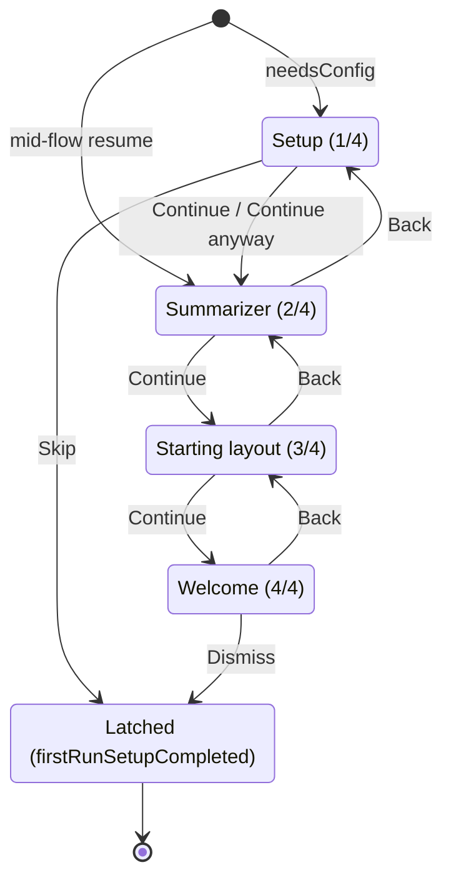

# First run

The hard gate a new install shows before the home stage, and how a missing provider is reported once that gate is done.

**Implementation:** [`components/onboarding/`](../lycaon-den/src/components/onboarding) — `OnboardingGate.tsx`, `onboarding-gate-model.ts` (page order and the show / page / continue / layout predicates), `OnboardingStepPage.tsx`, `OnboardingLayoutChoices.tsx` and `OnboardingLayoutPreview.tsx` (the starting layout page). Styles: [`onboarding-domain.css`](../lycaon-den/src/onboarding-domain.css). Post-latch recovery: [`notices/no-provider-card.ts`](../lycaon-den/src/notices/no-provider-card.ts). Latch: Den `AppState.onboarding.firstRunSetupCompleted`.

**See also:** [Providers](providers.md) · [Den](den.md#notifications) · [Naming](naming.md)

---

## The gate

`OnboardingGate` is the only blocking first-run surface: four pages in one chrome. It shows when prefs are loaded and the latch is unset. It does **not** wait on the sidecar or the model list, so someone who cleared their config can reach the setup page and leave it with the engine offline or slow.

Because it blocks, it carries the matching semantics: `role="dialog"` + `aria-modal` on the gate, labelled by the current page's title, a `main` landmark inside it, and first focus moved onto the gate on mount and on every page change. The providers card names its region with a heading so the page title is not followed straight by the provider group subheads.

While unlatched, the splash renders the brand chrome and the shell paints a blank pending stage, so the home surface never appears underneath.

The entry page depends on `needsConfig`, which is `readyProviderCount === 0 || !hasDefaultModel`: Setup when true, otherwise Summarizer (a mid-flow resume never repeats Setup).

---

## Pages

| Page | Asks for | Leaving it |
|------|----------|------------|
| **Setup** | One provider and a default model, in the same visual language as Settings → AI providers | **Continue** unlocks once a ready provider and default model exist. Validation on a dead network is bounded but not instant, so a slow check offers **Stop check**, and a check that does not succeed offers **Continue anyway** rather than trapping the page. **Skip** exits the whole gate and latches |
| **Summarizer** | An optional summarizer model, mirroring the Settings → AI providers summarizer block; **Add another provider** opens the real providers panel | **Continue** persists and advances; **Back** returns to Setup. No Skip |
| **Starting layout** | Whether the app opens to the conversation alone or with a context view beside it | **Continue** advances; **Back** returns to Summarizer. No Skip |
| **Welcome** | Nothing: a Settings → AI providers teach and a closing beat | **Dismiss** latches; **Back** returns to Starting layout. No Skip |

Page order is one list, `ONBOARDING_GATE_PAGES`; Back, Continue, and the progress cue all read it. Chrome is a quiet `N / 4` cue, not a carousel. Product copy carries no engine codenames ([naming.md](naming.md)).

**Escape** is Skip on Setup and Dismiss on Welcome. On the pages between, it steps forward without latching (`onboardingEscapeTarget`).

**A withheld Continue says what it is waiting for.** `onboardingSetupBlocker` returns which half is missing, `provider` or `default_model`, in the order they are fixed. Setup renders that sentence above the actions, points the button at it with `aria-describedby`, and repeats it as the button's tooltip. Continue is `aria-disabled` rather than natively disabled while blocked, so it stays in the tab order and announces the reason; the native `disabled` attribute is reserved for the in-flight check.

**The latch is written on dismissal, not on readiness**: when Welcome is dismissed, or when Setup's Skip exits the gate. Once set, the hard gate never returns, including after providers are cleared later.

### Starting layout

The page is the existing **Settings › General › Open at launch** row (`layout.startupCompanion`) drawn as two cards. It owns no preference of its own, including the column a narrow split keeps, which follows this choice until Settings pins one ([`den.md`](den.md#workspace-model)):

| Card | Open at launch | Stored |
|------|----------------|--------|
| **Chat** | Chat only | unset |
| **Files and chat** | Split with Files | `files` |

Chat is the default because an unset value already means it. A pick saves immediately through `saveStartupCompanion`, exactly as the Settings row does, so the page and the row cannot disagree. When first run returns after a store reset with another companion already set, the split card names that companion instead of replacing it with Files (`onboardingSplitCompanion`). The other companions stay in Settings.

The cards are native radios in a `fieldset` labelled by the page title, so arrow keys move between them. Each card shows a miniature window drawn from the active theme's tokens and mirrored when the workspace orientation is mirrored; the previews are decorative and hidden from assistive technology, and the name and description label each radio.

The launch layout is spent once per run, when the first conversation is live. It is held while first run is on screen (`startupPlacementDecision`'s `firstRunPending`), so a chat restored behind the gate cannot spend it before the person has chosen. A split needs a project, so on a fresh install it applies when the first project chat opens.

---

## After the latch

A configuration gap after first run is not a second gate. It is the condition the host's `NO_PROVIDER_CONFIGURED` readiness probe reports, surfaced as one non-dismissible card shared by Home and the chat dock. `providerConfigGap` returns which half is missing, because someone with no provider needs an API key while someone who has one only needs to choose a model. The card is suppressed until the sidecar is connected and models are checked, so a cold start cannot flash it.

`CriticalStop` also replaces the stage, but it reports an unreachable backend rather than an unconfigured one.

Coverage: `onboarding-gate-model.test.ts`, `OnboardingGate.test.tsx`, `stage-placement.test.ts` (the launch layout held through first run), and `e2e/onboarding-first-run.spec.ts`.
