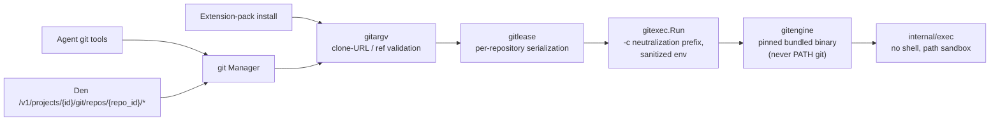

# Git

Structured repository tools over a bundled git toolchain, invoked through one hardened door. A repository is untrusted input: its config, hooks, and filters are neutralized on every call rather than trusted and audited afterwards.

**Machine truth:** [`internal/git`](../lycaon/internal/git) (tools + Manager) · [`internal/gitexec`](../lycaon/internal/gitexec) (the door) · [`internal/gitengine`](../lycaon/internal/gitengine) (toolchain resolution) · [`internal/gitargv`](../lycaon/internal/gitargv) (argv validation) · [`internal/gitlease`](../lycaon/internal/gitlease) (per-repository serialization) · [`internal/gitrepo`](../lycaon/internal/gitrepo) (repository discovery) · [`internal/gitstate`](../lycaon/internal/gitstate) (movement classification) · [`docs/openapi/paths/git.yaml`](openapi/paths/git.yaml) (`/v1/projects/{id}/git/*`)

**See also:** [Tools](tools.md#native-catalog) (native catalog and profile gating) · [Security](security.md#confinement) (the sandbox agent commands run in) · [Dependencies](dependencies.md#bundled-git-toolchain) (how the toolchain is pinned and verified) · [Authorization](authorization.md#approval-policy-and-leases) · [Extend](extend.md) (pack install, the other `gitargv` consumer)

---

## Tools

| Tool | Reversibility |
|------|---------------|
| `git_status` · `git_diff` · `git_log` · `git_show` · `git_blame` · `git_branches` · `git_ref` · `git_compare` · `git_stash_list` | Reversible: read-only |
| `git_commit` · `git_checkout` · `git_merge` · `git_stash` | Recoverable |
| `git_restore` | Recoverable: restores paths from the index or an explicitly selected revision, unrelated to the session timeline or [session recovery](session.md#session-recovery-rewind) |

Schemas live one file per tool under `lycaon/config/packs/painted-wolf/platform/tools/schemas/`; approval presentation is the `approval_reversibility` axis of the compiled contract in `native-tools.yaml`. There is no `git` passthrough tool: an agent that wants a git operation not on this list uses `command`, which is confined and approval-gated like any other.

## History and branch comparison

`git_log.ref` selects a branch, tag, commit, or a two/three-dot revision range; `path` is exclusively a repository-relative file filter. Each range endpoint is resolved to a commit identity before execution. History pages preserve empty arrays and return `next_offset` when more commits remain. `git_compare` returns both resolved tips, their ahead/behind counts and all merge bases, including an empty list for unrelated histories. `git_diff(base_ref, head_ref)` compares two committed trees without consulting the index or worktree.

## Reviewed local operations

`git_checkout` switches local branches and creates one only with `create: true`. `git_merge` supports ordinary, fast-forward-only and explicit merge-commit modes; its `continue` action stages only the named resolution paths and commits the active merge, while `abort` discards merge work only on explicit request. `git_stash` saves explicit paths, applies a selected object, or drops a selected entry. Saves scope both the working-tree and index snapshots to the requested paths; applying with `reinstate_index` restores their staging while preserving unrelated staged entries, and applying never drops the stash. `git_stash_list` pages stable object IDs beside their current reflog selectors. These mutations belong to addressed sessions; workers do not change shared Git state.

The manager rehearses the exact operation in an invocation-owned clone using shared objects, the current index, and local edits. It prepares before/after file and index evidence, including separate conflict stages, and asks the normal file-change reviewer before executing against the source repository. That includes case variants of `AGENTS.md`; instruction approval is never bypassed by a branch operation. The source repository lease is released for review, then reacquired while checking the original HEAD, index, configuration, refs, status and affected file identities; stale review is refused. The rehearsal is removed on every terminal path.

Results distinguish rehearsal failure from an attempted live effect: `attempted` means execution began, while `status` states its outcome. They carry before/after branch, commit, index identity, merge state, stash identity and conflict paths. A canceled or failed process still gets a bounded observation of the resulting repository; `after_observed: false` marks an unavailable final observation. Live effects invalidate Git projections even on failure. This is an effect attempt, not an atomic filesystem transaction: external processes can race the in-process lease and disk errors can leave partial effects. Conflicts are explicit outcomes, with the reviewed conflict files left available for resolution.

The number of changed files does not limit an operation; review previews keep a bounded byte budget and larger files keep only their content identity. Rehearsal materializes complete trees, so it is bounded by the byte and tree limits in [`operation_plan.go`](../lycaon/internal/git/operation_plan.go). Sparse checkouts, replacement refs/grafts, in-progress rebases/cherry-picks, affected LFS files and unsupported file kinds are refused before live mutation. Operations require the complete repository root; an attached subdirectory cannot authorize changes to its siblings. Rehearsal disables LFS smudging so it cannot download assets or materialize unbounded external content. Large result lists include totals and truncation flags; `git_status` supplies subsequent conflict pages.

## Status lists every file, and every file is reachable

`git status` runs with `--untracked-files=all`, so an untracked directory is listed one entry per file rather than collapsed to `dir/`. Every consumer addresses explicit file paths (`git_commit` stages by path, `GET /v1/projects/{id}/git/changes` pages by path, and the status cache invalidates by path), and a collapsed directory answers none of them.

`git_status` carries `files_total`, `files_truncated`, and `next_offset`. Page to the coverage the task requires; exhaustive tasks must continue until no cursor remains. [`toolhost.GitPageFiles`](../lycaon/internal/toolhost/git_tools.go) caps each inventory page at 80 files. `summary: true` returns counts and directory groups without file entries, with default group depth 1. `paths` selects an exact repository-relative file or directory subtree; counts describe the selection, while `dirty` and `recent_commits` describe the whole tree. Large pages use the shared screened spill and bounded projection, retaining totals, continuation, and a recovery pointer; a page above the spill cap is refused with the available narrowing arguments ([`tooloutput.ClassifyEmitReject`](../lycaon/internal/tooloutput/emit_reject.go)).

The response also carries the branch facts the manager already computes (`head_short`, `upstream`, `ahead`, `behind`) and, with `group_depth`, a rollup: `groups` counts files, staged, unstaged, and untracked entries under each prefix of that many leading path segments, largest first, bounded by the same page size. It answers "which areas changed, and how much" before any file is listed.

The command habit guard redirects the printing variants of `git status` (`--short`, `--porcelain[=v1|v2]`, `-z`, `--branch`, `--untracked-files[=all|normal]`, and pathspecs) to `git_status`, because they print the same facts the tool returns. Variants that change which facts are listed (`-uno`, `--ignored`, `--verbose`, `--show-stash`) are not equivalent and remain a `command` ([`gitStatusReplacement`](../lycaon/internal/tools/command_exact_equivalence.go)).

## Diff survey, detail, and recovery

`git_diff` pages files in Git order, returning per-file counts and hunks unless `stat` is set. `GitPageFiles` caps the selected files; `max_bytes` bounds the model's hunk view, defaulting to [`git.DefaultGitDiffPageBytes`](../lycaon/internal/git/manager.go). Use `stat: true` for a survey and `paths` for focused detail. Whole files fill the hunk budget in order; a first file larger than the budget is returned alone with `diff_truncated`, and `next_offset` continues files, not that file's hunks.

The producer returns the selected full hunks to the screening boundary before any clipping. The host retains that screened page at `wire_spill_path`; a clipped file's original text is also retained at `diff_spill_path`. Ordinary `read` offset/limit pages those captured hunks independently of later workspace edits, and `jq` can select bounded substrings of `.files[].diff` in the captured JSON page. Storage failure refuses partial delivery and preserves the operation's execution outcome.

The tracked half of a page is one `git diff` over the page's paths, split into per-file blocks at each `diff --git` header and matched to the `numstat` order ([`SplitDiffBlocks`](../lycaon/internal/git/tooljson.go)); a count mismatch between the two listings is a structured failure, not a guess. `base_ref` compares the worktree (or the index, with `staged`) against a commit, branch, or tag, validated as a ref and placed after `--end-of-options`. `untracked: true` appends untracked files under the same pathspecs as whole-file additions, each from `git diff --no-index` against `/dev/null`, with counts taken from the synthetic hunk.

The habit guard maps `git diff` operands the way git does: an operand that exists under the project root is a pathspec, and one that does not is a ref. A `..` range, `--no-index`, and unknown flags are not equivalent and stay a `command` ([`gitDiffReplacement`](../lycaon/internal/tools/command_exact_equivalence.go)).

## Git review in the walk

A Git movement is one walk step with a group preview ([files-live.md § Step through the run](files-live.md#step-through-the-run)). Its primary file list comes from immutable Git trees, separately from the working-tree effects the source ledger observed, so a normal commit shows the files it records even when committing changed no working bytes. The preview shows the full commit message, author and timestamps, copyable object ID, directory groups, and complete root-scoped file and line totals; file pages load on demand.

Git movements are durable history entries with their own session, turn, and invocation identity. Native commits and reviewed Git operations observe the repository before and after execution while holding its lease; the source observer shares a root-scoped lock so a watcher cannot consume that movement first. Failed or canceled attempts still record observed movements, while an unchanged HEAD creates no step. Commit receipts capture their object ID before releasing the lease. Walk selects file effects and Git movements by the same project, workspace, session or turn, then pages both on the source-history clock under a shared ordinal ceiling. A session's optional outside history includes only unaffiliated movements during its lifetime. Turn summaries count standalone Git steps; their item count continues to mean observed working files, so a commit-only turn offers Walk without a working-file diff action.

`GET /v1/projects/{id}/source/git-changes/{git_change_id}/review` resolves an observed movement owned by that project. Commits, amendments, merges, cherry-picks, reverts, and clones default to the destination commit versus its first parent; an initial commit compares with the empty tree. Other movements compare the recorded old and new tips, or show the destination commit when no old tip was recorded. The reader can choose either comparison and select a parent for a merge, so an amendment's complete commit and the change from its replaced tip remain distinct comparisons.

`GET /v1/projects/{id}/source/revisions?spec=...` reads one typed token in every attached root backed by Git (or only `root_id`) and answers the two commits it names in each root where it resolves, primary root first. A commit compares with its first parent, or the empty tree for a root commit. The checked-out branch compares its tip with its parent; any other local branch compares its merge base with HEAD against HEAD (`topic...HEAD`). `A..B` compares A with B, `A...B` their merge base with B, and an omitted side is HEAD. A branch is an exact `refs/heads/` name, never Git's ref search order, so `origin/main` or a tag reads as a commit. Text that resolves nowhere answers 200 with no comparisons; a token that starts with a dash or holds whitespace or control characters is rejected before Git runs, and every revision is peeled with `rev-parse --verify --end-of-options <rev>^{commit}`. `GET /source/revisions/review?root_id&before&after` pages the files between two full commit ids with the same rows as a movement review, and the `git_range` comparison selector reads one of those files, including the absent side of an addition or deletion. Nothing about either is recorded.

The sibling `/comparison?path=...` endpoint resolves an exact listed file, including both paths of a rename and the absent side of an addition or deletion. Both endpoints stay inside the attached root. Git's NUL-delimited records keep unusual paths intact, and attributes come from the destination tree. Mode changes, symlinks and submodule references remain visible. Oversized, binary or missing content is reported explicitly, while a successful empty comparison means the trees have no differences in that folder; missing Git objects never appear as zero files. Parent IDs come from the commit object, so a shallow boundary cannot masquerade as an initial commit.

**Caches.** The host shares file-history pages, commit metadata, complete comparison rows, and tree object reads by repository directory and resolved object IDs. Each cache retains at most 128 entries and 32 MiB, and entries over 4 MiB are not retained ([`immutable_cache.go`](../lycaon/internal/git/immutable_cache.go)); comparisons larger than the entry budget use bounded streaming page reads. Symbolic refs are resolved before lookup, so moving HEAD cannot reuse an old tree. Concurrent readers share acquisition; canceling one reader does not cancel another's, and when the last reader leaves, its acquisition is canceled and cannot publish a late entry. All four caches are process-local memory, released on backend restart, and not listed in Settings. File-history keys include the canonical invocation directory, repository and worktree metadata locations, full commit ID, literal path, and bounded page, so the walk uses that exact commit even if HEAD moves during acquisition. Successful empty pages are cached; failures, cancellations and timeouts are retried on the next request. Shallow repositories and grafted ancestry bypass history caching; replacement refs do not redirect recorded history. Retained-version matches and arrival attribution are joined afresh for every request, outside the Git cache. Structured `git file history` logs distinguish hits, misses, shared reads and bypasses; the caches do no background warming or repository indexing.

## Commit scope is authorship, not dirtiness

A successful explicit-path commit receipt confirms the commit hash and selected paths. It does not inventory the rest of the tree: omitted `uncommitted_paths` or `uncommitted_count` fields do not establish cleanliness. A final successful `git_status` supplies that observation; a failed status leaves it unverified.

`git_commit` accepts `amend: true` to replace the latest commit's message and incorporate the selected paths. It stages new files before amending and uses `--only` with those paths so unrelated staged changes remain in the index ([`manager_commit.go`](../lycaon/internal/git/manager_commit.go)). Empty tool paths retain session-authorship selection; the manager refuses an amendment without a resolved path list. The command habit guard redirects explicit-path `git commit --amend -m ... -- paths` and a preceding `git add` scoped within that list to the structured tool; unscoped amendments and unsupported flags remain commands. The commit skill limits routine amendments to the session's own latest, unpushed commit.

The command matcher removes catalog-declared defaults before comparing semantics, so explicitly passing a default-valued option or an empty environment does not suppress native redirects. Non-default runner effects with no native equivalent remain on the command boundary. Execution and evidence retain the original arguments. A native signing rejection is not permission to retry through a different tool or turn signing off.

A working tree is shared. Another session, a worker, or the user's editor may hold uncommitted changes in it, so "everything that differs from HEAD" is not a description of what this agent did.

Explicit commit paths may include `AGENTS.md` files and protected project overlays. The shared `ResolveGitStage` resolver (`tools/projectpaths`) records their existing bytes without editing project policy or recording a workspace file mutation; read access and the profile's commit path scope still apply. Editing `AGENTS.md` requires a fresh file-change approval.

`git_commit` with no `paths` therefore stages what **this session's work produced** on the active root: source operations the session's agent authored (`origin = 'agent'`) *plus* the drift its own commands were observed changing (an operation carrying a `command_window_id`), all on the trunk (`branch_id = ''`), intersected with what still differs from HEAD, in first-write order. A rename contributes both names, since staging only the new one would commit the copy without the removal.

The command window is why the second class belongs here even though its origin is `external`: a `Cargo.toml` edit without the lockfile a build regenerated is a broken commit, so a file the session's own command was observed changing stages with the edit that caused it ([files-live.md § Step through the run](files-live.md#step-through-the-run)). Authorship is the session's, not the tool's.

The rest of the dirty tree comes back as `uncommitted_paths` (a bounded sample) and `uncommitted_count`, so a commit reports the work it left rather than implying a clean tree. Authored paths that no longer differ from HEAD were committed earlier in the session and are dropped rather than staged as no-ops.

An explicit `paths` list is the caller's declared scope and skips authorship entirely; that is how a user's own edits get committed when they ask for it. When the session wrote nothing on this root, the host refuses with `Code: GIT_COMMIT_NO_SESSION_AUTHORSHIP` instead of guessing; a ledger that cannot answer takes the same branch, because unknown authorship is not permission to widen. The `DefaultGitCommitMaxPaths` cap (500) applies to the derived set as it does to an explicit one; exceeding it refuses with `Code: GIT_COMMIT_BULK_DENIED`, carrying the cap and the requested count so the agent narrows rather than retries.

Den's own git surfaces (a project's `/v1/projects/{id}/git/repos/…` routes and a chat's `/v1/sessions/{id}/git-worktree`) run through the same Manager and the same door; [`docs/openapi/paths/git.yaml`](openapi/paths/git.yaml) is the route list.

**Changed paths are paged off a cached status revision.** `GET /v1/projects/{id}/git/repos/{repo_id}/changes` never runs `status` on the request path. It pages the newest *cached* generation, and every page carries that generation's `revision` in its cursor. A repository with no generation yet answers `202` with `refreshing: true` and an empty page rather than blocking the caller behind a cold `status`; a generation that has published answers its own page even while a newer one loads behind it, with `refreshing: true`. A cursor whose `revision` no longer matches the cache is `409 cursor_generation_expired`, because the offsets it carries address a file list that no longer exists; the client restarts the listing rather than stitching two generations into one page.

## The single door

`gitexec` is the only way to invoke git. Callers never reach PATH git, and never build their own argv prefix.

**Toolchain resolution is bundled-or-fail.** [`gitengine`](../lycaon/internal/gitengine) resolves the pinned bundled binary with no `LookPath` and no system fallback; `LYCAON_GIT_BINARY` overrides only under `LYCAON_TEST=1`. A user's `git` on `PATH`, whatever version and config, is never what runs. Every invocation carries a timeout: `exec.DefaultGitTimeout` (two minutes) unless the operation declares its own, and clone declares ten.

**Every call carries a fixed neutralization prefix.** Command-line `-c` outranks every config file including repo-local `.git/config`, so a hostile repository's behavior keys go inert without the host ever writing to that file:

| Key | Set to | Why |
|-----|--------|-----|
| `core.hooksPath` | An empty host directory | Repo hooks are arbitrary code on ordinary operations |
| `core.fsmonitor` | `false` | Names a program to run |
| `core.pager` · `core.editor` · `core.askpass` | `cat` · `false` · empty | No interactive process spawns from a tool call |
| `core.attributesFile` · `core.excludesFile` | `/dev/null` | Host-side files must not change what the repo reports |
| `core.sshCommand` | The user's own global value, or `ssh -o BatchMode=yes` | Empty is not inert here; a repo-local value would be arbitrary code on every ssh transport op. BatchMode applies only to the default, because nobody can answer an ssh prompt from here; without it an unknown host key blocks on `/dev/tty` until the operation times out and then reports an empty message |
| `credential.helper` | Empty, then the resolved helper appended | The key is multi-valued and a repo-local entry would be tried first; empty resets the list |
| `protocol.ext.allow` · `protocol.file.allow` | `never` · `user` | `ext::` is command execution by design |
| `commit.gpgSign` · `tag.gpgSign` | `false` | A host-made commit does not silently claim a signature |
| `log.showSignature` · `merge.verifySignatures` | `false` | Verification is the read-side trigger for `gpg.program`, which has no safe empty value. The host never asks to verify, so signed history stays readable without running the program a repository names |
| `advice.detachedHead` | `false` | The one output-shaping key: a detached checkout otherwise emits a paragraph of human guidance into bytes the host reads as a result |

The table is in override order, which is load-bearing; `neutralizePrefixKeys` in [`neutralize.go`](../lycaon/internal/gitexec/neutralize.go) is the golden list the invariant test checks against.

**Three mechanisms, and which one a key gets.** An empty `-c` value makes git exec the empty string rather than disable a program, so keys whose value git runs cannot all be handled the same way:

| Mechanism | Applies when | Keys |
|-----------|--------------|------|
| Fixed `-c` prefix | The key has a safe value | The table above |
| Per-command flag | A flag disables the program and the key's subsection name is open | `diff.external`, `diff.<name>.command` and `diff.<name>.textconv`: disabled by `--no-ext-diff` **and** `--no-textconv` together, on every command that renders a diff |
| Refuse the repository | No flag disables it and the subsection name is open, so a fixed prefix cannot enumerate it | `core.gitProxy`, `filter.<name>.{clean,smudge,process}`, `merge.<name>.driver` ([`repoconfig.go`](../lycaon/internal/gitexec/repoconfig.go)) |

**`filter.lfs.*` is the one exemption, and it is exempt because the host defines it.** The audit carries a `HostDefined` name on the filter family and skips that subsection, because the prefix already pins `filter.lfs.{clean,smudge,process,required}` to the bundled `git-lfs` binary on every call. A repository declaring its own `filter.lfs.*` is overridden, which is the same outcome the other prefix keys get. See [Git LFS](#git-lfs).

Both diff flags are load-bearing: `--no-ext-diff` does not disable textconv, and `core.attributesFile=/dev/null` nulls only the *global* attributes file, so an in-tree `.gitattributes` still selects a driver. `mergetool.<name>.cmd` and `difftool.<name>.cmd` are deliberately not refused: only the interactive `git mergetool` / `git difftool` reach them and this host runs neither. Refusing a repository is a real cost, so it is spent only where the program would otherwise run on an ordinary read or merge.

**Caller refs are never options.** A ref that reaches argv in an option position is an unrestricted write: `git show --format=fuller --output=<path>` exits zero and truncates that path. Two independent guards apply: `validateGitRef` rejects an option-shaped value with a real error, and `gitargv.EndOfOptions` (`--end-of-options`) precedes the ref so a call site that forgot the check still cannot execute one. Commands taking a pathspec additionally carry `--`; `git checkout <branch> --` is what keeps a branch switch from silently restoring a path over uncommitted work. `git blame` rejects `--end-of-options`, so it relies on validation plus its own `--`.

The environment is separately sanitized so global and system config cannot reach the child.

**The refusal is about the repository, not the working directory.** Git finds a repository by walking up from wherever it runs, so an invocation in a subdirectory (one package of a monorepo attached as a project root) runs under the same `.git/config` as one at the top, filters included. The audit resolves the repository the same way ([`gitrepo.Discover`](../lycaon/internal/gitrepo)) before deciding anything, then asks `git config --local`, which uses git's own discovery. The verdict is cached against the content of every file that answer can come from (the common config and the per-worktree config), so two roots in one checkout share it, creating a config that was absent moves it, and a repository whose layout does not resolve is re-audited on every call.

**Identity is read, never written.** Nulling behavior keys would otherwise rewrite authorship, since `GIT_AUTHOR_*` outranks even a repository's own `user.email`. `ResolveIdentity` reads back the author the user's own git would use (repo-local `user.name`/`user.email` if set, else global), and both must resolve, because a half identity is not an identity. Nothing is written to any config file.

**A credential helper is appended only where credentials can be spent.** The prefix empties `credential.helper` for every call; a helper is appended back only under `ProfileNetwork`, the profile the transport-carrying operations declare. A local read has no remote to authenticate to, so it runs with an empty helper list and cannot reach the user's keychain at all. Which helper is resolved is a per-remote question: the host uses the remote URL the operation declared; when it declared none, the URL is derived from the operation's own argv, else the branch's upstream, else `origin`, and turned into a URL by `git remote get-url`. The host config then answers with the helper configured for *that* remote.

**macOS HTTPS credentials are self-contained.** A global `credential.helper=osxkeychain` is translated to the signed host binary's own Git credential-helper command ([`credential_helper.go`](../lycaon/internal/gitexec/credential_helper.go)), which reads and updates Internet Password items through Security.framework, so a clean Mac does not need Xcode Command Line Tools or a `git-credential-osxkeychain` executable. Other explicitly configured helpers remain the user's chosen commands and resolve on the account command PATH.

**Signing failures are typed, and read structurally.** With `gpgSign` pinned false and global config nulled, a signature is produced only when the invocation asks for one (a sign flag in the argv, or an `ExtraConfig` entry lifting the pinned key). That plus a signing program PATH cannot resolve (from `gpg.format` and the matching `gpg.*.program`) is the whole of `SigningUnsupportedError`; git's stderr is never classified.

Both of this section's refusals are agent-public codes: a repository whose config declares commands the host will not run is `Code: GIT_REPO_CONFIG_UNSAFE`, naming the offending keys, and an unavailable signing program is `Code: GIT_SIGNING_UNSUPPORTED`. A caller branches on the code, never on the message.

### Git LFS

A repository whose files are LFS pointers is unreadable without a filter: `git checkout` leaves small text pointers where the content should be, and every read tool downstream sees those pointers as the file. So LFS is not left to the repository to configure: **the host injects the filter itself**, appending `filter.lfs.{clean,smudge,process,required}` bound to the pinned bundled `git-lfs` binary immediately after the neutralization prefix on every invocation ([`lfs.go`](../lycaon/internal/gitexec/lfs.go)). That injection is what makes the `filter.lfs.*` exemption safe rather than a hole: command-line `-c` means the host's value is the one that runs whatever the repository declares.

**Bundled-or-absent, never PATH.** The helper resolves beside the pinned git binary through [`gitengine.LFSPath`](../lycaon/internal/gitengine) and is verified to exist and be executable. If it is missing, the four settings are not appended and git behaves as it would with no LFS installed; pointer files stay pointer files. There is no fallback to a `git-lfs` on the user's PATH, for the same reason there is no fallback to their `git`. Pinning and verification: [dependencies.md](dependencies.md#bundled-git-toolchain).

## Argv validation

[`gitargv`](../lycaon/internal/gitargv) is a dependency-free leaf, deliberately, because its two consumers sit on opposite sides of an import cycle: the git Manager behind `/v1/projects/{id}/git/repos/{repo_id}/*`, and extension-pack install, which hands git a URL taken straight off the wire.

- **`ValidateCloneURL`** rejects a URL git would parse as an option, and the remote-helper transports that turn a URL into command execution: `ext::sh -c …` runs the command; `fd::` reads a caller-controlled descriptor. Neither is reachable behind a `--` separator, because they are URL *schemes* rather than options.
- **`ValidateRefArg`** rejects a ref git would parse as an option. Empty is valid and means "the default branch"; callers requiring a ref check for emptiness themselves.
- **`LocalCloneSourcePath`** reports the on-disk path a clone or `ls-remote` source names, following git's own reading: `file://` and bare paths are local; another scheme, or the scp-like `[user@]host:path` form, is not. Callers use it to decide whether a fetch is racing this process's own writes ([Serialization](#serialization)).

One implementation means a newly discovered unsafe transport is blocked once rather than at whichever call site someone remembers.

## Serialization

[`gitlease`](../lycaon/internal/gitlease) orders git work against one repository inside this process. Git's index and ref locks stop two writers corrupting a repository; they do not stop a reader seeing half of a write.

| Work | Lease |
|------|-------|
| Mutating an existing repository | The canonical **git common directory**, so a linked worktree and the checkout it came from share one lease |
| `init`, and a clone destination | The **absolute path**, since no common directory exists yet |
| A clone or `ls-remote` from a local source | The **source repository**, taken before the destination |

A `file://` or bare-path source is an ordinary repository on this machine, and a fetch walks its refs and packs while the git Manager may be committing, checking out, or pruning in it, so extension-pack install and version resolution take that lease like any other caller. Remote sources take nothing.

Clone claims its destination with an exclusive directory create while holding the destination lease. Existing directories (even empty ones), files, and symlinks are refused. On failure, Git cleans its failed checkout and the manager removes only the empty directory it created; a replaced or populated destination is retained, with its path included in the failure, rather than recursively deleting bytes another writer may have created.

Landing a session worktree is one repository transaction ([`worktree_land.go`](../lycaon/internal/git/worktree_land.go)): validate the registered source checkout and expected branch, require both checkouts to be clean, verify the base is still on its expected branch, count commits, and merge under the same common-directory lease. The merge uses the validated source commit ID, not a branch name resolved later. State refusals are typed errors; conflicts are aborted and reported separately.

The lease is in-process. Cross-process exclusivity on the store is [`hostlock`](../lycaon/internal/hostlock)'s, and neither covers a repository the user also has open in a terminal.

## Worktree state is split

Some reads skip the subprocess and parse the `.git` layout in process: HEAD, the current branch, and divergence from an upstream, which board and status surfaces ask for on every refresh ([`fast_ref.go`](../lycaon/internal/git/fast_ref.go)). Those reads must respect git's own split, because a linked worktree keeps some state beside itself and shares the rest:

| State | Lives in |
|-------|----------|
| `HEAD`, `refs/bisect/*`, `refs/worktree/*`, `refs/rewritten/*` | The **worktree's** git directory (`<main>/.git/worktrees/<name>`) |
| `refs/heads/*`, `refs/remotes/*`, `refs/tags/*`, `packed-refs`, `config` | The **common** directory, shared by every worktree |

[`gitrepo.Discover`](../lycaon/internal/gitrepo) returns both, resolved through the worktree's `commondir` pointer; for an ordinary clone and for a submodule they are the same path. `resolveRef` chooses storage per ref rather than per call, since a per-worktree HEAD points at a shared branch, and it never consults `packed-refs` for a per-worktree ref, because only shared refs are ever packed. Divergence reads `branch.<name>.remote`/`.merge` from the shared config, and declines the fast path when a `config.worktree` exists: layering config is git's job, and the engine answers correctly at the cost of a subprocess.

## Under confinement

Native Git tools run through `internal/exec` as host launches, outside the command sandbox: no shell, argv validated by `gitargv`, the hermetic configuration above, and paths resolved inside attached roots. They are safe to run unsandboxed because they reach only the operations this document names. Git run through `command` is an ordinary confined command. Git over SSH authenticates through the agent socket, not a private key file: `~/.ssh` is read-denied to confined commands, while the credential stores a CLI authenticates with stay readable and write-denied ([security.md](security.md#credentials-the-agent-drives)). If a GUI launch did not inherit `SSH_AUTH_SOCK`, the host reads the default socket from the user's launchd environment and validates that it is an existing Unix socket before passing it to Git ([`agent_socket_darwin.go`](../lycaon/internal/gitexec/agent_socket_darwin.go)).

`git_restore` restores paths from the index or an explicitly selected revision. It does not consult prompt-boundary session checkpoints, and session recovery deliberately does not depend on a repository existing.
