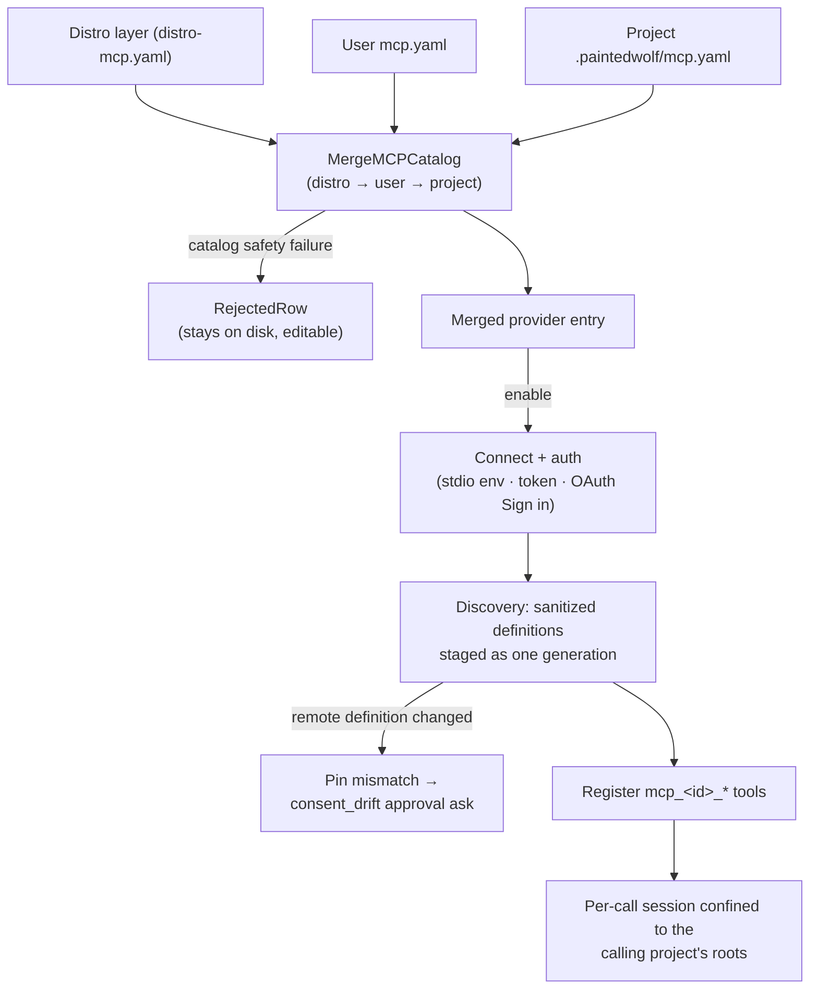

# MCP

Operator surface for Model Context Protocol **providers**: catalog layers, local versus web class, catalog safety gates, project scope, auth, tool-definition integrity, and the error contract that decides what the model sees and what the host retries.

**See also:** [Security](security.md) · [Tools](tools.md) · [Extend](extend.md) · [Agent contract](agent-contract.md) · [Agent tool feedback](agent-tool-feedback.md) · [Host contract](host-contract.md) · OpenAPI `docs/openapi/paths/mcp.yaml`

**Machine truth:** `lycaon/internal/mcp` · `config/packs/painted-wolf/platform/host/distro-mcp.yaml` (distro layer, empty by default) · `config/packs/painted-wolf/platform/host/mcp-recipes.yaml` (recipe catalog) · `{configdir}/mcp.yaml` · `{project}/.paintedwolf/mcp.yaml` · `{configdir}/mcp-tool-pins.yaml` · `{configdir}/credential-vault.age`

## Catalog and providers

An MCP **provider** is a configured instance, like an AI provider. A **recipe** is a catalog template. Project MCP applies when the project's device and project trust switches are both on.

### Provider class (host-derived)

The host projects `class` on every recipe and provider from transport facts; it is never an authored YAML field.

| Class | Fact | Typical add path |
|-------|------|------------------|
| `local` | stdio command, or HTTP to loopback (`127.0.0.1` / `::1` / `localhost`) | Local recipes, Custom local |
| `web` | remote HTTPS | Web recipes, Custom web |

Settings lists and the add picker group by that class (**Local** / **Web / hosted**). Project Settings shows Local only; its add picker offers credential-free loopback recipes and Custom local loopback HTTP.

### Catalog layers and safety gates

Overlays use top-level `providers:`. Merge order is **distro → user → project** (`MergeMCPCatalog`); later layers win field by field. New overlay ids with `enabled` omitted stay **disabled**.

| Gate | Rule |
|------|------|
| Project stdio | `command` / `args` on the project layer → `project_stdio_forbidden` |
| Project headers / token | Project HTTP secrets, or repointing a credential-bearing entry to loopback → `project_headers_forbidden` |
| Project remote | Non-loopback URL → `project_remote_forbidden` |
| Project enable | `enabled: true` on an inherited row that is stdio, non-loopback, or credential-bearing → `project_enable_forbidden`. A project may enable only what it could have declared itself; disabling is always allowed |
| User/distro remote | Non-loopback URL must be `https` (`remote_requires_https`) |
| URL shape | Host:port without a scheme is accepted: loopback → `http://`, anything else → `https://`. Unparseable values → `invalid_url` |
| Shape | `invalid_entry` / `duplicate_id` / `overlay_unknown_field` |
| Unreadable layer | A user or project `mcp.yaml` that will not parse → `unreadable_layer`; the layer is dropped and the app still starts |

The closed code set lives in `lycaon/internal/mcp/catalog.go` and doubles as the API error set: create/update/delete/oauth return the code on the HTTP error body, and list and check rows attach rendered `notice` copy from `host/user-notices/<code>.yaml`. Rejected rows surface on list and **Test connection** with `connection_source`, and `last_error` is the code. Sign-in failures use `mcp_oauth_failed`; an unwired host uses `mcp_oauth_unavailable`.

A rejected row stays on disk and stays editable: update and enable target rejected ids, and creating over a rejected id is still a collision.

Settings mutations are generation transactions. A per-target process lock plus advisory device lock covers duplicate checks and the complete read-modify-write; device changes publish the merged runtime generation before success is returned. A merge or publication failure restores the prior overlay and generation, and only a committed generation emits the Settings change notification.

### What a project layer can do

The catalog the agent surface reads, what registers as a host tool and what a call resolves against, is the **device** merge of distro and user layers. The project layer may only narrow it.

| Question | Answer |
|----------|--------|
| Can a project put a tool on an agent? | No. A project-declared provider is visible in that project's Settings and reachable by Test connection, and never becomes a callable host tool |
| Can a project turn a provider off for its own tree? | Yes. An approved project's `enabled: false` is honored for calls made from that project, and only from that project |
| Can a project turn a provider on? | Only one it could have declared: loopback and no static credentials |
| Which project's answer applies to a call? | The calling session's. Scope travels with the request; there is no registry-wide "current project" |

### Session scope and confinement roots

A local stdio provider is spawned **per project** and confined to that project's roots, never a union. The one host-initiated exception: tool discovery at sync time and a connection check with no project selected connect under the device scope with the device probe roots. That session only answers `tools/list`; every tool call runs in a session confined to the project that made it.

**A stdio server starts in a reduced environment.** It is third-party code the host executes, so it receives process plumbing only (path, home, temp, locale) and never the sidecar's ambient environment. The `env` map on the provider row is the one channel that gives a server a credential, and it is deny-by-default. Declared values still cross the standard injection filter, so an `env` map cannot hand a child a loader-hijack or shell-hook variable. The `@self` API token is host-minted and is the only value delivered past that filter.

Trust changes for a project drop that project's live MCP sessions. The project overlay is read fresh per call, and the pooled session carries a fingerprint of the effective connection: a changed inherited URL, command, arguments, environment, headers, credential wire, or recipe credential closes that session before the next invocation connects, including a file changed outside Settings.

### Enable and agent access

| Concept | Meaning |
|---------|---------|
| **Enable** | Connect, authenticate, discover, and register `mcp_<id>_*` tools |
| **Tool loading `auto`** | Defer tool definitions by default and load matching definitions with `request_tools` as needed |
| **Tool loading `always`** | Send this provider's definitions on every eligible model call |
| **Workflow `tools: all`** | Open-world agent access to every runtime-registered tool, including enabled MCP providers |
| **Workflow `tools: profile`** | Restricted access through the agent's explicit tool-profile allowlist |

Enablement is the operator grant that admits a provider's definitions into the runtime; open-world agents absorb them without another checkbox, restricted roles do not. Pack MCP requirements are refer-only and never enable MCP. Every invocation still crosses posture, approval, confinement, egress, project scope, and tool-definition integrity gates.

### Auth

| Transport | Secrets |
|-----------|---------|
| Stdio | `env` map only (no OAuth). The child starts from the reduced environment, so this map is the whole set of credentials it holds |
| HTTP | Optional `token` and headers; GET redacts to `token_present` / `headers_present`. `credential_wire` places the token: `bearer` (`Authorization: Bearer`), `token_token` (`Authorization: Token token=`), or `header` (named `credential_header`). Custom defaults to `bearer` |
| Remote HTTP | Recipe `auth` decides chrome. `static_token`: token field only. `oauth` or Custom web: **Sign in** (PKCE, PRM/AS discovery, dynamic client registration). If the authorization server will not register a client, Sign in fails with `mcp_oauth_registration_required` and the operator pastes a static token. Tokens live in the encrypted credential vault |

`@self` may inject `LYCAON_API_TOKEN` only for the distro self-mcp entry. Secrets are never echoed on GET or into transcripts.

**Sign-in flow.** Each authorization binds an ephemeral loopback listener (RFC 8252 §7.3: `http://127.0.0.1:<port>/mcp/oauth/callback`, any port). The host registers a public client when the authorization server advertises a `registration_endpoint`. The listener checks the issued `state` and completes the code exchange; manual code entry remains available when the server will not redirect to loopback. A pending authorization and its listener expire after 10 minutes.

**Provider status is read from machine facts**, never from error prose: `needs_auth` comes from the HTTP status the transport observed (401/403).

### Tool-definition integrity (remote providers)

A tool's description and schema annotations steer model tool selection, and its schema constraints define what the model may send. All arrive from the provider at discovery, before any per-call gate reads arguments, so a provider that presents one definition when you enable it and a different one later has changed what the agent does with nothing visible to you.

Discovery stages each provider's sanitized definitions, references, evidence declarations, status, and consent fingerprints together. An invalid provider contributes nothing to the next generation; the remaining validated generation is published as a complete set. Schemas that cannot encode as JSON are refused before fingerprints are recorded. Publication excludes in-flight invocations, so the definition the consent gate evaluated is the definition dispatched after any approval wait.

| Rule | Detail |
|------|--------|
| Scope | Remote HTTP providers only. A stdio provider is a program you launched and a loopback provider is one you are running; pinning either would fire on every rebuild of a provider you are developing |
| Pin | Name, display title, description, input schema, and `readOnlyHint`, hashed per tool and stored device-level in `mcp-tool-pins.yaml` (`0600`) beside `mcp.yaml` |
| Re-listed on change | A provider that sends `notifications/tools/list_changed` is re-listed and re-fingerprinted, so a mid-session revision produces the same one card a restart-time change would |
| First sight | Recorded silently. Enablement is the consent baseline; the pin notices a later change underneath it |
| On change | One approval ask on the `consent_drift` gate ([Authorization § Gates](authorization.md#gates)) at every posture, including Light. Ask-only: it never denies, never auto-approves, and never clears another gate's requirement |
| After approval | The new definition is pinned, so a legitimate version bump costs one card per changed tool |
| Durable failure | An unreadable or corrupt pin file, or a failed atomic replacement, never becomes a fresh consent baseline. Remote definitions stay unpublished, or an approved call returns `MCP_CONSENT_STATE_UNAVAILABLE`, until the device consent state can be read and committed |
| Invisible characters | Invisible formatting codepoints are stripped from the whole definition (description, display title, and every string in the input schema) before it reaches the model, the Settings tool browser, or the fingerprint. Property names are left alone: they are the wire names of arguments |
| Model authority | Provider projection data-marks the external description and non-constraint schema annotations as untrusted tool metadata; type, property, enum, and validation constraints remain byte-compatible with the peer. The universal host rule tells the model that tool metadata is data, not permission |
| Not covered | A first-run provider that is already malicious. The pin detects substitution, not initial intent |

### Result and error handling

| Concern | Behavior |
|---------|----------|
| Structured results | A tool that answers with `structuredContent` alone is rendered as JSON rather than reaching the model as an empty string |
| Binary / referenced content | Images, audio, embedded resources, and resource links are accounted for by kind, MIME type, and URI. The bytes stay out of the transcript; the model learns the content exists |
| Server-declared codes | Namespaced under `MCP_SERVER_`, so a peer cannot mint a host reject code |
| Peer-declared evidence kinds | Namespaced under `mcp_server_`: kind decides projection shape, transcript diet, and survey/mutation classification, so a peer naming a host kind lands beside it, not on top of it. Auto-derived kinds carry the namespace too. Each validated discovery generation replaces the complete declaration set |
| Provider unavailable | Repeated transport faults open the per-provider circuit breaker, which rejects with `MCP_TRANSPORT_UNAVAILABLE` |

### Protocol surface

Tools only. The client advertises roots and handles `tools/list_changed`; it does not advertise sampling or elicitation, so a peer cannot make the host run a model or prompt the user as a side effect of a tool call. Resources and prompts are not exposed.

### Operator recipes and journey

Known providers ship in `mcp-recipes.yaml` and appear on **Add provider**, grouped **Local** / **Web / hosted**. Auth is declared on the recipe, never inferred from the URL. `GET /v1/mcp/recipes` lists them; `POST /v1/mcp/providers` with `source: recipe` copies one into the user overlay disabled. Adding a YAML row is the whole catalog change; ids are not a wire enum. Optional `env_keys` name stdio env labels only, never values. Known remotes are device-only (`project_ok: false`).

The journey is **Add → auth (if needed) → enable → Test connection → tools browser / refresh**; enabled providers register `mcp_<id>_*` tools without a separate activation step ([Den](den.md) § Settings → MCP providers).

1. **Add a known provider**: Settings → MCP providers → Add provider → pick a recipe → fill the credential the recipe names (token, Sign in, or stdio env) → enable → Test connection.
2. **Add Custom local**: stdio command/args/env **or** loopback URL `http://127.0.0.1:…/mcp` → enable → Test connection. Prefer the user (device) layer for stdio; projects may only add loopback HTTP.
3. **Add Custom web**: user layer → remote `https://…` → static token (Bearer, `Token token=`, or a named header) if the host accepts one, else **Sign in**. If Sign in reports `mcp_oauth_registration_required`, paste the provider's static token with the matching placement.
4. **Project loopback override**: `.paintedwolf/mcp.yaml` may declare or enable a credential-free loopback HTTP row and may disable any row for its own tree. Stdio, non-loopback remotes, credentials, and enabling anything carrying those are rejected.
