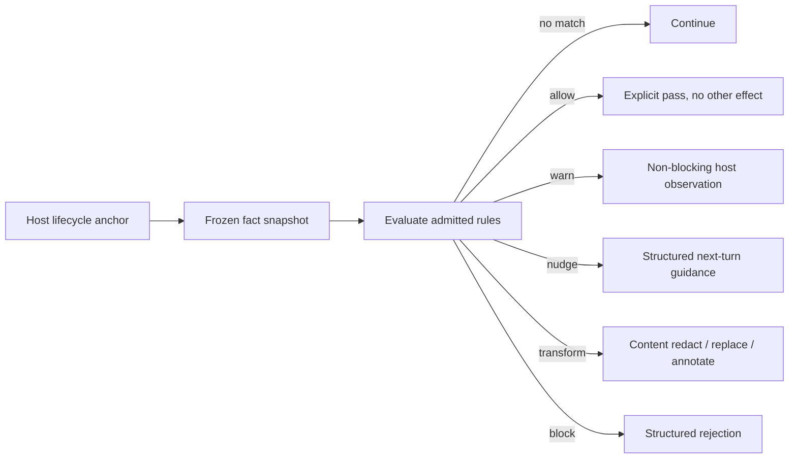

# Open Agent Rules

Open Agent Rules (OAR) is the typed observation-and-effect layer used for agent guidance and policy. Rules evaluate host facts at named lifecycle anchors and request a bounded host effect:

```text
typed host observation + declarative condition -> host effect channel
```

A rule does not execute code, parse transcript prose, grant capability, or mutate workflow state directly.

**See also:** [Agent tool feedback](agent-tool-feedback.md) · [Guidance conditions](guidance-conditions.md) · [Grounding](grounding.md) · [Agent contract](agent-contract.md) · [Authorization](authorization.md) · [Extend](extend.md)

**Machine truth:** [`schemas/oar/`](../schemas/oar) (vendored rule, capability, config, and fixture schemas plus conformance cases) · `lycaon/internal/oar/`, `oarcore/`, `oarcopy/` · pack `policy/` units under [`lycaon/config/packs/painted-wolf/`](../lycaon/config/packs/painted-wolf) · [anchor catalog](../lycaon/config/packs/painted-wolf/platform/host/anchors/catalog.yaml) and `host/bindings/` · spec: <https://openagentrules.org/spec/1.0/>

## Why rules are separate from host code

Policies such as when to nudge an agent to ground a claim, block an unsafe completion claim, or warn on a suspicious observation need to evolve as declarative content. Putting each case in control-flow code would mix facts, wording, timing, and enforcement. OAR separates them: host code observes and freezes facts; an anchor defines when evaluation is meaningful; a rule composes typed predicates; an effect maps to one host channel; a binding or template explains the result. The host stays authoritative because it supplies the facts and implements every effect.

## Runtime line



Evaluation is deterministic over an admitted rule set and frozen fact snapshot. Selected rules request typed observations lazily; provider failures follow the rule's `on_error` policy. Model classification is not part of condition evaluation.

## Rule kinds

`kind` is one of `schema`, `policy`, `invariant`, `detector`. Per the schema, it "fixes evaluation order and nothing else": evaluation runs schema, then policy, then invariant, then detector. Kind says *when among its peers* a rule is checked, not why it exists or what it may do.

| Kind | Evaluates | Typical use |
|---|---|---|
| `schema` | first | shape and argument validation before policy reasons about input |
| `policy` | second | ordinary conditional rules — the bulk of pack content |
| `invariant` | third | host-level guarantees that must hold regardless of policy outcome |
| `detector` | last | project an observation (via a registered `detector://` reference) for later rules or provenance, never a verdict |

An engine must not derive a threshold, weight, or decision from `kind`; that belongs in `when` and `effect`. Kind and effect are independent axes.

## Rule document

A rule identifies itself, selects one or more anchors, declares a typed condition, and names an effect with structured parameters. Human title and rationale explain the decision; stable ids and codes carry identity.

Rule identity is the document's `namespace` and `id`, independent of filenames and package names. Duplicate identities across contributing packs are load errors, and configuration cannot disable or downgrade a rule whose `mandatory` is true ([OAR-CFG-5]). Structured rejection codes are agent-public: a retired meaning is never reused, and deprecation names its successor.

Unknown behavioral fields, facts, values, effects, or parameters fail validation. Optional explanatory metadata may remain additive where the schema explicitly permits it (`x-` extensions).

## Anchors and bindings

An anchor names a host lifecycle observation: tool pre-invoke, tool post-invoke, coordinator turn closeout, phase exit, worker finalize, authorization decision. Anchors are the timing source for both guards and informational prompt injection: host code emits one anchor with typed facts, and bindings select templates for matched informational effects, so a policy check and its explanation cannot drift onto different moments.

The specification fixes eight core anchor ids; the capability document maps each to a local catalog anchor ([`capability_document.go`](../lycaon/internal/oar/capability_document.go)). Rules authored against core anchors are the portable subset.

| Catalog anchor | Runs | Notes |
|---|---|---|
| `tool.pre_invoke` | before a tool call is dispatched | core; scope with `selector.tool` |
| `session.pre_invoke` | before a prompt-loop tool call, with session posture, tool identity, and arguments observable | precedes coordinator-specific observations and the executor's core tool boundaries |
| `tool.handler` | after shared argument validation, before dispatch to the tool implementation | core |
| `tool.rejected` | when an intrinsic typed tool failure is raised, before its feedback is delivered | does not replay pre-invocation rules or undo effects of a completed call; publishes `paintedwolf.rejection_code` |
| `tool.post_invoke` | on the complete result, successful or failed, before logging and delivery | core; a block withholds the original result; a transform replaces it and clears parallel captures |
| `credential.assignment` | on one literal credential assignment observed on a completed tool call | measurements, harvest membership, device HMAC fingerprint |
| `coordinator.post_turn` | on the assembled final prose once, before turn completion | implements core `agent.post_turn` |
| `coordinator.closeout_check` | on a provisional closeout claim | a block requests repair; provisional checks cannot multiply a portable rule's counters |
| `worker.finalize` | on the complete parent envelope before the worker card or digest is stored | implements core `agent.finalize`; a block delivers policy feedback with a partial status and withholds the report, proof, and grounding details |
| `worker.report_check` | on a provisional worker report | can request repair before final delivery; not the portable finalization boundary |
| `content.input` / `content.output` / `content.tool_result` | content-safety boundaries | core `model.input` / `model.output` / `model.tool_result` |

Model response prose is buffered until `content.output` resolves. Live progress contains metadata; the final policy result controls transcript persistence, replay, and returned prose.

Non-blocking advisories queue the engine's frozen copy and structured identity; they do not require the rule to exist in the stock presentation registry.

Rules may subscribe only to anchors whose fact environment satisfies their condition. The validator catches impossible references before the pack becomes effective.

## Fact discipline

Facts describe observations, not conclusions the rule wishes were true. Good facts: the tool name and structured arguments the host admitted; whether the executor applied confinement; active workflow phase and open gate ids; evidence receipt counts and types; worker state from the coordination ledger; provider readiness from the model catalog; a structured MCP error code from an admitted binding. Bad facts: “the user probably wants deployment” inferred from chat; “the change is safe” because no keyword matched; “the agent researched enough” because it said so; “the destination was observed” when it was only declared.

Facts use neutral polarity. Prefer `verification_receipt_count = 0` over `agent_failed_to_verify = true`. The rule defines the policy interpretation and can combine the observation with phase, tool availability, and explicit exemptions, so a new policy does not need a new host boolean for every conclusion.

Intrinsic tool failures publish `paintedwolf.rejection_code` at `tool.rejected`; stock denial policies test that identity where a shared `policy_denied` flag would be ambiguous. Diagnostic `reason` and `field` values publish the standard argument-validation facts without replacing canonical tool or MCP identity. Session `principal` is the authenticated person, falling back to the stored session owner; `principal_roles` comes from the authenticated caller; `permission_profile` is the effective tool profile. Worker finalization resolves stored session facts only when a rule references them.

## Fact catalogue

The fact catalogue is closed and generated from the host's registered observation environment ([`catalogue.go`](../lycaon/internal/oar/catalogue.go)), grouped by anchor and tier:

| Tier | Meaning |
|---|---|
| Frozen scalar/collection | value captured for this evaluation and safe for declarative composition |
| Parameterized observation | bounded host function over a declared argument, such as “receipt of this type exists” |

Parameterized observations are not arbitrary callbacks. Their names, argument types, cost, and result types are part of the closed environment. Evaluation cannot read the filesystem, network, database, or transcript beyond facts already captured for the anchor. Exact names and operators: [Guidance conditions](guidance-conditions.md).

## Conditions

Conditions compose typed facts with equality, membership, ordering where defined, boolean operators, the string builtins `starts_with`, `ends_with`, and `contains`, and bounded collection/observation functions. Absent observations take their declared typed zero. Unknown names and static type mismatches are load errors. Invalid runtime provider values, overflow, division by zero, and out-of-range indexing raise evaluation errors handled as the standard defines.

There are no regular-expression operators, and chat or transcript prose is not a fact. Text matching is allowed only on sanctioned event sources such as detection-pack command fields, outside this core fact floor.

## Effects and channels

`effect` is one of `block`, `warn`, `nudge`, `allow`, `transform`:

| Effect | Channel |
|---|---|
| Block | return a structured rejection from the transition being guarded |
| Warn | record and surface a non-blocking host observation |
| Nudge | queue structured user-role guidance for the next coordinator turn |
| Allow | record an explicit pass; contributes no decision and cannot override another rule's block, warn, or nudge |
| Transform | apply a declared content mutation (redact, replace, or annotate) rather than accept or refuse outright |

Across the shipped `painted-wolf` packs only `block`, `warn`, and `nudge` are in use; `allow` and `transform` are valid, schema-defined effects no shipped rule uses.

There is no `ask` effect. Nothing wires an OAR effect into the human-approval/checkpoint subsystem (`internal/approvals`, `internal/authzcontext`); a rule that wants a human decision expresses it as `block` with a remedy the human can act on, or `nudge`.

`inform` is a **binding**-side effect, not a rule one. The shared Anchor Binding grammar ([`anchor-binding.schema.json`](../schemas/anchor-binding.schema.json)) freezes `inform | block | transform` as the bus classes; `warn`, `nudge`, and `allow` are refinements of the block class, which is how `oar.schema.json` `$ref`s the grammar without forking it. The bundled inform bindings under `platform/host/bindings/` declare `effect: inform` with a `render:` template stem; that is the [anchors-and-bindings](#anchors-and-bindings) path for informational prompt injection. No rule document may say `inform`.

Rule kind does not restrict effect. The host delivers transforms only at `tool.post_invoke`, `content.output`, `content.tool_result`, and `credential.assignment`, and rejects them elsewhere ([OAR-PROF-10], [`host.go`](../lycaon/internal/oar/host.go)): model input holds messages with separate roles and provenance, so a transformed concatenation would change their authority. Rule parameters can narrow copy and scope but cannot select arbitrary code or bypass the effect operation.

Multiple matching advisories are delivered in evaluation order. A rejection envelope carries one primary stable code while retaining the full matched decision set for diagnostics and audit.

## Stateful effects

Rules are pure. The engine or responsible subsystem stores counters, deduplication, leases, retry ceilings, and “already shown” state.

Each occurrence reads a snapshot of rule counters. Firing enforce rules request counter increments or resets through `on_fire`, which writes the core fact `fire_count`; monitored, suppressed, nonmatching, and errored rules do not apply those actions. Host retry observations are separate from `fire_count`.

`WEAK_CREDENTIAL_LITERAL` and `CREDENTIAL_LITERAL` own the credential advisory thresholds and use `counter_scope: paintedwolf.credential_fingerprint` with `fire_count == 0` to warn once per credential per OAR session. Harvest membership is checked against the root session. The host carries no separate warning latch.

## MCP facts (generic)

MCP payloads vary by provider, so device-only bindings project registered call/result fields into a small generic fact set: provider and tool identity, call success, declared structured error code, bounded subject or category, resource identity from a typed field, and readiness of a named MCP requirement.

Bindings read fields, not prose. An error code must come from the declared error structure; success comes from the protocol result. The binding schema validates paths and value vocabularies before admission. These facts support policy composition without embedding provider payload schemas in the rule engine; they do not make the tool available, grant it permission, or claim an external effect the host did not observe.

## Content-safety surface

Inbound content safety uses explicit authority and provenance facts. A rule may observe that content came from a tool, repository, attachment, or remote response and ask for the host's bounded handling effect. It cannot scan the content to decide whether it “looks like instructions.”

Outbound secret protection uses host secret evidence and typed redaction/exfiltration facts. Detector rules can add provenance such as credential minting, but the security subsystem performs screening and approval.

## Pack composition

OAR documents are extension units. Inventory derives identity from each document's namespace and id. Before resolved selection can hide a document, duplicate identities and mandatory disabling are rejected. The production loader validates every admitted document against the capability environment and links cross-pack references. The immutable rule set is bound to the contribution frame revision.

Project policy is repository-controlled capability content. Once its exact content is approved, enabled tighten-only policy applies within the allowed project effect ceiling. It cannot define new facts, anchors, effects, or device authority, and an edit invalidates the approved stamp before the new rules can apply.

## Authoring

1. Identify the host transition responsible for the desired behavior.
2. Choose an existing anchor whose frozen facts prove the condition.
3. Express observations neutrally and compose the policy in `when`.
4. Choose the narrowest legal effect and stable code.
5. Put explanatory sentences in catalog templates, not Go.
6. Add positive, negative, and near-miss scenarios.
7. Run rule validation and render the matched guidance.

If the required observation does not exist, add one host fact at the enforcement boundary. Do not approximate it with a keyword, filename, command name, or model claim.

## Conformance

Conformance covers three layers: schema (document identity, fields, types, kind/effect compatibility); environment (anchor, fact, parameterized observation, and binding validity); scenarios (expected matches, non-matches, effect ordering, structured outputs). The vendored cases live in [`schemas/oar/conformance/`](../schemas/oar/conformance) and run through [`cmd/oar-conformance`](../lycaon/cmd/oar-conformance). Repository and extension validation use the production loader and evaluator. Unsupported content is attributed and held out, never silently ignored.

## Invariants

- Rules observe host facts and request bounded effects.
- Conditions are pure; observation providers and declared side effects have explicit error handling.
- Prose is rendered from catalogs and never parsed back into policy.
- State belongs to the engine or domain subsystem, not the rule.
- MCP bindings project typed fields and grant nothing.
- Project rules cannot widen device authority.
- Stable codes and ids carry meaning; display copy does not.
