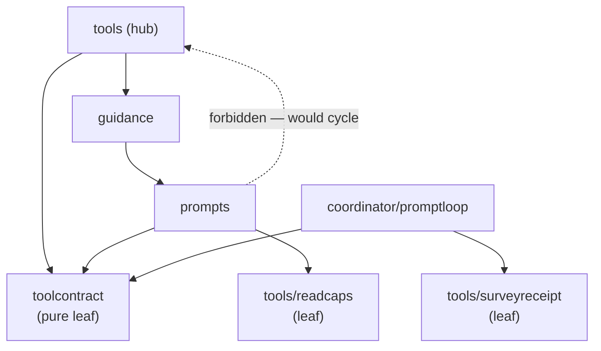

# Package layering

Domain packages in `lycaon/internal/` import **down** the stack; cycles are prevented by **layering and pure leaves**, not by minting another one-off `*err` / mirrored-constant package. Hubs never import sideways through each other for shared facts. This page is the SSOT for edges and leaf policy; [`TestImportGraphLayering`](../lycaon/test/contract/host/import_graph_layering_contract_test.go) enforces the forbidden edges.

**See also:** [Architecture](architecture.md) · [Docs map](README.md)

## Target layers

```text
pkg/api                         # wire DTOs only — no internal/ imports
internal/<policy leaves>        # pure constants/types; import nothing from hubs
internal/db                     # SQL adapter (*sql.DB); no search/session/domain back-imports
internal/<adapters>             # search, project paths, filesystem — may use db; not imported by db
internal/<domain hubs>          # tools, guidance, prompts, toolpolicy, workflow, coordinator/*, …
internal/session                # application orchestration (ports for peers; freeze growth)
internal/app                    # composition root — only place that wires hubs together
internal/api                    # HTTP transport — imported by app (not by domain)
```

Headline: `db` is true bottom → `search` may use `db` → `session` stays thin-port → `tools`, `guidance`, `prompts`, and `coordinator` share a **pure compiled tool-contract leaf** → `api` consumes downward only.

## Composition root

[`internal/app`](../lycaon/internal/app/doc.go) is the serve composition root: `Build` wires hub↔hub in topical `build_*.go` files. Domain packages must not reach into `internal/api` or peer hubs to “just get a type.”

### HTTP route families

[`build_server.go`](../lycaon/internal/app/build_server.go) fills one [`api.Dependencies`](../lycaon/internal/api/server.go) and calls `api.NewServer`. `NewServer` gives each route family a `Deps` struct holding only the fields it uses, then drops `Dependencies`. A family never receives the whole `Server`, and nothing copies dependencies in later through setters. When one family calls another, it holds a pointer to that family's handler inside the `Server`.

| Package | Serves |
|---------|--------|
| [`internal/api`](../lycaon/internal/api) | Router, middleware, auth, SSE, health, recovery, search, and the route table built from generated operations |
| [`api/sessionadmin`](../lycaon/internal/api/sessionadmin) · [`promptadmin`](../lycaon/internal/api/promptadmin) | Session lifecycle, navigation, export, rewind · prompts, queue, attachments, compaction |
| [`api/projectadmin`](../lycaon/internal/api/projectadmin) · [`sourceapi`](../lycaon/internal/api/sourceapi) · [`gitadmin`](../lycaon/internal/api/gitadmin) | Projects, roots, trust, removal, promotion · source views, editor documents, comparisons, history, briefings · git status, mutations, worktrees |
| [`api/workflowadmin`](../lycaon/internal/api/workflowadmin) · [`scanadmin`](../lycaon/internal/api/scanadmin) | Workflows, blueprints, run reports · scans, scanners, detection packs |
| [`api/settingsadmin`](../lycaon/internal/api/settingsadmin) · [`capabilityadmin`](../lycaon/internal/api/capabilityadmin) · [`extensionadmin`](../lycaon/internal/api/extensionadmin) | Settings, pricing, power · approvals, checkpoints, grants · extensions and contributions |
| [`api/modeladmin`](../lycaon/internal/api/modeladmin) · [`mcpadmin`](../lycaon/internal/api/mcpadmin) · [`researchadmin`](../lycaon/internal/api/researchadmin) · [`historyadmin`](../lycaon/internal/api/historyadmin) | Providers and model policy · MCP providers · web research · history retention |
| [`api/httpio`](../lycaon/internal/api/httpio) · [`requestscope`](../lycaon/internal/api/requestscope) · [`taskgroup`](../lycaon/internal/api/taskgroup) | Shared request and response contracts · the caller, project, session, and settings a request addresses · background work that drains on shutdown |
| [`api/sessionview`](../lycaon/internal/api/sessionview) · [`projectview`](../lycaon/internal/api/projectview) · [`secretview`](../lycaon/internal/api/secretview) | Session projections · project and settings change events · managed-secret wire metadata and screens |

Route families import the shared helper packages, never `internal/api`.

## Leaf-mint policy

Mint a new `internal/foo` leaf **only** when:

1. **≥2 hubs** need the same pure fact, and
2. **Neither hub may import the other**, and
3. The fact has **no existing pure authority**.

Prefer expanding an existing **pure** leaf over inventing `*err` / `*types` packages for one consumer. Never treat a hub (`toolpolicy`, `tools`, `session`, `guidance`, `prompts`) as a leaf expand-target.

## Triangle (tools ↔ guidance ↔ prompts)

Import direction forbids `prompts` → `tools` hub (cycle via `guidance`). Shared **policy facts** therefore live in pure leaves both sides can import:

| Fact | Leaf | Callers |
|------|------|---------|
| Compiled invocation facts | [`internal/toolcontract`](../lycaon/internal/toolcontract) (`Lookup`, `BatchGroupableCalls`; owner, reversibility, batch, turn order, lifecycle, evidence, recovery, execution capabilities) | `tools`, `coordinator/promptloop`, `prompts`, `invocation` |
| Authored-content tools (`MutatesContent`) | [`internal/toolcontract`](../lycaon/internal/toolcontract), compiled from the catalog's `mutates_content` axis | `tools`, `conditions`, `secretmint` |
| Multi-root participation (`MultiRootOf`) | [`internal/toolcontract`](../lycaon/internal/toolcontract), compiled from the catalog's `multi_root` axis. Returns whether anyone declared a capability, so an unlisted tool is *unclassified* rather than `none` | prompt disclosure, worker-branch catalog, contract probes |
| Read pagination caps | [`tools/readcaps`](../lycaon/internal/tools/readcaps) | `prompts`, `llm/compaction`, `spawn`, `coordinator/promptloop`, `tools/native` (+ `survey`, `sourceview`) |
| Survey receipt shape / clamp | [`tools/surveyreceipt`](../lycaon/internal/tools/surveyreceipt) | `coordinator/promptloop`, `session/workercompletion`, `tools/native` (+ `survey`, `sourceview`, `terminal`, `toolkit`), `tools/safecmd` |

`summarize` declares `same_tool` batching and `late` order; `wait` declares `terminal` order. The executor groups and orders from that generation, not tool-name conditions. Contract: [`TestPromptsUseCompiledToolContracts`](../lycaon/test/contract/tools/toolcontract_leaf_contract_test.go).

`tools` ↔ `conditions` is a second cycle with the same shape — `tools` → `guidance` → `conditions` — and the same resolution. The `tools` hub and the `tool_is_write` rule condition both read `toolcontract.MutatesContent`. Contract: [`TestContentMutationFactHasOneSource`](../lycaon/test/contract/tools/tool_content_axis_contract_test.go).

Arrows are import direction:



[`internal/invocation`](../lycaon/internal/invocation) is the durable adapter for the same contract generation. It hashes structured arguments, writes and settles receipts through generated `db` queries, and projects wire DTOs. `tools` maintains the immutable runtime definition and invocation envelope; `coordinator/promptloop` coordinates dispatch and settlement timing; operation subsystems retain their existing transaction, journal, or job boundaries.

Do **not** mint another tool classification map under `prompts/`, `tools/`, or `toolpolicy`; add a catalog axis and compile it into `toolcontract`.

### Pure leaves under `internal/`

| Leaf | Holds |
|------|-------|
| [`tools/readcaps`](../lycaon/internal/tools/readcaps) | Read pagination constants; nested under `tools/` without pulling the hub |
| [`tools/surveyreceipt`](../lycaon/internal/tools/surveyreceipt) | Survey receipt types and clamp |
| [`tools/argdiag`](../lycaon/internal/tools/argdiag) | Argument diagnosis against a tool schema: misplaced members, JSON text, the repaired call, and schema outlines |
| [`toolscope`](../lycaon/internal/toolscope) | Root-scope tool guards read from the catalog: the structural-file threshold, and `NoFolderAllowlist`, which decides both what a coordinator surface offers at zero roots and what the `no_folder` posture rule denies. One list, because hiding a tool and refusing it are one policy |
| [`fspath`](../lycaon/internal/fspath) | One spelling per file: `CanonicalPath` reduces every name the operating system accepts for a location to the one the kernel gives it, so a floor that compares paths is comparing files. On macOS that settles symlinks, the `/System/Volumes/Data` firmlink, and case on an insensitive volume through `F_GETPATH` on the deepest existing ancestor; a relative name stays relative. `confine` and `settingsoverlay` both need it and `confine` already imports `settingsoverlay`, so it is a leaf rather than a function on either. Its sibling `fsname` answers the same question for a basename and stays pure; this one has to ask the filesystem |
| [`fssync`](../lycaon/internal/fssync) | The one flush to stable storage behind every durable write: the door, the database snapshot, backups, and the content stores call `fssync.File` after their bytes land. `db` may not import `fseffect`, so the policy sits below both. Test support relaxes it for the whole test binary, because a unit test never proves power-loss durability and one macOS full flush costs several milliseconds per file |
| [`protectedpath`](../lycaon/internal/protectedpath) | Governance-file leaf identity and recursive profile regexes; imported by path resolution, confinement, and mutation guards so protected names cannot drift |
| [`enginepaths`](../lycaon/internal/enginepaths) | SSOT for the directory layout under the engine config/state root — `drafts`, `source-content`, `worker-branches`, `worker-baselines`, `worker-seeds`, `session-worktrees`, `session-checkpoints`, `scratch`, `ssh`, `upgrade-recovery`, `browser-cache`, `modelfeed`, `fetch-cache`, `pricing-cache`, `extensions`, `extensions-meta`, `repo-orientation`, `cache/sourcecatalog` and their join helpers, plus `AgentWorkspaceRootsUnder` (the set a confined command must be able to reach). `worker-seeds` is rebuildable host-only state and is absent from that set; `scratch` is absent because each invocation's boundary grants only its own session's folder; `session-checkpoints` is absent because it holds pre-turn copies of the user's files, and the config root's read denial keeps a confined command out of them |
| [`sourceblob`](../lycaon/internal/sourceblob) | The engine's one content-addressed store for source bytes — zstd objects named by digest, `PutFile` streaming a worktree file through hash and compression in a single read. Filesystem only: it imports the durable-write door (`fseffect`), the shared zstd codec (`zstdcodec`), cancelable stream copying (`contextio`), `fspath`, and `hostlock`, and nothing that knows about sources or sessions. The SQL index in `source_blob_objects` is written by whichever transaction writes the rows referencing an object, which lets `sourcesnapshot` and `sourceledger` both address it without either importing the other |
| [`storageusage`](../lycaon/internal/storageusage) | Retained-byte lane values and report combination shared by source history, visual artifacts, prompt attachments, and the API projection |
| [`gitrepo`](../lycaon/internal/gitrepo) | Which repository a directory belongs to, from path facts only: the upward walk to a `.git` entry, the git and common directories behind a worktree or submodule pointer, and the one canonical spelling of a directory. Stdlib only, imported by `git`, `gitexec`, `sandbox`, `repomap`, `sourcecatalog`, `repochange`, `sourceledger`, `sourcesnapshot`, `app` and others that may not import one another. Deliberately not a claim about what git will do — it walks past filesystem boundaries git stops at, so a hit means *ask git*, never *git agrees* |
| [`gitstate`](../lycaon/internal/gitstate) | Classifies observed git positions and ref movements into source-history transitions from git's own records — HEAD, branch, and the reflog's fixed `action: detail` subjects — never user prose. Pure (stdlib plus `pkg/api` for the wire kind enum): `sourceledger` consumes it through its `GitStateReader` interface, and the live reader adapter lives in `app` |
| [`runeclamp`](../lycaon/internal/runeclamp) | Cutting display text, with one elision marker repo-wide. Rune budgets: `Clamp` puts the marker past the budget, `Fit` keeps it inside. Byte budgets take `ClampBytes` / `ClampBytesTail` / `ClampBytesMiddle`, which cut on a rune boundary. A cut landing after a space trims it, so the marker never floats away from the text it elides. Text matched verbatim later — a citation excerpt, a grounding body — clamps locally. Contract: [`TestElisionMarkersComeFromSingleSource`](../lycaon/test/contract/frontend/text_clamp_single_source_contract_test.go) |
| [`hostmarker`](../lycaon/internal/hostmarker) | The literals and grammars the host writes into transcript text and later reads back: the compaction banner, the verbatim head/tail excerpt head, the guidance-block prefix, `Rejected:` / `Code:`, and the numbered line every file-reading tool renders (`FormatNumberedLines` / `ParseNumberedLine` / `NumberedLineAt`). Matching one reads machine state the host wrote, not prose. Writer and reader sit on opposite sides of the graph (`llm` writes the compaction banner; `evidence`, below `guidance`, reads it; `tools/native/survey` and `summarize` write numbered lines that `evidence`, `summarize`, and `tools/surveyreceipt` read back), and Den renders the same text, so [`cmd/codegen-host-markers`](../lycaon/cmd/codegen-host-markers) projects this list plus the worker leg-status set into `lycaon-den/src/chat/host-markers.generated.ts`. Stdlib-only. Contract: [`TestHostMarkersHaveOneSpelling`](../lycaon/test/contract/frontend/host_marker_one_spelling_contract_test.go) |
| [`isolation`](../lycaon/internal/isolation) | Closed agent-isolation outcome codes and their retry, human-decision, or control-plane disposition. Pure so confinement, tool execution, receipt settlement, and contract tests read one vocabulary without turning isolation into a subsystem owner |
| [`litprefilter`](../lycaon/internal/litprefilter) | The literal a regex must contain, and a fold-aware substring test for it. `tools/native/survey` prefilters `grep`; `search` and `sourcecatalog` prefilter project search — none may import another, and a file the prefilter drops is a result the caller never sees |
| [`tokenest`](../lycaon/internal/tokenest) | The host's size proxy for untokenized text. One formula, because the numbers are compared: compaction measures a transcript, summarize measures a pack against a budget, and a file briefing sizes its own header against the budget it then hands to summarize |
| [`dotversion`](../lycaon/internal/dotversion) | Dotted numeric version compare. Numeric on purpose — a lexical compare ranks "9.0" above "13.0", which is the bug both the macOS floor probe and the bundle minimum-OS check exist to catch |
| [`timelinearchive`](../lycaon/internal/timelinearchive) | The recorded-timeline archive format: manifest, frame files, summary types, and the poster. `browser` writes it and `llm/providerwire` reads its poster for perception; neither may import the other. Standard library only |
| [`contactsheet`](../lycaon/internal/contactsheet) | Lays frames out as one labeled sheet within an edge budget, and the one clock label a sheet cell and the prose citing it share. `browser` composes timeline and video sheets; `promptattach` cites a video sheet's frame times without importing `browser`. Imports only `fonts` |
| [`idset`](../lycaon/internal/idset) | Deduplicated, sorted union over identifier slices, so two results compare as sets rather than insertion orders |
| [`configdir`](../lycaon/internal/configdir) · [`timelayout`](../lycaon/internal/timelayout) · [`toolcontract`](../lycaon/internal/toolcontract) · [`workercompletionxml`](../lycaon/internal/workercompletionxml) · [`promptattach/attacherr`](../lycaon/internal/promptattach/attacherr) | Config-dir resolution and `EnvTruthy`, the one spelling of an enabled environment flag (contract: [`TestEnvTruthyHasOneSpelling`](../lycaon/test/contract/host/env_truthy_one_spelling_contract_test.go)) · store timestamp layout · compiled invocation facts · worker completion XML · attachment errors |

### Catalog runtime kernel

Catalog-backed domains share mechanics, not meaning. [`internal/catalogruntime`](../lycaon/internal/catalogruntime) supplies transactional catalog layers in stable source order, concurrency-safe stable-id registries, explicit kind factories with a declared fallback, and generation-safe stale-while-revalidate snapshots. AI providers, pricing sources, web-research providers, scanner definitions, and host resources define their domain schemas, validation, merge policy, diagnostics, cloning of reference-valued spec fields, readiness, authority, and wire projection.

The kernel never defines “active.” Each domain applies its own cardinality after assembly:

| Domain | Effective cardinality and selection rule |
|--------|------------------------------------------|
| Pricing sources | Multiple feeds may be enabled and refreshed in priority order. Exactly one source wins each estimate: live discovery first, otherwise the first enabled feed with a usable rate. Rates are never combined or averaged. |
| Security scanners | Many scanner definitions may be installed, but exactly one scanner is enabled in each permanent slot: SAST, SCA, and Secrets. Selecting a scanner atomically replaces that slot's previous occupant. |
| AI providers | Any number of provider instances may coexist. Model policy assigns provider-and-model pairs to coordinator, lite, and agent-pool roles; there is no globally exclusive active provider. |
| Web-research providers | Multiple providers may participate at once according to domain-defined search roles, channel support, and pacing. |
| Host resources | Any number of resources may be simultaneously available. Availability, access, and prompt posture are evaluated independently per resource. |
| Extension contributions | Any number may compose; extension precedence and collision algebra decide conflicts rather than a global active-provider rule. |

[`internal/credentialstore`](../lycaon/internal/credentialstore) is the companion persistence leaf for private API-key maps: validation hooks, atomic replacement, rollback on write failure, and `0600` files. It does not resolve environment variables or ambient authentication; those decisions remain in each domain.

[`internal/presence`](../lycaon/internal/presence) is the leaf that verifies a person is present before a value they hold leaves the vault: the challenge broker, each chat's in-memory unlock, and launcher trust. `secretcap` (reveal and handoff), `hitl` (unlocking approvals), and `tools` (the unlock card) all need it and none may import another, so it sits below them and imports nothing else from the engine.

Do not add a universal provider interface or a cross-domain `capabilities` bag. A domain joins the kernel by translating its typed definitions into `catalogruntime.Item[T]` and by keeping its adapter contract local.

### Effect and process doors

[`internal/hostprocess`](../lycaon/internal/hostprocess) owns OS process inspection, task-bound instance references, and atomic instance-targeted signals. It imports no tools, settings, or session policy. Native process handlers call the executor's review port with host-resolved instances before asking this owner to signal them.

Every durable file replacement crosses [`internal/fseffect`](../lycaon/internal/fseffect): it walks beneath an approved root with held directory descriptors, refuses symlink components, stages complete replacements beside the destination, revalidates the caller's precondition against the held destination, commits with descriptor-relative rename, syncs the containing directory, and verifies the committed bytes.

Symlink refusal is a **write** rule — an atomic replace through a link lands staged bytes somewhere the boundary never approved. `OpenRead` follows a link while every hop stays inside the root, resolving one component at a time against the held descriptor; a link that leaves the root is still `ErrSymlink`. `TestDurableWritesGoThroughOneDoor` keeps this the only implementation, with an exemption table naming each primitive the door does not express (directory promotion, exclusive publish, append-only journals, stream-then-name content addressing) plus the one layer that may not import it, `internal/db`. The scan covers `os.Rename` / `WriteFile` / `Create` **and** `os.OpenFile` opened for write, resolving the local name of the `os` import so an alias cannot walk a replacement past it. [`tools/native/source_write.go`](../lycaon/internal/tools/native/source_write.go) is the native mutation door; tool families never call mutating `fseffect` operations directly.

Every subprocess crosses [`internal/exec`](../lycaon/internal/exec) with a mandatory `LaunchPlan`. Host maintenance, agent commands, scanners, managed browsers, and local MCP providers are distinct `LaunchKind` values. Agent-controlled launches carry the exact `confine.Confinement` used for approval facts. Bundled OpenGrep launches as `LaunchBundledScanner` with `scan.BundledScannerConfinement`; user-installed scanner CLIs launch ambient as `LaunchExternalScanner`. Proxy-only launches additionally require a live action-scoped egress lease covering private HTTP and SOCKS listeners (the only TCP ports the process profile admits), broker attribution, observations, and revocation for exactly the process lifetime. Deny profiles admit no TCP/IP outbound connection, and ordinary deny/proxy actions receive no listen/inbound authority; a local server needs an explicit `local_listen` grant, which direct IP also carries. Raw `os/exec` starts are confined to the executor and confinement implementation, enforced by `TestProcessLaunchesUseTheTypedDoor`. Confined launches re-exec the current image; `confine` dispatches helper mode at package init, and wrapping from a helper fails closed.

### Native tool-family subpackages

The `internal/tools/native` hub holds the mutating tools and their write pipeline. **Self-contained tool families** live in subpackages that never import `native`. Two places register them:

- `native` registers the families behind its `Register*` functions (page, terminal, reporting, worker control), so `app` keeps one import for them.
- [`internal/toolhost`](../lycaon/internal/toolhost/runtime.go) builds the core tool set: the `native` write tools beside the `survey`, `jq`, and `skills` tool types.

A family extracts when its only shared needs are the **`toolkit` primitives** below or another family's exported API — not the hub's mutation pipeline.

#### The `toolkit` shared primitives

[`tools/native/toolkit`](../lycaon/internal/tools/native/toolkit) holds the primitives every family speaks: bounded argument parsing (`BoundedIntArg`, `ClampIntArg`, `AppendClampBanner`, `BoolArg`), the survey-JSON response envelope (`MarshalResponse`, `PatchCoverage`, `TruncationBanner`, `OutlineBanner`, `AttachReceipt`, `AppendNote`), the path-escape guard (`PathEscapeReject`), and logical-line helpers (`SplitLines`, `CountLines`, `TrimPartialTrailingRune`). Binary content is not decided here: it is whatever the shared text gateway refuses to decode, so tools ask `internal/textfile` rather than carrying a second opinion about what counts as text.

The **mutation floor** is not a toolkit primitive. `IsSensitivePath` lives in the `tools` hub beside `IsGitInternalsWritePath` and is applied once, in [`tools/projectpaths.ResolveWrite`](../lycaon/internal/tools/projectpaths/projectpaths.go) — the resolver every mutating tool crosses. A guard each family opts into is a guard a family can forget, letting one write tool truncate a file another refuses to delete.

**Import rule:** `toolkit` sits below `native` — it must not import `native` or any family package, so families and the hub can both depend on it. It is not a pure leaf in the [target-layers](#target-layers) sense: `PathEscapeReject` returns a `*tools.ToolReject`, so `toolkit` imports the `tools` hub. That is the point — the reject a family emits for a `..` escape is the hub's structured reject. `tools/safecmd` shares the response envelope from here too: it is the same wire shape. A helper used by a **single** family belongs in that family, not in `toolkit`.

| Subpackage | Holds |
|------------|-------|
| [`tools/native/survey`](../lycaon/internal/tools/native/survey) | The read-only survey tools: `read`, `grep`, `find`, `list_dir`, `stat`, `wc`, `diff`, `summarize`, `source_history` |
| [`tools/native/sourceview`](../lycaon/internal/tools/native/sourceview) | Source access shared by read and write tools: target reporting, bounded ingest, text-document encoding, editor-document reads, file metadata, ledger provenance, unified diffs |
| [`tools/native/terminal`](../lycaon/internal/tools/native/terminal) | `terminal_open` / `send` / `read` / `snapshot` / `close` |
| [`tools/native/page`](../lycaon/internal/tools/native/page) | `capture_page`, `measure_page`, `render_view`, `view_image`, `view_video`, `page_open` / `act` / `snapshot` / `close` |
| [`tools/native/reporting`](../lycaon/internal/tools/native/reporting) | `surface_note`, `record_finding`, `update_progress`, with their grounding and scope gates |
| [`tools/native/workercontrol`](../lycaon/internal/tools/native/workercontrol) | `complete_leg` and `request_decision` |
| [`tools/native/jq`](../lycaon/internal/tools/native/jq) | `jq` |
| [`tools/native/skills`](../lycaon/internal/tools/native/skills) | `skills_read` |

Everything else stays in `native`: the write tools, `command` and `verify`, the git tools that read or change a worktree (`git_status`, `git_diff`, and `git_log` are thin handlers in `toolhost`), `recall`, and secret capabilities. The mutation write pipeline (`assertWritePath` → `assertProfileWriteScope`, `afterSuccessfulMutation`) is the hub itself and is shared by every write tool. Extract only when a family's shared-helper set is empty, reconstructable from public APIs, or already a `toolkit` primitive.

## Catalog view (session ↔ loaders)

[`internal/catalogview`](../lycaon/internal/catalogview) builds every registry derived from one `*extpacks.EffectiveCatalog` (policy entries, OAR ruleset, anchors, tool/agent profiles, approvals, playbooks, tool schemas, MCP bindings, the compiled contribution set) once per `Revision`, behind an LRU of `LRUCap = 8`. `app`, `session`, and `assembly` consume views; the loader packages do **not** import `catalogview`. `internal/contribution` is a pure leaf below both `extpacks` and `catalogview`: it compiles winning contribution bytes into the immutable `View.Contributions` set, importing only the shared `filekind` and `theme` vocabularies it compiles against. `Cache.ForCommitted` is the committed-state entry — it omits a failing non-stock pack and re-resolves, while `Build`/`For` stay total for mutation candidates. User notices stay outside the view — `usernotice` reaches `workflow`/`session` and must not sit under `catalogview`.

| Edge | Rule |
|------|------|
| `catalogview` → loader hubs | Allowed: `extpacks`, `hintregistry`, `approvalregistry`, `orchestration`, `sandbox`, `prompts`, `oar`, `coordinator/anchor`, `toolschema`, `mcp/bindings` |
| loader hubs → `catalogview` | **Forbidden** — compose only downward |
| consumers → `catalogview` | Allowed — a package that holds or wraps a built `View`/`Cache` sits above assembly (`app`, `api`, `session`, `coordinator/assembly`, `contribframe`, `extensionstate`, `cmd`) |
| `catalogview` → `usernotice` | **Forbidden** — notice loading stays a separate consumer of the catalog |

The invariant is the **direction**, not a fixed roster of consumers: a package that assembles *into* a view may not import the view, and a package that consumes a built view may. Every forbidden edge above is enforced in [`TestImportGraphLayering`](../lycaon/test/contract/host/import_graph_layering_contract_test.go), including all ten loader hubs.

## WorkflowSessionView (session ↔ workflow)

[`WorkflowSessionView`](../lycaon/internal/session/workflow_view.go) is the sole workflow dependency type on `session.Manager`; the production implementer is [`workflow.RunManager`](../lycaon/internal/workflow/boundary.go) (checked by the compiler at the implementation).

**It is frozen.** A new session↔workflow capability becomes a new small port wired beside it, never another method on the view.

### Supporting dependency rules

| Item | Resolution |
|------|------------|
| `MergeReconcileAllowlister` | Single definition: [`sandbox.MergeReconcileAllowlister`](../lycaon/internal/sandbox/boundary_impl.go); `session.Manager.Allowed` implements it; app wires `SetMergeReconcileAllowlister(mgr)`. No copy-by-comment interface in `session`. |
| Worker completion XML | Shared leaf [`internal/workercompletionxml`](../lycaon/internal/workercompletionxml); `session` formats and parses the domain types, and `search` holds no mirror. |

## Session subpackages

`internal/session` is the orchestration hub: `Manager`, admission, the turn runner, and the ports its peers implement. State and logic that touch no `Manager` unexported state live in subpackages. `session` imports each subpackage, never the reverse, and subpackages import one another only downward (`checkpoint`, `stream`, and `workercloseout` use `store`; `workercloseout` also uses `workercompletion` and `workercontext`).

| Subpackage | Holds |
|------------|-------|
| [`session/store`](../lycaon/internal/session/store) | Session persistence ports and implementations: separate `QueryStore` / `CommandStore`, `store.SQL` / `store.Memory`, durable turns and model outputs, evidence-ledger paths, draft-version history, and compaction projections. Query freshness cannot redefine a command result; command preconditions and return values stay inside the writer transaction |
| [`session/stream`](../lycaon/internal/session/stream) | Transient session output: replay, active-message state, and coalesced live projection |
| [`session/lifecycle`](../lycaon/internal/session/lifecycle) | Admission and stop transitions serialized across a session tree |
| [`session/promptstate`](../lycaon/internal/session/promptstate) | Prompt exclusion, durable submission order, and cancellation scopes |
| [`session/promptassembly`](../lycaon/internal/session/promptassembly) | Filtering, pinning, sealing, and fitting prepared history for one model request |
| [`session/catalog`](../lycaon/internal/session/catalog) | Effective extension catalogs and catalog views per device, project, and session |
| [`session/checkpoint`](../lycaon/internal/session/checkpoint) | Pre-turn source capture, coverage, and its journal |
| [`session/approvalstate`](../lycaon/internal/session/approvalstate) | Live grants and permits: sandbox paths and ports, sockets, direct IP, approval coalescing, and the gate repeat ledger |
| [`session/loopguard`](../lycaon/internal/session/loopguard) | Doom-loop detection over repeated identical tool calls |
| [`session/workercompletion`](../lycaon/internal/session/workercompletion) | Worker completion value types, parse / normalize / synthesize / enrich, `EvaluateWorkerSummary` and the citation-grounding audit, `WorkspaceChangeChecker`, digest formatting. Overlay-diff paths are passed in, so the package stays free of overlay layout |
| [`session/workercloseout`](../lycaon/internal/session/workercloseout) | Worker reports, bounded closeout prompts, and evidence-grounding retries |
| [`session/workercontext`](../lycaon/internal/session/workercontext) | The active worker job, carried through transcript writes and closeout reads |

`Manager` composes lifecycle operations with dedicated stream state and checkpoint capture components. [`stream.State`](../lycaon/internal/session/stream/state.go) maintains replay, active-message state, projection, and subscriptions through a narrow persistence port. [`checkpoint.Capture`](../lycaon/internal/session/checkpoint/capture.go) serializes anchor opening and first-touch capture; stop, rewind, and release ordering remain in the session lifecycle.

[`filebriefing.Service`](../lycaon/internal/filebriefing/service.go) coordinates briefing admission, automatic supersession, generation, settings purge, and shutdown. HTTP resolves and authorizes a source target, then delegates; briefing work does not depend on HTTP server state.

Move a symbol only when it is free of `Manager` internals and creates no back-import. Consumer-side **ports** stay in `session`; **implementations** go leaf-ward.

## LLM packages

`internal/llm` is the model service: provider registry, dispatch, curation, fallback, and cost attribution. Each provider protocol and each shared concern has its own package below it. Provider packages import the support packages and never one another; nothing below `llm` imports `llm`.

| Package | Holds |
|---------|-------|
| [`llm/providers/anthropic`](../lycaon/internal/llm/providers/anthropic) · [`bedrock`](../lycaon/internal/llm/providers/bedrock) · [`ollama`](../lycaon/internal/llm/providers/ollama) · [`openaicompat`](../lycaon/internal/llm/providers/openaicompat) · [`vertexexpress`](../lycaon/internal/llm/providers/vertexexpress) | One wire protocol each: request preparation, streaming decode, and protocol faults |
| [`llm/modelcall`](../lycaon/internal/llm/modelcall) | Completion contracts: the `Provider` interface, requests, usage, and each provider's model catalog |
| [`llm/modelinfo`](../lycaon/internal/llm/modelinfo) | Model inventory evidence and native reasoning controls |
| [`llm/providerwire`](../lycaon/internal/llm/providerwire) | Message, image, tool, and cache projections shared by transports |
| [`llm/providerprofile`](../lycaon/internal/llm/providerprofile) | Declared transport capabilities and defaults |
| [`llm/providerhttp`](../lycaon/internal/llm/providerhttp) · [`providerretry`](../lycaon/internal/llm/providerretry) · [`providerauth`](../lycaon/internal/llm/providerauth) | Classified HTTP clients and bounded decoding · retries, rate admission, and transport failure records · provider identity and authentication |
| [`llm/discovery`](../lycaon/internal/llm/discovery) · [`credentials`](../lycaon/internal/llm/credentials) | Reading provider model catalogs · stored provider credentials |
| [`llm/failure`](../lycaon/internal/llm/failure) · [`transcript`](../lycaon/internal/llm/transcript) | Typed provider failures · message authority and host feedback projected into provider content |
| [`llm/compaction`](../lycaon/internal/llm/compaction) | Context fitting, token measurement, and summaries through an explicit summarizer contract |

## Workflow definitions

[`workflow/definition`](../lycaon/internal/workflow/definition) parses, resolves, validates, and snapshots workflow manifests and their catalog, including the manifest vocabulary, phase configuration, presets, and the review-loop, brief, and claim schemas. It imports no other workflow package. [`internal/workflow`](../lycaon/internal/workflow) runs workflows over those definitions: the run manager, gates, workflow tools, blueprints, composition, and persistence. [`workflow/verdictcall`](../lycaon/internal/workflow/verdictcall) composes the `submit_verdict` call a review phase accepts from a definition and the tool's catalog fragments; it imports `workflow/definition` but not `internal/workflow`.

## Scan packages

[`internal/scan`](../lycaon/internal/scan/doc.go) owns durable scan admission, assessments, finding history, and ledger queries over one `SQLStore`. Subpackages hold everything that does not need that store, and the process-local schedulers that do.

| Package | Holds | Imports `scan` |
|---------|-------|----------------|
| [`scan/findings`](../lycaon/internal/scan/findings) | Finding values: build, fingerprint, merge, group, and compare | No |
| [`scan/catalog`](../lycaon/internal/scan/catalog) · [`configuration`](../lycaon/internal/scan/configuration) | Scanner definitions, validation, slots, and trust · host scan settings | No |
| [`scan/output`](../lycaon/internal/scan/output) · [`sourceview`](../lycaon/internal/scan/sourceview) | Scanner report parsers and exports · executable scripts projected with original source coordinates | No |
| [`scan/ignores`](../lycaon/internal/scan/ignores) · [`rules`](../lycaon/internal/scan/rules) · [`hints`](../lycaon/internal/scan/hints) · [`obligation`](../lycaon/internal/scan/obligation) · [`opengrep`](../lycaon/internal/scan/opengrep) | Project ignore decisions · rule bundles and gate paths · rule guidance · the landed-change scan handoff · OpenGrep analysis policy | No |
| [`scan/bundled`](../lycaon/internal/scan/bundled) | Bundled scanner releases: selection, verification, staging, and qualification | No |
| [`scan/execution`](../lycaon/internal/scan/execution) | Running pending scans, delta and chunked runs, preemption, and result publication | Yes |
| [`scan/cadence`](../lycaon/internal/scan/cadence) | Proactive scans of immutable source generations: baselines, cohorts, full passes, and claims | Yes |
| [`scan/toolapi`](../lycaon/internal/scan/toolapi) | Agent scan tools (`scan_pack`, drill-downs) and their receipts | Yes |
| [`scan/drivers/*`](../lycaon/internal/scan/drivers) · [`registry`](../lycaon/internal/scan/registry) · [`scanworker`](../lycaon/internal/scan/scanworker) | Bundled, external, and library scanner drivers · the code scanner registry · the private subprocess protocol for library scanners | Yes |

Scan integration tests live in [`scan/integration`](../lycaon/internal/scan/integration); shared test fixtures live in `scan/testfixture`.

## Contract surface

[`TestImportGraphLayering`](../lycaon/test/contract/host/import_graph_layering_contract_test.go) encodes the forbidden edges. **`layeringRules()` in that file is the complete set** — every rule, its allowlist, and the `why` string that fails with it. The four below are the seams violated most often:

| Rule | Forbidden | Allowlist |
|------|-----------|-----------|
| `pkg/api` wire-only | `internal/` | — |
| Domain ↔ HTTP | `internal/*` → `internal/api` (except `internal/app`) | — |
| db bottom | `internal/db` → `internal/` | `configdir`, `timelayout` |
| Triangle | `internal/prompts` → `internal/tools` **hub** | `tools/readcaps`, `tools/surveyreceipt`, `toolcontract` |

The rest are the extension-catalog edges described above — `extpacks` may not import `contribution`, `catalogview`, or `extensionstate`; `contribution` stays pure but for `filekind` and `theme`; `catalogview` may not import `extensionstate` or `usernotice` — plus a generated rule per loader hub forbidding the reverse edge into `catalogview`. A new rule is added to `layeringRules()` (or the hub loop beside it), not to this table.

Tool-contract leaf guards: [`TestPromptsUseCompiledToolContracts`](../lycaon/test/contract/tools/toolcontract_leaf_contract_test.go) and [`TestToolsHubUsesCompiledToolContracts`](../lycaon/test/contract/tools/toolcontract_leaf_contract_test.go) keep prompt projection and registration on the compiled generation.
