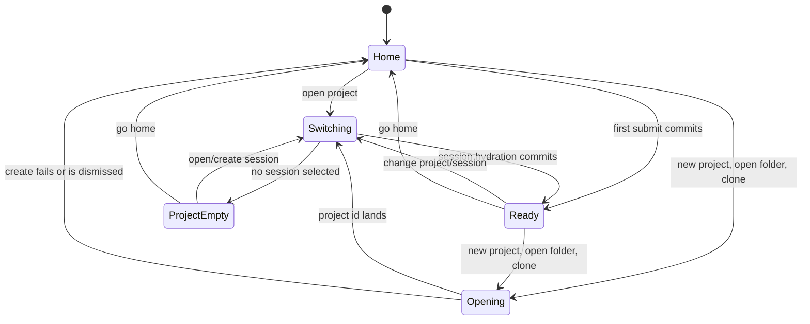

# Project space

The project space is Den's coherent view of one focused project: its identity, project-scoped context, and sessions. A session remains the unit of conversation; the project is the durable organizing boundary around it.

**See also:** [Projects](projects.md) · [Den](den.md) · [Den session switch](den-session-switch.md) · [Project overlay](project-overlay.md) · [Keyboard shortcuts](keyboard-shortcuts.md)

## Chat-first entry

A draft chat begins without a durable project. First submit keeps Home mounted, makes the submitted draft temporarily inert, materializes the project and session, and commits the ready chat with its pending prompt as one presentation. A failed materialization leaves the draft on Home for retry. Abandoned composer drafts therefore never reach recents, and there is no creation ceremony before the user has work to preserve.

The home stage combines a new-chat composer with recent projects. A recent is a project, not a session; opening it resumes a locally recent session when possible or shows an empty project shell.

Home divides projects into recents, drafts, starred, and all. Starring is the one ordering input a person controls directly: recency is observed, and a burst of unrelated work pushes a project down whether or not it stopped mattering. A star is a host-stored project fact, so clearing Den's local caches does not lose it. Den shows a star, a project rename, or a chat pin as soon as the person asks, keeps showing it until the host answers, and restores the host's value with an error if the host refuses.

Projects with no name render as **Untitled** until host auto-naming or an explicit rename succeeds.

## Information architecture

The active project has three zones:

1. **Identity**: project name, switch action, new session, and project configuration.
2. **Context**: pinned project surfaces such as Search, Files, Security, Cost, Artifacts, Blueprints, and admitted extension surfaces.
3. **Activity**: the project's session list.

Context entries open in the main stage. They do not expand inside the navigation rail, and the source tree stays in Files rather than turning project navigation into a file explorer. Only one project identity is rendered at a time: all-project management is a separate stage, and quick switching is an overlay.

## Launcher and management

The launcher is optimized for fast switching, filtering, starting a chat, and attaching a folder. Rename, root reorganization, and deletion live in the project-management stage because they are consequential and need more context.

Both surfaces consume host project records. Den maintains no hidden projects and does not reorder server identity state. Local recents influence which session to resume; the host's `last_opened_at` orders project display.

Delete is a host lifecycle operation. Den confirms intent and renders progress; it does not remove the row locally and hope cleanup succeeds.

## Context zone

Context is project-scoped navigation, not a second settings hierarchy.

| Surface type | Examples | Configuration authority |
|---|---|---|
| Work surfaces | Search, Files, Artifacts, Blueprints, scan findings, Cost | host project/session domains |
| Project override | AI providers, Approvals, MCP providers, Security scanners, Edit review, Tests | project overlay under `.paintedwolf/` |
| Project secret | Secrets | host store, scoped to the project (below) |
| Device setting | app behavior, global providers, credentials, extensions, budgets, updates | Settings/device configuration |
| Trust | project-supplied instructions, settings, and providers | trust switches under Project configuration |

A project trust surface follows its device setting by default. Changing it writes an explicit project value. Trust controls whether project content applies; effect authority remains with host policy, confinement, and approvals.

Reading trust status reuses a contributed-file inventory validated within the last five seconds, so a burst of file changes costs one directory walk per window rather than one per read; the deferred walk runs on the first read past the window. Opening the review and saving a trust change always scan fresh, because those acts record what the person saw.

**Secrets is its own authority class.** It sits in Project configuration next to the overrides and is reachable from chat status and Files, but a project secret is neither a project override nor a device setting: it is host-held state keyed by project id, with values in the credential vault and never in `.paintedwolf/`. A repository must not be able to carry its own credentials, so the one project-scoped surface that holds credential material is the one that does not live in the committed overlay. A secret may be scoped to a single task or promoted to the project, and deleting the project revokes what it held. Details: [Secrets](secrets.md#origins-and-scopes) · [Lifecycle](secrets.md#lifecycle).

Surfaces disabled at device scope remain visible as unavailable choices with a reason. A project cannot reactivate a device-disabled subsystem or create device authority.

## Blueprints

Blueprints are project-governing Markdown under `.paintedwolf/blueprints/`. The project space lists and launches them; workflow cards handle review and update.

A blueprint is versioned project instruction content; an artifact is durable produced evidence or media. A blueprint's own `status: draft` is one of three unrelated meanings of the word (see [Naming § "Draft"](naming.md#draft)) and is not the composer draft that [chat-first entry](#chat-first-entry) describes.

Launching a blueprint arms the corresponding workflow. External work starts only when the user submits the seeded composer intent.

## AGENTS.md

`AGENTS.md` is a project file, not a special Den stage. Humans open and edit it through Files. The host discovers the applicable ancestor chain and injects it when the project instructions trust surface is enabled.

The Files root overview reports the actual context for that root: its applicable instruction chain and effective project skills. Project configuration → Trust inventories and controls every discovered project surface.

Agent write governance and nested-file semantics: [AGENTS.md standard](agents-md-standard.md#governance-write-paths). Den adds no approval checkpoint or parallel editor for the file.

## Active-project state

Navigation intent and hydrated foreground data are separate. During a switch, Den may know the target project before its session and stores are ready; rendering those two moments as though they were coherent would show one project's header over another project's transcript. Den therefore derives one stage scope:

```text
StageScope = project_id + session_id + phase
```

The switch generation is deliberately *not* one of these fields. Stage scope answers "what may paint right now"; the generation answers "may this in-flight hydrate still write". Folding them together would make every stale response look like a different stage.

| Phase | Meaning | Main stage |
|---|---|---|
| `home` | no active project | welcome and composer |
| `opening` | a workspace is on its way to a project the sidecar has not named | project loading stage, labelled from the request |
| `switching` | target chosen, dependent stores hydrating | project loading stage |
| `ready` | project and foreground session agree | chat or context surface |
| `project-empty` | project ready with no foreground session | empty project composer |

Chat mounts only in `ready`. A mismatch between project intent and foreground is valid only in `switching` and is never rendered as a hybrid view.

A project that does not exist yet is still a destination. New project, open folder, and clone enter `opening` at the user's commit, before the request that mints the record: the shell parks the outgoing chat, drops the active project, and puts the veil up under a label derived from the request (the untitled name for a draft, the folder's final segment, the clone URL's repository). The sidecar publishes the `created` project event before it answers the request, so the registry may learn the project at any moment during the open; nothing on screen reflects that, because Home is not a candidate surface while `opening`. When the response lands, the registry write and `beginStageSwitch` are one batch and the open becomes an ordinary `switching`. A failed or dismissed open abandons to `home`. An open carries a token; a later navigation replaces it, and a stale continuation that finds another token stops writing.

First-submit materialization is the one create that holds Home instead. `StageScope` remains `home` until the created session is bound, project events are subscribed, hydration is unlocked, and the pending prompt can paint; the shell then commits the real project/session scope once and never paints the create-pending sentinel. While Home is held, its rows and counts retain what they showed, so the draft record landing in the registry does not repaint the grid a moment before the chat replaces it.

## Switch pipeline



A monotonically increasing switch generation prevents an older in-flight hydrate from writing after a newer choice. Cross-project switches clear the outgoing chat projection before hydration; same-project session switches may hold the old presentation until the new session is coherent.

The cache, generation, and hydration protocol is in [Den session switch](den-session-switch.md). This page defines the product invariant: no mixed project scope is rendered.

## Region readiness

Identity, session list, and stage depend on different stores. Each region declares the authorities it reads and paints when those inputs are coherent for the active project. A slow stage does not blank a ready project header; an unresolved chat list shows its own loading state rather than stale rows from the previous project. Readiness is positive and scoped: data that belongs to another project generation does not count.

## Worker scope

Worker branches belong to the coordinator session the user opened. Worker SSE, drawer state, file opens, and result drill-in bind to `StageScope.session_id` only in `ready`. During switching, no worker projection may attach using the outgoing parent session. Worker source locations retain their task/workspace identity even after the parent project is ready.

## Focus and resident surfaces

Switching preserves unsaved composer and editor state only when their project/session identity still applies. Resident editors may be reparented across same-project surface changes; cross-project navigation parks or closes them according to the buffer controller. Focus restoration respects the active region: chat cannot steal focus from Files, Find, Settings, or a modal merely because hydration completed.

## Invariants

- A draft becomes durable only on first submit.
- The top-level recent is a project, not a session.
- One derived stage scope drives rendering; hybrid project/transcript states never paint.
- Context surfaces and device settings remain distinct, and project overrides cannot widen device authority.
- Project secrets are host-held state, never overlay content.
- Worker UI binds only to a coherent parent session.
- `AGENTS.md` is editable in Files; agent changes require a fresh approval with a link to the proposed diff.
