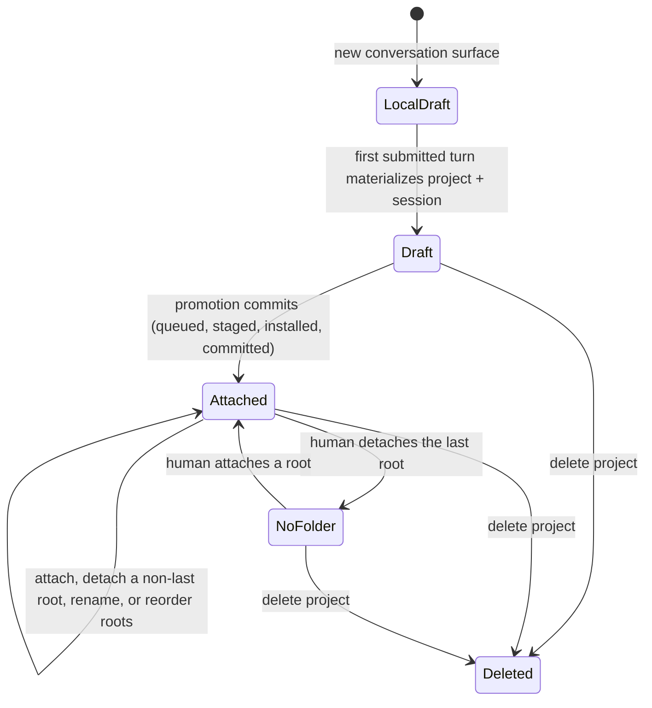

# Projects

A project is the durable identity and filesystem boundary for a body of work. It may begin as a draft, before a human has chosen a durable folder, and later gain one or more human-attached roots without replacing its sessions.

**See also:** [Architecture](architecture.md#core-vocabulary) · [Project space](project-space.md) · [Project overlay](project-overlay.md) · [Session](session.md) · [Security](security.md)

---

## Why project identity is separate from a folder

A conversation may begin before the human chooses a filesystem location, and one body of work may span several attached roots. Treating a path as project identity would make drafts disposable, multi-root work ambiguous, and folder replacement indistinguishable from project replacement.

| Concept | Role |
|---------|------|
| Project | Stable UUID, display name, root set, sessions, and project-scoped settings |
| Project root | Filesystem tree with stable root identity and display label: human-attached, or the host-created draft scratch root |
| Active root | The root that supplies unqualified path context for the current session |
| Project overlay | Commit-worthy configuration under `.paintedwolf/` |
| Host project data | Non-repository attachments, spills, indexes, and other engine-managed state |

Sessions bind to project identity. Filesystem capability is derived from the current root set; it is not a separate project kind.

## Lifecycle



### Local draft

Opening a new conversation creates client-local composer state but no server project. The first submitted turn materializes the project and session together, so exploring the UI never creates durable empty projects.

### Draft project

The first submitted turn creates a project with one real, host-managed root: the **draft scratch root** (`kind: draft`), attached by the host in the same call that creates the project. A draft is never rootless; its one root is primary, and the full project filesystem tool surface works against it from the first turn.

The scratch root lives under the host's own config directory, keyed by project id. Its label is the host-owned placeholder `Draft`; promotion replaces that label with one derived from the chosen folder, so draft-only naming never survives into an attached project.

`is_draft` on the wire is computed, not stored: true exactly when the project has one root, that root is primary, and its kind is `draft`.

A draft's root set is frozen. While `is_draft` holds, attach, detach, and root rename are refused with `draft_root_immutable`, so promotion is the only route out of a draft. The refusal is one precondition on the project, which is what keeps promotion's "exactly one primary draft root" requirement true for the whole transition.

### Promotion: turning a draft into an attached project

Attaching a folder to a draft is a durable, restart-safe transition run by the `PromotionEngine`. It moves the scratch content into a human-chosen empty destination through four phases:

| Phase | What holds |
|-------|------------|
| `queued` | Intent recorded; destination validated as an existing, empty, policy-allowed folder. No filesystem mutation yet. |
| `staged` | The scratch workspace has been copied to a stage path next to the destination and content-hashed; git init runs here if requested. |
| `installed` | Destination and stage have swapped by rename; the installed tree's hash is checked against the staged manifest. |
| `committed` | The registry has flipped the root's kind from `draft` to `attached`. Only cleanup of the reservation and scratch directory remains. |

Each phase is idempotent to resume: `Run` re-reads the durable phase and finishes the interrupted step, so a crash mid-promotion neither strands the project nor duplicates content. A promotion can be canceled at `queued`, `staged`, or `installed`, which restores the chosen folder to empty; a committed promotion can only be detached like any other root. Commit preserves the root id while replacing its path, label, and kind, so sessions and source history keep their identity.

### Attached project

Once promoted, the project may hold one or more human-attached roots (`kind: attached`). Attaching another root, renaming, or reordering needs no staging, because no content moves: the host advances the root generation, rebuilds the effective project view, and exposes root-scoped tools on subsequent turns.

Detaching a root removes it from future scope and disposes root-bound projections. It does not reinterpret evidence recorded while the root existed.

### No-folder project

A no-folder project is reached only one way: a human detaches the last root from an attached project. A draft never passes through it, because its one root is host-managed until promotion replaces it.

The project persists with its identity, history, sessions, and overlay, but its filesystem tool surface goes away. Conversation, configured providers, web research, and workflows keep working. `is_draft` stays `false`: shedding every root does not turn an established project back into a draft. Recovering a filesystem surface uses the ordinary attach action, not promotion.

### Lifecycle mutations are exclusive against running work

Every transition is gated. Two things could otherwise change a project's boundary underneath work that already read it: another lifecycle transition, and a turn or worker in flight. Both are refused rather than serialized behind a lock the caller cannot see:

| Precondition | What it protects |
|--------------|------------------|
| No other lifecycle mutation is running on this project | Two transitions cannot interleave their generation bumps |
| No blocking dependents: busy sessions, and worker jobs pending, running, waiting, held, or complete with a merge still pending | A turn's compiled root boundary stays true for the whole turn, and a worker's write overlay still has somewhere to merge |
| For detach and delete, no unsaved editor documents in the affected scope | An unsaved buffer is never silently orphaned |

Each refusal carries a machine code (`project_busy`, `root_busy`, `draft_root_immutable`, `project_mutation_in_progress`) so a client can say what is holding the boundary.

Detach and delete also offer a forced route, which is not a bypass: the API boundary inventories the dependents, cancels and drains them, and only then re-enters the registry marked as forced. The work is stopped on purpose and the human is told what was stopped. Attach and root rename have no forced route, because there is no "stop this first" the person could have meant.

## Root model

Each root has a stable id, canonical filesystem location, display label, and position. The first root is primary; a session may select another active root for unqualified paths.

| Rule | Reason |
|------|--------|
| Paths are resolved through root identity | The same relative path may exist in several roots |
| Secondary-root display paths are qualified | Evidence and navigation remain unambiguous |
| Every root has one canonical label | Den, prompts, and `@label` resolution render the same host-owned fact; automatic labels preserve the folder basename and receive a bounded suffix on collision |
| Root mutations advance a generation | Cached policy, trust inventory, and source inventory must not survive a changed boundary unnoticed |
| Attaching a folder (`RootKindAttached`, including promotion) and detaching any root are human-only | Project scope is authority, not agent preference |
| The draft scratch root (`RootKindDraft`) is the one root kind the host creates on its own | A fresh conversation needs a live file surface before a human has chosen a folder |
| Symlink traversal is descriptor-relative and jailed | A lexical child path must not escape the approved tree |

### A chosen folder can still be refused

Human authority decides *whether* a folder is attached, not *that any folder may be*. An attached root is a standing write root for every later turn, so the host validates the destination and refuses a boundary it could not honestly contain:

| Refused | Why |
|---------|-----|
| The filesystem root, or a path that is not absolute | A root that contains everything bounds nothing |
| The user's home directory, including when the host cannot determine home at all | Home is the superset of the secret stores, credential material, and host config below it; unknown home identity refuses for the same reason |
| A path that is, contains, or sits inside a secret store, credential store, or key material | Standing write authority over a credential store is not something a folder choice may confer |

The check runs in both path directions, so a candidate that merely *contains* a protected store is refused too. Each refusal returns a machine code naming the class, and nothing partial is attached. This is the same write-root validation the confinement layer applies to reviewed grants, not a separate list.

## Behavior by root state

| Feature | No roots | One or more roots |
|------------|----------|-------------------|
| Conversation and workflows | Yes | Yes |
| Configured model and web access | Yes, subject to policy | Yes, subject to policy |
| Project file read/write tools | No | Root union, with active-root path context |
| Project overlays and `AGENTS.md` | No | Resolved from admitted roots |
| Source navigation and editor | No project source | Root-addressed source |
| Worker write overlays | No | Derived from scoped root snapshots |

Outside-root access is handled by explicit granted paths and write-root authority. It does not mutate the attached-root list.

---

## Project naming

A new project may receive a background display name derived from its first human prompt. Naming is a gift, not identity: failure leaves the project untitled, and a human rename always wins.

| Entity | Human may rename | Stable identity |
|--------|------------------|-----------------|
| Project | Display name | Project UUID |
| Root | Label | Root UUID + canonical path |
| Session | Title | Session UUID |
| Blueprint | Declared title and file path | Blueprint path within the project |
| Provider instance | Display label | Provider id |

Rename changes presentation and search labels, not references, grants, or durable relationships. A server-side uniqueness rule applies only where the surface requires one; cosmetic name collisions do not create new authority.

---

## Project overlay and host data

```text
attached root/
└── .paintedwolf/        commit-worthy project configuration

host config/projects/<project-id>/
├── prompt attachments  durable session inputs
├── tool-result spills  transcript-addressable host data
├── indexes and caches   rebuildable projections
└── other host-managed state
```

The `.paintedwolf/` tree is content a person may inspect, edit, and commit. Engine working directories, worker branches, session checkpoints, and caches stay outside it. Deleting a project removes its host-managed data after dependent sessions and resources are retired; it never deletes attached source roots.

### Deletion and extension cleanup

Project deletion with optional extension cleanup is settled by `internal/projectremoval`. The host assesses each candidate extension's installation provenance against every other registered project's suggestion manifests, the device extension dependency graph, explicit unit selections, and configuration. Provenance identifies candidates; it is not ownership or proof of disuse. Disabled trust surfaces, unavailable roots, broken configuration links, and unreadable manifests count as unknown, and unknown references retain the candidate.

Den shows this evidence and defaults to keeping every extension. A submitted selection carries the host's assessment token and a UUID operation id. The host rejects changed evidence, runs the ordinary lifecycle checks, deletes the project, and only then attempts cleanup, which revalidates the references and commits the selected set in one extension transaction. Deletion and cleanup have separate outcomes: a failed or declined deletion removes no extensions, and a cleanup failure does not undo or misreport a committed deletion.

Receipts retain the reviewed assessment and exact request independently of the deleted project. An exact retry returns the recorded outcome; reusing an id with different input is refused. A process interruption leaves an explicit interrupted outcome, and the host never repeats destructive work on its own. Settled receipts follow the operation-journal retention period; unsettled ones are kept.

### Idle storage tiering

A project untouched for the configured idle threshold (14 days by default) has its stored model-output and evidence bodies recompressed at a higher ratio in bounded batches and is marked cold; reopening it resets it to hot. Nothing is deleted and a cold project opens exactly like a hot one. This keeps the cost of durable history from growing without bound on projects nobody is working in.

Details: [Project overlay](project-overlay.md) · [Host contract](host-contract.md#agent-visible-host-spill-paths).

---

## Detection and repository briefs

Opening or attaching a root may trigger bounded detection of repository identity and source structure. Detection is advisory metadata used to prepare the project view; it does not widen the root boundary or run repository code.

Before attaching a folder, the host may return a bounded **detect preview**: repository root, nested repository boundaries, likely display name, and warnings. The preview carries no authority; the human still confirms the exact root set.

Source inventory is generation-bound and bounded by explicit resource limits. When warming or incomplete, the projection says so. An empty or partial inventory is never proof that the repository contains no relevant files. Repository briefs summarize stable structure for prompt orientation; they are projections over the current root generation, not substitutes for reading source, and a walk that hit its budget yields a brief that counts what was observed.

A **physical workspace** is the project id plus its sorted canonical attached-root set. Source browsing, events, agent discovery, and watcher coverage share this identity; nothing durable is keyed by it. Editor documents and source history belong to the project and its source branch, so a root-set change re-addresses the tree without forking a logical file or stranding an unsaved draft. Source events state separately whether the workspace is a project tree or a worker tree.

Watcher coverage is asked at the grain of the claim: whole-tree reuse asks whether the root is fully covered, while a directory listing asks only about its own directory. Where coverage is absent, project reads apply a fifteen-minute stale threshold and schedule one coalesced refresh; root changes and observed watcher epochs still trigger immediately. Detached roots release their watcher descriptors once no project uses them. HTTP status, storage, pin, and walk reads read only durable state; client polling never schedules whole-tree work.

---

## Terminal CLI

The bundled `pw` command addresses the same host and project identities as Den. It is an operator surface, not a parallel project store.

| Command shape | Purpose |
|---------------|---------|
| `pw .` | Open or focus the project containing the current directory |
| `pw ls` | List projects and attached roots |
| `pw logs` | Open the local diagnostic log viewer |

Commands use stable ids internally and may accept unambiguous display selectors; ambiguity is reported rather than resolved by recency or path guessing. The CLI may request project actions available to the human operator; it grants an agent no new tool authority and bypasses no approval, confinement, or project trust. It discovers the local sidecar and authenticates with the same device-local API token: loopback is transport, the token is the caller boundary.

---

## Persistence and events

Root mutations, naming, deletion, and promotion are host-executed transitions. The project row and dependent state change before events invite clients to rehydrate. Den keeps a project projection for navigation and display; session state references project ids but maintains no second mutable project catalog, so a rename, root change, or delete cannot produce different answers in different client stores.

## Invariants

- Project identity is not a filesystem path.
- Attaching a folder root is explicit human authority; the draft scratch root is the sole host-created exception.
- Human authority to attach is not authority to attach anything: the host refuses a root it could not honestly contain, with a machine code naming the class.
- A draft's root set is frozen; promotion is the only exit.
- Lifecycle transitions are exclusive against in-flight work, and forcing one stops that work rather than ignoring it.
- Filesystem capability derives from the current root set, and root generations invalidate policy and source projections after boundary changes.
- `.paintedwolf/` is project content; engine working state lives elsewhere.
- Granted external paths do not become attached roots.
- Clients hydrate project truth from the host and do not infer it from sessions.
- `is_draft` is computed from root shape, not stored; it never reverts to true once cleared.

## Machine truth

| Concern | Authority |
|---------|-------|
| Project/root wire | `docs/openapi/paths/projects` and project schemas |
| Root identity and resolution | `internal/project`, `internal/projectroot` |
| Path scope checks against the admitted root set | `internal/sandbox` (canonicalizing; a resolved path is compared against the root) |
| Descriptor-relative traversal that makes the jail hold | `internal/fseffect` (`openat`/`O_NOFOLLOW` per component) |
| Attach-time root refusal and its machine codes | `internal/confine` (`AttachedWriteRootRefused`), surfaced by `internal/project` as `RootRefusedError` |
| Lifecycle exclusivity against running work | `internal/project/mutation_gate.go`, plus the dependent counts in the SQL registry |
| Deletion and extension cleanup | `internal/projectremoval` |
| Idle-project storage tiering | `internal/contentblob/density.go`; thresholds in `config/runtime/storage/density.yaml` |
| Draft scratch root | `internal/project/draft_root.go` (`ensureDraftScratchRoot`, `DraftWorkspaceDir`) |
| Promotion (draft → attached) | `internal/project/promotion_engine.go`, `promotion_store.go`, `promotion_paths.go`; wire in `docs/openapi/components/schemas/project/identity.yaml` (`ProjectPromotion`) and `docs/openapi/paths/projects/identity.yaml` (`/v1/projects/{id}/promote`) |
| Overlay merge and project trust | [Project overlay](project-overlay.md) |
| Den workspace behavior | [Project space](project-space.md) and [Den](den.md) |
