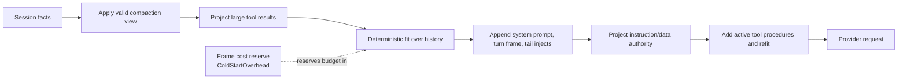
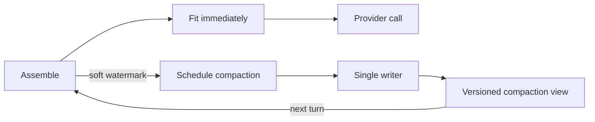

# Prompt assembly

Prompt assembly turns durable session facts and current host state into the bounded projection sent to one model call. Model context is never the canonical transcript.

**See also:** [Architecture](architecture.md#facts-projections-and-caches) · [Session](session.md#continuous-context-budgets) · [Grounding](grounding.md) · [SQL persistence](sql-persistence.md) · [Security](security.md#untrusted-content-inbound)

**Machine truth:** `lycaon/internal/session/prompt_assembly.go` · `lycaon/internal/session/promptassembly` · `lycaon/internal/llm/compaction` · `lycaon/internal/prompts` (template engine) · `lycaon/internal/tokenest` · `lycaon/internal/db/schema.sql` (`compaction_views`) · rendered-prompt byte caps in [`prompt-budgets.yaml`](../lycaon/config/packs/painted-wolf/platform/host/prompt-budgets.yaml)

## Facts, projections, and caches

Facts are the authoritative record (messages, evidence, workflow state, authorization events). Projections are consumer-specific views derived from facts. Caches are disposable (token estimates, reacquirable indexes and blobs). [Architecture](architecture.md#facts-projections-and-caches) defines the layers; this page covers the model's projection.

| Consumer | Reads |
|---|---|
| Den transcript | canonical message and event facts |
| Coordinator model | assembled prompt projection |
| Search | source facts and its own rebuildable projection |
| Authorization audit | authorization contexts and events |
| Debug capture | assembly metadata plus the exact projected request, under debug policy |

No consumer treats another consumer's lossy view as canonical state. Model context can therefore shrink without rewriting history, and Den stays honest about what occurred.

## Assembly pipeline

Completion assembly captures one immutable host wiring snapshot per request. `coordinator/assembly` keeps the engine's turn lifecycle and cache separate from `promptSurface`, which resolves catalogs, capabilities, profiles, and stable rendering, and `turnContextAssembler`, which projects guidance, source briefs, worker context, boards, and workflow orientation around history. Both projections use the captured wiring and explicit turn scratch state; a dependency update applies to the next completion.

Initial fitting runs over history alone. History assembly (compaction view, surface diet, deterministic fit) returns fitted history; completion assembly then appends the system prompt, current turn frame, and tail injects. A final provider-boundary pass adds procedures for the tools actually offered and refits the assembled messages. The rendered system instructions and current user request stay pinned through both passes.

The initial fit reserves frame cost additively through `ColdStartOverhead` (or a calibrated equivalent after reported usage), because it cannot inspect a frame that is not yet assembled. The final fit includes the actual tool schemas in its budget and may remove more eligible history, but never protected instructions.

The pipeline is pure over its inputs. It may schedule background work, but it does not rewrite canonical messages or persist a lossy fit.

Assembly marks two prompt-cache boundaries and the tier each one closes: the standing prefix (system prompt, the injects that precede history, and the offered tool procedures), which changes only when the host re-decides the standing surface ([Decision engine](decision-engine.md#the-standing-surface-and-the-prompt-cache)), and fitted history, before the tail injects. Per-turn state stays out of the standing prefix. Each turn's source-change brief is fixed when the turn opens and sits directly before the prompt that opened it, where it reads true and never changes again; skills are discovered on demand through `skills_read`, so a turn-ranked skill roster never changes the standing prefix. The marks ride the history round trip, so fitting never drops them. The standing mark also closes the provider system preamble: even a source brief before the first user row stays in conversation order. Tool procedures are inserted immediately before that boundary moves to close them. Providers with one system slot project later host messages as conversation content; they never collect all system-role rows into a single instruction. Each provider's policy spells the marks and gives each tier its lifetime ([Providers § Prompt cache policy](providers.md#prompt-cache-policy)).

### Current turn frame

Each coordinator turn receives one revisioned frame: active workflow run, phase, gates, obligations, human state, agent roster, host resources, and prompt surface. Tool policy, spawn policy, prompt rendering, and debug metadata consume that same frame. If a host-mediated effect changes the workflow revision before the provider call, the frame is rebuilt and every consumer receives the new revision.

The roster and machine-resource views are compiled once. Exclusions carry the structured codes dispatch would return, so the prompt cannot advertise an agent or capability the host would reject from a different calculation.

## Instruction and data authority

Authority projection is the final assembly step. System, developer, and direct user parts keep instruction authority. Tool output, retrieved content, project files, summaries, and other untrusted material are marked as data.

A sentence's location in a message object does not make it instruction; the part's authority is explicit. A user's denial guidance travels as a user-authority part, while quoted user text inside tool output remains data.

Every assembly path passes through one authority projector. Debug-only fields and host metadata never reach the model merely because they sit beside message content.

## Prompt text and host facts

Host code supplies typed facts. Pack templates decide how those facts are explained to the model, so prose stays editable without template text becoming enforcement.

| Host fact | Template responsibility |
|---|---|
| current surface and available actions | explain what can be done this turn |
| phase gates and obligations | explain what remains before advance |
| effective worker roster and exclusions | name available delegation choices and reasons |
| instruction/data boundary | teach the model how marked content must be treated |

Templates receive the variable map their caller assembled; the renderer does not filter it. Callers bound collections before rendering, and rendered text states when rows were omitted. A render ceiling fails oversize input instead of truncating an apparently complete list. Rendered byte caps per template live in `prompt-budgets.yaml`.

## Preparation

Compiled templates are cached per exact source revision and ref (`internal/prompts/compiled_cache.go`). Entries hold the parsed graph only, never render data or output; mutable engines compile afresh.

The preparing-context activity covers assembly, provider preparation, and secret screening. The LLM active event starts at dispatch, after screening accepts the request. Payload-free `model request preparation`, `model request phase`, and `model output gate` log records share `call_id` with usage and optional request captures. Phases separate preparation, screening, dispatch, connection, request write, first response byte, first model output, and completion; the first response byte is a transport event, not a token. The completion phase names its outcome: `completed` when the terminal chunk arrived without an error, whatever the consumer did afterwards; `failed` when the stream carried an error; `abandoned` when it closed before its terminal chunk or the consumer stopped reading. Connection counts cover the model request alone; a runner probe an adapter makes beside it, such as Ollama's residency read, runs outside the request's trace.

## Secret-hygiene boundary

Secret detection is the deliberate exception to otherwise lossless message facts. Detected secret spans in tool results are replaced before spill, evidence indexing, message commit, full-text projection, or transcript publication. Redaction precedes length clamping so truncation cannot turn a recognizable secret into an unrecognized partial disclosure. Message insert and update pass through the same screen.

Structured metadata records each replacement's field path, marker offset, kind, and rule, plus the marker width, never the original value length. Clients render from metadata rather than searching for marker strings. A live managed value is written as its reference under its own kind; see [Secrets and redaction](secrets.md#value-metadata-and-reference).

The same metadata decides the one host notice a model request carries: whether it names redactions, references, or both. Marker text never triggers or shapes it. Assembly places the notice with stable history; the provider screen restates it in place when its own pass replaces a kind the earlier projection had not seen.

The raw result may exist only as a request-scoped memory overlay for the explicit outbound decision that caused screening. It is not canonical history and cannot reappear through reload or search.

Secret evidence is revisioned within the session. When new evidence identifies a value, older rows below that generation are rescreened. This sacrifices transcript fidelity for credential safety while leaving the external source of truth untouched.

Authorization detail has its own redaction policy and never relies on prompt assembly.

## Tool-result projection

Tool results commit an honest durable form before assembly sees them. Small results stay inline; large results keep a bounded summary/index plus an addressable spill holding the recoverable bytes. Background chunk compaction stores bounded views in `compaction_views`; history assembly applies them before the active surface diet. Projections preserve the committed result.

Structured residues are bounded by total bytes, including nested bodies, not by list length. They keep outcome and cursor scalars, exact totals, and direct references to retained observations. Chunk metadata records an actual reduction; failed storage or an irreducible residue leaves the original intact rather than marking a growing output compacted. Explicit bounded recovery reads keep their normal read allowance.

Git diff producers keep the full selected file page until secret screening, then fit hunk bytes, spilling the captured page first. An oversized file carries `diff_spill_path` and `diff_lines`; ordinary `read` offset/limit retrieves the original hunks even after the worktree changes, and `next_offset` continues files, not hunks. Later compaction keeps earlier spill references beside its new one so transcript retention and backups cover recovery bytes. Git status with `n:true` returns counts and directory groups without file entries; commit receipts keep outcome and hash while large path lists stay recoverable through the same projection.

Browser operating procedures follow the schemas actually offered on each request, alongside runner and HTTP procedures. Deferral therefore postpones detailed browser instructions until the tools are available without dropping them; resumed page controls receive only the instructions for controls actually offered.

The coordinator retains the cached session AGENTS.md index in every standing prefix, pinned against history trimming. Path-specific instruction chains remain outside that prefix.

Worker project guidance (`AGENTS.md` blocks) is a standalone developer-authority observation, not a copy inside the host-authority leg template. It is assembled on every call, including resume and unchanged worker legs; identical observations with identical source context appear once.

Surviving tool bodies are sealed across deterministic fitting, so a generic token fitter cannot partly rewrite structured tool content. Fitting drops whole eligible messages or projections by explicit priority.

## Prompt context diet

The diet keeps the model focused without erasing facts. Priority is roughly:

1. current user intent and current workflow frame;
2. active obligations, checkpoint decisions, and worker assignments;
3. evidence and tool results needed for the current action;
4. recent conversational continuity;
5. older detail represented by a valid compaction view;
6. reacquirable or superseded material.

Pins protect rows whose removal would make the turn unsafe or incoherent: the rendered system instructions, the latest visible user request, and a worker child's charter. Request-local tool procedures are also pinned; they are the `procedures` slot of the unit catalog, rebuilt from the offered schemas for each provider call and never persisted as history. Skill instructions enter the conversation through an explicit `skills_read` result. A pin is host-created; model prose cannot pin itself.

Recent-history retention counts conversation rows, not appended system injects. If its boundary falls inside a parallel tool batch, retention extends back to the producing assistant call, and fitting cannot peel that exchange away to satisfy an otherwise impossible budget.

Surface-specific diet may promote relevant overlay or review state, but it consumes typed surface identity. It does not scan the conversation to guess whether the user is reviewing or implementing.

## Deterministic fit

Every provider call has a hard ceiling. The synchronous path fits or exposes an irreducible request without a summarizer call:

- estimate the assembled request using provider observations where available;
- preserve pinned and current-turn material;
- apply compaction views and the active surface diet;
- drop whole lower-priority units deterministically;
- refit after system templates are added;
- fail visibly if the irreducible prompt itself exceeds the provider limit.

The same facts, frame, limits, and compaction revision produce the same fit. Latency never depends on an emergency summarizer call.

## Asynchronous compaction

High-quality summarization runs outside the coordinator critical path.

The soft watermark creates runway; the hard ceiling still uses deterministic fit. A per-session writer serializes background and manual compaction of `compaction_views`, binding each view to a constant-size `covered_through_ord`, boundary-message identity, and source mutation sequence. It folds canonical ordinal pages into the prior bounded view instead of loading an old session at once. The next turn validates that the boundary is live and no covered row changed, then seeks only the appended ordinal suffix. It never materializes a growing covered-id set.

Only a complete summary that satisfies the closed continuation-record parser and host bounds becomes a compaction view. Timeout, output truncation, malformed JSON, or an empty completion writes no session summary. A failed summary never advances the compaction generation on its own; independently accepted background chunk reductions may still publish a view. Prompt fitting for that call stays ephemeral, and the next turn measures history before that fit, so a failed background attempt stays eligible for retry.

The summarizer receives a rendered prompt with a fixed token ceiling and per-message ceiling, preserving the newest rows first. A malformed or output-limited first answer gets one retry with a smaller input ceiling. Output arrays and item lengths are bounded in the provider schema and by host parsing. The current user request is excluded from model-generated fields and pinned verbatim in its original canonical row, including its authority and attachment boundaries. The host checkpoint carries only host context and progress.

Compaction summaries are untrusted data projections. They cannot carry user authority, invent host state, erase secret-redaction provenance, or replace evidence that must be reacquired.

The continuation record the model reads is host-composed from the summarizer's lines plus the rows compaction removed or shrank, each named by its evidence handle when it minted one. When the session's profile carries `recall`, the record says that `recall` by handle returns the observation as it was; a tool result shrunk in place carries the same pointer in its `[compacted …]` banner. Compaction moves detail out of context, not out of reach; see [Tools § Recall](tools.md#recall).

An explicit operator/debug force-compaction path may run synchronously; normal turns never do.

Acceptance compares the entire replacement: continuation record, checkpoint, retained rows, trust markers, and tool arguments. Both the shared transcript estimate and the model-facing text must save at least the configured absolute minimum and relative margin (`session_min_savings_tokens`, default 256; `min_savings_pct`, default 10). Declared encodings use embedded ordinary-text tokenizers; an unknown encoding is labeled `estimated` and requires at least 25% savings. Text fields over 1 MiB or uninterrupted whitespace/non-whitespace runs over 4 KiB also fall back to that labeled estimate on both sides, bounding the tokenizer's worst-case merge cost. Tokenized text excludes provider transport framing and images, so it is not a billing count. A useful partial reduction may be published above the target; the compact API reports `target_met` separately from the change, alongside method, measurements, reason, and persisted generation.

A protected-history lower bound rejects unproductive plans before a provider call. A bounded durable memo remembers the last valid but insufficient summary, keyed by history, pins, policy, model selection, and rendered prompt revision; unchanged attempts reuse that decision across restarts, changes invalidate it. Provider and parsing failures stay retryable. Publication rechecks the source watermark and commits the view and session generation together.

Compaction is independent of pricing: the session trigger selects when to compact, and a financial estimate never does. See [Cost § Compaction independence](cost.md#compaction-independence), which also carries the worker-charter protection that runs before a background compaction and the chunk-projection reuse rule.

## Token truth

Before the provider has reported usage, budget estimates use a character-based approximation and a cold-start reserve. The approximation can undercount or overcount; the separate compaction acceptance measurement uses the declared tokenizer when available. After a completion, assembly records observed prompt overhead so later budget decisions include static system and schema material, not only transcript text.

Token observations are advisory measurements. A bad estimate may cause earlier fitting; it cannot cause the host to skip a gate.

## Summarize tool

The [`summarize`](summarize.md) tool returns a structured context pack as a durable tool result. If the pack exceeds its inline ceiling at commit, the full result spills and the message keeps an address (`compactSpillSummarize`). Assembly may project that pack, but commit never deletes its substance to satisfy model context. Packs cite handles to their source evidence; they are navigation aids, not proof that their claims are current.

## Invariants

- Prompt bytes are projections, never the transcript of record.
- Assembly is pure and deterministic on the synchronous path. Host facts that need a process to learn, such as the pack board's local toolchain versions, are computed in the background and read as the last completed result; assembly never waits on them.
- One revisioned turn frame feeds every turn consumer.
- Authority is explicit per content part and projected last.
- Secret screening occurs before commit and before truncation.
- Large tool substance remains addressable.
- Background compaction has one writer and never blocks normal turns.
- Compaction splices use indexed ordinal and mutation watermarks; a mismatch fails closed to canonical facts.
- Templates explain typed facts; prose does not become host fact.
