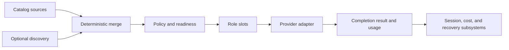

# Providers

Providers connect model roles to concrete completion drivers. The host handles readiness, catalog merge, policy, feature projection, and request recovery; adapters translate protocols.

**See also:** [Session](session.md) · [Prompt assembly](prompt-assembly.md) · [Cost](cost.md) · [Security](security.md) · [First run](first-run.md)

**Machine truth:** [`providers.yaml`](../lycaon/config/packs/painted-wolf/platform/host/providers.yaml) (kinds, retry profiles, capacity policy, model-family rules) · [`internal/llm/`](../lycaon/internal/llm) (catalog and registry; protocol adapters in [`providers/`](../lycaon/internal/llm/providers), profiles in [`providerprofile/`](../lycaon/internal/llm/providerprofile), faults and retry in [`providerretry/`](../lycaon/internal/llm/providerretry)) · [`internal/modelfeed/`](../lycaon/internal/modelfeed) · [`internal/api/modeladmin/providers.go`](../lycaon/internal/api/modeladmin/providers.go) · OpenAPI [`settings/providers.yaml`](openapi/components/schemas/settings/providers.yaml)

The design separates four questions that are easy to conflate:

1. Does the host know this provider/model?
2. Is it configured and reachable?
3. Is it eligible for a particular role?
4. Which protocol behavior does its adapter require?

A model can be known but not ready, ready but excluded from coordination, or eligible but missing a feature a specific surface needs.

## Runtime architecture



The catalog is data. The adapter is code. Session orchestration never branches on display names or base URLs to guess protocol behavior.

The Gemini chat adapter preserves signed tool-call groups exactly. Unsigned imported history uses Google's documented [thought-signature marker](https://ai.google.dev/gemini-api/docs/generate-content/thought-signatures) on the first call; the marker exists only in the outgoing wire projection. System messages after the conversation starts stay at their timeline position as user turns, as in the Anthropic adapter; only the initial preamble becomes standing system instructions.

Together, local inference, and Gemini adapters project one leading system message: the initial system blocks join in order and later host events keep their position as user turns. This satisfies chat templates that reject a system message outside the first slot without moving new host state into the past. OpenAI's native adapter keeps its supported system-message timeline.

## Catalog authority

Catalog entries declare stable provider kind, model id, display metadata, context/output limits, feature flags, driver profile, utility eligibility, and optional pricing/feed keys.

Sources merge by explicit precedence. A higher-priority source may override permitted fields for the same stable identity; it cannot silently change the provider kind or reinterpret an id. Merge diagnostics retain provenance for every effective field.

Runtime discovery is demoted evidence. It can add currently observed model ids and availability but cannot invent trusted feature flags, coordinator suitability, pricing, or protocol behavior.

Exact provider and model inventories belong to catalog YAML and the Settings projection, not this page.

A local model's `context_length` caps its usable window, including after live discovery. Resolution uses the smaller of this explicit cap and the known model capacity; omitting it keeps the discovered or catalog capacity. The resolved limit feeds both context budgeting and the provider runtime, so a local device stays within its memory budget.

## Readiness

Readiness is a host-derived state over provider configuration, credential presence (without exposing credential bytes), required endpoint and policy values, adapter availability, model presence in the effective catalog, local capability evidence where required, and role-specific eligibility.

Readiness reports a structured reason. A failed live request may update transient health, but it does not rewrite catalog identity.

First run requires enough readiness to start a conversation. After onboarding is latched, losing readiness becomes a recoverable configuration notice rather than reopening the initial gate.

### What the Settings projection may say

**Absence of evidence is not evidence of absence.** The readout never turns a missing fact into a definite negative.

| Wire fact | What Settings may say |
|-----------|------------------------|
| `ready_to_assign` | Ready |
| `requires_api_key` without `credential_present` | Needs API key |
| `configured` | Nothing about reachability. Credentials are in place; nothing answered |
| `secret_screen_trusted` | Trusted with secrets. A person's decision for this instance's current destination, never a statement about where the model runs |
| `discovery_status` | The reach question: `error` → can't reach, `empty` → no models, `ok` without readiness → no model to assign, absent → not checked |
| `models[].capabilities.tools.state` | Supported only on a `supported` row; **unsupported only when every listed model said so**; otherwise unknown |

An empty `models[]` is the ordinary shape of a failed or skipped discovery, so tool-call support is carried as the wire's tri-state all the way to the copy, and the unknown branch says what has not been read and which control reads it.

A failed listing is a block rather than a chip: it names the endpoint, says the models and their capabilities are unknown, and gives a next step derived from the structured `status` axes (`authentication.state`, `configuration.state`). The provider's own error text is deliberately not on the list projection; **Test connection** reports it on demand through `ProviderTestResponse.error`.

Test connection reads connection and catalog information without running a model. Success does not verify inference access, billing entitlements, or model-specific licenses. Cloudflare requires an account ID in its endpoint before the provider becomes ready.

HTTP providers can declare `rejection_reasons` in catalog YAML; local instances inherit the kind's rules unless they supply their own nonempty list. A rule matches a 4xx status and an exact string or number at a structured JSON code path, never diagnostic prose. Dot-separated paths descend into object keys; array index `0` requires exactly one element, so mixed errors stay generic. The selected `reason` reaches the `provider_request_rejected` notice template; unknown reasons keep the generic notice. The bundled Cloudflare rule maps [code 5035](https://developers.cloudflare.com/workers-ai/platform/errors/) to `cloudflare_workers_paid_required`:

```yaml
providers:
  - id: cloudflare-workers-ai-1
    kind: cloudflare-workers-ai
    rejection_reasons:
      - status: 403
        code_path: errors.0.code
        code: "5035"
        reason: cloudflare_workers_paid_required
```

The mapping applies only after a real request is rejected; it adds no inference call to Test connection.

## Conversation eligibility

The host resolves `models[].eligibility` for coordinator, worker pool, and lite roles. Each decision carries a state, a selectable flag, a machine code, and a reason. Assignment validation, readiness, and Den use this same decision; showing all models reveals incompatible entries for diagnosis without making them selectable.

Chat support must be established for conversation roles. Coordinator and worker roles also use tools: explicit unsupported tool metadata is incompatible, while unknown tools on a chat-capable model remain selectable and labeled unverified. Model size and a blanket context-window threshold do not exclude models. Missing feed booleans remain unknown rather than becoming false.

Listing, onboarding, and assignment never send completion requests. A separate, bounded provider regression suite exercises real tool calls, result replay, and host continuations through the application adapters; it neither changes model metadata nor adds exclusions. See the [release integration checklist](operations/release.md#provider-integration-checks).

## Callability

Eligibility asks whether a model suits a role. **Callability** asks the prior question: will this host serve the model at all? Missing callability evidence permits an attempt; only explicit unsupported callability denies. Neither model listing nor role assignment runs a completion to settle uncertainty.

Model assignment resolves models, explicit refusals, and discovery errors together. Known-model validation, capability checks, and pricing reads use the current catalog without waiting for its 30-second discovery TTL; one background refresh serves concurrent readers. Unknown selections and explicit refreshes wait for discovery. A successful response replaces the catalog, including an empty response; transient failures retain the last usable metadata. Endpoint or credential changes invalidate their generation. If the requested model cannot be resolved and discovery failed, policy updates and explicit session model selection return HTTP 503 `provider_catalog_unavailable` with `retryable: true` and apply no assignment. A successful discovery that lacks the model returns the ordinary assignment rejection. Neither outcome establishes a new model refusal.

Callability is established two ways, both positive statements someone made:

1. **From the host's own listing**, when a discovery profile declares how that host expresses it. Together publishes token prices only for models served on the shared chat path, so its profile reads a listed row without prices as the host declining to serve it there. Such a row is stamped, not dropped: refused rows stay out of the assignable set but are retained, so an assignment naming one is answered with what the host said instead of "unknown model".
2. **From a refusal at call time**: the `model_refused` fault below, recorded per (provider, model) in the refusal gate when, and only when, the host answered about the model's *identity*.

Each only removes a specific named pair; nothing is inferred from absence from a catalog, because a catalog can be stale, partial, or unreachable.

A recorded refusal is sticky rather than timed. It stands until a provider or policy edit (`ResetPlanes`), a later call that succeeds, or a restart. Before each call the gate answers a standing refusal without a round trip. A transport that answers inside the stream, as Bedrock Converse does, reports the refusal as the stream's terminal chunk; the route reads that terminal outcome and records it exactly as it records a refusal returned when the stream opened, and the same reading cools a slot whose overload or silence arrived the same way. A stream the consumer abandons establishes nothing.

**Only identity-level evidence is remembered.** The two available signals do not prove the same thing:

| Evidence | What the host said | Remembered |
|---|---|---|
| A declared token in `code` / `type` / `status` | The name is not one I serve | yes |
| `param` naming the model argument, with no declared token | The model field is the problem with *this* request | no |

The second cannot separate "no such model" from "this model will not serve the request I just sent", because a capability mismatch is reported the same way. Utility calls carry request shapes the coordinator never sends, so remembering one would let a structured-output call put a model out of reach for ordinary chat. That turn fails honestly and nothing is recorded. A completed call for a pair retires any standing refusal for it.

## Driver profile

The driver profile records protocol facts that affect request and recovery behavior: request shape, system-message support, tool-call encoding, [declared fallback tool-call grammars](#fallback-tool-call-grammar), stream events, usage accounting, finish reasons, per-phase response-header bounds, and retry-safe boundaries.

Profiles are keyed by provider kind or explicit catalog field, never model-name patterns. A gateway or compatible endpoint declares the vocabulary it implements; the host does not guess from its hostname.

### Reasoning policy

Coordinator and worker requests use one reasoning policy across tool and prose turns: moderate effort for normal work. Adapters translate that intent to the model's middle effort level, enabled binary thinking, or the native token budget. Host utility requests and explicit turn directives may disable reasoning; strict recovery uses the minimum supported control. A model's always-on capability outranks an unsupported disable request. Provider controls describe protocol capabilities; the thinking overrides below take precedence over application intent.

Together hybrid models receive `reasoning.enabled`; effort-capable models use the separate `reasoning_effort` field. OpenRouter's `reasoning.effort` object is a different protocol and is not sent to Together. A requested effort is not a claim of equal reasoning compute across models. Debug captures retain resolved request controls, including reasoning fallback attempts.

### Reasoning continuity in tool loops

For chat-completions transports, `reasoning_wire` declares the assistant-history format the endpoint accepts. Set it on a ship provider kind or any instance in `providers.local.yaml`:

```yaml
providers:
  - id: custom-endpoint
    kind: openai-compatible
    base_url: https://inference.example/v1
    reasoning_wire: reasoning_content
```

`reasoning_content` sends the prior trace in that field. `reasoning_details` sends the `reasoning` text and structured `reasoning_details` blocks. `none` disables replay; omission inherits the kind default. Cloudflare uses `reasoning_content`; OpenRouter uses `reasoning_details`. Unknown values are refused, and native transports with a different message protocol reject this setting.

Streaming and complete responses retain reasoning separately from visible assistant text. Replay is restricted to the exact provider instance and model that produced it; tool-call identities remain paired with their results. Reasoning control (`think_style`, effort mapping, thinking settings) is a separate axis from preserving the response history.

### Thinking overrides

Settings → AI providers places optional **Thinking overrides** below the model assignments, hidden until **Override thinking** is checked. Turning it off clears the overrides at that scope. Each row belongs to an exact provider instance and model id; the same model served by another provider is a separate choice. Project configuration → AI providers has independent overrides: an unchecked row inherits the device setting, **Use application behavior** masks an inherited fixed setting, and clearing the project row restores inheritance. Assignment changes do not pin or clear thinking settings.

The host freezes the effective policy at the turn boundary, merging device, primary project, then active project. Fixed controls apply to coordinator, workers, summaries, other utility requests, and retries. A fixed native `high` stays `high`; retries cannot remove or lower it. Unsupported saved values produce an actionable error before inference. Token budgets must leave answer space within an explicit request output limit; incompatible requests fail instead of changing either setting.

Device overrides live in the config directory's `model-policy.yaml`; project overrides in `.paintedwolf/model-policy.yaml`. One entry per provider/model pair:

```yaml
thinking_overrides:
  - provider_id: cloudflare-workers-ai-1
    model: "@cf/zai-org/glm-5.3-flash"
    mode: fixed
    effort: high
  - provider_id: local-models
    model: qwen3:8b
    mode: fixed
    enabled: false
  - provider_id: anthropic-1
    model: claude-sonnet-4-5
    mode: fixed
    budget_tokens: 4096
```

Fixed mode requires exactly one of `effort`, `enabled`, or `budget_tokens`. A project restores application behavior with `mode: application`; omitting the pair restores inheritance. API patches replace the thinking array in that layer; an empty array clears it; omitting the field leaves it unchanged.

#### Supported controls

The UI consumes host capability metadata instead of a universal effort ladder. Precedence is explicit per-model YAML, provider discovery, then the first matching family rule. Controls are intersected with the adapter's supported wire forms; unknown controls remain unknown, and transport limitations are reported as unavailable. Test connection and Refresh models use metadata calls, never paid inference.

OpenRouter supplies reasoning metadata through its [model catalog](https://openrouter.ai/docs/guides/best-practices/reasoning-tokens); the [Anthropic Models API](https://platform.claude.com/docs/en/api/typescript/models) supplies effort levels and adaptive/manual thinking support. Other providers use declared model-family controls.

Capability declarations can be supplied in `providers.local.yaml` for any provider instance, or shared by a model-family rule. They describe what an endpoint accepts; they do not activate an override, and YAML does not add a protocol implementation:

```yaml
model_thinking:
  - match: [example-family]
    style: effort_levels
    controls:
      state: supported
      efforts: [low, high, max]
      default_effort: high
providers:
  - id: custom-gateway
    models:
      - id: example-family-special
        think_style: effort_levels
        thinking:
          state: supported
          efforts: [low, high]
```

Other controls are `can_enable: true`, `can_disable: true`, and `budget: {min: 1024, max: 32768}`; omit `max` when the provider has no fixed ceiling. Use `state: unsupported` for a known lack of controls, or `state: unknown` to suppress a family assumption. The per-model `thinking` declaration takes precedence over discovered metadata.

### Model-family rules

Two scoped planes match a **model id** rather than a provider kind, because the fact they carry is a property of the model family, not of whoever serves it. Both are ordered rule lists testing case-insensitive substrings against the model id, first match winning; both load from `providers.yaml` with `providers.local.yaml` rules prepended. These two are the whole set: anywhere else, a model-id pattern is display cosmetics, not trusted state.

| Plane | Catalog key | What it selects | Where it lands |
|-------|-------------|-----------------|----------------|
| Thinking | `model_thinking:` | The reasoning wire form, the two polarity flags below, and the family's reasoning markers | The request an adapter builds, and how its output is read |
| Cutoff | `model_cutoff:` | The family's approximate knowledge-cutoff month | Prompt text, through the date preamble |

A thinking vocabulary is plain text, an effort level, a boolean flag, a budget-token count, an adaptive mode, or a structured reasoning object. `DriverProfile` still constrains which of those the transport can carry. Neither plane widens authority: a rule changes how a request is dressed or what a prompt says about dates, never which tools, roots, or destinations are reachable.

#### Reasoning polarity

Families disagree about what omitting the control means, so two flags carry that:

- `always_on` marks a family that rejects being disabled. Drivers omit the control instead of sending a disable. It can also arrive from the catalog entry, and either source latches it.
- `default_on` marks a family that reasons when the control is absent, so a deliberate think-off must emit the protocol's explicit disabled form. Catalog load rejects `default_on` on any style but `adaptive`.

`always_on` wins when both are set. Named-effort models receive their lowest level even for structured utilities, because omitting it can select the provider's highest default.

#### Named effort mapping

`providers.local.yaml` can map the host's low, medium, and high intent to a provider's named protocol values. Family rules use `effort_levels`; a specific provider's model uses `reasoning_effort_levels` to override the family mapping. All three values are required. Values are protocol tokens of lowercase letters, digits, underscores, or hyphens, up to 32 characters.

```yaml
model_thinking:
  - match: [glm-5.3-flash]
    style: effort_levels
    always_on: true
    effort_levels: {low: low, medium: high, high: max}
providers:
  - id: custom-gateway
    models:
      - id: example-model
        think_style: effort_levels
        reasoning_effort_levels: {low: minimal, medium: medium, high: xhigh}
```

The bundled GLM-5.3-Flash rule uses low/high/max because [Z.ai documents that every other value selects max](https://huggingface.co/zai-org/GLM-5.3-Flash). The mapping applies to named effort controls, including Ollama's effort field, adaptive effort, and reasoning objects.

#### Reasoning markers

Some families' chat templates wrap reasoning in literal tags inside the
content channel, and serving stacks differ in what they do with them: one
reports the reasoning in its own field yet still streams the open tag as
content, another leaves the whole block in the content. A rule declares the
family's tags with `reasoning_markers`, and the host reads every transport's
output the same way:

```yaml
model_thinking:
  - match: [qwen3]
    style: boolean_think
    reasoning_markers: {open: "<think>", close: "</think>"}
```

Content between the tags is reasoning. Reasoning that arrives in its own
field settles the block: the open tag stood alone, whitespace after it is
dropped, and the text that follows is the visible answer, as is anything after
the close tag. Bytes that could still begin a tag wait for the next delta, so
a tag split across deltas is still read as one. A tag that never completes is
visible text, and an open block that never closes is reasoning. Each tag is a
literal of at most 32 bytes, and the two must differ. A family with no rule,
or a rule without markers, passes content through untouched.

#### Model cutoff

The cutoff plane resolves a family's approximate `YYYY-MM` cutoff and renders it, beside today's date, into the date preamble carried by host utility calls (compaction, summarization, curation), so a model can treat a post-training name or event as verifiable rather than mistaken. The preamble is date-only, so it stays byte-stable across a session's calls and does not break prefix caching.

An empty match list, or a cutoff that is not a `YYYY-MM` month, fails the catalog load. No matching rule resolves to an empty cutoff, and the preamble then states the date without asserting a window. The bundled `model_cutoff:` list ships empty; the plane exists for device configuration to fill.

### Prompt cache policy

How each provider keeps a prompt prefix is catalog data. `prompt_cache_profiles`
in `providers.yaml` names the policies, each provider kind names one with
`prompt_cache_profile`, and the ordered `model_prompt_cache` rules refine a
profile per model family: the first rule that names the profile and matches
the model, by substring or exact id, replaces the profile's fields. A kind
that names no profile caches nothing; device configuration may prepend its
own rules. A policy sets:

- `mode`: `explicit_breakpoints` (the request marks boundaries and sets their
  lifetime), `automatic_prefix` (the provider caches on its own), `local_kv`
  (a local runner reuses KV state while the model is loaded), or `none`.
- routing and markers for automatic prefixes: `session_key` sends the session
  id as `prompt_cache_key`, `affinity_header` carries it so requests reach the
  replica that holds the prefix, `marker` places `prompt_cache_breakpoint`,
  `cache_control`, or the catalog's choice on each boundary, `request_marker`
  adds a request-level `cache_control`, and `retention` sets
  `prompt_cache_retention`.
- `lifetime`: for explicit breakpoints, the lifetime of the standing tier and
  of history. The standing prefix changes only when the host re-decides it,
  so Anthropic's standing tier takes the 1h lifetime and history the 5m one;
  a longer-lived entry always precedes a shorter one. A family whose host
  fixes the lifetime itself and refuses a request that names one, such as
  Nova on Bedrock, leaves `lifetime` out: its checkpoints carry no ttl, and
  `cold_after` carries the host's figure.
- `cold_after`: how long an idle prefix probably survives when the request
  sets no lifetime, from the provider's documents or a measurement; absent
  when neither gives a figure, and then idleness never marks a turn cold.
- `keep_alive` and `residency`: a local runner's residency request and the
  probe that tells whether it still holds the model (Ollama's `/api/ps`).

Prompt assembly marks two boundaries, the standing prefix and stable history,
and each driver spells them in its own grammar, keeping the markers nearest
the tail when it has fewer slots. Anthropic places `cache_control` with the
tier's `ttl` on each marked row's final block and adds the top-level
breakpoint with the history lifetime. Bedrock Converse places a `cachePoint`
with the tier's `ttl` after each marked row, closing the system prompt when
the row is part of it, for the Claude and Nova families the rules give
explicit breakpoints; Nova's checkpoints carry no `ttl`. OpenAI-compatible transports send a per-part marker only where
the routed model's rule gives one; a row with no part to carry it, such as a
tool-call-only assistant turn, passes it back to the row before it. A LiteLLM
proxy reports prompt caching per model on `/model/info`, and that catalog
fact, not the model id, decides whether the marked rows carry
`cache_control`.

The same policy tells the host when a turn opens cold: the route caches
nothing, the idle gap reached the standing tier's lifetime or `cold_after`, or
the runner no longer holds the model ([Decision engine](decision-engine.md#the-standing-surface-and-the-prompt-cache)).
The shipped figures and the probes behind them sit beside each profile in
`providers.yaml`.

### Cache diagnostics

Cache warmth is an expectation derived from route, lifetime, and residency
facts. Provider-reported read tokens establish reuse; neither a cold prediction
nor a zero or absent cache counter proves a provider miss. History compaction
changes the history tier without expiring the standing tier.

`prompt-cache-observability.jsonl` records one payload-free observation per
completed or failed model call when LLM debug capture is enabled. `call_id`
joins it to the request and timing capture. Each observation reports input,
read, and written tokens; whether usage was present and complete; and changes
to standing text, tool schemas, request controls, and the previously sent
history prefix. These comparisons hash the prepared host projection, not a
provider's private cache key. Growing history and changing tail context do not
count as prefix changes. Digests and prompt bodies are never written to this
log.

A bounded eight-request window compares only requests in the same session,
provider, model, and purpose. First requests, prefix changes, rewritten history,
known idle expiry, overlapping calls, retries with multiple captured attempts,
failed calls, and incomplete or absent usage reset the window. Unknown cache
lifetimes do not invent an expiry. After at least three comparable requests
averaging at least 4,096 input tokens, no reported reads or a read fraction below
10% raises a diagnostic alert. These are diagnostic thresholds, not model cache
eligibility rules. A transition into an alert warns once; later reads can clear
it, and a later regression can warn again. No alert changes host decisions.
Local KV routes report evaluation duration without claiming a cache hit from
latency alone.

### Fallback tool-call grammar

Some hosts answer a tools-offered request by writing the call into assistant text instead of the structured field. `DriverProfile.TextToolCallGrammars` declares, per profile, which such grammars that transport may recover from. It is a closed set of two: a bounded envelope (declared `<tool_call>` tags, a `[TOOL_CALLS]` prefix, or a fenced JSON object naming a tool and its arguments) and the Harmony channel transcript. The OpenAI-shaped base profile declares both; the Ollama, Anthropic, and Vertex express profiles declare the envelope only.

This is protocol parsing inside a declared grammar, not intent classification ([`../AGENTS.md` § No heuristics](../AGENTS.md#no-heuristics)):

- **Only the declared grammar.** A profile that declares neither recovers nothing; prose is never scanned for something that resembles a call.
- **Only when tools were offered.** With no tools on the request, the content stands as text.
- **Only against the offered schemas.** A recovered call must name an offered tool and validate against its argument schema. A recovery that fails either check is neither downgraded to text nor executed; the attempt fails as a structured provider error.

### Completion recovery

Streaming completion is committed in recoverable stages:

1. admit one provider attempt with stable operation identity;
2. append observed content/tool deltas as provisional state;
3. classify terminal provider outcome;
4. commit the final assistant/tool-call message or a structured interrupted state;
5. record usage and cost provenance when available.

Retries occur only before an unsafe replay boundary. Once the host has observed a tool call or committed visible assistant content, it does not silently send the same turn to another provider. An interrupted stream remains visible and may be continued by an explicit new turn. The host never fabricates a clean completion from a transport error.

An empty response ending at its output allowance is recovered once within the same turn when the adapter can send a lower reasoning control: the minimum supported reasoning setting and a 4,096-token ceiling (or a smaller explicit cap), inside the existing call timeout. Fixed thinking overrides are preserved, and an unchanged reasoning control is never presented as a recovery. No visible content or tool-call progress may have escaped the failed attempt. Failed-attempt reasoning is removed from the recovered response; reported charges from both attempts are retained. A failed recovery produces a notice that completed work remains.

Tool requests reserve 16,384 tokens of base answer room plus the application reasoning allowance: 1,024, 8,192, or 16,384 tokens at low, medium, or high effort. The model's declared output ceiling and explicit request limits still bound the request. Providers with a shared reasoning/output counter cannot promise a separate visible-output ceiling; the host does not cut a live tool call at an estimated token boundary.

The runtime guard observes each attempt independently of debug logging. Hidden output estimated at three quarters of the request limit arms stricter subsequent requests, including when visible output is zero. A useful completion under the stricter policy clears the mark unless it also crosses that threshold. This is a token estimate, not a claim to know what the model was reasoning about.

Adapters classify limits from structured terminal reasons: OpenAI-compatible `length`, Anthropic/Bedrock `max_tokens`, Gemini/Vertex `MAX_TOKENS`, and Ollama's typed output-truncation error. Utility requests reject truncated titles, summaries, and structured results instead of accepting them as complete. Retried empty responses aggregate reported usage across attempts.

Debug captures retain reasoning byte counts. Empty completions also retain a redacted tail of up to 2,048 characters when the complete reasoning fits the 512 KiB capture buffer; larger traces omit text rather than exposing part of a credential through truncation before redaction. Reasoning text never determines a host control decision.

OpenAI-compatible response read failures and streams that stop after output but before a terminal event retain `provider_response_interrupted`. The notice names the provider and model without claiming the request was undelivered. Caller cancellation retains its cancellation identity. A response interruption does not authorize replay of a partially executed coordinator attempt.

## Attempt faults

Every provider attempt resolves to one **fault kind**, and both retry planes branch on it: the per-provider HTTP schedule inside the adapter, and the turn-level hold and slot cooldown in the capacity gate.

| Kind | What happened | Delivered? |
|------|----------------|-----------|
| `status` | A non-2xx answer that is neither capacity nor rate limit | yes |
| `rate_limited` | HTTP 429 | yes |
| `capacity` | HTTP 503 / 529 | yes |
| `unreachable` | DNS, dial, TLS, or a connection lost mid-write | **no** |
| `silent` | The request was written in full and no response header came back inside the bound | yes |
| `empty_completion` | A successful response or clean stream terminator carried neither assistant text nor a tool call | yes |
| `canceled` | The host's own context ended: a stopped session or a spent turn budget | n/a |
| `model_refused` | The host answered that the named model cannot serve the request | yes |

`unreachable` and `silent` carry no HTTP status. They are told apart by what the host watched happen on the socket (`httpclient.Observe` records whether the request was written), never by error text: both arrive as a `net.Error` whose `Timeout` reports true. An unreachable provider never received the prompt and never billed for it; a silent one holds the prompt and may be generating against it. Only the first can honestly be reported as costing nothing.

The Bedrock SDK adapter reaches the same kinds. Its `Converse` call runs on the host's provider transport under the non-streaming completion header bound, with the SDK's own retryer disabled so each adapter attempt is one observed request. A fault the service answered is read from the SDK's typed exception and response status; one it never answered is classified from the observed socket like any HTTP attempt.

A `canceled` fault is never retried. An `empty_completion` may be retried only before any visible answer text or tool call has reached the caller. Structured filter, guardrail, and refusal reasons remain terminal rather than being disguised as transient emptiness.

`model_refused` describes the (provider, model) pair rather than the provider's health. It is never retried and never cools a capacity slot; it is recorded instead ([Callability](#callability)). A refusal is read only from the structured fields of the host's error envelope: a declared token in `code` / `type` / `status`, or `param` naming the model argument. Envelope families disagree about which field carries the token (openai-shaped hosts use `code`, Anthropic `type`, Google `status`), so a declared token is matched against all three. The `message` is never consulted. Hosts without such a token do not produce this fault.

Bedrock has no envelope to read, so the discriminator is the typed SDK fault: `ResourceNotFoundException` (the model or inference profile does not exist) and `AccessDeniedException` (authenticated, but model access is not granted). `ValidationException` is deliberately excluded: Bedrock returns it both for an invalid model identifier and for a request body it will not accept, so honoring it would let one malformed request mark every pair refused.

### Retry schedules

The ship catalog defines named `http_retry_profiles`, and each provider kind selects one with `http_retry_profile`. Profiles declare their service class: `hosted`, `local`, or `sdk_managed`.

Every `hosted` profile retries the bounded transient set (429, 500, 502, 504) and handles 503 on its separate capacity schedule. A provider contract may add another structured status, such as Anthropic 529 or Azure 408. The host never classifies error text to decide whether to retry, and it does not retry every 5xx: permanent protocol responses such as 501 and 505 stop immediately.

Inside a profile, `http_retry` selects on status; its nested `capacity` block handles 503/529; a `transport` block handles the status-free kinds:

```yaml
http_retry_profiles:
  hosted-gateway:
    service_class: hosted
    http_retry:
      max_retries: 3
      max_wait_ms: 60000
      backoff_ms: [1000, 2000, 4000]
      statuses: [429, 500, 502, 504]
      wait_headers: [Retry-After]
      capacity:
        max_retries: 2
        max_wait_ms: 60000
        backoff_ms: [2000, 8000]
        statuses: [503]
        wait_headers: [Retry-After]
      transport:              # optional; the default applies when absent
        max_retries: 1
        backoff_ms: [1000]
        max_wait_ms: 5000
        faults: [unreachable, silent, empty_completion]   # empty means all three

providers:
  - id: openrouter
    http_retry_profile: hosted-gateway
```

A complete inline `http_retry` in a local provider instance overrides the kind's resolved profile; partial merging is unsupported. `transport: {max_retries: 0}` turns transport retries off.

Every retry rebuilds its request. Status and connection failures retry inside the adapter; accepted-but-empty responses retry at the common provider boundary under the same transport schedule, which observes the parsed stream and will not replay after partial model output or tool-call progress. When that budget is exhausted, the error is non-retryable to the worker queue. Cancellation remains cancellation even when the interrupted provider closes an empty stream or returns a competing error.

Terminal HTTP 4xx responses retain the `provider_request_rejected` notice code, provider, model, HTTP status, and wrapped diagnostic error. Model-refusal and rate-limit classifications take precedence. A generic rejection does not assert that credentials, content filtering, or model capability caused the response.

### Adaptive rate admission

Every provider adapter, including the Bedrock SDK adapter, uses the same catalog-controlled `http_retry.rate_limit` policy. Shipped profiles collect observations by default; adaptive scheduling is enabled only by an explicit `adaptive: true`. Together selects the `hosted-adaptive-model` profile. A local instance can supply a complete `http_retry` override containing:

```yaml
rate_limit:
  adaptive: true
  scope: provider
  initial_ms: 5000
  max_backoff_ms: 300000
  recovery_successes: 4
```

`scope: provider` shares admission across models at the same endpoint origin; `scope: model` separates that origin into model buckets. Endpoint aliases share the same bucket and must agree on its policy. Credentials and prompts never enter the stored observations. Distinct credentials on one origin conservatively share admission.

On HTTP 429, adaptive admission uses exponential backoff with equal jitter, then spaces requests after the cooldown. Concurrent rejections from the same admission generation increase the penalty once. After the declared number of newly accepted requests, the penalty and spacing halve. Older in-flight responses cannot erase a newer cooldown. Accepted means the provider accepted the request, not that the model produced a usable completion.

The longest valid declared retry header is a minimum wait, even above the local backoff cap. Adaptive 429 waits remain inside the original request until success, another terminal fault, or cancellation; they do not consume the transient retry budget. A 429 alone cannot distinguish throttling from exhausted quota, so the host reports the typed rate limit and keeps waiting.

The normal application shares state within its registry. The isolated benchmark launcher passes `--rate-state-dir` to share one controller across processes; `LYCAON_LLM_RATE_STATE_DIR` is accepted only on the harness channel with an absolute path. Locked, atomic state files retain cooldowns across process exits; unsupported state or mismatched policies stop admission instead of resetting it. Both modes record lifetime admissions, accepted requests, 429 counts, current policy and deadlines, and at most 60 one-minute observation windows. These are operational tuning data, never model scores.

### The response-header bound decides whether retrying is worth it

A retry pays the response-header timeout again. It is a **per-phase** bound: `DriverProfile` carries `StreamResponseHeaderTimeout` and `CompleteResponseHeaderTimeout` separately, because a streaming call should produce its first frame quickly, while a non-streaming call legitimately holds the socket for the whole generation.

| Phase | Remote default | Local-inference profile |
|-------|----------------|-------------------------|
| Streaming — `StreamResponseHeaderTimeout` | 60 seconds | 5 minutes |
| Non-streaming — `CompleteResponseHeaderTimeout` | 10 minutes | 20 minutes |

The local-inference column is longer because loading a model into memory is a real wait with no bytes on the wire.

<a id="local-inference-profile"></a>
Provider kind selects that service class; the host does not guess from a URL or process name. Five kinds select the local-inference profile: `ollama`, `lmstudio`, `omlx`, `litellm-proxy`, and `openai-compatible`. That one profile sets both header bounds, both utility-call budgets, and single-flight behavior together, so a driver cannot be half local.

## Capacity and concurrency

Provider capacity is separate from workflow concurrency. An adapter can advertise or enforce in-flight limits, but the coordinator still schedules task waves and the utility lane enforces single-flight behavior.

Backpressure produces a structured queued/busy state. It does not cause Den to open a second untracked request or the session to treat timeout as cancellation.

A provider slot cools after an overload, after silence, and after an unreachable host. Silence rests the slot longer than a 503 does, because it costs the whole header bound before anything is learned. `provider_capacity.cooldown` carries both values (`overloaded_ms`, `silent_ms`).

## Utility plane

The utility plane runs bounded host-internal model work such as compaction or narrowly scoped classification. It is not an invisible second coordinator. Utility calls use an explicitly selected eligible slot, have a per-attempt time and token budget, receive only the minimum projected input, cannot invoke tools or change workflow state, record usage/cost provenance separately, and apply a feature-specific failure policy.

Local utility calls are single-flight per driver instance so one slow request cannot create a queue of identical long waits. Foreground coordinator calls and utility calls have distinct schedulers even when they share a configured provider.

### Utility call budget

The budget is a hard host envelope around each attempt. The default (2 minutes) applies to any driver that does not declare its own. The [local-inference profile](#local-inference-profile) declares 5 minutes for any non-background utility call, so on-demand model loading and prompt evaluation remain viable, and 15 minutes for background projection work, where nothing is waiting on the result.

Exhausting the envelope means the model was too slow for that service class, not that its endpoint is down: it records an unknown or incomplete usage receipt but does not open the lite-slot circuit. Neither does an attempt its caller ended, whether by canceling or by its own shorter deadline: that measures the caller's patience, not the endpoint. The circuit reads the same typed transport faults the [capacity gate](#capacity-and-concurrency) cools on, which the transport classifies from delivery state with caller cancellation outranking it. A model refusal, an unreachable endpoint, a silent one (delivered, no response within the header bound), and an overloaded one (still at capacity after its retries) open the cooling circuit, and the notice names which it saw. Every adapter, local or hosted, reports through that classification. A provider-reported output limit is distinct: partial usage is booked, the structured result is rejected, and the calling feature may retry with less input.

Background compaction never spends the coordinator as a fallback. A failed attempt leaves canonical history and any prior valid compaction view unchanged; a later turn retries. Prompt fitting, authorization, and store recovery never depend on a successful utility completion.

## Feature projection

Feature flags come from admitted catalog facts or local capability evidence. Undeclared features are false. Examples include vision input, tool use, structured output, prompt caching, and context size. A live discovery response that lists an id does not prove any of them.

Den consumes the host's effective feature projection. It does not maintain a model-family table or use display-name substrings to decide which controls appear.

## Local capability evidence

For local endpoints, readiness may require an observed endpoint handshake, model listing, or declared runner capability. Evidence has a timestamp and source and can expire. Failure to observe a feature means "not established", not "unsupported forever". Finding a local executable does not prove a model is loaded, and a listening port does not prove the expected adapter protocol.

Ollama context sizing starts with 50% tokenizer padding. Reported `prompt_eval_count` measurements replace that cold-start guess with the largest observed per-model ratio plus 10% headroom, never below the raw character-based estimate; later observations can raise but not lower it. Output capacity and a 1,024-token margin remain reserved inside the configured context cap.

Ollama reloads a model whenever a request's `num_ctx` differs from the loaded runner's, and a reload costs a full weight load. Each request therefore reads `/api/ps` first: when a runner for the model is loaded with a context that holds the request and fits the model's limit, the request reuses that context instead of dropping to a smaller bucket. A request that needs more than the runner holds still grows to its bucket. Without a loaded runner, or when the listing does not answer within a second, sizing uses the smallest bucket that fits.

Ollama replay includes native `tool_name` on tool results. Presentation-only `agent_note` echoes stay in the user transcript, not the native message array, because a trailing assistant message is a continuation prefix in Ollama's Qwen renderer; this keeps the next model turn at a completed tool boundary.

## Adapter discipline

Adapters translate the common host request into one protocol and normalize streaming events back into common results. Provider-specific recovery belongs in the adapter only when it is a true protocol behavior. Adapters must not own model-role policy, read UI settings directly, infer features from model names, mutate session history outside the completion operation, hide provider errors behind successful empty output, or log credentials or raw sensitive headers. Protocol-specific exactness belongs in adapter tests and fixtures.

## Model feed

An optional model feed refreshes descriptive catalog metadata under explicit egress policy. Feed data is cached and provenance-stamped. It may improve names, limits, and availability where the mapping is declared; it does not override local policy or credential readiness.

The shared [`httpclient.GetFeed`](../lycaon/internal/httpclient/feed.go) boundary limits each metadata fetch to 15 seconds (`httpclient.CatalogTimeout`) across DNS, redirects, and body reads, and rejects decoded documents larger than 32 MiB. Every redirect stays on HTTPS and resolves only to public addresses; connections are pinned to those addresses with proxies disabled.

Feed failure leaves the last valid catalog or static bundled data in force. Catalog refresh is independent of cost-tracking enablement.

## Role exclusions

Model policy can exclude identities or families from particular roles using catalog-defined stable fields and explicit patterns. Exclusion polarity is one-way: a rule removes eligibility; it does not assert readiness or capability. Each rule has an ID, provider/model patterns, role scope, reason, and evidence. The host projects the resolved result per model and role; Den does not reimplement pattern matching or context floors. Rules target known specialty interfaces that cannot perform the role; small size, age, missing metadata, and failed integration checks are not exclusions.

## Machine-state signals

The provider subsystem exposes structured signals for catalog revision, configured/default model identity, readiness and reason, current transient health, feature and role eligibility, utility availability, feed freshness, and pricing provenance where known. Prompts, Den, and workflow admission consume those signals; they do not infer provider state from the last error sentence.

## Security

Credentials are stored through the device credential store and injected only into the adapter request that needs them. They are excluded from database backups, diagnostic bundles, event payloads, and model context.

Remote endpoints obey the host's egress and TLS policy. Custom endpoints remain explicit configuration; a model response cannot retarget the adapter.

Every provider request passes the outbound secret screen before it leaves. A person may trust one instance with detected credentials so requests to it raise no card; the trust is recorded against the instance's resolved destination identity and is withdrawn by any change to that destination. It is a device-configuration decision, not a catalog fact, and `local_free` does not imply it. Contract: [Secrets and redaction](secrets.md#trusted-ai-providers).

## Invariants

- Catalog identity, readiness, role eligibility, and adapter behavior remain separate.
- Discovery adds observations but does not invent trusted capabilities.
- A model is withheld only by a positive statement that it cannot be used, never by absent evidence or absence from a catalog.
- A capability is reported as absent only by a positive statement. An empty or silent model list reads as unknown, and the readout says so.
- A status label states what was established. Configured credentials are never reported as a connection.
- Provider-specific behavior stays in adapters and declared profiles.
- Exactly two planes read a model-id pattern as trusted state: thinking rules and cutoff rules. Both are catalog data, and neither widens authority.
- A text-recovered tool call is admitted only from a grammar the profile declared, only when tools were offered, and only after it validates against an offered tool's schema.
- Completion retry stops at the first unsafe replay boundary.
- A failure with no HTTP status is still a classified fault, and a delivered request is never reported as one that never arrived.
- Utility work is bounded, tool-free, and non-critical.
- Credentials never enter durable transcript, backup, or diagnostics.
