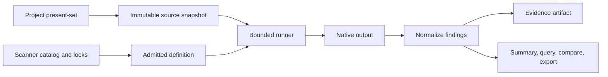

# Scan supply chain

The scan subsystem turns an immutable project snapshot plus an admitted scanner execution manifest into normalized findings and evidence. Engines, rules, exclusions, advisory data, drivers, parsers, mappers, and fingerprint schemes are all part of the result's provenance.

**See also:** [Scan findings](scan-findings.md) · [Grounding](grounding.md) · [Tools](tools.md) · [Security](security.md) · [Supported languages](supported-languages.md)

**Machine truth:** `lycaon/config/runtime/scanners/` · scanner catalogs and locks · `lycaon/internal/scan` · normalized scan OpenAPI schemas

## Why the supply chain is explicit

"The scanner found this" is not reproducible without knowing which engine and exact version ran, which driver and parser interpreted it, which rule/advisory set was active, which source snapshot and scope were scanned, which ignores and budgets affected presentation, and whether the run completed, degraded, or spilled output. The host binds those facts into one evidence record before any finding is used as a workflow gate. The scanner remains the subsystem owner for an invoked scan; snapshots, assessments, run-fact rows, and finding-set reducers are authorities within that operation, not additional owners.

## Run model



A run moves through queued/warming/running/terminal states. Snapshot publication may be visible as warming, but execution cannot claim the run until the immutable snapshot id is present.

### Cadence and generations

Proactive work is one durable series per project and selected scanner, with three distinct generations: the immutable generation currently running, one frozen dispatch being published, and one mutable desired generation that coalesces newer writes.

All scanners dispatched together form one security assessment and share one published snapshot. Writes never invalidate a completed result; it remains evidence for the generation it scanned. Watcher paths only invalidate the observation; the manifest diff derives the new generation's exact upserts and deletions. If a run finishes behind current source, the series schedules its single latest desired generation; intermediate write bursts merge into that demand rather than queueing paths or snapshots.

An assessment becomes current only when every required scanner has a complete-coverage finding set. A newer running or failed attempt remains visible separately and cannot erase the last trustworthy assessment. Static-analysis deltas stay path-scoped only when a compatible complete base exists; otherwise the result is partial. Large manifest drift promotes the desired generation to a full refresh. Continuous writes move the settle deadline only up to the configured maximum defer.

Failures and hard timeouts are terminal for their exact generation. The host does not retry deterministic scanner work automatically; a newer desired generation, an explicit workflow obligation, or a person starting another scan is a separate run with separate provenance.

## Source snapshot

The snapshot is content-addressed and project-scoped, capturing the admitted present-set rather than the whole filesystem. Source scans apply the host exclusion floor and project ignore behavior; dependency, container, and custom scans record their different scope explicitly. Worker scans bind to the worker workspace snapshot; promotion does not rewrite that evidence to claim it scanned the primary tree. Snapshot manifests are durable while referenced; content objects are protected while referenced and may later be reclaimed under the shared content budget.

## Scanner definition

A definition declares scanner id, driver, parser, mapper, scope kind, command/template, supported languages or ecosystems, required resources, limits, and version/integrity facts. Before enqueue, the host freezes the effective definition plus digests of the actual rule, exclusion, configuration, and engine bytes into `ScanExecutionManifest`; library engines use the running host executable bytes, bundled and external engines their selected executable artifact. The execution fingerprint hashes that manifest.

The runner compiles this into a closed execution plan. A project can enable or configure allowed fields but cannot replace the executable, parser, or trust classification through repository content. Scanner ids are catalog identity, not behavior switches: the selected definition supplies the engine class and parser, and code never infers them from id prefixes.

The engine owns parsing, bindings, intermediate representation, control flow, and taint/guard semantics. The host owns admissible inputs, execution, evidence validation, lifecycle, and audience policy. Framework recognition belongs in reviewed rules and engine models under catalog-controlled selection, not in host code: improving language semantics is engine work and improving security models is rule work.

## Engine inventory

The scanner catalog is the exact inventory of bundled engines and device-configured external scanner slots. A scanner explicitly selected for a job participates in that job's cadence regardless of driver kind; repository overlays cannot introduce the executable. This page does not repeat binaries, versions, language lists, or command lines, because those facts move atomically with the lock and driver. Each bundled binary or data snapshot has a pinned origin and digest, a license and notice mapping, platform availability, an update procedure, integrity verification before execution, and fixtures that exercise the production parser.

### Bundled Opengrep selection

The bundled Opengrep manifest (`config/runtime/scanners/bundled-manifest.yaml`) pins a released archive per supported platform: URL, exact digest and size, engine version, and source provenance. Development builds and desktop staging download that archive or reuse a verified local cache; a cache miss never compiles the engine. Source builds and engine releases belong to the separate [Painted Wolf Opengrep repository](https://github.com/paintedwolf-ai/paintedwolf-opengrep).

The consumer verifies the archive before extracting its fixed payload, then checks source membership, provenance, contracts, and platform qualification. The sidecar embeds the final executable and payload hashes, and runtime checks use that embedded identity, so editing sibling metadata cannot authorize changed executable bytes. `pw scan engines verify-bundled --root DIR` verifies a staged payload through the exact sidecar that will use it. The engine release signs the outer executable and embedded native components with Developer ID before publication; application bundling preserves those bytes, and the application is notarized by the release workflow without a separate engine submission.

The scanner's deployment target must agree across its platform report, runtime environment, and source runtime lock, and every native image's minimum OS must be at or below the application's minimum supported macOS version. The binary licensing catalog refers to the selected artifact; notice assembly derives version and corresponding-source location from the same pin.

Ordinary development needs no scanner override:

```sh
./task build:lycaon-dev
./task scan:opengrep:stage
```

`./task scan:opengrep:stage -- --offline` requires a verified cached artifact. `--archive /absolute/path/release.tar.gz` imports an archive only when it matches the checked-in pin. Corrupt cached content is refused; the cache retains the pinned outer archive alongside extracted files, and staging verifies the archive again, so an extracted directory alone is insufficient.

Select another qualified release with:

```sh
./task scan:opengrep:select -- --tag "$ENGINE_TAG" --expected-commit "$ENGINE_COMMIT" "https://github.com/paintedwolf-ai/paintedwolf-opengrep/releases/download/$ENGINE_TAG/release.json"
./task test:lycaon-rules
./task test:scanners
```

Selection authenticates the descriptor before accepting its hashes: it uses the GitHub CLI to verify repository and owner identity, release workflow, reviewed source and workflow commit, version tag, hosted runner, and immutable release membership for the descriptor and every archive, then admits the current platform's artifact before updating the manifest. Verification failure leaves the pin unchanged. The selector requires online verification; ordinary builds and offline staging use the checked-in pin and cache.

The manifest's `opengrep_selection` reference binds the producer commit, tag, descriptor digest, and retained evidence digest; its receipt is committed under `config/runtime/scanners/opengrep-attestations/`. Receipts never bypass verification when selecting a new release. Application packaging compares the bundled engine payload against the selection and publishes a separate `.opengrep.json` audit; a reviewed pin without selection evidence is labeled `reviewed-pin-only`, which is not an attestation claim.

The manifest currently pins a darwin/arm64 artifact, matching the public release platform; Linux and Windows are candidate platforms. The engine release workflow isolates compilation from Apple credentials, enforces its committed signer policy, and attests final release assets before draft creation. See the [release selection script](../scripts/select-opengrep-release.sh).

Development binaries accept `LYCAON_OPENGREP_CANDIDATE` pointing to an absolute directory containing the executable, provenance, and source lock; that selection verifies its own identity and fails without fallback. Release builds and release packaging reject it. For isolated conformance, `OPENGREP` and `OPENGREP_SHA256` select an explicit executable and pin its bytes; both are required together and cannot be combined with the candidate selector. Neither override supplies the normal build identity or authorizes a release artifact.

Legal inventories live in [Licensing](licensing.md); runtime inventory lives in the catalog.

## Rules and advisories

Static-analysis rules, ignore policy, and advisory databases update on different cadences from the engine, and their identities are recorded separately. Rules used as workflow gates must have known origin, license, and immutable shipped bytes. Advisory databases may refresh into a verified cache; a run records the database snapshot it used. Network failure leaves the last valid data in force or reports unavailable according to the scanner definition; it never turns an empty refresh into "zero vulnerabilities".

## Vendored gate rules

Vendored gate rules are reviewed source artifacts, not runtime downloads. Each rule directory records upstream origin, revision, license, and any host modification (`rules-provenance.yaml`); regeneration produces a reviewable diff and updates the integrity lock. Project rules may add or override only through the declared scanner overlay contract and trust ceiling; a repository cannot replace the host's minimum gate floor or change the parser or executable. Rule provenance is part of engine proof so a later report can distinguish identical rule ids from different rule sets.

## Scanner execution

The runner applies root/workspace confinement, declared environment only, bounded output, shared CPU admission and below-normal priority where supported, per-engine and global concurrency limits, explicit egress policy, deterministic result spill, and process-tree cancellation tied to the launched job. It never shells a catalog command through an ambient interpreter unless the driver contract declares that interpreter and validates its arguments.

Each definition declares a soft runtime limit, a hard runtime limit, weighted CPU units, and scanner-internal parallelism. Crossing the soft limit records and publishes `long_running` while the scan continues. A positive hard limit cancels only that launched process tree and records `timed_out`. The selected policy and start time are captured on the run, so later catalog edits cannot reinterpret its lifecycle. The bundled catalog (`scanners.yaml`) declares a **900-second soft limit** and **no hard limit** (`hard_limit_sec: 0`) for every bundled scanner, so repository size never decides whether a scan can finish.

The shared Opengrep invocation builder passes `--timeout 0` in both analysis modes (`intraprocedural`, `intrafile`), disabling the engine's per-rule wall timer, which discards coverage under host contention. The caller owns the whole-scan deadline and cancellation; conformance callers supply their own contention-scaled deadlines.

CPU-heavy Go library scanners run in managed below-normal child processes, keeping allocation, garbage collection, cancellation, and crashes outside the sidecar under the same typed driver/result contract. Weighted admission clamps an oversized request to the host CPU budget so it runs alone rather than waiting forever.

Cancellation records terminal `canceled` history with its provenance and reason. An equivalent enqueue loser records `superseded` and names the winning run. Neither reports a clean scan, and terminal rows are never resurrected.

## Output normalization

Every driver hands bytes to one registered parser that produces complete `SecurityFinding` rows; the host stamps trusted scanner identity, scope, and snapshot onto each row after parse. The execution manifest is captured once on the run's evidence proof ([Scan findings § Evidence binding](scan-findings.md#evidence-binding)).

Parser errors, skipped rules, partially parsed files, and unscanned targets become typed warnings and `partial` coverage; infrastructure or source failures become `unavailable`. Neither satisfies a clean gate. Engine limits on recursive contexts, collection shapes, aliases, or exception analysis are coverage limitations, not informational vulnerabilities; the default receipt groups them and full views keep the rows ([Scan findings § Agent summary](scan-findings.md#agent-summary)). Neither grouping nor an empty finding list converts partial coverage into clean coverage.

Each successful run publishes a finding set. A full run replaces the set. An incremental run removes findings under its exact upsert/deletion scope, adds new findings, and carries untouched findings from an execution-compatible base (complete or bounded coverage) at the snapshot its delta was derived from. Caller-supplied path lists carry no proven ancestor and remain partial; no compatible base means partial coverage rather than an invented full set. Cadence freezes execution identity before selecting scope. Changed rules, engine bytes, or configuration preserve the incremental base while making the prior full-pass authority stale; an explicitly requested full pass restores it.

## `scan_compare` (verify-fix diff)

Comparison proves how a finding set changed between two immutable inputs, separating new, resolved, and persisted findings after a fix.

Both runs must belong to the same project, be distinct and terminal-complete, carry authoritative finding sets with coverage that covers their generation (complete, or bounded with identical unobserved directories), name the same scanner, and have identical execution fingerprints and fingerprint schemes. Incompatible inputs are refused rather than rendered as findings appearing or disappearing; `internal/scan/compare.go` defines the `CompareReject` codes.

```text
baseline fingerprints vs candidate fingerprints
  candidate - baseline = new
  baseline - candidate = resolved
  intersection         = persisted
```

A resolved finding is evidence that the scanner no longer reports that identity under the candidate input, not proof that the issue is universally fixed. Verification reports keep both run handles.

## Workflow scan obligations and gates

A workflow phase binds a `WorkflowObligation` (`internal/scan/workflow_obligation.go`) with `categories` such as `security` or `secret`, an optional `full: true`, and a `gate`. With `full: true` the phase starts a complete pass of every admitted file by the selected scanners, bound to the run, and `gate: complete` (its default) demands coverage of the pass's generation; `gate: no_new` additionally requires no finding at or above `high` introduced since the run began. Without `full`, the phase uses automatic deltas and `gate: no_new` is its only gate. For a full pass, `gate: results_available` requires completed scanner executions while accepting normal partial coverage for explicit review and disclosure. Status reads the phase's declared gate and typed terminal, coverage, and finding-history facts; partial coverage fails the stricter `complete` and `no_new` gates.

A scan execution is reusable evidence, not work owned by its first requester. Assessment, workflow, and session bindings record every context using it. Adoption requires the same immutable snapshot, scanner id, target kind, target and deleted paths, execution fingerprint, and fingerprint scheme; time is not part of the decision. Terminal workflow delivery is durable and at-least-once: an interrupted refresh remains pending and is retried by the runner, including after restart, under a context independent of the scan lease.

Gate policy is flat catalog config in `gates.yaml` (`lycaon/config/runtime/scanners/`): `proactive_categories` (which categories the automatic deltas run), `landed_change` (path-scoped versus full-root rescan when a worker lands changes), `cadence` (`refresh_settle_ms`, `write_burst_settle_ms`, `max_defer_ms`, `reconcile_interval_ms`, and the `drift_min_paths`/`drift_ratio` thresholds that promote a delta to a refresh), `agent_budget` (guidance caps injected into the model), and `block_on` (the guidance-severity bands that fail a gate). A phase that wants broader coverage asks for more categories.

Ambient project-open scans are the same proactive-category runs. A workflow may adopt one only by recording its own binding after the full execution identity and current snapshot match; recency alone never satisfies a gate.

## Security scanners

External scanner processes are device resources managed under Settings (`security-scanners.yaml`). A slot names the executable/transport, parser, trust, limits, and probe command. Extension packs may require a known scanner id but cannot install, enable, or redefine the process. Projects may enable or disable admitted ids and set fields the slot marks project-scoped; they cannot supply commands or output parsers.

### Probing and lifecycle

`ProbeScanner` (`internal/scan/catalog/probe.go`) is an on-demand, uncached check: it confirms the declared executable is on `PATH`, runs the catalog's `--version`-class probe command under a 10-second timeout, and reports the binary's own version line or the failure reason. Every call re-probes the live host, so a swapped binary shows up on the next check rather than behind a stale result.

The host starts a process only for an admitted run, captures its exact definition revision, and stops only the process tree it launched. Shared daemons connect through an explicit provider/slot contract, never discovered and killed by name.

### Scanner requirements

An extension contribution may name required scanner ids. A failed probe blocks only the dependent contribution and links to Security scanners; it does not invalidate the extension and installs nothing.

## Advisory cache

Advisory data is an ephemeral, rebuildable cache with digested snapshot metadata. Refresh is bounded to declared sources and follows device egress policy. Runs record the data revision used; clearing the cache removes local bytes and readiness without rewriting historical findings.

## Ignores and project overlay

An ignore is reviewed data in the project's committed `ignores.yaml`: host-owned predicates plus a stated reason. It narrows guidance and gates; it never erases the raw finding or engine proof and never removes the finding from the set the next comparison reads. Device policy may refuse classes of ignore for mandatory release gates. Every applied ignore is attributable in full result views, and decisions export as SARIF `suppressions[]` and, where they name an advisory, as OpenVEX statements. The predicate contract and routes are in [Scan findings § Ignoring a finding](scan-findings.md#ignoring-a-finding).

## Bundled rule selection

`opengrep-gates.yaml` names the reviewed rule files and the analysis mode. The runtime compiles those files into one content-addressed bundle inside the private scan output directory, rejects duplicate rule ids, and preserves YAML anchor scopes across files; stable rule ids are independent of the artifact filename. The definition fingerprint also binds the host executable, since source projections and result interpretation execute in the adapter. The corpus runner uses the same compiler and projections.

Production and conformance share a typed invocation contract. The selected analysis mode is `intrafile`, bound into definition/execution identity and SAST engine proof; alternative modes are explicit evaluation choices, not environment overrides. The driver requests native data-flow traces and reads the complete JSON report from the private output file; a process with an unexpected exit code cannot establish a successful scan by leaving parseable JSON behind.

Engine revisions and analysis options are qualified separately using the language corpus, vulnerable and safe helper controls, and ordinary-project fixtures; qualification must exercise the final signed artifact. Intrafile analysis resolves supported same-file calls; it does not establish cross-file flows, dynamic callback identity, or unmodeled framework behavior. Changing either the engine or its semantic options changes the execution identity.

Rules must demonstrate a security problem and distinguish safe alternatives. The selection excludes prose markers, correctly handled errors with TODO comments, normal command arguments, ordinary temporary directories, and optional hardening that cannot be inferred from a local file. Terraform checks model explicit resource configuration, including standalone ingress resources and IAM Allow versus Deny, and do not infer missing S3 encryption from a bucket block alone.

Generic findings are suppressed only when their entire span is inside parser-recognized comments or literal text; recovered syntax errors and incomplete parses cannot justify suppression, and executable interpolation stays in scope. HTML and Vue scripts are scanned through compact projections with explicit byte-coordinate maps, and every primary and nested span maps back to the original source before bounds validation. Classic HTML scripts share their document scope; separate modules and Vue script blocks are isolated. Inert template and `noscript` content, external HTML scripts, and data-only blocks are not projected. HTML script types follow the browser MIME-essence rules (legacy JavaScript aliases, first-attribute precedence; parameters, whitespace-only types, and non-ASCII lookalikes do not make data executable), while Vue script blocks use compiler semantics, so an HTML MIME `type` does not make a Vue script inert. Coverage-only observations are internal target-selection records, discarded before findings and warnings publish. Parser failures remain visible coverage gaps; unsupported embedded languages produce file limitations while preserving findings from other files; snapshot read failures and invalid evidence paths remain run failures. References: the [Vue SFC parser](https://github.com/vuejs/core/blob/v3.5.21/packages/compiler-sfc/src/parse.ts), the [script preparation algorithm](https://html.spec.whatwg.org/multipage/scripting.html#prepare-the-script-element), and [JavaScript MIME types](https://mimesniff.spec.whatwg.org/#javascript-mime-type).

`./task test:lycaon-rules` runs the active selection through the conformance runner (`cmd/opengrep-conformance`) against isolated vulnerable, safe, commented, and executable-after-comment examples, vendor rules included, rejects unexpected diagnostics and unscanned cases, and fails when the engine is unavailable. Pinned source trees remain available for provenance; directory presence does not activate a rule.

### Default precision policy

The default selection prioritizes actionable security evidence over advisory volume. The catalog and behavioral corpus define the exact active selection.

| Source of noise | Default behavior |
|-----------------|------------------|
| Weak hashes used for checksums; permissive creation modes subject to `umask` | No context-free finding |
| Public assets, development servers, optional isolation or retention policy | No policy assumption promoted into a vulnerability |
| Ordinary eval, serialization, encoded command transport, or local CLI configuration | Require a modeled risky boundary, or omit the rule |
| Browser fetches and HTTP requests with a fixed authority and variable query data | Do not label browser activity or path/query data as SSRF |
| Bound SQL arrays, numeric conversions, shell escaping | Model the safe operation for its specific sink; do not reuse an HTML sanitizer for SQL |
| Custom TLS callbacks | Flag absent, nil, or explicit accept-all verification; defer unknown callback implementations |
| Memory lifetime | Withhold syntactic C/C++ lifetime and allocation/deletion mismatch rules; stack-address checks remain |
| API name collisions | Resolve supported import forms and exclude modeled local shadowing |
| Android debug manifests | Check application manifests outside explicit debug/test variants |

The language corpus keeps retired examples as silent regressions and adds paired safe/unsafe controls. A clean run is evidence about these models and inputs, not proof that an application is vulnerability-free; unknown wrappers and cross-file flows need additional modeling, not a lower reporting threshold. Background: [Python's hashlib API](https://docs.python.org/3/library/hashlib.html), Go's [custom TLS verification](https://pkg.go.dev/crypto/tls), and Rails' [bound array and hash conditions](https://guides.rubyonrails.org/v7.2/active_record_querying.html).

The [engine repository](https://github.com/paintedwolf-ai/paintedwolf-opengrep) owns source builds and engine contracts; the [release selection script](../scripts/select-opengrep-release.sh) controls artifact selection. Evidence for an experimental revision does not qualify the selected release.

## Authoring and updates

Add or change the catalog definition and lock; record origin, license, version, and integrity; exercise the real runner and parser with fixtures, including empty, malformed, timeout, and cancellation cases; verify scope and snapshot binding, compare compatibility, and evidence proof; then regenerate legal and runtime inventories through repository tasks ([Dev tasks](dev-tasks.md)).

## Invariants

- Every result binds engine, definition, rules/data, scope, and immutable input.
- Reuse requires exact source, scanner, scope, and execution identity; recency is never authority.
- Assessment, workflow, and session bindings may share one compatible execution, and terminal workflow delivery is retried until acknowledged.
- Catalog data defines scanner identity and behavior; projects cannot install or redefine scanner processes.
- Empty, unavailable, partial, and clean are distinct terminal states, and a completed generation is never relabeled stale because newer source exists.
- Proactive series retain at most one running and one coalesced desired generation per scanner.
- Soft runtime is observable delay; only a catalog-authored or user-selected hard limit terminates a run.
- Terminal history is immutable: cancellation, supersession, timeout, failure, and completion are distinct outcomes.
- Comparison refuses incompatible evidence.
- Watcher observations never become executable targets without source-manifest reconciliation.
- An ignore never erases raw provenance or removes a finding from the set the next comparison reads.
- Legal and runtime inventories are machine-generated.
