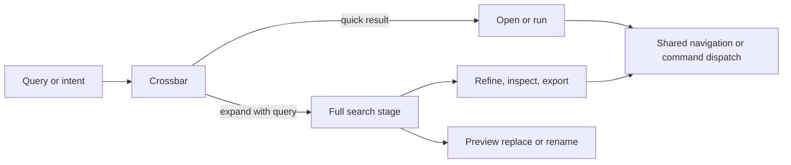

# Search

Search is one system with two depths: Crossbar for fast navigation and actions, and a full stage for investigation, filtering, export, and mutation preview.

**See also:** [Grounding](grounding.md) · [Projects](projects.md) · [Den](den.md) · [Source navigation](source-navigation.md) · [In-view find](den-in-view-find.md) · [Keyboard shortcuts](keyboard-shortcuts.md)

**Machine truth:** [`lycaon/internal/search`](../lycaon/internal/search) (issue codes in `router.go`, budgets in `code_budget.go`, replace states in `replace.go`) · [`lycaon/internal/symbolsearch/search.go`](../lycaon/internal/symbolsearch/search.go) and [`sourceapi/symbol_search.go`](../lycaon/internal/api/sourceapi/symbol_search.go) (the symbol leg) · [`lycaon/internal/contribution`](../lycaon/internal/contribution) · [`lycaon-den/src/search/`](../lycaon-den/src/search) · OpenAPI search paths and schemas

The shared model matters more than the two surfaces. A query keeps its meaning when the user expands it, a result opens through the same navigation orchestrator everywhere, and commands come from the same contribution frame as menus and shortcuts.

## Product family — front door + depth

| Surface | Optimized for | Deliberately omits |
|---|---|---|
| Crossbar | a few keystrokes, mixed results, keyboard completion | large result sets, mutation, complex filtering |
| Full search | investigation, durable query shape, evidence, export, safe bulk action | Crossbar behavior |
| In-view find | the content already visible in one surface | federation and project-wide mutation |

These remain separate because their safety and latency budgets differ.

## Entry points

Search can begin from the global shortcut, application chrome, a contextual action, or a query handed off from another surface. Every entry point produces the same query state and optional origin metadata. Contextual entry points may seed scope, path, symbol, finding, or evidence; they may not bypass the ordinary parser or grant a result extra authority.

## Crossbar

The box mixes contributed commands, navigation destinations, recent and known projects, sessions and workflow artifacts, and source and evidence hits when query length and latency permit. It shows a small ranked set and preserves keyboard focus. Mode chips narrow the family without changing the underlying query.

The result families are one vocabulary, `SEARCH_RESULT_TYPES` in [`search-result-types.ts`](../lycaon-den/src/search/search-result-types.ts): Messages, Files, Symbols, Code, and Evidence. Each is a Crossbar tab, a section of Everything, and a selector in the full stage, and each names the host kinds it holds, so the three surfaces cannot disagree about what a family contains.

### What a query can name

A leading character picks an arm, read once by `crossbarArm` in [`crossbar-model.ts`](../lycaon-den/src/search/crossbar-model.ts): `>` lists actions (the Actions tab; choosing another tab drops the `>`), `@` lists the active file's symbols, `#` searches the Symbols tab (choosing another tab drops the `#` too), and `:42` or `:42:5` jumps within the file the editor shows. To search for text that starts with one of these characters, quote it.

Any row that opens source (a line jump, a file, a pasted location, a symbol, or a file hit) places the caret at its target and moves keyboard focus into the opened editor. The Search view's source opens do the same.

Everything else is a search, and a file query is **any portion of a file's full path**, including the root folder's own path: `release`, `docs/oper`, `/docs/operations/release.md`, or an absolute, `~/`, or `file://` path. The host reads the query, not Den: `ParseSourceQuery` ([`source_query.go`](../lycaon/internal/projectsource/source_query.go)) removes quotes, backticks, and terminal escapes, then reads a location (`:12:3`, `:10-20`, `#L12`, `#L10-L20`, `(12,3)`). A pasted compiler, test, or stack-trace line contributes only its location, and a Go test's package directory joins the file name after it. A code host link resolves in the root checked out from that repository; a development server URL resolves by its path. A path that matches nothing is retried without its leading directories, so a path from a CI runner, another clone, or a Go module still finds the local file. An absolute path outside every root offers to open its folder as a project. The host ranks files and returns what each matched; Den renders host order and reorders locally only when the box is empty, putting recent files first. A one-word query also finds declarations by name ([Symbol leg](#symbol-leg)), which Everything lists in their own section and the Symbols tab lists alone.

In Everything, a single token that could be a revision (a commit id, a branch, or a range such as `main..HEAD`) asks the host to resolve it. Only a comparison the host resolved gets a **Changes** row, which opens the Diffs page on it; see [Git](git.md). A setting's name ("font size", "dark mode") matches the settings registry and lands on that setting's row ([Den](den.md)).

Everything never pools federated hits into one bucket. Hits are sectioned by family (Files, Symbols, Code, Messages, Evidence, then any other kind), each with its own small cap, so a burst of filename matches cannot push every code line off the box. Within a section the host's order stands. A section that was cut offers **See all**, which hands the query to the full stage with that group selected; **Show all results** hands off the whole query. When the local file arm is listing files, federated file hits stay out of the sections rather than appearing twice.

The visible list always ends on a row boundary: when rows overflow, the list is fitted to the last whole row that fits, and thin edge fades say the list continues.

**An empty box is never allowed to mean "no match" by default.** Three states would otherwise render identically, so each says which it is: a query the host rejected shows the host's parse message, a search that could not finish says so and invites a retry, and files still being indexed indicate incomplete coverage and refresh results automatically. The file arm carries its own failure line, because it is a separate request that can fail while the search arm succeeded.

Both search views show available matches before indexing finishes, with one compact coverage note that combines file-index coverage and federated issues. Pending indexing is distinct from coverage stopped by a budget; only ongoing work implies later results. Coverage stays visible while a replacement response is pending; a completed response updates or removes the note. Routine refreshes of an already complete index run without a status line.

### Command membership

Commands are present by default because the command declaration is the behavioral source and Crossbar is one projection; `palette: false` is the explicit opt-out. Category and keywords improve ranking but do not decide whether the command exists in the box. A command's title, condition, enabled state, and typed input come from the current contribution frame, and selecting it uses the same host invocation path as a menu or shortcut. Commands that require declared input open the shared input flow.

### Extension sources

Extension-backed search is an explicit lane, not part of Everything federation. Installed sources appear after a **Sources** label and may also be entered with their declared `<prefix>:` token. Opening the box or typing an unprefixed query performs zero extension-provider calls.

Once selected, a source contributes one provider-attributed lane. The host applies minimum length, debounce, cancellation, timeout, response caps, strict result projection, and stale-frame rejection. Provider scores never mix with local ranking, and returned rows remain ephemeral until an authoritative subsystem deliberately ingests them. Selecting a row activates the source's compiled command through the ordinary typed form, authority, idempotency, and result path.

### Ranking

Ranking is deterministic within a catalog and result generation. It combines exact and prefix matches before fuzzy matches; title before secondary keywords; current project and active context before unrelated scope; recent use as a bounded tie-breaker; and stable identity as the final tie-breaker. Availability and relevance are separate: a disabled command or inaccessible destination is omitted or shown with a reason; ranking cannot make it executable.

### Progressive expand

The box starts with low-cost local projections and adds federated results when the query is specific enough, but never blocks command or navigation results on a slow source. Expanding to the full stage carries the text, selected mode, match flags, and origin. Dismissal restores focus to the invoking surface; running a command follows that command's declared focus and navigation result.

## Navigating to a hit

Search does not open files, URLs, sessions, or settings directly. It emits a typed target to the destination controller: source hits use `openSourceLocation`, URL hits pass through the external-link warning, and worker paths retain their worker scope. Indexed files and symbols carry their attached root through activation, and quick-open recency uses root and path together. This single opening path keeps encoding, root resolution, revisions, browser confirmation, and external-editor behavior consistent. See [Source navigation](source-navigation.md).

## Full search stage

The full stage provides query parsing and visible filters, larger paged result sets, result-family counts and source status, pivots into related scope, evidence inspection and opening in chat, export, and replace and rename previews.

Tool details summarize the recorded input or output, its host-projected context, and any evidence handle. **Input in Files** and **Output in Files** open the recorded tool pane in a tool tab; search snippets are bounded index excerpts, never the tab's full content. Opening resolves the call in its originating session, including worker sessions. Missing history reports an error and leaves the result selected. Tool chicklets use the same Files destination; their search pivot finds other calls to the same tool in the originating chat, excluding the current call.

The selector row contains result families only: one selector per entry in `SEARCH_RESULT_TYPES`, the same list the Crossbar tabs and the filter model read, so the row and the vocabulary cannot drift. A selector adds the positive `kind:` values of every kind its family holds (Evidence is seven), all families' kinds compose as one OR group, and a family lights only when all of its kinds are selected. **Code** is the default for a project-scoped entry. The single **Filter** control handles every other narrowing dimension (verification status, source, trust, include/exclude file patterns); clearing it preserves the selected result types and scope.

Client-only navigation and action lanes may appear alongside host results, but they remain labeled and dispatch through their controllers; they are not written into the durable search projection.

## Scope model

The default is global within the data the current host may expose. Optional filters narrow by project, root, session, workflow, result kind, path, language, severity, time, or status. Scope is explicit data: the host does not infer project intent from prose, and Den does not silently insert a project filter because a project is focused. A contextual entry point may visibly seed one.

Visible search surfaces subscribe to source-query invalidation. Source events and event continuity gaps use the same channel; bursts coalesce under a bounded scheduler. Hidden surfaces release their subscriptions and revalidate when activated again. A background refresh retains usable results while request identity and cancellation fence obsolete responses. Replace review keeps its selected hunks until the person asks for a new preview.

**The origin project is part of the request's identity.** Both surfaces key the presented answer on query, origin project, and match options together, so switching projects under an open search invalidates what is on screen exactly as editing the query does: the full stage re-runs against the new project, and the box clears its hits and re-runs.

## Query language

Plain text is always valid and never fails to parse. Anything pasted into the box (a sentence, a line of code, a URL, a stray quote or bracket) is searched for, the way an editor's find box would take it. Bare words match in any order; punctuation outside a word separates words. A quoted term is a phrase, matched contiguously on the code leg and as an FTS phrase on the store leg. A quote left open runs to the end of the query, so a phrase narrows as it is typed. The query bar says so when several bare words are typed without a phrase.

Structure is only what is spelled as structure. Operators are uppercase `AND`, `OR`, `NOT` and parentheses; lowercase forms are ordinary words. An operator with nothing to join is dropped, and an unclosed group runs to the end of the query. `NOT` excludes a word or a filter. `word:value` with a non-vocabulary word stays searchable prose (URLs and `Error:` fragments must not fail closed). Case, whole-word, and regex toggles apply to every text term, including an excluded one: on the store leg an excluded term is settled per row rather than by the case-folded FTS candidate set. A term the FTS index cannot hold (bare punctuation such as `//` or `->`) is applied to row text instead of matching nothing.

Recognized fields validate closed vocabularies: `kind:bogus` is a positional parse error naming the allowed values, not a silent zero-result query. A conjunction that is provably empty (two required values of a single-valued field, or a value both required and negated) is rejected with a pointer to `OR`; facet multi-select composes the OR group instead. `path:` matches the full path, a directory prefix, or the basename, case-insensitively, with `*` wildcards; a trailing slash selects directory contents, including descendants, without matching a file with the directory name. The code and store legs share one semantics, locked by a parity test.

The search parser and OpenAPI schemas define the exact field vocabulary and wire representation. Only the structured layer can raise an error: a recognized field with an empty or out-of-vocabulary value, an impossible conjunction, or a query with nothing positive to find. Compile errors reach the wire with reason, offset, field, and taxonomy in `details`, so the query bar can point at the offending token. Query fields select already authorized data; they do not widen what the caller can see.

Content scans skip dependency and build trees using the scanners path-exclude catalog, the same floor SAST scans use. A query that names such a tree (a `path:` filter or include glob into it) re-admits exactly the named pattern, **to content scanning only**: the file-name arm keeps the full exclusion set, so `path:node_modules` finds text inside those files without turning a bare word into thousands of filename hits. Files the engine could not search (unreadable, or over the size cap) are counted on the response as `files_skipped`, never silently absent.

### Code leg

The code leg and replace preview pin the catalog's persisted SQLite file index and visit regular files in bounded, path-ordered pages. Root IDs come from the attached-root registry and remain present through compilation, hits, exports, and file activation. Continuations carry a ranked address and the root-generation fingerprint, so later pages neither accumulate offsets in memory nor cross generations.

**One index per root, read through two projections.** Code search and the file picker want different files out of the same tree (a match inside `.github/` is noise in a result list, while `.github/workflows/ci.yml` is a file someone means to open), but that difference is a predicate on the read, not a second walk. The index marks each admitted path hidden or not; the code leg reads the visible projection by default and the picker reads all of them. Explicit positive `path:` filters and include globs admit matching hidden files to code search and replace preview; negative filters do not widen discovery. Subtree totals and representative children are aggregates a partial walk cannot state, so orientation keeps its own per-scope generation.

**A cold root answers before its walk ends.** Metadata enrichment resumes a persisted frontier and publishes readable batches; during initial discovery it publishes partial results before yielding to tree preparation. See [Repository scale](source-navigation.md#repository-scale). A generation that does not yet cover the tree is readable and says so: the response reports `catalog_incomplete` with the count of such roots, and the hits in it are real. `catalog_warming` is the narrower fact that a root has published nothing yet. A pass that rescans changed subtrees leaves coverage intact, so ordinary edits do not make a settled repository read as half-indexed.

**Agent exclusions are independent of human search.** Project exclusions in `.paintedwolf/source-scope.yaml` apply to agent capture, not to a person's search or file picker. The host chooses the audience; there is no request flag that promotes an agent query to human access. Shared metadata and content acceleration remain subject to the consumer's eligibility checks, and warming the index through human search cannot widen an agent's context.

**Source directories take priority.** The bundled directory-priority catalog and enabled project ignore rules defer likely build output, dependencies, and caches without hiding them; a name match determines order, not authority. Default traversal has no directory, subtree, or total-entry ceiling; memory caches and work batches are bounded independently of repository size. If a device or trusted project explicitly chooses observation caps, a directory a cap refuses is recorded with the bound that refused it (`directory_cap`, `subtree_cap`, `walk_budget`), and their count reaches the response as `catalog_bounded`. Unlike the warming reasons, asking again does not resolve it.

A completed generation remains queryable while refresh runs and after a sidecar restart. Metadata discovery yields shared admission between bounded batches, so background work cannot hold the metadata lane for an entire walk.

File-name matches are collected before content work. Content candidate selection probes reusable per-file, case-folded 3-gram blooms; a missing observation remains a candidate and is scanned directly. One bounded preparation job per scope builds missing blooms in pages, survives a search request ending, and drains with the catalog. Per-file retention is byte-bounded; eviction changes performance, never coverage. Known writes invalidate touched observations, including edits that preserve size and mtime; changes without a path invalidate all content observations for that root. Regex and literal matching still verify live bytes.

If a direct scan reaches its deadline while content preparation is in flight, the response reports `index_warming` as well as `time_budget`. Both surfaces keep useful results and retry transient indexing on a backing-off schedule (750 ms doubling to a 5 s ceiling, [`search-refresh.ts`](../lycaon-den/src/search/search-refresh.ts)) for as long as the surface remains open. `catalog_incomplete` schedules the same ladder, so results a still-filling index has not reached yet arrive without the reader asking again. A query change or hidden surface aborts its request and cancels its retry; there is no fixed retry count that strands a large repository.

Readable generations and completeness are separate facts. `catalog_refreshing` keeps results refreshing even when the existing generation is readable. `catalog_failed` reports directory read failures; `catalog_refresh_failed` reports failure to refresh a readable generation. An unavailable root contributes `executor_error` while other roots still return matches. These limitations remain visible alongside nonempty results, and counts remain lower bounds. Transient discovery schedules retries; a terminal coverage issue or failed request does not. A failed refresh preserves the last usable results and shows its failure.

The full pane requests an interactive first answer, renders it immediately, and refines a limited or warming answer with the complete budget in the background. Each budget carries a wall clock: `interactive` two seconds, `complete` ten. When it ends with files unscanned, the response keeps the hits found so far and reports `time_budget`; status is `partial`. One `component=search "search done"` log line per request carries the leg timings and the code leg's counters.

Search is distinct from security scanning. A search hit says content matched a query. A finding says a scanner produced a normalized security observation with provenance and severity.

## Symbol leg

Symbol discovery preserves structured coverage from content search through declaration confirmation. Warming, source observation gaps, unreadable files, and exhausted request budgets have different recovery semantics. Request budgets allocate time to discovery, abbreviation, and outlining; disposable query progress must bind both to catalog generation and content invalidation, so retrying can advance without treating old file bytes as current.

Declarations are a federated result kind, `kind:symbol`, found by a third leg beside the store and code legs. A query gets the leg when it has exactly one positive term of at least two characters with no whitespace, and regex mode is off: declaration names have no spaces, so a phrase or several words has no name to look for. `kind:symbol` alone runs only this leg, and `NOT kind:symbol` rules it out. Only declarations answer: functions, methods, types, classes, and constants. A mention is never a result, and neither is a Markdown heading.

**Names rank by how they match, ignoring case.** Exact names come first, with the query's own spelling ahead of other casings; then prefixes; then matches that begin at a word of the name (`Config` in `ParseConfig`, `parse_config`, or `HTTPServer`'s `Server`); then abbreviations, where each typed character continues the current word or begins a later one and at least one begins a later word (`pc` and `ParseCfg` both find `ParseConfig`; `cfg` alone does not find `Config`); then any other substring. Within a tier, types and classes precede functions, then methods, then constants; then shallower paths, path, root order, and line. A hit's `title` is the name, `title_highlights` the code point ranges that matched, `symbol_kind` the declaration kind, and `snippet` the declaration line. Scores keep the code family's scale: an exact name ranks just above an exact file name, and every name match ranks above plain content lines.

**The query's other parts apply as they do to code.** `path:` filters, negated terms (matched against the name), and include and exclude globs narrow the declarations; a path that names a hidden tree admits it, as on the code leg. Match case keeps only names whose matched characters spell the query as typed; whole word keeps only whole names.

**Discovery is live, bounded, and shared with Go to definition.** There is no durable symbol index. Content search nominates files under the query's path filters and globs; outline analysis confirms declarations. Symbol discovery nominates each file once per pass, so repeated references in one file cannot exhaust a line budget before a later declaration. Literal discovery precedes abbreviation discovery, which runs only when no exact name exists and better tiers have not filled the page. Whole-word requests use whole-word discovery. Projects run concurrently under the leg's total clock, origin first; waiting projects honor that clock too. Dependency and build exclusions come from the scanner catalog.

The plan allocates three eighths of its clock to literal discovery, one eighth to abbreviations, and half to outlining. Interactive mode therefore uses 750 ms, 250 ms, and one second; complete mode uses 3.75 seconds, 1.25 seconds, and five seconds. The outer two- or ten-second deadline still bounds the whole leg. Each request outlines at most 48 files per project, and a discovery batch nominates at most 1,000 files. Telemetry reports discovery and outline work separately.

**Retries advance disposable progress.** The symbol executor retains at most 16 project-specific query projections, evicts least-recently-used inactive entries, and expires entries after two minutes idle. The first 16 projects in stable plan order may retain progress; later projects still search in the foreground, but unfinished work returns a terminal `symbol_budget` with limit 16 instead of promising a resumable retry. That limit counts retained project projections, not declarations. A foreground search that finishes outside this capacity remains complete. A projection contains a root/path frontier per discovery pass, one pending candidate batch, terminal coverage gaps, and the strongest 201 declarations (one result-limit probe), bounded to one MiB of retained declaration data. It holds no catalog reader or background job. Concurrent requests for the same query serialize with cancelable waiting; interactive and complete requests share progress. The query identity includes the typed expression tree, flags, exclusions, dependency scope, project, and attached roots. Catalog instance or revision changes, or content epochs invalidate the entire projection. A content change during a request discards its answer and asks for refinement. Structural membership alone is never proof that retained file bytes remain current.

Symbol filters admit declarations before ranking, retention, and abbreviation page limits, so excluded declarations cannot consume an admissible result’s capacity. An interactive search keeps 16 declarations per project and a complete one 200. Cutting those results or deferring abbreviation search behind a full page yields `result_limit`. Discovery coverage keeps its original reasons and counts: warming and refreshing can recover automatically, while observation caps and unreadable files remain visible. A resumable request slice yields `symbol_pending`; Den continues visible symbol searches with bounded backoff until they finish. `symbol_budget` denotes a terminal symbol resource bound, not background warming. A complete foreground scan remains complete even when Bloom preparation is waiting for admission. Canceling a request does not cancel shared preparation; catalog retirement and shutdown drain that work.

## Federation architecture

The host implements built-in federation because it is authoritative for project roots, durable sessions, evidence, findings, and authorization. Built-in sources return typed candidates with stable identities and source-local scores; the federation layer merges, ranks, caps, and projects the result as one generation. Explicit extension sources stay in a separate lane.

A generation id prevents late pages from an older query being merged into a newer one. Partial source failure is reported with the successful results. Den may add client-only destinations and commands after the host result arrives; it never rewrites host scores or presents a client guess as host evidence.

## Store projection

Search uses a rebuildable projection over authoritative data. Project records, sessions, messages, workflow artifacts, evidence, findings, and source metadata remain authoritative in their domains; search stores only the shape needed to locate them. Projection writes follow the authoritative transaction where possible and carry stable source identity. Startup reconciliation and bounded background repair handle missed projection work. Rebuilding search cannot change the underlying record.

## Recall

`recall` is the agent-facing lookup over the same durable projection. It returns bounded, citable records instead of copying an entire historical transcript into context.

Stable addresses distinguish three states: present and readable; known but removed, represented by a tombstone; and never known. That distinction makes an old citation explainable after retention or deletion. Tombstones retain identity but no removed content.

Recall respects current session, project, and worker scope. A result handle is not a capability: opening the referenced content still passes through the read operation boundary. Tool rows index the evidence handle minted with the result in `handle` and the producing tool in `tool`, because they answer two questions.

Source locations returned through recall retain their original message's project, root, and worker identity; recall obtains that metadata through the message IDs already carried by the evidence index. Only locations represented in the delivered hit enter the next model request's source context. See [Prose-derived references](source-navigation.md#prose-derived-references).

When an agent should reach for it, what each `resolution` means, and where the host points at it is the agent-facing contract in [Tools § Recall](tools.md#recall).

## Evidence and chat integration

Search results can be attached to a prompt as references. The attachment records stable identity and an excerpt; the host reacquires authoritative content when needed, which keeps the transcript small and makes stale or removed evidence visible. Pivots preserve query intent while changing one explicit dimension. "Open in chat" carries the selected references and query, not a synthetic claim about what they prove.

## Export

Export is a representation of one completed result generation. It records query, filters, generation metadata, source status, and the rows actually exported, and does not continue fetching after the user confirms. The export request carries the same match flags as the search request (regex, case, whole-word, include/exclude globs), so the file reproduces what the view showed.

## Match flags and replace across files

Case, whole-word, and regular-expression flags are part of query state and survive the bridge from the box or in-view find to the full stage.

Include/exclude globs are compiled before searching or planning replacements. They support brace alternatives such as `**/*.{go,ts}`. Malformed patterns return a match error; blank entries are ignored, and exclusions take precedence. Ordered file scans bound their lookahead so a slow file cannot accumulate the rest of the repository's results in memory. Code-line matches are capped per file by the request's result budget.

### Replace — two-phase, revision-guarded

Project-wide replacement is not an immediate search action:

1. search computes candidate matches;
2. preview records file revisions and proposed edits;
3. the user reviews the affected files and hunks;
4. apply rechecks every revision;
5. any drift fails the affected file rather than overwriting unseen changes.

The preview is evidence of what was reviewed, not permission to apply against different bytes.

Preview reports one of three states. `preparing` means a selected root is still discovering or refreshing: the request returns coverage issues with no reviewable files, and Den retries with backoff while showing a cancelable status. `ready` means discovery has settled without reported omissions and the selected text files were scanned within the preview caps. `limited` means a cap, directory failure, discovery budget, root failure, or skipped file left a known gap: the files it could review are exposed, Apply all is disabled, and individually selected files remain revision-guarded and applicable. Discovery finishing alone does not establish complete coverage. An empty preview says "No replaceable matches" only for a current `ready` response.

Cancellation, input changes, and hiding the view abort the request and retry timer; shared catalog discovery continues for other consumers. Preparation cannot publish an older request's hunks or enable replacement after its inputs change. Coverage describes the pinned catalog generation and live bytes examined during the request, not an atomic filesystem snapshot; files created after the preview require a new preview.

Preview and apply retain the parsed text expression and its scope. Quoted text keeps its whitespace and literal asterisks; `path:` filters and include/exclude globs narrow both phases. Replacement is confined to the intersection of the query's project scope and the origin project. Literal replacements preserve dollar signs; only regex mode expands capture references. File-only queries are rejected by replacement because they select filenames, not content. An unquoted `*` is a wildcard only outside regex mode.

Changing the query, replacement, project, or match options immediately disables apply until the corresponding preview arrives. The applied request is the immutable request paired with that preview, including for per-file actions on a truncated preview. A late response for an older request cannot make an action ready.

Revert follows the batch's retained file history, not the current presentation lens. It restores the before-image only if the file still matches the batch's after-image, with the same hash guard checked at the write door. Later edits are skipped and reported. Refreshing an open buffer after replace or revert cannot overwrite edits or a reopened editing session that appeared while the source read was in flight.

### Replace and rename doors

Rename is not a symbol-resolved operation on either of its lanes. There is no LSP or symbol index behind it: the target comes from CodeMirror's plain word-at-cursor lookup (`state.wordAt`, [`editor-symbol-target.ts`](../lycaon-den/src/files/editor/editor-symbol-target.ts)). The rename card's **This file / Everywhere** scope picks between two different machines.

**Everywhere is Replace.** It arms the replace flow with `wholeWord: true` and the picked word as `renameFrom` ([`replace-arm.ts`](../lycaon-den/src/search/replace-arm.ts)), then runs the ordinary project-wide replace (`search.replaceInProject`), landing in Search for the same review and revision-guarded apply. It carries the same risk as any whole-word text replace: it can match an unrelated identifier with the same spelling, and it has no notion of scope (import aliasing, shadowing, string contents). The preview step is the only safety net.

**This file is a model edit.** It never reaches Search. The card dispatches a declared editor action; the host renders its pack prompt and the change lands through the normal tool write path as a post-apply hunk review, like inline edit and the selection verbs ([files-stage.md § Inline edit and selection verbs](files-stage.md#inline-edit-and-selection-verbs)). Its failure mode is the opposite one: it can respect scope a text replace cannot, and it can also change bytes no whole-word match would have touched.

## Safety

- Search only narrows data already visible to the caller.
- Result handles do not grant read or write authority.
- External links retain confirmation and scheme checks.
- Worker and project paths keep their scope through open and reveal.
- Bulk mutations require preview and revision proof.
- Partial failure and stale generations remain visible.
- Exact fields, caps, and route shapes live in machine-readable contracts.
