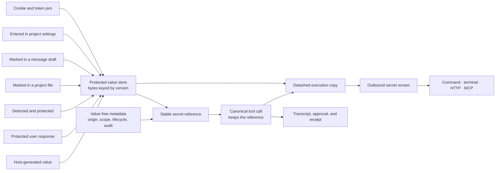
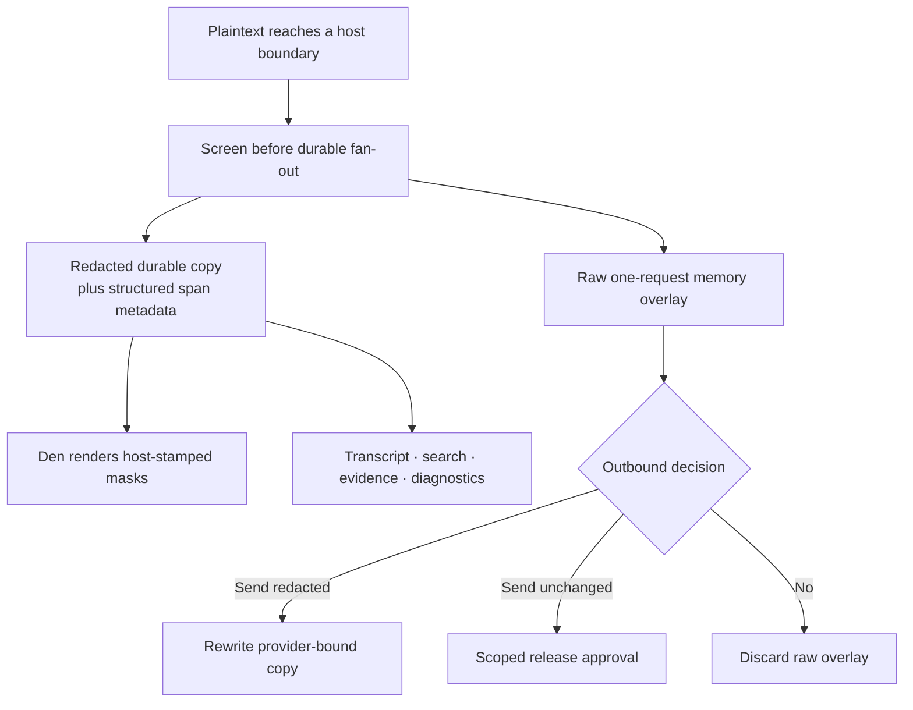

# Secrets and redaction

Painted Wolf Code separates protected credential bytes from the references an agent can carry. The host may generate, accept, detect, or capture a value; the model receives a value-free `{{paintedwolf-secret:…}}` reference and supported outbound tools resolve that reference only inside a screened execution copy.

**See also:** [Security](security.md) · [Authorization](authorization.md) · [Tools](tools.md#managed-secret-references) · [Files stage](files-stage.md#secret-spans) · [Prompt assembly](prompt-assembly.md#secret-hygiene-boundary) · [Privacy](privacy.md)

**Machine truth:** [`secretcap`](../lycaon/internal/secretcap) (capabilities, custody, jars, reveal, unlock audit) · [`presence`](../lycaon/internal/presence) (presence broker, chat unlocks, launcher trust) · [`secretmatch`](../lycaon/internal/secretmatch) (reference grammar, catalogs, screening) · [`secretharvest`](../lycaon/internal/secretharvest) (exact-match evidence) · [`secretspan`](../lycaon/internal/secretspan) (value-free ranges) · [`secretmint`](../lycaon/internal/secretmint) (credential-slot recognition) · [`credentialstore`](../lycaon/internal/credentialstore) (vault) · [`credential_capture.go`](../lycaon/internal/api/credential_capture.go) · managed-secret and message schemas under [`docs/openapi/components/schemas/`](openapi/components/schemas)

## Scope and vocabulary

This is not a secrets manager or a KMS. It does not provision credentials in an external system, distribute them to workloads, or become their system of record. It protects credentials already needed by local work so the model can use a bounded reference without receiving the value.

Four mechanisms stay distinct:

| Mechanism | Job |
|-----------|-----|
| Managed secret | Protect one known value behind a scoped, stable capability reference |
| Outbound secret screen | Inspect the plaintext about to leave through a mediated boundary and ask before disclosure |
| Durable redaction | Replace matched bytes before transcript, spill, evidence, index, debug capture, or log persistence |
| Secret scanner | Report repository findings through the SARIF scanning plane; it does not create references, decide outbound approval, or redact transcripts |

Exact-match redaction can confirm a guessed value: managed storage prevents ordinary plaintext reads, but does not make a low-entropy credential resistant to enumeration through screening. Use high-entropy credentials when the service allows them; short credentials remain supported and screened.

No pattern catalog recognizes every credential. Exact managed-secret evidence is stronger than a shape match, and it recognizes the spellings a serializer gives a value on its way into a transcript, request, or file (`secretmatch.EncodedForms`): percent-encoded, escaped inside a JSON string, escaped again inside a nested JSON string, and base64 of the whole value. Split, partially encoded, otherwise transformed, or unknown values may still evade detection. The host reports what it observed rather than claiming complete data-loss prevention.

## Credential vault

All credential families share one `{configdir}/credential-vault.age` document: a versioned JSON map partitioned into provider, web-research, MCP OAuth, secret-fingerprint, and managed-secret namespaces. An age X25519 identity encrypts it; every mutation decrypts the latest document under an interprocess lock and writes a fresh ciphertext through the atomic filesystem transaction boundary. The vault and any file-backed identity are owner-only (`0600`) under an owner-only config directory (`0700`); both the engine and the desktop shell tighten that directory whenever they touch it, because either may create it first. Windows has no POSIX mode and inherits the profile access rules. Credential files are excluded from backups, restores, diagnostics bundles, and agent-readable host-data paths.

| Runtime | Identity protection | Unlock behavior |
|---------|---------------------|-----------------|
| macOS release | Random X25519 identity in the data protection Keychain, `kSecAttrAccessibleWhenUnlockedThisDeviceOnly`, synchronization disabled | The signed engine helper reads its private access group while the device is unlocked. No app password. |
| Linux (candidate platform) | Identity encrypted with an age scrypt recipient in `credential-vault-identity.age` | Den starts the engine without a password; when the engine reports the vault locked, Den asks for the app password and sends a length-prefixed frame over the child's private stdin. The password never appears in argv, environment, logs, or the startup protocol. |
| Windows (candidate platform) | Same password-wrapped identity and startup pipe as Linux; no credential-manager implementation | Same app-password flow as Linux. |
| Development and tests | Plain identity in `.credential-vault-development-identity` under the development or test config root | No OS prompt and no password. The shipped build never selects this provider; a build carrying the performance tag does, which is why that tag never ships. |

On macOS every identity operation selects the data protection Keychain and verifies the returned accessibility and synchronization attributes before accepting key bytes. The engine helper carries an explicit application identifier, one private access group, hardened runtime, and its Developer ID provisioning profile. Missing entitlements, a locked or unavailable Keychain, malformed identities, and unexpected protection attributes fail closed; there is no file-based lookup, development fallback, or replacement key for an existing vault. Identity accounts are bound to the configuration root, so purging an isolated installation does not destroy another vault's identity, and moving ciphertext to another root or device does not recover its credentials. The running host caches decrypted material; locking the screen does not erase it. Release packaging validates the profile and signer and exercises the native probe with disposable identities, again after packaging: [macOS credential host signing](operations/release.md#macos-credential-host-signing).

The desktop retains a successful password only in process memory, so an engine restart in the same app session does not ask again; closing the app forgets it. A forgotten password cannot be recovered. The stop screen can reset the vault after destructive confirmation, removing saved credentials without deleting projects or history. A general store reset preserves the vault because it is device configuration; `pw credentials purge --yes` removes the vault and identity only when no engine is running.

This boundary protects secrets at rest and keeps plaintext out of ordinary files and backups. It does not protect an unlocked vault from code running with the same process authority, and a weak app password remains subject to offline guessing despite scrypt, which is why the UI asks for a passphrase-sized password and says it cannot be recovered.

## Ignored public values

The `secrets` section of `.paintedwolf/ignores.yaml` is the single store of persistent exceptions for exact public examples and fixture values. Declare and withdraw entries from Project configuration → Secrets → **Ignored values**, from **Ignore this value in this project…** on an untracked editor highlight or a live detection in chat, or by editing the file. Security manages scanner predicates in the same file's `findings` section. Format: [Project overlay](project-overlay.md#ignoresyaml).

Each entry holds an exact `value`, a required `reason`, an optional `id`, and an optional exclusive UTC `expires` date. There are no regex, path, or prefix exceptions. A malformed entry is reported without disabling valid entries; a refused entry has no row and is corrected in the file. Values are plaintext and must be safe to commit. Persistent exceptions are not stored in Saved approvals.

Valid, unexpired declarations apply only while the project's **Scanning and ignores** trust surface is enabled; there is no per-entry acceptance step. The **Ignored values** page shows active, expired, protected, and trust-disabled declarations, opens the source file, and withdraws entries. **Add value** declares one from the page (value, reason, target folder, optional expiry) and requires the trust surface; withdrawal only narrows, so it stays available while the surface is disabled.

Active declarations stop ordinary detection and masking at project-attributed runtime boundaries: editor annotations, source comparisons, transcript writes, model requests, mediated HTTP and web research, MCP arguments, command arguments, and credential observations. Scanner findings with exact value evidence use the same declarations; raw findings remain recorded. An exception cannot reconstruct durable text that was redacted before it applied. Unattributed host logs and captures remain conservatively screened. Cached detector output stays raw; exceptions apply after detection, and a withdrawn exception prevents a request prepared under it from being released after an approval wait.

Managed and other non-disclosable evidence always wins. An exception is not permission to reveal, send, or downgrade a protected credential, and scanner finding ignores never lower runtime secret protection. The file uses the same agent-write approval boundary as the other `.paintedwolf` policy files; reading it needs no approval.

## Origins and scopes

Managed-secret capabilities have eight creation origins. Origin is immutable provenance; it is not a claim that the protected copy still matches a source file or an external credential.

| Origin | How bytes enter protection | Default scope |
|--------|----------------------------|---------------|
| `generated` | The host generates random material for `secret_generate` | Chat or project, as the tool requests |
| `ask_user_response` | A person answers `ask_user(response_type: secret)` through the protected form | Scope declared by the ask |
| `detected` | A person chooses **Protect** for a provider-bound detection | Chat |
| `file_marked` | A person marks bytes already present in a project file | Project |
| `composer_marked` | A person protects selected bytes in a message draft | Chat |
| `settings_entered` | A person enters a value under Project configuration → Secrets | Project |
| `cookie_jar` | The host stores the cookies an agent's own `http_request` calls received under a named jar | Chat |
| `token_jar` | The host stores tokens `http_request` captured from response headers or a JSON body (`capture_tokens`) under a named jar, each bound to the service that issued it | Chat |

The two jars hold a document rather than one credential: the serialized jar. Every value inside it is admitted to exact-match screening on its own, so a service echoing a session token is redacted, while the jar reference is never offered as a replacement (substituting it would paste the document). The agent names a jar on `http_request`; the host sends matching cookies or tokens and stores what the response sets, and the agent sees only names, counts, and each token's issuer. Agent activity created it, so `secret_revoke` may end it.

A cookie goes only where RFC 6265 would send it. A token records the destination identity of the response that carried it, and a `{{token:name}}` reference is placed without review only in a request to that same destination. Anywhere else the placement is a disclosure of a managed value to a new recipient, and the outbound secret screen decides it before the value touches the wire, exactly as it decides a resolved reference in the same field: the card names the token, its jar, and the destination; a withheld decision rejects with `OUTBOUND_SECRET_DENIED`; a redacted send writes the marker in the token's place and carries the redaction receipt. An unwired screen is a fault, never a silent send.

Cookie jar persistence is idempotent per HTTP exchange, not the remote action: each save records the project, session, and tool-operation identity atomically with its new protected-value version, so a replayed operation cannot overwrite later responses. Parallel calls take independent snapshots and merge only their accepted `Set-Cookie` operations into the latest value, in save order; explicit deletions apply even when the snapshot lacked the cookie; expiry is fixed at receipt. A live jar name is unique within its chat or project scope, and a chat jar shadows a project jar of the same name. An open jar stays bound to its original capability and chat authority; revocation or an agent-use deadline fences an in-flight save, and an expired jar is refused rather than replaced. Persistence failure is reported on the receipt; observed values still enter screening, including intermediate redirect cookies. Reloading screening restores individual values from retained versions, never a substitutable jar document.

Chat scope follows the chat: the chat and its workers can use a chat-scoped reference; another chat cannot. Project scope makes the reference usable by later chats in the same project. Scope decides which chats may spend a capability, never how long it lives ([Lifecycle](#lifecycle)). Promotion widens a live chat capability to its project, including one whose chat was deleted; project scope cannot be narrowed because there is no honest target chat to name.

Values are bounded above by a storage limit and below by a recognition floor of four runes (`secretmatch.MinManagedSecretRunes`), the length of a PIN. The floor exists because one-, two-, and three-character values occur constantly in ordinary prose, so exact matching would redact unrelated text everywhere; it is not a judgment of a credential's worth. Declared managed evidence carries a lower floor than a harvested shape match, which is the host's own guess. The same constant is shared by the mint path and the screen, so a capability the screen could never match is never created, and every surface that predicts acceptance holds it: the editor's mark preview reports `too_short` before a person names the capability, and the request schemas state the floor. Runes, not bytes: four multi-byte characters are as distinguishable as four ASCII ones. Above the floor the store preserves the exact submitted bytes, whitespace included. Accepting a value is still not a claim that every incidental appearance is recognizable: the screen matches the value and its serialized spellings ([Scope and vocabulary](#scope-and-vocabulary)), so a value carrying a quote or backslash is still recognized once a tool result has JSON-encoded it, but split or otherwise transformed copies evade exact matching at any length.

Marking a file is a zero-edit operation. Den sends the document identity, revision, and selected rune range; the host slices the bytes from its own document copy. The source file keeps the original value, and replacing the protected copy later does not update the file. Bytes a managed secret already protects are refused with `already_protected`: a second capability over the same bytes would duplicate the secret rather than protect anything new. Editor states: [Files stage](files-stage.md#secret-spans).

Marking a message draft sends the selected bytes to the protected-value endpoint, then atomically removes them from the shared draft and attaches a typed, value-free chip. If the draft changed first, the host refuses the edit and Den revokes the capability it just created. Prompt, feedback, and checkpoint requests validate secret selections through typed attachments; reference syntax typed in prose is literal text and selects no authority.

## Custody

Custody says who supplied a value's current bytes, and so what releasing them requires. The vault entry records it beside the bytes when they enter, inside the encrypted document; metadata never derives or overrides it, because a process that can rewrite the metadata store must not be able to relabel a value.

| Custody | Bytes come from | Releasing them |
|---|---|---|
| `person` | `ask_user_response`, `composer_marked`, `settings_entered`, `detected`, any value a person replaces, and any generated value a person holds | A reviewed release to each recipient, and the chat [unlocked](#unlocking-a-chat-and-revealing-a-value) by that person's verified presence, at every posture, with approvals enabled or not |
| `file` | `file_marked`: bytes already in a project file, which governs them | Ordinary outbound screen and approval |
| `chat` | `generated` with chat scope; the entry names the chat | Released without a card to local recipients of that chat at Light and Balanced ([Secrets the chat generated](#secrets-the-chat-generated)); promotion rewrites the entry as `host` |
| `host` | `generated` with project scope, `cookie_jar`, `token_jar` | Ordinary outbound screen and approval |

A person-held value is the vault's purpose: it may hold the only copy. Protecting a detection makes it `person` because a person chose to vault bytes that may exist nowhere else, such as a key pasted into a prompt that durable redaction kept out of every store. A jar stays `host`: its values reach services through the jar rather than a reviewed release, so **Replace stored value** refuses a jar and a person revokes one instead.

A generated value can come to matter after it is minted: a database password the agent generated and a person released to the database now guards that database, yet its `chat` custody still lets the chat's local programs spend it without a card. **Require my approval** (`POST /v1/projects/{id}/secrets/{secret_id}/hold`) rewrites a `chat` or `host` entry as `person` in place: the bytes, reference, and version are unchanged, and every later release, the generating chat's included, needs a reviewed release and an unlock. Holding is one-way, like promotion, and adds no prompt unless a person chooses it. A jar cannot be held, for the reason it cannot be replaced, and neither can a `file` value, whose bytes the file governs.

An entry whose shape the vault does not recognize is refused without modification and reports `unavailable`.

## Value, metadata, and reference

Protected bytes live in the encrypted vault. SQLite holds value-free identity, chat and project association, origin, scope, version, lifecycle, use, and reveal metadata. Ordinary API reads and agent tools never return a value, fragment, hash, or derived length.



The reference is stable while values are versioned. **Replace stored value** stores a new version behind the same token, so tooling already carrying the reference keeps working. It changes only Painted Wolf's protected copy: no project file is updated and no external credential is rotated or revoked. The retired version never resolves again, but its bytes remain screening evidence until project deletion, so an external system echoing an older credential does not make it safe for model context.

References use the exact `{{paintedwolf-secret:<canonical lowercase UUID>}}` grammar, defined once in `secretmatch` and shared by resolution and screening. A reference may occupy a whole string or an embedded segment such as an authorization header; an object key is literal text. On a tool that resolves references, text that begins the marker without forming a complete token (a damaged id, a missing close, a documentation example) is refused with `SECRET_REFERENCE_MALFORMED` before resolution, because it would otherwise reach the process or service as literal text. Filesystem and internal-state tools keep such text literal. Substitution walks the original string spans once, so protected bytes containing a marker or another reference are preserved exactly.

A reference is host grammar, never evidence. Every screening pass masks complete tokens before its detectors and exact-match lenses read the text, so no rule can report one: the token carries `secret:` and a UUID, which a vendor rule keyed on a nearby product name would otherwise read as that product's credential. The mask keeps offsets and is neither whitespace nor a credential character, so a real value beside a token is still found, no rule can skip over a token, and a match that runs into a mask is clipped so no redaction rewrites a token's bytes. Project scans, which read files directly, drop a finding whose value lies only inside tokens. A complete token in an outbound string requests secret use even when quoted; the destination screen and approval govern the resolved payload. Resolution accepts only a live reference visible to the invoking chat. It captures an immutable version snapshot after schema validation and host-resource expansion, before capability and ordinary approval, against a detached copy of the arguments. Reviews receive only references and value-free identity evidence; no consumer receives bytes before its approvals complete.

Resolution is closed to outbound tools that screen after substitution. `secret_reference_surface` in `native-tools.yaml` names the screen for each native tool, and every MCP tool's dynamic contract carries the `mcp` surface. The executor resolves only for a declared surface and screens process arguments itself; HTTP and MCP screen their own wire copies.

| Surface | Tools | Screen |
|---|---|---|
| `command` | `command`, `verify` | Executor, over process arguments and environment |
| `terminal` | `terminal_open`, `terminal_send` | Executor, over process arguments and terminal input |
| `http_request` | `http_request` | HTTP request construction |
| `mcp` | every admitted MCP tool | MCP call arguments |
| `file` | `write`, `edit`, `replace_lines`, `jq_edit` | Screened file save; slot resolution (`content`, `old_string`/`new_string`, `new_content`, `vars`) |

The canonical call, transcript, approval action, receipt, result envelope, and run evidence keep the reference-bearing form; only the executing subsystem and outbound screen receive resolved bytes. For file writes, the host writes the value when the file is saved; custody and the approval posture decide whether the person is asked first.

Every consumer hands resolved values off immediately before its transport: a process start, terminal input, an HTTP send, an MCP call, or a screened file save. Handoff is the vault's way out. For any person-held value the invocation resolved, it refuses with `OUTBOUND_SECRET_SCREEN_FAILED` at `held_unreleased` while no reviewed release covers it, and at `vault_locked` while its chat is locked. No approval path that forgets the unlock can let one leave.

A consumer that echoes what it received does not hand the value back. For a declared tool, the executor rewrites each value the invocation resolved before the result, its reject data, or its error text leaves it: plain, percent-escaped, JSON-escaped, and base64 in either alphabet each become the reference, including inside a serialized JSON result, and a base64 span that decodes to the value among other bytes (a Basic credential) becomes a placeholder. This covers only the values that invocation resolved; a later read of the same terminal or background output relies on durable screening.

The same substitution runs in the other direction. When a tool result, message, or tool definition carries the bytes of a managed value that is live, visible to the chat, and on its current version, the durable and provider-bound copies write its reference in its place: a read of a marked file shows `STRIPE_KEY={{paintedwolf-secret:…}}` while the file still holds the credential. The reference stands for the whole value; a line of a multi-line value, as a numbered read shows it, is a fragment and becomes a placeholder, as does anything a broader match claims beyond the protected bytes. A value that cannot be referenced (retired, revoked, out of scope, or past its agent-use deadline) is redacted instead.

Each substitution is a recorded `managed_reference` replacement, not a string convention. Whenever a request carries replacements, the host adds one system notice naming which kinds it holds; for references it states that the source still holds the value, that the reference is not a broken placeholder, and that the host writes the value when the file is saved per approval posture.

Resolution pins each reference to one value version for the invocation and keeps private occurrence paths beside the detached arguments. Rotation affects subsequent invocations. References remain reusable across retries and workers within their scope and lifetime.

The host parses command and pipeline structure from the canonical arguments, then inserts protected values into the parsed executable and argument slots, so whitespace, quotes, and sequence operators inside a value cannot create additional host-parsed arguments or stages. Explicit interpreter programs still interpret their own script arguments, and terminal input keeps the receiving program's semantics.

HTTP request construction carries known secret identity through Basic authentication, query encoding, JSON serialization, and multipart construction, and combines that evidence with ordinary scanning in one disclosure decision, deduplicated by fingerprint. Only consumed protocol fields contribute known-disclosure evidence. Redaction rewrites structured fields before serialization and screens the resulting wire copy. Upload bytes are captured once per invocation and reused during redaction, so a file changed while approval is pending cannot replace the reviewed upload.

The bounded use history records resolution attempts, including refusals, with the capability version, tool, session, tool-call identity, and time; a handoff also records the reviewed recipients and, for a person-held value, the unlock it left under. Delivery is tracked per resolved secret: pending, not handed off, withheld, handed to an executor or transport, or redacted before handoff. A handoff does not prove process startup, network delivery, or authentication; pending means no terminal observation was recorded. Tool-call identity correlates the record with authorization history, which is where observed network destinations live. History writes are best-effort with value-free diagnostics, and never store plaintext, fingerprints, or argument locations.

## Credential files

A credential file (the `protectedpath` classes: `.env`, `.env.*`, keys, cloud and registry configuration) is presumed to hold secrets a person put there. When the agent reads one, the read tool first records the chat's secret exposure, and returns nothing if it cannot; it then hands the exact text it delivered, including an open editor draft, to the evidence base, which admits each `KEY=value` or structured binding as harvested exact-match evidence for the session tree. From then on those bytes are screened like any other credential, and the read result itself is screened before it is stored.

The harvest admits only bytes no stronger fact already accounts for:

| Bytes | Why they are not a new secret |
|---|---|
| A managed secret's value, including one a file tool just materialized from a reference | The capability is already durable, project-wide, non-disclosable evidence. A harvested copy would be a second identity for one secret |
| A value the model wrote into that file from its own arguments | The model produced those bytes, so a request carrying them back discloses nothing, and a card would ask the person to approve the model's own output |

Authorship is a fact recorded at the write, not inferred at the read. When `write`, `edit`, `replace_lines`, `jq_edit`, or `code_rewrite` lands in a credential file, the host records a device-keyed fingerprint for each binding whose bytes appear literally in the call's reference-bearing arguments, bound to that file's location. A resolved reference never qualifies, because the arguments hold its token rather than its bytes, and a value the session tree already held as evidence is not recorded, because the model received it from a protected source rather than producing it. Authorship is per location: the same bytes in another credential file remain that file's evidence. Writes by commands carry no argument-to-file mapping, so their output is harvested as usual.

When several kinds of evidence hold the same bytes, the strongest names them: a managed capability over any detection, a current version over a retired one that shares its bytes, a non-disclosable value over a disclosable one. The editor therefore draws a managed value in a credential file as `tracked`, not `detected`, and marking it is refused.

## Protected user responses

`ask_user(response_type: secret)` uses a dedicated submission endpoint. The raw answer does not pass through ordinary feedback, workflow variables, transcript messages, events, or tool results. The host stores it in the credential store, persists value-free metadata, and returns the managed reference to the waiting coordinator invocation. If the workflow cannot stamp that reference into its run, it discards a capability created only for that failed submission; an existing capability is never discarded as compensation.

The request names the secret, purpose, scope, and optional agent-use lifetime before Den accepts a value. Project-scoped requests require a purpose because the capability remains available to later chats. Den shows whether the value is available to this chat or to later chats in the project, and when agent use ends; passing that deadline stops agent substitution while authenticated human reveal remains available. It does not expire, revoke, or delete the external credential or modify any file. Generic feedback endpoints reject a secret response, and the request-capture boundary structurally redacts its write-only credential field before the new value has joined the runtime catalog.

The ordinary ask and approval cards keep their interaction. Their shared composer can carry a marked-secret chip alongside text or alone; the host validates that every attached reference is active and visible to the chat before persisting a value-free reference line. Already recognized secret bytes in ordinary guidance are redacted at admission as defense in depth; an unknown value cannot be inferred from prose, which is why the explicit composer action exists. Lifecycle and form behavior: [Coordinator ask user](coordinator-ask-user.md#protected-secret-responses).

## Outbound screening and approval

Before host-built plaintext leaves through a mediated seam, the screen compares the final payload with exact observed credential evidence and deterministic secret patterns, after the host knows the destination and payload and before the send.

Catalog detection reuses content-digest results for repeated bodies and short schema fields. The cache is bounded by entry and match counts, retains no plaintext, and excludes canceled detector passes. Only catalog matches are reused; managed evidence, references, suppression, destination policy, and disclosure decisions are evaluated per pass.

The provider-request screen inspects exactly the fields it would redact: one walk over the request names them, and the inspecting and redacting passes differ only in what they do with each field, so a field the redactor strips is a field the screen looked at. Replayed model reasoning is one of those fields; it must stay byte-exact, so a match drops the whole trace rather than rewriting it. Tool descriptions and argument schemas are inspected the same way: an external server's schema is a credential source like any other text.

A matching approval plan may offer:

- **Send** (or **Send unchanged** for a raw detection) once or under a narrow reusable grant;
- **Protect**, on a model request, which vaults the value and sends a reference;
- **Send redacted** when the seam can safely rewrite the outbound copy;
- **No**, which withholds the raw overlay and keeps the durable redacted record.

### Who receives the send, and which option is faced

Every secret card names its destination and what kind of receiver that is. The kind is a closed fact of the screen surface, not an inference from the label: `model_provider` reads the credential, `service` is authenticated by it, and `process` is a local command whose onward destinations this app does not observe.

| Card | Face | Why |
|------|------|-----|
| Managed value (exact `managed-secret` evidence) | **Send for this chat** at Light/Balanced; **Send** once at Strict. No card at Light/Balanced for a [chat-generated value to local recipients](#secrets-the-chat-generated) | The vault resolving a reference is the system working. Protecting it again is a no-op; redacting it fails the call. |
| Person-held value | The same face without quiet rungs. While the chat is locked, every approving option needs the person's [verified presence](#unlocking-a-chat-and-revealing-a-value), which unlocks the chat; while it is unlocked, approving is an ordinary choice | Only the person who stored the value can let it leave. |
| Raw detection to a model provider | **Protect** | The only choice that leaves the request working and the value off the wire. |
| Raw detection to a service or process | Chat release at Light/Balanced when available; once at Strict | Nothing can track it there, and redaction usually breaks it. The card names the destination and the person judges. |

**Redaction is never the face.** On the seams that carry credentials (HTTP, MCP, search, fetch) stripping the value fails the call, and the row says so. Command and terminal input cannot be rewritten without changing program semantics, so their plan keeps **Send redacted** visible but unavailable with a host-authored reason.

A release grant binds keyed fingerprints of the exact bytes, a canonical set of explicitly reviewed recipients and their surfaces, project or chat scope, and expiry. Matching requires every current value and recipient to be covered; independently approved grants may compose. A recipient-set digest binds the grant witness to the whole reviewed set. A provider label is presentation only: repointing the same provider ID to a different URL, command, arguments, endpoint style, or ambient-auth mode produces a different destination identity, so a grant cannot carry authority to an unreviewed transport path.

Every seam derives identity the same way. An HTTP destination is scheme, host, and effective port, never a bare hostname. An MCP destination adds the credential wire, credential header, static headers, token, and spawn environment as device-keyed fingerprints, so rotating a credential changes the identity without the identity carrying the credential. A `web_search` decision covers the whole provider fan-out, so its identity is the resolved provider set and each provider's configured endpoint.

### Images before perception

The visual gate screens an image's text before a model perceives it ([Visual surface](visual-surface.md#secret-screening-before-perception)). A match raises the ordinary card on `visual_perception`, destination the model provider, with the matched values' fingerprints so the release ladder applies.

When the image's text cannot all be read (a raster on a device without text recognition, a recognition error, or an SVG that draws an image the gate could not read), the gate asks instead of passing the image as clean. The card carries a structured reason in place of a rule: `screening_gap` is `ocr_unavailable`, `ocr_failed`, or `embedded_reference`, and the subject reads that the image text was not screened and why. It keeps the standard ladder (send once, for a day, for this chat, for this project, and the quiet). Its release subject is a fixed unscreened-content identity bound to destination and surface, so Balanced faces the chat release from the first card: one answer covers every later unscreened image to the same destination for the rest of the chat. **Send redacted** stays visible and disabled, because nothing that cannot be read can be masked; a card with both a match and a coverage gap disables redaction the same way. Images the host rendered or captured itself are screened on their source text and never ask for this reason.

### Reusing a secret with a service

A managed reference is reusable within its lifecycle scope. A separate secret-use permission approves its exact current bytes for particular receivers. Light and Balanced present the chat permission on the first review and do not promote the primary button after repeated prompts; Strict presents once. Day and project release permissions remain explicit choices. Rotation changes the keyed value identity and requires fresh permission for the new bytes.

Command, verify, and terminal tools may declare `secret_use.services`, one to eight HTTP origins, alongside a managed reference; the host always includes the process receiver as well. A setup command can name `http://127.0.0.1:8080` so one review covers handing the password to the chat's processes and then using it through `http_request` at that origin. Services contain only scheme, host, and optional port. No service is inferred from command prose, secret names, or output.

When a socket, direct-network, listener, or local-connection capability card is needed, the managed disclosure joins that plan. Each enabled duration carries both permissions, applied together or compensated on failure; once creates no reusable permission. Explicit local service origins contribute connections on ports the selected capability option does not already cover, lasting for the chat (or less for the day choice). Saved approvals lists the secret permission and connection permission separately. Multi-recipient cards keep the broader "stop asking" choice disabled; a process-only quiet cannot authorize added service recipients. Unrelated raw detections in command arguments keep their own final-payload review.

A first-party HTTP request whose secret handoff has been approved does not ask again merely to connect to that origin. Redirects to another origin cannot inherit that consent, process network tunnels never inherit HTTP handoff consent, and a service permission does not bypass other effect approvals, confinement, or protected stores.

This is bounded consent, not end-to-end information-flow tracking. The process receiver covers the chat's processes on the named command or terminal surface and network mode; it is not an executable allowlist, and a process or daemon receiving the bytes may store or forward them. HTTP identity is scheme, normalized host, and effective port, not container identity, request path, method, or proof of ownership; replacing a local container behind the same origin does not invalidate the permission. This accepted Balanced risk is why chat duration is the default and why receiver, chat, project, expiry, and revocation changes require review again.

#### Secrets the chat generated

A value from `secret_generate` with chat scope exists only because this chat asked for it and is visible to no other chat. Handing it to a local recipient discloses nothing a person holds, so at Light and Balanced the gate releases it without a card when both structured facts hold:

- every matched value is exact evidence for a chat-scoped `generated` capability that this invocation resolved, with no other finding in the same send; and
- every recipient is a process the chat runs (either network plane), a file a file-writing tool saves, or an HTTP service reached over loopback. For `http_request`, loopback is the address the first hop dials: an applicable `resolve` mapping decides, otherwise the host must name loopback, and a unix socket never counts. For command and terminal tools, each declared `secret_use` service must name loopback.

Anything else raises a card: a file-marked, jar-held, or project-scoped generated value; a remote recipient; and every case at Strict, whose card cites that the value was generated for this chat. A person-held value always asks, and leaves only while its chat is unlocked. Chat custody comes from the vault entry, which names its chat, and the invocation's resolution reports it; the gate predicate is the one place the rule is honored.

A release records `secret_chat_local_release` in the authorization ledger, resolved by policy. It is not a reviewed handoff and grants no connection consent: a first-party HTTP request still needs its own [loopback-connect grant](security.md#loopback-connect-grant), and a process still needs its own capability grants.

Saved approvals exposes readable secret names, receiver labels and surfaces, coverage, and expiry without fingerprints or values; search matches secret names and recipient addresses. Revoking the secret-use permission stops subsequent reuse; connection or daemon permissions remain independently revocable. Each reused permission records `secret_permission_used` in the ledger with the tool call and declared recipients. None of these records proves successful authentication or onward delivery.

**Keep redacting** is different from release authority: it records a standing instruction to strip that exact credential on eligible outbound sends. **Ignore this value in this project…** instead writes a public-value declaration to the project ignore file after explicit review and does not release the held request.

If the approval layer is disabled at device scope, secret-screen cards are disabled with it. A standing **Keep redacting** instruction is not: with no card available, a covered value is stripped on a rewritable seam, and a seam that cannot rewrite holds the send under `redact_unsupported` rather than sending raw. An uncovered value sends unchanged, because nothing was recorded about it and nobody can be asked. Confinement, protected stores, reference scope, and durable redaction remain separate controls; a project may restore asking but cannot disable it for the device.

### Redaction receipts and the agent's contest

A standing **Keep redacting** instruction acts without anyone present, and the agent is the party most likely to discover it was the wrong call: a request rejected because the header it needed was stripped. So a redacted send hands the agent a way to raise the question.

Each redacted send mints a single-use receipt naming that chat session, destination, and fingerprint set, returned beside the result as `redaction_receipt` on `http_request` and the equivalent field on MCP calls and web research. Citing a live receipt on a later attempt turns the standing instruction into a **contest**: the screen stops resolving silently and puts the send to a person as an ordinary approval card, with the earlier redaction as context.

A contest re-asks; it never releases. The person still answers, and the standing instruction stands until they change it. A token is spent on use, and a stale, spent, or over-cap token falls back to the ordinary screen rather than failing the send. A trusted destination is the one place a contest cannot go: no card is raised there, so the standing redaction holds. Receipts and contests are recorded as `secret_receipt` and `secret_contest` in the authorization ledger, distinct from the decision they lead to.

### Documented placeholders

A shape rule that matches a documented example credential (a vendor's sample access key, a universal `YOUR_API_KEY`) is a benign trigger: the value authenticates nothing, and a card about it teaches a person to click through the card that matters. The bundled placeholder catalog (`security/host/secret-placeholders.yaml`) lists those exact strings with their public source, and the outbound screen never reports one. It has the same polarity as the detection packs: it can only remove an ask, only for the strings it names. A value that ever authenticated is not a placeholder.

A live detection with one exact unprotected value offers **Ignore this value in this project…** beside the approval controls. The review shows the exact value, target folder, required reason, and optional expiry, and says the file stores plaintext suitable for version control. The checkpoint stores only an opaque review handle; the bytes stay in bounded host memory and the handle expires when the originating approval ends or after 30 minutes. Managed evidence never offers this action, and a project with no attached folder has no persistent ignore action.

### Trusted AI providers

A person may trust one configured AI provider with credentials, under Settings → AI providers or from the secret card a model request raises, which offers the same device-wide decision as its widest rung. It answers for one destination rather than switching anything off: a model request bound for that provider raises no secret card and sends a detected value unchanged, and the ledger records `secret_destination_trusted` with the trust as its authorization source. Transcript redaction, managed-secret references, and non-disclosable values are untouched, and a standing **Keep redacting** instruction still strips. The decision lives in `providers.local.yaml` as the resolved destination identity it was made against, the same identity a release grant binds to, so repointing the provider, changing its endpoint style, or switching its ambient-auth mode withdraws it until a person trusts the new destination. The gate predicate is the one place the trust is honored.

Whether an endpoint is on this machine is not something the host can prove: a loopback address is a fact about the URL and a local proxy can forward anywhere. Den states what the address says and leaves the decision to the person; it never trusts a provider on its own.

### Requests the host composed

The host composes its own model requests: a compaction summary, an oversized-chunk summary, a curation, a session title, a commit draft, a briefing. They carry the transcript to whichever model the summarizer slot names, often a different provider than the coordinator's, and their answers never needed a credential to be right. So a detected value is stripped and the send proceeds with no card, recorded as `secret_host_composed_redacted` under the `host_composition` authorization source. Asking would be the wrong question at the wrong moment: nobody chose to compact, no turn is open behind it, and the same value would be asked about on every compaction and oversized chunk. Trust does not widen the rule. A seam that cannot rewrite is screened the ordinary way rather than sent.

A send the screen holds is not retried anywhere. A refusal, an unanswered card, and a screen that could not ask all stop the utility call: a second provider is a second send of the same bytes, and the deterministic truncation that stands in for an unavailable model would hand the caller a slice of the held prompt. The caller keeps its uncompacted history.

## Durable and display redaction

Outbound rewriting and transcript redaction act on different copies. **Send redacted** transforms a provider-bound copy chosen at an approval boundary. Durable redaction is the host's commit rule: matched bytes are replaced before general persistence whether or not a card appeared.



Redaction precedes truncation so a length cap cannot cut a recognizable value into an unrecognized fragment. A capped tool result is projected inline and spilled to disk from one screened body. Message insert and update share the same commit boundary, and evidence, receipt, and other durable host files pass the same screen before they are appended. When new exact evidence appears, older session rows below the prior secret-screen generation are rescreened.

Each replacement records structured provenance: field path, marker position, kind, rule, and source. The kind says what the marker claims: `secret` removed a value, `managed_reference` wrote a live managed value as its reference, and `observer_mask` is a standing observer policy. It records the marker width rather than the original value length. A later pass carries earlier markers into its copy and shifts each by the width its own replacements changed before it, so a rescreen never leaves a marker pointing at the wrong text. A literal `[REDACTED]` string carries no authority; Den renders masks, marks, summaries, and redaction chicklets only from host metadata ([Den chat items](den-chat-items.md#secret-redaction-presentation)).

One request-scoped raw overlay may survive in memory only while the provider-bound decision is pending. It is not history, search content, spill, or evidence, and it is discarded after the decision.

The provider-request debug capture screens the whole record, including tool descriptions and argument schemas, because the file is one a person attaches to a bug report. HTTP debug capture structurally redacts declared credential-bearing requests before truncation, so new opaque values do not depend on catalog recognition; malformed or oversized credential requests keep an explicit redacted marker, and authenticated reveal responses are withheld. Capture policy changes only the debug projection.

Approval plans, checkpoint rows, and AI-rationale requests receive a detached screened presentation copy. Exact action digests and immutable content-apply bytes remain internal authority facts, while Den and utility models receive redacted commands, arguments, paths, destinations, explanations, guidance, and the before/after text of a prepared file change; a file change's sizes and content hashes stay exact, and content-apply hunk ids still select the exact stored edit. The rationale a utility model returns is screened again before it is stored.

### Captured and live projections

Capture screening follows the subsystem-owner rule in [Architecture](architecture.md#subsystem-owners): redaction is a projection helper, not a second owner. The process owner screens before publishing background output or terminal artifacts; the browser owner screens before returning semantic evidence, screenshots, filmstrips, preview frames, or recordings. Raw capture bytes are transient owner-internal material. Den consumes only the host-produced projection and never reconstructs a security outcome from pixels, marker text, or logs. Text and structured JSON use the same catalog and chat-scoped managed evidence as durable transcript screening; JSON keys and string values are screened before serialization.

Terminal grids replace matching runes without changing rows, columns, or cursor geometry, so the raster and its text derive from the same safe grid. A grid row is a physical row and a value can continue on the next row, so the grid is screened twice, row by row and as the rows read end to end, and the masks are unioned. Only a row filled to the last column can join the next one, so a line that ended exactly at the edge can over-mask across that seam; nothing under-masks. Every cell a wide glyph occupies is one rune, so a rune index and a terminal column are the same number in text and raster.

Background output is screened from the retained window rather than individual writes, which catches a value split across chunks; consecutive writes on one stream join exactly as emitted. The foreground command and verify tail is that same screened window, cut afterwards, and a live reset replaces an earlier projection if later bytes change what is safe to show. The window evicts on the write after the one that overflows it, so every byte is screened beside its neighbours before it can leave; when eviction moves the window head inside a masked range, the surviving tail is dropped rather than published. Screening and publication are serialised per process. A screen that ran and could not complete suppresses the tail; a host with no projector wired is a wiring state, reported as a separate fact.

Browser captures pair visible DOM text and control values with per-rune pixel rectangles. A match selects only the rune spans it overlaps; safe text and non-text pixels stay unchanged. Adjacent inline runs render as one word, so visible text is screened both end to end and separated, and the covered spans are unioned. Coarse or malformed geometry never widens a mask. Console lines are screened as they arrive, before caps clip them.

The capture owner protects the render environment before rasterization: navigation is confined to the host-controlled project mount or an authorized loopback application, and public network access is unavailable. Structured text screening is a targeted pass, not the raster's trust boundary. DOM and SVG text use browser layout ranges; ordinary controls use a clipped, style-equivalent text layout; canvas text is recorded from instrumented `fillText` and `strokeText` calls installed before application code runs, with probe state held outside page-owned properties; terminal images are rendered from the screened grid. A later canvas mutation invalidates earlier text geometry rather than masking pixels that no longer hold that text. Text without exact geometry (CSS-generated text, closed shadow roots) lowers structured coverage without suppressing the screenshot; results carry that coverage beside the raster.

Live preview frames get the same projection before SSE publication, so Den-assembled recordings inherit screened frames. A frame is masked against the page geometry read at its own instant; a frame arriving inside the rate window is dropped rather than retained without geometry. If geometry collection is unavailable, the protected-environment raster is published with incomplete structured coverage. Failure of the matcher or projection itself is a real operation failure; the owner never claims redaction it did not perform.

## Lifecycle

| State or operation | Behavior |
|--------------------|----------|
| Active | Reference resolves within scope |
| Agent use expired | Agent resolution stops at the agent-use deadline; setting a new deadline revives it. Human reveal remains available, protected bytes remain screening evidence, and no external credential or file changes |
| Unavailable | Metadata remains but current bytes are missing; supplying a value restores the same reference |
| Replace stored value | A new protected version becomes current behind the same reference; retired bytes remain screening evidence. No source file or external credential is changed |
| Promote | A live chat capability becomes project-scoped, so later chats can spend it |
| Require my approval | A live `chat` or `host` value becomes `person`-held behind the same reference and version ([Custody](#custody)) |
| Revoke | Resolution and reveal stop permanently; administration is terminal |

Only revocation is terminal, and only an explicit request revokes: a person in project settings, or an agent ending a capability whose current bytes the host supplied. An agent-use deadline controls what the agent may do with the capability and says nothing about the credential's provider-side lifetime.

Scope decides which chats may spend a capability, never how long it lives, because a managed secret stands for a credential that exists outside the chat: a generated password written into `.env` is still that database's password after the chat that made it is gone, and revoking the protected copy would rotate nothing at the provider. Stopping, archiving, or deleting a chat therefore revokes nothing. After deletion its chat-scoped capabilities stay active: they keep screening, a person can still reveal, replace, promote, or revoke them, and Project configuration → Secrets marks them as from a deleted chat (`chat_deleted`). No agent can spend them, because no chat can see them. Deleting the project removes its capabilities with it.

Revocation is asymmetric by custody. The agent may revoke a capability whose current value has `chat` or `host` custody: a jar, or a generated value no person has replaced or held. Bytes a person supplied are theirs to end, from project settings: a protected detection, a replaced value, a held value, and a file mark. A value with no readable bytes has no custody, so only a person revokes it. Custody, not origin, decides because a protected detection may hold the only copy of a key, and the vault entry, unlike origin metadata, is beyond a same-user process's reach.

## Unlocking a chat and revealing a value

Presence is the only authority over a person-held value's plaintext. The API bearer, a policy, a quiet, a saved approval, and the agent cannot supply it. One broker serves two purposes:

| Purpose | Subject the challenge binds | Outcome |
|---|---|---|
| `reveal` | Project, capability, current value version, window | The value shows in the person's own view |
| `unlock` | Session, checkpoint, option, the exact plan, and the chat | The approval's option takes effect and the chat is unlocked |

1. The engine creates a short-lived, single-use challenge whose signed payload names its purpose and subject, bound to the deciding person.
2. The desktop shell decodes the payload and refuses to sign unless its purpose and subject match the command that asked. It shows the host-authored reason through the operating system's user-presence prompt (Touch ID or the device password on macOS, Windows Hello on Windows) and signs with its ephemeral launch key.
3. The engine consumes the challenge on the first completion attempt and verifies the signature, the purpose, the person, and the subject. A reveal rechecks lifecycle and version, records the reveal, and only then returns plaintext. An unlock records itself in the approval's own commit and opens once that commit lands. A proof for one purpose never verifies for the other.

The API bearer can begin a challenge but cannot complete one without fresh native proof.

**Approval and unlock are separate.** Approval answers where a value may go: the ordinary per-chat card for each recipient. The unlock answers whether the vault may hand the person's values out right now, and covers one chat and its workers. A held send needs both. Splitting them keeps the person confirming once per sitting rather than once per recipient, while a value still never reaches a recipient nobody reviewed.

**Unlocking.** A plan that would send person-held values names them, their recipients, and their chat, and offers no quiet, since a quiet would answer for recipients nobody reviewed. While the chat is locked, every approving option needs presence, and that presence also unlocks the chat; while it is unlocked, approving a new recipient is an ordinary choice. A redacted send hands over nothing and needs neither. When the recipients are already approved but the chat is locked, the screen raises a card that only unlocks it. The person is never asked the same thing twice: a send that needs only the unlock waits behind a card already open in its chat and follows its answer, and an unlock-only card still showing when another card unlocks the chat is answered with it. The desktop shell begins the challenge, confirms the person, signs, and resolves the checkpoint itself, so the webview never handles a payload or a signature. A device without presence refuses the send before any card, with `OUTBOUND_SECRET_SCREEN_FAILED` at `presence_unavailable`.

**How an unlock ends.** After 15 minutes without a held value leaving, after 4 hours however busy the chat is, when the person locks it from the composer, or when they step away: the screen locks or sleeps, another user session takes over, the computer sleeps, or the app quits. The desktop shell reports stepping away through `POST /v1/vault/lock`; locking only removes authority, so any authenticated caller may ask. Windows lock events are not observed yet, so there the idle period and the ceiling end an unlock. Unlocks live only in the engine's memory, so a restarted engine starts with every chat locked.

**Audit.** Each unlock is a `vault_unlocks` row naming the chat, person, and authenticator, when it opened, and when and why it ended; a held handoff records the unlock it left under. Reveals are `managed_secret_reveals` rows. Neither holds the value or the proof.

**Launcher trust.** The engine accepts the shell's key from its launch environment. Where the vault opens without a human secret (the macOS Keychain identity), any process able to start the signed engine could supply its own key, so the engine accepts one only after verifying that its parent process carries the desktop app's identifier and is signed by the engine's own team, checking again that it was not reparented meanwhile. Where the vault is wrapped by the app password, starting the engine gains nothing without that password, so the key is accepted as given. An unverified launcher leaves presence unavailable rather than failing boot.

Development attach mode, browser sessions, and platforms without a supported user-presence verifier report presence as unavailable.

The reveal response carries a 30-second remask window; Den remasks on that deadline and on blur or visibility loss. Delayed responses are accepted only for the current request, project, selected secret, and active panel in a visible, focused document; dismissal, navigation, hiding, or destruction invalidates the request. Native authentication may take focus but can finish only when the originating window is visible, focused, and not minimized, checked again before returning plaintext. Remasking clears the displayed value only: a copied value stays on the clipboard until the person replaces it, and Den says so beside the countdown. A passed agent-use deadline does not block reveal; revoked and unavailable capabilities cannot be revealed. Every reveal asks fresh; an unlock never reveals a value.

Once a value is in a file, it is governed by whoever can read that file: reveal and unlock protect Painted Wolf Code's copy.

## Scanner findings and protection

Secret scanners report value-free SARIF findings. A finding is not a managed secret, does not create a reference, and is not lifecycle-managed: silently copying every match into the vault would retain false positives, duplicate source bytes, and imply authority the scanner does not have.

A scanner's own output is the one capture the host does not claim to screen. A secret scanner's report is a credential inventory by construction, so a failing secrets-scope scanner contributes no excerpt to the scan error: the record keeps the scanner id, exit code, and parse failure with an explicit withheld marker. Other scanners contribute a bounded excerpt that is screened before it is bounded.

Protecting a detection is an explicit user decision at the provider-bound model screen. When the user chooses **Protect**, the exact value at that boundary becomes a chat-scoped managed secret with origin `detected`, the model-visible copy receives the reference, and the send proceeds. There is no automatic finding-to-capability conversion.

## Credential argument advisories

The shared secret scanner inspects argument values for recognizable credential patterns. A separate YAML catalog recognizes explicit credential slots across structured tool arguments, long command flags, environment assignments, and authored configuration. Generic flags are inspected throughout declared argv, including nested executable arguments and wrapper delimiters; ambiguous short flags and positional arguments require a program-specific catalog entry.

`WEAK_CREDENTIAL_LITERAL` warns when a possible credential has weak measured structure or appears on the common-password list. `CREDENTIAL_LITERAL` warns about other literal candidates without claiming they are weak. Neither establishes that a value is a credential or was invented by the model. Matches do not protect bytes, block operations, or establish permission; misses never prove safety.

The host emits one `credential.assignment` occurrence per candidate after a completed tool invocation, supplying length, word/run measurements, common-password membership, a device HMAC fingerprint, and root-session harvest membership lazily. OAR YAML owns thresholds and counters, scoped by fingerprint. Managed references and shell indirection are excluded; harvested values keep their provenance.

The slot catalog is intentionally incomplete. It does not interpret arbitrary prose, opaque nested shell strings, encoded or split values, or interactive password prompts. Authored-content inspection is bounded to 512 KiB and 8,192 lines. Pagination-token exceptions and parser surfaces live in the same YAML catalog as credential names, not in Go policy lists.

The recognition baseline is [`mint-assignments.yaml`](../lycaon/config/packs/painted-wolf/security/host/secret-mint/mint-assignments.yaml). Extensions add recognition through [credential-slot units](#credential-slot-extensions); the OAR policies consuming the observations use the [extension policy surface](extend.md#oar-policy-identities).

New credentials should come from `secret_generate`; existing credentials should use a managed reference or protected `ask_user` input. File-writing tools resolve a reference only at the screened save, so the model never carries the plaintext it provisions.

## Invariants

- Agent-visible records carry references or redacted markers, never managed-secret plaintext. The canonical call is reference-bearing; only the execution owner and the outbound screen hold resolved bytes.
- Raw protected answers bypass ordinary feedback, workflow variables, events, transcripts, and tool results.
- Secret resolution captures a detached outbound snapshot after structural validation; only approved execution and final-payload screens consume it.
- File-writing tools materialize a reference only at the screened save; internal-state tools never do. Every record of that write (review, receipt, recorded edit) names the value by its reference.
- One byte string has one evidence identity, the strongest that holds it: a managed capability names its bytes wherever they appear, weaker evidence never replaces it, and no path mints a second capability for bytes a managed secret already protects.
- A credential-file value a model wrote from its own arguments is not harvested back from that file: the model already holds it.
- Harvested evidence belongs to its session tree; a project-attributed screen reads only that project's trees.
- A reference token is never evidence: no detector, exact-match lens, or project scan reports one, and no redaction rewrites one. A tool that resolves references refuses a damaged token rather than passing it on as literal text.
- A reference the host writes into a model or transcript copy is a recorded replacement, and a request carrying one says that the source still holds the value.
- Durable redaction precedes truncation and every general persistence fan-out. The transcript store is that boundary: every insert and update screens there.
- A capability is never minted below the length the screen can recognize, and every surface that predicts acceptance refuses on the same floor. The floor admits a four-digit PIN; it excludes lengths indistinguishable from prose, not credentials judged unimportant.
- The provider-request screen inspects exactly the field set it redacts, so no field can be redacted for storage while being sent to a provider without a card.
- Trusting an AI provider suppresses the card and nothing else, bound to one resolved destination.
- A request the host composed for its own use never asks and never sends a detected credential; no held send is retried at a second destination or replaced by a truncated stand-in.
- A card is never held on the model's clock: turn and utility ceilings are call budgets that start when the request leaves the host.
- Ordinary secret reads and create/replace responses expose no equality flag or value-derived metadata. Exact-match screening still has an observable result, which can confirm low-entropy guesses; the minimum length is a screening floor, not an anti-guessing guarantee. A file mark's `already_protected` refusal is that same screening result: it addresses bytes the editor already draws as tracked.
- The agent may end a capability whose current bytes the host supplied; bytes a person supplied or held are theirs to revoke.
- A screen decision that cannot be carried out fails the send. A reported redaction means the bytes actually changed where the screen matched.
- Process and browser owners publish captures from protected render environments with matched text screened in place; pixels outside matched rune spans are unchanged, and the host never substitutes a fabricated surface.
- Den renders host-stamped redaction metadata, never infers it from marker text, and neutralizes redaction markup that arrived in model-authored content before painting the host's own.
- Replacing a value preserves the reference; retired bytes remain screening evidence and never resolve.
- Plaintext of a person-held value reaches a file, process, service, or MCP server only under a reviewed release to that recipient while its chat is unlocked, and reaches a screen only through a reveal. Both rest on fresh native presence on the host that holds the vault: the bearer can begin a challenge but never complete it, and the unlock or reveal is recorded before plaintext leaves.
- An unlock lives only in the engine's memory and never in storage a same-user process can rewrite; an engine restart locks every chat.
- Custody lives in the vault entry beside the bytes; it never derives from metadata a same-user process can rewrite.
- Vault contents and custody never leave this host. References may travel; they resolve only where the vault that holds them is.
- Revocation permanently disables resolution and reveal.

## Credential-slot extensions

The [credential-recognition example pack](../lycaon/config/fixtures/example-packs/credential-recognition) is ready to install and covered by the installed-pack wiring tests.

A device-admitted extension pack can contribute flat YAML files under `host/credential-slots/`. Declare `host.credential_slots` in the manifest's `compatibility.requires_capabilities`. For pack `acme/service`, the file `access.yaml` becomes `host/credential-slots/acme/service:access`. Provider-scoped identities compose across packs and cannot be selected with `own`. Device state can disable one unit or its pack; project-local content cannot add or disable these units.

```yaml
version: 1
surfaces:
  service_apply:
    kind: content
    content_arg: document
  service_run:
    kind: command
  service_input:
    kind: terminal
    content_arg: input
env_keys: [SERVICE_ACCESS_VALUE]
file_keys: [SERVICE_ACCESS_VALUE]
value_flags: [--access-value]
key_terms: [passcode]
key_term_pairs: [[login, material]]
command_images:
  - image: servicectl
    require_flags: [--create]
    value_flags: [-x, --access-value]
```

The document requires `version: 1` and at least one recognition entry; every other field is optional. Unknown fields, duplicate keys, multiple documents, unsupported versions, and malformed selectors reject the candidate catalog. Documents are bounded to 64 KiB and 256 entries, counting each surface, command image, flag, key, term, or pair; a command image's flag lists are each bounded to 256 items. Names and flags are bounded to 128 bytes after leading hyphens and contain letters, digits, underscores, dots, or hyphens; glob and regular-expression selectors are not supported.

| Field | Recognition |
|---|---|
| `surfaces` | Exact tool names mapped to host parsers. `command` uses the standard command/stages arguments and forbids `content_arg`. `content` parses one top-level string argument as authored configuration; `terminal` decodes one into terminal lines. Both require `content_arg`. Multiple units may add different payload arguments for the same tool; none replaces an existing mapping. |
| `env_keys` | Case-insensitive exact environment and structured-argument keys, including nested objects and arrays of objects. |
| `file_keys` | Case-insensitive exact keys in authored configuration. JSON objects also receive structured-key recognition. |
| `value_flags` | Explicit long flags, with `--flag value` and `--flag=value` forms. |
| `key_terms` | Lowercase single identifier segments matched at the end of a key. |
| `key_term_pairs` | Exactly two lowercase segments matched in order at the end of a key. |
| `command_images` | Executable basenames with optional `require_flags`, plus `value_flags` or `value: last_positional`. Command-specific flags match case exactly and are long names or one-character short flags. Glued short values and shell interpretation are unsupported. |

Contributions add to the bundled baseline. They cannot change exclusions, SQL parsing, password lists, inspection limits, managed-reference handling, or OAR thresholds and effects. Repeated recognition of the same assignment and value produces one occurrence. Adding recognition never proves that a value is secret or that an unrecognized value is safe.

Resolve captures each unit's bytes into the catalog revision; the runtime compiles recognition into that immutable view, and the next eligible tool observation selects the current view. Invalid candidate updates are rejected before publication; an invalid non-stock pack in committed state is isolated with pack and unit diagnostics through the normal extension lifecycle. The bundled baseline remains available when an extension is disabled, removed, or isolated. The unit vocabulary is `agent-public` under the `user-repo` extension contract and has no database or wire schema.
