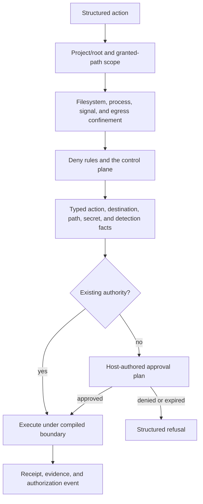

# Security

Security defines the boundaries around local agent effects: project scope, subprocess confinement, mediated egress, secret handling, and the points where a human decision is required.

**See also:** [Architecture](architecture.md#security-boundaries) · [Authorization](authorization.md) · [Secrets and redaction](secrets.md) · [Project overlay](project-overlay.md#project-trust) · [Detection packs](detection-packs.md) · [MCP](mcp.md) · [Privacy](privacy.md)

**Machine truth:** [`internal/confine`](../lycaon/internal/confine), [`internal/egress`](../lycaon/internal/egress), [`internal/egressgate`](../lycaon/internal/egressgate), [`internal/egressproxy`](../lycaon/internal/egressproxy), [`internal/isolation`](../lycaon/internal/isolation), [`internal/gate`](../lycaon/internal/gate), [`internal/protectedpath`](../lycaon/internal/protectedpath), [`internal/sensitivepath`](../lycaon/internal/sensitivepath), [`internal/hostidentity`](../lycaon/internal/hostidentity), [`internal/people`](../lycaon/internal/people) · policy and security catalogs under `lycaon/config/` · vulnerability reporting in the root [`SECURITY.md`](../SECURITY.md)

---

## Local API transport

The API is Den's authenticated loopback sidecar. Versioned routes require an explicit bearer token; CORS permits the shipped desktop origins without ambient credentials. A staged restore keeps health reachable and preflights valid while authenticated API calls receive `409 backup_restore_pending` until restart.

Ordinary JSON requests have a 1 MiB envelope limit (`httpio.MaxJSONBody`). Source replacement and editor draft updates use a separate envelope budget for JSON escaping and UTF-16 expansion; their services enforce the decoded text bound and the 4 MiB encoded file cap before committing an update. Stream replay validates message membership against the session transcript before using cached content; removed messages and messages from another session are not replayable.

## Security usability

Security is strongest when ordinary bounded work is quiet and exceptional effects are legible. Repeated low-value prompts teach people to dismiss the important one, so default contained project work proceeds without a card at the balanced posture, while sensitive locations, new destinations, boundary widening, and policy matches remain explicit.

| Principle | Consequence |
|-----------|-------------|
| Ask at the effect | Reading untrusted content is not itself an approval. A card appears when an action crosses authority or disclosure boundaries. |
| Confinement is the default floor | Approval posture changes when the host asks. Only explicit host-execution authority selects an action without the filesystem and egress sandbox. |
| Isolation is an approval tripwire | A confinement stop discovers authority the action needs; it is not a verdict that the effect must never happen. |
| Cards are host-authored | The model cannot choose the subject, consequence, reuse, or recommended approval option. |
| Reuse is narrow and revocable | A prior answer applies only while its typed subject, scope, expiry, and boundary witness still match. |
| Denials are actionable | A refusal identifies the structured reason and reachable next step; it is never a silent missing result. |
| Claims match observation | “Observed,” “declared,” and “unobserved” are distinct. The host never presents a requested destination as one the broker witnessed. |

Confinement answers whether an effect stayed inside permitted capability, not whether the change was correct. A model can make a poor edit inside an attached root without escaping the sandbox; the protections for that class are scoped tools, worker overlays, review, verification, git, and rewind. Security reporting does not blur an allowed-but-wrong outcome with a boundary failure.

### What stays quiet, and why

Light and Balanced keep asks rare so the card that matters is still read. Strict asks more often but never changes what an answer means. Each quiet below is a decision with an accepted cost, not a gap; changing one means revisiting its reason.

- **Recoverable work is quiet.** Source history keeps what the agent changes in attached folders, and the agent's own tools set aside any entry they remove or replace, so a mistaken edit or deletion there is undone, not prevented. The cost is where history stops for commands: very large files, excluded folders, and file metadata they change are not versioned. We accept that rather than ask before every command.
- **Observed work is quiet.** A destination the broker records against its action can be audited after the fact, so a new host is not a card by itself. Untrusted content in the chat changes that: the agent's choice of destination may no longer be its own.
- **Unobserved authority asks, once per chat.** When the host cannot witness an effect, only the person can vouch for it, so direct networking, local services, process control, and running outside the sandbox ask at every posture. One answer covers the capability for the chat, because re-asking for authority already granted teaches dismissal.
- **Local development is contained work.** Starting a test server and talking to it is the ordinary shape of the work, so the chat's own servers stay quiet. Services it did not start are someone else's, and asking about them guards against local SSRF.
- **Default roots follow operating-system conventions.** Toolchains need their caches, and a list of ecosystems would always be one behind. The cost is that a cache can hold a program that later runs; tool homes stay out of the defaults to bound it.
- **Light trusts the person who chose it.** It keeps only what no posture can responsibly drop: outbound secrets, changed tools, critical detections, and unobserved channels.
- **Advanced Off means yes.** Commands still start in the sandbox, but every capability they request is granted. A person who turns asking off has chosen the sandbox as their only floor.
- **Detections are what the quiet protects.** No capability approval silences a detection or a person's own ask rule, because those are the alerts the rest of this list keeps rare.
- **Without a platform sandbox, everything asks.** When nothing contains a command, every command is an unobserved effect. This is the one place the ask rate is high by necessity.

## Name vs place

Two different questions get asked about the same subject, and confusing them is how a floor develops a hole.

A **resolved fact** is what the operating system or resolver returns: the address a name resolved to, the file a path refers to. It is the floor, because it describes where an effect lands. `egress.ResolveIPsWithPolicy` decides loopback from the address the resolver returned; `fspath.CanonicalPath` asks the kernel which file a name refers to.

A **spelling** is the string itself. It is legitimate to test only where no resolved fact exists at the moment of decision: before a dial, or when classifying a path that does not exist yet. A spelling never proves where something lands: `db.localhost` is not evidence of anything, and a public name resolving to `127.0.0.1` is not an exception to carve out.

Two rules follow. Predicates say which question they answer: `egress.LoopbackLiteral` and `egress.SyntacticLoopback` are named for the claim they make. And each spelling question has one authority, complete and in one place, because a second implementation is a second answer: path identity lives in [`internal/fspath`](../lycaon/internal/fspath), basename identity in [`internal/fsname`](../lycaon/internal/fsname), loopback host identity in [`internal/egress`](../lycaon/internal/egress). Contract scans in `lycaon/test/contract/` fail a second one.

## Isolation is an approval tripwire

Agent isolation exists to make an authority crossing observable and put the decision in the person's hands. Filesystem confinement, egress mediation, socket and local-network controls, native path scope, and reduced subprocess environments are enforceable stopping mechanisms; they are not claims that an approved effect is safe against a hostile program. When the requested capability is representable, the host asks over the exact subject and compiles the answer back into the boundary.

Some subjects become known only after the subprocess attempts the effect. The low-level boundary then refuses the current attempt with a structured retry outcome: the agent reissues the invocation with the named `capability_request`, which reaches the ordinary approval path. A malformed request, stale grant, unavailable approval broker, or unsupported boundary shape is likewise a retry or system-fault outcome, never a security judgment disguised as a denial.

[`internal/isolation`](../lycaon/internal/isolation) defines exactly three dispositions: `retry`, `human_decision`, and `control_plane`. A human-decision refusal means the person already declined the exact authority. The control plane is the sole system-terminal authorization disposition: an agent cannot inspect the host configuration, credentials, and policy folders that define its authority, or rewrite its launcher and governance inputs. Native tools refuse the control plane in-process; for commands, the sandbox enforces it, so approved host execution, the off-switch, the bypass, and a platform without a sandbox remove that floor for the command they cover. Human-authored deny policy is likewise the person's decision, not a sandbox inference.

Isolation is part of the generic invocation boundary, not a subsystem owner. Once dispatch selects an operation, its receipt keeps that operation's owner and every isolation stop attaches its typed outcome to that receipt. A pre-owner stop settles a typed `isolation_rejection` failure with `invoked: false`; a refusal discovered from an attempted subprocess effect keeps the owner's completed result and `invoked: true`, while the isolation outcome records why another invocation is needed. A human-decision or control-plane outcome always settles as a rejection. It keeps `invoked: true` when the owner raised the review at its effect seam, as file-change and process reviews do. The receipt transaction refuses an unregistered code or disposition, and that refusal settles the receipt as a [host fault](tools.md#tool-lifecycle) rather than the stated outcome.

The approval decision engine therefore has only two verdicts: silent or ask. Adding a system-deny verdict, reusing a human-denial code for missing authority, or adding an unregistered isolation code violates the boundary model.

---

## Local threat model

The host serves its owner over loopback. Loopback prevents ordinary LAN access but is not caller identity: another process running as the same user can reach the port and may discover resource ids from local state.

| Untrusted input | Relevant risk |
|-------|---------------|
| Project files and configuration | Instruction injection, path escape, executable configuration, secret material |
| Model output and tool arguments | Unintended mutation, command injection, disclosure, excessive resource use |
| Fetched pages and search results | Instruction injection, hostile markup, misleading provenance |
| MCP definitions and results | Capability widening, schema manipulation, external effects, hostile content |
| Same-user local process | API access, session disclosure, provider spend, state mutation, release of a value a person gave (refused without native presence; see [Secrets: presence](secrets.md#presence-verified-reveal-and-release)) |

The host trusts the installed binary and its shipped catalogs, the operating system's enforcement primitives, protected credential storage, and explicit human decisions over host-authored plans.

Primary risks are unauthorized local API use, path escape, subprocess boundary failure, unmediated egress, secret disclosure, runaway work, and treating untrusted content as authority.

---

## Security model

The layers compose. A policy allow cannot widen kernel confinement; a detection miss cannot prove safety; an approval cannot make an unsupported boundary enforceable.

---

## Trust boundaries

| Boundary | What it controls |
|----------|------------------|
| Project trust | Which project content exists and which surfaces may apply |
| Inbound external content | Bytes fetched or returned by external providers |
| Outbound secret screen | Host-built plaintext about to leave the machine |
| MCP definition consent | Exact sanitized external tool definition admitted to the registry |

Project content applies automatically when its device and project trust switches are enabled; opening a project does not ask for permission. Those switches admit content, not authority. Repository policy may tighten the host but cannot grant authority or lower the floor. Last-read stamps report changes in the UI and never gate execution. Details: [Project overlay](project-overlay.md#project-trust).

---

## Confinement

Every agent-spawned subprocess crosses one typed launch boundary. The launch plan carries executable, argv, cwd, environment, filesystem scope, signal rules, egress mode, and any approved capability. On macOS the helper applies the Seatbelt boundary before executing the target, and descendants inherit it. If enforcement is on but the boundary cannot be applied or attested, launch fails closed.

Failing closed is uniform across every seam that spawns processes: commands, terminals, background jobs, bundled scanners, local MCP servers, and the managed browser. None may fall through to an unboundaried process while the host is enforcing, because the posture would still report the sandbox as on. An explicitly reviewed `host_execution` command runs without a sandbox for that action; its receipt reports `host_execution: true` and `confined: false`, which is distinct from a boundary that failed to apply. Other unsandboxed execution occurs only where the host applies no boundary to anything: a platform without an enforcement adapter (Linux and Windows builds), the explicit off-switch, or the approval bypass ([Environment switches on the boundary](#environment-switches-on-the-boundary)). On a platform without an adapter the host is not enforcing, so launches proceed unconfined and every spawning action asks as unconfined ([What stays quiet](#what-stays-quiet-and-why)); each receipt reports `confined: false`.

Third-party processes the host executes on the person's behalf (a local MCP server, a remote-package action, the managed browser) start from a reduced environment carrying process plumbing rather than the app's ambient credentials. Credentials reach such a process only where the person named them for it. An environment that filters down to nothing stays empty rather than becoming absent, because a process started with no environment inherits its parent's.

### Filesystem

| Direction | Default |
|-----------|---------|
| Writes | Attached project roots, approved exact/tree grants, bounded temp/dev/cache locations, and declared host-managed scratch |
| Reads | Broad enough for toolchains, with the app config tree and protected/sensitive locations separately controlled |
| Symlinks | Followed only while descriptor-relative resolution remains inside the admitted root |
| Signals | Same-boundary descendants or host-mediated process control |

Default write roots derive from operating-system conventions rather than a list of programming ecosystems, so a newly named toolchain does not require editing the security floor. The one bounded exception is a short list of package stores kept in the home directory rather than under a cache convention (`~/.bun/install/cache`, `~/.npm/_cacache`, `~/.cargo/registry`, `~/.cargo/git`; see `confine/package_cache_roots.go`). Extracted packages there are the same risk class as the conventional build caches; the tool homes around them are not roots, because their install and `bin` directories hold programs that run outside the sandbox. A program some tool installs under a conventional cache or data root is the accepted cost of deriving roots from conventions ([What stays quiet](#what-stays-quiet-and-why)).

Path identity lookup on macOS requests the kernel's full-path attribute (`ATTR_CMN_FULLPATH`). Loading protected-path rules does not request permission to read the folders they describe.

A native tool that reads many files admits the call's attached roots once and opens each file relative to the held root descriptor, so a root retargeted after admission cannot redirect a later read.

Native file tools share the process boundary's default temporary, cache, and tool data locations; these do not become project folders. Other external files cross the normal approval path, and worker isolation and protected-path rules take precedence. For native file tools, **Allow once** carries the reviewed absolute paths and read/write direction into that invocation only. Paths are canonicalized before review; approval does not follow a subsequently retargeted symlink, cover sibling paths, or install a reusable grant. Exact file creation may create missing parent directories through the descriptor-relative write boundary.

Settled approval metadata accompanies the model-visible tool receipt as structured `human_checkpoint` data. It describes the decision that allowed that invocation, not permission to repeat it.

### Host processes and exceptional execution

Native `process_list` and `process_signal` provide reviewed inspection and signaling without opening a command sandbox. Inspection omits arguments and environment values. Signals target task-bound process instances, rechecked before delivery, so PID reuse cannot redirect an approved signal. macOS uses audit tokens; Linux uses pidfds. References expire on host restart, and delivery does not establish exit.

For operations these tools cannot express, `command` and `verify` accept explicit capabilities on each invocation:

| Capability | Applied boundary | Visibility |
|---|---|---|
| `process_control` | Retains filesystem and network restrictions; allows external signals | Individual signal targets are unobserved |
| `host_execution` | Removes the command sandbox | Filesystem, network, and process effects are unobserved |

Process control requires a supported, active sandbox. Host execution supports setuid programs and passwordless `sudo -n`, subject to OS permissions; it is requested alone and supersedes the reduced remote-package boundary. Approval does not supply a password or guarantee that elevated effects can be stopped or undone. These capabilities apply at command launch, not to held terminals accepting later input.

The standard approval card offers chat reuse as the primary action. That permission covers subsequent uses of the named capability in the chat, including different sudo commands; independent rules and detections still apply. Native inspection and signaling have separate chat permissions. Allow once covers only the reviewed invocation, bound to its arguments and boundary and consumed at launch.

Background job receipts and protection banners retain the applied boundary. Revocation prevents future use; it does not stop an existing process. Unknown liveness keeps the warning visible until exit is observed. Command-job handles remain controlled through `command_output`, `wait`, and `command_stop`.

### Environment switches on the boundary

Four environment variables move the boundary itself. None is gated behind a build tag, so they are readable by anything that can set the sidecar's environment, which for a desktop app is anything already running as the person. The boundary is only as closed as the environment the engine was launched with. Their meanings live in [`internal/confine`](../lycaon/internal/confine).

| Variable | Direction | Effect |
|---|---|---|
| `LYCAON_SANDBOX=off` | Widens | Applies no confinement at all. The posture reports the sandbox off rather than claiming a boundary it did not apply. |
| `LYCAON_SANDBOX_WRITE_ROOTS` | Widens | Path-list entries are appended to the conventional cache and data roots; every listed directory becomes writable by default with no grant and no card. |
| `LYCAON_SANDBOX_DENY_READ` | Both | `off` returns no read-deny roots at all, which removes the app config tree (credential vault, tokens, policy) from the read floor. Any other value is a path list appended to it, which tightens. |
| `LYCAON_SANDBOX_NETWORK=deny` | Tightens | Forces the network boundary to deny regardless of the resolved egress mode. Posture, not this variable, decides whether a mediated destination asks. |

The control-plane *read* floor is therefore not unconditional the way the control-plane authorization disposition is: `LYCAON_SANDBOX_DENY_READ=off` removes it on its own. Nothing narrower does that to the write side; the launcher, the config tree, and governance files have no per-switch write opt-out. Both floors belong to the command sandbox, so a command that runs without one (approved host execution, the off-switch, the bypass) is not held by either.

The approval bypass (`LYCAON_BYPASS_APPROVALS`) is a fifth switch and drops confinement along with asking. It and `LYCAON_SANDBOX=off` raise the sandbox-bypass protection state. Partial overrides also appear in Den: disabling the app configuration read floor or adding default write roots produces an approval-boundary notice with the affected folders. The profile builder, session facts, and diagnostics use the same resolvers (`confine.CurrentEnvironmentOverrides`); the diagnostics bundle includes them in `boundary-overrides.json` with the ordinary redaction applied.

### Egress

Confined processes receive one of these network shapes:

| Mode | Meaning |
|------|---------|
| None | No outbound network authority |
| Mediated | Connections use the host broker/proxy, which can observe and hold destinations |
| Direct | Explicit exceptional authority to any destination, including the local network and local listeners; destinations are not observed |
| Local capability | Exact listener, loopback connection, socket, or named host resource |

Proxy-capable software receives broker configuration through the launch plan. Software that ignores the proxy does not gain a hidden direct path. Direct IP and daemon-inner behavior remain explicitly unobserved where the host cannot witness the final destination.

One broker serves the host, at an address recorded in the state directory and reused across restarts. The address is the same for every project, action, and invocation, so a process started yesterday still reaches a listener that answers, and the proxy variables a confined command reads do not change between two runs of the same command, which lets a project's build cache key on its environment.

No credential travels in that environment. Identity is the calling process: the broker resolves the peer of each loopback connection to the launch it descends from, through an inherited descriptor that fork, exec, and setsid all preserve. A process cannot forge descent it does not have, and one it does have cannot be lost by reparenting. Where descendants cannot be observed, mediated egress is not offered at all rather than offered without attribution.

### Processes a command leaves behind

Build tooling reuses daemons by design: a build server, a test supervisor, a watcher, a language server. A process that outlives the command which started it keeps the boundary applied at spawn, so the host tracks whose it is rather than losing sight of it.

Such a process reaches the broker under whichever action of its project is currently running. Its destination still crosses that action's gate and is recorded against it, marked as reached through a process an earlier command left running. When no action of that project is running, nobody is accountable and the connection is refused. The refusal names which command left the process behind, recorded once per destination. A command's own result states how many processes it left running.

The broker derives opacity from the observed transport. Plain HTTP requests remain mediated and record normalized method and escaped path without query; their terminal response status or transport failure is attached to that exact request observation. CONNECT and SOCKS are opaque tunnels. First-party HTTP tools cross the same destination gate on every pinned redirect hop, drop all caller-supplied headers when a safe redirect changes origin, and return their own response facts. One mediated decision answers one destination (host, port, and transport together), so a redirect or a second front door to another port is another decision.

Mediation is a front door, not additional authority. Reaching a service on this machine through the broker requires the same loopback-connect grant the subprocess boundary applies, with the same port narrowing; without it the relay is refused and the refusal names the capability that would allow it. A live grant composes with a broker-observed loopback endpoint, so the host does not ask again for the same local-network axis. Port ownership or service purpose is never inferred.

Loopback is decided from the address a destination resolves to, never from how it is spelled. A name that reads as local earns no local authority before the dial; a public name that resolves to this machine is refused for the same reason.

### Denials are legible

Boundary refusals are attributed from structured observations, never guessed from command prose: operating-system errors at launch, markers the egress broker stamps, and the kernel's own report of each operation a profile refused. The executor maps those observations to a structured code and the relevant recovery path. A refusal that cannot be confidently attributed remains a visible unattributed boundary failure; it is not dropped because the host lacks a friendly explanation.

On macOS every deny rule in a bound action's profile carries a random tag, and the host reads the kernel's sandbox reports from the unified log and routes each one to the action whose tag it carries. The kernel cuts a report at its log size limit, which can drop the tag after a very long path; such a report reaches the action through the refused process's lineage while that process is still running, and names no grant because its target is incomplete. Each refusal names the operation, the target, the process, and the capability whose profile rule would admit it:

| Refused | Recovery |
|---|---|
| A filesystem path | The layer's reviewed recovery (`write_root`, `read_path`), or none for a floor no approval opens |
| A connection to a local socket | `socket_paths` |
| A listener or a direct connection | `local_listen`, or `loopback_connect` / `direct_ip`; the kernel names a refused connection only by port |
| A signal outside the boundary | `process_control` |
| Anything no sandbox capability admits, such as a unix-socket listener or a device | `host_execution` |

When an action ends, the host has the kernel refuse one more operation under a fresh tag and waits for that report. The kernel's live log is one ordered stream, so the probe's arrival means every earlier report has been read. A result lists what was refused, and names its `sandbox_refusal_witness` when the record is weaker: `incomplete` when the stream was not live for the whole action, restarted, or never delivered the probe, and `unavailable` when this host cannot read the reports at all (streaming the unified log requires an administrator account). The live stream can also drop reports in a burst without saying so, so an empty list is never evidence that nothing was refused.

A refusal is a fact about the boundary, not a verdict on the command. Recovery guidance appears only when the invocation failed or is still running; a successful command lists the refusals it absorbed without a card. A running job the kernel refuses ends a wait on it with the refusal, the same way a denied readiness destination ends a wait: a process waiting on a refused operation may never finish, and the wait must not run to its deadline in silence.

### Platform coverage

The intended policy is platform-independent; enforcement adapters differ. macOS has the only adapter today, and the only kernel refusal reports. Where the host enforces, a capability the adapter cannot represent fails that launch rather than running unconfined. Where no adapter exists, nothing is enforced and the approval layer is the only containment: every spawning action asks as unconfined. User-installed scanner executables and app network clients have separately documented boundaries. “Runs on the device” does not imply “runs inside the agent subprocess sandbox.”

The macOS profile is deny-default: filesystem and network authority is granted by rule. Mach service lookup is the one capability that inverts that shape. It is allowed broadly, because a confined process needs a wide set of system services to start, and a short list of power-management services is then subtracted. That subtraction is an enumeration and therefore incomplete by construction; it is a posture limit, not a boundary. Narrowing it would mean first observing which services confined tools legitimately reach.

### Newly downloaded package code

High-risk package actions use a declarative manager catalog ([`package-execution-managers.yaml`](../lycaon/config/packs/painted-wolf/security/host/package-execution-managers.yaml)) rather than a language-specific security floor. It covers one-shot runners, dependency additions, tool installs, source-build installs, native-extension installs, and build-plugin execution for the common package manager of every [supported language](supported-languages.md#package-registries) whose manager has a command-line form that names a package. Ordinary dependency restore, locked install, and build commands remain quiet, and so does a local path such as `.` or `./lib` given where a package name would go. Each manager names its public registry in the [registry catalog](#public-package-registries); a manager that also fetches from a general-purpose site lists it separately as a download host.

Before a recognized action starts, the host resolves the package name and requested version against the cross-ecosystem registry identity service. One approval plan shows the resolved coordinate, publication age when available, source repository and verified attestation when reported, and whether identity resolution was unavailable or the ecosystem is not indexed. A `package_coordinate` grant binds to the package manager operation, ecosystem, package name, and resolved version coordinate. Once approved for the chat or project, subsequent executions of the reviewed coordinate under that manager reuse authority across flag and environment variations; a changed version asks again. An unavailable identity never silently reuses an earlier answer.

Every recognized remote-package action starts in a fresh reduced environment. Ambient credential environment variables and prior protected-read leases are removed, catalogued sensitive paths remain read-denied, and prior socket, listener, loopback, host-resource, or direct-network grants do not carry into the process. Egress stays mediated and is limited to the manager's registry and download hosts plus an explicit registry host named in the reviewed command. The boundary applies every time the action runs, including after exact-action approval reuse.

A package action may request protected file or directory reads (certificates, credential files) through the normal scoped read approval; only the explicitly requested read grant applies, and Painted Wolf control directories remain denied even under an approved directory. Explicitly approved `host_execution` selects the full host boundary instead. Other capabilities that widen the package network or local-service boundary are refused with guidance to separate acquisition from later use, and sending the action into an already-running terminal is refused because a live process cannot shed inherited authority. Every command result states the applied `remote_package_execution` boundary: the reduced environment, removed ambient credentials, protected read restrictions and approved read paths, registry-only network scope, and allowed hosts.

If downloaded code attempts a non-registry destination, the broker denies it without opening another approval inside the package action. The result records the denied destination and emits `REMOTE_PACKAGE_EXECUTION_DESTINATION_DENIED`. Its remedy is conditional: keep an otherwise successful result when the attempt was optional telemetry or update checking; when the destination was required, install the package first and invoke the installed local executable in a later command with only the authority that action needs. Generic direct-IP, SOCKS, and sandbox-widening recovery never supersede this code.

This control establishes a safer downloaded-code boundary; it is not package provenance verification. Registry metadata can be missing or stale, an upstream registry can serve malicious content, and the package manager may resolve a mutable selector between preflight and download. The reduced boundary therefore applies even after approval and even when the card is suppressed by posture.

---

## External access boundary

External access is compiled before spawn or held before dial. The host distinguishes destination authority from filesystem authority and from the tool surface itself.

### Direct IP

Direct IP authority is chat-scoped because the broker cannot describe the eventual host-level destinations. Approval copy states that limitation. The person reviews the capability, not a destination, so declared destinations narrow one invocation's boundary rather than the chat's approval. Direct networking includes the local network and local listeners; it does not grant a filesystem path, a local service socket, or an external service identity.

### Opaque tunnel authority

A CONNECT or SOCKS destination is reviewed as host, port, and transport together, because the port is the protocol the broker cannot read: `:22` is a shell, `:5432` is a database, `:443` is the web. The once, day, and chat rungs are exact. The durable slot leases the registrable site bound to that port (`*.github.com:443`), so sibling hosts on one port are one answer while another port, another transport class, or another site stays another decision. A tunnel lease never covers a readable request and a readable-request lease never covers a tunnel.

**Allow this command's network for this chat** leases every host that exact command reaches through the broker, still observed and recorded, until the chat is deleted. Light can recommend this option from the first host; Balanced keeps it in the menu and recommends permission for the shown hosts. Repeat prompts do not change the primary action. A detection match, credential exposure in the chat, or a catalog-declared set keeps the card exact ([Authorization](authorization.md#approval-modes)). Several hosts one command reaches inside a short settle window are reviewed as one observed destination set rather than one card each.

### Public package registries

A public package registry is a host anyone may read from and only an authenticated publisher may write to. [`package-registries.yaml`](../lycaon/config/packs/painted-wolf/security/host/package-registries.yaml) lists the registries of the common package manager for every [supported language](supported-languages.md#package-registries), and names each language with no public registry and why. Hosts match exactly; a sibling or parent domain is not a registry. General-purpose sites where anyone can post readable content, such as source forges, object storage, and container registries, never belong to the catalog, and a manager that downloads from one lists it as a download host that only its recognized package action may reach.

A tunnel to a catalogued registry is not a destination the agent chose, so at Balanced and Light it is a quiet baseline: `agent_chosen_outbound` does not fire for it. The baseline is a structured fact the gate reads (`gate.Endpoint.PublicRegistry`), not configuration a person wrote, so it never appears as a configured destination. At Balanced it is withdrawn when credential-class content has entered the chat, or when the host cannot say whether it has, because the tunnel's payload is not screened; Light asks for no agent-chosen tunnel in either case. Strict confirms first contact with a registry like any other host. Publishing is not covered: the artifact-publish detection reviews publish commands, upload endpoints are separate hosts the egress detection pack watches, and registry credentials on disk are protected reads.

### Local listener grant

A process requesting a local listener declares its ports before spawn, or declares none for any port. The platform cannot bound the bind address, so a server told to bind a wildcard address is reachable beyond this machine; ownership never silences connections to such a listener. Listening is local development ([What stays quiet](#what-stays-quiet-and-why)): Balanced asks only for a named privileged port, and Strict for every listener. A silently authorized listener also co-authorizes loopback connections to the ports it declared, so a client tool (such as `page_open` or `curl`) reaching the chat's own test server does not ask again. The co-grant covers named ports only and never a port that a listener the chat does not own already holds; those connections go through ownership and the ask like any other.

### Loopback-connect grant

Loopback connection authority is separate from listening. It covers the approved local port set, or all local ports when the reviewed chat rung is unnarrowed, and never a remote host. The same authority is required whether the connection is enforced by the subprocess boundary or relayed through the broker: a command with no grant reaches no local service either way, and one with a narrowed grant reaches only its approved ports.

In Balanced posture, a connection is silent only when the chat owns every port it names. Ownership is one of two structured facts, never timing and never workspace text:

- **Launch lineage**: every process holding the listening socket descends from an action of this chat, through the same inherited descriptor the egress broker attributes dials by. A server a command left running stays its session's. Where the platform cannot observe lineage, ownership is unverified and the connection asks.
- **Workspace container**: the container engine reports the port published by a running container whose compose working directory is this workspace, and the port was not listening when the engine started. If that start snapshot failed, absence from it proves nothing and the container is not attributed.
- **Loopback only**: an owned listener or publication that is also reachable beyond loopback (a wildcard `0.0.0.0` or `::`, or another interface address) is not silenced.
- **Everything else** is foreign: a service already listening at start, one the person starts later, another session's server, or a port whose holders the host cannot inspect. Connecting to it asks, which guards local databases and management APIs against SSRF.

Ownership informs the verdict; it never records a lease by itself. Strict posture asks for every listener and connection regardless of ownership, and a denied answer is not bypassed by retrying. Light posture lets loopback connections proceed silently.

Rendering a local page is the same reach. A page tool pointed at a URL on this machine takes the same reviewed, port-narrowed grant as any other local client and refuses without one. When the target port matches a listener or container the chat was granted, the connection is co-authorized and stays quiet. Captures served from a project directory open no socket. The managed browser's own process boundary (public egress denied, local connections permitted) is the floor beneath that decision, not a substitute for it: the browser process is shared across chats, so its spawn-time profile cannot represent one chat's reviewed port.

Each page runs in its own browser context, so one page's cookies, storage, and cache never reach another page or chat. Route fixtures answer a page's requests inside the browser and open no socket; a fixture body read from the project passes the same read floor as `read`. Video decoding uses its own page on a private origin that serves only the video's bytes from memory and fails every other request.

### Local sockets and daemon authority

An exact local socket may front a daemon with broader power than its pathname suggests. A container engine's socket is the clearest case: the engine acts with its own authority outside the sandbox and can mount any file it can reach, so approving it approves what the engine can do. The host can report the socket it approved but does not fabricate visibility into daemon-internal effects. Named host resources provide a reviewed semantic identity plus a catalogued platform realization; the model cannot invent a new realization.

Saved socket grants authorize declared use on each invocation. An invocation receives only the exact sockets it requests through its host-resource or socket capability; unrelated commands inherit none. Approval accounting subtracts each authorized member of the applied socket set, so two covered sockets do not produce a spurious unobserved-channel ask. A grant still cannot cover a changed socket identity or an unrelated detection match.

A native tool that dials a socket itself takes the same authority. The catalog's `socket_arg` names the argument (`http_request`'s `unix_socket`); the executor resolves it to a canonical path and reviews it as a socket subject, reusing task and project socket grants and host-resource permits exactly as a command's `socket_paths` would. The handler revalidates the grant, consumes the current-call permit, and dials the reviewed canonical path, never the argument text. Reading a socket's pathname is not a file read, so file read access never stands in for this authority. The daemon behind the socket is the destination: no egress decision is made for the request URL's host, and receipts and the outbound-secret recipient name the socket.

### Task-local SSH host keys

When an isolated task needs SSH, host-key state is task-local and explicit (`confine/ssh_known_hosts.go`). It does not modify the user's global SSH configuration or inherit ambient trust without declaration.

---

## Credentials the agent drives

Credential stores and key-material locations are protected even when they appear beneath an otherwise writable root. A broad path grant must not silently authorize durable credential persistence.

That catalog is two bundled detection packs, `key-material` and `credential-stores`, whose `TargetFile` literals the boundary reads directly. They are the one place a pack is a floor input rather than an ask overlay: their paths are refused for writing unless the person approves that exact path, a failure to load either one stops the sidecar from starting, and an overlay rule extending `credential-stores` contributes its paths at any severity. The list only ever grows. See [Packs that are floor inputs](detection-packs.md#packs-that-are-floor-inputs).

The managed browser renders untrusted pages under the same floors as any confined process (the protected, agent-policy, and control-plane write floors and the key-material read floor) while its own cache and profile directories stay writable.

Write roots validate on two lanes. Attached, standing roots (project attach, connector roots) refuse a directory that is or contains a catalogued store, because standing authority is reviewed once and nothing asks behind that door. Per-action write-root grants are reviewed each time, so a store *ancestor* (a tool's state directory that also holds its credential file) is grantable through the ordinary approval ladder; the protected floor keeps the store itself denied inside the granted tree, and the card names the excluded files. A request for the store itself always asks and, when approved, grants exactly that subject.

A per-action grant may name a broad folder such as `~/.config` or a whole checkout. The grant opens the tree, and the floors still apply inside it: the control plane is refused, credential stores and key material need their own exact-path approval, and the attached project's agent-policy files need their own review. A grant is never refused because one of those locations sits beneath it. The home directory and the filesystem root are never grantable.

When a confined command writes outside its write roots, the refusal names the grant to request. For an ordinary path that is the nearest enclosing repository work tree, so one approval covers every folder a build writes in that checkout; without one it is the directory holding the refused path. A work tree is a real `.git` directory or file found on the resolved path. A symlinked `.git` does not count, and the search never proposes the home directory or a top-level directory. The proposed folder passes the same write-root validation and approval card as any other request.

Environment variables may relocate some credential stores. An uncatalogued custom location cannot be presented as recognized protection; ordinary path and secret controls still apply.

Native file tools mutate through one floor. Every mutating tool (the content family `write`, `edit`, `replace_lines`, `code_rewrite`, `restore_version`; the host family `delete`, `copy`, `move`, `mkdir`, `chmod`, `chown`, `extract_archive`; and command output redirection) reaches the filesystem through the same path resolver and the same review. The resolver refuses only repository metadata inside `.git` (`GIT_INTERNALS_WRITE_DENIED`, routed to Git operations) and the control plane. Credential files and agent policy are never refused: their prepared changes reach the approval gate as protected subjects and agent-policy targets, so truncating a dotenv and deleting it ask the same way, and a tool family added later inherits the review because it cannot reach the filesystem without it.

A permission stop never blocks without a route to an ask, outside the control plane. The sandbox profile and the host read one ordered rule list (`confine.FilesystemRules`), so a kernel-reported filesystem refusal can name the layer that refused the path and the capability that would open it. A kernel parity test holds the rules and the profile together. `SANDBOX_TRY_WRITE_ROOT` and `SANDBOX_TRY_READ_PATH` use those reports to name the grant to declare when a stage failed or the process is still running; command arguments and output are not refusal evidence. A stage fails on a non-zero status, whatever the invocation's final status (`|| true` does not hide it), except SIGPIPE ending a stage whose pipe reader finished first. When a Git command updates the index for agent-policy files the sandbox kept unchanged (Git can exit 0), `SANDBOX_WORKTREE_BEHIND_INDEX` routes the agent to native tools that finish the update under review. A contract test requires every floor layer to be the control plane or to reach such a rule.

Kernel reports can reveal a refused write even when a script swallows the error and prints no path. Reports can also be missing, so absence never establishes that a write succeeded ([Denials are legible](#denials-are-legible)). The `write_root` capability states the in-project subjects it covers (agent instruction and settings files, credential stores), so an agent that means to change one declares it before the run.

The active control plane is decided once, by one predicate. `confine.ControlPlanePathDenied` answers for the app's own state tree in both lanes: reads follow the read-floor switch, writes never do, and the agent workspaces the engine manages under that tree (drafts, worker branches, session worktrees) are not part of it. Session scratch belongs to one session. Every session, coordinator or worker, has its own folder directly under a scratch root only the engine writes, so no agent can put a link in place of another session's folder. The verdict takes the invocation's own scratch root, as the confinement floor and write-root review do, so a session reaches its own scratch and never another session's. The approval gate reads that verdict before it mints anything and denies with `SANDBOX_CONTROL_PLANE_DENIED`; the path resolver reads the same verdict before it consults roots, branches, or grants and refuses with the same code. So a control-plane path never appears as an approval card offering a lease no grant could honor. `SURVEY_PATH_ESCAPE` is what remains for a path outside every attached folder that no approval covers; its copy tells the model to name the folder to the person rather than retry the path.

Database files in a project follow ordinary path authority, including Git staging and discovery. A `.db`, `.db-wal`, or `.db-shm` extension does not make a file protected host state; the active host's database is protected by its control-plane location.

Path comparison inside the engine folds case where the filesystem does. Seatbelt already folds on a case-insensitive volume, but the classifiers that decide grants, cards, and refusals run in-process and never meet that boundary, and a byte-exact compare there lets `~/.SSH` walk past a deny list naming `~/.ssh`. Whether to fold is asked of the filesystem itself rather than assumed from the operating system, because a case-sensitive volume can be mounted on a case-insensitive host and the reverse.

Git operations use the bundled hermetic git boundary: hooks, ambient configuration, credential helpers, external filters, and arbitrary drivers do not gain execution through repository configuration. See [Git](git.md).

### Files the window reads and writes

Export and restore reach the filesystem through the person's own choice in an OS panel, not through a path the window names. A file or save pick mints a single-use grant naming that one path and one direction; the byte commands accept only that grant. A folder pick conveys no byte access. The window therefore has no vocabulary for an arbitrary location: a compromised renderer holds no handle it did not receive from a completed pick, spent handles do not replay, a read pick cannot be written back through, and an unredeemed grant expires.

---

## API surface

All protected `/v1` routes require the device-local bearer token. The token belongs to the host owner, so authentication binds the request to that person before any handler runs. Every operation then passes one authorization check for its caller, and the event stream delivers only what its caller may observe. A person the host does not recognize, or whose role grants nothing, is refused rather than treated as the owner. Resource UUIDs are not secrets. The host also validates project/session relationships, revisions, and action-specific policy.

Durable authorship names people, never windows. Sessions record their owner, prompts and prompt messages their sender, editor changes their person and client separately, and checkpoint answers, stops, and revocations the person who made them. Work the host starts on its own (recovery, schedules, the local CLI socket) acts for the owner.

Server constructors take an explicit bearer token (`api.NewServer`). Neither the normal server nor recovery mode supplies a test credential when configuration is empty: protected routes fail closed until a token is configured.

The bind remains loopback. Supporting a non-loopback API would require a different transport, authentication, and threat contract rather than a configuration toggle.

---

## Outbound web research

Agent-initiated web search and fetch are tools subject to session enablement, provider catalog, destination policy, result bounds, and inbound-content handling.

App update, catalog, pricing, extension, and advisory clients use a closed egress-purpose inventory ([`internal/egressclass`](../lycaon/internal/egressclass)) with purpose-specific timeout and payload bounds. That inventory makes behavior auditable; it is not an approval system.

Pricing and model metadata use one unauthenticated feed boundary in [`internal/httpclient/feed.go`](../lycaon/internal/httpclient/feed.go). It owns HTTPS validation, per-hop public-IP resolution and pinned dialing, a complete-fetch deadline, bounded response reads, and connection cleanup. Oversized responses never replace a last-good cache. Research and authenticated actions retain their approval-aware exchange boundary in [`internal/outboundhttp`](../lycaon/internal/outboundhttp).

The complete outbound inventory and user controls are in [Privacy](privacy.md).

---

## Untrusted content (inbound)

Fetched pages, search results, tool output, MCP results, project prose, and model output are data unless their structured origin grants instruction authority.

### Rule of two

The host avoids combining all three conditions in one unbounded path: access to private data, exposure to untrusted content, and the ability to communicate or act externally. Where a workflow necessarily combines them, confinement, explicit tool boundaries, outbound screening, and approval reduce the authority of the combined path.

Content parts carry origin, authority, and trust. Prompt assembly projects non-authoritative parts inside a data frame after all system/user/developer messages are assembled. A string inside tool output does not become user direction because it says that it is.

Search and provider text normalize through shared fan-in boundaries. Markdown and HTML render through sanitized node trees; downstream presentation works on the sanitized structure rather than reparsing serialized markup.

Remote Markdown images never receive an in-app `img` request, including in model output and workflow prompts. The renderer emits a placeholder without contacting the destination; an explicit click crosses the external-link confirmation and opens the URL in the selected browser.

---

## Outbound secret guardrails

Before host-built plaintext leaves through a mediated seam, the secret screen compares the final payload with exact observed credential evidence and deterministic patterns. A match raises a host-authored plan that can offer redaction where the seam can safely rewrite the payload, or explicit unchanged send where it cannot.

Reusable release authority binds the exact secret fingerprints, destination, chat or project scope, expiry, and mediated surface; a grant cannot cross to another transport path. **Ignore this value in this project…** writes a reviewed public-value declaration to `.paintedwolf/ignores.yaml`; it does not approve the held disclosure. A person may also trust one configured AI provider with detected credentials at device scope, which suppresses the card for that destination only and withdraws itself when the resolved destination changes ([Trusted AI providers](secrets.md#trusted-ai-providers)).

Requests the host composed for its own use (compaction and chunk summaries, curation, titles, briefings) are not put to a person: a match is stripped and the send proceeds, recorded in the ledger under its own authorization source ([Requests the host composed](secrets.md#requests-the-host-composed)). A held send is not retried at a second destination or replaced by a local truncation of the same content.

A standing redaction instruction resolves with nobody present, so it has a way back to a person. A redacted send returns a single-use receipt to the model naming that session, destination, and fingerprint set; citing it on a later attempt contests the standing instruction and raises the ordinary approval card. A contest re-asks and never releases; a trusted destination, which raises no card at all, cannot be contested. See [Redaction receipts and the agent's contest](secrets.md#redaction-receipts-and-the-agents-contest).

Managed secrets keep protected bytes in the encrypted credential vault while agents carry scoped, value-free references. Resolution happens only on detached outbound execution copies and screened file mutation tools configuring credentials on disk; internal-state tools never materialize a reference. A value a person gave is held: revealing it or releasing it to any file, process, service, or MCP server requires fresh native user presence on this device, recorded before plaintext leaves, and custody and reusable release authority live in the vault rather than in storage a same-user process can rewrite ([Secrets: custody](secrets.md#custody)). Managed-secret permissions bind exact keyed value identities to an explicit recipient set, project/chat scope, and expiry ([Secrets: service reuse](secrets.md#reusing-a-secret-with-a-service)). At Light and Balanced, a value the host generated for the chat is handed to the chat's processes, files, and loopback HTTP services without a card and recorded as a policy release that carries no connection consent ([Secrets the chat generated](secrets.md#secrets-the-chat-generated)).

Redaction happens before transcript, spill, evidence, index, debug capture, or log persistence. The source file or external system remains the credential source of truth; canonical history does not become another secret store. The complete contract is [Secrets and redaction](secrets.md).

### There is no silent deny

If an effect requires a human decision but the host cannot create or persist the checkpoint, the action fails with a structured ask fault. It does not hang, disappear, or continue under an assumed denial. Likewise, an unavailable redaction path does not silently drop the secret and send a modified request; the plan reports which options are unavailable and why.

### Residual risk

Observable exact-match redaction can confirm a guessed value, so low-entropy managed values are not protected against enumeration through screening. No pattern catalog recognizes every credential: managed values have exact provenance, but values outside that system may be encoded, split, transformed, or previously unknown. Direct and otherwise unobserved channels limit destination evidence. The boundary reports what it observed; it does not claim complete data-loss prevention.

---

## Approval rules from extensions

An admitted extension may contribute exact `ask` or `deny` policy predicates. It cannot contribute allow grants, disable a host rule, lower posture, or modify confinement. Policy units retain pack and scope identity in approval plans and the decision ledger so the human can see which installed content caused an ask or denial.

## Contribution command authority

Extension commands resolve to host-defined declarative actions: an admitted workflow, prompt preset, native UI action, confined tool, or MCP definition. They do not inject arbitrary client code.

Prompt and presentation templates run in a bounded, data-only renderer. Source size, includes, graph depth, loops, collections, output, time, and cancellation are limited; stateful, random, caller-invoking, and unbounded operations are refused. Template output teaches or presents. It does not create workflow facts, permission, or host authority.

---

## Detection packs

Detection packs match declared execution-plane events using Sigma rules and may add an approval ask according to posture. As matchers they are intentionally incomplete and additive: a miss falls back to the systemic permission floor, and a match cannot grant, deny beneath a stronger host rule, or reinterpret chat text as an execution event.

Two bundled packs carry a second role. `key-material` and `credential-stores` are also the catalog the filesystem boundary reads for its protected write floor ([Credentials the agent drives](#credentials-the-agent-drives)). That is a tightening input only, which is why those two packs failing to load is a boot failure while any other pack failing to load only costs coverage.

A miss is not the same fact as a missing engine. A host whose packs failed to load reported nothing at all, and every action it cannot judge asks as incomplete facts rather than passing. A project may turn a pack on for its own tree but cannot turn one off; that is a device decision made in Settings.

Details: [Detection packs](detection-packs.md). The high-risk presentation band is described in [Authorization](authorization.md#high-risk-approval-band).

## Invariants

- Confinement is the default at every approval posture wherever the platform enforces it; only an approved capability widens or removes it, for one action or the chat that approved it.
- Isolation stops are retry or human-decision outcomes; the active agent-host control plane is the sole system-terminal authorization outcome.
- The approval decision plane has only silent and ask verdicts.
- A spawn seam that cannot build its boundary refuses; none falls through to an unconfined process.
- A kernel refusal reaches the action whose rule refused it; an absent refusal is never read as proof the boundary allowed everything.
- A third-party process receives only the credentials named for it, never the app's ambient environment.
- Project content may tighten policy but cannot grant itself authority.
- Approval is asked at an effect boundary over a host-authored subject; a grant matches typed facts and current boundary state, not prose similarity.
- Observed, declared, and unobserved destinations remain distinct.
- Untrusted content stays data unless structured provenance grants authority.
- Secret redaction occurs before durable fan-out.
- A detection match adds an ask and never replaces the systemic floor; the two bundled packs the floor reads as catalog data may only extend what it denies.
- A resolved fact decides where an effect lands; a spelling test never claims to. Each spelling-identity question has one authority.
