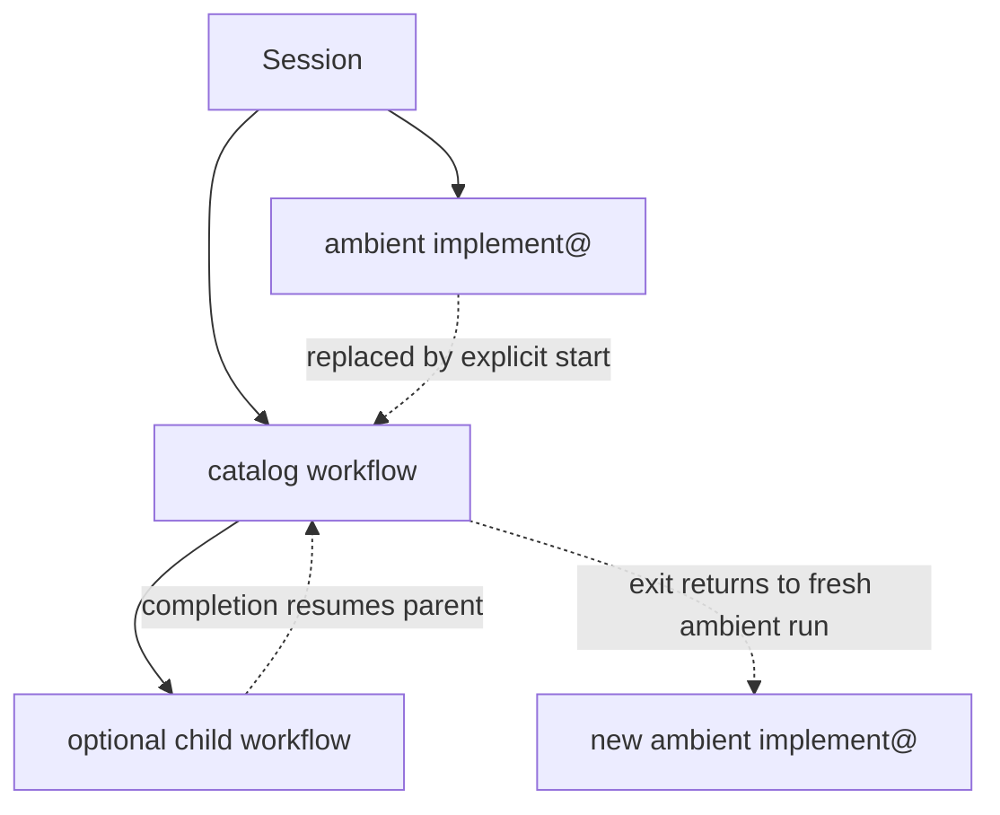
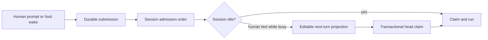

# Session

A session is the durable boundary for one conversation and its work: ordered prompts, workflow lineage, workers, evidence, checkpoints, recovery, and the final transcript.

**See also:** [Architecture](architecture.md#one-turn-loop) · [Workflows](workflows.md) · [Coordination](coordination.md) · [Grounding](grounding.md) · [Host contract](host-contract.md)

---

## Why every session has a workflow

There is no policy-free chat mode beside workflow mode. A newly created build session attaches the ambient `implement@` workflow, and an explicitly selected recipe uses the same run engine. This gives every turn one answer to the questions that otherwise drift apart: which phase is active, which tools and agents are available, what evidence is required, which human controls are armed, what must happen before the work may close, and what recovery should restore.

The manifest declares phases, gates, transitions, agents, and tool surfaces. The host evaluates those declarations from machine state. The coordinator may choose a declared recipe or call a declared transition; it does not decide that an undeclared proof has passed.

## Run model

A session has one active leaf `WorkflowRun`. A catalog run may pause while one child run executes, but coordinator turns, tool policy, and message attribution always target the leaf.



| Run kind | Purpose | What the human sees |
|----------|---------|---------------------|
| Ambient `implement@` | Ordinary investigate, build, fix, and report work | Normal chat |
| Catalog | A selected recipe such as plan, options, bug bash, or security survey | Workflow identity, phase, and controls |
| Child | A declared subroutine inside a catalog run | A nested span in the same conversation |

The stack permits one child depth. A parent becomes `paused_on_child`; the child becomes the leaf; completion or exit returns control to the parent. Starting a new catalog workflow cancels the current active lineage atomically. Exiting a root catalog run creates a fresh ambient run, so the session never falls into an unowned gap.

Transcript rows carry the run that produced them, so Den can render a row before every presentation detail for that run is hydrated; missing chrome must not hide durable content.

| Trigger | Result |
|---------|--------|
| Session creation | Attach ambient `implement@` |
| Human starts a catalog recipe | Cancel the active lineage and create the selected root run |
| A phase invokes a child | Pause the parent and create the child in one transaction |
| Child completes or exits | Resume the parent |
| Root catalog exits | Finish it and attach a fresh ambient run |

Human commands carry the run revision they displayed. A stale action changes nothing and asks the client to rehydrate, so an approval, transition, or exit cannot apply to a newer phase the human did not review.

Catalog tiles, drawer selections, and a bare workflow slash arm a recipe in Den. The next composer send starts it with the human's text as start intent; a slash containing text starts immediately. Start intent is not automatically an answer to a phase's later question; the workflow must still collect any declared intake.

---

## Turn admission and the next-turn queue

Every human prompt and host wake is persisted in `prompt_submissions` before execution. The receipt records executable input, a stable operation identity, and session-local admission order.



The editable queue is a projection of eligible human submissions, not a second execution source. Text entered while the session is busy queues by default. Claiming the linked head and removing its queue revision is one database transaction; a failed claim leaves the draft intact.

The queue's **Send** action reserves the head item or linked head group for the current turn. The reservation freezes queue edits while leaving later appends available. A running model loop accepts it at the next safe boundary: before another provider call, after a provider response but before its proposed tools run, or after the current tool batch settles. An obsolete uncommitted assistant proposal is withdrawn; already-started tools and workers are not canceled. The sent message becomes a visible `user_continuation` inside the open turn, so it informs subsequent model work without advancing the visible turn number or resetting turn-scoped source, rewind, approval, or batch state.

A reservation can wait: the loop reaches no boundary while parked on a tool approval, so the wait lasts as long as the human takes to answer. **Cancel send** releases a reservation the loop has not consumed and returns its items to the editable queue as ordinary queued prompts. Send is otherwise a one-way door.

**A withdrawn proposal is not model history.** The row stays in the transcript as the audit of what was shown, and it is excluded from every projection that builds a provider request, along with its tool calls, which never ran and will never be answered. Model history additionally closes any tool-call group no result answers: an unanswered call is a promise the history cannot keep, every provider rejects it, and because the same stored rows are replayed on each later turn the rejection would otherwise be permanent.

If no model loop occupies a still-busy session, Send starts a continuation cycle without canceling workers or publishing an idle transition. A process failure before handoff leaves the prompt receipt queued for ordinary recovery; a committed continuation is idempotent by submission identity.

**Keep going** is a typed prompt recovery action, not a new intent inferred from its text. Den sends `recovery: {action: "continue", after_message_id}`; the host checks the current transcript and interrupted submission before admitting it. The durable receipt retains the recovery action and transcript anchor; admission appends a `user_continuation`. The model still receives “Keep going,” with the existing task history. Recovery preserves the original turn clock, closeout cycle budget, user limits, and workflow phase; it cannot answer a pending approval or restart a slash workflow. `action: "retry"` is allowed only without model/tool progress and restores the original structured input. Stale actions and a second outstanding recovery are rejected; replaying the same operation returns its original receipt.

Retries reuse the operation identity and cannot create duplicate user rows. Host wakes receive fresh identity because their initiating fact is new. Startup resumes queued human submissions in order but does not replay an interrupted host wake whose initiator no longer exists.

Claiming a submission creates a semantic `turn` and its first `turn_attempt`. The turn stores the restart input and terminal result; each attempt stores its phase and checkpoint. A crash fences the running attempt as interrupted and marks the turn recovering. Re-admitting the same user submission, or reclaiming the same worker job, starts a new attempt on that turn; it does not append a duplicate user boundary or create a second worker result.

A later worker job may reuse a completed child session when continuity is intentional. Reuse does not merge run identity: every message the job emits, including host closeout and grounding retries, carries its immutable `worker_id`, and progress is updated by that identity. Worker transcript pagination, live routing, summary extraction, and evidence auditing seek through the indexed job boundary rather than loading the child's lifetime.

Recovery resumes from durable phase boundaries. A settled model output is never requested from the provider again merely to repair transcript state. Tool-phase recovery relies on fenced tool receipts to settle interrupted effects before the next attempt. A turn that already committed its finalizing checkpoint is completed from the stored response at startup.

Provider streaming is not the transcript authority. Current bytes live in one replaceable live-output projection. When the provider response settles, the host first commits an immutable model output, then projects the message/search row. If that projection fails, startup repairs it from the output; the successful provider response is not relabeled as a failed turn.

### Visible user-turn lifetime

A visible user turn begins when the host admits human input and ends only when no host continuation remains. `Session.status` stays `busy` while the coordinator runs another model/tool cycle, waits for a process or timer, waits for workers, carries an unmet workflow obligation, or pauses at a human checkpoint that resumes the same work. Those continuations may create several semantic host turns without creating another visible user boundary.

Prompt execution occupancy is a separate, in-memory fact. It prevents two model/tool cycles from occupying the session lane at once while still allowing a worker, timer, or process completion to queue the next cycle between executions. Activity leases and the turn clock describe current work within the open turn; neither declares that the visible turn settled.

The turn clock resets when a new root user turn begins. It retains elapsed time across host continuations and overlapping workers, counting overlapping execution once. It pauses when no prompt is executing; an approval wait inside an executing prompt remains part of that span. Work time, banked alongside it, also pauses while any execution in the tree waits on a person's decision.

Each visible turn's clock is durable, keyed by the user message that opened it, and written on the clock's edges; rewind removes it with that message. Boot recovery settles a clock left running at the session's last turn progress, `turns.progressed_at`, which a turn's start, checkpoints, and finish advance and which recovery and resume never move, so the time the host was down does not count as work. The bootstrap, transcript pages, and the `turn_clock` event carry the same `TurnClock` shape.

The decision engine's receipts are keyed the same way. Every decision the engine is asked, at a turn's start, for a `request_tools` or `skills_read` text, or on the first call of a loadable tool, writes a `turn_load_receipts` row naming the user message that opened the turn and, for a decision a model call asked for, that call. The receipt keeps the state the engine read and its full answers in the local store, where developer tooling can export them as labeled examples ([Privacy](privacy.md#the-local-decision-model)); nothing sends them off the device; the transcript page carries a projection of the receipts of the turns it shows as `turn_loads`, and the `turn_load` event carries the same `TurnLoad` shape as each one lands, so a reload draws what the event drew. An abstained decision is a receipt like any other, with its reason; it is the transcript's business to draw nothing for it.

An explicit `wait()` result is a durable delivery obligation. Timer expiry and satisfied conditions submit that result through the session's admission lane, independently of coordinator wake filters and loop budgets. The lease identity deduplicates admission; unacknowledged delivery retries, and startup recovers pending results. Pending delivery keeps the visible turn open. New user direction or Stop retires an undelivered result.

A deferred wake rechecks execution ownership after entering the queue, and releasing an execution owner drains queued wakes, so a completion arriving during turn release cannot be left waiting for another event. Releasing an older execution token cannot clear a newer owner. Worker terminal projection queues its parent wake before delivery acknowledgement; the poller releases the parent worker cycle only after that acknowledgement is committed.

The host publishes `idle` with one terminal disposition only at that boundary: `completed`, `user_stopped`, `turn_error`, or `interrupted`. Turn-scoped projections such as source changes become presentable then. A client must not infer completion from an individual model call ending, an assistant row settling, or a temporary absence of tool activity.

The idle boundary ends one visible turn, not the session's work. When admitted human direction will run next, `Session.prompt_pending` is already true on that idle event and stays true until the next turn's `busy`. See [Host contract](host-contract.md#2-prompt-loop-sequence).

Stop is a root-session barrier when there is no queued human direction: it blocks new admission, converges active turns and descendants, settles receipts, closes resources, and only then reports the session idle as `user_stopped`. When the session has a next-turn queue, Stop still interrupts and reconciles the active tree but preserves the queue and immediately dispatches its head as the next user turn. The queued direction is the user's reason to stop, not collateral work to discard. Convergence is bounded: a turn whose context is cancelled while it is still inside a tool has thirty seconds to unwind, after which Stop records the interruption and settles the session without it.

---

## Worker closeout evidence

Worker completion describes whether the assignment was delivered. Validation is advisory: inspection, targeted checks, the selected project check, or a blocked assessment explain confidence and limitations without forcing a partial result or preventing promotion. Missing assessment metadata does not trap a worker, and a selected command is a default, not a mandatory suite for every mutation.

Host receipts separately record command identity, terminal outcome, and source content captured before launch. The selected check counts through either `verify` or `command`; another command cannot satisfy its explicit workflow gate. Without a selected command, a nominated check can provide test evidence. Inspection and blocked assessments never fabricate a passing test.

Native mutations and promotion share the [syntax-health boundary](supported-languages.md#syntax-health-boundary). Promotion audits the final merge plan before its transaction, including conflict resolutions and command-authored outputs. An explicit syntax override applies only to that invocation and records its reason and paths.

Routine closeout and checklist completion are independent of test receipts. Explicit workflow gates remain pass-only. A blocked handoff can end the agent's attempt without passing those gates. Recovery is bounded across source changes; repeated rejected prose closeouts use the same loop fuse as rejected tool calls.

## Closeout retry lifecycle

The session manager owns closeout retry state in one lifecycle component with two process-local scopes: a prompt budget per executing session, and a grounding cycle shared by the root and its workers. Progress, review-verdict, and open-gate delays have distinct prompt budgets. Starting another prompt resets only that session's prompt budget; host continuations and worker assignments preserve the root cycle's aggregate friction and citation-stall state, so starting a worker cannot replenish the coordinator's retries. A new root user instruction or artifact submission resets the root prompt and cycle, including direction delivered inside a running prompt. Entering a new workflow phase resets the cycle's aggregate friction; re-entering the same phase does not.

Citation recovery retains its attempt count, previous offender, draft, rejection codes, and tool-turn fuse across host continuations. Report-document repair counts its attempts within the prompt that makes them and spends no friction. A committed model or host-assembled report clears that state without replenishing grounding budgets; a failed commit preserves it. Rewind discards the affected root's cycle and prompt budgets; disposing a child removes its prompt state while preserving the parent's cycle. These controls are ephemeral: workflow gates and evidence remain durable and do not become satisfied when a retry budget expires.

---

## Ambient `implement@`

Ordinary chat is a small workflow loop:

```text
boot → work ↺ → done
```

`boot` establishes repository and board orientation. `work` may investigate directly or dispatch workers; after a worker cycle the host re-enters `work` with the new machine facts. `done` is reached only when the completion obligations for the current work are satisfied.

The ambient run stays active across idle gaps. Idle is a session execution state, not the end of the workflow, so recovery does not interrupt a healthy ambient root merely because no coordinator turn is running.

Catalog workflows use the same engine with different manifests:

| Mechanism | Purpose |
|-----------|---------|
| `extends:` | Build a variant by merging manifest content into one run |
| `invoke_workflow:` | Enter a declared child run and pause the parent |
| `state_start` | Record a coordinator proposal that only a human may start |
| `workflow_compose*` | Create one bounded, session-local recipe |

---

## Human checkpoints vs workflow gates

Both can pause work, but they protect different boundaries.

| Mechanism | Question | Resolver | Examples |
|-----------|----------|-------|----------|
| Workflow gate | Has the declared phase obligation been satisfied? | Workflow run | Human approval, evidence verdict, child completion, explicit choice |
| Tool checkpoint | May this concrete effect proceed? | Effect checkpoint | Command authority, external destination, content application |
| Worker decision | What information does a child need from its coordinator? | Worker queue | Ambiguous scope or integration choice |
| `ask_user` | What explicit answer does the coordinator need from the human? | Workflow feedback checkpoint | Structured options or open text |

A workflow gate does not grant filesystem or network authority. A tool approval does not advance a workflow phase. Session rewind undoes completed turn effects and is separate from both.

Human-facing requests remain durable while parked. An unanswered request fails closed; restart rehydrates the same pending state rather than guessing an answer from later transcript prose.

Checkpoint ownership comes from the persisted session. The database enforces its session/project pair, and checkpoint events route by that identity. Checkpoint creation, updates, and decisions commit their events in the same transaction and use the same ordered outbox as worker registration, so Den learns a child's parent before receiving its approval. Parent reads and the attention projection share one scope: the parent's checkpoints plus those of its worker children, including completed workers with unresolved requests. The oldest pending checkpoint in that scope makes the parent need human attention even while its session is busy; worker status alone cannot hide an unanswered request.

### Attention

A session also carries attention when its newest turn completed after the person last read it. That comparison is two durable facts: the newest `complete` turn's completion time, and the session's `seen_at` stamp. Only completed turns count; a failed, interrupted, or canceled turn is not a result to read, and a session whose last turn failed already carries the error state. A running turn outranks the previous result, and a pending request outranks both. The stamp is written by `POST /v1/sessions/{id}/seen` on the host clock, which a client calls while the conversation is readable on screen in a focused window, so reading a chat clears it and a later turn makes it unread again. A session that has never been read counts its first completed turn as unread.

Each attention row carries `since`, the moment its reason began, and rows age from it within their class. A pending checkpoint dates from its oldest open request. An open ask dates from when it was asked: a coordinator question from its creation, a phase's feedback or decision request from the `requested_at` stamped when the phase opened it, and a plan awaiting approval from `human_approval.awaiting_since`. An unread result dates from its turn's completion. A failure or a running turn dates from the session's `status_changed_at`. No reason borrows the session's `updated_at`, which renames, pins, and reads also move.

A failed attention read is an error, not evidence that work is running or that no approval exists. Den retains the last successful attention view and prevents delayed snapshots from overwriting newer events or restoring deleted rows.

Gateway failures do not prove that the sidecar is connected. Den confirms reachability with a bounded health probe that accepts the sidecar's healthy or recovery state, preserves newer connectivity observations, and never replays the original request. A lost approval response may follow a committed decision; reconnect and hydration establish its outcome. The event transport also bounds silence: a stream with no traffic for three host heartbeat intervals is aborted and reconnected through the normal replay path, which covers a proxy that leaves the response open after its upstream dies.

The default posture is usable without being unbounded: ordinary contained work proceeds, while effects outside established authority raise a host-authored plan. [Security](security.md) and [Authorization](authorization.md) define the approval ladder.

---

## Session recovery (rewind)

Rewind removes a visible human prompt and everything after it, reversing the source contributions from that suffix. The host owns this action so the agent cannot erase its own transcript or evidence. A `user_continuation` stays within its existing turn; only a turn opener is a rewind boundary. Source attribution retains permanent turn identities after transcript removal, so a later prompt cannot inherit discarded work.

### Preview and conflicts

The host previews an idle session's selected suffix against retained file versions and current workspace state. Execution requires the preview's `plan_digest`; changes to the transcript, file endpoints, document revisions, or workspace locations require renewed review.

Later or intervening contributions block whole-file replacement. For clean collaborative documents with retained semantic inverses, selective undo preserves later saved human text. Unsaved documents, missing history, uncertain command authorship, and unavailable workspaces block the operation rather than leaving part of the suffix applied. File and byte limits bound the complete plan.

Checkpoint metadata provides an independent coverage check across every selected turn and root. Unrecorded changes, incomplete capture, or a changed Blueprint binding block rewind because file bytes alone cannot establish how to restore workflow state. Checkpoint pre-images share the source-content store and retain permissions for deleted files; the version ledger supplies the restore content. A transcript-only turn needs no file snapshot.

### Apply and recovery

The host journals the reviewed plan, applies its source changes, reconciles open documents, and then removes the corresponding session state. Rewind uses the same durable effect boundary, version ledger, and change events as other source edits; its versions record the acting person and their retained source version, keeping recovery visible in file history.

A failed application compensates completed effects without overwriting independent changes. Stable effect identities and per-file progress let startup resume recovery without duplicate versions. An applied marker allows session finalization even when a later human edit has arrived. Committed receipts remain replayable for 24 hours, so a lost response can be retried with the same operation id.

## Chat lifecycle

Rename, archive, pin, and delete act on durable session identity:

| Action | Meaning |
|--------|---------|
| Rename | Replace the display title; stable identity is unchanged |
| Archive | Remove from the working set while preserving the session; archiving also unpins it |
| Pin | Add to the end of the project's pinned order, which the person arranges |
| Delete | Dispose resources, revoke session-bound authority, remove children and durable session facts |

Delete is one lifecycle transition, not a loose cascade. Held processes and pages are disposed before their durable parent disappears, and grants that rely on the session's authorization chain end in the same operation.

### Order: activity, record changes, and pins

A session carries four timestamps with separate meanings. `created_at` never moves. `activity_at` advances only when the transcript gains a message the chat shows; internal host rows and workflow bookkeeping do not count. `status_changed_at` moves only when the status does; it is null while the session keeps the status it was created with. `updated_at` is the record-change stamp: reading, renaming, pinning, archiving, status, and posture changes all move it, so nothing orders or ages by it. A project's `last_activity_at` follows the newest `activity_at` among its sessions. Its `last_opened_at`, which orders the Home recents, moves when a chat is created in it or one of its chats is marked seen; fetching a session opens nothing.

Pins are ordered by `pin_rank`, unique within a project. Pinning appends. `PATCH /v1/sessions/{id}` with `pin_position` moves a pinned chat to a 1-based position and renumbers the project's pins 1…n in one transaction. Unpinning, deletion, and moving to another project leave gaps, which order the same way. Only active top-level chats pin: a worker child is refused, pinning an archived chat is refused with `session_archived`, and a move of an unpinned chat is refused with `session_not_pinned`. The rank is written only by the pin commands, never by the general session update, so a concurrent status or title write cannot reinstate a stale position.

`GET /v1/projects/{id}/sessions` sorts by `activity`, `created`, or `title`, and filters by `pinned`. The `pin` sort lists pinned chats in pin order and requires `pinned=true`.

---

## Continuous context budgets

The durable transcript is not the model prompt. Each turn builds a bounded projection from facts, workflow state, evidence, and recent conversation. The context system has two independent responsibilities:

1. **Fit synchronously.** Deterministic assembly reduces history toward the current model's ceiling without another model call. Protected instructions take precedence over the fit target; an oversized request must not become a smaller request with its task or policy removed.
2. **Summarize asynchronously.** Background compaction creates higher-quality projections for later turns while canonical messages remain intact apart from commit-boundary secret redaction.

The rendered system instructions, latest visible user request, and worker task charters are pinned during fitting. Current workflow obligations, active tool-call structure, and reacquisition handles survive according to declared policy. Old detail may leave the model view without leaving the transcript or evidence ledger.

A compaction view carries a constant-size ordinal, boundary-message identity, and mutation-sequence watermark. A normal prompt reads the view plus only messages appended after that ordinal. If a covered row was edited or the boundary was removed by rewind, the checks reject the view and rebuild it from paged facts; the boundary message is a foreign key, so a stale background writer cannot republish against a deleted boundary. If the uncovered suffix exceeds the bounded assembly guard, the host schedules compaction and fails visibly rather than silently skipping a gap.

Prompt-cache identity follows stable machine inputs rather than incidental labels: a change to workflow revision, tool surface, or material context invalidates the relevant prefix; a cosmetic transcript change does not. Details: [Prompt assembly](prompt-assembly.md).

---

## Read-only streaks

A turn that keeps observing without acting is a stall the model cannot see from inside: every page looks like progress. The host counts consecutive tool batches in which every completed call ran a tool whose catalog lifecycle is `read_only`. Bookkeeping calls whose contract is `survey_neutral` (`request_tools`, `update_progress`) are transparent: not a page, not an action. Continuing a `git_status` cursor does not lengthen the streak. At each multiple of `SurveyStreakBatches` (six) the host appends the `turn.survey.streak` inform naming the streak and the tools. Any batch that mutates, dispatches, commits, or reports ends the streak. Workers are exempt; reading is their job and their budget bounds it.

## Process-lifetime retention

In-memory state is classified by recovery requirement:

| Class | Rule |
|-------|------|
| Durable projection | Rebuild from its durable source after restart |
| Rebuildable cache | Drop and warm again |
| Live resource registry | Dispose on session end; interruption settles its durable reference |
| Bounded replay buffer | Eviction falls back to the durable transcript |

No process-local map may become the only proof of a durable fact. If restart must preserve the state, it belongs in durable storage; if it can be rebuilt, its absence must be represented as warming or unknown rather than as an authoritative empty result. Startup and stop-time repair use bounded missing-projection queries; there is no fallback that scans all sessions or a session's transcript.

On macOS, authoritative session, activity, worker, and scan lifecycle edges also feed the device power controller. Its default-on preference prevents idle sleep only while work is active and is stored outside the durable session database. Worker and scan runners renew every claim still held by the live process before sweeping expired leases after a scheduling pause, so a resumed process rescues its own elapsed lease while a fresh process converts genuine crash orphans to explicit failures.

---

## Machine truth

| Concern | Authority |
|---------|-------|
| Session and prompt wire | `docs/openapi/paths/sessions/` and session schemas |
| Workflow-run state | `internal/workflow` and workflow manifests under `lycaon/config/` |
| Prompt admission and queue | `internal/session` submission/queue stores |
| Turns, attempts, settled model outputs, and session order | `internal/session/store` and `internal/db/schema.sql` |
| Read-only streaks | `internal/coordinator/promptloop/survey_streak.go` |
| Checkpoints and rewind | Session checkpoint operations; `internal/sourcerewind` |
| Context fitting and compaction | `internal/session` prompt assembly and compaction configuration |
| Session deletion and retention | Database session operation and resource registries; `internal/historyretention` |
