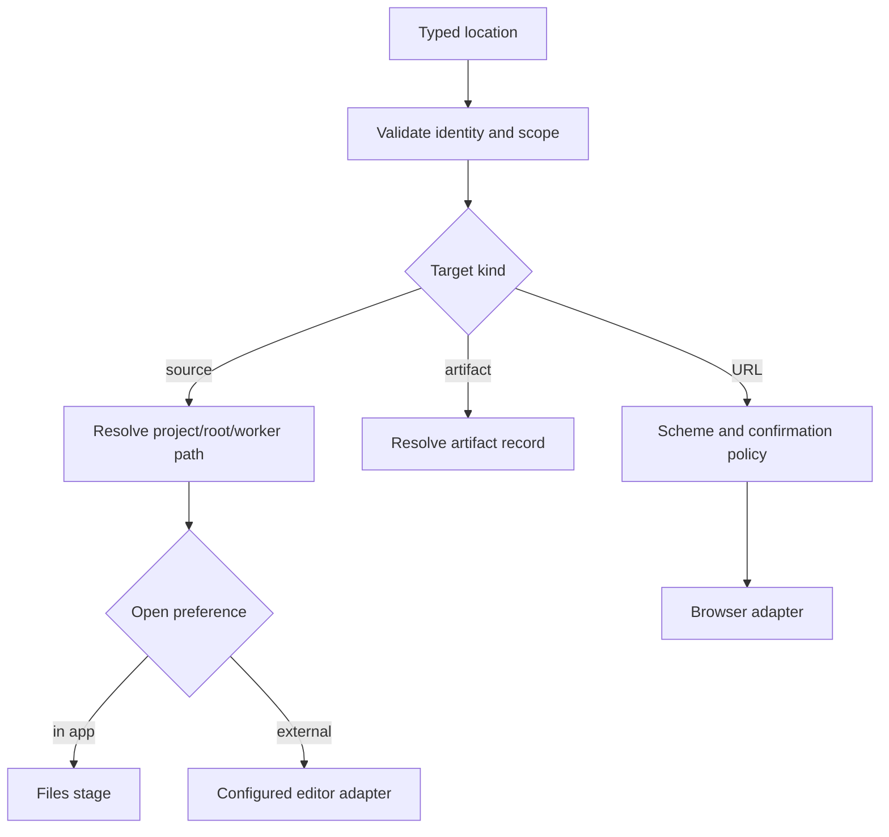

# Project-path navigation

Source navigation turns a typed project location into an in-app open, reveal, or configured external-editor action without losing root, worker, revision, or encoding context.

**See also:** [Files stage](files-stage.md) · [Den](den.md) · [Grounding](grounding.md) · [Search](search.md) · [Context menus](den-context-menus.md) · [In-view find](den-in-view-find.md)

**Machine truth:** [`open-source.ts`](../lycaon-den/src/platform/navigation/open-source.ts) (Den's `openSourceLocation` orchestration and client-side path resolution) · [`open_external.rs`](../lycaon-den/src-tauri/src/open_external.rs) (editor and browser spawn, jail, scheme allowlist) · [`detect_editors/catalog.rs`](../lycaon-den/src-tauri/src/detect_editors/catalog.rs) (the editor catalog) · `/v1/projects/{id}/source/**` and `/v1/projects/{id}/source/definition` in [`docs/openapi/paths/projects`](openapi/paths/projects) · [`internal/sourceloc`](../lycaon/internal/sourceloc), [`internal/sourceref`](../lycaon/internal/sourceref), [`internal/navigationref`](../lycaon/internal/navigationref)

## Why paths are typed

A string such as `src/main.go:42` is ambiguous without knowing which project and root it belongs to, whether it names the primary tree or a worker branch, whether the line refers to a known revision, whether the target is a file, directory, URL, evidence handle, or display-only path, and whether the caller may reveal it outside the application. The navigation contract carries those facts explicitly. Display text is derived from the location; it is never reparsed as authority.

Project files, worker branches, host artifact storage, and external URLs are different address spaces. Navigation never converts between them by string prefix.

## Catalog domains

The process catalog composes immutable snapshot publication, disk generation storage, directory navigation, and literal search. `Catalog` owns snapshot coalescing and invalidation; `Trees` owns index and summary generations, retention, and writer shutdown; `Directories` owns fresh observations, pinned navigation, and presentation resources; `Literals` owns conservative content acceleration. Callers use the corresponding service directly. Confined directory descriptors, checkpoint scheduling, writer admission, and collapse answers each own their synchronization instead of sharing one store lock.

## Source locations

A source location contains stable project/root identity, a normalized relative path, optional worker task/workspace identity, optional revision, and optional line/column/range. Absolute paths may exist inside the host for filesystem access but are not the durable or agent-facing identity: relative typed locations survive project moves and keep one machine's directory layout out of transcripts.

Line and column are hints against a revision. If current bytes differ, the viewer opens the file and marks the target stale rather than pretending the same coordinates still identify the same text.

## Path resolution

**Two resolvers, and they are not interchangeable.** Reading bytes into the app resolves in the host, which owns the roots. Handing a path to a program outside the app resolves in Den and is jailed in Den, because no host call is involved in an external open. Conflating them would overstate what guards the second one; see [External editor](#external-editor).

### Source reads: host-authoritative

Resolution proceeds from trusted identities: load the project and root by id; select the primary or admitted worker workspace; normalize the relative path without following an escaping segment; resolve symlinks under the root policy; verify the target kind and current revision; return a typed openable or non-openable result.

The host never searches all attached roots for a textual path and picks the first match. Multi-root ambiguity is represented, not guessed. Assistant prose abbreviations are interpreted only against source locations supplied to the generating model request ([Prose-derived references](#prose-derived-references)).

### External opens: client-resolved, client-jailed

An external open never reaches the host. Den turns the typed location into an absolute path against its own map of the project's attached roots, then calls the Tauri command with **both** that absolute path and the root list it just used. The Rust side re-checks that the path canonicalizes under one of those caller-supplied roots and refuses otherwise.

That check catches a Den bug that computed a path outside the roots it meant to use. It is not a trust boundary against a compromised renderer, because the renderer supplies the roots the check is made against. What actually bounds an external open is that the launch arguments come from a fixed catalog rather than from the target.

## Worker branches

Worker results can cite paths in isolated branches. The location carries the worker task/workspace identity so opening it reads the worker's bytes, not the primary tree's coincidentally named file. Worker diffs appear in the parent transcript only after successful overlay promotion, positioned at the merge event's ordinal; their links open the merged files in the destination project root. After promotion the host may provide a corresponding primary-tree location, but it does not silently retarget old evidence: the worker reference remains a record of what was inspected. A retired worker workspace resolves to an explicit unavailable/retained-history state.

## Orchestrator: `openSourceLocation`

All UI entry points use one orchestrator: search results, transcript citations, source tree rows, findings, review hunks, context menus, and in-view find. It validates the typed target, applies the user's open preference, falls back to the in-app viewer when an external adapter is unavailable, preserves reveal/focus intent (including another click on the already active file), reports stale or non-openable state, and never changes source bytes. It routes; the host source service remains the source authority.

### Shared navigation actions

Tool path links bind their click, context menu, and selection metadata to the same attached root. A root path such as `.` always selects a folder. For project-tree paths whose kind is unknown, navigation reads that exact parent directory from the host before choosing a file open or folder reveal; a newer navigation supersedes an outstanding lookup. Workflow scaffold paths remain plain text because they do not address project files.

`openSourceLocation` accepts a typed file or folder and an explicit open or tree-reveal action. Resolution converts qualified and absolute input paths to one attached-root-relative address before dispatch. File opens apply the editor preference; folder opens and explicit reveals select their tree target without replacing the editor. Worker locations retain their workspace identity and cannot reveal a coincidentally named primary-tree row.

Host references and grounded citation paths have different provenance but use the same navigation actions and menu construction. A host reference may offer Open and Reveal in tree before its destination is resolved; both pass through the same resolution controller, including candidate validation, unavailable outcomes, retries, and cancellation. A newer navigation in the window supersedes an earlier unresolved reference.

An explicit reveal waits for the mounted tree's workspace before submitting expansion; admission does not wait for the editor or recursive tree coverage, and selection and scrolling wait for a complete destination frame. A path absent from the resulting tree produces a project notice instead of a selection with no visible row.

Each admitted buffer aim has a presentation revision distinct from its file identity, so a repeated link click reselects and reveals the same file after the reader selected a folder or scrolled away. The editor publishes when its document and first viewport are ready, independently of tree discovery, indexing, and reveal. With automatic reveal enabled, the tree follows the displayed file; disabling it preserves tree selection and position, and explicit reveals remain available. See [Den presentation and refresh](den.md#presentation-and-refresh).

Automatic and explicit reveals share one preparation and animation lifecycle. An expanded target reuses the retained presentation and cached coordinates; an uncached target needs one anchored frame read; only disclosure changes require a new presentation. Each upcoming viewport loads a bounded frame before its rows, sticky ancestors, and scroll offset publish together. Reduced motion prepares and publishes the destination once. New navigation, direct tree input, disclosure, filter changes, and leaving the surface cancel pending reads and motion; obsolete completions cannot move selection or focus. Saved tree scroll restoration suppresses only the matching restored file aim. Tree commands enter one queue before asynchronous preparation; a command already accepted by the host still reconciles and persists its intent, and failed reveals settle with an explicit retry. A folder toggle acts on the displayed presentation, and its first command replaces unseen disclosure intent, so an unfinished Expand all cannot make ordinary folder clicks wait for the entire repository.

## In-app viewer

The Files stage is the baseline source viewer and editor: it opens any supported text representation without external software and manages buffers, revisions, save conflict, selection, symbols, and review marks. Opening an already active buffer focuses it and applies the newest explicit reveal target without duplicating the buffer or discarding unsaved state.

**A reference names its root.** A chat reference to a path is stored with the `root_id` the host resolved it under, and its path is qualified as `@label/rel` when that root is not primary. The chip passes the root back on click, and the client resolver reads the `@label` form by root label. A label no root carries is outside the project, never a folder under the primary root. A chip that resolves to nothing says so with a notice.

**A reader's aim outranks a presentation.** Every aim at the editor carries its origin: a reader aims by clicking a file, a link, or a chat chip; a presentation aims on behalf of something else (the walk's current step, a restored session, a conflict). While a reader's open is still arriving, a presentation may open its file beside it but never in front of it. Opening the ordinary file through the orchestrator also leaves an active walk first, because walk state outlives the Files stage and would otherwise re-aim the editor at the walk's own file the moment the stage mounts.

Binary or unsupported representations open a metadata/preview card with explicit alternatives. Raw image responses use a sniffed image media type, disable content sniffing, and sandbox document execution so an SVG cannot run scripts when opened directly.

### Deleted paths

Ordinary chat links follow their exact root/workspace/path, not a saved file identity or version. A recreated file at the same path opens as the current file; only explicit version and change selections remain historical.

On click, Den revalidates the bound reference, including references established from the generating request's source context. An ambiguity selection sends the stored candidate index for the same validation; it cannot supply an arbitrary replacement destination. The host checks the current filesystem first. If the exact path is absent, it consults the latest recorded occupant at that address in source history; a later working-file state supersedes an older deletion. Unsaved editor states do not establish path occupancy. A known deletion resolves with `deleted: true`; an unknown path stays missing. Detached roots, unavailable worker workspaces, directories, and escaping or dangling symlinks do not become deletion links. Deletion lookup uses the indexed project, branch, root, and path; it neither scans the repository nor enumerates history for new candidates.

The Files viewer requests `include_deleted=true` on its root-addressed source read. Current content always wins. An absent path with known deletion history returns a `deleted` payload containing the preceding immutable state and its availability, through the same verified-blob and secret-screening projection used by version comparisons. Deleted files open in-app with their retained history: the tab and open-file list use the struck-through name, the viewer draws the retained contents as removed lines against the file's absence, displays the deletion time, and keeps them read-only. Uncaptured, unavailable, and binary contents keep their specific explanation instead of appearing as an empty file. Opening the path again rechecks its current state while preserving unsaved work in an open buffer.

## External editor

Ordinary Open always navigates inside the app, including citations and other source links. External destinations are explicit Open in actions. Settings choose the editor and browser applications; there is no per-citation or default external opener preference.

External-editor integrations are cataloged adapters. Each entry declares an id and settings label, its per-platform detection facts (macOS app bundles and CLI name, Windows install path and command names, Linux CLI and candidate paths), and already-tokenized argument templates over `{path}` and `{line}` for files, with separate folder arguments for command-line and macOS bundle launches.

**The catalog is the source of truth for applications and spawn arguments; this page owns only the rules.** [`detect_editors/catalog.rs`](../lycaon-den/src-tauri/src/detect_editors/catalog.rs) holds the table. Detection uses known installation paths, registered application identity, or explicit user configuration; it does not scan arbitrary process names and guess compatibility.

**Line support is expressed by the template, not by a capability flag.** An entry that can take a line embeds `{line}` in its arguments, an entry that cannot omits it, and a location with no line substitutes `1`. Column is not carried to any external editor. Reuse-vs-new-window is likewise whatever the entry's own arguments ask its application for.

Custom file and folder commands are separate device preferences. An empty folder command reuses the file command only when that command has no `{line}` token; otherwise the folder destination explains that a folder command is required.

**Argument templates are split before substitution, never after.** Catalog entries are already a list of tokens, so substituting `{path}` into one element cannot add an element. The user's custom open command is a single string, so it is tokenized on whitespace *first* and the placeholders are replaced inside each token; substituting first and splitting the result would let the target name the argument list, so a repository file called `foo --reuse-window bar` would become three argv tokens. No shell is involved either way; token identity is the question.

Failure falls back or reports a structured reason; it never drops the open intent silently.

## Web browser

Browser targets use the same typed routing but remain outside project-path authority. The admitted schemes are exactly `http`, `https`, `mailto`, and `tel`, checked case-insensitively on the trimmed string before any adapter runs (`open_external.rs`); everything else (`file:`, `javascript:`, a custom application scheme, a bare path) is refused rather than handed to the platform opener. External navigation shows the configured confirmation where required and passes one validated URL to the browser adapter, whose custom template is tokenized before `{url}` is substituted. If an in-app authenticated browser surface handles the target, the orchestrator routes there explicitly; it does not infer authentication needs from the hostname.

## Editor encoding

The source service detects only self-identifying text encodings automatically: UTF-8, UTF-8 with BOM, and UTF-16 little- or big-endian with BOM. BOM-less UTF-16 is not guessed; the user can explicitly choose an interpretation.

An opened document records encoding, BOM state, and line-ending policy with its revision. Save must preserve that representation unless the user explicitly converts it. A stale save fails on revision mismatch before encoding can be changed. Offsets have named units: host byte offsets, decoded rune offsets, and editor line/column positions are converted at one boundary and never interchanged implicitly. This contract is shared by in-app editing and native read/write tools, so an AI edit does not silently normalize a file the viewer would preserve.

## Durable navigation references

Transcript, evidence, finding, and review records store typed source identity plus a bounded excerpt/provenance where appropriate; they never store machine-absolute paths as their only address. A durable reference can resolve as current, stale revision, removed/tombstoned, worker workspace unavailable, project/root unavailable, or non-openable but still citable. These outcomes make old evidence explainable without pretending every historical file remains present.

## A path is a link

Path-like content becomes interactive only when its producer supplies a typed location or the host supplies the parse context. Arbitrary prose that resembles a path remains text, so logs, generated code, and untrusted remote content never become ambient filesystem navigation. A host parser may recognize its own structured command/result format because the root and field meaning are already known.

## Prose-derived references

Visible assistant messages carry at most 128 occurrence-addressed navigation references, independently of citation grounding. Markdown destinations, code spans, single-line plain fences, and syntactic path tokens are parsed without filesystem work. Each occurrence retains its syntax and destination separately from its display label. Tool output, remote content, and language-tagged code blocks do not acquire navigation authority through this parser.

### Source context

The host records root-addressed source locations that tool producers actually return: reads, mutations, returned search and Git pages, directory and survey results, and admitted project skill resources. Composer file and folder references retain their validated location; injected `AGENTS.md` content retains the paths its policy loader selected. Hidden, ignored, extensionless, and VCS metadata paths are eligible on the same terms as ordinary files. These facts travel in the existing message metadata envelope, with project, root, worker job, path, and entry kind; they do not create a second repository inventory or search index.

Only locations represented in the final fitted model request may guide abbreviations in its response. Capture occurs at provider dispatch after outbound screening; a fallback replaces the attempted request. Context trimming drops locations whose representation disappeared. Compaction carries existing identities mentioned in the summary and cannot manufacture new locations. Worker delivery retains the original worker address from the job's transcript. Recall retains only locations represented by the delivered hit. This metadata records what was supplied, not what the model understood.

A message's context holds at most 4,096 distinct locations. The host deduplicates before applying the bound and preserves an explicit truncation fact; incomplete context cannot establish a unique abbreviation. Matching builds one basename lookup per message and compares aligned path suffixes. A unique match binds immediately to its original location. Multiple matches produce a chooser with at most 32 candidates (`navigationref/context.go`); larger ambiguity remains plain text. No repository scan, search ranking, or later observation may reinterpret an already-bound mention.

### Destinations and availability

`read` receipts also expose `source.navigation`, a reusable `source://<root-id>/<escaped-path>` Markdown destination. Worker destinations carry `?job_id=<worker-id>`; line ranges use `#L12` or `#L12-L20`. Complete relative destinations use the primary root; `@label/path` selects an attached root. Absolute destinations under an attached root, its session worktree, or a recorded worker checkout normalize to that root's identity. These direct locations can be validated without any context or catalog coverage.

`POST /v1/sessions/{id}/navigation` accepts a message identity, content SHA-256, and optional occurrence `reference_id` and `candidate_index`. It resolves only references stored on that message. A full response patches metadata through the transcript mutation clock and outbox; content and prior-reference comparisons prevent stale responses from overwriting newer prose or bindings.

| Result | Meaning |
|---|---|
| `pending` | A direct destination awaits an availability check |
| `resolved` | A location is bound from supplied context or direct validation; current availability is checked when opening |
| `ambiguous` | Supplied context contains multiple locations; the person chooses |
| `missing` | The exact referenced location is absent and has no known file deletion |
| `unavailable` | The address cannot currently be resolved, or ambiguity exceeds the presentation bound |

Den leaves inferred pending, missing, and unavailable references as ordinary text; context-supported ambiguity has a distinct choice affordance, and authored Markdown destinations remain deliberate open requests that can report an unavailable location. Visible messages check pending direct paths through Den's shared surface-query store, which coalesces simultaneous reads and rejects obsolete responses; there is no discovery polling. Navigation metadata grants neither file permission nor citation grounding.

Worker candidates keep their individual job identities. Selection uses the normal worker source-open path and its branch lease; constructing an ambiguity chooser does not materialize worker checkouts. Worker folder opens report that the folder cannot be opened in the primary tree. Context-menu actions requiring an absolute worker location remain visible but disabled; Open and Copy relative path preserve worker scope.

### Repository scale

Prose linking depends on the generating request's bounded source context, not on the number of repository entries. It does not open the repository catalog or wait for discovery; exact availability checks touch only the referenced paths. `BenchmarkContextNavigation` in `internal/navigationref` measures request contexts up to the location bound.

The shared source catalog (`internal/sourcecatalog`) discovers structural membership separately from search enrichment. Project background work starts one shared traversal of names and kinds; opening Files also starts it when needed, and recursive expansion joins and promotes that work. Foreground directory listings have separate admission capacity and can publish while traversal continues. Background source-history inventory and root-attachment warm-up wait for initial structure before content capture; the source watcher starts before that wait.

Structural discovery uses bounded parallel directory readers and directory-entry kinds, avoiding per-file metadata reads. Descriptor-relative, no-follow traversal prevents queued paths from following replaced ancestors into symlink targets. Hidden and ignored entries, VCS metadata, and empty folders remain visible; recursive discovery does not descend through directory symlinks. Human navigation and search include `.paintedwolf`; agent consumers apply their declared exclusions.

**Traversal order is attention, never admission.** The bundled [directory-priority catalog](../lycaon/config/runtime/source/directory-priority.yaml) owns traversal priority and lazy discovery. Groups with `tier: boundary` represent build output, package installations, caches, temporary work, and VCS metadata. A nested directory containing its own regular `.git` file or `.git` directory is also a lazy boundary. The root itself is always eager. These decisions use the curated catalog and the checkout marker; project ignore files only order and collapse source directories.

Eager discovery records each boundary folder without walking its descendants. Files can open the folder and tools can read, list, search, or summarize an explicitly named path inside it. These reads use the filesystem on demand and validate unwatched directory listings again for each request. Global code and symbol search skip lazy descendants unless the request enables `include_dependencies`; that request builds a fresh private projection and removes it when the reader closes. It does not enlarge the persistent eager catalog. Committed `vendor` and `third_party` source retain their source tier.

Watchers omit lazy descendants from registrations and event-driven eager invalidation. Coverage reports policy-unwatched boundary roots separately from missing registrations. Recursive platform streams filter descendant changes at the same boundary, so builds in nested agent checkouts do not refresh the parent catalog. Boundary creation or removal remains a structural change in the containing source directory. The source scope and capture admission rules still apply independently; tiering grants no permission and excludes no explicitly addressed path.

Traversal runs three lanes that spill to disk when needed: first-party source, then the deferred directories a recursive expansion still opens, then the collapsed trees it does not. A directory discovered inside a later lane stays in it. A whole-tree pass publishes a generation of its own as it leaves the second lane, so a recursive expansion settles there while the last lane continues.

A collapse boundary is a directory the walk policy collapses whose parent it does not. Recursive disclosure closes every boundary under its anchor; a boundary opens one level on request or recursively through its own recursive disclosure, and opening one is ordinary intent that persists. The boundaries themselves derive from the policy and the published structure, never enter saved intent, and are recomputed after a restart. Derivation reads only the opened directories under the anchor and never blocks a command: the current boundaries stand while those are still being listed, and the host installs the answer once they are, refreshing after later publications. Coverage for a recursive expansion counts only the rows its own rules admit.

Listings build immutable ordered pages and an on-disk directory index; larger builds spill mutable bookkeeping to a private temporary database. A completed traversal repairs subtree weights once, then atomically publishes a generation. Readers pin their generation, so a new listing cannot change retained row coordinates. Encoded pages use rolling segments that spill under memory pressure; a spill is unlinked as it is created, so an interrupted engine leaves no scratch behind. Repository size is limited by available storage rather than an aggregate quota. Canceling one view withdraws its interest without canceling work another view needs.

Publication records the complete membership observed during traversal without requiring a quiet filesystem; complete coverage and current freshness are separate facts. Native content-only writes refresh content indexes without rebuilding tree membership. Create, remove, rename, and uncertain watcher events reconcile directory membership conservatively. The catalog retains its latest complete generation independently of foreground listings, and existing presentations reopen through their own generation pins.

**Checkpoints.** Checkpoint writing follows publication asynchronously; only a complete generation is written, and completed writes are five minutes apart (`structuralCheckpointInterval`), because a checkpoint restores directory by directory and one a few minutes old costs only the directories that changed since. A checkpoint belongs to the filesystem root rather than the project that attached it. Every listing records the directory's own modification and change times; on restore, each checkpointed directory is stat-checked against that stamp, and a stamp that moved, a missing path, or a non-directory marks the listing stale for the first pass, which relists it and descends only where a stamp moved. A checkpoint whose root never completed is rejected from its header. A restored listing is complete coverage, not a claim of freshness. Restore runs only once the source watcher covers the root. Checkpoints carry a version and checksums and are validated before reuse; they are disposable structural caches, and scratch left by an interrupted engine is removed at the next boot.

Incremental watcher updates refresh affected listings and retain unrelated directory records. A burst wider than the pending bound is lifted onto the shallowest ancestors that still cover every changed directory, so a write storm inside a few subtrees rescans those subtrees instead of the whole root. A pass then rests for as long as it ran, no less than the watcher's coalescing window and no more than two seconds (`structuralPassRestCeiling`), so a root under continuous writes cannot spend more than half of a core republishing itself. Each incremental publication adds a segment its successors inherit; compaction is due on accumulated rewrite debt or on chain length, and a compaction absorbs whatever published while it copied.

Settings reports these rebuildable files under source catalog data and can clear them without touching repository files. An open view keeps the immutable segments its pinned generation needs, released when the final reader closes. Inactive caches expire after 30 days (`TreeStoreRetention`), and retention reclaims inactive files in access order toward a 4 GiB disk target (`TreeStoreByteBudget`); live data counts toward usage but is never evicted to satisfy that target. These limits do not cap repository size.

The file picker and code search read bounded pages from the same structural record and enrich them in a separate SQLite database. Their VCS exclusions apply before metadata reads and never remove structural entries. When initial discovery is active, enrichment publishes its first partial response before yielding until structure is complete. File metadata, search indexes, and consumer admission do not advance structural generations. A consumer's walk budget limits its own admission without removing human-visible structural facts.

File-picker discovery and disk use are proportional to the materialized checkout and paid once for the picker and code search together. `BenchmarkIndexRepository` in `internal/sourcecatalog` (`PW_INDEX_BENCH_ROOT`) reports time to first answer alongside time to whole coverage; `BenchmarkRecursivePreparation` in `internal/sourcetree` (`PW_TREE_BENCH_ROOT`) measures cold recursive expansion through its first complete viewport. Both run through `./task test:digest`.

## Local file destinations

Context menus and explicit Open in buttons share the destination adapter described in [Context menus](den-context-menus.md#open-destinations). Local browser opening uses a separate native command from web URL navigation: it validates an existing, root-confined file, encodes its path as a file URL, and explicitly selects the configured browser, while the generic web URL opener continues to refuse `file:` URLs. Default application opening uses the OS file association. Both keep path contents in a single argument and report failures through the notice rail. Browser file formats are declared once in [`local-file-formats.json`](../lycaon-den/shared/local-file-formats.json), consumed by Den and the native adapter. The native path check resolves symlinks before launching.

## Index coverage and file lookup

Exact source locations and contextual chat links do not depend on a completed index. File search and fuzzy quick open use the shared metadata index. Each response includes per-root coverage: readability, discovery completion, active refresh, budget omissions, directory failures, and refresh errors; a readable generation can still have incomplete coverage.

Quick open matches any portion of a file's full path, root folder included, and the host alone ranks: basename prefix, then basename substring, then the tightest full-path window, with shorter paths first at equal rank. Each match carries the code point ranges it matched, and the response carries the location a pasted path or trace line named ([Crossbar](search.md#what-a-query-can-name)). Quick open publishes available matches immediately and keeps refreshing while any selected root is still preparing; a warming or failed root does not suppress matches from healthy roots. Coverage notices stay visible beside matches; terminal failures stop polling. File counts from unfinished, bounded, failed, or refreshing discovery are not complete root measurements, and a settled bounded brief can orient but cannot establish an empty repository.

Agent discovery follows the same rule. `find`, `grep`, `wc`, and `summarize` do not wait for a quiet catalog: they answer from the last complete generation within two seconds and mark the result `inventory.fresh: false` when the tree has moved past it, or are rejected with `SURVEY_INVENTORY_WARMING` when no generation is complete yet. A repository that writes reports while its tests run never settles, so freshness is a stated fact of the answer, not a precondition for giving one. `grep` additionally accelerates literal searches with the catalog's per-file Bloom filters (`index_literals.go`), skipping non-matching files without disk reads while scanning live editor drafts and unindexed files directly.

## Open vs reveal

Open makes a target active. Reveal locates it in an existing hierarchy without necessarily changing the active buffer. Focus directs keyboard attention. These are separate intent flags because forcing all three makes context-menu and background navigation jarring. `openSourceLocation` carries focus as `focus: true`; the Files buffer holds it with its reveal target, and the editor consumes both once its document is presented: the caret lands first, then the editor takes keyboard focus. A reader view that is still revealing takes focus only if nothing else has taken it in the meantime.

## Security

- Host source reads are root-confined and symlink-checked.
- An external open is confined in Den against the roots it resolved with: a check on Den's own arithmetic, not a second opinion about it.
- Worker paths retain worker identity.
- External commands receive validated argv, never shell interpolation, and templates are tokenized before substitution.
- URLs use admitted schemes and confirmation policy.
- Source references do not grant read permission.
- Arbitrary prose is not path-parsed into authority.
- Absolute local paths are not the durable identity.
