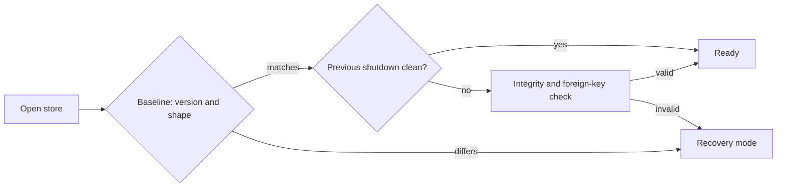

# SQL persistence

The main SQLite store is the durable fact base for sessions, workflows, evidence, projects, authorization history, and their projections. This page explains lifetime relationships and transaction rules; `schema.sql` is the source of truth for the exact shape.

This page uses **lifetime parent** for the row or aggregate that determines a child's retention and deletion. **Subsystem owner** retains the narrower architectural meaning: the Go subsystem authorized to state the outcome of a complete operation. See [Subsystem owners](architecture.md#subsystem-owners).

**See also:** [Compatibility](compatibility.md) · [Architecture](architecture.md#facts-projections-and-caches) · [Projects](projects.md) · [Prompt assembly](prompt-assembly.md) · [Authorization](authorization.md)

**Machine truth:** `lycaon/internal/db/schema.sql` · `lycaon/internal/db/`

## Store topology

Facts that participate in one lifecycle need transactional boundaries. A prompt submission, admitted turn, workflow transition, evidence record, and queue update must not each invent a different durability model.

The host uses one durable SQLite fact database, one rebuildable web index, and content-addressed object stores. Project identity partitions records inside the fact database rather than separate database files: prompt admission, session trees, workflow state, source effects, authorization, artifacts, and project deletion cross those boundaries in transactions. Per-project shards would replace foreign keys and atomic commits with routing tables and recovery sagas while making cross-project home, search, backup, and cost views fan out over an unbounded number of files.

Large repository bytes do not live in table rows. Revision payloads and source snapshot content are content-addressed objects beside SQLite. Rebuildable materialized trees and the web index have independent clear paths, and rebuildable specialist indexes never become the only copy of a durable fact.

### Store claim

The claim (`internal/hostlock`) records the identity of the engine's lock file and store file. Jobs that judge files by database rows are only correct while the store path still names those files; a renamed or replaced data directory breaks that pairing.

The serve loop checks the claim on an interval and stops the engine when it is lost. Destructive maintenance verifies it first and refuses without it: content blob reclaim and orphan sweep, source object maintenance, and store-coupled reconcile.

A body whose object file is missing loads as a record without its body and is reported once. A body that cannot be decoded still fails the load.

## Driver and connection policy

The repository uses one SQLite driver and one store handle so pragmas do not vary by package. `Open` constructs two bounded pools over the same WAL database: one write connection and eight read-only connections. `Exec` and `BeginTx` always enter the writer; `Query` enters the reader pool. The writer uses immediate transactions, so read-then-write operations queue before they read and cannot fail later with a stale-snapshot upgrade. The readers use both `mode=ro` and `query_only`, so a misplaced mutation fails instead of silently escaping writer serialization.

Generated `UPDATE ... RETURNING` queries are mutations even though the driver executes them through a query method; repositories run them inside an explicit writer transaction. Prepared statements also belong to the writer because their access mode is not represented in the database interface.

Every physical connection configures foreign keys and busy handling. WAL, incremental vacuum, and durability are established by the writer before the reader pool opens. The writer runs `synchronous=FULL`: each WAL commit is synced before it is acknowledged, because document replicas may remove their pending copy after that acknowledgement, and accepting only into the page cache would be insufficient. Background checkpoints bound and reclaim the WAL; they are not the durability boundary ([SQLite's synchronous guarantees](https://sqlite.org/pragma.html#pragma_synchronous)). A reader does not wait behind an unrelated provider receipt or source-history commit, and request bursts cannot create an unbounded reader cohort or competing application writers.

Packages do not open their own connection to `store.db`. A second opener would bypass transaction composition, schema checks, and maintenance coordination.

### WAL checkpoints and shutdown

Startup and sustained write pressure signal `PASSIVE` checkpoints; a small or idle store does not wake on a timer. Each pass copies every frame that current read snapshots permit and reports pinned frames, but never waits for a reader or truncates the live log, so a pinned UI or export read affects WAL size, not writer availability. `TRUNCATE` is reserved for orderly shutdown: background runners stop, the read pool closes, the quiescent store marks the shutdown clean, that final frame checkpoints, the WAL truncates, and only then does the writer close. Backups use SQLite's online backup API rather than copying WAL sidecars.

The clean marker decides what the next boot verifies. After a clean shutdown the store opens on its baseline check alone. After an unclean one the boot path runs `quick_check`, whose cost follows the file's B-tree structure rather than its content, and the whole-store `integrity_check` plus `foreign_key_check` run behind serving as the `store-integrity-audit` runner. Damage that audit finds is logged and stamped in `store_meta`; the next boot sees the stamp, runs the whole check synchronously, and refuses the store on the path that reaches the recovery surface, while a clean audit clears the stamp.

The marker and the final truncate are not left to whatever budget the drain before them happened to leave. The ordered shutdown is a sequence of bounded phases (runner drain, HTTP drain, resource release), and the store close holds a reserve of its own: a caller context that is already spent falls back to that floor instead of skipping the marker. The engine declares the resulting worst case, and the desktop shell waits longer than it before a hard kill, so an ordinary quit during active work closes cleanly. See [Den](den.md#quit).

## Schema SSOT

`schema.sql` is the complete fresh target. It defines tables, indexes, triggers, views, foreign keys, generated columns, and full-text projection hooks.

Authored tables are `STRICT`. JSON-bearing columns validate JSON at the storage boundary, boolean integers have closed checks, and persisted money uses integer nano-dollars. Natural composite keys are stored directly with `WITHOUT ROWID`. Every foreign-key child used by cascade/update has a leading index so parent deletion does not turn into repeated table scans. Content-object rows represent resident bytes: a stored empty source file may have `stored_size = 0`, and reclaiming an unprotected object removes its row.

The schema is organized around lifetime parentage rather than feature-page order:

- projects are the lifetime parent of roots and project-scoped records;
- sessions are the lifetime parent of messages, workflow runs, evidence, and child sessions;
- workflow runs are the lifetime parent of phase and obligation state;
- authorization contexts are the lifetime parent of their event chains;
- projections retain a stable source identity back to their authoritative fact;
- people outlive every row that names them: person references never cascade, rows are immutable, and the host owner cannot be deleted.

If a relationship has meaningful independent lifetime, it is explicit. If a child is meaningless without its parent, a foreign key and deletion policy express that.

## Schema-change workflow

Before v1, change `schema.sql` directly and keep revision 1: no migration or old development reader is needed. Update queries, repositories, code and docs, then regenerate typed queries and refresh the locks. After final schema work, `./task upgrade:corpus:prepare` records the current revision/digest in its versioned semantic corpus without declaring that the candidate has shipped. Never change an already released revision's meaning.

For a later schema change, record the shipped source identity from its release corpus in `released-baselines.json`, advance `SchemaVersion`, and register a reviewed adjacent transformation. The small `internal/db/migrations` registry rejects duplicate IDs, ambiguous revision shapes, invalid checksums and missing routes. `schema_migrations` records actual applied steps; fresh stores create the target directly and have an empty ledger. An existing ledger entry must still agree with its immutable registration.

`OpenWithOptions` plans while read-only and requires complete installation recovery capture before its writer opens. Database-only steps run in one immediate transaction; final shape, foreign keys, the ledger and revision stamp move together. `UpgradeStaged` uses the same executor for extracted backups, leaving the source archive and live installation untouched. See [Compatibility](compatibility.md#main-store-durable-db) for recovery snapshots, configuration conversion and downgrade semantics.

These steps migrate SQL only. Every non-SQL durable format retains its explicit version and decoder owner. Changing a manifest, device-file format or backup replacement scope requires its own versioned decoder and staged transformation in that release, tested against the released fixture.

Unknown shapes, including earlier development shapes with revision 1, remain untouched and enter recovery. Development may explicitly recreate its store with `LYCAON_DB_FRESH=1` or `./task db:wipe`; an upgrade failure never triggers that reset. Credentials, configuration and unrelated preferences remain outside the database reset boundary.

### Locks

**Two locks travel with the baseline, and both are committed.** [`lycaon/internal/db/schema.sql.lock.json`](../lycaon/internal/db/schema.sql.lock.json) hashes `schema.sql` statement by statement in order, so an edit that reorders or silently rewrites an existing statement fails instead of landing as an appended change. [`lycaon/internal/db/schema_version_lock.json`](../lycaon/internal/db/schema_version_lock.json) carries the declared `schema_version` that the bundle smoke test, the upgrade corpus boot, and the upgrade rehearsal read back from a real store, which lets those checks assert a version rather than trust one.

An intentional `schema.sql` edit therefore turns `TestSchemaSQLLock` red until you record the new statement hashes:

```bash
UPDATE_SCHEMA_LOCK=1 ./task test:digest -- ./test/contract/persistence -run TestSchemaSQLLock
```

Run that only when the schema change is deliberate; the environment variable is the whole review boundary. The digest runs in a scratch snapshot, and the lock reaches the checkout through the same write-back as every other fixture refresh ([Dev tasks § Digest captures and locking](dev-tasks.md#digest-captures-and-locking)). Review the lock diff with the schema diff, and regenerate typed queries with `./task db:sqlc` in the same change.

### Marker versus shape

The marker is fixed, so it separates a Painted Wolf store from an unrelated file and nothing else. Shape (tables, columns, indexes, triggers, and views read back from the live store and compared to `schema.sql`) is the discriminator that moves, and it is checked wherever a store is accepted: at boot, when staging a restore, and before a retained recovery snapshot is offered. A gate that checked only the marker would publish a store the next boot refuses.



Recovery never attempts heuristic repair. An incompatible store enters a recovery surface with only health and restore operations available. A store this process cannot open at all (damaged bytes, an unreadable journal, a file that is not a database, a permission or IO failure) reaches the same surface: the actions the person needs are restore, recovery snapshot, and start fresh, not a retry that will fail identically. A staged restore that cannot be applied leaves its marker on disk and fails the same way on every relaunch; it too enters recovery mode, and the marker records the failure so an explicit restore, snapshot, or start fresh may replace that transaction. A marker that still loads and has not failed is a genuine pending restart and continues to refuse a competing transaction.

## Transaction boundary

The highest-level operation that needs atomicity defines the transaction boundary. Lower repositories accept the transaction interface and do not begin or commit independently.

| Operation | Atomic facts |
|---|---|
| Prompt admission | prompt submission, queue position, turn/run identity |
| Workflow transition | current phase, obligations, checkpoint state, event |
| Authorization decision | decision, hash-chain event, released or denied action |
| Session deletion | session tree, child workflow state, evidence, projections |
| Extension desired-state mutation | lives outside the DB; must not be half-coupled to a DB commit |

Long external work (provider calls, command execution, scanning, filesystem copy) never runs while holding a database transaction. Persist intent, release the lock, do the work, then commit the observed result under a revision check.

### Command and query paths

Domain stores expose separate command and query ports even though both use the same SQLite handle. A command encloses its precondition read, compare-and-set, fact writes, projection marker, and outbox append in one writer transaction, and returns the exact committed domain result assembled in that transaction.

A command is never declared successful by querying the read pool after commit. WAL readers may legally hold an older snapshot, and a projection may be delayed or damaged; those conditions can make hydration stale or degraded, but cannot turn a committed command into a failed one. The outcomes are explicit: committed with result and revision; rejected or conflicted before commit; commit outcome unknown because the database could not report it reliably; or committed with a projection pending/degraded marker. Only idempotent operation identities reconcile an unknown commit outcome. Sleeping and retrying an unkeyed mutation is not recovery.

## Query conventions

Queries live with their domain repository and return domain-shaped results. Callers do not reconstruct lifetime relationships with ad hoc joins. The store layer uses a small consistent idiom:

- accept `context.Context`;
- wrap errors with the operation and stable identity;
- distinguish not-found from store failure;
- scan nullable values explicitly;
- order every list deterministically;
- use compare-and-set for revisioned state;
- keep write transactions short;
- use a seek key for unbounded lists, or prove the offset window is itself bounded;
- cap SQL candidates before any in-process regex or whole-word post-filter.

Dynamic SQL is limited to cases where the query shape is genuinely dynamic. Values remain parameters; closed enum and column choices come from typed code, never user text.

**Compare-and-set rows.** Revisioned aggregates read and update in one transaction. The update states the expected revision in its predicate and returns the new revision; a zero-row update is a conflict, not success followed by a read. The domain repository defines what a revision covers; callers do not combine unrelated revisions into a synthetic lock.

## Facts and projections

A database table is not automatically a fact. Classification depends on whether losing it loses user history.

| Shape | Recovery rule |
|---|---|
| Turns, attempts, settled model outputs, tool receipts, worker results, workflow runs, evidence records, authorization events | durable facts; retention or deletion is explicit |
| Session entries | immutable typed ordering references; rewind deletes an explicit suffix |
| Human/host message payloads | durable transcript facts ordered by `session_entries` |
| Model-backed message fields and worker cards | durable read projections; repairable from settled outputs and worker results/checkpoints |
| Search/FTS rows | rebuildable projection from source facts |
| Compaction views | versioned prompt projection; canonical messages remain |
| Derived summaries and counts | recompute unless the summary itself is a reviewed artifact |
| External content blobs | referenced bytes are durable; only unclaimed cache objects are reclaimable |

Projection updates happen in the source transaction when cheap and deterministic. Otherwise the source transaction writes a durable repair marker or reconciliation can find the missing projection from facts.

Streaming uses a deliberately different shape. `live_model_outputs` is one bounded replaceable row per active output. Settlement copies the final bytes and structured calls into immutable `model_outputs`, removes the live row, and only then projects transcript/search state. Startup deletes abandoned live rows and repairs only settled outputs missing a projection acknowledgement; it never scans or replays the whole transcript.

Turn checkpoints name restart-safe phases (`preparing`, `model`, `tools`, `decision`, `finalizing`). They do not serialize a Go stack. Recovery uses the phase plus durable outputs and tool receipts: finalizing completes the turn and its linked admission receipts from the stored response in one transaction, tool work reconciles through the receipt lifecycle, and only a genuinely unfinished semantic turn receives a new attempt.

Workers follow the same rule. `worker_jobs` is the small scheduler head, `worker_attempts` records every fenced claim, and `worker_results` holds the one immutable terminal semantic result. A decision request closes its attempt as `suspended` and leaves a replaceable checkpoint on the held job head; it does not consume the terminal-result slot. The parent task card and wake are outcome projections delivered after the result or suspension checkpoint commits; a projector failure leaves a pending delivery, not a failed worker. Reused child sessions are queried through the indexed `worker_job_id`.

Workflow review subjects and assignments are immutable run-scoped context. Worker
results remain the authoritative assessments. The run's `review_revision` advances
transactionally with worker state and bound scan changes; review acceptance checks
that revision in the verdict transaction. Accepted report snapshots are retained
projections over those inputs, so later work cannot rewrite a completed review.
Verdict acceptance commits before evidence publication. The receipt retains a
publication acknowledgement; restart recovery publishes the committed receipt
idempotently without revalidating later inputs. A rejected input revision resolves
the prepared receipt without publishing evidence.

This is a fact-plus-head design, not full event sourcing. Small mutable heads answer current-state questions without replay; immutable attempts, outputs, receipts, and results preserve the execution facts needed for audit and recovery. There is no generic event reducer, global sequence, or whole-history boot replay. Domain-specific projectors consume exact pending rows in bounded batches.

### Compaction views

Prompt compaction stores a projection over a range of canonical messages and never rewrites them. The view records an immutable `covered_through_ord` seek boundary, the identity of that boundary message, the highest source mutation sequence it observed, and its replacement content. Assembly validates that the boundary still exists and that no covered row has a newer sequence, then reads only the ordinal suffix. Appends remain cheap suffix reads; an edit or rewind of covered history invalidates the view instead of serving stale context. The boundary is constant-size regardless of session age.

Background and explicit manual compaction share a per-session writer. View publication and session generation advance in one transaction after checking the source watermark. A single `compaction_attempts` row per session caches the last unproductive validated summary revision; deleting a session deletes this memo. Only the background compaction operation writes views during normal operation; it advances through canonical history in ordinal pages, folding each page into the prior bounded view, so a years-old session is never loaded as one compaction input. Prompt assembly reads views and remains pure. See [Prompt assembly](prompt-assembly.md).

### Authorization ledger

Authorization events are append-only within a session-scoped context and form a hash chain. They do not share prompt compaction or search-retention semantics. Transaction code appends the decision event and changes action state together so an allowed action cannot exist without its recorded authority. Redaction applies before detail JSON is committed. See [Authorization](authorization.md#authorization-ledger).

## Lifetime, deletion, and maintenance

Deletion follows declared lifetime relationships, not a hand-maintained list in each API handler. The database session-tree operation defines a session deletion transaction. Foreign keys cascade ordinary children; the operation explicitly handles records whose lifetime differs:

- search identities become tombstones so old references resolve as removed;
- authorization contexts are sealed as part of session close/delete semantics;
- workflow messages follow their parent run;
- project revision history survives deletion of an individual chat;
- artifact records and bytes survive until explicit artifact or project deletion.

Project deletion first resolves open sessions, worker branches, and filesystem state through their subsystem owners. SQL deletion cannot pretend those external resources disappeared. Project removal receipts in `project_removals` have no project foreign key: they describe an operation whose subject may already be deleted, and the request, reviewed evidence, checkpointed outcome, and operation identity survive it. Settled receipts expire with operation journals; unsettled receipts remain to report interrupted execution without replaying it.

Maintenance does not run on the boot critical path. Startup and sustained write pressure signal a supervised runner. It deletes at most one configured batch per table and pass, catches up in bounded write transactions, then sleeps until the store signals more work. It removes terminal idempotency receipts and unreachable projections after the operation-journal retention period (14 days); it does not age out sessions, workers, scans, evidence, or other user history. Range predicates compare canonical RFC 3339 values directly so retention indexes remain usable. Incremental page reclamation is bounded; the live store is never full-vacuumed. Content caches and specialist indexes use their own budgets and clear paths.

Under that same journal retention: completed and canceled file lifecycle requests expire, while failed and interrupted ones retain their mutation records for explicit recovery, so a cross-filesystem move cannot lose its recovery journal to age-based cleanup; and terminal editor journal payloads compact, retaining small operation identities until the document is deleted, so a delayed outbox retry can acknowledge an already-completed save without repeating a filesystem write.

### Editor storage

The `editor_document_retention` table records person/client references to open tabs independently of collaboration presence. Foreign-key cascade removes references with their document. Metadata reconciliation queries document status without selecting text, and external reconciliation uses keyset pages of identities before reading a body under its document lock.

Native editor envelopes are part of the durable installation inventory and the history-storage usage report. Their format catalog lives in [`internal/editoroutbox/format.json`](../lycaon/internal/editoroutbox/format.json). A capture freezes them before taking the SQLite snapshot: any acknowledgement in the frozen outbox already committed in SQLite, while later deliveries can be replayed safely. The lock file lives outside replacement directories and is also held while applying a restore. Unknown envelope versions and corrupt payloads are refused without rewriting the original work; a format change needs staged conversion and retained codec fixtures. Checkpoint payloads include the host replica id, incarnation, confirmed frame, CRDT state, and window history. Header retention references are committed atomically with their covering checkpoint, excluded from synchronized-cache pruning, and swept against live native windows at boot and destruction. Inventory exposes live bytes so cold recovery can reserve memory before reading the payload; bounded reads reject intervening growth.

Editor read snapshots are compressed and bounded globally and per document. A save reservation is durable until the prepared publication owns its bytes or a durable rejection records that the action had no effect.

### Read boundaries

Reads bound their work by the result they return, never by the size of history. History is never the thing that shrinks; the read boundary is. These rules hold for every surface that opens a project:

- **Completeness is maintained, not searched.** Assessment-board selection reads a transactionally maintained completeness projection and an indexed latest/complete index rather than scanning attempt history. Exact finding and warning aggregates are written with the transition that produces them.
- **Lists are keyset pages with a globally ordered index.** Scan history and worker context page on a global date/engine-id/status order with bounded summary payloads and independently loaded detail. A cursor binds scope and order and excludes rows inserted after the first page, so paging cannot duplicate or skip.
- **A prefix lookup reads two rows, not a window.** Shortened scan IDs resolve through a project-scoped indexed prefix read of at most two IDs, exactly enough to detect ambiguity.
- **Aggregate in SQL, search and sort on the server.** Project cost reporting uses transactional lifetime totals and bounded chat pages instead of decoding receipts and hydrating chats. Global totals and graph scales remain project-wide; export deliberately reads all pages.
- **Filter before you hydrate.** Session/project/workflow selection is indexed, delegation legs load in one batched read, and sandbox reconciliation matches on a bucket key captured with the worker. Pending-checkpoint views answer parent and recorded children in one pending-only query.
- **An existence check is a scalar.** A transcript page is preceded by a scalar session lookup, not by loading the session.
- **Count what is listed.** Artifact-folder listing counts references only for the listed records; an empty folder does no reference work.
- **Previews share bounded summary requests.** Visible Walk cards request at most 100 turn IDs at a time, and SQL counts grouped steps and files without loading revisions or diff bodies. Invalidations target the affected session.

Explicitly opening Walk still loads its complete history; playback, command and Git grouping, and **Walk from here** use that full path, and the summary endpoint follows the same visible user-turn numbering and grouping so the two agree. Bounding a preview is not a promise of constant time elsewhere: cost reporting still aggregates the project's attribution totals, worker and delegation lists return every matching record when their caller asks for that scope, and complete export remains proportional to the requested history.

Live ordering is a consequence, not a defect. Receipts arriving between page requests can change a chat's rank, and a transitioning run can move between scan pages; each response is internally consistent inside its read transaction, and creation order plus the insertion watermark stay stable. Exports use stable ID order but do not freeze usage across the export.

Lifetime cost totals are a projection over both live receipts and retained rollups. Insert/update/delete triggers preserve corrections and retention transfers in the same transaction, retaining pricing provenance, cache usage, partial or unknown usage, and charged versus free calls. See [Cost](cost.md).

Long-lived transcript and execution reads seek on indexed `(session_id, ord)` or `(worker_job_id, attempt)` boundaries. Prompt assembly seeks from the compaction watermark; Den uses transcript cursors; recovery consumes bounded pending pages. Startup does not walk project directories or transcript history: structural recovery drains indexed pages of busy session ids, unsettled turns, interrupted receipts without result projections, pending model-output projections, and pending worker-outcome deliveries, and repair memory is bounded by a page even when the backlog is large.

## Repository-scale source snapshots

Source snapshots are immutable manifests over admitted files, but a snapshot does not contain a fresh copy of every path row. Paths live in stable, content-addressed manifest chunks, so an observation replaces only affected chunks and shares the rest with earlier snapshots. Garbage collection removes unreachable manifests before collecting chunks no surviving manifest names. A snapshot also records the directories its walk did not enter (`source_snapshot_boundaries`): the path, the reason (budget limit, `scope` exclusion, or `unreadable`), and what was read before the cut. Unreadable directories lower capture quality to observed and remain visible as coverage gaps. Boundaries describe the observation and do not change manifest identity.

Root-set heads are a seven-day reuse cache, not a retention claim. Current project inventory and scan records claim their exact snapshots directly; project deletion releases the inventory claim. Scan detail and individual model usage receipts remain indefinitely by default. An explicitly enabled history policy can release eligible scan detail while retaining its identity, summary, and pruning marker; active, latest-authority, and bound scans remain protected. Releasing a scan's detail releases the generation it pinned, and through it the manifest chunks and content nothing else names. Each sweep pass, which runs on the blob GC cadence as well as after a publication, expires bounded batches of heads, manifests, chunks, materialized trees, and failed tree staging.

Snapshots are keyed by canonical roots rather than by project, so two projects over one tree share them and deleting a project does not reach them on its own. Because their manifests keep retained file content referenced, leaving them behind leaves that content on disk. Detaching a root and deleting a project therefore release the snapshots of every root no project still attaches, without waiting out the reuse window; roots another project still attaches keep theirs. Attaching a root is the opposite operation: it discards that root's stale observation index and keeps its snapshots.

The snapshot identity covers path, content digest, size, and mode. Modification time is an observation accelerator, not a source change: when stat metadata moves, freshness hashes only that candidate, and an unchanged file keeps the same manifest. File content remains deduplicated in the shared object store. The transaction that records a captured observation also registers its object, so snapshot-only content participates in the same availability and retention rules as file history.

### Scan authority tables

Scanner authority is normalized separately from queue presentation. `security_assessments` records one requested evaluation and its required scanner set. `security_full_passes` records a full pass before any of its scans exist, with the sessions and workflow runs that asked for it; the pass id becomes its assessment when every member is dispatched over one generation, and `scan_series.desired_pass_id` / `dispatch_pass_id` name the pass a scanner still owes. `scan_run_facts` freezes target, source-admission, execution-manifest, coverage, failure, and finding-set references for each job; `scan_finding_sets` identifies the complete scanner-specific set after incremental reduction, with ordered bodies in `scan_finding_entries`. Finding queries select matching ordinals and load only the requested page. The tables are aggregates and authorities, not subsystem owners. The terminal `code_scans` transition and finding-set binding commit in one transaction, so a complete row cannot exist without its coverage facts.

Finding history is kept apart from finding authority. `scan_finding_events` holds one row per change in a finding's presence for a scanner series (the generation that introduced it and, later, the one that fixed it) with the finding as last observed, so a fixed finding can still be shown. A delta scan writes these from its base-versus-new comparison; a full pass writes them against what the series held open, so a re-observed finding keeps the history its first observation gave it. The rows name the scan that observed them without a foreign key, because they outlive that scan's retention. `scan_blob_findings` caches the findings an engine reported for one file's exact bytes under one execution identity, so a delta reads each changed file's base version once; a finding that spans files is never cached, and rows age out after `DefaultBlobFindingsRetention` (90 days).

Board reads select the latest attempt and the two complete assessments through path/time indexes and an indexed completeness projection updated with every binding or lifecycle transition; selection does not enumerate failed history or hydrate historical findings, guidance, or warning bodies. `scan_summaries`, `scan_finding_rollups`, `assessment_finding_rollups`, and `scan_comparisons` are presentation projections maintained with scan transitions. Assessment hotspots aggregate all members before capping the displayed list, and warning counts deduplicate diagnostics across member sets at write time. Scan lists read a separate bounded payload with severity/kind counts and five sample locations, so worker context does not need evidence hydration; scan detail retains guidance and complete target/deletion path arrays. Comparisons are keyed by immutable finding-set pairs and their board projection contains counts and location stubs rather than finding bodies. Neither these projections nor a displayed older source snapshot establish current coverage.

## History retention

`history-retention.json` defaults every durable-history class to `forever`. Age and byte-budget modes are opt-in; task text, credentials, and user artifacts are outside automatic pruning. Reviewed selections retain their exact IDs in a bounded-memory spool. Each execution batch handles at most 128 owner groups; connected recording/checkpoint/source groups contain at most 128 owners and commit atomically. Larger checkpoint groups can still release an individual owner's exclusive bodies; fully shared bodies remain protected when the complete group cannot fit. Recording groups contain only eligible owners of one project body; a user artifact, project cover, external session reference, or protected owner keeps that body retained.

The storage settings expose every class’s opt-in age and byte-budget modes beside its measured retained content. Class content counts include protected and current bodies, deduplicate shared bodies within a class, and exclude SQLite row/page overhead; classes can overlap and are not an exclusive disk total or pruning savings estimate.

The runner starts after application construction and readiness, measures storage in the background, and checks each hour. Its first automatic policy evaluation occurs on the first hourly tick; subsequent passes are at least 24 hours apart within that process, so a restart can cause an earlier reevaluation. Every pass reads the saved policy and excludes busy-project state, active or pending references, and explicit history protections. It yields between owner operations and releases its mutex between batches. There is no OS-idle or battery-level admission, and the runner holds no sleep inhibitor.

Saving a disabled policy invalidates outstanding preview tokens and prevents further scheduled decisions under the previous policy. A bounded batch already executing finishes before that save acquires the policy mutex; committed deletions retain their tombstones. Restored policies start suspended until reviewed and saved on the destination.

Storage measurements are cached for API reads. Shared source/checkpoint objects are counted once, and attachment file inventory measures compressed bytes. Recovery snapshots report retained file lengths separately because independent copy-on-write snapshots may share physical disk extents; those lengths are not an exclusive physical allocation estimate. Storage reporting exposes retained bytes and measurement scope per lane: project artifacts and attachments are project-scoped, shared source-history objects are device-scoped, and no total is published across those boundaries. There is no combined quota that silently makes project artifacts, attachments, source history, or transcript-linked tool output disposable.

## Backup and recovery

Backups use SQLite's online backup API and are verified before publication; live WAL sidecars are never copied as a backup strategy. Before an application-version or released-schema change, startup captures a self-contained durable directory in `upgrade-recovery/{UUID}/`. Its manifest records exact file sizes and hashes; a separate local record binds the complete manifest digest and inventory. Regular files use APFS clones or Linux reflinks where supported, with a checked streaming copy fallback; the same copy-on-write path covers staging, pre-images and atomic installation. Symlinks are stored as target text until application. A capture failure leaves the live store untouched, and recovery points never depend on live object references surviving retention.

Startup admits only a recognized complete migration route, preflights free space for capture, database working space and the route's checked `ScratchBytes` total, then executes the route in one transaction. After the schema commit it validates live retained references before subsystem writers start. Only full application readiness marks recovery complete and permits retaining just the newest two completed points; failed and pending recovery points remain available until explicit deletion. Before subsystem writers start, an alternate application version detaches the previous pending pointer without marking its target successful, and embedded-only points are named so later upgrades cannot reuse a snapshot after the source installation has continued. Required metadata publication failures enter recovery; failure to prune an older successful point reports a warning and preserves availability.

Restore keeps a pre-image of the displaced live state. In recovery mode there is no live database handle, so the pre-image is the store file as it lies on disk together with its journals; the apply deletes those journals, and the last-checkpointed database alone is not the state the restore displaced. The pre-image is named in the local-data registry, so its bytes are measurable rather than an anonymous tree that grows once per restore, and it is retained until the next restore transaction stages its own. A pre-image a failed transaction displaced is kept alongside the new one.

The application captures whole-install recovery snapshots for upgrades; it does not schedule periodic backups. Device-level backup belongs to the operating system or the user's backup service. User-requested exports additionally stream the retained project bytes, source-history objects, draft workspaces, rewind checkpoints, application state, and durable configuration declared by the local-data registry. Credentials, process tokens, code-loading control-plane files, caches, and live SQLite sidecars are excluded. Archive creation and restore staging use temporary files rather than holding the database or archive in memory. Restore verifies hashes and the staged SQLite store before creating the live recovery copy or publishing a restart marker. Restore staging and version rules: [Compatibility](compatibility.md#backup--restore).

Worker baselines and overlays persist UUID identities. SQL resolves their filenames under the active installation's `worker-baselines` directory, and worker branch locations are relative to that installation. `worker_baselines` records each sealed file's SHA-256 and format. Sealed SQLite manifests contain a format version and content hashes, and readers receive the active `source-content` store at runtime; they never embed an installation path. Versioned branch topology remains in the sibling `.meta/state.json`; archives retain that metadata while omitting rebuildable trees, and the archived database verifies that each referenced manifest, body and branch metadata file is present. Restoring to another data directory therefore preserves baseline reads, overlay reconstruction and merging. External project root locations remain explicit references and do not grant trust on a different machine.

### Object maintenance

Source-object maintenance never makes the ledger wait. A capture holds the object store's shared reference lease from its first object write until its manifest is published; maintenance tries for the exclusive lease one bounded batch at a time and defers when a capture holds it, so no pending sweep queues new captures behind it and the ledger's record mutex is never taken by maintenance. A ledger record needs no lease: it writes its object inside the transaction that references it, and each maintenance batch runs its reference checks and file removals inside one immediate write transaction, so the single application writer keeps a record's object write and reference commit on one side of a batch or the other. A deferred sweep retries on a short cadence; a deferred repair at inventory completion is not that inventory's failure.

Source writes check exact queued candidates without scanning the filesystem. Inventory completion also repairs bounded staging and content-addressed batches, and reference deletion enqueues exact object candidates for bounded checks. Attachment metadata supplies project usage without a filesystem walk; exact unclaimed candidates and bounded directory cursors repair interrupted writes, and filesystem guards exist only while admission commits. Transcript spill references are updated with transcript mutations. Project session activity advances bounded pages of settled spill files and checks each candidate through the reference index; recent writes remain candidates so a new publication cannot race old-reference cleanup.

## sqlc and generated access

Generated query code is useful where the SQL shape is static and maps cleanly to domain types. It does not replace the operation-level transaction boundary or become a second schema source. Handwritten repositories remain appropriate for dynamic search, multi-step transitions, and carefully bounded maintenance.

`./task db:sqlc` regenerates `internal/db` from `schema.sql`, `sqlc.yaml`, and `internal/db/queries/**`; generated output is not edited directly. `check:drift` runs `db:sqlc:check` (stale output) and `db:sqlc:vet` (no `SELECT *`; `DELETE`/`UPDATE` require a `WHERE`), so a query added without regenerating fails the gate rather than the compiler.

## Invariants

- `schema.sql` is the complete fresh target; a schema change records the shipped baseline and ships a registered migration step ([compatibility](compatibility.md#main-store-durable-db)).
- One operation controls each transaction, and external work does not occur under a DB lock.
- Command preconditions and committed return values come from the writer transaction; query freshness never decides command success.
- One application writer serializes all mutations; bounded read-only connections serve queries.
- Live checkpoints are passive and write-pressure driven; WAL truncation happens only after readers drain at shutdown.
- The clean marker and the closing truncate hold a reserve no drain can spend, and the shell waits out the engine's declared shutdown budget before a hard kill.
- Store shape, not the fixed marker, decides whether a store can be served: at boot, at restore staging, and before a recovery snapshot is offered.
- Durable facts and rebuildable projections remain distinguishable.
- Retry creates a new fenced attempt beneath the same semantic turn or worker job.
- Deletes follow declared lifetimes and leave durable references explainable.
- Files are deleted on the strength of database rows only while the engine's store claim verifies.
- Full-repository snapshot growth follows changed chunks, not files × snapshots.
- Maintenance and in-process filtering are bounded before reading user-scale data.
