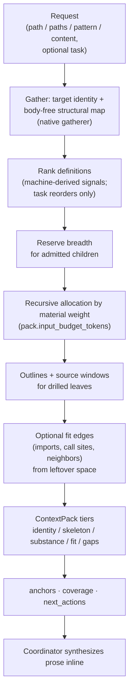

# summarize

`summarize` builds a deterministic briefing for a named file, directory, path set, or search pattern. Bare `{"path":"…"}` is enough. The host gathers the material, fills one token budget with ranked definitions, and returns a `ContextPack` synchronously. The tool never invokes an LLM, so its availability does not depend on a provider or summarizer model; a coordinator composes prose from the pack outside the tool invocation.

**Machine truth:** [`lycaon/internal/summarize/`](../lycaon/internal/summarize) (engine) · [`lycaon/internal/tools/native/survey/`](../lycaon/internal/tools/native/survey) (gatherer and tool) · caps in [`platform/host/summarize.yaml`](../lycaon/config/packs/painted-wolf/platform/host/summarize.yaml) → [`caps.go`](../lycaon/internal/summarize/caps.go) · wire shape `SummarizeCoverage` in [`schemas/summarize.yaml`](openapi/components/schemas/summarize.yaml)

**See also:** [Tools](tools.md) · [Grounding](grounding.md) · [Prompt assembly](prompt-assembly.md) · [Host behavior](dispatch-hints.md)

---

## Agent-visible contract

A repository scope (`path` or `paths`) or inline `content` is required:

| Argument | Meaning |
|----------|---------|
| `path` | Repository-relative file or directory |
| `paths` | Repository-relative path set |
| `pattern` | Optional RE2 search within the repository scope; requires `path` or `paths` |
| `content` | Inline material, at most `gather.inline_max_bytes` |
| `task` | Optional ranking focus; it cannot expand the gathered pile |
| `cursor` | Opaque directory or pattern continuation from `next_actions` |

The response carries:

- `anchors`: host-derived path, line, and verbatim excerpt records (`anchors.default` 12, `anchors.max` 24);
- `pack`: `identity`, `skeleton`, `substance`, `imports`, `call_sites`, `neighbors`;
- `next_actions`: up to `pack.next_actions_max` (3) follow-ups, each with `tool` (`read` | `grep` | `find` | `list_dir` | `summarize`), the target coordinates it needs (`path`, `paths`, `lines`, `pattern`, `cursor`, optional `task`), and a one-line `why`;
- `coverage`: `catalog_state`, `catalog_refreshing`, `complete`, `catalog_revision`, indexed totals (`files_total`, `definitions_total`, `children_total`), observed counts (`files_represented`, `anchors_returned`, `matches_observed`, `matching_files_observed`, `match_samples_returned`, `children_returned`), and `cursor`;
- `gather`: mode, scope, candidate and byte counts, and sample pattern matches;
- `sources_touched`: up to 64 paths read.

Work counters, parser diagnostics, and diagnostic gaps stay in host telemetry. Results are best-effort views at every level and do not repeat incompleteness qualifications.

Ready directory views query one pinned, completed catalog generation. They report exact indexed file and byte totals while reading a bounded selection of child metadata. `coverage.catalog_state` distinguishes a ready index from initial warming; `catalog_refreshing` identifies a completed generation being reconciled. A warming view provides a bounded live overview, prioritizes the directory's own documentation, sets `complete: false`, and leaves unknown totals absent. It never labels an unfinished inventory complete.

Directory continuations bind the scope, ranking task, authorization projection, catalog generation, and page plan. Each continuation resumes an indexed child page without sorting or walking the remaining subtree. Selected but undrilled directories keep aggregate counts and concrete drill actions.

Pattern searches page through indexed source paths under the same file and byte budgets as outlining. `matches_observed` and `matching_files_observed` accumulate across pages; they never claim an exhaustive scope search, and an empty match page can still have a continuation. Pattern matching and outlining share cached source bytes.

## The pack

One budget rail, `pack.input_budget_tokens`, meters every admission against the same size proxy (`pack.size_divisor`: tokens ≈ chars / 4), and the unit of value is a ranked definition (symbol plus source line). Files and directories run the same algorithm over different candidate piles.

Gather target identity and a body-free structural map, rank definitions with machine-derived signals, reserve breadth for admitted children, then allocate the remainder recursively by material weight. Outlines and source windows are pulled only for leaves the allocator drills; optional fit edges take leftover space when enabled. Anchors, gaps, metrics, and `next_actions` come out of the admitted pack.

| Tier | Contents | Drop priority |
|------|----------|---------------|
| `identity` | Target paths, kinds, languages, counts | Last |
| `skeleton` | Ranked definitions and directory rollup rows | After fit and substance tails |
| `substance` | Symbol-anchored source windows | Tail drops after fit |
| `fit` | Bounded imports, call sites, neighbors | First to drop |

Every readable regular file contributes to a directory rollup maintained by the index. Symlinks and special files remain structural entries and are not traversed or parsed. The budget controls detail while cursors expose the remaining children. When a parser yields no definitions the gatherer degrades to section headers, config keys, or head paragraphs. Source windows start at the definition or section and merge overlapping lines before charging the budget; large files keep a span around the strongest task-matching definition within the bytes already read. When parsing fails, source fallback prioritizes exact qualified names and code identifiers before prose matches, without claiming a parsed definition.

Wire fitting (`pack.wire_budget_tokens`) trims the assembled result without gathering or parsing again. A pack that still exceeds its inline ceiling at commit spills whole and leaves an address in the message ([Prompt assembly § Summarize tool](prompt-assembly.md#summarize-tool)).

## Evidence and grounding

Anchors come from the assembled pack, not from model output. Each anchor names the path, line, and exact excerpt the host used, so evidence stays stable without asking a model to reproduce nested JSON or exact citation tokens. Source evidence still passes through the read boundary.

## Reject codes

| Code | When |
|------|------|
| `SUMMARIZE_NO_INPUT` | Neither `path`, `paths`, nor `content` was supplied |
| `SUMMARIZE_PATTERN_NEEDS_PATH` | `pattern` without a repository scope |
| `SUMMARIZE_CONTENT_TOO_LARGE` | Inline `content` over `gather.inline_max_bytes` |
| `SUMMARIZE_NO_MATERIAL` | The scope resolved but yielded nothing to summarize |
| `SUMMARIZE_CURSOR_STALE` | A continuation no longer matches its catalog generation or scope |

Paths outside the allowed roots return the ordinary read-boundary rejects. Budget pressure is not a rejection: it returns the best fitting pack and optional `next_actions`.

## Directory and reference discovery

Directory targets use the source catalog's paged summary API. Subtree aggregates are only true once a subtree is whole, so orientation keeps its own rebuildable SQLite generation per attached root, effective read scope, and nested-repository policy, published complete or not at all, unlike the file index behind search and quick open, which publishes as it discovers. Accessible hidden, ignored, and unknown-language files remain eligible; no ecosystem, extension, ignore-file, or scratch-path list decides source relevance. Nested attached repositories follow the configured repository boundary (`gather.prune_nested_vcs`).

Initial discovery and uncertain watcher reconciliation run through the background-work broker. Published generations survive restarts; restart serves the last completed generation as refreshing while validation runs. Known file changes update the affected entry and ancestor totals; directory additions, removals, or replacement scan only the changed material. Read transactions keep concurrent summaries consistent while a writer publishes the next generation.

Child selection combines indexed material order with bounded task-name and documentation candidates. A page cursor freezes its promoted children and tracks the remaining aggregate material. Names, outlines, and source reads have invocation-wide budgets shared across recursive allocation and assembly. Tie-breaks among gathered candidates come from documentation links and task-to-path and task-to-symbol ranking; these signals reorder or annotate material and never expand the requested scope.

Repository-wide reference discovery is off in the shipped defaults: `gather.neighbor_max`, `gather.call_site_max`, and `gather.import_edge_max` are zero together, skipping single-file reference gathering, and `pack.subtree_fanin_grep_max` is zero, skipping directory fan-in scans. Single-file summaries then keep identity, ranked definitions, source windows, and anchors without neighbors, call sites, or import edges; directory summaries keep structural, task, and documentation-link ranking without scanning for inbound imports. Setting any single-file reference cap above zero re-enables the shared reference scan, which opens and scans candidate file contents across the attached repository even for a single-file request; caps on returned leads do not bound that work. With discovery on, import fan-in and one-hop import pull-through also affect ranking.

Single-file and pattern targets use direct gather paths. Multi-child directory targets use the recursive allocator.

## Caps

Caps live in `summarize.yaml` and land on `summarize.Caps`. `pack.input_budget_tokens` (2200) is the main rail and `pack.size_divisor` the proxy everything meters against; `pack.wire_budget_tokens` (2400) bounds the complete response; the `pack.subtree_*` family bounds represented detail; `gather.*` bounds parser windows, pattern pages, excerpts, and nested-repository pruning.

Shipped defaults allow `gather.max_files_read` 32 source files and `gather.max_bytes` 4 MB per call, with `gather.file_read_bytes` 1 MiB per file; truncated observations omit full-file line counts. `gather.metadata_nodes` (512) limits admitted tree nodes across the invocation. `gather.index_wait_ms` (100) only bounds joining an initial or refreshing background index; an expired join returns explicit warming coverage rather than interrupting discovery.

For a ready directory index, a fixed metadata budget bounds child materialization independently of descendant count. Child pages use indexed keyset seeks, task candidates use indexed term/path ranges, and totals and representative paths are direct record lookups. Initial discovery and opt-in reference searches still do work proportional to their observed content, and each pattern invocation bounds both indexed rows and source observation; neither becomes free because the returned pack is small.

[`TestSummarizeCapsAllReferenced`](../lycaon/test/contract/sessions/summarize_caps_referenced_test.go) reflects over `summarize.Caps` and fails if a field is never read outside `caps.go` and tests: a cap nobody reads must be wired or deleted.

Tests compare work at different repository sizes (rows returned by indexed seeks, files and bytes read, directories opened, response bytes) as portable cost invariants, not host latency thresholds; late-page fixtures and indexed query plans guard against offset scans, and the stress tier exercises the same seeks at millions of metadata rows.

## Responsibility

The native gatherer (`internal/tools/native/survey/`) implements filesystem discovery and `OutlineProvider`. The summarize engine (`internal/summarize/`) implements ranking, recursive allocation, tier assembly, anchors, gaps, and metrics. Successful assembly records host-only measurements: metadata rows read, source files and bytes read, budget spent, breadth and depth admissions, outlined files, rolled-up outline skips, fan-in passes, nested repositories pruned, and the primary detail limit.

## Repository map

`list_dir({"path":"."})` returns a compact directory map under a 1,200-token proxy. A ready map queries only immediate children, includes named immediate-child and descendant-file counts, and exposes a continuation. A cold map opens one directory and examines at most 64 entries without counting child directories; counts absent from that view are unknown. Named subdirectories and explicit listing controls keep ordinary listing behavior.
