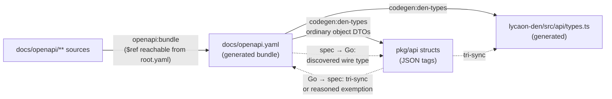

# Test strategy

How Painted Wolf Code proves v1 behavior.

**See also:** [Dev tasks](dev-tasks.md) · [Architecture](architecture.md) · [Docs map](README.md)

---

## Layers

| Layer | Location | Covers |
|-------|----------|------|
| Unit and component | `lycaon/internal/<pkg>/*_test.go` | Parsers, registries, evaluators, merge rules, and domain logic |
| Integration | `*_integration_test.go` (the `integration` build tag), `lycaon/test/wiring/` | SQLite, assembled managers, and the real application graph |
| Contract | `lycaon/test/contract/<domain>/` | OpenAPI, generated artifacts, catalog invariants, package boundaries, and forbidden shapes |
| HTTP journey | `lycaon/test/security/` | Authenticated routes, project policy, sessions, workflows, tools, and recovery |
| Den | `lycaon-den/src/**/*.test.*` | Stores, components, projections, accessibility, and client behavior |
| Browser and desktop | `lycaon-den/e2e/` | Complete user journeys through the web harness and Tauri shell |
| Performance | `cmd/lycaon-perf`, Go benchmarks | Release-channel boot and mixed workloads, latency distributions, resource stability, restart/replay recovery, and focused hot paths |
| Release | release workflow targets | Full Go behavior, race detection, scanner corpora, and Go and Den coverage floors |
| Verification runner | `scripts/verification_tests/` | The `./task` queue: planning, batching, admission, cancellation, caching, reuse, health, and worker limits, through bounded subprocess fixtures |
| Coordinator benchmark | `scripts/coordinator-benchmark/` | Opt-in paid runs of candidate models through the real application, graded on environment outcomes — [Coordinator benchmark](coordinator-benchmark.md) |

The bundled OpenAPI document is generated from `docs/openapi/**`. Contract tests prove its layout and its agreement with generated Go and TypeScript surfaces, in both directions and at both ends of the pipeline:

- **Go → spec.** Every exported `pkg/api` struct with JSON tags either tri-syncs against an OpenAPI schema and a generated `types.ts` schema, or claims a reasoned exemption in `structGoInternal` (never on the wire) or `structOneOfCarrier` (flat carrier for a `oneOf` schema). Structs with no JSON tags and structs that embed a field are accounted for the same way, because both would otherwise escape the field comparison.
- **Spec → Go.** Every OpenAPI object schema has an automatically discovered Go wire type or an explicit custom-representation exemption. Ordinary object DTOs are generated from the schema; no second type registry is maintained.
- **Spec source → bundle.** Every definition under `docs/openapi/**` is reachable by `$ref` from `root.yaml`. Unreferenced spec source never enters `docs/openapi.yaml`, so bundle drift, `codegen:den-types`, and the struct tri-sync are all blind to it.

Solid arrows generate; dotted arrows are contract-test proofs:

Database architecture tests derive their scope from the live schema: they
discover authored tables and foreign keys through SQLite, ask the query planner
whether lifetime-parent lookups are indexed, and enforce strict keyed storage,
so new tables and larger histories enter the same proof automatically.
Behavioral stores use differential models where practical: the SQL and memory
implementations must produce the same seek pages, and concurrency tests close
and reopen the store before running integrity checks. The SQLite concurrency
suite holds a reader snapshot open while direct writes, immediate write
transactions, and passive checkpoints overlap, proving that writes serialize
without `BUSY_SNAPSHOT`, checkpoints report pinned frames without rejecting
writes, every reader is read-only, and orderly shutdown drains readers before
truncating the WAL.

## OAR and catalog verification

`./task oar:verify` runs `test:oar` (engine, declared facts, copy rendering,
tool vocabulary, full catalog construction, and rejection delivery) without
`-short`, so catalog-wide walks that `test:short` skips still run, then the
vendored standard corpus through `oar:conformance`. The full `check` gate
includes it. `oar:conformance --json` is the machine-readable standard report
for comparison with other implementations.

Catalog scenarios must reach their intrinsic rejection through the OAR evaluator
before any fallback renderer runs. Recovery vocabulary checks include backticked
call examples as well as bare tool names. Tests of changing anchors prove that the
recipient audience is recomputed. Invocation recovery facts are lazy and use the
frozen offered-tool list; another profile's tools and later request state cannot
widen the recommendation. These checks prove wiring, declarations, and
observable behavior; they do not freeze prompt wording.

## Test rules

- Tests make no real LLM calls. Use fixtures, stub providers, fake MCP servers, and `LYCAON_LLM_MOCK=1`. Live provider smoke tests require the `live_llm` build tag in addition to credentials; they never run in normal, full, race, or coverage suites and still require separate authorization for paid calls.
- Invalid manifests, unknown vocabulary ids, and forbidden ids fail at load or transition time.
- New HTTP routes carry a contract test and an authenticated HTTP journey.
- Durable encoding tests compare exact bytes, BOM state, line endings, and raw hashes.
- Go failures use `testutil.FailErr(t, "<step>", err)` or `check.FailErr` from the contract suites' shared `internal/check` package.
- No test asserts on markdown prose. A `docs/**.md` page is written for a reader, so a test that parses one turns an editorial choice into a build break. `docs/openapi/**` is different: that tree is the hand-edited wire SSOT, and checking it against generated Go and TypeScript is a spec contract.
- Race failures are product failures. Fix the synchronization boundary; do not skip, retry, or sleep around them.
- Each E2E tier starts and stops its own dependencies.
- Fixture corpora are committed. A test keyed to a path outside the repository runs on one machine and skips on every other.
- A suite that needs a provisioned host — applied Seatbelt, a staged scanner engine — derives its gated inventory from source and fails when the declared CI scope does not reach a member. Where a job promises the suite, its `*_REQUIRED` flag makes a missing dependency fatal instead of a skip.
- A test belongs in the cheapest layer that can prove its promise. Unit/component tests exercise one domain boundary with in-process collaborators; repository contracts prove a durable cross-tree invariant; wiring tests prove assembled managers; HTTP and browser tiers prove a user-visible journey. Do not use a repository scan to stand in for behavior, or an end-to-end journey to prove a parser branch.
- `test:short` is only the unit/component feedback loop. Repository contracts run beside it as their own `test:contract` stage of `check-fast`, because they are cheap and are the boundary changes most often cross. External integration, wiring, process smoke tests, and HTTP journeys remain mandatory but run as named closeout/release tiers, where their failure names the boundary rather than making every edit wait on a source-tree crawl.
- Files classified as internal integration carry the `integration` build tag and stay out of `test:short`; `test:integration`, `test:full`, and `test:race` opt in explicitly and run without `-short`. Source-content limit journeys, document compaction/reload scenarios, full checkpoint-cap capture, and archive entry-limit extraction assemble real stores and filesystems, so they belong to this tier with their exact limit and editing-history fixtures intact. Randomized SQLite lifecycle properties in `test/property` use the same tag; pure in-memory properties remain in the normal suite.
- Keep scale sweeps separate from boundary proofs. Routine source-tree tests exercise first and late pages and indexed edits at 1,000 and 4,096 rows; stress runs repeat the same assertions at 100,000, one million, and ten million rows. Do not shrink a fixture below a real page, spill, or byte-limit boundary merely to save time.
- A test must invoke the production transition it claims to prove. Test-local copies of draft settlement or retention deletion are not lifecycle coverage.
- Use virtual clocks for in-process timers (`testing/synctest` in Go and Vitest fake timers in Den). Mutex-contention tests need real bounded deadlines: a mutex wait prevents Go virtual time from advancing. Synchronize queue tests on admission and completion; use a required barrier when the queue deliberately drops writes.
- Den follows the same cadence: `den:test:fast` proves a representative model-and-DOM seam canary, while exhaustive model tests, component fixtures, accessibility checks, and repository scans run in full `den:test`. Browser journeys remain their own explicit tier.

## Shared test infrastructure

Repository-wide source assertions use a corpus snapshot instead of opening and
parsing the tree independently in every test. The dependency-free Go API is
`lycaon/pkg/testcorpus`: deterministic file selection, relative lookup and
subtree views, cached snapshots, Go AST parsing with a shared token file set,
and an explicit non-empty assertion. Contract tests share cached loaders in
`lycaon/test/contract/internal/check/source_corpus.go` and `go_ast_corpus.go`;
Den source contracts use the matching snapshot API in
`lycaon-den/src/test/source-corpus.ts`.

Use the narrow fixture at the boundary being exercised:

| Need | Fixture |
|------|---------|
| Disposable prepared SQLite store | `internal/testdbfixture` |
| Temporary Git repository and commits | `internal/testutil/gittest` |
| Go module or checkout root | `configlayout.FindModuleRoot` or `testutil.CheckoutRoot` |
| Process-wide Anchor, guidance, Git, or browser setup | the corresponding `internal/testsetup/*` package, called explicitly from `TestMain` |
| Partial Den API client | `lycaon-den/src/test/client-fixture.ts`; undeclared method access fails immediately |
| E2E connection, workflow, project-file, or session synchronization | `lycaon-den/e2e/helpers.ts` |
| Rust temporary directory lifecycle | `lycaon-den/src-tauri/src/test_support.rs` |

The shared fixtures centralize lifecycle and failure labeling without hiding the
state relevant to a scenario. Tests of database recovery, backup, Git plumbing,
or filesystem traversal may still use the underlying mechanism directly when
that mechanism is the subject of the test.

### Contract organization

Contract suites live in domain packages under `lycaon/test/contract/`:
`agentcontext`, `architecture`, `catalogs`, `evidence`, `files`, `frontend`,
`host`, `maintainability`, `persistence`, `prompts`, `providers`, `release`,
`runner`, `scanning`, `security`, `sessions`, `tools`, `wire`, and `workflows`.
The root package keeps the source-snapshot tests. The `test:contract` target
discovers the complete subtree. Shared support lives under `internal/`: `check`
(failure labels, repository root, source and Go AST corpora), `wirespec` (OpenAPI
and client parsing), and the `catalogfixture`, `toolfixture`, `workflowfixture`,
and `guidancescan` fixtures. Keep a scanner with the contract it proves and use
shared support for cross-domain mechanics. Source assertions follow subpackages
and import manifests, so a split file never leaves them inspecting an empty entry.

## Size budgets and changed coverage

Agents write code and prompt copy fast. These checks shape it through
feedback an agent meets while it works: a warning as something approaches
its limit, then a stop for a change that leaves a touched artifact past it.
`check-fast` and `check` run them, and CI runs them in the `limits` lane with
the same rules and the same words, so CI says nothing `check-fast` did not.

### Size budgets

`./task budgets` measures two suites:

| Suite | Measures | Policy |
|---|---|---|
| Maintainability (`test/contract/maintainability`) | Code-bearing lines per production and test file; handwritten files per production and test directory; Go struct fields; Go receiver methods and receiver lines summed across files and platform variants, so splitting a file cannot hide concentration; distinct local TypeScript imports per module. Generated and vendored files are classified from generator inventories. | [`maintainability-budgets.yaml`](../lycaon/test/contract/maintainability-budgets.yaml) |
| Prompts (`test/contract/agentcontext`) | UTF-8 bytes of every rendered worker persona, coordinator tripartite fixture, inject, agent template, kick, and instruction unit; the tools each coordinator surface and worker profile sends upfront, limited as two classes; and each turn kind's widest static prompt against the model window | `sizes` and `absolute_maximums` in [`prompt-budgets.yaml`](../lycaon/config/packs/painted-wolf/platform/host/prompt-budgets.yaml) |

Each maintainability category has a cleanup threshold (`warn`) and a hard limit
(`limit`). Warnings permit admission and become cleanup issues after merge; hard
limits reject new or growing excess. Maintainability measures both the change
base and current source using the same rules. An artifact that must stay
larger can have an explicit cap and reason in its own file under
[`maintainability-exceptions`](../lycaon/test/contract/maintainability-exceptions/).
Prompt limits remain absolute because they protect the model window.

| Standing | Result |
|---|---|
| A touched artifact past its warning line | Warning; creates or updates a post-merge cleanup issue |
| A new or growing artifact past its limit, with no exception | Fails |
| An unchanged or shrinking legacy artifact past its limit | Warning; post-merge cleanup issue |
| Any artifact past its exception cap | Fails |
| A touched artifact within its exception | Notice naming the reason; cleanup issue if above `warn` |
| An untouched artifact past its limit | Counted |
| An exception the change adds or raises | Notice for review |

A change touches a file it edits, a directory it adds files to or removes
files from, and a Go type whose declaration or methods it edits, compared
with the [change base](#the-change-base). Editing a helper beside a large type
does not make the change answer for the type. Prompts are few, so every
prompt past its limit needs an exception, and warnings name the prompts whose
sources a change edited.

#### Maintainability cleanup issues

[`maintainability-issues.yml`](../.github/workflows/maintainability-issues.yml)
reconciles cleanup issues after a completed Qualification push on main. It checks
that the commit is the current main tip and is associated with a PR merged into
this repository's main branch. PR, merge-group, foreign-repository, direct-push,
and qualification-dispatch observations cannot create issues. A qualification
failure in another lane does not hide maintainability debt already merged.

The maintainability report contains a complete inventory of every artifact above
`warn`, including untouched artifacts and artifacts admitted by an exception.
Each entry records its category, artifact ID, measurement, cleanup threshold,
hard limit, effective exception cap, touch status, and source paths. Source commit,
tree, change base, and a content digest bind the report to the measured source.
Admission still uses change-scoped findings; a complete tracking inventory does
not turn untouched debt into a gate failure.

Ordinary intake creates issues for artifacts touched by merged changes. The
complete inventory updates existing issues and closes them when they fall to the
cleanup threshold or disappear. This avoids dumping the entire legacy inventory
into GitHub on rollout. A persisted checkpoint and replay of intervening merged
qualification receipts carry warning intake across superseded workflow runs.
Missing history stops reconciliation; it never silently treats missing evidence
as completed cleanup.

Identity is the SHA-256 of the canonical JSON array
`["maintainability", category, artifact_id]`. A machine-owned issue-body block
stores that identity and the latest observation. The reconciler enumerates open
and closed issues without GitHub search, preserves titles and human prose outside
the block, and updates evidence without adding a comment on every run. Completed
issues reopen when the same debt returns. Closing an issue as **not planned**
suppresses future reopening for that identity. Renames create new identities.
Only automation-authored issues can be adopted or mutated; exact older automatic
titles are adopted when their artifact is still above the threshold. Duplicate
automatic issues point to the oldest canonical issue and close as not planned.

The workflow serializes reconciliation across runs. It reads one bounded current-
attempt limits receipt, validates the entire snapshot and plan before writing,
and checks main before each mutation. A concurrently edited issue stops the run
rather than overwriting the edit. Repeated observations produce no writes. A later
complete snapshot converges a partially applied run. Checkpoints are retained for
90 days; expiration or unavailable receipts requires explicit replay/backfill.

To preview or recover, dispatch **Maintainability cleanup** with `run_id` set to
a completed Qualification push for the current main tip. `dry_run` defaults to
true. `backfill` defaults to false; setting it true includes untouched baseline
debt and establishes a fresh checkpoint after a successful apply. Review the
retained `maintainability-issues.json` plan and category counts before applying a
backfill. The workflow never runs downloaded code or changes admission limits.

The host assembles a prompt per turn: instruction units render only while
their tools are offered, requestable tool schemas load on demand, and the
decision engine may leave out the units it is confident a request does not
need. The prompt suite measures those parts where they vary. Each instruction
unit has its own limit, because it rides wherever its tools go. Each turn
kind's widest static prompt is then assembled from its own parts: a
coordinator turn from its fixture's system prompt, its surface's upfront
tools, and the injects that can ride a coordinator turn; a worker turn from
its persona, its profile's upfront tools, and the worker injects. Each adds
one request's largest tool loads (`max_loads` in `decisions.yaml`) and the
units they bring. That widest prompt is the one the window check holds,
because every mandatory unit renders when the decision engine abstains or
fails. Every run reports the widest coordinator and worker turns' headroom,
warning below 10%, beside their size once every requestable tool has loaded:
warm turns can accumulate loads until the next cold boundary, so that
figure is context for the runtime rather than a static guarantee. Kicks and project content
(AGENTS.md chains, MCP schemas, source briefs, skill bodies) are sized by
the project at runtime; they ride in the reserved session budget, which
compaction calibrates against the provider's reported token counts.

Look before editing something large:
`PW_BUDGETS_INSPECT="lycaon/internal/hitl" ./task budgets` reports those
files and directories as if the change had touched them. When an artifact
fails, split it along a real seam
([Organizing code](architecture.md#organizing-code)) or trim the copy the
failure names. Raise a category limit only when the whole category should
change. The worker persona cap also bounds `pw prompts render --check` and
pack persona validation.

The suites carry the `budgets` build tag, so `test:contract` and `test:full`
do not repeat them. A passing budget does not show cohesion, so review still
reads the structure. Dependency direction is enforced separately by the
[import-graph layering contract](package-layering.md), Go rejects import
cycles at compile time, and `funlen` in `lycaon/.golangci.yml` stays in force.

### Changed coverage

`./task coverage:changes` (Go) and `./task den:coverage:changes` (Den) measure
the statements a change adds or modifies. A unit (a Go package or a Den file)
fails when more than the policy's grace count of its changed statements are
uncovered and fewer than its percentage are covered. Code a change does not
touch never fails it, and floors live in
[`coverage-policy.json`](../scripts/coverage-policy.json).

- **Go** measures each changed package with its own short tests, then measures
  a package that falls short again with the tests of the packages that import
  it, crediting coverage across packages. Changed functions in a package no
  test reaches fail. Packages in `lycaon/coverage-exempt.txt` and generated
  files are skipped, and a touched package below the package floor is noted.
- **Den** runs the Vitest tests related to the changed files and measures
  coverage of those files. Tests, mocks, declarations, and generated files are
  skipped.

Aggregate floors (`check:coverage`, `den:coverage-check`) read the same policy
and run nightly.

### The change base

Budgets and changed coverage measure against the merge base with the main
branch (`origin/main`, then `main`), so a branch is measured from where it
left; the base decides which lines a change touched, never what size an
artifact may be. `PW_CHANGE_BASE` names a different base. Without a reachable
base, `budgets` reports that nothing was established rather than guessing. Inside a source snapshot the
change includes uncommitted and untracked work. On GitHub Actions every
finding also annotates its file and the job summary.

## Concurrency and type floors

| Floor | Rule |
|---|---|
| Race detector | `./task test:race` is a tag-blocking gate. Fix with synchronisation or single-mutator confinement — never by re-architecting the algorithm to dodge the detector. A concurrent map write is a fatal Go runtime throw, not a stale read |
| Shared-structure discipline | Choose **one** discipline per structure and apply it whole: a mutex around every mutation *and* read, or single-mutator confinement where exactly one goroutine mutates. A half-locked structure reads as safe and is not |
| Test doubles | A double must honour the concurrency contract its real counterpart does. A fake that does not keeps hiding real bugs |
| Bundled-config staging | `configtest.Use` / `Overlay` / `Only` swaps the bundled source for the whole process, so a test that stages config runs sequentially — and every helper that reaches one does too. `t.Parallel()` there panics rather than serving the staged tree to every other test in flight |
| Indexed access | Den compiles under `noUncheckedIndexedAccess`, so `arr[i]` and `record[k]` type as `T \| undefined`. Resolve every access by **narrowing at the access site** — a length or presence check, an early return, a destructure with a default, or widening a helper's return. `!`, `as T`, and `@ts-expect-error` are forbidden as fixes; each hides a gap the compiler just proved. Test files are not exempt |

Every fix in this model is a capacity, a delete, a `select`, a lock, or a type narrowing — never a heuristic ([`AGENTS.md` No heuristics](../AGENTS.md#no-heuristics)).

### Verification scheduling

Local verification shares one queue across checkouts and agents. On macOS and
Linux, admission freezes a batch of at most 32 consecutive compatible requests
from the same checkout and declared execution environment; a different checkout
or environment ends membership, and membership closes before source capture
without a collection delay. Windows retains exclusive admission. Up to eight
batches may be active at once. A gate's stages have no order among themselves:
each starts once its declared resources allow, the longest expected stage
first, and requests in a batch overlap the same way. A batch keeps at most one
stage reservation waiting, so one large gate cannot queue ahead of every other
batch. Invocations outside a batch (non-shareable selections, fixture refreshes,
and targets outside the catalog) hold the union of what their stages declare
for their whole run; only a target nothing declares holds every resource.
Nested commands reuse their operation's reservation.

Admission is first-in, first-out per conflict, ordered by when the request each
piece of work serves arrived. Later work may pass an earlier waiter it conflicts
with only when its estimated completion falls before that waiter could start
anyway. Estimates are the 90th percentile of up to 32 completed runs of the same
name; work without three completed runs, and running work past its estimate,
backfills nothing. A request joins a batch once any of its stages could start,
so several waiters for one lock cannot occupy every active-batch slot. Queued
stage declarations guide admission; the captured catalog owns the locks applied
during execution. Each subscriber returns as soon as its own result is
established.

Shared execution receives only the environment variables the catalog's
`environment` section declares by name or prefix. Agent-session identifiers,
control sockets, and credentials never reach tests or separate otherwise
identical requests. Every declared value must be a function of the checkout
rather than of the call that submitted it: a per-invocation value gives each
request its own digest, which ends batch sharing and result reuse with no
visible failure; `scripts/verification_tests/test_environment_identity_execution.py`
asserts that rule against the catalog. Verification is offline: no network route
is declared or passed through, so a stage that dials is denied by the boundary.
Only the environment digest is stored in queue metadata.

The declared plan in `scripts/verification-plan.json` owns gate composition and
shareable stages. Submitted intents are resolved again using the captured
catalog; `resolved-plan.json` records the definitions actually verified. Exact
Task stages run once per batch; compatible Go scopes resolve against its
snapshot and run their package union, longest recorded packages first. A union
adds at most 16 packages to the oldest ready request; larger followers consume
already proven packages and execute the remainder afterward. Within a batch,
package results are reusable with identical execution options; full, short,
race, tags, and filters are not interchangeable.

Across batches, a passing Go package result is reused when nothing it depended
on changed: its build identity (the content of every file compiled or embedded
across the test binary's dependency closure, module versions, tags, race mode,
and the toolchain, independent of the snapshot slot's path), the arguments that
choose tests, the Go runtime settings the binary reads directly, the declared
environment, and every input the Go test log observed (files opened or statted,
compared by content, and environment variables read). Worker counts and timeout
scale are not inputs. A test process that starts another process is never
recorded, because the child's inputs are unobservable; fork observation uses
kernel process events, available on macOS, and elsewhere every package runs.
The per-run scratch home and temporary directories start empty and are not
inputs. Receipts name the batch and stage that recorded a reused result.
Results live under the user cache directory in `paintedwolf/verification-results`,
limited to 2 GiB and 14 days since last use. Selections with explicit repeat
counts run outside batches and never reuse.

Unsupported selection flags reject before admission, as do arguments for a
target that declares no selection grammar and information flags that would run
the target instead of describing it. A declared Go target accepts the digest
package and flag grammar narrowed to its own declared packages, so a scoped
invocation keeps the target's recipe and shares outcomes with the unscoped one.
Supported Go repeat, shuffle, and benchmark modes, fixture refreshes, and replay
run outside a shared batch, holding what their targets declare; so does Go
`-failfast`, whether passed on the command line or through `GOFLAGS`.

Every requester receives its own receipt and exit status. A gate ends at its
first failed or unverified stage, and stages only it still needed stop;
independent requests continue. A Go package failure (a failing test binary exit,
a terminal package event, or a build failure) answers every request that needs
the package while the stage is still running, and the receipt links that
package's output. A package may pass despite an unrelated package failure only
when its terminal Go event and the completed digest establish that result.
Missing evidence and infrastructure interruptions are unverified. A Go stage
whose packages hold test files behind a tier tag it does not enable (a tag some
declared target turns on, such as `integration`) records them per package as
`excluded_tests` and prints how many did not run and which targets run them; its
pass never covers those files. Receipts
identify the source commit/tree and link to the stage logs and reports in
`verification/<batch-id>/` under the
[artifact root](dev-tasks.md#build-outputs-caches-and-locks). Retention keeps
up to 20 completed batches and 512 MiB, pruning artifacts and source refs
together; the newest batch and active batches/subscribers are protected even
when they exceed the budget. No receipt is reused across batches; recorded Go
package results are.

`./task test:status` shows active batches and stages, sharing and queued
requests, global worker capacity, reserved and available slots, each operation's
resource locks and blocking reason with the blocking request's name and ticket,
rendered ages, a one-line summary, and advisory observations (what is holding
the queue, how a run compares with completed runs of the same target, and
whether a batch's captured source still matches its checkout). Reservations are
concurrency limits, not measurements of CPU utilization. `test:pause` holds new
admissions while admitted work finishes; `test:resume` releases the queue.
`test:cancel` withdraws one request by ticket with a recorded reason, keeping
work no other request shares unless it carries an adverse health observation or
the caller forces it. An independent supervisor keeps shared work alive for the
remaining requesters and stops an operation when no requester needs it.
Inherited lease locks prevent an interrupted supervisor's descendants from
overlapping the next admission; canceling that run stops whichever descendants
still hold its lease. Live model benchmarks remain outside the queue; their
build and fixture-test commands acquire admission separately. Interactive
`den:harness` sessions also run outside admission: their sidecar build and
engine staging acquire a separate exclusive reservation through
`den:harness -- --prepare`, which ends before interactive startup. Automated
harness tests and canaries remain queued for their whole execution.

The default worker budget is three quarters of the available CPUs, rounded down
and bounded between one and eight. `PW_TEST_WORKERS` selects a per-invocation
ceiling between one and that budget; shared execution also obeys the global
capacity. The catalog's `resources` declarations reserve half that capacity for
a parallel Go, Rust, or Vitest operation, and one slot for frontend lint or
typechecking, which leaves room for independent work even during a suite's
final serial test. A declaration may request an explicit worker count; an
undeclared operation reserves exclusive access. Go favors package fanout within
that reservation and assigns unused package slots to `GOMAXPROCS` for small
scopes; race runs default to two runtime workers per package. Parallel tests per
package obey the same per-process share; Vitest uses at most four workers.
Fuzzing and Rust builds share the same budget. Runners use the worker limits
assigned at admission; host load only adjusts timeouts, and race runs scale
scheduler-dependent waits at least 3×. Hosted CI sets
`PW_TEST_HOST=dedicated`: one lane owns the runner, so the budget is every CPU
(still at most eight) and a shared operation reserves all of it.

Resource names are global locks: Go digests share `go`, Go lint holds `lint`,
frontend checks hold `frontend`, Cargo tests hold `rust`, and the isolated
scheduler fixtures hold `runner` with one worker. Harness browser tests reserve
half the worker budget and hold `harness` and `frontend`, allowing unrelated Go
work to continue; they run on the captured source with isolated ports and state,
and default browser failure artifacts are retained beside their receipt. Go
package builds declare an empty lock list: their compiler cache supports
concurrent commands, so they reserve CPU slots only. Every catalog stage
declares its resource use; runner tests enforce coverage. Checks that only read
captured source or write private temporary output reserve CPU without global
locks. A resource may declare `shared_locks`: two shared holders can overlap,
but an exclusive holder or earlier exclusive waiter blocks new shared holders.
Go digests capture their reports from private invocation logs before the short
canonical-publication lock, so simultaneous runs cannot substitute another run's
evidence. Bundled-scanner digests additionally hold `scanners` exclusively.
Unclassified stages hold `*`, conflicting with every operation. Targets outside
the catalog declare resources by Task name: the development engine build and
the upgrade corpus runs that depend on it hold `dev-engine` and `scanners`.
Locks and worker reservations are inherited by child processes and remain held
after a parent crash until its surviving children exit. Pause stops new batch
and invocation admission; already admitted batches finish their stages.

Scheduler-dependent waits, watchdogs, and lint timeouts scale 1×–4× with host
load. `PW_TEST_TIMEOUT_SCALE` selects an explicit scale; production deadlines
and polling intervals remain unchanged.

Compilation artifacts use the persistent Go cache across snapshots, tests,
fuzzing, and lint. Snapshot worktrees reuse leased directory slots, preserving
the absolute source paths in Go's compilation cache keys; active descendants
keep their slot, and overlapping snapshots receive separate slots.
Path-sensitive lint diagnostics retain isolated leased caches. Verification
budgets the active Go build cache at 20 GiB, trimming least recently used
entries toward 16 GiB beside running builds; see
[digest captures and locking](dev-tasks.md#digest-captures-and-locking) for the
settings. Go's own test-result cache keys file inputs on modification times,
which every fresh snapshot changes, so full digests pass `-count=1` and shared
stages rely on recorded results instead.

Long gates and digest runs execute from a synthetic commit that captures the
complete tracked and untracked source tree. The capture accepts only two
matching tree ids, then runs from a detached scratch worktree, so concurrent
edits cannot produce a mixed build and generators remain free to publish while
the snapshot runs. Source preparation reserves one worker and a global snapshot
lock, so captures remain serialized across checkouts while other resource
classes can execute. Frontend packages, staged sidecars, and bundled notices are
mounted into the scratch worktree without becoming source inputs. Each capture
refreshes a private copy of the pinned Git engine because harness preparation
reshapes and signs that toolchain.

Routine correctness fixtures cover late pagination and deeply nested session
deletion with bounded row counts. `./task test:stress` runs the 100,000-,
one-million-, and ten-million-row source trees, the 50,000-message session
tree, and a working year of 25,000 real editor saves with retained source
history and three recovery captures. Its catalog recipe keeps packages and tests
serial and allows 90 minutes per package before host-load scaling. The nightly
workflow includes this tier. Active fuzz exploration runs through
`./task test:fuzz` in nightly verification, separately from
`check`; ordinary Go tests still execute saved fuzz seed cases. Transcript
performance tests use the `.perf.test.ts` suffix and run through
`./task den:test:transcript-scale` in nightly verification; normal
Den suites exclude elapsed-time assertions while retaining memory and DOM bounds
as ordinary correctness tests. SQL query and OpenAPI bundle generation drift are
checked once through `db:sqlc:check` and `openapi:bundle:check` in
`check:drift`; Go contracts inspect the generated surfaces without launching the
generators again.

## Working commands

Run every task from the repository root through `./task`.

| Task | Use |
|------|-----|
| `./task test:digest -- ./internal/foo/...` | Scoped Go iteration |
| `./task test:contract` | Static and generated contract layer; required by `check` |
| `./task test:integration` | Assembled Go components and randomized SQLite lifecycle properties; included by `test:full` and `test:race` |
| `./task test:security` | Authenticated HTTP journeys |
| `./task test:runner` | Verification runner tests in `scripts/verification_tests/` |
| `./task den:test:digest -- src/path/file.test.ts` | Scoped Den iteration |
| `./task den:test:fast` | Representative Den model and DOM seam canaries |
| `./task den:test` | Full Den Vitest suite |
| `./task e2e:den` | Browser user journeys |
| `./task e2e:den:desktop` | Tauri desktop journeys |
| `./task perf:bench` | Repeated Go microbenchmarks and an optional baseline comparison |
| `./task perf:sidecar` | Representative isolated sidecar workload with enforced latency/resource/correctness budgets |
| `./task perf:soak` | Long mixed workload with graceful restart, task recovery, SSE cursor reset, and leak checks |
| `./task budgets` | Prompt and code size budgets for what the change touches |
| `./task coverage:changes` / `./task den:coverage:changes` | Coverage of the Go and Den statements a change adds or modifies |
| `./task check-fast` | Local handoff gate: build, lint:fast, size budgets, unit/component Go suite, repository contracts, Den typecheck, lint, den:test:fast, and changed coverage |
| `./task check` | Full local and qualification gate: cross-compile, drift, complete Go and scanner suites, full Den and Rust correctness suites, size budgets, changed coverage, lint, and vulnerability checks |

Each gate runs once per change. A pushed change runs affected-scope integration in CI and full qualification after merge, so it runs neither local gate first; a change handed off without a push runs `./task check-fast`. Each gate uses one stable source snapshot. Digest runners keep failure captures under `last-run/` in the [artifact root](dev-tasks.md#build-outputs-caches-and-locks); `./task test:failed` replays the latest failed Go run from its retained source commit with the recorded arguments and timeouts, bounded by the current worker budget. A passing scoped run does not erase that failure.

Digest output lists up to five slow packages and Go tests, and up to five slow
Vitest assertions, when they take at least one second. Go reports the slowest
event for each top-level test and its subtests, so parallel children remain
visible even when their parent reports zero elapsed time; cached package
timings are omitted. These elapsed times overlap and must not be summed. They
are review signals, not pass/fail budgets; Vitest assertion times exclude
collection and transform cost. Compare captures with the same source and worker
allocation before claiming an end-to-end speedup.

## Release verification

| Task | Proof |
|------|-------|
| `./task test:full` | Complete Go behavior, wiring, smoke, HTTP, and required bundled scanner suites |
| `./task test:race` | Go race detector with integration scenarios and no `-short`; the dedicated `test/security` HTTP journeys remain in `test:full` |
| `./task check:coverage` | Go aggregate statement coverage floor |
| `./task den:coverage-check` | Den aggregate coverage floors |
| `./task den:test:rust` | Tauri Rust tests |
| `./task test:scanners` | Bundled scanners against the committed corpus, with a staged engine |
| `./task perf:sidecar` | Sidecar service-level objectives and integrity invariants |
| `./task perf:soak` | Steady-state resource growth and restart/replay recovery |

### Hosted admission and qualification

A ready pull request runs the `fast` profile; the merge queue runs the
`integration` profile on the exact commit that lands. Both report the required
`check` from [`ci.yml`](../.github/workflows/ci.yml). The fast tier is one
static job, `ready`: it compiles the host and runs `lint:fast`, size budgets,
Den typecheck, and Den lint, in about ten minutes with setup, `lint:fast` being
the longest stage at about seven. The planner requires its stages to be a subset
of `./task check-fast`. Nothing that runs tests runs here: repository
contracts, changed coverage, and every suite wait for the merge queue, which
starts each group with its cheapest, most frequently failing lanes (`limits`,
for budgets and changed coverage, and `lint`) and stops the group at its first
failure, freeing its runners for the next.

Pull requests no longer run the integration gate themselves. Running it for
the pull request and again for its merge group doubled demand on twenty
runners, so the queue competed with pull request CI for them; and with groups
of one built in parallel, a failure in the queue costs one rebuild of the group
behind it. Marking a pull request ready and enabling auto-merge
(`gh pr merge <number> --auto --squash`) is how work enters the queue: GitHub
adds it once the fast tier's `check` passes. Auto-merge is enabled with the
author's own credentials. No workflow enables it, because a merge enabled with
a workflow's `GITHUB_TOKEN` would not start main's push workflows, qualification
and cache warming.

The integration gate uses a conservative change planner. It always compiles
the host and runs repository contracts and smoke tests. Go changes add integration-enabled reverse import
closure, including test imports; Den changes run the complete frontend suite.
Frontend execution deliberately stays broad because source-scanning tests and
runtime discovery are not represented by static imports alone. Unknown paths,
fixtures, dependencies, build inputs, generated contracts, and verification
policy expand to the full `check` profile. A missing Git base fails planning;
an unresolved Go graph runs the full Go recipe. An empty shard never passes as
an empty test run. Selection and source identities travel with each lane receipt.

The planner in [`scripts/ci_policy/impact.py`](../scripts/ci_policy/impact.py)
uses the pull request merge base or the merge group's explicit `base_sha`, not
the moving `origin/main` tip. That same base reaches changed coverage and budget
checks. [`verification-plan.json`](../scripts/verification-plan.json) owns the
recipes and partitions. The integration partition covers `check` except Windows
cross compilation; broad changes include that too. Ordinary source changes
select only relevant lanes. Each lane still enters through `./task`, capturing
source and producing normal receipts.

Drafts spend no verification runners and cannot pass `check`. Manual dispatch
runs the complete check and platform tier, or with `profile: fast` the fast
tier for a pull request whose events start no CI, such as the dependency
inventory's. [`qualification.yml`](../.github/workflows/qualification.yml)
runs the complete check, then platform confinement and upgrade corpus, then
browser and desktop journeys on main. One qualification runs at a time: it does
not cancel an in-progress run for a newer push, and a newer push replaces a
pending one, so a busy main qualifies its newest commit rather than every
commit. Nightly retains race, fuzz, WebKit, stress, and performance
coverage. A release requires a successful **Qualification** run for its exact
commit on main; passing merge admission is insufficient.

#### Determinism and capacity

Required integration execution has a Linux network namespace containing only
loopback. It runs as the normal runner account after namespace creation.
Pinned Go, Cargo, frontend, scanner, and generator inputs are provisioned first;
Go and Cargo offline modes reject missing inputs during execution. Dependency
service outages can still prevent provisioning, and cache availability is not
a passing check. This boundary prevents a test from depending on public NTP,
DNS, or advisory freshness while preserving local fixture servers.

A complete Go advisory snapshot covers modules before a feature adds them.
[`dependency-inventory.yml`](../.github/workflows/dependency-inventory.yml)
refreshes that snapshot and the informational inventory through a signed-off PR;
feature PRs do not regenerate either. The bot explicitly dispatches CI because
PRs created using `GITHUB_TOKEN` do not trigger another workflow automatically.
Nightly additionally checks fresh upstream advisories.

The reviewed queue parameters are in
[`queue-settings.json`](../scripts/ci_policy/queue-settings.json): two groups
build at once, each holding one pull request, with `ALLGREEN`, and a group's
checks must report within 90 minutes. The second group builds on the first, so
a failure invalidates only the group behind it, and a group of one never sends
other pull requests back. When the queue invalidates a group, GitHub deletes its
`gh-readonly-queue/...` branch but lets its run continue. Each verification job
therefore starts [`merge-group-watch`](../.github/actions/merge-group-watch/action.yml),
which polls its own branch with `git ls-remote` about once a minute, spending no
REST API quota, and cancels the run with one API call once the branch is gone.
Merge-group CI is the only CI granted `actions: write`, for that call; pull
request CI, which runs unreviewed code, keeps a read-only token. Queue-to-merge
time and lane durations are measured service objectives, not claims
established by timeout settings.

Apply queue settings only after this workflow is available on main:
`GITHUB_REPOSITORY=paintedwolf-ai/paintedwolf-code PYTHONPATH=scripts python3 -m ci_policy.queue_settings 24657984`
prints the proposed ruleset while preserving unrelated protections. Add `--apply`
to apply that reviewed configuration. This is an administrative rollout step,
not something feature CI performs.

#### Failure evidence and recovery

Every lane retains compact JSON receipts separately from large diagnostic logs.
A stable signature is formed from stage, package, and failing test identities.
Assertions and package memory limits are source failures and are never retried.
Only a measured cgroup OOM increment without test-failure evidence permits one
retry, and every failed executable job must have a matching record. Signal 9,
exit 137, timeout, a cancelled run, and missing evidence alone are ambiguous and
do not authorize retry. Recovery does not retry pull request artifacts with a
privileged token.

[`verification-recovery.yml`](../.github/workflows/verification-recovery.yml)
runs code from main, parses bounded JSON without extracting or executing
artifacts, and recovers measured runner faults. Failure details remain in run
annotations, summaries, and retained evidence. It
proposes a draft revert only for a source failure on the current main tip with
one introducing merged PR and a qualified immediate parent. Ambiguous attribution,
advanced main, and conflicts require investigation from the qualification run.
Revert proposals link directly to that run. Reverts never
merge automatically.

Each Linux Go test process has a 3.5 GiB RSS ceiling, declared in
[`resources.json`](../scripts/ci_policy/resources.json): hosted runners have
16 GiB and run four packages at once, so the ceiling keeps one package from
exhausting the runner while leaving room for the toolchain. A package that needs
more declares its own ceiling with a tracking issue (`internal/api`, #382).
Unless a run sets `GOMEMLIMIT`, the test binary gets a soft limit at 80% of its
ceiling, so the collector reclaims garbage before the ceiling instead of letting
the heap reach twice its live size, and the guard measures retained memory
rather than collector slack.
Failure identifies the package, measured bytes, and bound. Security and wiring suites additionally
check retained heap and goroutine growth after cleanup through
`internal/testutil/resourceguard`. These guards detect resource regressions;
they do not replace the host-release reachability guard or lifecycle repair in
#356. Other platforms retain the end-of-package guards but do not claim Linux
RSS enforcement.

Only [`build-caches.yml`](../.github/workflows/build-caches.yml) saves caches,
on pushes to main. A run restores only caches saved on its own ref or on main,
and each merge-queue run has its own ref, so an entry the queue saved could
serve no later run while it evicted main's under the repository's 10 GB limit.
Pull request, merge-queue, nightly, and tag runs therefore restore without
saving. Keys follow toolchains and dependency locks, so main saves once per
dependency change, and the workflow's summary reports total cache usage.
A running warmer finishes before the next push starts warming, so frequent
merges cannot repeatedly cancel cold preparation before it saves; a newer push
replaces a warmer still pending, so only main's newest commit waits to warm.
Its Linux and macOS jobs and the release compile run one after another, on one
runner at a time.
Release builds restore the shared Go cache; their separate cache retains only
Tauri release builds. The cache actions enforce the main-ref write boundary
themselves. Pinned Go analyzers have separate lint and vulnerability caches; their module versions
and compiler identity are checked before use, including after a cache restore.
A missing or mismatched binary is rebuilt before analysis. Cache warming enters
through `./task setup-dev`; workspace verification enters through its ordinary
managed targets.

Quarantine is explicit reviewed policy in
[`quarantine.json`](../scripts/ci_policy/quarantine.json), initially empty.
Each entry names one package and exact top-level test, a GitHub issue, owner,
and expiry date. Expiry fails planning. Quarantined tests run independently in
nightly observation and remain visible without blocking admission. The system
never labels an unexplained failure flaky or quarantines it automatically.

[`queue-health.yml`](../.github/workflows/queue-health.yml) reports the last
24 hours every four hours: queue-to-merge time from structured timeline events,
lane durations, and unsuccessful merge-group runs. Three distinct runs sharing
one failure signature appear in the report without opening issues. Missing artifacts
remain a coverage gap; cancellation is reported separately from an attributed test failure.

### Runner capacity

The GitHub Free plan runs twenty hosted jobs at once across the organization,
five of them on macOS, and starts waiting jobs first come, first served. The
project uses no larger or self-hosted runners, so those limits are fixed.
Contention is ruled out by construction instead: each class of work holds a
fixed number of runners, through one run at a time, capped matrices, and a
run's stages in turn wherever running them side by side would widen it. The
merge queue's own settings budget its class: groups built at once times the
gate's cap. The `capacity` table in
[`verification-plan.json`](../scripts/verification-plan.json) declares each
triggered workflow's footprint and each verification profile's
`max_parallel`. The reusable verification workflow's plan job reads that cap
from the catalog and orders the matrix: lanes the catalog marks `first`, the
cheap ones that fail most often, then the rest longest budget first, so a
capped matrix neither finishes on its slowest lane nor runs long before a
cheap failure.

| Class | Workflows | One run at a time | Runners (macOS) |
|---|---|---|---|
| Qualification | `qualification.yml` | `qualification` | 3 (1): the `check` profile capped at three, then platform's two jobs, then two browser shards beside the desktop journey |
| Cache warming | `build-caches.yml` | `build-caches` | 1 (1): Linux, macOS, then the release compile |
| Nightly | `nightly.yml` | `nightly` | 2 (1): the `nightly` profile capped at two, then one browser shard beside the desktop journey, then the upgrade rehearsal beside quarantine observation |
| Releases | `release.yml`, `release-halt.yml` | `release-static-update` | 2 (2): preflight or the upgrade rehearsal beside one signed build |
| Maintenance | dependency inventory, release-system live test, queue health, issue staleness, the issue sweep, release secrets check | `maintenance`, shared | 1 |
| Merge queue | CI of merge groups | one run per group, two groups at once | 8: two groups × the `integration` cap of four |
| Ready pull requests | CI of pull requests | one run per pull request; a newer push cancels it | 1 per pull request, for about ten minutes |

A newer run replaces a pending one in its group and a started run finishes, so
a long nightly or qualification never multiplies. The maintenance workflows
share one group across workflows; their schedules are staggered so that no two
are pending at once, and a scheduled run replaced by a manual one returns at
its next schedule. Issue intake, an issue's lifecycle nudge, and verification
recovery handle one event per run instead: each run is a single job bounded to
fifteen minutes.

These caps are maxima, not reservations. Hosted runners start waiting jobs in
the order they were queued, so a merge-queue job waits behind every job queued
before it, whatever its class. What bounds that wait is that every class's
footprint is small and each pull request's is a single job of about ten
minutes. Nothing reorders or preempts runs.

At their widest the bounded classes hold 3 + 1 + 2 + 2 + 1 = 9 runners and the
merge queue 8, leaving three that long work never claims; a pull request's CI
run holds one. Under a burst of ten pull request pushes at once, their ten jobs
queue ahead of a merge-queue job. With every bounded class at its widest, the
three spare runners serve them four rounds of about ten minutes, so the
merge-queue job starts after at most about 40 minutes. That worst case needs
qualification, nightly, a release, warming, maintenance, and both groups all at
their widest together. With the queue's two groups, qualification, and nightly
running (13 runners), the ten jobs take seven runners at once and the
merge-queue job starts with the last three, after about ten minutes. On macOS,
qualification, warming, and nightly hold one runner each and a release two,
five in all; the merge queue and the fast tier run on Linux. With `limits`,
`lint`, and both behavior shards in its first wave, a full-scope group capped
at four finishes in about 32 minutes of measured lane times, against about 26
uncapped and about 44 at a cap of three; a group whose budgets or changed
coverage fail stops after about six. A third group of four would not fit
beside the other classes.

Contract tests in
[`hosted_capacity_contract_test.go`](../lycaon/test/contract/release/hosted_capacity_contract_test.go)
compute each workflow's widest set of jobs that can run at once, following
`needs`, event conditions, matrix caps, and reusable workflows, and require it
within the declared footprint. They also require the classes, the merge queue
at its queue settings, and one pull request's CI run to fit the plan together,
and a pull request's run to hold one runner.

## Released-version compatibility

These suites hold the current host to what releases shipped:

- **Sealed archive replay.** `lycaon/test/wiring/archived_workflow_replay_test.go`
  replays the sealed security-survey 1.0.0 workflow against the current runtime:
  its archived prompt bindings, real `submit_verdict` semantics under the sealed
  verdict schemas, reviewer-roster enforcement, and host-driven phase advance.
  Output drift fails unless the fixture's `changes.yaml` documents it as
  `spec_fix` or `safety`.
- **Frozen store resume.**
  `lycaon/test/wiring/archived_run_state_resume_test.go` copies each frozen
  release corpus database into a temp directory, upgrades the copy through the
  registered route to the current baseline, and requires every preserved run
  to resolve its pinned definition, live or sealed. Hand-mutating the schema is
  never part of the contract, and a test that does it is wrong.
- **Sealed archive integrity.** The `workflows` contract suite checks each
  archive against its `SHA256SUMS`, loads sealed versions through the catalog,
  and renders their guidance through the archive layer.

Contract suites run in both gates; wiring suites run in the full gate. Upgrade
corpus fixtures under `lycaon/testdata/upgrade-corpus/` are sealed at each
release, and a release that changes a released schema ships a registered
baseline and migration step in the same change
([compatibility](compatibility.md)).

## Fixtures

| Area | Location |
|------|----------|
| Workflows, rules, evidence, and scan inputs | `lycaon/test/testdata/` |
| HTTP application wiring | `lycaon/test/wiring/` |
| Den HTTP mocks | `lycaon-den/src/api/mocks/` |
| Den E2E projects and services | `lycaon/test/fixtures/e2e/` |
| Text encoding oracle | `lycaon/internal/textfile/testdata/golden.json` |

Fixtures are deterministic, repository-local, and safe to run without credentials or network access. `lint:vuln` reads the pinned database under `lycaon/vulndb/`, refreshed on purpose with `./task lint:vuln:vendor` and reviewed as a diff, so one source produces one verdict and a passing stage can be replayed. Disclosures made since that pin are caught by the nightly `lint:vuln:fresh`, which reads upstream.

## Coordinator model benchmark

The paid coordinator benchmark drives the real application with candidate
models and grades environment outcomes, not transcripts. It is opt-in, never
part of `check` or CI, and has its own page: [Coordinator benchmark](coordinator-benchmark.md).
