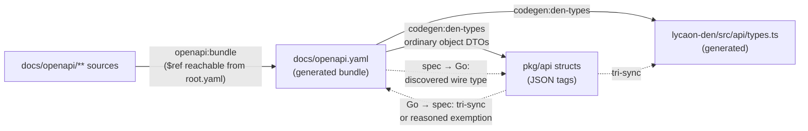

# Test strategy

How Painted Wolf Code proves v1 behavior.

**See also:** [Dev tasks](dev-tasks.md) · [Architecture](architecture.md) · [Docs map](README.md)

---

## Layers

| Layer | Location | Covers |
|-------|----------|------|
| Unit and component | `lycaon/internal/<pkg>/*_test.go` | Parsers, registries, evaluators, merge rules, and domain logic |
| Integration | `*_integration_test.go` (the `integration` build tag), `lycaon/test/wiring/` | SQLite, assembled managers, and the real application graph |
| Contract | `lycaon/test/contract/<domain>/` | OpenAPI, generated artifacts, catalog invariants, package boundaries, and forbidden shapes |
| HTTP journey | `lycaon/test/security/` | Authenticated routes, project policy, sessions, workflows, tools, and recovery |
| Den | `lycaon-den/src/**/*.test.*` | Stores, components, projections, accessibility, and client behavior |
| Browser and desktop | `lycaon-den/e2e/` | Complete user journeys through the web harness and Tauri shell |
| Performance | `cmd/lycaon-perf`, Go benchmarks | Release-channel boot and mixed workloads, latency distributions, resource stability, restart/replay recovery, and focused hot paths |
| Release | release workflow targets | Full Go behavior, race detection, scanner corpora, and Go and Den coverage floors |
| Verification runner | `scripts/verification_tests/` | The `./task` queue: planning, batching, admission, cancellation, caching, reuse, health, and worker limits, through bounded subprocess fixtures |
| Coordinator benchmark | `scripts/coordinator-benchmark/` | Opt-in paid runs of candidate models through the real application, graded on environment outcomes — [Coordinator benchmark](coordinator-benchmark.md) |

The bundled OpenAPI document is generated from `docs/openapi/**`. Contract tests prove its layout and its agreement with generated Go and TypeScript surfaces, in both directions and at both ends of the pipeline:

- **Go → spec.** Every exported `pkg/api` struct with JSON tags either tri-syncs against an OpenAPI schema and a generated `types.ts` schema, or claims a reasoned exemption in `structGoInternal` (never on the wire) or `structOneOfCarrier` (flat carrier for a `oneOf` schema). Structs with no JSON tags and structs that embed a field are accounted for the same way, because both would otherwise escape the field comparison.
- **Spec → Go.** Every OpenAPI object schema has an automatically discovered Go wire type or an explicit custom-representation exemption. Ordinary object DTOs are generated from the schema; no second type registry is maintained.
- **Spec source → bundle.** Every definition under `docs/openapi/**` is reachable by `$ref` from `root.yaml`. Unreferenced spec source never enters `docs/openapi.yaml`, so bundle drift, `codegen:den-types`, and the struct tri-sync are all blind to it.

Solid arrows generate; dotted arrows are contract-test proofs:

Database architecture tests derive their scope from the live schema: they
discover authored tables and foreign keys through SQLite, ask the query planner
whether lifetime-parent lookups are indexed, and enforce strict keyed storage,
so new tables and larger histories enter the same proof automatically.
Behavioral stores use differential models where practical: the SQL and memory
implementations must produce the same seek pages, and concurrency tests close
and reopen the store before running integrity checks. The SQLite concurrency
suite holds a reader snapshot open while direct writes, immediate write
transactions, and passive checkpoints overlap, proving that writes serialize
without `BUSY_SNAPSHOT`, checkpoints report pinned frames without rejecting
writes, every reader is read-only, and orderly shutdown drains readers before
truncating the WAL.

## OAR and catalog verification

`./task oar:verify` runs `test:oar` (engine, declared facts, copy rendering,
tool vocabulary, full catalog construction, and rejection delivery) without
`-short`, so catalog-wide walks that `test:short` skips still run, then the
vendored standard corpus through `oar:conformance`. The full `check` gate
includes it. `oar:conformance --json` is the machine-readable standard report
for comparison with other implementations.

Catalog scenarios must reach their intrinsic rejection through the OAR evaluator
before any fallback renderer runs. Recovery vocabulary checks include backticked
call examples as well as bare tool names. Tests of changing anchors prove that the
recipient audience is recomputed. Invocation recovery facts are lazy and use the
frozen offered-tool list; another profile's tools and later request state cannot
widen the recommendation. These checks prove wiring, declarations, and
observable behavior; they do not freeze prompt wording.

## Test rules

- Tests make no real LLM calls. Use fixtures, stub providers, fake MCP servers, and `LYCAON_LLM_MOCK=1`. Live provider smoke tests require the `live_llm` build tag in addition to credentials; they never run in normal, full, race, or coverage suites and still require separate authorization for paid calls.
- Invalid manifests, unknown vocabulary ids, and forbidden ids fail at load or transition time.
- New HTTP routes carry a contract test and an authenticated HTTP journey.
- Durable encoding tests compare exact bytes, BOM state, line endings, and raw hashes.
- Go failures use `testutil.FailErr(t, "<step>", err)` or `check.FailErr` from the contract suites' shared `internal/check` package.
- No test asserts on markdown prose. A `docs/**.md` page is written for a reader, so a test that parses one turns an editorial choice into a build break. `docs/openapi/**` is different: that tree is the hand-edited wire SSOT, and checking it against generated Go and TypeScript is a spec contract.
- Race failures are product failures. Fix the synchronization boundary; do not skip, retry, or sleep around them.
- Each E2E tier starts and stops its own dependencies.
- Fixture corpora are committed. A test keyed to a path outside the repository runs on one machine and skips on every other.
- A suite that needs a provisioned host — applied Seatbelt, a staged scanner engine — derives its gated inventory from source and fails when the declared CI scope does not reach a member. Where a job promises the suite, its `*_REQUIRED` flag makes a missing dependency fatal instead of a skip.
- A test belongs in the cheapest layer that can prove its promise. Unit/component tests exercise one domain boundary with in-process collaborators; repository contracts prove a durable cross-tree invariant; wiring tests prove assembled managers; HTTP and browser tiers prove a user-visible journey. Do not use a repository scan to stand in for behavior, or an end-to-end journey to prove a parser branch.
- `test:short` is only the unit/component feedback loop. Repository contracts run beside it as their own `test:contract` stage of `check-fast`, because they are cheap and are the boundary changes most often cross. External integration, wiring, process smoke tests, and HTTP journeys remain mandatory but run as named closeout/release tiers, where their failure names the boundary rather than making every edit wait on a source-tree crawl.
- Files classified as internal integration carry the `integration` build tag and stay out of `test:short`; `test:integration`, `test:full`, and `test:race` opt in explicitly and run without `-short`. Source-content limit journeys, document compaction/reload scenarios, full checkpoint-cap capture, and archive entry-limit extraction assemble real stores and filesystems, so they belong to this tier with their exact limit and editing-history fixtures intact. Randomized SQLite lifecycle properties in `test/property` use the same tag; pure in-memory properties remain in the normal suite.
- Keep scale sweeps separate from boundary proofs. Routine source-tree tests exercise first and late pages and indexed edits at 1,000 and 4,096 rows; stress runs repeat the same assertions at 100,000, one million, and ten million rows. Do not shrink a fixture below a real page, spill, or byte-limit boundary merely to save time.
- A test must invoke the production transition it claims to prove. Test-local copies of draft settlement or retention deletion are not lifecycle coverage.
- Use virtual clocks for in-process timers (`testing/synctest` in Go and Vitest fake timers in Den). Mutex-contention tests need real bounded deadlines: a mutex wait prevents Go virtual time from advancing. Synchronize queue tests on admission and completion; use a required barrier when the queue deliberately drops writes.
- Den follows the same cadence: `den:test:fast` proves a representative model-and-DOM seam canary, while exhaustive model tests, component fixtures, accessibility checks, and repository scans run in full `den:test`. Browser journeys remain their own explicit tier.

## Shared test infrastructure

Repository-wide source assertions use a corpus snapshot instead of opening and
parsing the tree independently in every test. The dependency-free Go API is
`lycaon/pkg/testcorpus`: deterministic file selection, relative lookup and
subtree views, cached snapshots, Go AST parsing with a shared token file set,
and an explicit non-empty assertion. Contract tests share cached loaders in
`lycaon/test/contract/internal/check/source_corpus.go` and `go_ast_corpus.go`;
Den source contracts use the matching snapshot API in
`lycaon-den/src/test/source-corpus.ts`.

Use the narrow fixture at the boundary being exercised:

| Need | Fixture |
|------|---------|
| Disposable prepared SQLite store | `internal/testdbfixture` |
| Temporary Git repository and commits | `internal/testutil/gittest` |
| Go module or checkout root | `configlayout.FindModuleRoot` or `testutil.CheckoutRoot` |
| Process-wide Anchor, guidance, Git, or browser setup | the corresponding `internal/testsetup/*` package, called explicitly from `TestMain` |
| Partial Den API client | `lycaon-den/src/test/client-fixture.ts`; undeclared method access fails immediately |
| E2E connection, workflow, project-file, or session synchronization | `lycaon-den/e2e/helpers.ts` |
| Rust temporary directory lifecycle | `lycaon-den/src-tauri/src/test_support.rs` |

The shared fixtures centralize lifecycle and failure labeling without hiding the
state relevant to a scenario. Tests of database recovery, backup, Git plumbing,
or filesystem traversal may still use the underlying mechanism directly when
that mechanism is the subject of the test.

### Contract organization and maintainability budgets

Contract suites live in domain packages under `lycaon/test/contract/`:
`agentcontext`, `architecture`, `catalogs`, `evidence`, `files`, `frontend`,
`host`, `maintainability`, `persistence`, `prompts`, `providers`, `release`,
`runner`, `scanning`, `security`, `sessions`, `tools`, `wire`, and `workflows`.
The root package keeps the source-snapshot tests. The `test:contract` target
discovers the complete subtree. Shared support lives under `internal/`: `check`
(failure labels, repository root, source and Go AST corpora), `wirespec` (OpenAPI
and client parsing), and the `catalogfixture`, `toolfixture`, `workflowfixture`,
and `guidancescan` fixtures. Keep a scanner with the contract it proves and use
shared support for cross-domain mechanics. Source assertions follow subpackages
and import manifests, so a split file never leaves them inspecting an empty entry.

`TestMaintainabilityWithinBudget` in `test/contract/maintainability` measures
code-bearing lines per production and test file, handwritten files per
production and test directory, Go struct fields, Go receiver methods and
receiver lines summed across files and platform variants (so splitting a file
cannot hide concentration), and distinct local TypeScript imports per module.
Generated and vendored files are classified from generator inventories. Caps live in
`lycaon/test/contract/maintainability-budgets.yaml` as category maps of integer
caps. Measurements at or below their caps pass. Failures are `over_cap`,
`missing_cap`, or `stale_cap`; there is no warning tier or automatic ratchet.

When a failure exposes mixed responsibilities, extract a coherent operation or
feature and preserve its behavior. Intentional growth can receive a deliberate
cap bump. Refresh measured caps, including new and removed paths, with
`UPDATE_MAINTAINABILITY_BUDGETS=1 ./task test:contract -- ./test/contract/maintainability -run '^TestMaintainabilityWithinBudget$'`,
review the entire budget diff, then run without the variable; refreshing is not
verification, and ordinary runs never write caps. Caps record the reviewed
state, not a quality target: a green budget does not show cohesion, so review
still reads the structure ([Organizing code](architecture.md#organizing-code)).
Dependency direction is enforced separately by the
[import-graph layering contract](package-layering.md), Go rejects import cycles
at compile time, and `funlen` in `lycaon/.golangci.yml` stays in force.

## Concurrency and type floors

| Floor | Rule |
|---|---|
| Race detector | `./task test:race` is a tag-blocking gate. Fix with synchronisation or single-mutator confinement — never by re-architecting the algorithm to dodge the detector. A concurrent map write is a fatal Go runtime throw, not a stale read |
| Shared-structure discipline | Choose **one** discipline per structure and apply it whole: a mutex around every mutation *and* read, or single-mutator confinement where exactly one goroutine mutates. A half-locked structure reads as safe and is not |
| Test doubles | A double must honour the concurrency contract its real counterpart does. A fake that does not keeps hiding real bugs |
| Bundled-config staging | `configtest.Use` / `Overlay` / `Only` swaps the bundled source for the whole process, so a test that stages config runs sequentially — and every helper that reaches one does too. `t.Parallel()` there panics rather than serving the staged tree to every other test in flight |
| Indexed access | Den compiles under `noUncheckedIndexedAccess`, so `arr[i]` and `record[k]` type as `T \| undefined`. Resolve every access by **narrowing at the access site** — a length or presence check, an early return, a destructure with a default, or widening a helper's return. `!`, `as T`, and `@ts-expect-error` are forbidden as fixes; each hides a gap the compiler just proved. Test files are not exempt |

Every fix in this model is a capacity, a delete, a `select`, a lock, or a type narrowing — never a heuristic ([`AGENTS.md` No heuristics](../AGENTS.md#no-heuristics)).

### Verification scheduling

Local verification shares one queue across checkouts and agents. On macOS and
Linux, admission freezes a batch of at most 32 consecutive compatible requests
from the same checkout and declared execution environment; a different checkout
or environment ends membership, and membership closes before source capture
without a collection delay. Windows retains exclusive admission. Up to eight
batches may be active at once. A gate's stages have no order among themselves:
each starts once its declared resources allow, the longest expected stage
first, and requests in a batch overlap the same way. A batch keeps at most one
stage reservation waiting, so one large gate cannot queue ahead of every other
batch. Invocations outside a batch (non-shareable selections, fixture refreshes,
and targets outside the catalog) hold the union of what their stages declare
for their whole run; only a target nothing declares holds every resource.
Nested commands reuse their operation's reservation.

Admission is first-in, first-out per conflict, ordered by when the request each
piece of work serves arrived. Later work may pass an earlier waiter it conflicts
with only when its estimated completion falls before that waiter could start
anyway. Estimates are the 90th percentile of up to 32 completed runs of the same
name; work without three completed runs, and running work past its estimate,
backfills nothing. A request joins a batch once any of its stages could start,
so several waiters for one lock cannot occupy every active-batch slot. Queued
stage declarations guide admission; the captured catalog owns the locks applied
during execution. Each subscriber returns as soon as its own result is
established.

Shared execution receives only the environment variables the catalog's
`environment` section declares by name or prefix. Agent-session identifiers,
control sockets, and credentials never reach tests or separate otherwise
identical requests. Every declared value must be a function of the checkout
rather than of the call that submitted it: a per-invocation value gives each
request its own digest, which ends batch sharing and result reuse with no
visible failure; `scripts/verification_tests/test_environment_identity_execution.py`
asserts that rule against the catalog. Verification is offline: no network route
is declared or passed through, so a stage that dials is denied by the boundary.
Only the environment digest is stored in queue metadata.

The declared plan in `scripts/verification-plan.json` owns gate composition and
shareable stages. Submitted intents are resolved again using the captured
catalog; `resolved-plan.json` records the definitions actually verified. Exact
Task stages run once per batch; compatible Go scopes resolve against its
snapshot and run their package union, longest recorded packages first. A union
adds at most 16 packages to the oldest ready request; larger followers consume
already proven packages and execute the remainder afterward. Within a batch,
package results are reusable with identical execution options; full, short,
race, tags, and filters are not interchangeable.

Across batches, a passing Go package result is reused when nothing it depended
on changed: its build identity (the content of every file compiled or embedded
across the test binary's dependency closure, module versions, tags, race mode,
and the toolchain, independent of the snapshot slot's path), the arguments that
choose tests, the Go runtime settings the binary reads directly, the declared
environment, and every input the Go test log observed (files opened or statted,
compared by content, and environment variables read). Worker counts and timeout
scale are not inputs. A test process that starts another process is never
recorded, because the child's inputs are unobservable; fork observation uses
kernel process events, available on macOS, and elsewhere every package runs.
The per-run scratch home and temporary directories start empty and are not
inputs. Receipts name the batch and stage that recorded a reused result.
Results live under the user cache directory in `paintedwolf/verification-results`,
limited to 2 GiB and 14 days since last use. Selections with explicit repeat
counts run outside batches and never reuse.

Unsupported selection flags reject before admission, as do arguments for a
target that declares no selection grammar and information flags that would run
the target instead of describing it. A declared Go target accepts the digest
package and flag grammar narrowed to its own declared packages, so a scoped
invocation keeps the target's recipe and shares outcomes with the unscoped one.
Supported Go repeat, shuffle, and benchmark modes, fixture refreshes, and replay
run outside a shared batch, holding what their targets declare; so does Go
`-failfast`, whether passed on the command line or through `GOFLAGS`.

Every requester receives its own receipt and exit status. A gate ends at its
first failed or unverified stage, and stages only it still needed stop;
independent requests continue. A Go package failure (a failing test binary exit,
a terminal package event, or a build failure) answers every request that needs
the package while the stage is still running, and the receipt links that
package's output. A package may pass despite an unrelated package failure only
when its terminal Go event and the completed digest establish that result.
Missing evidence and infrastructure interruptions are unverified. A Go stage
whose packages hold test files behind a tier tag it does not enable (a tag some
declared target turns on, such as `integration`) records them per package as
`excluded_tests` and prints how many did not run and which targets run them; its
pass never covers those files. Receipts
identify the source commit/tree and link to the stage logs and reports in
`verification/<batch-id>/` under the
[artifact root](dev-tasks.md#build-outputs-caches-and-locks). Retention keeps
up to 20 completed batches and 512 MiB, pruning artifacts and source refs
together; the newest batch and active batches/subscribers are protected even
when they exceed the budget. No receipt is reused across batches; recorded Go
package results are.

`./task test:status` shows active batches and stages, sharing and queued
requests, global worker capacity, reserved and available slots, each operation's
resource locks and blocking reason with the blocking request's name and ticket,
rendered ages, a one-line summary, and advisory observations (what is holding
the queue, how a run compares with completed runs of the same target, and
whether a batch's captured source still matches its checkout). Reservations are
concurrency limits, not measurements of CPU utilization. `test:pause` holds new
admissions while admitted work finishes; `test:resume` releases the queue.
`test:cancel` withdraws one request by ticket with a recorded reason, keeping
work no other request shares unless it carries an adverse health observation or
the caller forces it. An independent supervisor keeps shared work alive for the
remaining requesters and stops an operation when no requester needs it.
Inherited lease locks prevent an interrupted supervisor's descendants from
overlapping the next admission; canceling that run stops whichever descendants
still hold its lease. Live model benchmarks remain outside the queue; their
build and fixture-test commands acquire admission separately. Interactive
`den:harness` sessions also run outside admission: their sidecar build and
engine staging acquire a separate exclusive reservation through
`den:harness -- --prepare`, which ends before interactive startup. Automated
harness tests and canaries remain queued for their whole execution.

The default worker budget is three quarters of the available CPUs, rounded down
and bounded between one and eight. `PW_TEST_WORKERS` selects a per-invocation
ceiling between one and that budget; shared execution also obeys the global
capacity. The catalog's `resources` declarations reserve half that capacity for
a parallel Go, Rust, or Vitest operation, and one slot for frontend lint or
typechecking, which leaves room for independent work even during a suite's
final serial test. A declaration may request an explicit worker count; an
undeclared operation reserves exclusive access. Go favors package fanout within
that reservation and assigns unused package slots to `GOMAXPROCS` for small
scopes; race runs default to two runtime workers per package. Parallel tests per
package obey the same per-process share; Vitest uses at most four workers.
Fuzzing and Rust builds share the same budget. Runners use the worker limits
assigned at admission; host load only adjusts timeouts. Hosted CI sets
`PW_TEST_HOST=dedicated`: one lane owns the runner, so the budget is every CPU
(still at most eight) and a shared operation reserves all of it.

Resource names are global locks: Go digests share `go`, Go lint holds `lint`,
frontend checks hold `frontend`, Cargo tests hold `rust`, and the isolated
scheduler fixtures hold `runner` with one worker. Harness browser tests reserve
half the worker budget and hold `harness` and `frontend`, allowing unrelated Go
work to continue; they run on the captured source with isolated ports and state,
and default browser failure artifacts are retained beside their receipt. Go
package builds declare an empty lock list: their compiler cache supports
concurrent commands, so they reserve CPU slots only. Every catalog stage
declares its resource use; runner tests enforce coverage. Checks that only read
captured source or write private temporary output reserve CPU without global
locks. A resource may declare `shared_locks`: two shared holders can overlap,
but an exclusive holder or earlier exclusive waiter blocks new shared holders.
Go digests capture their reports from private invocation logs before the short
canonical-publication lock, so simultaneous runs cannot substitute another run's
evidence. Bundled-scanner digests additionally hold `scanners` exclusively.
Unclassified stages hold `*`, conflicting with every operation. Targets outside
the catalog declare resources by Task name: the development engine build and
the upgrade corpus runs that depend on it hold `dev-engine` and `scanners`.
Locks and worker reservations are inherited by child processes and remain held
after a parent crash until its surviving children exit. Pause stops new batch
and invocation admission; already admitted batches finish their stages.

Scheduler-dependent waits, watchdogs, and lint timeouts scale 1×–4× with host
load. `PW_TEST_TIMEOUT_SCALE` selects an explicit scale; production deadlines
and polling intervals remain unchanged.

Compilation artifacts use the persistent Go cache across snapshots, tests,
fuzzing, and lint. Snapshot worktrees reuse leased directory slots, preserving
the absolute source paths in Go's compilation cache keys; active descendants
keep their slot, and overlapping snapshots receive separate slots.
Path-sensitive lint diagnostics retain isolated leased caches. Verification
budgets the active Go build cache at 20 GiB, trimming least recently used
entries toward 16 GiB beside running builds; see
[digest captures and locking](dev-tasks.md#digest-captures-and-locking) for the
settings. Go's own test-result cache keys file inputs on modification times,
which every fresh snapshot changes, so full digests pass `-count=1` and shared
stages rely on recorded results instead.

Long gates and digest runs execute from a synthetic commit that captures the
complete tracked and untracked source tree. The capture accepts only two
matching tree ids, then runs from a detached scratch worktree, so concurrent
edits cannot produce a mixed build and generators remain free to publish while
the snapshot runs. Source preparation reserves one worker and a global snapshot
lock, so captures remain serialized across checkouts while other resource
classes can execute. Frontend packages, staged sidecars, and bundled notices are
mounted into the scratch worktree without becoming source inputs. Each capture
refreshes a private copy of the pinned Git engine because harness preparation
reshapes and signs that toolchain.

Routine correctness fixtures cover late pagination and deeply nested session
deletion with bounded row counts. `./task test:stress` runs the 100,000-,
one-million-, and ten-million-row source trees, the 50,000-message session
tree, and a working year of 25,000 real editor saves with retained source
history and three recovery captures. Its catalog recipe keeps packages and tests
serial and allows 90 minutes per package before host-load scaling. The nightly
workflow includes this tier. Active fuzz exploration runs through
`./task test:fuzz` in nightly verification, separately from
`check`; ordinary Go tests still execute saved fuzz seed cases. Transcript
performance tests use the `.perf.test.ts` suffix and run through
`./task den:test:transcript-scale` in nightly verification; normal
Den suites exclude elapsed-time assertions while retaining memory and DOM bounds
as ordinary correctness tests. SQL query and OpenAPI bundle generation drift are
checked once through `db:sqlc:check` and `openapi:bundle:check` in
`check:drift`; Go contracts inspect the generated surfaces without launching the
generators again.

## Working commands

Run every task from the repository root through `./task`.

| Task | Use |
|------|-----|
| `./task test:digest -- ./internal/foo/...` | Scoped Go iteration |
| `./task test:contract` | Static and generated contract layer; required by `check` |
| `./task test:integration` | Assembled Go components and randomized SQLite lifecycle properties; included by `test:full` and `test:race` |
| `./task test:security` | Authenticated HTTP journeys |
| `./task test:runner` | Verification runner tests in `scripts/verification_tests/` |
| `./task den:test:digest -- src/path/file.test.ts` | Scoped Den iteration |
| `./task den:test:fast` | Representative Den model and DOM seam canaries |
| `./task den:test` | Full Den Vitest suite |
| `./task e2e:den` | Browser user journeys |
| `./task e2e:den:desktop` | Tauri desktop journeys |
| `./task perf:bench` | Repeated Go microbenchmarks and an optional baseline comparison |
| `./task perf:sidecar` | Representative isolated sidecar workload with enforced latency/resource/correctness budgets |
| `./task perf:soak` | Long mixed workload with graceful restart, task recovery, SSE cursor reset, and leak checks |
| `./task check-fast` | Pull request gate and local handoff: build, lint:fast, unit/component Go suite, repository contracts, Den typecheck, lint, and den:test:fast |
| `./task check` | Merge queue gate: cross-compile, drift, complete Go and scanner suites, full Den and Rust correctness suites, lint, and vulnerability checks |

Each gate runs once per change. A pushed change gets `check-fast` on its pull request and `check` in the merge queue, so it runs neither locally first; a change handed off without a push runs `./task check-fast`. Each gate uses one stable source snapshot. Digest runners keep failure captures under `last-run/` in the [artifact root](dev-tasks.md#build-outputs-caches-and-locks); `./task test:failed` replays the latest failed Go run from its retained source commit with the recorded arguments and timeouts, bounded by the current worker budget. A passing scoped run does not erase that failure.

Digest output lists up to five slow packages and Go tests, and up to five slow
Vitest assertions, when they take at least one second. Go reports the slowest
event for each top-level test and its subtests, so parallel children remain
visible even when their parent reports zero elapsed time; cached package
timings are omitted. These elapsed times overlap and must not be summed. They
are review signals, not pass/fail budgets; Vitest assertion times exclude
collection and transform cost. Compare captures with the same source and worker
allocation before claiming an end-to-end speedup.

## Release verification

| Task | Proof |
|------|-------|
| `./task test:full` | Complete Go behavior, wiring, smoke, HTTP, and required bundled scanner suites |
| `./task test:race` | Go race detector with integration scenarios and no `-short`; the dedicated `test/security` HTTP journeys remain in `test:full` |
| `./task check:coverage` | Go statement coverage floor |
| `./task den:coverage-check` | Den coverage floors |
| `./task den:test:rust` | Tauri Rust tests |
| `./task test:scanners` | Bundled scanners against the committed corpus, with a staged engine |
| `./task perf:sidecar` | Sidecar service-level objectives and integrity invariants |
| `./task perf:soak` | Steady-state resource growth and restart/replay recovery |

### Hosted verification

Every change is verified once at each tier, and main only advances to a commit
the full tier passed. [`ci.yml`](../.github/workflows/ci.yml) reports one
required check, `check`:

| Event | Tier | Work |
|---|---|---|
| Pull request | Fast | The `fast` profile: the stages of `./task check-fast`, split into build and lint, Go (two shards), and frontend jobs on `ubuntu-latest`. |
| Merge queue | Full | The `check` profile, every stage of `./task check`, plus [`platform-verification.yml`](../.github/workflows/platform-verification.yml): upgrade corpus, applied Seatbelt, browser confinement, and Git parity on `macos-15`, Playwright web E2E in three shards, and desktop E2E. |
| Manual dispatch | Full | The merge-queue tier on any branch, to try a change before queueing or to reproduce a queue failure. |

The merge queue squashes each pull request onto main and tests the resulting
commit; main then advances to exactly that commit, so CI does not run again on
push. A required check that ran only on pull requests would admit commits that
were never tested together. When the queue merges, rebuilds, or drops a group,
it deletes the group's branch but leaves its CI running; the scheduled
[`merge-queue-prune.yml`](../.github/workflows/merge-queue-prune.yml) cancels
those runs every ten minutes so they stop holding runners the live groups need.
The aggregates run under `!cancelled()` rather than `always()`: they still judge
failed and timed-out jobs, but a cancelled run no longer waits for a runner to
schedule its verdict. Neither tier uses path filters: generated
documentation, shipped prompts, and the changelog are Markdown the build and
tests read.

[`scripts/verification-plan.json`](../scripts/verification-plan.json) owns the
hosted job partitions alongside the local recipes. The reusable
[`verification.yml`](../.github/workflows/verification.yml) expands a profile
into independent jobs with `fail-fast: false`. Each job invokes the existing
`./task` entry point, preserving queue admission, source capture, and receipts.
The planner rejects a `fast` partition that differs from `check-fast` and a
`check` partition that differs from `check`, so the hosted tiers and the local
gates cannot drift apart.

| Profile | Work and required result |
|---|---|
| Fast | Build and fast lint, Go (unit/component suite and repository contracts), and frontend (Den typecheck, lint, seam canaries). `CI/check` requires all three and excuses only the platform workflow, which a pull request skips. |
| Check | Build, contracts and drift, lint, vulnerabilities, runner tests, full Go behavior, frontend, native Rust, and WebKit each have their own budget. `CI/check` requires these and every platform job. |
| Nightly | Full behavior, race, fuzz, Go and Den coverage, stress, transcript scale, benchmarks, sidecar budgets, and a ten-minute soak run independently. Manual selection filters jobs before matrix expansion; vulnerability freshness and upgrade rehearsal always run. The terminal `nightly` job requires every selected job. |
| Release | The tagged commit must carry a passing full-tier `CI/check`, which every commit the queue lands has, so a release runs no verification lanes. The signed build starts after source classification, in parallel with preflight and the upgrade rehearsal; `ship-gates` requires both before anything publishes. |

The release profile is the subset of `check` that decides whether the product
works: build, contracts, behavior, frontend, native, and vulnerabilities.

The catalog grants each verification invocation 45–180 minutes and each job an
additional 30 minutes for setup and evidence collection. Step timeouts leave an
opportunity to upload receipts and logs before the job deadline; runner loss or
a job-level kill can still prevent upload. Adjust the affected partition from
hosted timings rather than raising every job to the six-hour hosted-runner
ceiling.

Verification lanes run on `ubuntu-latest` (4 CPUs, 16 GB on public
repositories); a lane declares `macos-15` only when it tests macOS-specific
behavior. A lane may declare `shards`: the race lane runs as three jobs, each
verifying every third package of the planner's sorted selection
(`PW_GO_SHARD=k/N`), so its longest package starts early instead of behind
three hundred others. The pull request tier's Go lane runs as two, because its
unit suite is the longest job a pull request waits for. A lane may also cap `workers` below the CPU count when
its peak memory outgrows the runner. WebKit runs on macOS so its platform check
cannot silently skip the suite. Desktop E2E shares one reusable workflow across
the merge queue and the nightly run, with separate staging and test deadlines.
Aggregates reject failed, cancelled, missing, or unexpectedly skipped results.

Each catalog job reports what did not pass as a workflow annotation on the pull
request and in the Actions summary: the stage, the Go package or task, the
failing tests, and the start of the digest's failure output. It retains
receipts, stage logs, digest captures, performance reports, and browser
diagnostics for 14 days, on success as well as failure. Artifact names
distinguish profiles, jobs, and run attempts. Caches accelerate builds; they
never substitute for the required job result.

## Fixtures

| Area | Location |
|------|----------|
| Workflows, rules, evidence, and scan inputs | `lycaon/test/testdata/` |
| HTTP application wiring | `lycaon/test/wiring/` |
| Den HTTP mocks | `lycaon-den/src/api/mocks/` |
| Den E2E projects and services | `lycaon/test/fixtures/e2e/` |
| Text encoding oracle | `lycaon/internal/textfile/testdata/golden.json` |

Fixtures are deterministic, repository-local, and safe to run without credentials or network access. `lint:vuln` reads the pinned database under `lycaon/vulndb/`, refreshed on purpose with `./task lint:vuln:vendor` and reviewed as a diff, so one source produces one verdict and a passing stage can be replayed. Disclosures made since that pin are caught by the nightly `lint:vuln:fresh`, which reads upstream.

## Coordinator model benchmark

The paid coordinator benchmark drives the real application with candidate
models and grades environment outcomes, not transcripts. It is opt-in, never
part of `check` or CI, and has its own page: [Coordinator benchmark](coordinator-benchmark.md).
