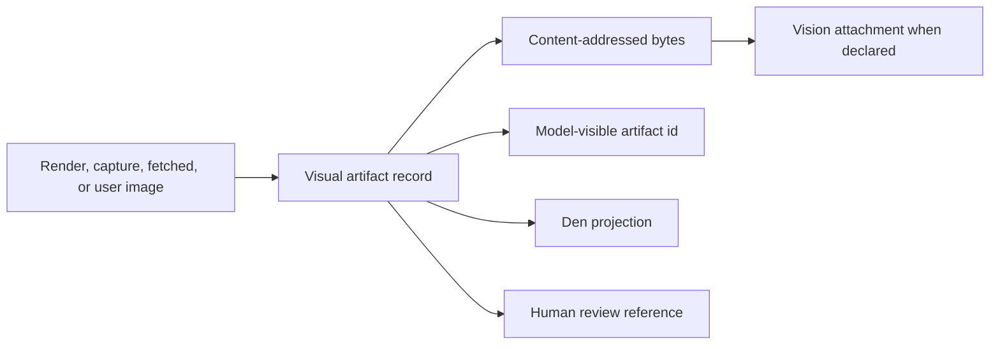

# Visual surface

One `VisualArtifact` model carries authored mockups, captures of running surfaces, user images, filmstrips, and terminal renders. Producers create artifacts; model and UI consumers reference them by durable identity.

**See also:** [Grounding](grounding.md#surface-verification) · [Den](den.md) · [Security](security.md) · [Coordinator ask user](coordinator-ask-user.md#artifact-refs) · [Compatibility](compatibility.md)

**Machine truth:** `VisualArtifact` and `ArtifactReferenceKind` in [`openapi/components/schemas/session/artifacts.yaml`](openapi/components/schemas/session/artifacts.yaml) → [`pkg/api/session_types.go`](../lycaon/pkg/api/session_types.go) · [`internal/visual/records.go`](../lycaon/internal/visual/records.go) and the `artifacts` / `artifact_refs` tables in [`internal/db/schema.sql`](../lycaon/internal/db/schema.sql) · [`evidence-kinds.yaml`](../lycaon/config/packs/painted-wolf/platform/guidance/evidence-kinds.yaml), the evidence kind → shape SSOT · [`internal/llm/modelinfo/capabilities.go`](../lycaon/internal/llm/modelinfo/capabilities.go), where `Vision` is declared · screening in [`internal/visualscreen`](../lycaon/internal/visualscreen) · capture and drive in [`internal/browser`](../lycaon/internal/browser), sheets in `internal/contactsheet`, recordings in `internal/timelinearchive`

## One artifact, several faces

| Face | Role |
|---|---|
| Render | authored visual intent from a mockup renderer |
| Capture | observed pixels from a running page or terminal |
| User | image supplied with a prompt |
| Workspace | a project image file read as is |
| Perceive | bounded image bytes attached to a vision-capable model turn |
| Project | thumbnail, evidence preview, gallery, report, or human-review card |

The visual plane carries bytes and visual provenance. Progress checklists, findings prose, plans, and workflow state remain in their own planes and may reference the artifact.

## Artifact identity

The record stores a stable id, project and root-session scope, source face, MIME type, content hash and byte size, provenance, origin operation/message/tool identity, optional evidence handle, time-based-media metadata, and raster pixel dimensions.

The source face names the producer: `render` (host-rasterized markup), `capture` (a projected running surface or terminal), `fetch` (an image `fetch_url` retrieved), `user` (a prompt attachment), or `workspace` (a project image copied as is).

Pixel dimensions are a host fact read from the bytes, never a producer claim. Every store write decodes the raster header (PNG, JPEG, GIF, WebP) and stamps `width` / `height` on the record and the wire `VisualArtifact`; a replacement write re-derives them, and any size a caller supplies is ignored. A raster of one of those types whose header does not decode is refused rather than stored unsized. Time-based and container media (video recordings, filmstrips) carry no dimensions. Den reserves a transcript image's box from these fields before the image decodes, so a reloaded transcript lays out at its final height.

Bytes are not embedded in SSE or transcript JSON. Events carry metadata and a fetchable id. Tool output also includes the artifact id in model-visible structured content so compaction cannot erase the only route to it.

Evidence handles are citation tokens minted by the evidence ledger, not storage ids. A tool never sets one: producers such as `fetch_url`, `capture_page`, and `render_view` store the image, and when the tool result commits, the ledger mints its handle and stamps it onto that artifact's record in the same transaction. A consumer that accepts either (`view_image`, `ask_user`) resolves a handle to the newest artifact in the session tree whose record carries it. A `render_view` handle names a render session, not an evidence handle, and is never stored on the record.

## Scope

Hot access is scoped to the root session tree because workers can produce a visual the coordinator must inspect. Durable records are project-scoped so reports and later sessions can still resolve them. A child session does not create a private namespace the parent cannot reach, but it retains producer identity so attribution and worker isolation stay visible.

Cross-project fetch is refused even when the caller knows an id. Artifact identity is not a capability.

## Durability and referencing

The artifact record and its bytes have different lifetimes:

| Part | Class | Rule |
|---|---|---|
| Artifact record | durable database fact | remains addressable; deletion becomes a tombstone |
| Reference row | durable while the referrer exists | records provenance and deletion impact |
| Content-addressed bytes | durable project content | retained until explicit artifact or project deletion |
| In-memory copy | hot cache | disposable at any time |

A reference has exactly one of four kinds, `message_present`, `message_attachment`, `tool_result`, and `project_cover`, and the database enforces that closed set. Each producer writes its reference in the same transaction as the fact that names the artifact, so retention and delete impact are the same question. Evidence and reports do not mint a fifth kind: they cite an artifact through the row that already holds it, which keeps a citation from silently becoming a retention claim.

Content-addressing deduplicates identical bytes but does not merge records: two captures of the same pixels can have different provenance and meaning.

Durable bodies use lossless zstd compression. The content hash and `byte_size` describe the original media; `stored_size` records the encoded length used for disk accounting and retention budgets. Reads verify the decoded length and hash before serving, so recordings keep their frames, timing, audio, and container bytes exactly. Backups copy encoded bodies and validate both archive integrity and decoded media identity. The durable decoded body ceiling is 128 MiB (`MaxDurableBodyBytes`), independent of configurable ingest limits; lowering a new-upload limit does not invalidate retained media.

Replacement and deletion remove bytes after the last record releases their hash. A durable removal queue (`artifact_gc_queue`) retries committed deletions after a crash, unlink failure, or archive capture; each cleanup pass handles at most 128 receipts and advances past failed or busy ones so later bodies can still be reclaimed. Group pruning commits all tombstones, search changes, and events together before any body is removed. Pending orphan bytes stay visible in storage accounting until cleanup succeeds.

## Absence is total

Every missing fetch has a typed reason (`AbsenceReason`): `unknown` id, `foreign` scope, `unavailable` bytes (including a producer or storage failure; there is no separate reason for that case), or `deleted` tombstone. Den renders the reason instead of a broken image. A tombstoned record keeps provenance and references while withholding bytes.

## Image intake

The host normalizes supported image content to validated bytes plus MIME type. It sniffs content, checks dimensions and decoded size, strips unsafe container features and metadata where policy requires, and either downscales within declared limits or rejects. It never truncates an encoded image.

User images enter through prompt attachments and become artifacts before prompt admission. Text and documents use their own fenced content path. The outbound model request associates each image with the originating tool or attachment identity so usage, grounding, and audit agree.

## Video intake

A video is never attached to a model turn. The host draws frames from it with the managed browser's own decoders and sends frames as images.

- **Detection.** The container comes from the leading bytes: MP4 and QuickTime by their `ftyp` box (still-image and audio brands such as AVIF, HEIC, and M4A are not video), WebM by its EBML header. QuickTime is served to the decoder as MP4, since the two share the ISO media layout.
- **Upload.** A video is decoded once, at upload, into its overview: 12 frames spread across the whole video, each labeled with its timestamp, laid out as one sheet. One whose codec the browser cannot play (HEVC, for one) is refused with `attachment_undecodable` and a message naming the codecs that play, and nothing stays staged. The sheet and decoded facts are kept in the blob store's derived directory beside the blob and leave with it. The receipt carries the decoded `duration_ms`, `width`, and `height`. `max_video_bytes` bounds a video, since the decoder holds it in memory.
- **Prompt.** An attached video sends its stored overview sheet as an image, plus a fence naming the duration, size, frame times, and the host-data `path` with a `view_video` hint. No decoding happens at prompt time; a blob whose overview is missing is derived again through the same decoder.
- **Later moments.** `view_video` draws frames at named `times_ms`, or spreads `count` frames across `start_ms` to `end_ms`, optionally cropped to a region at its own resolution, and returns one labeled sheet. Fewer frames draw larger.

The decoder page serves the video from memory in bounded byte ranges on its own origin and can reach nothing else. A file with no duration in its container, such as a browser's own recording, is measured by seeking past its end.

## Model vision

Vision is a declared model capability. Undeclared models are non-vision even if a live endpoint lists the model id.

| Situation | Behavior |
|---|---|
| Tool-produced visual, non-vision model | keep artifact and structural text; omit image bytes from the model request |
| User attached image, non-vision model | keep artifact and show a visible notice that the model cannot inspect it |
| Vision model | attach bounded bytes and charge the image estimate to the context budget |
| Verification tools | available regardless of vision capability |

Every tool result that carries a perceive-flagged image gains a host fact, `⟦D:host:perception⟧ {"image":"attached"}` or `{"image":"not_attached","reason":…,"artifact_id":…}`, so the model never has to infer from silence whether it saw pixels. Reasons are `model_lacks_vision`, `outside_window`, `bytes_unavailable`, and `not_encodable`. `providerwire.PrepareMessagesForVision` makes that decision once per request, before any transport encodes: a stored artifact's bytes are resolved and normalized there, so a transport sends what it is handed and cannot drop an image on its own.

Tool images ride one perception window per request (`perception` in `prompt-budgets.yaml`): at most `max_tool_images` carry pixels, and once the window is full the oldest `drop_batch` leave together. The attached prefix therefore changes once per batch, not on every new image, and provider prompt caches survive between. An image outside the window stays reachable: `view_image` with its artifact id shows it again, by reference, without copying the artifact. Context accounting charges each image by its dimensions, about one token per 750 pixels after downscaling to 2048 on the long edge, and only inside the window.

Transports place the pixels where their wire accepts them. Anthropic and Bedrock put an image block inside the tool result; Vertex Express adds inline data after every function response of the turn; Ollama and chat-completions providers whose tool messages take text only (`ToolResultImages: user_turn`) send one user message after the run of tool results, each image captioned as `⟦D:tool:image⟧` data with its call id. Providers whose tool messages accept images (Fireworks) keep them inline.

Vision supports appearance judgment. It is never a deterministic verification gate: structural snapshot, console errors, and measured geometry remain the evidence floor for every model.

## Secret screening before perception

Images the host did not produce pass through the visual gate (`internal/visualscreen`) before any pixels reach a model: workspace files read by `view_image`, frame sheets drawn by `view_video`, images fetched by `fetch_url`, and stored artifacts recorded as not perceived. The gate reads every text the image carries, screens it with the outbound secret matcher, and raises the ordinary secret card on surface `visual_perception` with the model provider as destination.

| Image | Text the gate reads |
|---|---|
| SVG | text nodes, comments, and the `id`, `title`, `alt`, and `aria-label` attributes, each with its source byte range; plus every image the SVG draws (below) |
| PNG, JPEG, GIF, WebP | container text (PNG `tEXt`/`zTXt`/`iTXt`, JPEG comments and XMP, GIF comments) plus recognized text from the platform OCR engine |

`view_image` stats a workspace file before reading it and refuses one over the artifact byte limit for its type, the same limit the store and the provider attachment apply (`IMAGE_BYTES_EXCEEDED`); the read itself is bounded, so a file that grows after the stat is refused too. The byte signature decides the kind: raster magic bytes win over a declared MIME type or an `<svg` string. Every raster path decodes only its header first and refuses an image with an edge over the perception bound (`IMAGE_DIMENSIONS_EXCEEDED`) before any full decode, OCR, or screening. Compressed PNG text inflates to at most 64 KiB per chunk.

Host-produced images are not screened here. `render_view` rasterizes markup and `capture_page` projects a running surface; both mask matched text by structured geometry as they produce the raster, and their artifacts are recorded as perceived. Viewing one again by handle sends the same projected bytes and asks nothing. An artifact recorded as not perceived, such as a workspace copy attached to a human review, is screened when a model first views it.

**Send redacted** removes each match from the bytes the model receives or withholds the pixels; it never claims a redaction it did not perform. In SVG the matched run is replaced in the markup that produced it, then the result is screened again. A match whose text is not a verbatim slice of the source (an entity or character reference, say) cannot be located, so the image is withheld. In a raster each match maps by character offset to the OCR span that produced it; that span is masked and the image re-encoded, which also drops container text. A match that maps to no span masks every recognized span. When the text could not all be read, the redacted send is unavailable. A withheld result states `"perception": "withheld_unredactable"` and still returns the redacted text.

### OCR coverage

| Platform | Text recognition |
|---|---|
| macOS (cgo build) | Apple Vision; an engine error is a coverage fact (`ocr_failed`) |
| macOS without cgo, Linux, Windows | unavailable (`ocr_unavailable`) |

An SVG can draw other images: `href`, `xlink:href`, or `src` on any element, and `url(...)` in a `style` attribute or `<style>` text. A `data:` image is decoded and screened like any raster, under the same dimension bound, metadata reading, and OCR coverage; a nested SVG is read as markup, two levels deep. That text has no range in the document, so a match in it cannot be redacted there, and **Send redacted** withholds the pixels. An embedded image the gate cannot decode, more than 32 embedded images, or deeper nesting leaves the SVG not fully screened. A reference that is not `data:` is fetched only if the renderer would load it: the SVG rasterizer fails every request at its offline fence except project assets under the asset origin, so a remote or relative URL draws nothing, while a project asset is an image the gate did not read. Either unread case raises the card with `screening_gap: embedded_reference`.

A raster with no text source the gate can read in full is an unscreened image. Rather than pass it as clean, the gate raises the same secret card with a structured reason (`screening_gap`: `ocr_unavailable` or `ocr_failed`) in place of a rule match; [Secrets](secrets.md#images-before-perception) describes the card. The tool result reports the gap as `screening_gap`.

Capture safety derives from the protected environment that produces the raster: the host controls the project mount or authorized loopback target and withholds public network access. Projection masks only per-rune geometry overlapped by a secret match in DOM, SVG, ordinary controls, canvas text, or terminal cells; later canvas drawing invalidates prior text geometry. Safe text around the match and non-text pixels remain unchanged. Coverage describes the structured text pass, not whether the remaining raster is trusted.

## Evidence and grounding

| Evidence | Grounds |
|---|---|
| Render | authored visual intent only |
| Page or terminal capture | observed running surface plus structural and runtime context |
| Geometry measurement | quantitative layout, spacing, overlap, and contrast claims |

A mockup cannot prove the running application behaves or looks that way. A screenshot alone cannot prove a pixel measurement. The grounding gate requires the evidence kind that matches the claim. On a non-vision model, appearance judgment requires human review of the referenced artifact; the host can still verify structure and geometry mechanically.

## Page capture boundary

Page capture can target a project static tree served through an isolated in-process file interception path, or a loopback-only running application explicitly started for verification. Remote and LAN targets are not accepted. The managed browser runs with an isolated profile, bounded lifetime, controlled downloads, and host-coordinated teardown. Each held page and each one-shot capture runs in its own browser context, so pages never share cookies, storage, or cache; two held pages can hold two signed-in users.

Route fixtures answer a page's requests without the app's backend. A rule matches a URL glob (a path alone matches any origin) and optionally a method, then fulfills with a status, headers, body or project file (`body_path`), and `delay_ms`, or fails the request with a named network error; `times` limits a rule to its first matches. Rules apply on `page_open`, on `capture_page`, and mid-drive through a `route` action, ahead of the project tree and font substitution. A `body_path` passes the same read floor as `read`.

Readiness is an end-to-end preflight (launch, create a local target, capture), not merely "an executable exists." Failure is typed and visible before an agent relies on the tool.

## Capture truth

A capture states the geometry its own face can be judged against. `render_view` rasterizes authored intent it fully controls, so its `canvas` block states `fit`, `width`, `height`, `frame_height` (the emulated frame that `vh` units resolved against), `content_height`, `complete`, `below_fold`, and `scale`. `capture_page` observes a surface the host does not author; it states the width and height of what it captured alongside the structural snapshot, console log, final URL, and mask coverage that carry the rest of the evidence.

A full-content capture grows the captured region without changing the viewport used by layout, preserving viewport units and media queries, which is why the frame height is reported separately from the content height.

Legibility determines device scale under maximum image dimensions. If a complete surface cannot fit above the minimum useful scale, capture rejects rather than cropping or returning an unreadable whole.

Filmstrips retain selected settled frames and captions as one artifact.

A timeline records what settled captures skip. While a drive runs, a second browser session screencasts the page, and an in-page recorder streams layout shifts (with whether recent input caused them), long tasks, and the geometry of watched elements onto the same clock as requests, errors, and console output. Recording continues for a tail after the last action. The archive (`application/vnd.lycaon.timeline+zip`) keeps the thinned frames, actions, events, and watch samples; its poster is a labeled sheet of chosen frames (start, end, last change, after each action, largest changes), and the poster is what a model sees. The host derives the summary from events and frame differences, so its facts (when the page stopped changing, unexpected layout shift, how far watched elements jumped and when) do not depend on reading pixels. Each frame is masked with the union of the text-geometry masks sampled on either side of it. Text geometry is sampled when the recorder reports that text may have moved (a DOM mutation, a scroll, or a resize) and at least once a second, never on a fixed tick, so a still page is not walked while it records; samples with the same geometry are screened once. A step that fails ends the drive but not the recording: the tail still runs, and the rejection carries the timeline.

## Measurement

Geometry tools read the render tree and return typed rectangles and styles plus host-derived relationships. Quantitative claims cite those records, not pixel inspection.

Each measured element also reports pointer reach: whether hit testing at its center and four inset points lands on it, and if not, whether it is covered (naming the covering element), clipped by an overflow ancestor (naming it), outside the viewport, or not rendered. Covered and clipped elements add a `pointer_blocked` relation.

## Drive input and page evidence

Page drives send trusted browser input through the DevTools input domain, not synthetic DOM events: pointer moves, clicks with count and button, hover, drags through intermediate points, wheel scrolling in notches, key chords (`Mod` is Command on macOS and Control elsewhere), typing, and fills. A pointer action aims at a point its target receives; it scrolls the target into view instantly and fails with the covering or clipping element when no point is reachable, as a user's click would.

Every input step (click, hover, drag, scroll, fill, type, select, press) also reports its `effect`: the attributes it changed on each element with their values before and after (state-bearing attributes such as `class` and `aria-*` first, inline `style` last), nodes added and removed, text changes, the fetch and XHR requests it started with their status, a URL change, the new focus, and `target_after`, the aimed element as it stands once the step settled. An effect with no changes means the input reached the page and the page ignored it, which is distinct from input that never arrived. Element briefs carry the whole class list within a bound and the ARIA and form state the element declares. A step that replaces the document reports `document_replaced`. A step may carry only the fields its type reads: `by` on a click, or a locator on a press, is refused with `CAPTURE_ACTION_FIELDS_UNUSED` before any step of the batch runs. Snapshot nodes past their child bound report `children_omitted`, so a partial list never reads as the whole.

Every page result carries evidence of what the page did: `network` (failures first, then requests by time with status, duration, size, and whether a route, the project tree, or the network served each), `errors` (uncaught exceptions with source and a bounded stack), and the console log. A drive reports only what it caused. Network and error text pass the same screening projection as the console log.

Measurement and capture may share a held page, but their evidence handles remain distinct. A measurement cannot be reconstructed from screenshot prose after the fact.

## Den projection

Den may show an artifact as a thumbnail inside the producing tool row, in an explicit present strip on a message that names artifact ids, in an evidence section where cited, or in a review form or lightbox the user opens. Only an explicit presentation reference puts a visual in front of the reader without expanding its tool row; producing or perceiving an artifact does not make it prominent.

Live preview is associated with the exact running tool invocation through message/tool operation identity. When the live association moves to a later action on the same held page, the old row retains its final frame and the live stream reanchors. No live preview renders at the transcript tail without an invocation association.

A held browser page has a session lifetime, not the deadline of the request that opened it. Page setup, navigation, action, measurement, filmstrip, and snapshot operations use separate cancelable, bounded contexts, and finishing or canceling one leaves the page and its fetch/log subscriptions available to later calls. Teardown gets a fresh bounded context and closes only that page target. A request-local failure never invalidates the shared browser; the pool replaces it only after its CDP connection closes.

## Project covers

The latest eligible product render or capture can become the project cover. If none exists, Den may use its own local workspace snapshot, then a deterministic placeholder. The cover is a `project_cover` reference that pins the record and bytes. Changing the Den theme invalidates client workspace snapshots but not captures of the user's project. Cover designation failure never converts a successful verification tool call into failure.

## Human review

`ask_user` and workflow decision surfaces reference existing artifact ids or evidence handles, and `ask_user` also accepts workspace image paths. The host verifies scope and availability before parking the request. A workspace path resolves under the same read floor as `read`, must decode as the type its extension names, and is copied into the store as a `workspace` artifact recorded as not perceived, only after the ask is admissible ([Coordinator ask user](coordinator-ask-user.md#artifact-refs)). Den uses the shared visual preview and records the answer through the active decision channel.

Showing a visual to a human does not promote the coordinator's interpretation to fact. The returned answer carries the human judgment explicitly.

## Invariants

- One artifact model spans all visual producers and consumers; visual bytes never absorb workflow, findings, or progress state.
- Records and bytes are durable until explicit deletion; unexpected byte loss and deletion remain distinguishable.
- Artifact bytes are fetched through authenticated, scoped routes, and project gallery listing uses an opaque seek cursor that enriches only the returned page.
- Evidence kind preserves intent versus observation versus measurement; metadata never presents declared or authored visuals as observed runtime state.
- Vision capability is declared, not inferred.
- Live preview has an exact producing invocation.
- Arbitrary SVG/HTML is never injected as trusted UI; browser targets are local and profiles are isolated; user media is sniffed and bounded before storage or model projection.
- An image whose text the host cannot read in full never reaches a model as though it were clean; a person answers for it.
- Capture pixels outside exact matched rune spans remain unchanged; coarse geometry never widens a mask, and the surface is never replaced by a synthetic black substitute.
