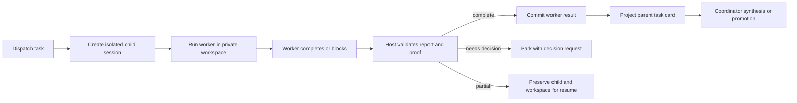

# Worker result contract

A worker result is the bounded, host-verifiable handoff from an isolated child session to its coordinator. It says what the worker concluded, what changed, what evidence exists, and whether the same child can safely advance, needs a decision, or remains partial.

**See also:** [Coordination](coordination.md) · [Grounding](grounding.md) · [Tools](tools.md#worker-scope-coordination) · [Session](session.md)

**Machine truth:** `lycaon/internal/session/worker_completion.go` · report, proof, and summary in `lycaon/internal/session/workercompletion/` · finalizer in `lycaon/internal/session/workercloseout/` · the parent `<task>` block in `lycaon/internal/workercompletionxml/` · status vocabulary in `lycaon/pkg/api/session_types.go`

The contract separates three layers:

| Layer | Authority | Purpose |
|---|---|---|
| Worker report | worker, validated and bounded by host | findings, summary, requested decision, claimed outcome |
| Host proof | execution, workspace, and evidence records | actual changed paths, receipts, revisions, artifacts, merge state |
| Parent projection | parent session | one repairable task card that the coordinator and Den consume |

The worker may explain its work. It may not certify facts the host can observe directly.

## Why the handoff is structured

Worker transcripts are long, private, and full of dead ends; copying them into the parent would destroy isolation and overwhelm coordinator context. Passing only prose would leave the coordinator unable to distinguish a verified result from a confident claim. The handoff therefore combines bounded narrative with typed identity and host proof:

```text
worker explanation + host-observed proof -> committed result -> parent projection
```

Anything omitted for context remains addressable through recall; anything required for a gate must be present as structured host state.

## Lifecycle



Child identity (parent session, job, task, and agent type) is committed before the worker loop starts. The worker's messages and tools remain in the child session and are never spliced into the parent transcript.

## One parent-card projection

Every admitted worker job has one task row in the parent transcript. While the job runs, the row says it is enqueued or active. A decision suspension patches that row with the durable checkpoint; terminal settlement patches the same row with the final worker summary. The row does not move, duplicate, or remain stuck on an enqueue placeholder after a result exists.

The card is authoritative for presentation identity, not execution truth. The worker job, its append-only attempts, and its immutable terminal result are authoritative. If the result commits and the card patch is interrupted, outcome delivery repairs the same card from the result; the worker is not rerun and the result is not downgraded.

For a completed job with a current merge status, Den uses that job state for the card badge. A later promotion therefore changes an `open` card to `done` even though the immutable completion summary still records the branch as open. Without current merge state, the persisted summary is the fallback.

`needs_decision` is not a terminal worker result. It holds the job and workspace, records the attempt as suspended, and delivers a repairable parent checkpoint. A decision answer resumes the same semantic job with a new attempt; only its eventual completion, failure, or cancellation occupies the terminal-result slot.

A dispatch rejected before enqueue may remain verbose-only because no worker ran. Once a job is admitted, its outcome is normal transcript history even when it fails, is canceled, or needs a decision.

## Cancellation and retry

An immediate stop records durable cancellation intent before interrupting execution. That intent fences claims, retries, completion, failure, decision suspension, and wait resumption. The host joins the worker runtime, observes its final changed paths, then commits one canceled result and releases the workspace. If interruption or runtime release fails, the intent remains recoverable; an abandoned cancellation cannot become another execution attempt after restart.

Workflow pause and stop commit that same intent with the workflow transition and retain the active attempt until runtime settlement; resuming a workflow cannot release a worker whose cancellation was already requested. Parked waits participate in cancellation, and one failed cleanup does not prevent the remaining jobs from settling.

Worker self-cancellation is bound to the current claim, like completion and failure, so a stale attempt cannot cancel its replacement. Typed cancellation takes precedence over a competing provider response. Provider response recovery owns its bounded replay budget; exhausting it does not authorize the worker queue to restart the job.

## Result shape

| Part | Meaning |
|---|---|
| Identity | job, child session, agent type, task/delegation ids |
| State | one value of `api.WorkerSummaryStatus`, the closed execution vocabulary |
| Summary | bounded explanation of the result and next consequence |
| Report | leg status, findings, brief, obligations, and decision request |
| Proof | changed paths, workspace state, tool receipts, artifacts, and merge status |
| Hint code | structured reason when the result needs remediation |

The wire fields are schema-defined (`docs/openapi/components/schemas/session/worker-reports.yaml`). The parent-visible body is marked as untrusted tool data when sent to the model. Host gates read the structured tag and proof, never the prose body.

## Worker report vs host proof

The worker supplies judgments that require reasoning: a concise summary and findings, which evidence supports each finding, unresolved questions and decision options, limitations and recommended next work, and its intended leg status.

The host supplies facts it can observe: files changed in the worker workspace; whether the workspace is dirty or promotable; tool and verification receipts; source revision and root digest; visual artifact ids; whether evidence obligations are current; and whether the overlay is pending, promoted, rejected, or retained. Worker-supplied copies of host-observed fields are discarded, so each fact has one authority.

## Changed paths

Write-capable workers mutate an isolated overlay. The host computes changed paths from the overlay diff against the task's starting baseline. After branch isolation is claimed, a worker write that would reach the primary tree is rejected.

The starting baseline is an immutable manifest captured from the prepared worker branch before execution, including edits inherited from a parent worker. It uses the worker's file inclusion rules, independent of Git ignore rules and scanner admission. Job rows store a host-local manifest reference; metadata lives in an indexed SQLite manifest (`worker_baselines`, `worker_baseline_objects`) and eligible merge content lives in the shared content-addressed object store. Capture and comparison do not assemble all file bodies in memory; merge assessment loads only the baseline bodies it needs.

The worker row retains that manifest and its objects through retries, restart, pending promotion, and branch cleanup. Durable-data clears preserve the manifests, and backups retain referenced files until archive creation finishes. Deleting the worker releases its object references; maintenance reclaims abandoned captures in bounded batches. An absent or unreadable baseline is not an empty baseline: it prevents automatic promotion and keeps unresolved work open. Files beyond the text merge limit and non-text files remain observed, with explicit conflicts when their content would be needed for a text merge.

The overlay diff is therefore the complete record of worker mutations. A read-only leg, or a write leg that never claimed a branch, has no changed paths. The worker cannot add, omit, or rename entries in that proof through its report. Promotion consumes the same overlay identity and merge status; a completed report does not itself authorize promotion.

Promotion commits the complete changeset atomically. Compatible three-way edits merge automatically; overlapping text edits and opaque files require explicit resolution. The host neither prefers the worker's bytes over conflicting primary changes nor silently drops opaque worker changes. An unresolved conflict leaves clean and already-resolved paths unlanded; all remaining choices must be supplied together, and failed preparation or durable commit preserves the primary files.

Open editor documents at the landing paths are part of that commit. Before any bytes land, the host reserves their sources so external observation cannot import the promoted bytes first and strip their job attribution. Document heads and job-attributed text contributions are written in the promotion transaction, ahead of the source records that reference them; editor change notifications publish only after that transaction commits. A failed promotion rolls back the landed bytes, discards the staged imports, and releases the reservation.

## Evidence obligations

A source mutation creates a source-verification obligation. It is satisfied only by a host receipt for a completed check whose verdict passed against the current worker source revision and root digest.

The worker declares the scope it validated at in `complete_leg.verification`: a `method` of `inspection`, `targeted`, `project`, or `blocked` (`internal/verification/assessment.go`), plus a `reason`. An assessment missing its reason, or naming a method outside that set, is treated as absent. The declaration is a claim about coverage, not a waiver: it selects which receipts count toward the obligation, so `targeted` admits scoped checks and `inspection` admits the closeout read-back itself, while `blocked` carries the worker's stated reason onto an obligation that stays unmet. The obligation is host-computed either way, and a workflow gate is unaffected by what the worker declared.

A later mutation makes the earlier receipt stale. A check stopped by confinement is `unverifiable`, not passed or failed. Narrative test output, a worker assertion, or a checkpoint state cannot discharge the obligation. Projects with a declared verification command require a matching receipt for that command; without one, an admitted repository command may provide the receipt only under the project's verification policy.

Unmet validation remains visible as advisory evidence; it does not by itself downgrade completed delivery or prevent promotion. Incomplete delivery remains partial and resumable. Explicit workflow verification gates independently require their declared evidence on the integrated source.

## Status model

Three closed vocabularies describe one worker. The worker's own verdict on its assignment is the report's **leg status**: `complete`, `partial`, or `blocked` (`internal/session/workercompletion/leg_status.go`). The host's record of how execution settled is **`api.WorkerSummaryStatus`**: `complete`, `partial`, `failed`, `canceled`, `held`, `open`, `needs_decision`. Den renders a third, narrower set for the row a person sees. A worker may report `blocked` on a leg the host settles as complete; `blocked` never appears as an execution status.

| Condition | Execution status | Consequence |
|---|---|---|
| Report complete, obligations satisfied, overlay resolved | `complete` | eligible for synthesis; promotion still checks overlay proof |
| Report complete but the overlay is still open or awaiting promote | `open` | a success state, held back from promotion until the overlay resolves |
| Missing or stale evidence, or a recoverable report defect | `partial` | resume the same child and workspace |
| A decision is required before the assignment can continue | `needs_decision` / `held` | suspension, not settlement: the job and workspace are preserved |
| The run could not settle, or was stopped | `failed` / `canceled` | preserve the trace; the coordinator decides retry, replace, or discard |

`ResolveWorkerSummaryStatus` (`internal/session/overlay_promote.go`) rewrites a `complete` report to `open` whenever the overlay is still open or awaiting promote, so a worker that did everything right reads as `open` until integration. `api.WorkerSummaryLegSucceeded` treats `complete` and `open` as the two success states, which keeps an unpromoted overlay out of the failure bucket.

## Bounded summary

Every narrative and list field has a per-field cap, followed by a live total budget derived from the active model window. The worker gets one structured opportunity to shorten an oversized report. If it still exceeds the budget, the parent receives a partial result with `WORKER_SUMMARY_TOO_LONG` rather than silent truncation of required fields. Typed identity, leg status, host proof, obligations, and decision state are always delivered.

## What the cap drops stays addressable

Worker observations are indexed under the root session tree, including completed and archived children. The coordinator reads the bounded result first and uses [recall](search.md#recall) for omitted detail. The result envelope is the push channel for gate-critical facts: recall cannot repair a missing required field after the host has accepted the result. A recalled observation remains attributed to the worker session and carries its currency; it is survey evidence, not a first-hand coordinator observation.

## Completion path

Workers close through the structured `complete_leg` tool. The tool records an immutable argument snapshot; its human-readable acknowledgement is not the completion record and may be compacted. `leg_status` is the only field the tool refuses to run without.

A pending decision outranks every report. The finalizer checks for one before it looks for a `complete_leg` call and again after the closeout attempt, because a closeout turn can itself raise a decision. Either check returns `needs_decision` and discards a computed outcome.

With no decision outstanding, the finalizer resolves a report in this order:

1. latest accepted `complete_leg` arguments;
2. strict envelope-only completion JSON from the terminal worker turn;
3. one host-requested closeout turn that offers only the completion path;
4. bounded synthesis from the child's observed tool transcript;
5. partial result with `WORKER_COMPLETION_REPORT_MISSING` if no valid report exists.

Every successful route is normalized by the same decoder and caps. Mixed prose plus JSON is rejected rather than guessed apart. The fallback preserves work after provider interruption or malformed closeout; it does not let the host fabricate findings or a passing verification receipt.

## Grounding validation

Before the result reaches the parent, the host resolves citations and evidence claims against the child session's evidence ledger. Typical structured failures are an unknown evidence handle, a URL the worker never observed, or a survey result with no survey evidence.

Retry is bounded by aggregate friction, same-code repetition, and whether the failure can be repaired inside the child session. A retry considers only a fresh report from that retry turn. If the retry budget is exhausted, the host may assemble a bounded summary from evidence the child actually observed; that result is labeled host-assembled and does not claim traced worker wording.

## Typed findings

Source findings use a semantic citation rather than an ephemeral handle counter:

```json
{
  "path": "internal/foo/bar.go",
  "line": 42,
  "excerpt": "return nil",
  "note": "Why this matters",
  "claim": "vulnerability",
  "adversary": "unauthenticated client",
  "precondition": "public listener",
  "severity": "high"
}
```

| Field | Meaning |
|---|---|
| `path` | project-relative source identity; what makes the finding resolvable |
| `line` | optional 1-based location |
| `excerpt` | source text used to resolve the citation |
| `note` | worker interpretation |
| `claim` | optional closed claim class |
| `adversary` / `precondition` | threat-model context where applicable |
| `severity` | retained only for vulnerability claims |

A finding is dropped only when it carries neither a path nor a note. That is permissive by design, not an invitation: a finding without a path is an assertion the host cannot resolve, so a worker that wants its observation to survive grounding supplies one. The finding schema is closed; the `evidence` handle is host-minted on the way out, and a report that supplies it is rejected.

The host resolves the path, line, and excerpt against observed evidence. An unobserved path is unverifiable and blocks the finding. A paraphrased excerpt may remain traced rather than exact; the result states that weaker currency. Unknown optional claim vocabulary gains no special security meaning.

## Delegation grounding

The worker result proves that a particular job ran and produced a particular host-bound outcome. Coordinator prose about delegation proves nothing by itself. The grounding gate correlates job, child session, agent type, task/delegation ids, state, and envelope identity with the worker ledger, reading structured tags rather than summary text. Completion criteria declared at dispatch add deterministic checks. During synthesis the coordinator may cite the worker result and reacquired child evidence, but it must preserve attribution and may not upgrade a partial or unverified outcome through wording.

## Parent wake and presentation

After the parent-card projection is patched, a separate outcome event wakes the coordinator. The wake is a scheduling signal; the committed worker result, or the held decision checkpoint, is the execution record.

Den derives its row state from the same structured outcome (`lycaon-den/src/chat/worker/workers-model.ts`), collapsing the execution vocabulary into what a person needs to act on: running, needs decision, done, partial, open, canceled, or error. A held job is still in flight, so it reads as running while the live job row exists; `failed` reads as error and `canceled` keeps its own neutral state. Only when the row must be rebuilt from a summary tag alone, with no live job to consult, does a held tag fall into error. A `complete_leg` acknowledgement remains a generic tool row inside the child; the parent task card shows the host-built summary.

## Invariants

- Worker execution stays in an isolated child session and workspace.
- One admitted job has one stable parent task-card projection.
- The worker supplies explanation; the host supplies observable proof.
- Changed paths derive from the overlay, never the worker report.
- Verification receipts bind to the current source revision and digest.
- Gate-critical fields are bounded but never silently dropped.
- Omitted detail remains recallable with worker attribution.
- Partial results preserve resumable work and do not authorize promotion.
- Grounding and synthesis branch on structured identity, evidence, and receipts, not prose.
